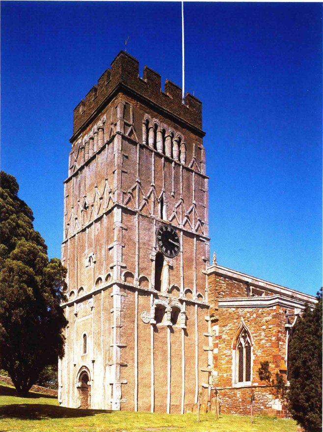
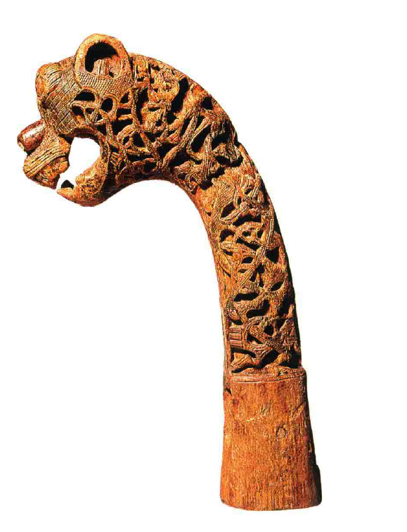
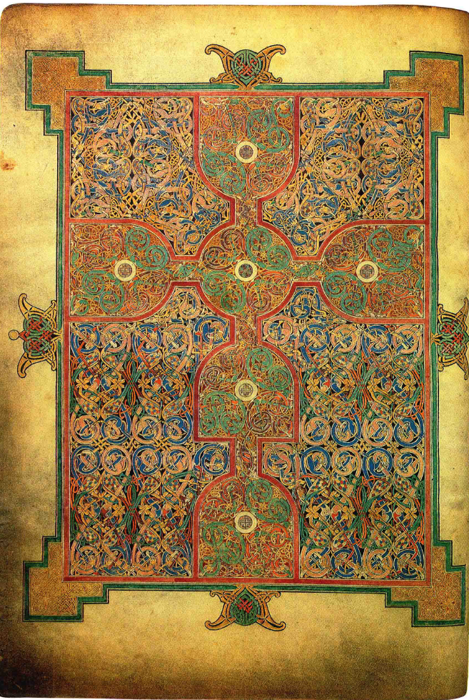
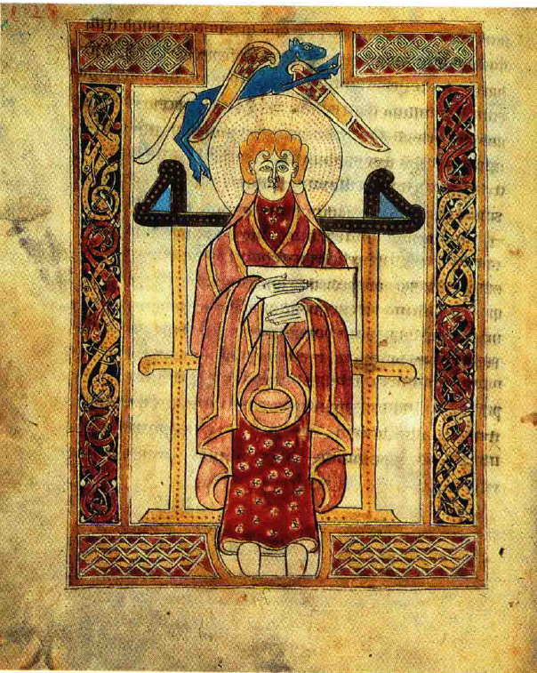
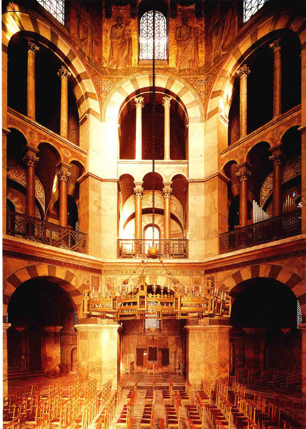
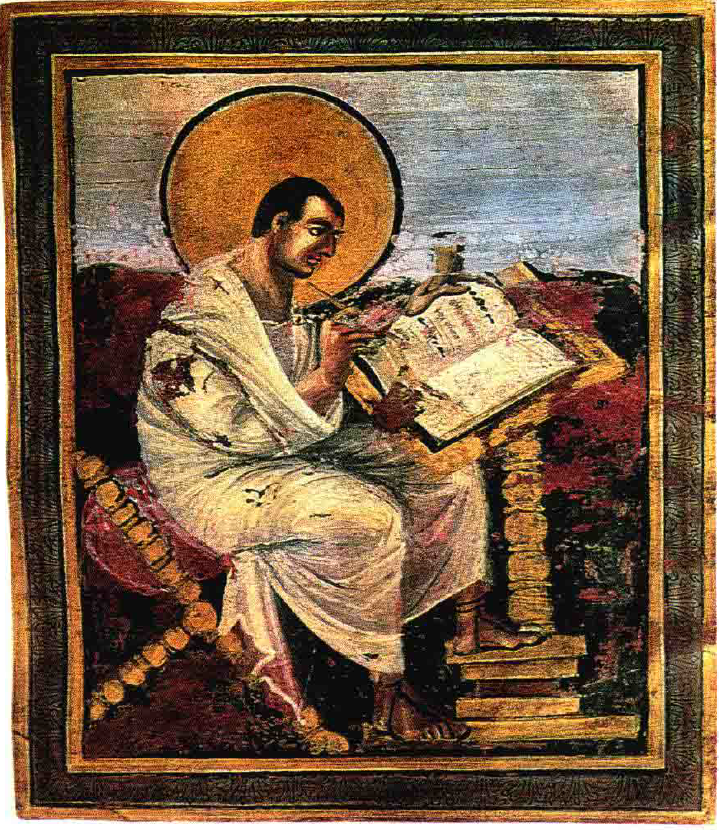
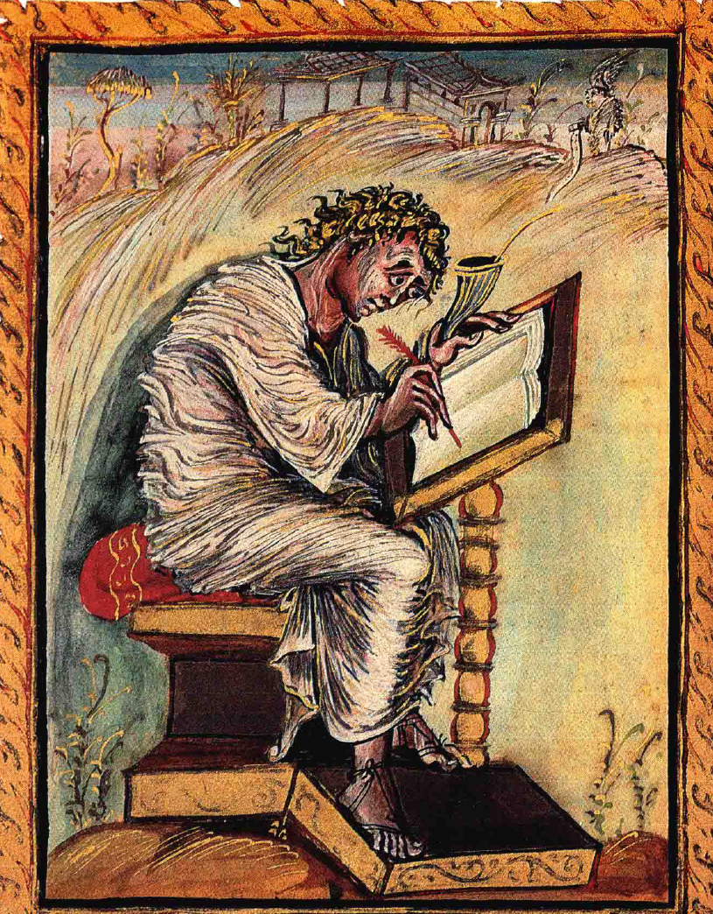
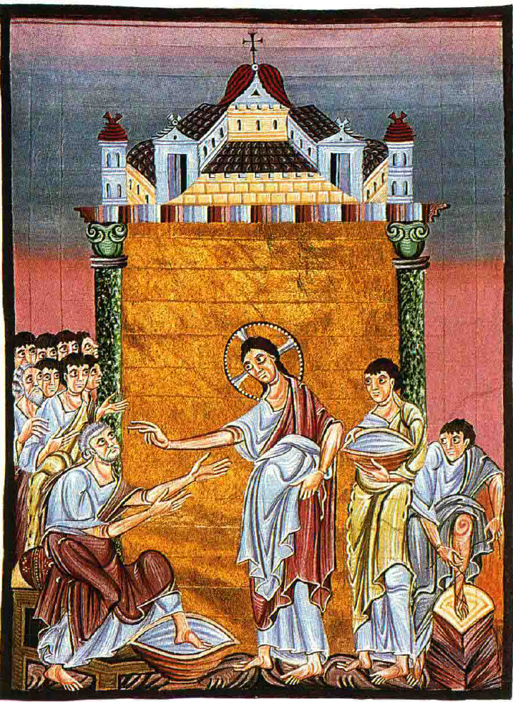
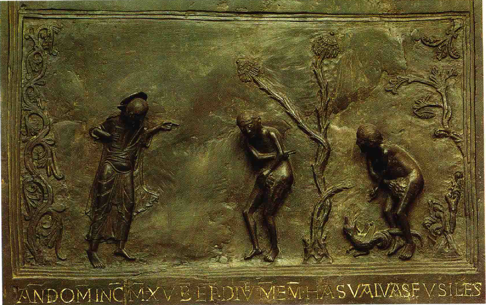
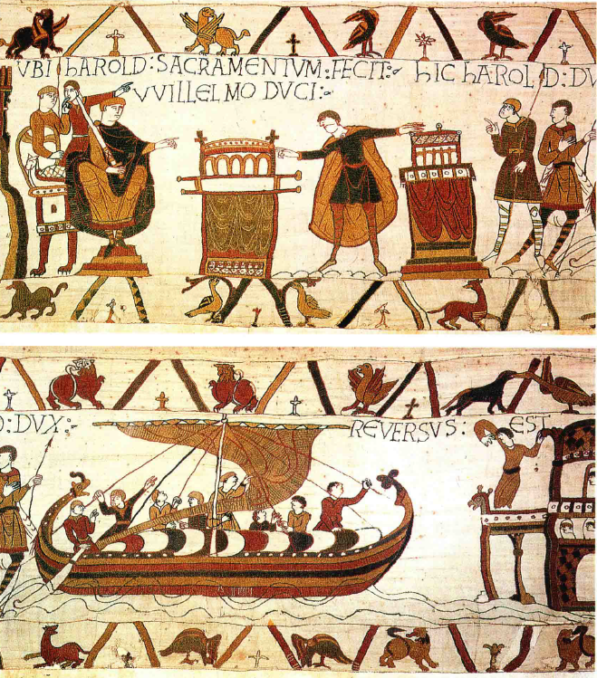

# 中世纪早期
## 西方艺术的转变与黑暗时期
### 君士坦丁时代之后的艺术变化
- 格列高利大教皇认为图像**有助于传授圣训**，导致艺术必须顺应其观点
- 早期基督教时代后，跟随的是被称为**黑暗时期**的**罗马帝国崩溃后时期**

### 黑暗时期的定义及特点
- **黑暗时期**（Dark Ages）大约从**公元500年**到**公元1000年**，这一时期经历了**频繁的迁徙、战乱和动荡**
- 这个时期被视为**黑暗的**，不仅因为社会动荡，也因为古代社会衰落，新旧交替，造成了**混乱和迷惑**
- 艺术风格**多样而冲突**，直到**时期末尾**才开始出现融合

### 黑暗时期的艺术和学问
- 修士院和修女院中有人**赞赏并保存古代作品**
- 尽管遭受北方侵略者的战争和侵略，一些学者和艺术家试图**复兴古典艺术**

### 北方条顿部落的艺术
- 包括**哥特人**（Goths）、**汪达尔人**（Vandals）、**撒克逊人**（Saxons）、**丹麦人**和**维京人**（Vikings）等，他们的入侵被视为对古典文学艺术的破坏
- 尽管被视为野蛮，这些部落也有**自己的艺术，**例如精细的**金属工艺**和**木刻技术**
- 他们的艺术包括**复杂的图案和动物形象**，可能具有**法术和宗教意义**

### 7世纪和8世纪的英国和爱尔兰写本
- **英国和爱尔兰的写本艺术**在7世纪和8世纪达到顶峰，如《**林迪斯法恩福音书**》（Lindisfarne Gospels）

- 这些写本特征为**复杂的图案和装饰**，显示出高度的技艺和创造性
- 艺术家们通过**改造《圣经》中的形象**，创造了独特的人物和图案表现

### 艺术的新成分和西方艺术的发展
- 本地艺术家的**技能和创新**为西方艺术带来了新元素，避免了完全沿袭拜占庭艺术的发展路径
- 古典传统与本地艺术的结合催生了西欧艺术的新发展，形成了**独特的西方艺术风格**

## 加洛林文艺复兴
### 查理曼王朝的艺术复兴
- **查理曼**自认为是罗马皇帝的继承人，急切地**复兴了罗马的技艺传统**
- 公元800年左右，在**亚琛**（Aachen）建造了一座模仿**拉文纳古教堂**风格的教堂，展示了**对古典艺术成就的尊重和继承**

### 中世纪艺术家的创新理念与实践
- 当时的艺术观念与现代强调“创新”的理念不同，更多地基于**模仿和沿用古典样式**
- 中世纪艺术家和他们的赞助人重视使用**珍贵材料**和遵循**著名古老样板**的传统，以正确表现宗教故事和人物
- 尽管重视传统，艺术家仍**有空间展现个人技艺**，类似于音乐演出中对古典名曲的个性化演绎

### 查理曼时代《圣经》插图的比较
- 查理曼王朝时期《圣经》中的插图，如**圣马太写福音书**的场景，展现了对古典艺术风格的**忠实模仿和个性化创新**

- 9世纪另一《圣经》的插图中，圣马太被描绘为**受到灵感激励**的样子，用**弯曲的线条和曲折的衣褶**表现出**极度振奋的情绪**

- 这种个性化的艺术表现形式展示了中世纪艺术家不仅能忠实于古典样板，也能在其基础上表达**自己的感受和创新**

### 中世纪艺术的特色与发展
- 中世纪艺术家通过结合古代东方、古典时代艺术的技艺与北方艺术的风格，创造出**新的艺术风格**
- 他们不仅呈现了所**知道**（knew）和所**看见**（saw）的东西，还懂得在作品中表达自己**感觉**（felt）到的东西，为中世纪艺术领域带来了一种新的表现形式

## 中世纪艺术的宗教表达与创作意图
### 中世纪艺术家的创作目的
- 中世纪艺术家的主要目标不在于创造自然的真实写照或优美的形象，而是忠实地表述**宗教故事的内容和要旨**
- 在**表达宗教故事**方面，中世纪艺术家可能比其他时期的艺术家更为成功

### 泥金写本的宗教表达
- 公元1000年左右德国的一部福音书中，《**约翰福音**》讲述了**基督给门徒洗脚**的场景
- 艺术家通过**简化背景和强调人物姿态**来集中表现故事的核心含义，如圣彼得的**乞求**和基督的**施教姿势**
- 艺术表现聚焦于传达**神圣谦抑的要义**，即使细节如人物比例和空间布局**不完美**，也不影响其**表达目的的成功**

### 中世纪与古典艺术的联系
- 中世纪艺术虽然在风格和表现手法上与古典艺术有所不同，但仍然继承了古典时代表达"**心灵活动**"的艺术遗产
- 基督教**利用图画服务于宗教目的**的做法，与格列高利大教皇提出的**绘画对文盲之作用**同文章对识字者之作用等效的观念相呼应
- 追求表达清晰的目标不仅体现在绘画中，也体现在**雕刻作品**中，如**希尔德斯海姆教堂的青铜门嵌板**，通过简化的形象和场景集中表现故事要义

### 重点与简化在艺术表现中的应用
- 中世纪艺术通过**简化背景和细节**，强调人物的**动作和表情**，使得宗教故事的表达更为集中和有力
- 即使人物的比例和外观可能**不符合现代审美标准**，中世纪艺术作品仍能有效传达**宗教信息和故事情感**
- 这种以宗教内容表达为核心的艺术创作方式，展现了中世纪艺术家对于宗教信仰和教义传达的**深刻理解和尊重**

## 中世纪艺术的多样性与贝叶花毯
### 中世纪艺术不仅服务于宗教
- 中世纪艺术创作不限于宗教主题，**贵族和封建君主**也雇用艺术家进行**非宗教性的创作**
- 许多城堡和私人住宅的装饰因战争或过时被摧毁或拆除，与教堂相比，这些作品**较少保存下来**

### 贝叶花毯：一件中世纪杰作的保存
- **贝叶花毯**（Bayeux Tapestry）是一件杰出的**中世纪非宗教艺术作品**，保存因其被放置在**教堂**中而得以幸存
- 花毯讲述了**诺曼底公爵威廉征服英格兰**的故事，大约创作于**公元1080年前后**，内容生动，类似于古代东方和罗马的编年史画

### 贝叶花毯上的故事叙述
- 花毯上的图像和题词讲述了**哈罗德向威廉宣誓效忠**的场景，以及**哈罗德返回英格兰**的情形，表现方式**清晰直观**
- 花毯通过**简化的人物形象和经济的叙述手段**，有效地传达了历史事件，尽管**人物形象古怪**，但**叙事集中且难以忘怀**
- 尽管这一时期的中世纪艺术家**没有古代样板可供仿效**，他们的作品仍展现出**对重大史实的经济而集中的叙述方式**，效果深刻
