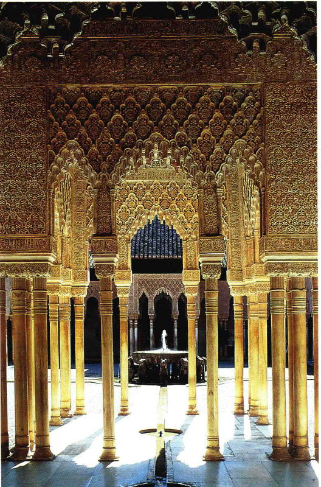
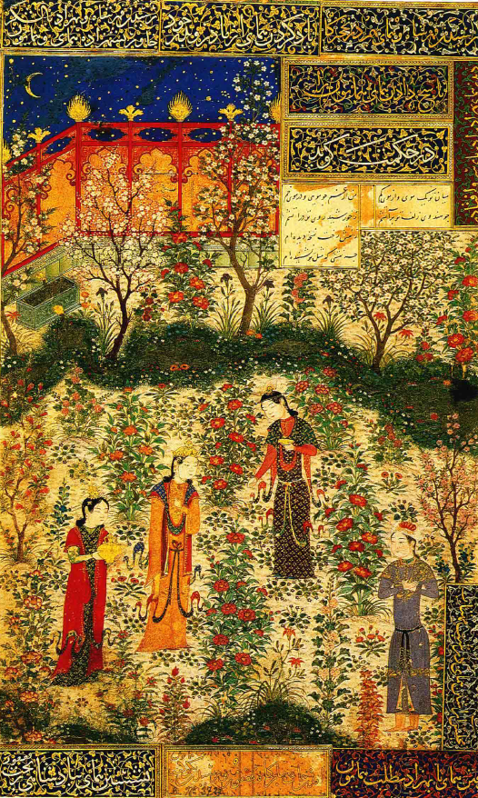
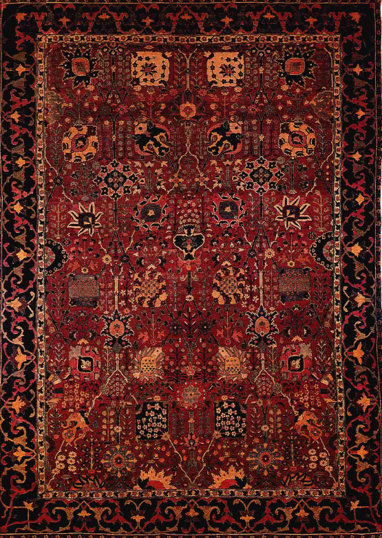
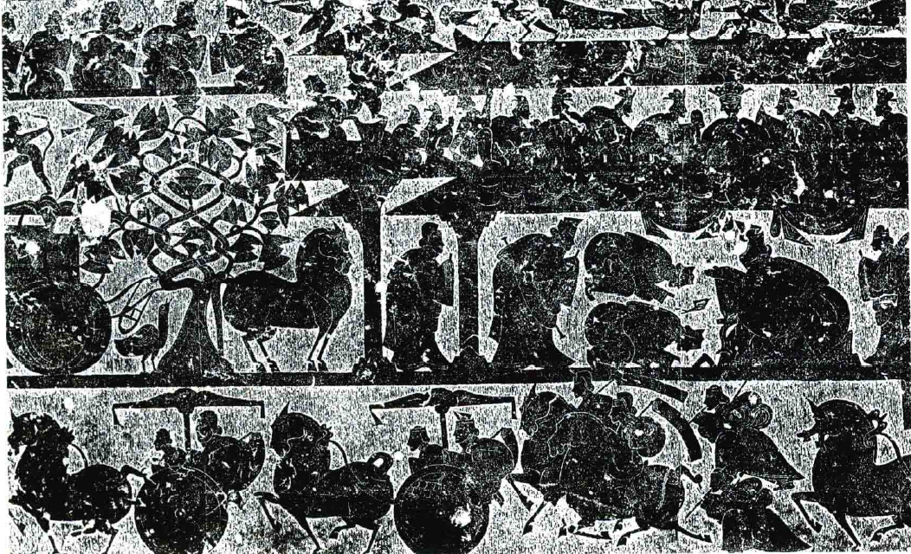
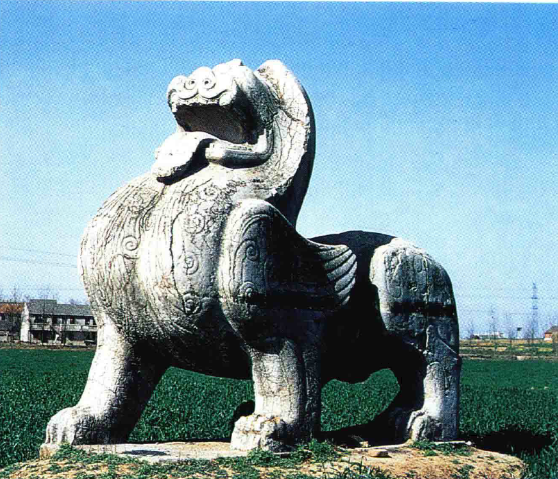
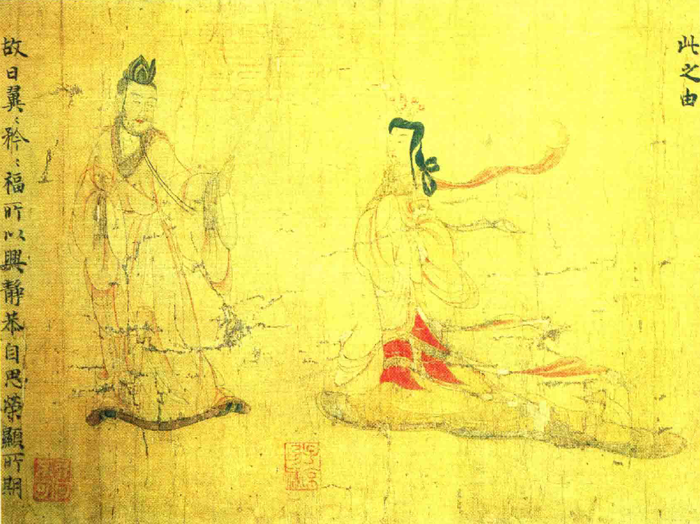
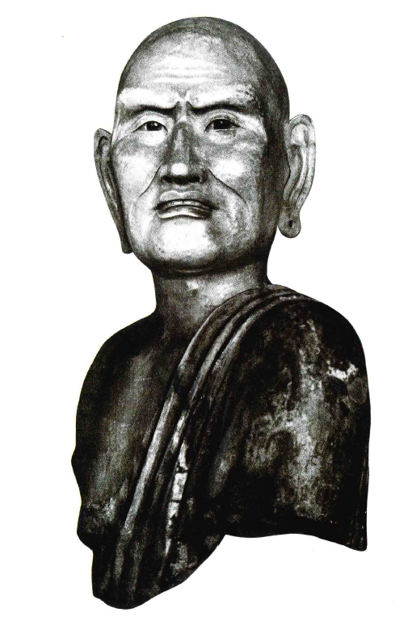
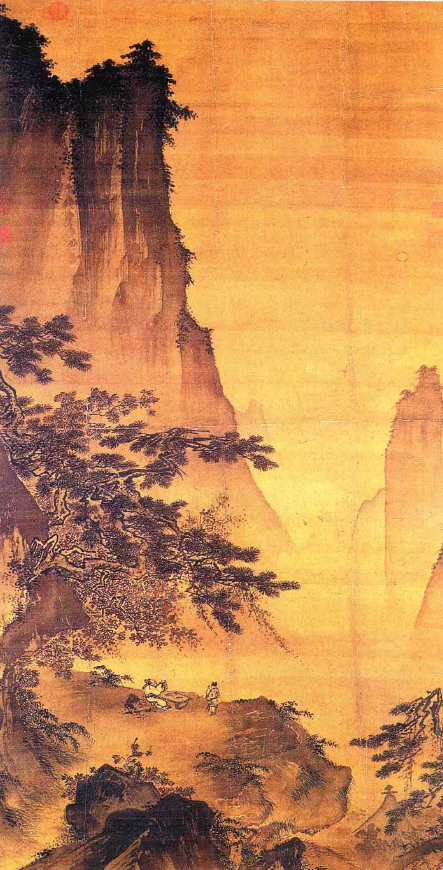
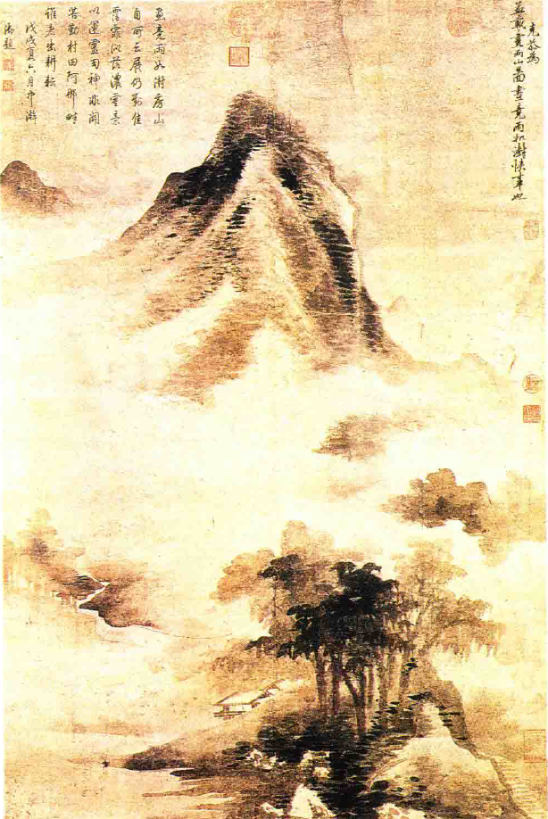
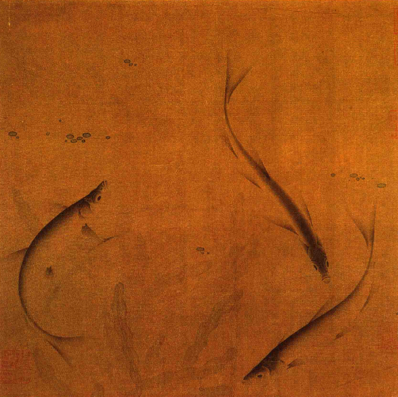

# 伊斯兰和中国艺术
## 伊斯兰地区艺术发展
### 伊斯兰艺术对图像的处理
- 伊斯兰征服者**禁止制作人物形象**，导致艺术家转向**抽象图案和形状**的创作
- 产生了**精细的花边装饰**，称为**阿拉伯式图案**（arabesques）
- **阿尔罕布拉宫**（Alhambra）和**东方地毯**展示了伊斯兰艺术家在**非具象设计**上的创新和技巧

### 伊斯兰宗派的艺术变革
- 部分伊斯兰宗派对制像的**禁令理解较为宽松**，允许制作**非宗教性质的人物画和插图**
- 从14世纪开始，**波斯和莫卧儿统治下的印度艺术家**为传奇、历史和神话作品制作插图，展现了**丰富的艺术成果**
- 波斯传奇写本中的**花园月夜景色插**图代表了这一时期艺术家在图案设计上的高超技艺

### 伊斯兰艺术的特色与影响
- 伊斯兰艺术通过**限制人物形象的创作**，促进了**抽象和几何图案设计**的发展
- 艺术作品中的**人物和植物设计**仿佛是从彩色纸上剪下来的，组成**完美的图案**，展示了非现实主义的艺术风格
- 这种艺术风格**与拜占庭艺术相似**，都追求**不现实的表现方式**，但伊斯兰艺术更加注重**图案的完美和想象力的激发**

#### 伊斯兰艺术与文化的传播
- 伊斯兰艺术的发展和创新不仅限于伊斯兰教区域，还通过**东方地毯**等途径影响了世界其他地方
- 伊斯兰艺术家的技巧和创造力证明了即使在**严格的宗教禁令**下，艺术也能找到**新的表现形式和发展路径**

## 中国艺术的早期发展
### 中国古代青铜器艺术
- 中国人早期精通**铸造青铜器**，一些青铜器可追溯至**公元前1000年**，甚至更早
- 这些青铜器多用于**古代神庙**，反映了中国古代文明的高度发展

### 中国绘画和雕塑的早期记载
- 公元前后的几个世纪里，中国**葬礼习俗**与埃及相似，墓室中有许多**生动的场景描绘**
- 这些描绘展现了中国古代人们的生活和民俗，是中国艺术早期发展的重要证据

### 中国艺术的特点
- 与埃及艺术相比，中国艺术家更偏好**弯曲的弧线**，更注重**流畅和优雅的形式**
- 在表现飞跃的马或其他动物时，常用**圆形组合**来描绘，赋予作品**动感和活力**
- 中国雕刻表现出**回环旋转**的特点，同时保持**坚固和稳定感**

### 中国画卷的文化价值
- 中国古代贤哲视艺术为**工具**，用以提醒人们回忆过去**黄金时代的美德**
- 最早的中国画卷之一，描绘儒家思想中的**贞妇淑女**，展现了中国艺术的高贵和优雅
- 这些作品在姿势和布置上**清晰明确**，体现了中国艺术家在表现运动和情感方面的高超技巧

#### 具体艺术作品示例
- 一幅画卷描绘**丈夫无端责怪妻子**的场景，展示了中国艺术家对**起伏线条的运用**，赋予画面**运动感和生动性**
- 这幅作品表明中国艺术家早已掌握了表现运动的复杂艺术，无生硬之感

## 佛教对中国艺术的影响
### 佛教雕像的特点
- 佛教雕像展现了**逼真的形态**，使用**弧线轮廓**，但未歪曲真实形状，每个部分**和谐统一**
- 即使在真实的面部描绘中，仍然可以发现**原始面具的古老原则**

### **中国艺术中的宗教与审美**
- 中国贤哲视艺术为提醒人们回忆过去美德的工具，与格列高利大教皇的观点相似
- 佛教通过提供**新的艺术任务**和**尊重艺术家的成就**，改变了对绘画的态度，将画家视为与诗人**同等重要的艺术创造者**

### **中国绘画的精神训练和创作方法**
- 中国宗教强调通过**参悟自然界事物**来**深化对宇宙真理的理解**，如水和山的参悟
- 艺术家通过**参悟和凝神**的方式学习艺术，先**学习名家作品**，再通过**自然观察**来体会山水的意境
- 中国大师力求掌握**运笔用墨的技巧**，以**快速捕捉**灵感所至的景象

### **中国风景画的目的和欣赏**
- 中国风景画旨在**辅助参悟**，而非**直接叙述宗教故事或宣讲具体教义**
- 艺术家以**毕恭毕敬**的态度画山水，作为**深思的材料**，画作通常在**安静时刻**被观赏
- 中国艺术家**不追求细节的现实描绘**，而是通过**简化的自然元素**来表现运动和情感

### **中国艺术的风险与转变**
- 传统的绘画方法可能导致艺术成为**复杂的游戏**，缺乏**新的灵感和创造力**
- 18世纪，**日本艺术家**开始将**东方画法**应用于**新题材**，与西方艺术的新接触富有成效
- 这些新实验对西方艺术也**产生了重要影响**，促进了艺术的交流和创新
