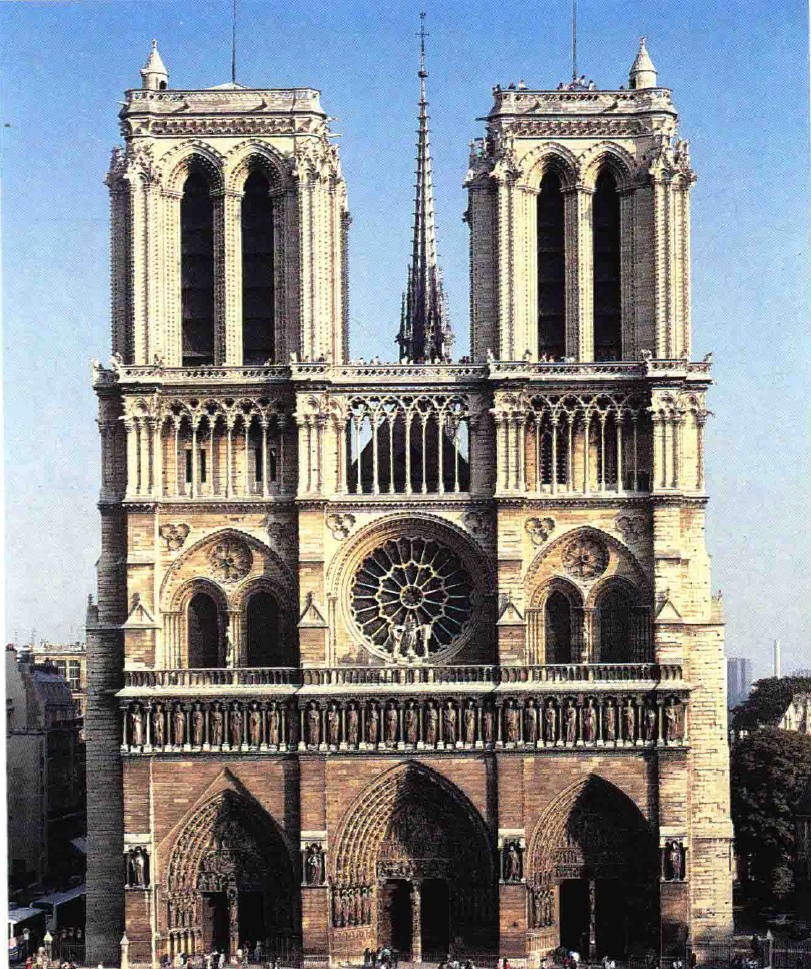

# 哥特艺术
## 哥特式风格的探索与变革
### 西方艺术的探索精神
- 西方艺术不断寻求**新的处理方法和观念**，与东方**几千年持续的风格**形成鲜明对比
- 罗马式风格的流行甚至未能持续至**12世纪**，便有新思想出现

### 哥特式风格的诞生
- **哥特式风格**原理产生于法国北部，初看似乎是技术发明，但影响深远
- **交叉拱**（Gothic arch）是其主要特征，允许建筑**去除多余的墙壁**，使用**细长的立柱**和“**肋**”作为支撑
- 引入了**大窗户**，使得教堂内部光线充足，外观更加轻盈

### 技术创新
- 哥特式建筑摒弃了**罗马式的圆拱**，采用**更灵活的尖拱**（Pointed arch），允许**变化拱顶的形状和高度**
- 尖拱除了美观，还具有**更好的结构性能**，能有效分配压力
- 引入**飞扶垛**（Flying buttress）以维持高大拱顶的稳定，形成独特的哥特式支架结构

### 艺术表现
- 哥特式教堂不仅是**工程成就**，也是**艺术创造**
- 内部结构由**细长的柱身和拱肋**组成，形成**复杂而美观的网状结构**
- 窗户上的**花饰窗格**（Tracery）增添了**细腻的装饰效果**，展现了设计者的创意与胆量

## 哥特式主教堂的宏伟与艺术创新

### 12世纪晚期和13世纪早期的主教堂
- **主教堂**（cathedral）设计**大胆宏伟**，完全按原计划完工的建筑**十分稀罕**
- 尽管经过**多次改建**，但其**内部宏伟空间**仍给人留下深刻印象

### 罗马式与哥特式的对比
- 罗马式教堂显示出“**战斗教会**”的姿态，提供**庇护所**，对抗**邪恶**
- 哥特式教堂给人的印象是**另一个世界**，仿佛将《启示录》中的**天国景象**带到人间
- 哥特式教堂的墙壁由**彩色玻璃**构成，**立柱、拱肋和花饰窗格**（Tracery）上金光闪烁

### 哥特式雕刻的新精神
- **沙特尔**（Chartres）**哥特式主教堂门廊**雕刻展示**圣经中的人物**，如亚伯拉罕（Abraham）、摩西、麦基洗德（Melchizedek）
- 比较罗马式和哥特式主教堂的门廊雕像，哥特式雕刻呈现出**更加生动活泼**的特点
- 雕刻不仅象征**神圣**，还展示**独立形象**，每个人物富有独特的尊严

### 斯特拉斯堡哥特式主教堂的雕刻艺术
- 展示《**圣母安息**》（The Death of the Virgin）主题，十二使徒围绕圣母，基督抱着圣母的灵魂
- 艺术家在**对称性基础**上注入**生命**，展示使徒和圣母的**表情**，通过衣饰褶皱展示**躯体结构**
- 哥特式艺术家从古代艺术学习，使形象**更真实可信**，但更关注宗教故事的**情感传达和教义启示**

## 13世纪的艺术探索与成就
### 瑙姆堡主教堂的雕像
- 约1260年前后，一位雕刻家为**德国瑙姆堡主教堂**（Naumburg Cathedral）雕刻的男女像**仿佛能走下台座**
- 雕像展现了当时**骑士和淑女**的真实写照，尽管艺术家只知道他们的姓名
- 这些雕像表现了艺术家**试图给石头灌注生命的努力**

### 北方雕刻家和画家的任务
- 13世纪北方雕刻家主要**为主教堂造像**，而画家多**为写本作插图**
- 通过比较12世纪的《**圣母领报**》与13世纪《**祈祷诗篇**》中的画作，可以看出**艺术风格的巨大变化**
- 13世纪的艺术家更注重**表现人物的感情**，而不是追求**逼真或详细背景的描绘**

### 中世纪艺术家的创作方法
- 中世纪艺术家的训练与现代艺术家**大不相同**，他们从**填充画面的次要部分**开始，逐步学习**表现圣母、使徒等主题**
- 即使在**表现特定人物**时，中世纪的肖像**并不追求真实性**，而是**程式化的表达**
- 13世纪艺术家**偶尔的写生行为**是因为**缺乏程式化图样的依赖**，如**马修·帕里斯**（Matthew Paris）画的**大象**表明了艺术家对比例的关注

### 意大利艺术的响应
- 13世纪**意大利**的艺术发展相比北方较晚，但**尼古拉·皮萨诺**（Nicola Pisano）开始模仿法国艺术家的作法，**结合古典雕刻方法**
- 尼古拉·皮萨诺**在比萨的作品**显示了他对古典和早期基督教雕刻的研究成果，使人物显得**既高贵又可信**
- 意大利绘画艺术由于受到**拜占庭风格的影响**，改革较为**缓慢**，直到13世纪末才开始有显著变化

### 雕刻与绘画的区别
- 雕刻作品因其**立体性**，容易在实际空间和光线中**展现逼真性**
- 与雕刻相比，13世纪的绘画**不追求真实感**，其布局和叙述原则受到**不同目标的支配**
- 北方绘画更注重**叙述故事和表达情感**，而非**景深错觉或明暗造型**

## 乔托：跨越艺术界限的天才
### 拜占庭艺术对意大利绘画的影响
- 拜占庭艺术虽然**生硬呆板**，但保存了**希腊化时期**画家的许多新发现
- **明暗造型和短缩法原理**的正确运用，为后来的艺术家探索新世界提供了方法
- **乔托**（Giottodi Bondone）便是那位能将哥特式雕刻家生动形象转化到绘画中去的天才

### 乔托的壁画创新
- 乔托的著名作品为**湿壁画**（fresco），尤以**帕多瓦**（Padua）**阿雷纳小教堂**（Arena Chapel）的圣母和基督生平故事最为人称道
- 在壁画下部，乔托画上了象征**善与恶的拟人形象**，如“**信德**”（Faith）拟人像，展现了**高贵与生动感**
- 乔托重新发现了**在平面上创造深度错觉**的艺术，使绘画不仅仅是文字的代用品，而是让宗教故事仿佛眼前发生

### 乔托与传统绘画的区别
- 与13世纪细密画相比，乔托的作品展现了**对场景和人物动作更真实的理解与表现**
- 他通过绘画让观众**感受到宗教故事的情**景，仿佛自己就在现场
- 乔托的人物表情和动作**更为自然、充满情感**，远超以往的程式化表达

### 乔托在艺术史上的地位
- 乔托的作品和生平故事**在佛罗伦萨受到高度赞誉**，开创了艺术史上**重视个人艺术家**的新篇章
- 从乔托开始，艺术家的名字和贡献**被记录和传承**，不再仅仅是无名的工匠
- 乔托不仅在绘画技术上做出了革新，也在**艺术家个人地位**的确立上开创了先河
