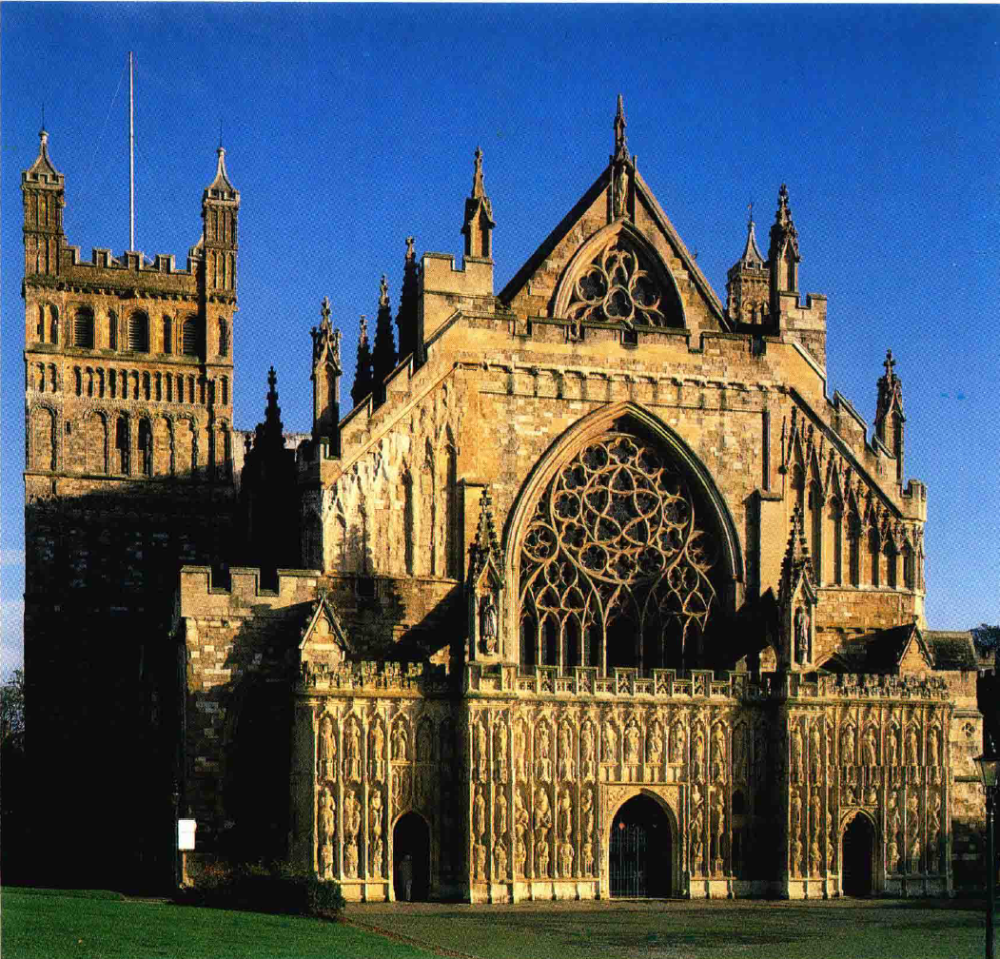
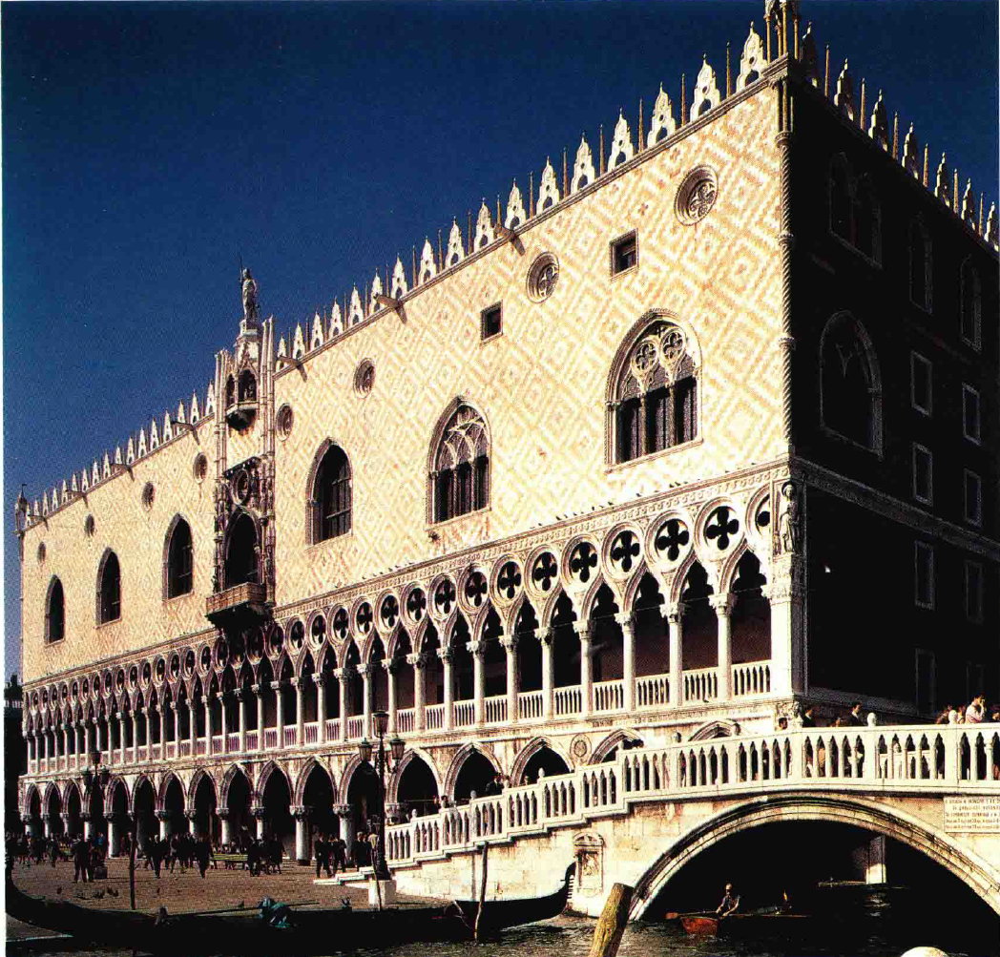
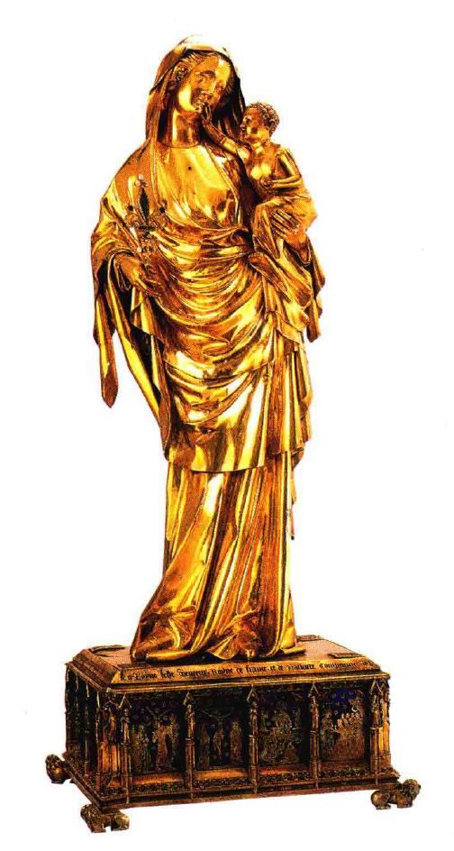
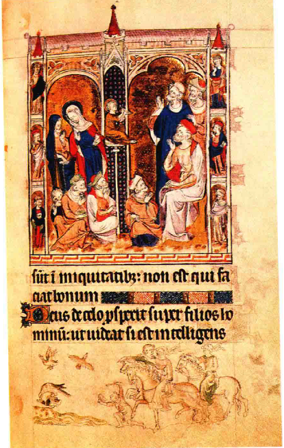
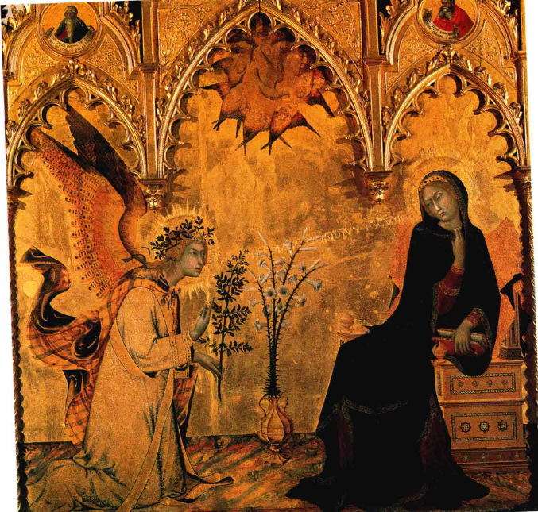
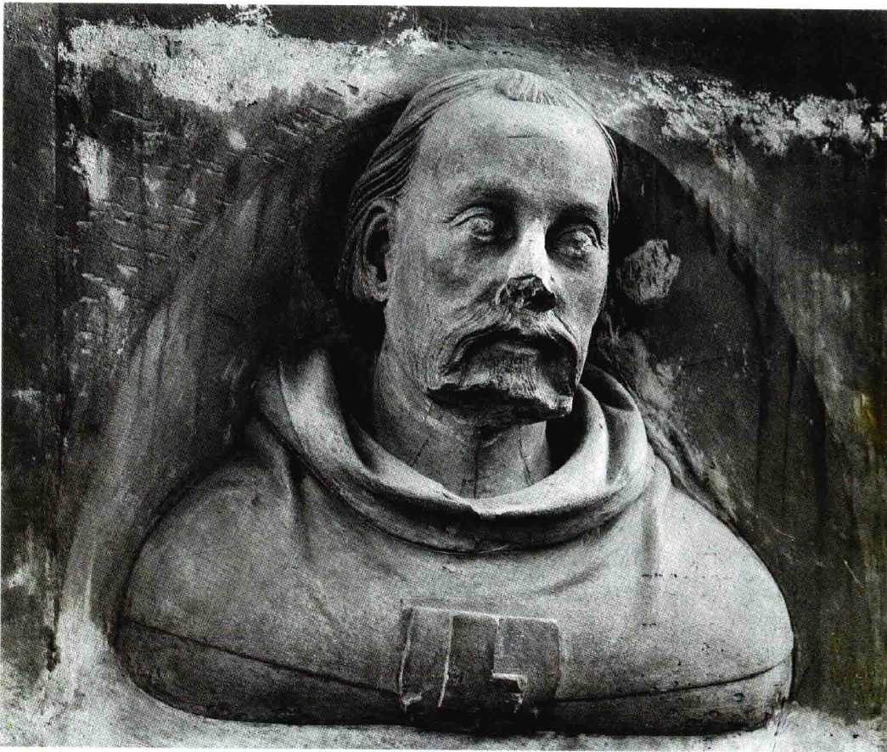
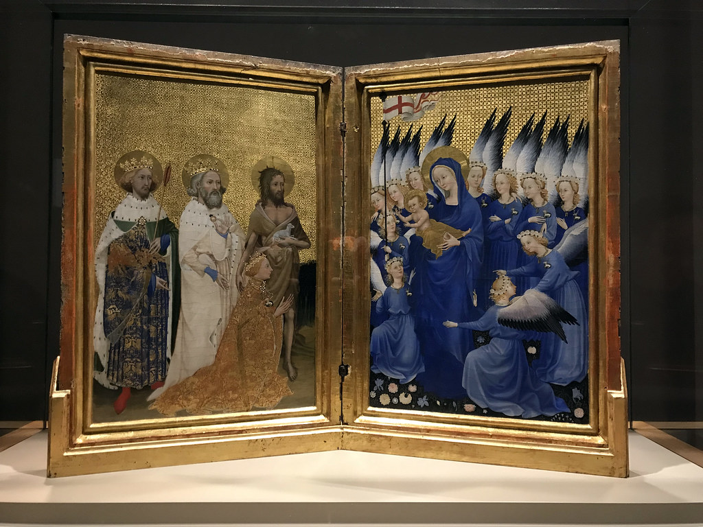
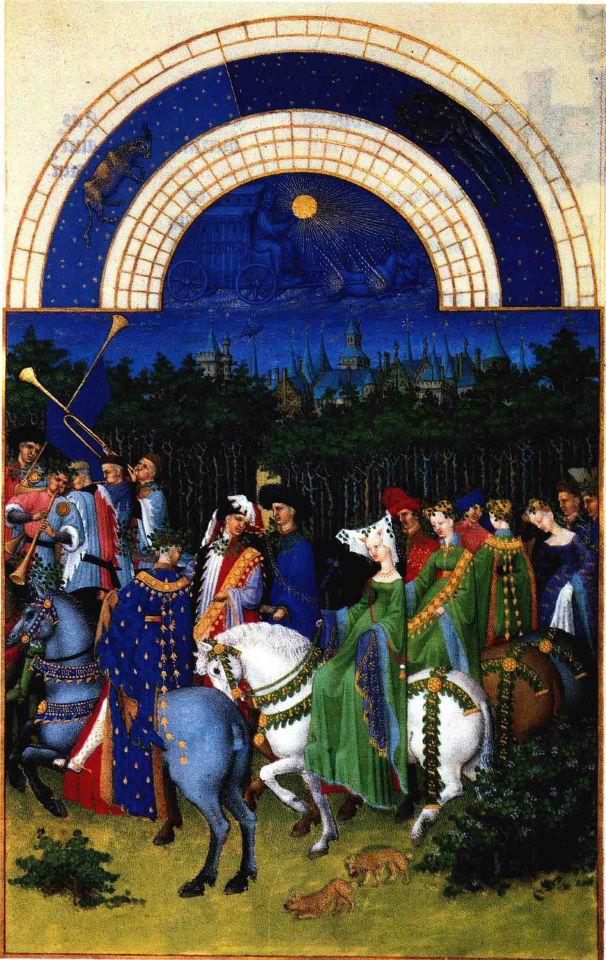
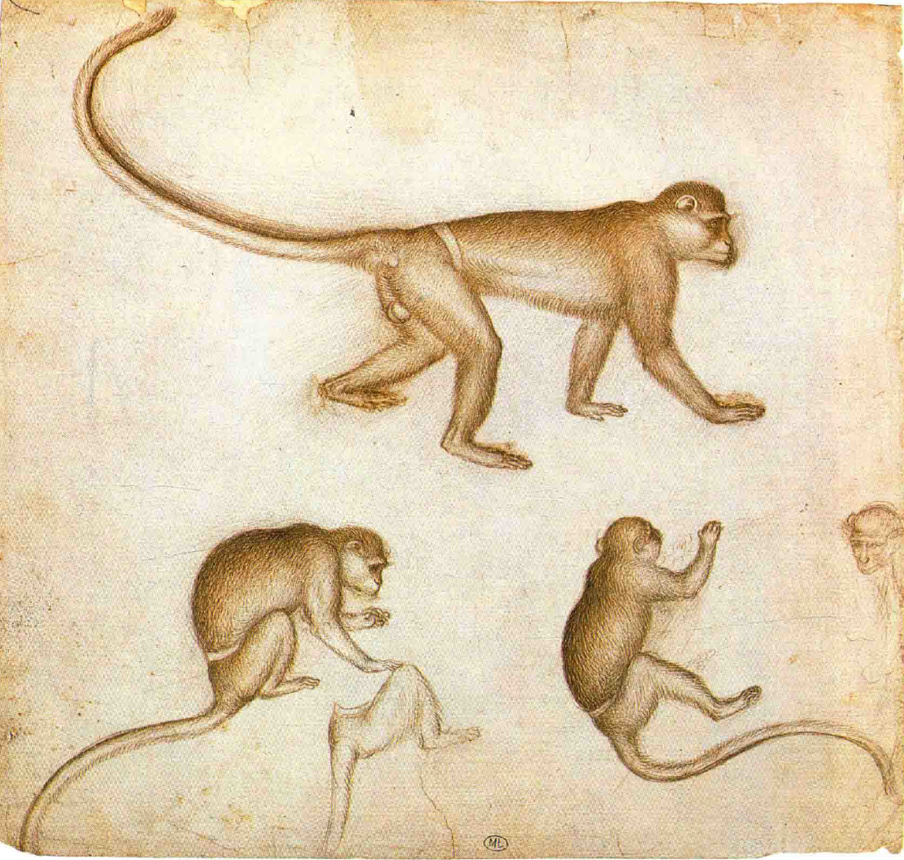

# 国际哥特式
## 14世纪的艺术转变
### 主教堂时代的变化
- 14世纪继续了**主教堂的建设**，但它们**不再是艺术的主要焦点**
- 社会经历了**巨大变化**，城镇发展成**商业中心**，市民寻求**摆脱教会和封建领主的约束**
- 风格上由**纯哥特式**（Early English style）转向更偏重装饰的**盛饰式**（Decorated style），如**埃克塞特主教堂**（Exeter Cathedral）西面的窗户

### 哥特式风格的演变
- 14世纪的建筑家转向设计**非宗教性建筑**，如市政大厅、桥梁和宫殿等
- **威尼斯总督宫**（Doges' Palace）是这一时期著名的非宗教性建筑，展现了哥特式风格**后期对装饰的偏爱**
- 哥特式建筑者虽偏爱装饰，但仍能达到**独特的壮丽效果**

### 14世纪的雕刻艺术
- 教堂仍是**石雕作品**的主要制作地，但更多特色雕刻作品用**贵重金属或象牙制成**
- 金匠制作的**小型银质镀金圣母像**成为私人祈祷的珍贵物品，与主教堂中的雕像不同，更注重唤起**人们的亲切感情**
- 这些作品展现了当时艺术家对细节的**精细加工和优美比例的追求**，如**圣母特殊姿势**和**与孩子的互动**，展现了哥特式艺术家的技艺和风尚

## 14世纪的绘画艺术变革
### 14世纪英国插图写本的特点
- 《**玛丽女王诗篇**》（Queen Mary's Psalter）中的插图体现了14世纪画家对优雅、精巧细节的偏爱
- **基督与犹太文士**的对话场景采用了**中世纪典型的教师姿势**，但人物比例和空间感的处理不够真实
- 同一页面下方的**日常生活场景**（放鹰捕鸭）显示出艺术家**对现实观察的细致入微**，与上方宗教场景形成鲜明对比

### 意大利艺术的发展与影响
- **乔托**（Giottodi Bondone）的艺术改变了**整个绘画观念**，使古老的拜占庭方式显得**生硬、陈旧**
- 乔托的创新观念在**阿尔卑斯山以北的国家**产生了影响，同时北方的哥特式画家的理想也开始影响南方的艺匠
- **锡耶纳**（Siena）艺术家如**杜乔**（Duccio）、**西莫内·马丁尼**（SimoneMartini）和**利波·梅米**（Lippo Memmi）在不彻底断绝拜占庭传统的情况下，尝试为其注入新生命

### 锡耶纳艺术家的创作特点
- 西莫内·马丁尼和利波·梅米的“**圣母领报**”画作体现了14世纪对优雅叙述和真实观察融合的趋势
- 作品**布局精巧**，人物形象虽**略带程式化**，但细节处理上展现了对**真实物体**（如花瓶、长凳、祈祷书）的**精确观察**
- 画作展现了锡耶纳艺术家如何在**保留中世纪传统技艺**的同时，逐步吸收乔托的真实表现手法，创造出具有**新时代特征**的作品

## 从中世纪到文艺复兴的艺术转变
### 艺术家与文人的交流
- 乔托与**但丁**是**同代人**，但丁在《神曲》中提到乔托，显示了**艺术与文学的交融**
- **西莫内·马丁尼**是**彼特拉克**的朋友，为其写的情诗中的劳拉画了肖像，标志着肖像画艺术的兴起
- 中世纪艺术家通常使用**程式化的人物形象**，但西莫内·马丁尼的劳拉肖像可能标志着**向真实肖像的转变**
- 布拉格的主教堂里现有一组奇妙的胸像，其中包括**小彼得·帕勒尔**（Peter Parler the Younger）的**自雕像**（self-portrait），它是现存的的**第一个**真正的艺术家的自雕像

### 国际式风格的形成
- 14世纪末的艺术风格被称为“**国际式风格**”，表现了欧洲艺术的相互影响和融合
- **波希米亚**成为**艺术传播的中心**，连接了意大利、法国、德国和英国
- **威尔顿双连画**（Wilton Diptych）是**国际式风格**的典型，可能由法国艺术家为英国国王理查德二世创作

### 观察自然与细节的新趋势
- 14世纪的艺术家开始更加注重**自然观察和生动细节的描绘**
- **林堡弟兄**的作品和其他细密画显示了从描绘**宗教场景**向描绘**现实生活场景**的转变
- 艺术家使用速写本**记录动植物**等自然细节，标志着对**描绘自然界**的深入研究和兴趣

### 文艺复兴的前奏
- 艺术家对视觉法则的探索和人体知识的积累为**文艺复兴的到来**铺平了道路
- 他们不再满足于描绘自然细节，而是开始追求**构成人体的科学和艺术**，如希腊人和罗马人所做
- 一旦艺术家的兴趣发生这种转变，中世纪的艺术就宣告结束，**文艺复兴时期开始**
