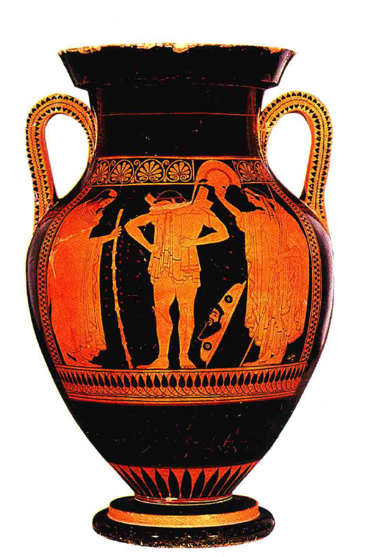

# 希腊早期

## 背景与早期文明

### 地中海东部文明
- 广阔的绿洲受太阳烈焰照射，仅**河水灌溉地区**能出产粮食
- 东方暴君统治下产生了**早期艺术风格**，延续了几千年几乎不变

### 希腊与小亚细亚的地理和文化差异
- 地中海岛屿和希腊、小亚细亚半岛享有**温和气候**
- 区域不受单一君主统治，为**冒险水手和海盗头子**的栖身之地
- 通过**贸易和海上劫掠**积累财富

### 克里特岛和迈锡尼文明
- **克里特岛**中心地位高，与埃及有联系
- 克里特艺术**影响了埃及**
- 岛上居民可能讲**早期希腊语**
- **迈锡尼**仿制克里特艺术品

### 希腊各部落的兴起
- 公元前1000年左右，**好战部落**从欧洲入侵希腊半岛和小亚细亚
- 战胜原居民
- **荷马史诗**描述了这些战争和被毁艺术作品的辉煌

## 早期希腊艺术风格
- 最初几个世纪的艺术看起来**粗糙、原始**
- 缺少克里特风格的活泼动作
- 陶器装饰**简单的几何图案** [geometric patterns]
- 场景成为**图案的一部分**

### 希腊早期建筑风格
#### 1. 多立安风格 [Doric Style]
- **定义**: 最**古老**且最**简洁**的希腊建筑风格
- **特征**:
  - 简单、重量感强的柱子
  - 柱子顶部**无装饰**，即柱头直接支撑梁部
  - 柱子通常**无底座**
  - 柱子**中部略粗**，顶端渐细，造成视觉上的优雅和强度感

#### 2. 神庙结构
- **原始设计**:
  - 最初由**木头**建造，简单的小屋结构用于放置神像
  - 四周由结实的木柱支撑屋顶
- **石结构转变**:
  - 公元前600年左右开始使用**石头**建造
  - 木头立柱被石头圆柱替代
  - 承载着坚固的石头大梁（**额枋**[architrave]）
  - 整个**檐部**[entablature]结构坐落于圆柱之上

#### 3. 梁部和装饰
- **额枋[Architrave]**: 圆柱上的直梁，承载檐部其他结构
- **三槽板[Triglyph]**:
  - 意为“**三道切口**”
  - 通常设有三道切口作为标记
  - 位于**梁头**，模仿原木结构
- **间板[Metope]**:
  - 梁与梁之间的**空隙**
  - 早期神庙中常用来展示**浮雕装饰**

#### 4. 神庙的视觉和结构特点
- **视觉特点**:
  - **简朴与和谐**的整体感
  - 柱子的微妙变化提供了**弹性和生命感**
  - 圆柱仿佛在轻松承载屋顶压力
- **结构特点**:
  - 早期神庙**明显模仿木结构**
  - 使用简单的方柱或圆柱避免显得笨重

### 社会和政治背景
- 希腊统治者地位**不如埃及神圣**
- 没有迫使民众为个人服务
- 神庙**规模适中**，人们感觉这些建筑为人所建、为人所用，与埃及神圣、权威的建筑风格形成对比
- 各部落定居在**小都市和港镇**，经常发生冲突

## 艺术革命的起点
- 可能始于公元前6世纪建造**石头神庙**的时期
- 东方帝国的艺术家追求**特殊的完美**，严守**传统规则**
- 希腊艺术家**继承并发展**埃及和亚述的艺术

### 雅典艺术史的重要性
- 阿提卡地区[Attica]的**雅典城**在艺术史上极其重要
- 雅典是**艺术史上最伟大革命**的发源地

### 雕刻艺术的探索与革新
- 希腊雕刻家开始**实验和探索**，不再局限于传统公式
- 例子：石像展示了**对膝盖的实际观察**

- 重要转变：从遵循固定公式到依据**实际观察**创作
  - 每位雕刻家开始**独立探索**人体再现的方式
  - 例如：不同的站立姿势、表情的微笑等
- 实验**有时失败**，但带来了**艺术上的新视角**

### 绘画艺术的发展
#### 1. 陶器绘画的功能与形式
- **陶器花瓶**[vase]用于**盛酒或油**，非传统意义上的装饰品
- 陶器上的图画反映了希腊文化和艺术的演变

#### 2. 埃及风格的影响
- 早期希腊陶器保留了**埃及艺术风格的特征**
- 严格的**侧面像表现**，身体姿势和表情**遵循传统公式**

#### 3. 艺术家的创新尝试
- 开始打破传统规则，探索**更自然的表现形式**
- 例子：**阿喀流斯**[Achilles]和**埃阿斯**[Ajax]下棋，尝试表现**面对面的场景**
- 尝试**隐藏部分身体细节**，如手臂部分遮挡

#### 4. 视角和透视的应用
- 艺术家开始考虑**视角和透视效果**，打破平面表现的局限
- 重要技术：**短缩法**[foreshortening]，尝试展现**物体的深度和角度**
- 例子：尝试**从正面绘制**脚部，突破了平面和侧面的限制

#### 5. 艺术表现的逐渐成熟
- 尽管初期尝试可能**显得生硬**，但逐渐实现了人物和动作的**自然表现**
- 艺术家开始更加注重细节和身体动态的**真实感**

### 艺术与文化的互动
- 希腊艺术的革命与社会、文化变革**相互影响**
- 时期特点：对古老宗教和传说的怀疑，科学和哲学的觉醒，戏剧的发展

### 艺术家的社会地位
- 艺术家被视为**下层工人**，不属于上流社会
- 尽管地位不高，但在民主城市如雅典拥有**一定影响力**
- 普通劳动者在市政管理中承担角色

## 雅典黄金时代
### 雅典民主政体与艺术发展
- 在**伯里克利**[Pericles]领导下，雅典达到**民主政体的高峰**
- 艺术发展到顶峰，特别是在**击败波斯人**后

### 重建雅典圣石卫城的神庙
- 公元前480年波斯人火焚**雅典圣石卫城神庙**
- 计划用**大理石**重建，创造前所未有的壮丽和高贵
- 伯里克利对**艺术家的平等对待**有重要影响

### 菲狄亚斯[Pheidias]的贡献
- 菲狄亚斯是**伟大的雕刻家**，负责神庙雕像和装饰
- 他的作品现已**失传**，但对希腊艺术有深远影响

#### 帕拉斯·雅典娜[Pallas Athene]巨像
- 菲狄亚斯为**帕特侬神庙**[Parthenon]制作的巨像
- 巨像原用**木头**制作，高达36英尺（11米），覆以黄金、象牙和鲜艳颜色
- 眼睛使用**彩色宝石**，头盔装饰半狮半鹫的怪兽[griffons]

#### 奥林匹亚的宙斯雕像
- 另一件菲狄亚斯的著名作品，也已**失传**
- 当初安放雕像的神庙和部分装饰仍然存在

### 偶像崇拜与艺术
- 希腊艺术在服务偶像崇拜方面与《圣经》中先知的描述相似
- 雕像被视为**神灵的化身**，拥有神圣的地位

### 希腊雕像的历史命运
- 大多数古代著名雕像**被基督教徒摧毁**
- 博物馆中的希腊雕像大多是**罗马时代的复制品**
- 罗马复制品对希腊原作艺术的理解造成了一定**误解**

### 希腊艺术的本质
- 菲狄亚斯的作品表现了**对神明新概念的探索**
- 希腊艺术家通过雕像探索神**的性质和意义**

#### 赫丘利[Hercules]浮雕的描述
- 浮雕位于**奥林匹亚神庙**的额枋间板中
- 描述赫丘利取赫斯珀里得斯[Hesperides]的苹果
- 浮雕展现阿特拉斯[Atlas]与赫丘利的互动

### 希腊艺术的审美特征
- 尊重古老规则的同时融入**新的艺术探索**
- 重视**人体结构**，通过**衣饰**展现人体线条
- 实现了**对规则和创新的平衡**，成为后世艺术的灵感来源

## 运动员雕像
### 运动员雕像的社会与文化意义
- 希腊艺术家经常受雇制作**夺标运动员的雕像**
- 这些雕像常放置于奥林匹亚等**神庙四周**
- 希腊的盛大运动会与**民族宗教信仰和仪式**紧密相连
- 胜利者被视为**获得神祗法力庇护**的象征

### 运动员雕像的制作与意义
- 胜利者为纪念自己的胜利和上天恩赐委托艺术家制作雕像
- 这些雕像既是荣誉象征，也是**对神恩的感谢**

### 运动员雕像的现存情况
- 大多数雕像**失传**，原因是青铜制品**在中世纪被销熔**
- **德尔菲**[Delphi]发掘出的马车驭者像是为数不多的实例之一
- 马车驭者像的眼睛用**彩色宝石**制作，头发和嘴唇涂有**金色**
- 与一般的白色大理石雕像不同，表现了**富丽、热情**的效果
- 艺术家根据**对人体知识的掌握**进行造型，非单纯复制真实面孔

### 米龙[Myron]的《掷铁饼者》[Discobolos]
- 米龙的《**掷铁饼者**》是著名的古希腊雕像
- 雕像表现青年运动员在掷铁饼的瞬间，姿势**真实生动**
- 米龙通过**改造古老的艺术手法**，达到惊人的运动效果
  - 融合了埃及艺术传统，展现了**躯干正面与四肢侧面**的视角
- 雕像虽**不完全符合真实动作**，但展现了**可信的动态人体**
  - 现代运动员曾**尝试模仿**该雕像的动作，但发现**并非容易**

## 成熟和转向内心世界
### 帕特侬神庙
#### 1. 历史背景
- 建成时间：大约**晚于奥林匹亚神庙20年**
- 目的：为了纪念雅典战胜波斯人，并**重建被毁的家园**

#### 2. 建筑结构
- **位置**: 坐落在**雅典圣石卫城**上
- **材料**: 主要使用**大理石**建造
- **设计**: 典型的**多立安风格**[Doric style]，但也包含一些**爱奥尼亚风格**[Ionic elements]
- **尺寸**: 长约69.5米，宽约30.9米，高约15米

#### 3. 装饰与雕刻
- **外部装饰**:
  - 著名的长长建筑**带花**[band]或**饰带**[frieze]，环绕建筑物内部
  - 饰带上刻画着**雅典节的游行队伍和体育表演**
- **内部装饰**:
  - **菲狄亚斯**[Pheidias]制作的雅典娜雕像，位于神龛中
  - 高约11米，用木头、象牙和黄金制成

#### 4. 饰带的艺术特征
- **细节处理**: **高度细致**，表现马匹动态和人物肌肉
- **颜色**: 原来使用**鲜明颜色**，如红色和蓝色，现已**褪色**
- **短缩法运用**: 表现盾牌、头盔翎毛和被风吹动的斗篷

#### 5. 相对于其他古希腊艺术作品
- 与其它古希腊艺术作品相比，如墓碑艺术，帕特农神庙的雕刻更为**自然和自由**
- 帕特农神庙的艺术品代表了**公元前5世纪希腊艺术的高峰**

### 艺术家表现人体动态的自由
- 尊重布局的同时，反映出**人物内心世界**
- 苏格拉底敦促艺术家观察**感情如何支配人体动态**
- 追摹新的艺术发现，表现**人物的内心世界**
- 例子：**尤利西斯**[Ulysses]故事中乳母识别英雄的场景

### 希腊墓碑艺术
- 例子：**赫格索**[Hegeso]**墓碑**，表现赫格索挑选首饰的宁静场景
- 展现了与埃及艺术不同的**自然和自由**
- 上半部由两个女人的手臂和座椅曲线构成**边框**，形成**和谐的布局**
- 表现了公元前5世纪希腊艺术的独特风格
