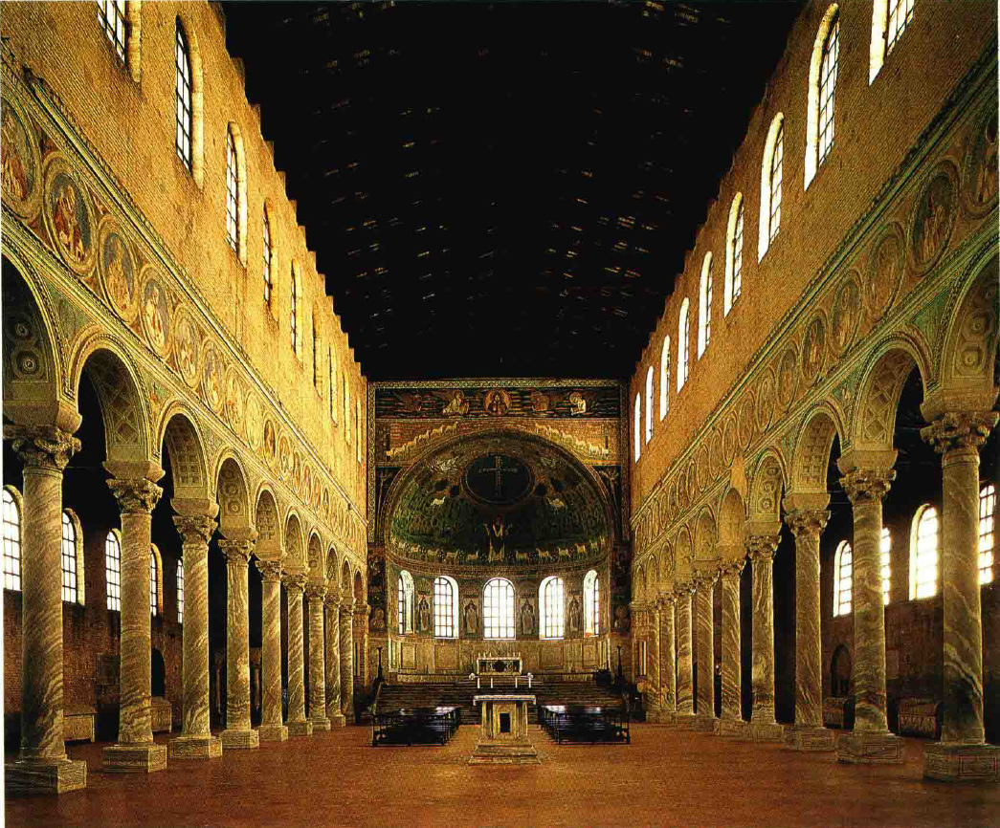
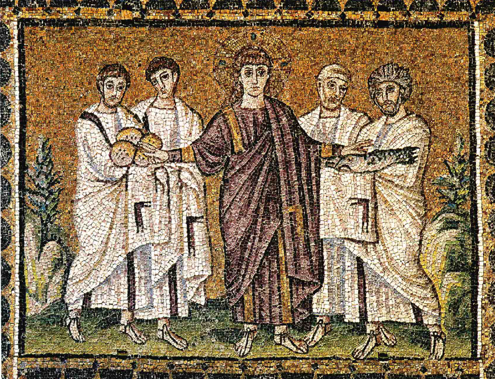
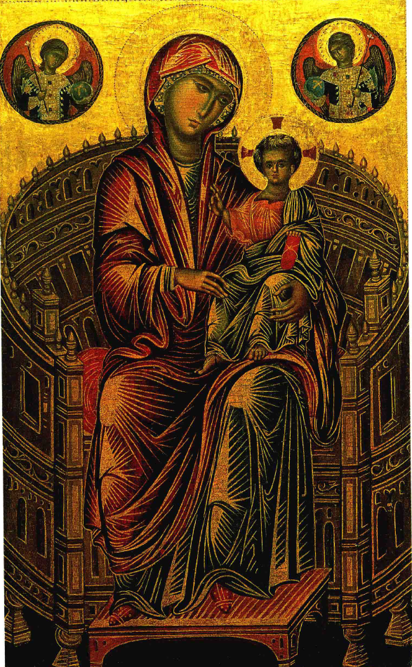
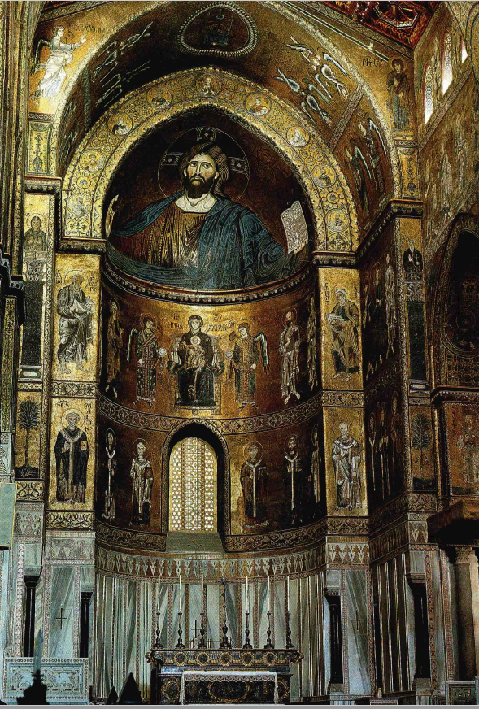

# 早期罗马式和拜占庭艺术
## 基督教会与艺术的关系变革
### 基督教礼拜场所的设计起源
- 公元311年，**君士坦丁大帝**确立基督教会在国家中的权力，随之教会需要考虑**公共礼拜场所**的建筑设计
- 古代神庙与基督教教堂的功能差异导致教堂**不采用神庙模型**，而是仿造“**巴西利卡**”（basilicas）的形式，原意为“**王宫**”，用作**室内市场和公开法庭**
- 巴西利卡教堂主要由**长方形大殿**、两侧狭窄**低矮的分隔间**、以及尽头的**半圆形后殿**（apse）组成，适应集会和礼拜仪式的需要

### 基督教艺术的图像争议
- 基督教初期，虔诚的基督徒普遍**反对在教堂放置雕像**，认为雕像与《圣经》中谴责的偶像太相似
- 对于**绘画**，意见分歧较大。有些人认为绘画有助于**教育不识字的教徒**，保证神圣事迹被记住
- 6世纪末，**格列高利大教皇**支持**使用绘画进行宗教教育**，认为绘画对文盲有如文字对识字者

### 艺术在基督教中的新角色
- 为服务于宗教目的，艺术家使用**简明的叙事方式**，避免**可能分散注意力的细节**，使艺术变得受限
- 初期基督教艺术作品，如**拉韦纳的镶嵌画**，通过使用**浓重颜色和金色背景**，强调**神圣奇迹的展现**，而非自然或现实场景
- 这种艺术表现方式标志着从希腊艺术的**自然主义**向基督教艺术的**象征主义**的转变

#### 拉韦纳镶嵌画的特点
- 描述**基督用五个饼和两条鱼喂饱五千人**的故事，采用与古典艺术**不同的表现手法**
- 画面上的基督和使徒呈现为**神圣仪式的参与者**，强调基督**永恒力量的象征**
- 使用的材料和色彩使教堂内部显得**辉煌肃穆**，而非追求自然的动态表现

### 中世纪基督教艺术的特征
- 融合**原始手法和精细手法**，形成独特的艺术风格
- 艺术家不再追求希腊艺术的自然主义，而是注重**故事的核心精义和宗教象征**
- 尽管艺术形式简化，但保留了希腊和罗马艺术的**人物形象和叙事技巧**，适应新的宗教环境和表现需求

## 拜占庭艺术与东西教会的分歧
### 宗教艺术在东西教会中的争议
- **拜占庭**（君士坦丁堡）是罗马帝国东部**讲希腊语的地区**，拒绝接受拉丁教会教皇的领导
- **反圣像崇拜者**（iconoclasts）反对**所有宗教性质的图像**，公元745年**禁止东方教会中的宗教艺术**
- 对立一方**视图像为神圣**，认为通过图像可以崇拜上帝和圣徒

### 拜占庭艺术的传统和创新
- 艺术家被要求**严格遵照古代模式创作**，保持希腊艺术的观念和成就
- 拜占庭祭坛画如圣母像**反映了希腊技术**，尽管看起来与古典艺术**有距离**
- 强调传统导致艺术家**难以发挥个人才能**，但也促进了早期基督教艺术向**庄严大型图像**的转变

### 拜占庭艺术在东方教会的地位
- 拜占庭艺术家的作品被视为**超自然世界的神秘反映**，不仅仅是为不识字的人使用的图解
- **西西里的蒙雷阿勒教堂**后殿的装饰显示了拜占庭艺术的**宏伟性和庄严性**，成功用于赞美基督和他的威力
- 拜占庭传统在东方教会控制的国家**一直保持影响力**，俄罗斯的神圣图像或“圣像”至今反映这些伟大创造

#### 拜占庭艺术的特征和影响
- 通过**严格遵循传统**，拜占庭艺术在衣饰、面貌和姿势的形式中**保存了希腊艺术的成就**
- 尽管艺术**形式守旧**，但拜占庭艺术家在表现圣母和基督等主题时创造了**大型庄严的图像**
- 这些艺术作品不仅反映了**宗教信仰**，还促进了**艺术风格的传播**，影响了后世的宗教艺术表现