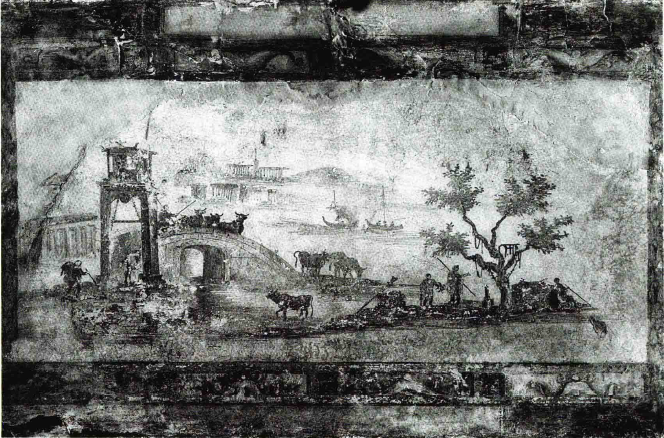

# 盛期与希腊化艺术
### 艺术自由的时间框架
- 伟大觉醒大约发生在**公元前520年至公元前420年**之间
- 到**公元前5世纪末**，艺术家已充分意识到自身的力量和技巧

### 艺术家的社会地位变化
- 艺术家虽然仍被视为**工匠**，但开始受到公众**更多赏识**
- 人们赏识**艺术作品的美感**，而非仅其**宗教或政治作用**

### 艺术“流派”之间的比较与竞争
- 不同城市艺术家的手法、风格和传统开始**相互比较和竞争**
- 这种比较和竞争促进了希腊艺术的**多样化和丰富性**

### 建筑风格的多样性
- 帕特侬神庙采用**多立安风格**[Doric Style]
- 后来的卫城建筑使用**爱奥尼亚风格**[Ionic Style]，如**厄瑞克特翁神庙**[Erechtheion]

### 雕刻和绘画的优雅轻松特征
- **菲狄亚斯**[Pheidias]之后的一代艺术家创作更为优雅、轻松
- 体现在雅典卫城胜利女神小神庙的石栏雕刻上

### 石栏雕刻的美感与技巧
- 胜利女神庙的石栏雕刻**体现纤美和精致**
- 例子：弯腰系鞋的**胜利女神雕像**，展现艺术家对动态和短缩法的精通

### 艺术家对自身能力的认识
- 帕特侬神庙饰带的艺术家专注于**清晰、满意的表现**
- 胜利女神庙石栏的艺术家意识到自己的**巨大能力**，对此感到**自豪**

### 艺术观念的转变
- 菲狄亚斯的神像因体现神衹而闻名
- 公元前4世纪的神庙雕像因**艺术本身之美**而受到赞扬
- 希腊有文化的人开始像讨论诗歌和戏剧一样讨论绘画和雕像

## 波拉克西特列斯[Praxiteles]与希腊艺术的进步

### 波拉克西特列斯的艺术成就
- 波拉克西特列斯被认为是**公元前4世纪最伟大的艺术家**
- 以创作**悦目妩媚**的作品而闻名
- 最受欢迎的作品是表现青春活力的**阿芙罗狄蒂**[Aphrodite]

### 赫耳墨斯与小狄俄尼索斯的雕像
- 19世纪在**奥林匹亚**发现的雕像可能是波拉克西特列斯的作品
- 雕像描绘**赫耳墨斯**[Hermes]抱着**小狄俄尼索斯**[Dionysus]的场景
- 相比较早期作品，希腊艺术在两百年间有**显著进步**

### 波拉克西特列斯雕像的艺术特点
- 雕像展现了神祇**轻松的姿势和尊严**
- 波拉克西特列斯巧妙地描绘了**身体接合部位**，使身体活动更加清晰
- 成功地表现了柔软的**皮肤下肌肉和骨骼的活动**

### 希腊艺术理想化的特点
- 希腊艺术家不是简单模仿真人，而是探索如何**为传统形式注入生命**
- 到了波拉克西特列斯时代，他们的技法**完全成熟**
- 古老的人物形式在熟练的雕刻家手下变得**更加生动和活泼**

### 希腊艺术的超凡脱俗
- 希腊雕像的美丽和对称，并非反映希腊人的实际外貌，而是**艺术的成果**
- 艺术家达到了类型化与个性化形象之间的**新平衡**

## 希腊艺术作品的巅峰与发展

### 完美人体形式的表现
- **公元前4世纪中叶的雕像**被认为是表现最完美人体形式的卓越作品
- 后世最好的作品多为**原作的复制品或变体**

### 《观景楼的阿波罗》[The Apollo Belvedere]
- 阿波罗雕像展现了**男性理想模式**
- 姿势动人，描绘**射箭的瞬间**
- 反映了古老图式**对身体各部分特征的强调**

### 《米洛的维纳斯》[Venus of Milo]
- 《米洛的维纳斯》可能是一组**维纳斯和丘比特**[Cupid]群像的一部分
- 属于**波拉克西特列斯**时期的作品
- 雕像的造型**清晰简洁**，展现了美丽人体的各个主要部分

### 艺术家的技法
- 通过**逐渐赋予传统形象生命**，直至大理石似乎具有生命和呼吸
- 这种方法创造了**令人信服的人**的类型，但难以再现**实实在在的人**

### 肖像艺术的发展
- 直到公元前4世纪很晚时期，希腊才出现现代意义上的**肖像观念**
- 初期的肖像**并不精确反映个人特征**
- 艺术家避免让头像具有**特殊的表情**，以维持头部的**简单规矩性**

### 艺术家的新发现
- 波拉克西特列斯之后的艺术家开始在**不破坏美的同时赋予面貌生气**
- 捕捉个别人的心理活动和面孔的**特殊之处**

### 亚历山大大帝时期的肖像艺术
- **莱西波斯**[Lysippus]以忠实于自然而闻名，为**亚历山大大帝**制作肖像
- 莱西波斯的作品表现了从波拉克西特列斯时期以来的艺术变化
- 亚历山大大帝胸像也有可能**更接近于神的形象**，而非亚历山大本人

## 亚历山大帝国与希腊化艺术的影响

### 亚历山大帝国对希腊艺术的影响
- 亚历山大帝国的建立使希腊艺术从小城市扩展至**几乎半个世界**
- 希腊艺术成为**广泛使用的图画语言**

### 希腊化艺术[Hellenistic art]的特点
- 后期希腊艺术被称为**希腊化艺术**
- 影响范围包括亚历山大的继承者**在东方建立的帝国**
- 重要城市包括**亚历山大里亚**[Alexandria]、**安提俄克**[Antioch]和**帕加蒙**[Pergamon]

### 新兴城市的建筑风格
- 新兴城市的豪华建筑物适合**华丽的科林斯风格**[Corinthian style]
- 科林斯风格在爱奥尼亚式基础上增加**叶饰和华丽花饰**

### 希腊化时代雕刻的变革
- 例如，**帕加蒙城的祭坛浮雕群像**展现诸神与巨人的战斗
- 浮雕具有**强烈戏剧效果**，表现剧烈的动作和颤动的衣饰
- 这种艺术风格喜欢表现**狂暴强烈的主题**

### 《拉奥孔》[Laocoon]

#### 发现与初步印象
- 《拉奥孔》群像于**1506年**被发现
- 作品因其**悲剧性效果**而受到艺术家和艺术爱好者的高度赞扬

#### 艺术描绘与背景
- 描绘了特洛伊城祭司**拉奥孔及其两个儿子被巨蛇缠绕**的恐怖场景
- 故事与后来**维吉尔**[Virgil]的史诗《**埃涅阿斯纪**》[Aeneid]描写的相似
- 拉奥孔警告特洛伊人不要接受希腊人的木马，诸神因此派**巨蛇**惩罚他

#### 艺术表现
- 雕像充满**戏剧性和动感**，展现了**恐惧和激烈的斗争**
- 描绘拉奥孔和儿子们的**绝望挣扎与痛苦表情**
- 艺术家巧妙地利用**躯干和手臂的肌肉**表达绝望和努力

#### 艺术家的技艺
- 艺术家成功地将整个**动态场景**固定成一个**永恒的群像**
- 展示了艺术家**高超的技巧**，如**表现人体结构和情感的细节**

#### 艺术作品的目的与影响
- 作品可能旨在迎合**喜欢恐怖场面的公众口味**
- 反映了希腊化时期艺术家**对技术的重视**，而非艺术与宗教的深层联系
- 引发**对艺术家创作动机**的讨论：是为了表现真实的情感还是展示技艺

### 艺术品的收藏与文化影响
- 有钱人开始**收购艺术品**，复制名作，购买能买到的原作
- **作家**开始关注艺术，撰写艺术家生平和艺术指南

## 绘画艺术

### 古代画家的遗产
- 多数著名古代艺术家是画家，但其作品**大部分已失传**
- 他们关注**特殊技术问题**，而非艺术服务于宗教目的

### 庞贝[Pompeii]的壁画与镶嵌画
- **庞贝**是个富有的城镇，公元79年被火山灰埋葬
- **壁画和镶嵌画**描绘柱子、远景、框画和舞台场面
- 虽非全部是杰作，但展现了城市中**艺术作品的广泛存在**

### 希腊化时期艺术家的创造
- 装饰家使用**希腊化时期**伟大艺术家的发明创造
- 有时在平庸的作品中发现**美丽优雅的形象**，如**时序女神**[Hus]的描绘

### 不同类型的绘画
- 包括**静物画**[still life]、**动物画**和**风景画**[landscape painting]
- 风景画是希腊化时期的重要创新，表现**田园生活的乐趣**

### 古代绘画的特点
- 远近物体**大小不一**，缺乏我们现代理解的透视法则
- 艺术作品更多地表现了**观察的特征**而非大自然的直接反映
- 希腊人**打破早期艺术的限制**，但仍保留了对物体轮廓特征的重视
