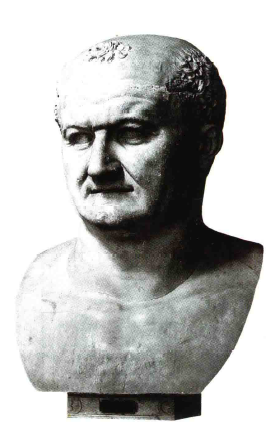

# 罗马和早期宗教艺术
## 罗马艺术的希腊影响
- 罗马征服世界后，在**希腊化王国废墟**上建立帝国，艺术保留了希腊特色
- 大部分在罗马的艺术家是**希腊人**，罗马收藏家购买**希腊艺术作品或复制品**
- 尽管如此，随着罗马成为世界霸主，艺术发生了变化，艺术家接受新任务，根据实际情况**修改创作方法**

## 罗马的土木工程成就
- 罗马最突出的成就是**土木工程**，如道路、输水道和公共浴场等
- 这些建筑即使成为废墟，也深刻影响后世，使“**宏伟即罗马**”（the grandeur that was Rome）这一概念难以忘怀

#### Colosseum（圆形竞技场）
- **Colosseum**是典型的**罗马建筑**，受到后世高度赞美
- 结构实用，有**三层拱**，每一层拱**承载着内部的座席**
- 拱前面采用了**希腊建筑风格的隔断**，包括多立安风格、爱奥尼亚式和科林斯式半柱
- 罗马结构与希腊形式的**结合**对后世建筑师产生了巨大影响

#### 凯旋门（Triumphal Arches）
- 凯旋门**遍布帝国各地**，包括意大利、法国、北非和亚洲
- 采用**柱式界框**，突出中央的**巨大入口**，两侧辅以**狭窄入口**
- 这种结构安排类似于音乐中的**和弦**

#### 拱（Arch）的使用
- **拱**的使用是罗马建筑的**重要特点**，虽然希腊建筑师可能早已发现此技术，但在希腊建筑中**几乎未被使用**
- 通过各种技术设计，罗马人对拱技艺十分精通
- 拱用于横跨桥梁、输水道的**墩柱**，甚至用于构建**拱形屋顶**

#### Pantheon（万神庙）
- **Pantheon**是古罗马时期唯一**一直用作礼拜堂**的神庙，早期基督教时代被改成**教堂**
- 内部是一个巨大的**圆厅**，有**拱状屋顶**，顶部有**圆形开口**，从开口可以看到天空
- 没有其他窗户，但大厅可以从上面接收**充足而均匀的光线**
- 给人一种**沉静和谐**的印象，没有沉闷感，屋顶穹隆仿佛**在头顶自由盘旋**，像第二个天穹

## 罗马肖像艺术与战功记事
### 罗马肖像的地位
- 罗马人**继承希腊建筑风格**，根据自己需求进行**改造**，尤其重视**肖像艺术**
- 早期宗教仪式中使用**蜡像**，可能受到古埃及关于**用真容像保存灵魂信仰**的影响
- 帝国时期，皇帝胸像受到**宗教性敬畏**，罗马人需在皇帝胸像前烧香示忠
- **基督徒**因不遵守此要求而遭**迫害**

### 罗马肖像的特点
- 罗马肖像艺术追求**真实**，不加美化，可能**使用石膏套取死者面型**，对人头部结构和面貌有**深刻了解**
- 罗马肖像如庞培（Pompey）、奥古斯都（Augustus）、泰特斯（Titus）、尼禄（Nero）等人物**形象逼真**
- **维斯佩申**（Vespasian）胸像展示了其**非神化的普通形象**，类似富有的银行家或航运公司老板

#### 维斯佩申胸像
- **没有讨好之意**，不意图将其表现为神
- 形象**逼真而不平凡**，无猥琐之处
- 成功实现了既逼真又显得非凡的艺术效果

### 罗马的战功记事艺术
- 罗马人创新地宣扬自己的胜利，复兴**上古东方宣扬胜利的风尚**
- **图拉真**（Trajan）竖立的**巨大石柱**历述其在达吉亚（Dacia，现罗马尼亚）的战事和胜利

- 石柱上展示罗马军队的**集粮、征战和胜利场面**
- **希腊艺术的技法和成就**被用于战功记事，但罗马人更注重**细节的准确表现和清晰的叙事**
- 艺术目标转向**实用**，不再追求和谐、优美和戏剧性表现
- 罗马人是实际的民族，用图画叙述英雄业绩的方法**对宗教有益**，帮助宗教与帝国的扩张联系起来

## 希腊化与罗马艺术的全球影响
### 希腊化艺术在埃及的体现
- 在公元后几百年，希腊化和罗马艺术**完全取代了东方王国的艺术**
- 即使在东方艺术的原先据点，如**埃及**，随葬的真容像已**非埃及风格**，而是采用**希腊肖像技法**的艺术家绘制
- 这些肖像虽可能由普通工匠**低价制作**，但其**生动性和写实性**至今仍令人惊讶，展现了古代艺术品罕见的“**现代化**”生气

### 希腊化与罗马艺术在印度的应用
- 罗马**叙述史实和显耀英雄**的方法被艺术家用来描绘**佛陀的和平征服故事**
- 在印度边境地区**犍陀罗**（Gandhara），首次出现**佛陀的浮雕像**，成为后续佛教艺术的样板
- 一个描绘佛传中的**夜半逾城**（The Great Renunciation）场景，展示了王子乔达摩（Gautama）出走成为隐士的故事
- 希腊和罗马艺术教会人们以**优美的形式**想象神祇和英雄，对印度人创造佛陀救世主形象**大有帮助**

#### 夜半逾城的浮雕
- 描述**乔达摩与战马建多迦**（Kanthaka）的故事，以及诸天王**掩住马叫声**，确保王子安静离开的细节

### 希腊化艺术与犹太宗教的融合
- 犹太法实际**禁止制像**，避免偶像崇拜，但东方城市的犹太人喜欢用《**旧约**》故事装饰会堂墙壁
- **杜拉-欧罗玻斯**（Dura-Europos）发现的**会堂壁画**，虽不是伟大艺术品，但为公元3世纪留下有趣资料
- 壁画风格**简陋笨拙**，场面**平板原始**，但这些特点有其意义
- 描绘**摩西**（Moses）击磐取水故事，旨在解释《圣经》意义，**避免图像逼真**以免触犯禁止制像的圣训
- 简陋的会堂壁画对我们意义重大，因为**基督教**使用艺术服务自己时，开始受到类似思想的影响

#### 杜拉-欧罗玻斯的会堂壁画
- 画面简单，目的是提醒观者想起**上帝显示神力**的时刻，而不是追求画面的逼真
- 展示了以色列每一个部族**分享圣水**的场景，通过画**十二条小河**流向帐篷前的小人形象表现

## 基督教艺术的起源与发展
### 初期基督教艺术的希腊影响
- 公元4世纪的基督像展现了**基督的青春之美**，坐在**圣彼得**（St. Peter）和**圣保罗**（St. Paul）之间，他们像**庄严的希腊哲学家**
- 为了表示基督**高于天穹**，雕刻家让基督的脚放在**古代天空之神**举起的天穹上，显示希腊化艺术方法与基督教艺术的**紧密联系**

### 基督教艺术的早期表现形式
- 最早的基督教纪念物**并不直接表现基督自身**
- 杜拉的**犹太会堂**描绘《旧约》场景，用以**叙述神圣事迹**而非美化空间
- **罗马地下墓室**（Roman catacombs）的画像表现了基督教徒**对希腊化绘画技法的掌握**，但重点是传达**神的慈悲和威力**，而非艺术美

#### 《火窑三士》的描绘
- 公元3世纪的作品，展示了艺术家用**简洁的手法**表现人物，但更注重其**象征意义**
- 故事来自《**但以理书**》，展示了三个犹太人因拒绝敬拜金像而被扔入火窑，却因上帝的保护而毫发无损，象征**信仰的力量**

### 基督教艺术的技术与表现转变
- 罗马帝国衰亡时期的艺术家**不再追求**希腊艺术的精美与和谐
- 雕刻家使用**更简单的方法**，如**手工钻**，表现面部和人体的主要特征
- 艺术家试图获得**新的效果**，不再满足于希腊化时期的技术精湛

#### 公元4世纪和5世纪的肖像
- 这些肖像可能在技艺上看起来**粗糙**，但展现了**强烈的生命力和表情**
- 肖像通过**面部的坚实有力**和**眼睛四周的特征描绘**，展现了人物的**内在强度**
- 这些肖像代表了**见证基督教兴起并承认其意义**的人，象征**古代世界的结束**
