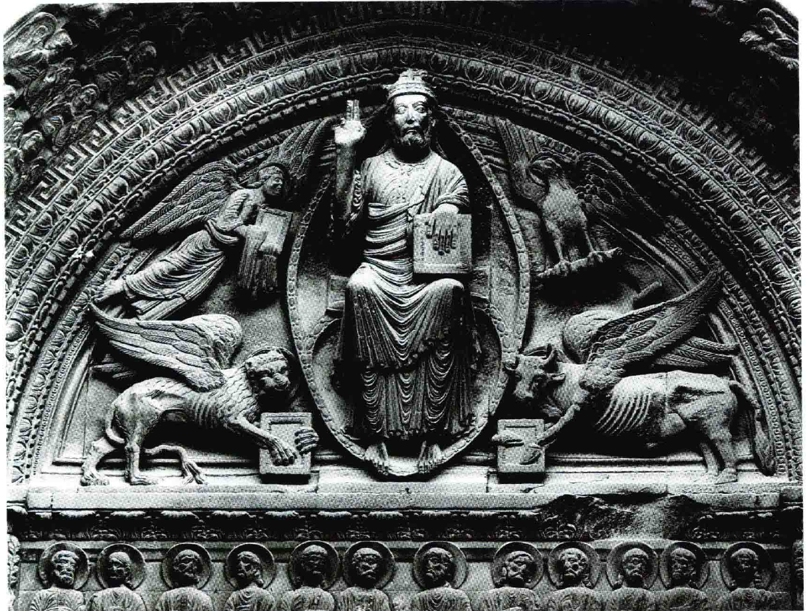

# 罗马式艺术
## 诺曼底风格与罗马式教堂的兴起
### 中世纪艺术的多元性
- 中世纪艺术不仅限于**宗教领域**，**城堡和私人住宅**也是艺术创作的场所
- 1066年**诺曼底人**入侵英国后，引入了**新的建筑风格**，这在英国被称为**诺曼底风格**（Norman style），在欧洲大陆则被称作**罗马式风格**（Romanesque style）

### 教堂在社会中的地位
- **教堂**在中世纪社会中具有**极其重要的地位**，常是乡村**唯一的石建筑和地标**
- 教堂的建设和装饰受到社区的**高度重视和自豪**，其建设过程对当地社会经济产生显著影响

### 诺曼底风格与罗马式风格的建筑特点
- 诺曼底和罗马式教堂的设计沿用了**巴西利卡式**的基本平面布局，**中殿**通向**后殿**，两侧设有**侧廊**
- 这些教堂通常采用**十字形平面**，加上**厚实的窗间壁和圆拱形结构**，给人以**坚固和庄严的印象**
- 相较于早期巴西利卡式教堂的古典柱子和平直的檐部，诺曼底和罗马式教堂的**装饰简约**，窗户少，更显得**坚不可摧**

### 教堂的象征意义
- 这些建筑不仅是宗教活动的场所，也象征着**教会与黑暗势力战斗**的信念
- 教堂的**庞大和挑战性建筑风格**，对当时刚从异教生活转变过来的人民来说，是**战斗的教会**（Church Militant）在人间任务的象征

## 中世纪教堂建筑与雕刻的革新

### 石头屋顶的建造挑战
- 中世纪的建筑师面临如何为教堂建造**出色石头屋顶**的问题，因为**木制屋顶**容易失火且缺乏尊严
- 通过实验，发现不需要整个屋顶都用沉重的石头，而是可以通过建造**坚固的拱和轻质材料**填充空隙来解决

### “肋式拱顶”的创新
- 诺曼底式的**达勒姆主教堂**（Durham Cathedral）是最早使用“**肋式拱顶**”（rib vault）的例子，这种设计通过在柱子之间搭起**交叉的拱**来支撑屋顶
- 这种技术的发展**大大改革了建筑方法**，但最初的建筑师可能未完全意识到其技术发展的前景

### 教堂雕刻装饰的功用性
- 教堂的装饰不仅仅是为了美观，每一处装饰都有其明确的**宗教意义**和**表达教会圣训**的功能
- 例如，在法国南部阿尔勒的**圣特罗菲米教堂门廊**（St-Trophime），其装饰风格受**罗马凯旋门**影响，表现了基督和福音书作者的象征
- **教堂大门上的雕刻**表现了基督、使徒、亡魂和受祝福者，以及代表**福音书作者**的象征物，如狮子、天使、公牛和鹰
- 这些雕刻作品传达了关于**人类生活终极去向**的教会教义，对信徒产生深远影响

### 中世纪雕刻的深刻印象
- 中世纪的雕刻作品虽然不如古典作品那样**自然和优雅**，但其**肃穆的风格**使得内容表现得更为**直观和深刻**
- 这些雕刻与教堂的**宏伟气势**相呼应，对观看者产生强烈的视觉和心灵影响

## 中世纪宗教艺术的象征与意义
### 格洛斯特主教堂的烛台
- 由于**公元1110年**左右制作，融合了**黑暗时期艺术风格**，展现**怪物和龙**的形象
- 拉丁文刻辞传递了**明确的宗教意义**，强调**光明战胜邪恶**的象征
- 烛台上的象征包括**福音书作者**和**裸体人物**，通过与邪恶力量的斗争展现了克服黑暗的主题

### 列日城教堂的洗礼盘
- 制于1113年，**黄铜**材质，中央浮雕展现**基督接受洗礼**场景，配有说明形象意义的拉丁文刻辞
- 不仅各个细部，整个洗礼盘都富含**深刻的宗教意义**，反映了神学家对艺术家的指导
- 通过《圣经》中**所罗门王故事**的引用，洗礼盘下的**公牛**也被赋予了象征意义，展现了艺术与宗教传统的紧密联系

### 12世纪艺术的特征与发展
- 12世纪是**十字军东征**的时期，西欧与**东方拜占庭艺术**的交流更为频繁
- 艺术家们努力**模仿并超越**东方教会的庄严圣像，体现了东西方艺术风格的融合
- 在模仿中追求**自然、镇静和庄严**的表现，反映了中世纪艺术的进步和变化

## 中世纪艺术的象征主义与自由表达
### 超越自然的表现
- 12世纪欧洲艺术达到罗马式风格的**鼎盛时期**，更接近**东方艺术理想**，注重**僵硬而庄严的安排**
- 泥金写本中的《**圣母领报**》（Annunciation）显示了圣母玛利亚的正面形象和天使的半侧面形象，展示了艺术家对**传统神圣象征物**的重视，而非**自然形状的摹写**
- 通过这种方式，艺术家表达了**对超自然概念的理解**，而非现实生活的直接描绘

### 德国修道院历书的创新表达
- 利用**文字和图解并用**的方式标记重要节日，展示了**圣威廉马若斯**（St. Willimarus）及随从和**圣加尔**（St Gall）及其一万一千名贞女的殉教故事
- 对殉教故事的表现**避免了详细的恐怖细节**，通过**装饰性的方法**简化了人物和场景的布置
- 这种方法展示了艺术家**放弃创建空间错觉和戏剧性动作**的选择，转而使用**图画书写**形式来进行**纯粹装饰性的表达**

### 色彩的自由选择与应用
- 不再追求模仿自然界的实际色调，艺术家可以**自由选择颜色**进行创作
- **金饰作品**、**泥金本插图**和**彩色玻璃窗**（stained glass windows）中的色彩运用表明了艺术家不受自然色彩限制的**创作自由**
- 通过这种自由，艺术家能够更好地**传达超自然的观念**，展现了中世纪艺术的独特魅力和深刻意义
