# 远古艺术
## 埃及艺术的起源与特征
1. **埃及艺术的起源和影响**
   - 艺术历史的连续传统并不始于早期的洞穴画或北美印第安人的艺术，而是与**约五千年前的尼罗河流域艺术**有直接联系
   - 这种联系从师傅传给弟子，形成了一条**直接的艺术传统**，对今天的艺术产生了深远影响
   - 埃及艺术**对西方艺术的影响**尤为重要，因为希腊艺术家曾向埃及人学习，而西方艺术又深受希腊艺术的影响

2. **埃及金字塔的象征意义和建造目的**
   - **金字塔**（Pyramids）不仅是建筑技术的奇迹，也是埃及文化和宗教信仰的体现
   - 埃及人相信国王是**半神半人**，金字塔的建造旨在帮助国王的灵魂飞升
   - 金字塔的设计反映了埃及人**关于死后世界的信仰**，以及对遗体和灵魂永存的追求
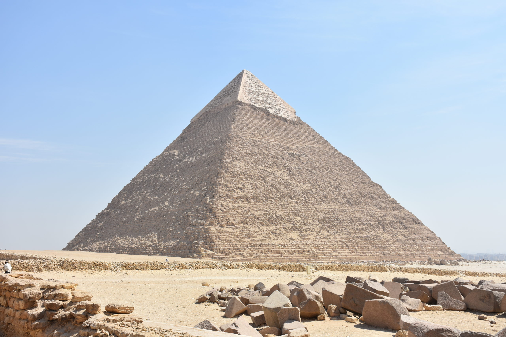

1. **埃及肖像雕刻的功能和风格**
   - 埃及雕刻家被称为“**使人生存的人**”，因为他们的作品旨在通过雕像**保持国王的灵魂永生**
   - 这些肖像风格**庄重而朴素**，关注**基本形状**而非细节，展现了对自然观察和整体匀整的平衡
   - 埃及雕刻与原始艺术和尼日利亚艺术家的**自然主义肖像**形成鲜明对比，体现了不同文化对艺术的**不同理解**
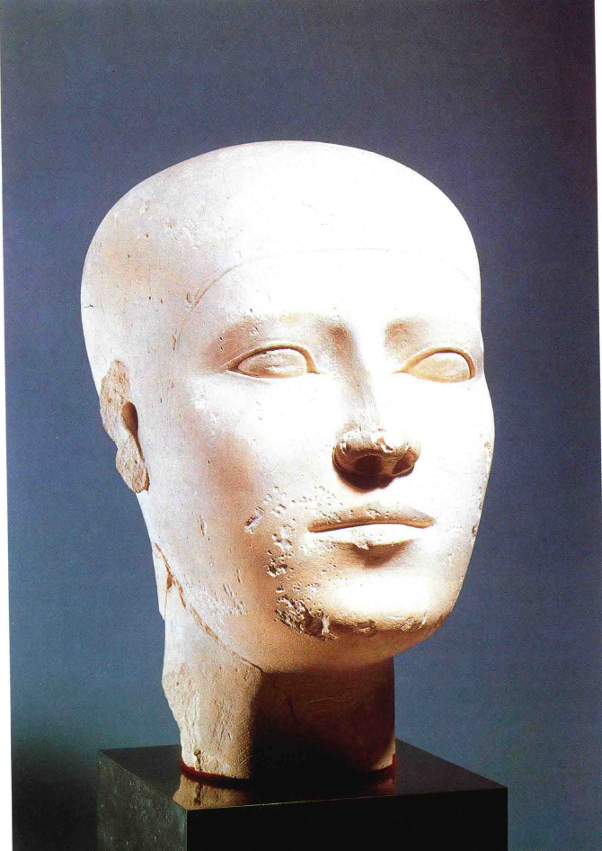

## 埃及艺术的宗教融合与表现方式
1. **艺术与宗教的结合**
   - 埃及艺术**紧密结合宗教信仰**，如金字塔的建造和国王雕像的制作都与宗教仪式和信仰相关
   - 埃及人通过艺术表达了他们对生命、死亡和超自然力量的理解
     - 如陵墓中的图画和模型旨在为死者**提供冥界中的伙伴**，反映了**对死后生活的信仰**
     - 这些作品通过**详细的日常生活场景**来保证死者在冥界的完整性和永恒
   - 这种**艺术和宗教的结合**为理解埃及文化和艺术史提供了关键视角

2. **埃及艺术的基础与表现原则**
   - 埃及艺术（Egyptian Art）基于**艺术家对人物或场景的知识和理解**，而非纯粹的视觉再现
   - 艺术家展现的是对形式、外观和意义的**综合认识**
   - 在埃及艺术中，**象征性的大小比例**（如主人比仆人大）传达了社会地位和重要性
   - 埃及墓室墙壁上的图画使用了一套**独特的符号系统**来记述历代生活情况，其中细节的描绘旨在**完整保留事物**
     - 这些图画结合**象形文字**，详细记录了**死者的身份、头衔和荣誉**
     - 这种表现方式可能与当时的绘画目的有关，即不是为了欣赏，而是为了“**使人生存**”
   - 埃及艺术融合了**几何形式的规整性**与**对自然的犀利观察**，这是其所有艺术作品的**共同特点**

3. **风格的定义和埃及艺术的一致性**
   - **风格**（Style）的概念指一种文化或民族的创造物遵循的**统一法则**
   - 在埃及艺术中，这种风格体现为**一致的规则和形式**，赋予每件作品**稳定、质朴而和谐**的效果
   - 这种**风格的统一性**使得埃及艺术的雕像、绘画和建筑形式表现出**显著的一致特点**

4. **埃及绘画的表现规则**
   - 埃及画家遵循**严格的规则**来表现各种事物，以确保一切都能清楚、完整地被保留下来
   - 例如，他们可能会将池塘从上面画，树木从侧面画，确保每个元素都**最具特征地展现**
   - 这种方法类似于**绘制地图**，而非传统意义上的绘画
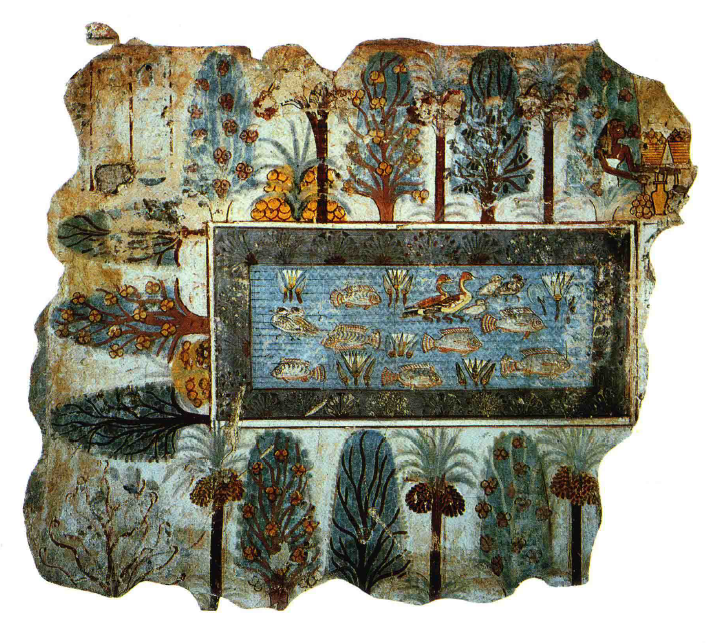

5. **埃及人体描绘的独特方式**
   - 埃及人体画的特点是**头部侧面、眼睛正面、上半身前面、手臂和腿侧面的组合**
   - 这种扭曲的表现方式源于对事物特征**最典型角度**的强调，而非真实人体的模仿
   - 埃及艺术家遵循这些规则，部分是为了保证**作品的法术功能**，如确保死者的身体部位完整
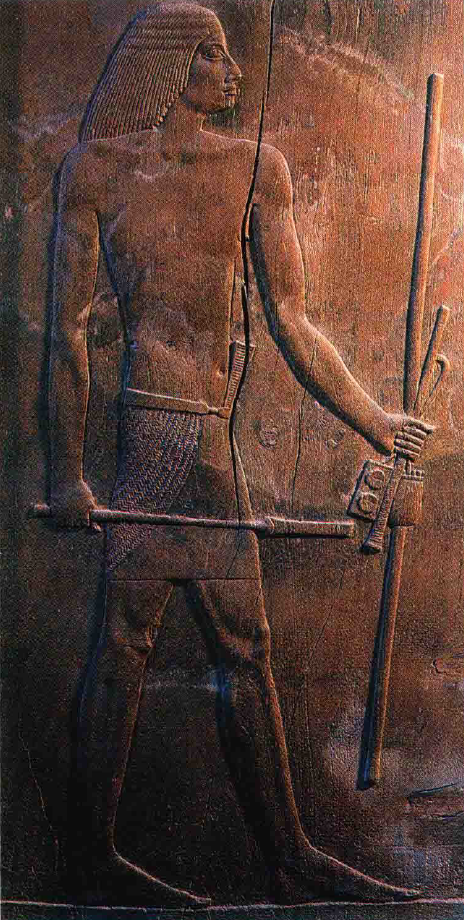

6. **埃及艺术中的细节观察**
   - 尽管埃及艺术遵循严格的**几何式秩序**，但艺术家同时也展现了**对自然的精细观察**
   - 例如，**克努姆赫特普**（Khnumhotep）**捕鱼的场景**展示了艺术家**对动物形态的真实描绘**
   - 这种结合丰富知识和构图眼光的方法使得每一幅作品都是**精确的历史和文化记录**
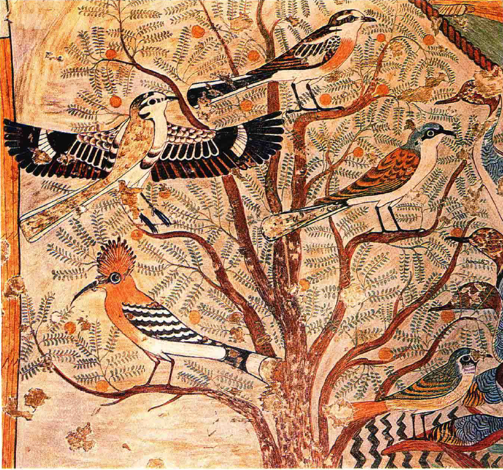

7. **埃及艺术家的训练与规则遵循**
   - 埃及的艺术家从小开始学习**严格的艺术法则**
     - **雕像的规定**：坐着的雕像必须把双手放在膝盖上
     - **色彩的规定**：男性皮肤颜色比女性深
     - **埃及神祇的形象**有明确的规定，如太阳神荷拉思（Horus）必须是鹰或有鹰头，死神阿努比斯（Anubis）必须是豺或有豺头
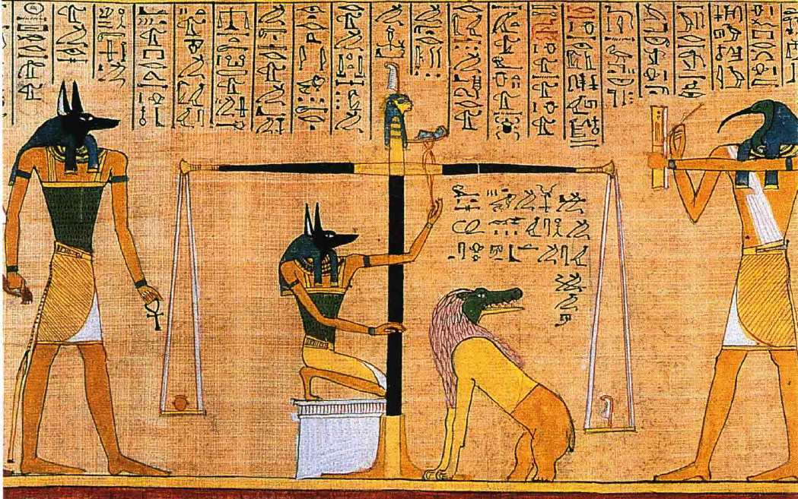
     - 艺术家必须掌握精湛的技艺，如**清晰无误地刻画象形文字**（Hieroglyphs）
   - 一旦艺术家掌握了所有规则，就**结束了学徒生涯**，但**不鼓励创新或个性化的表达**
     - 在埃及艺术中，**效仿古代名作**被视为艺术成就的高峰

## 埃及艺术的风格与阿克纳顿的影响
1. **埃及艺术的持久性和稳定性**
   - 埃及艺术在长达三千多年的历史中**几乎没有显著变化**
   - **金字塔时代**（Pyramid Age）的美学标准在后世仍被视为杰出
   - 即使出现新样式和新题材，表现人和自然的基本方法**仍然保持不变**

2. **阿克纳顿的革新与影响**
   - **阿克纳顿**（Akhnaten）是**第十八王朝的埃及国王**，他的异端派思想动摇了埃及艺术的传统
   - 阿克纳顿崇拜单一神祇**阿顿**（Aten），并在艺术中推崇这种新的信仰和表现方式
   - 他的艺术作品打破了埃及传统的严肃和刻板，表现了**更亲密和自然的人物形象**
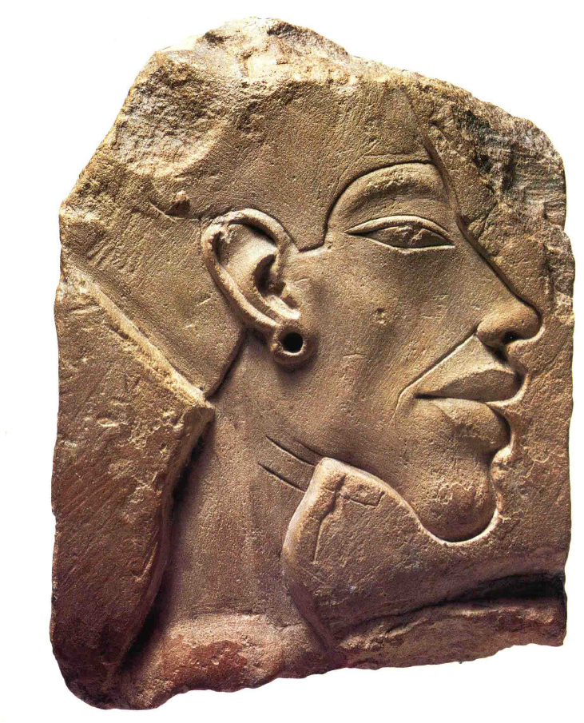

3. **阿克纳顿艺术风格的特点**
   - 阿克纳顿的艺术作品中，他和妻子**妮菲尔提提**（Nefertiti）被描绘为**亲密相依**，沐浴在阳光下的温馨场景
   - 他的肖像有时**故意表现得不美观**，可能是追求逼真的肖像或表达个人重要性
   - 这种风格的变化在当时可能被视为**惊世骇俗**
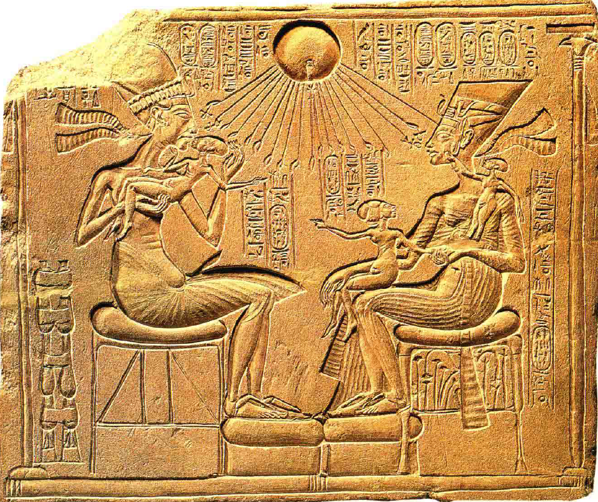

4. **海外艺术对埃及的影响**
   - 阿克纳顿可能受到海外艺术风格的影响，如**克里特岛**（Crete）和**迈锡尼**（Mycenae）的艺术
   - 这些外来艺术作品表现了**自由和优雅的风格**，与埃及的严格规则形成对比
   - 克里特和迈锡尼的艺术可能促使埃及工匠**尝试新的艺术表现方法**
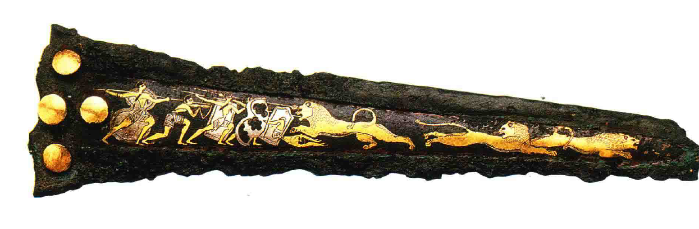

5. **埃及艺术的回归与持续性**
   - **图坦卡门**（Tutankhamun）的陵墓和宝藏中**仍有阿克纳顿时期的艺术风格**
   - 尽管出现了新风格，埃及艺术很快**回归到传统的风格和信条**
   - 埃及艺术在此后的一千多年里再次**保持了稳定**，延续了古老的风格和主题
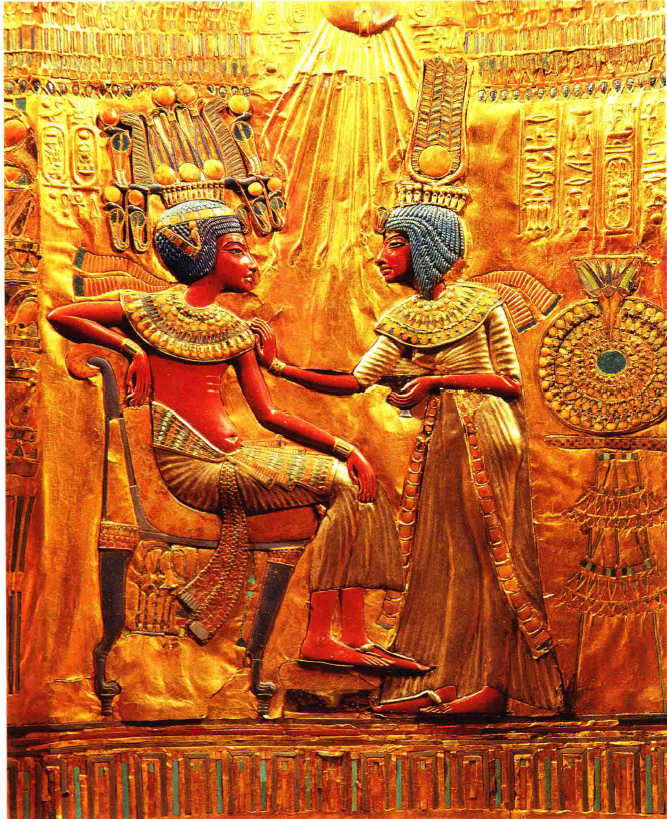

## 美索不达米亚艺术的特色与影响
1. **美索不达米亚的艺术影响**
   - **美索不达米亚**（Mesopotamia）地区，包括**苏美尔**（Sumerians）文明，其艺术风格与埃及有所不同
   - 苏美尔时期的艺术作品展示了**精美的技巧**，如**装饰着动物传说的竖琴**（Harp）
   - 这些艺术作品可能表达了宗教或神话中的形象，体现了**对称和精确性的喜好**
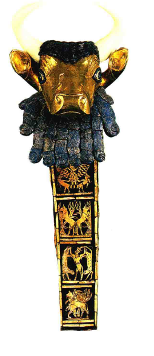

2. **亚述帝国的艺术与宣传**
   - 亚述国王**阿苏尔纳齐拉普利二世**（King Asurnasirpal II）时期的艺术作品记录了**战争和征服的场面**
   - 这些作品如宫殿墙上的浮雕，以**战争和胜利**为主题，呈现了生动而详细的叙述
   - 然而，这些作品通常**只展示亚述人的胜利**，不描绘亚述士兵的伤亡，反映了**宣传和形象塑造**的目的
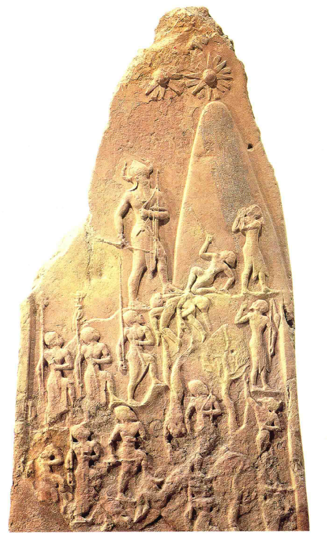

3. **古埃及与美索不达米亚艺术的对比**
   - 古埃及艺术在阿克纳顿的革新后，仍然回归到传统风格，持续**稳定**
   - 美索不达米亚的艺术**更注重动态和故事性**，与埃及的静态和仪式性形成对比
   - 这两种不同的艺术风格反映了各自文化和宗教背景下的审美和价值观
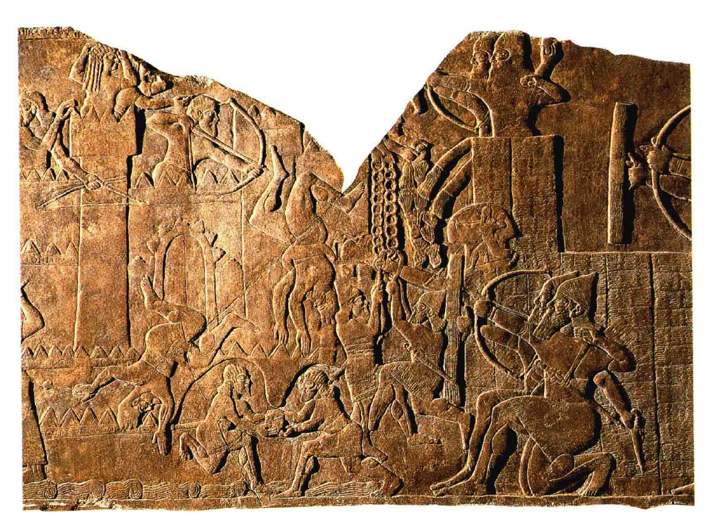