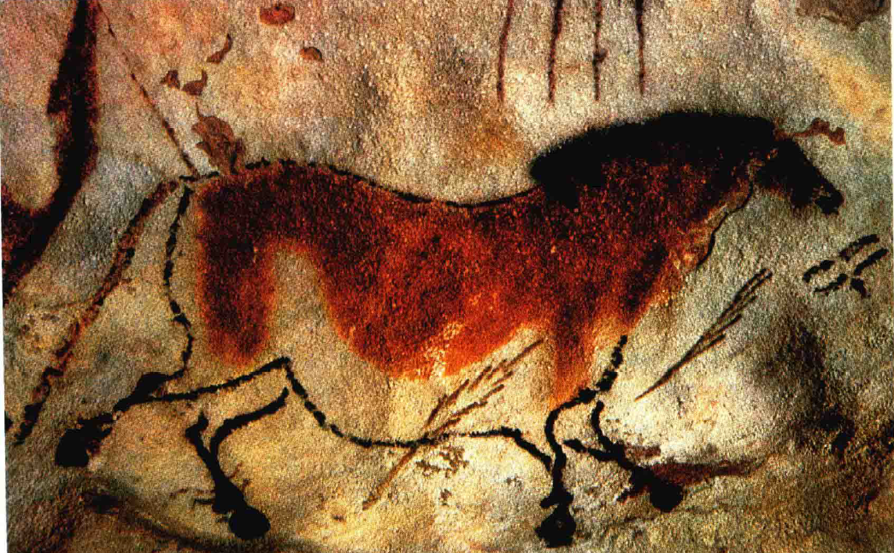
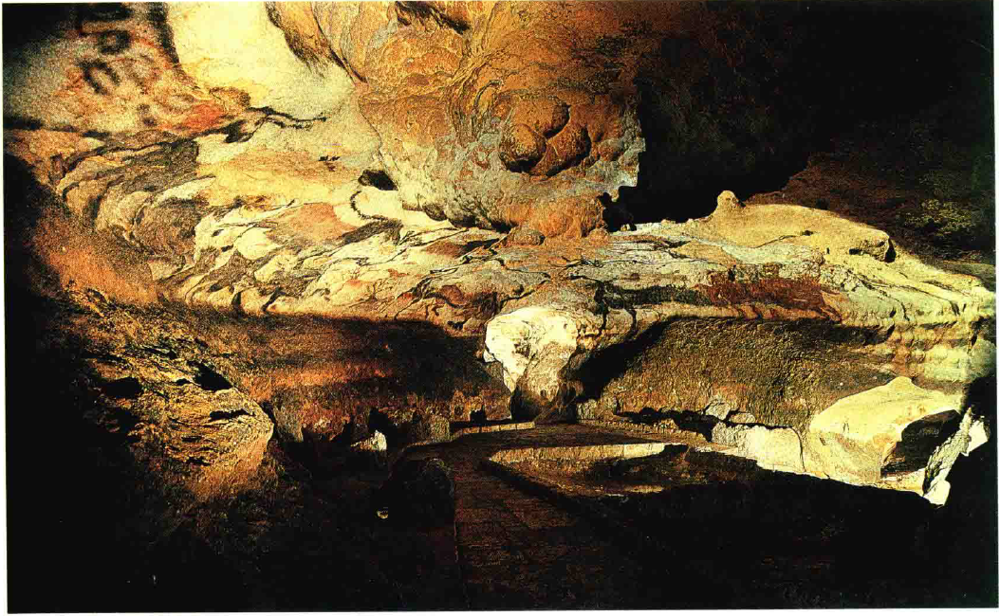
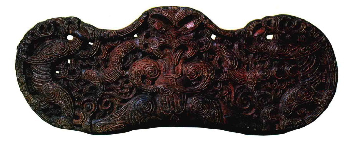
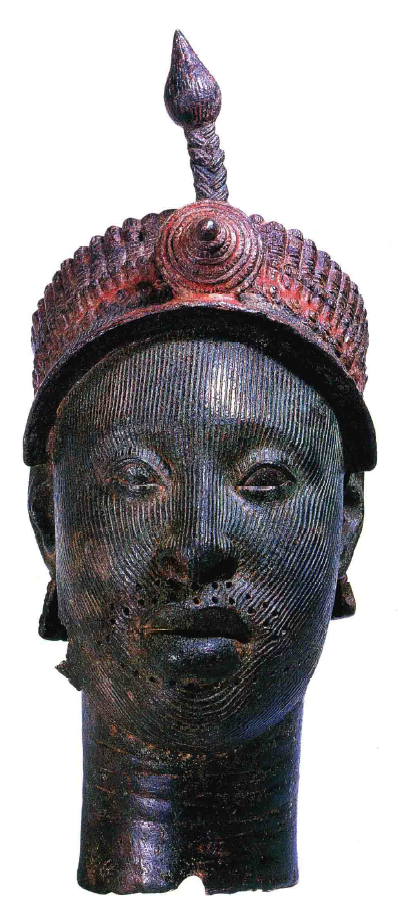
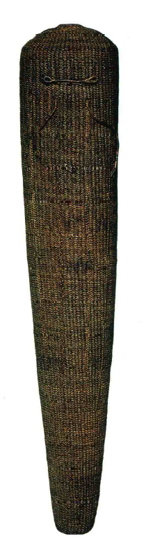
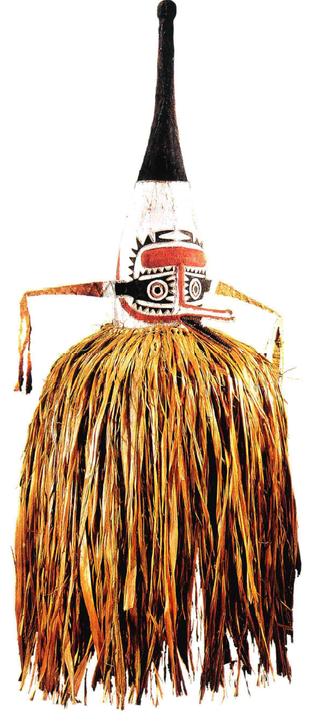
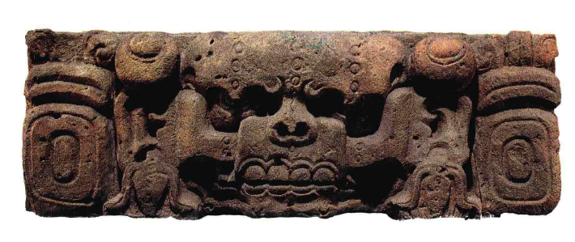
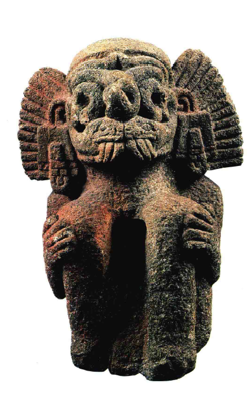

# 史前艺术
## 艺术的目的性
1. **艺术定义的变迁**
   - 艺术（Art）的定义**随着时代而变化**，初期定义包括建筑（Architecture）、绘画（Painting）、雕塑（Sculpture）和编织（Weaving）等实用性工作
   - 现代对艺术的理解更倾向于**精美的奢侈品**，如博物馆（Museums）和博览会（Exhibitions）中的展品
   - 这种变化反映了从**实用性到审美和装饰性的转变**

2. **建筑作为艺术的实例**
   - **建筑物**通常根据**实用标准**进行评价，同时也是艺术品的载体
   - 建筑物的设计和结构比例可能受到赞赏，但其主要目的仍然是**实用性**
   - 过去的**建筑家**（Architects）在设计中既追求实用性也追求“**合适性**”

3. **绘画和雕塑的功能性起源**
   - 绘画和雕塑最初被视为**具有明确用途的工作**，而非纯粹的艺术作品
   - 这些作品通常**服务于特定的目的**，如宗教或社会功能
   - 理解这些艺术作品需要**了解其背后的历史和文化背景**

4. **艺术与原始社会的联系**
   - 追溯历史越远，艺术的**功能性目的**越明显，也越奇特
   - 在**原始社会**（Primitive Societies），艺术的目的与**大自然和超自然力量的处理**息息相关
   - 原始人制作绘画和雕塑通常是为了实用目的，如避难或祭祀，反映了他们**对超自然力量的认识和尊重**

## 原始民族的艺术心理
1. **理解原始民族的艺术心理**
   - 艺术起源的理解需深入**原始民族的心理**，了解他们将艺术用作具有威力的工具而非纯粹的审美对象
   - 通过比较我们在现代社会中**对图像的情感连接**，如**不愿损坏亲近人物的照片**，可以发现我们自身仍保有某些原始思维
   - 这种心理联系帮助我们理解原始人如何将艺术与超自然力量联系起来

2. **原始艺术的功能和信仰**
   - 原始社会中的艺术，如绘画和雕塑，主要用于实践**法术**（Magic）和**宗教仪式**
   - 巫师和巫婆会通过**制作象征性的人像**来施行法术，期望通过此影响现实
   - 这种**艺术与信仰的结合**反映了原始人对艺术作品的实用和超自然看法

3. **冰河时代艺术作品的发现和解释**
   - **冰河时代**（Ice Age）的艺术作品，如西班牙**阿尔泰米拉洞穴**（Cueva de Altamira）和法国南部**拉斯科洞窟**（The cave of Lascaux）发现的穴壁画，最初**遭到质疑**，但后来被确认为**远古作品**

   - 这些作品的发现证实了原始人**对动物的深刻了解和描绘能力**
   - 对这些作品的解释倾向于认为它们是**原始狩猎者利用艺术进行法术实践的证据**
     - 图像分布在**人迹罕至的幽暗山腹**中，并且很少清楚地分布在洞顶和洞壁，而是**没有什么明显的顺序**

4. **现代与古代信仰的连接**
   - 尽管现代社会与原始社会在许多方面有显著差异，但某些古老的信仰和象征依然存在
   - 例如，**罗马的母狼铜像**和**伦敦特拉法加广场**（Trafalgar Square）的**不列颠之狮**都是古代信仰和象征的延续
   - 这些象征在原始部落中可能与**图腾崇拜和宗教仪式**有更直接的联系

## 文化约束与独创性
1. **原始部落的艺术实践与信仰体系**
   - 原始部落中，艺术的实践和信仰紧密相连，例如通过**舞蹈和面具**来模仿动物
   - 这些实践反映了他们**对于自然和超自然世界的深刻理解和敬畏**
   - 原始部落的成员通过这些仪式**体验身份转换**，反映了他们对世界的独特看法

2. **原始艺术的功能性与效果**
   - 原始社会中的艺术作品旨在服务于**特定的仪式和法术**，其重要性在于**是否能“发挥作用”**
   - 艺术家的任务不是创造美观的作品，而是确保作品能够实现**预期的超自然效果**
   - 这种艺术的评价标准基于其**功能性和效果**，而非仅仅是外观的美感

3. **文化和习俗对艺术的约束**
   - 在许多文化中，艺术作品的创作受到**特定传统和习俗的指导**
   - 例如，**国旗**（National Flags）的设计不可随意更改，**结婚戒指**（Wedding Rings）也有其固定的象征意义
   - 艺术创作在遵循这些传统和象征的同时，还需展现**一定的创造性和技艺**

4. **现代社会中艺术的象征性和个性化**
   - 尽管现代社会的艺术作品也有固定的象征和习俗，但仍留有**一定的个性化空间**
   - **圣诞树**（Christmas Trees）的装饰虽受到传统的影响，但每个家庭都有其独特的装饰风格和习惯
   - 即使在规定的框架内，人们仍然可以通过个性化的选择来**表达自己的趣味和审美**

## 技艺与观念
1. **原始艺术的技艺水平**
   - 尽管称为“原始艺术”（Primitive Art），但这**不代表技艺水平原始**
   - 许多偏远部落在**雕塑、编篮、制革**甚至**金属制品**（Metalwork）等领域展现出高超技艺
   - 如**新西兰毛利人**（Maoris）在木刻方面制作的精细作品展现了他们的高级技术

2. **原始艺术与功能性**
   - 原始艺术作品的主要目的是为了**特定的功能或仪式**，而非纯粹的美观
   - 这些作品需要**符合部落的文化和信仰要求**，而不是追求外在的审美标准
   - 艺术家的角色是使用他们的技艺和知识来完成作品的功能性目的

3. **艺术的观念与发展**
   - 艺术发展的历史不仅是技艺的提升，更是**观念和要求的变化**
   - 如尼日利亚（Nigeria）发现的青铜头像显示，部落艺术家完全能够**精确地表现自然**

   - 这些作品的出现证明了艺术家的技艺不是由外部影响，而是**本土文化的产物**

## 象征性
1. **原始艺术与象征性**
   - 原始艺术作品的**样式与外观**与其**象征性和功能性**密切相关
   - 例如，简单的**脸部涂鸦**（Doodle）表明即使**基础图形也能具有深厚的象征意义**
   - 这种象征性体现在**波利尼西亚**（Polynesia）的**战神像奥罗**（Oro）上，其有着**简约但具象征性的设计**

2. **艺术与几何图形的应用**
   - 原始艺术家可能使用**几何图形来构成人物或面孔**，这与西方艺术的表现方法有所不同
   - 这种使用几何图形的方法使得作品保持了一种**图案**（Pattern）的**统一与和谐**
   - 如**新几内亚**（New Guinea）的面具虽**不符合传统审美**，但在仪式上**具有重要的功能和象征意义**

3. **原始艺术家的精细技法与象征表现**
   - **原始艺术家**（Primitive Artists）创造出**具有装饰性的样式**来表现神话中的人物和图腾
   - 如**北美印第安人**（North American Indians）的艺术家既**观察自然**，又**以自己的方式表现形状**
   - 他们通过**简化的象征性形状**，如只用一个鹰嘴代表鹰，来传达特定的意义

4. **原始艺术作品的文化象征与故事表现**
   - **北美印第安海达部落**（Haida）的**图腾柱**（Totem Poles）展示了**复杂的部落传说和文化象征**

   - 这些图腾柱可能对外人来说难以理解，但对土著人来说，它们讲述了**部落的重要故事和信仰**

## 原始艺术与社会发展
1. **原始艺术作品的劳动投入与社会意义**
   - 土著人对制作巨大的图腾柱投入**巨大的劳动**，全村的男性可能都参与其中
   - 这反映了图腾柱在部落中的**重要社会和文化地位**
   - 制作过程不仅是艺术创作，也是**部落共同劳动和文化传承**的过程

4. **古代美洲文明中的艺术表现**
   - 如**科潘**（Copan）遗址上的**祭坛雕刻**和**阿兹特克雨神特拉劳克**（Tlaloc）的雕像，展示了古代美洲文明的**艺术与社会信仰的紧密联系**

   - 这些作品不仅是艺术品，也是**宗教仪式的一部分**，体现了当时社会的信仰和价值观
   - 雨神的雕像通过**象征性的元素**（如蛇的形状）来表达对自然现象的理解和敬畏

1. **艺术与文字的共同起源**
   - 古代文明中的艺术品，如特拉劳克雕像，不仅是**宗教象征**，也可能是一种**原始的文字表达方式**
   - 这些艺术作品**通过象征性的图案传达信息**，如闪电的象征可能被用来记录或召唤雷雨
   - 理解这些艺术品需要将其视为早期文明中的象征性文字和宗教表达