# 绪论
## 什么是艺术？
1. **艺术与艺术家的定义**
   - 艺术的定义**随时间和地点的不同而变化**，不存在绝对的、固定的艺术形式
   - 从史前洞穴画到现代广告设计，艺术家的工作形式**多种多样**
   - 重要的是认识到“**艺术**”这个词所指的内容是**多变的**，而不是一个固定的概念

2. **艺术品的接受与理解**
   - 人们对艺术品的喜好和理解常常与**个人经历和情感**有关
   - 欣赏艺术品时，个人的**情感、记忆和偏好**起着重要作用
   - 应避免因为**个人的偏见或不相关的联想**而错失欣赏艺术之美的机会

3. **艺术美的多样性**
   - 一件艺术作品的美不仅仅取决于其**表现的主题**
   - 不同的艺术家通过**不同的方式**表达美，这反映了艺术的多样性

4. **具体的艺术作品示例**
   - **鲁本斯的孩子素描**：鲁本斯（Peter Paul Rubens）为自己的孩子作画，表达了对孩子美貌的赞赏
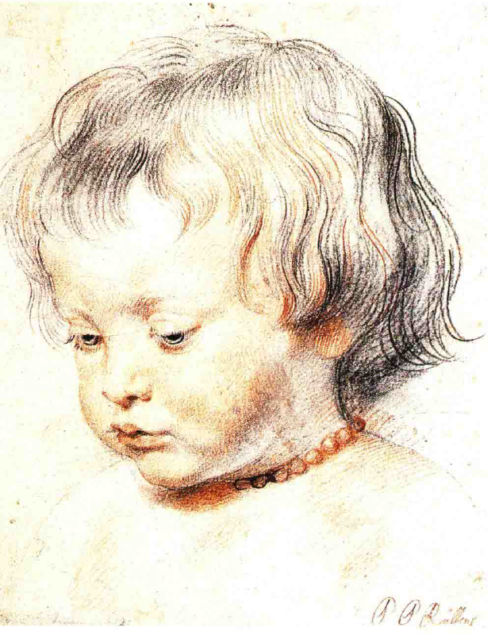
   - **丢勒的母亲素描**：丢勒（Albrecht Dürer）画他母亲时表现了真实而深刻的情感，尽管主题可能令人沉重
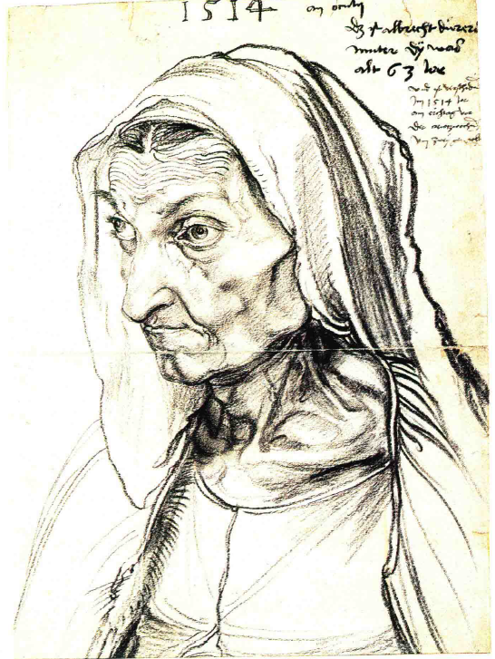
   - **穆里略的破衣烂衫的小孩**：穆里略（Murillo）通过画作展现了小孩的魅力，即便他们的外貌可能并不完美
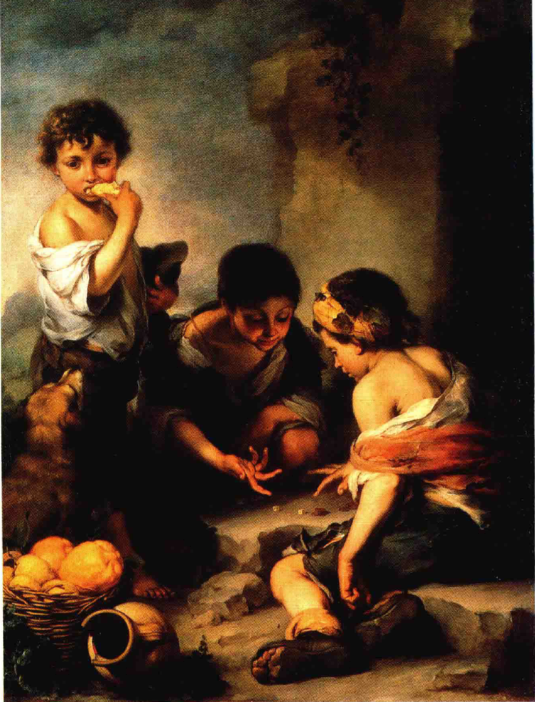
   - **皮特尔·德·霍赫的荷兰内景画**：霍赫（Pieter de Hooch）的作品中，孩子们的相貌可能平庸，但画作依然吸引人

## 主观性与多样性
1. **美的相对性和个人偏好**
   - 不同人对同一艺术作品的美感评价可能**截然不同**
   - 美感的主观性导致人们对艺术作品的偏好存在差异
   - 例如，有人可能更喜欢**梅洛佐·达·福尔利**（Melozzo da Forli）的天使画像，而另一些人则偏爱**汉斯·梅姆林**（Hans Memling）的作品
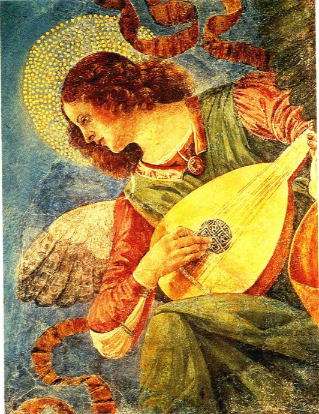

2. **艺术作品的多维评价**
   - 评价艺术作品不仅仅基于外在形式，还包括**内在美的探索**
   - 例如，梅姆林的天使虽**动作略显笨拙**，但仍具有**内在的魅力**
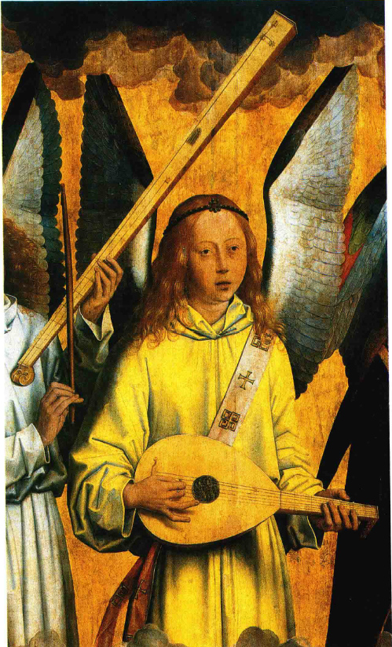
   - 对艺术品的深度理解需要**时间和耐心**

3. **艺术表现方法的多样性**
   - 艺术家采**用不同的方法**来表现情感和主题
   - 例如，**圭多·雷尼**（Guido Reni）的基督像表现了**强烈而明显的情感**
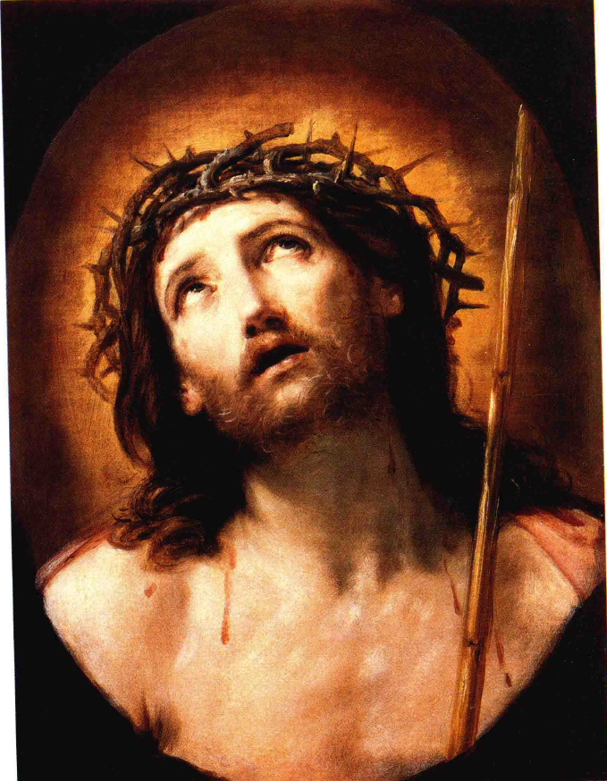
   - 反观中世纪**托斯卡纳画师**（Tuacan master）的耶酥受难图，表现手法较为**含蓄**，需要观众深入理解
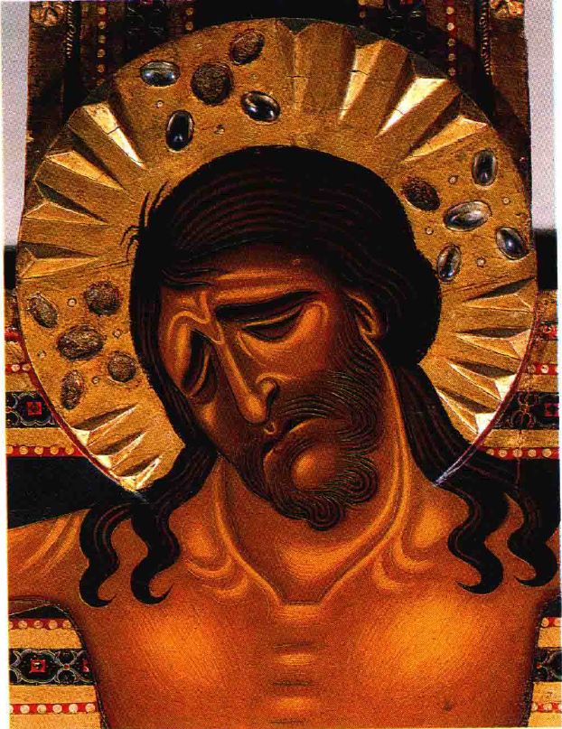

4. **“原始”艺术的感染力**
   - 早期艺术作品虽技术上**不够精炼**，但其表达的感情仍然**深刻动人**
   - 艺术的感染力不完全依赖于技巧的高低，而更多在于**情感的真挚传达**
   - 即使是**表现手法较为简陋的作品**，也能在观众心中留下深刻印象

## 关于“逼真”
1. **初学者的艺术欣赏观念**
   - 初学者倾向于赞赏“**逼真**”的艺术作品
   - 这种倾向体现了对艺术家**精准描绘技艺的欣赏**
   - 例如，**丢勒**的《**野兔**》因其细节的精确描绘而受到赞扬
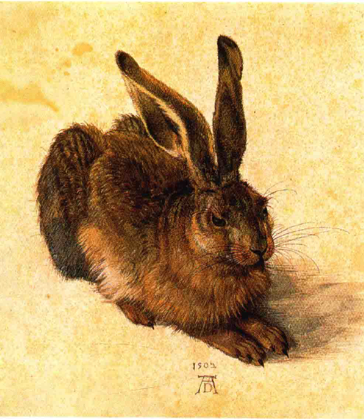

2. **艺术技艺与表现手法的多样性**
   - 艺术不仅仅是对现实的模仿，也包括**个性化的表达**
   - **伦勃朗**（Rembrandt Harmenszoon van Rijn）的《**大象**》素描虽粗犷，却展现了其独特魅力
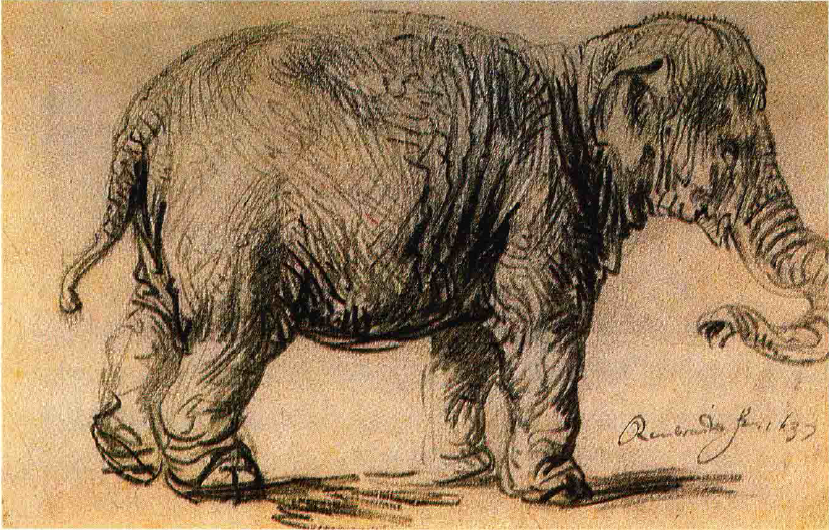
   - 艺术家通过**各种手法**表达他们的视角和情感

3. **现代艺术的误解与欣赏障碍**
   - 现代艺术常因**违背真实性**而遭到误解或批评
   - 例如，**迪士尼动画和连环漫画**中的形象被普遍接受，而**现代艺术**则受到质疑
   - 对于现代艺术的批评往往源于**对艺术家技能的误解**

4. **艺术家创新的正当性与目的**
   - 艺术家有意识地改变或歪曲现实以**表达特定主题或情感**
   - 例如，**毕加索**（Pablo Picasso）的动物插图体现了其创新和表现目的
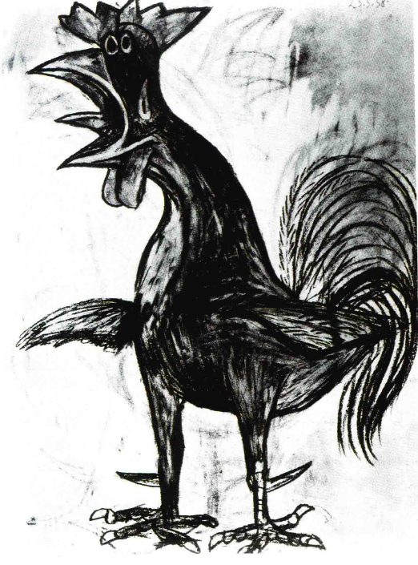
   - 艺术家的创新是为了更深刻地表达内在的思想和情感

5. **对“真实”的误解与艺术的真实性**
   - 人们常常**基于传统观念误解“真实”**
   - 如**马的奔跑方式**被误解，直至**摄影**揭露了真相
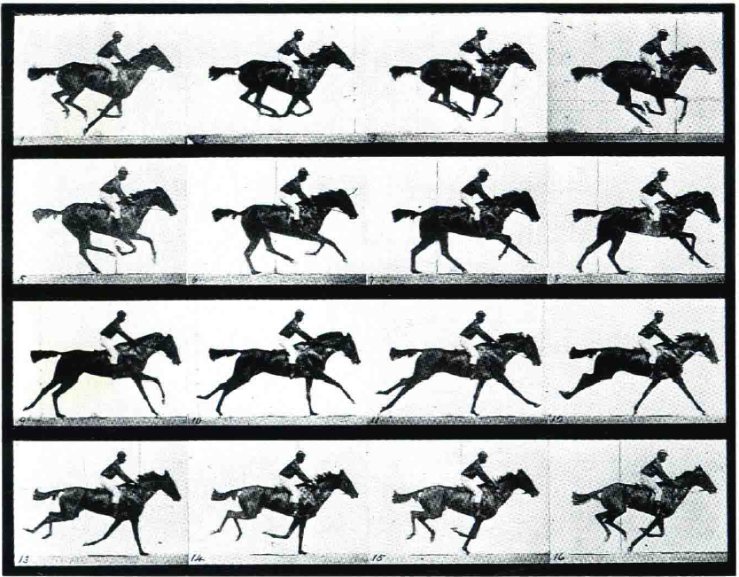
   - 艺术家运用新知识改变传统表现**时常遭遇误解和批评**

6. **艺术家对现实的新颖视角**
   - 艺术家努力**摆脱传统观念**，探索新的视角
   - 他们尝试**超越公认的色彩和形状概念**
   - 这种探索使得艺术作品呈现出不同于日常生活的新鲜和激动人心的美

## 传统与创新在艺术中的冲突
1. **观众对艺术作品的传统期望**
   - 观众通常对熟悉题材的艺术表现有**固定预期**
   - 对于**经典或圣经题材**，这种预期尤为强烈
   - 任何背离传统的艺术表现形式常被视为**不恰当或亵渎**

2. **艺术家对经典题材的创新解读**
   - 真诚和虔诚的艺术家会努力**用新视角解读经典题材**
   - 他们尝试**超越以往的艺术表现**，创造全新的画面
   - 这种创新尝试可能导致与传统观念的**冲突和不理解**

3. **卡拉瓦乔的艺术创新与挑战**
   - 卡拉瓦乔（Michelangelo Merisi da Caravaggio）以**大胆的创新精神**重新诠释了**圣马太**的形象
   - 他将圣马太描绘为一位**笨拙、不熟练的劳动者**，与传统圣徒形象迥异
   - 卡拉瓦乔的这种创新遭到了**强烈的反对和不接受**
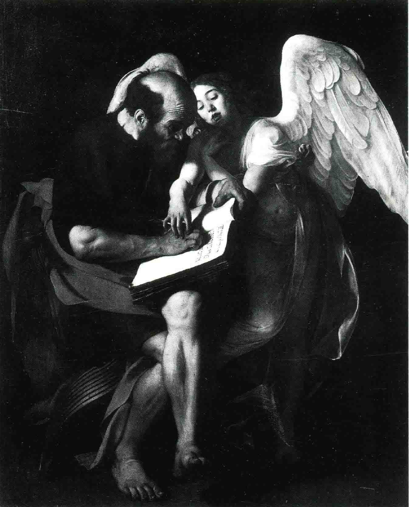

4. **传统与创新之间的折衷**
   - 面对批评和反对，卡拉瓦乔不得不**重新创作**，遵循传统形象
   - 第二幅作品虽然**技艺高超**，但缺乏第一幅作品的**诚挚和直率**
   - 这种折衷反映了艺术家**在创新与社会期望之间的挣扎**
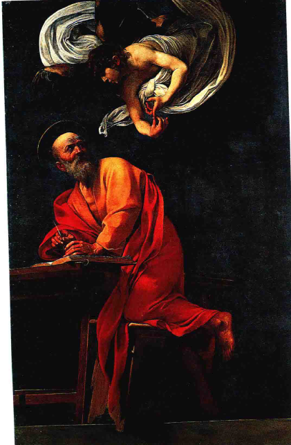

5. **对艺术观念的反思与启示**
   - 观众和艺术家需要**反思固守传统的态度**，以及这对艺术创作的影响
   - 真正的艺术创新往往需要**冒险和挑战现有观念**
   - 艺术的发展依赖于艺术家**敢于表达个人独特视角和情感的勇气**

## 艺术创作的现实性与艺术家的追求
1. **艺术作品的现实性与人为特质**
   - 艺术作品是**人为创造**，而非神秘产物，面向**具体人群**
   - 艺术品在制作时用于**实际的交互和讨论**，非单纯为展览
   - **博物馆的展品**虽显得遥不可及，但最初都是为**特定场合和目的**而创作的

2. **艺术家的创作决策与挑战**
   - 艺术家在创作过程中需做出**众多决策**，如场景、人物、细节的选择
   - 这些决策可能包括对**画面**的多次修改，对**颜色和形状**的深思熟虑
   - 艺术家可能因**客户要求或个人灵感**而对作品进行调整

3. **艺术家关注的核心：合适性**
   - 艺术家在创作时往往关注作品的“**合适性**”（rightness）
   - 合适性涉及色调、形状、平衡等综合元素，**难以用语言表达**
   - 这种追求不只是技术上的，而是对**整体和谐美感**的探求

4. **日常生活中的艺术体验与创作**
   - 日常生活中的活动，如搭配花束或调配食物，反映了**对和谐的本能追求**
   - 这些活动虽简单，却与艺术家追求作品中和谐的过程**相似**
   - 通过日常经验，我们可以理解艺术家在创作中追求的和谐与平衡

5. **拉斐尔《草地上的圣母》的创作过程**
   - 拉斐尔（Raphael）的作品《**草地上的圣母**》（The Virgin in the Meadow）展现了艺术家对作品**平衡和和谐的深度追求**
   - 他的**速写稿**展示了对人物姿势和关系的不断尝试和调整
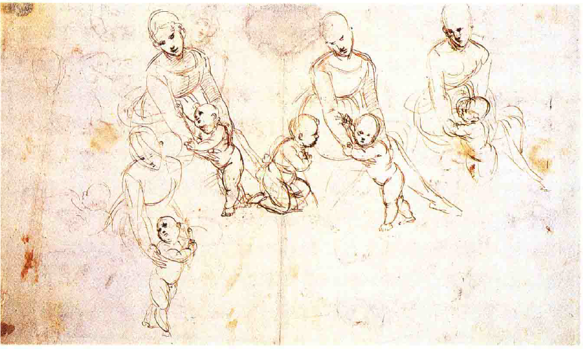
   - 最终作品的**自然和谐**是经过深思熟虑和不断尝试的结果
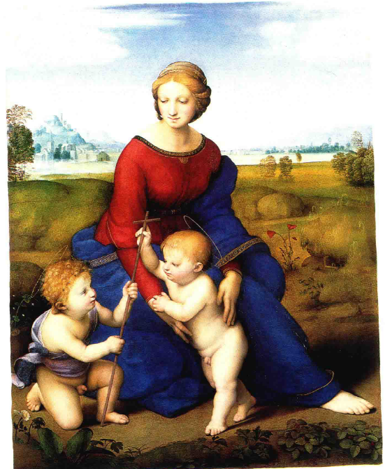

1. **艺术家劳动的复杂性与价值**
   - 艺术家在创作过程中的细致考虑和调整可能看似琐碎，但实际上**极为重要**
   - 他们对细节的关注和平衡的追求是创作过程中**不可或缺的部分**
   - 这种努力和挑剔造就了艺术作品的**美感和深度**

## 艺术创作的自由性
1. **艺术创作的不可预测性与规则的局限性**
   - 艺术家（Artists）在创作时**不墨守成规**，而是探索自己的道路
   - 尽管历史上有艺术家和批评家尝试总结艺术法则，但这些法则往往被证明**有限**
   - 低手和庸才可能严格遵循这些法则而无成就，而真正的艺术大师往往能**通过打破规则创造新的和谐**

2. **艺术规则的挑战与实例**
   - **乔舒亚·雷诺兹爵士**（Sir Joshua Reynolds）在**皇家美术学院**（Royal Academy）提出**蓝色不应在前景的规则**
   - **盖恩斯巴勒**（Gainsborough）通过其作品《**蓝衣少年**》（Blue Boy）挑战了这一规则，展现了颠覆传统的可能性
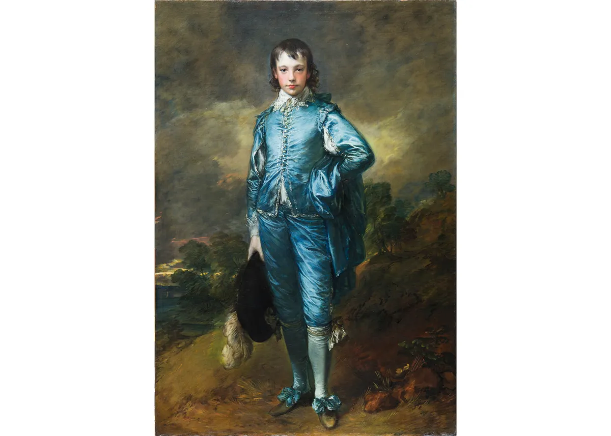

3. **艺术创作的个性化与合适性**
   - 艺术家在创作中追求的是作品的“**合适性**”（rightness），而非遵循固定规则
   - 这种合适性是基于艺术家的**个人感觉和创作目的**，难以用语言准确表达
   - 因此，无法用固定的规则来界定什么是伟大的艺术作品

4. **艺术欣赏的主观性与深度**
   - 尽管我们不能用规则来界定艺术，但人们仍可以讨论**艺术作品的趣味和特点**
   - 艺术作品的深度欣赏需要**积累和体验**，就像品茶一样
   - 通过不断接触和体验，我们可以提升**对艺术和谐的感知和欣赏能力**

## 艺术欣赏的深度与误区
1. **艺术作品的多面性与深奥**
   - 艺术作品（Artworks）如**活生生的存在**，每次观看都可能呈现不同的面貌
   - 作品犹如一个**独立且复杂的世界**，充满未知和不可预测的元素
   - 真正欣赏艺术需要具备**敏感性和洞察力**，以发现和感受作品的潜藏和谐和暗示

2. **艺术欣赏的心态与误解**
   - 对艺术的浅薄理解可能导致**自负和错误的欣赏态度**
   - 有人可能因知晓一些艺术原理而**自恃高人一等**，却**错失了真正的艺术享受**
   - 这种态度可能导致人们**故意追求**那些看起来不美或不正确的作品，以显示自己的独特见解

3. **艺术史学习的价值与风险**
   - 了解**艺术史**（Art History），包括**建筑**（Architecture）、**绘画**（Painting）和**雕塑**（Sculpture）的历史，有助于理解艺术作品的**创作背景和特定风格**
   - 知识可以增强识别艺术作品特性的能力，提高**细微差异的感受力**
   - 但也存在**陷入学术标签或术语**的风险，从而忽略了作品本身的欣赏

4. **艺术欣赏的真正意义与探索**
   - 艺术欣赏不应仅仅是对知识的检索或对术语的重复
   - 真正的艺术探索应是一次**新的视角和深入的体验之旅**
   - 这种探索可能带来**意想不到的发现和收获**，丰富个人的艺术理解和感受
