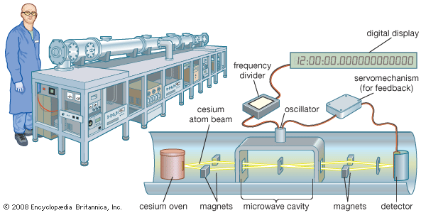
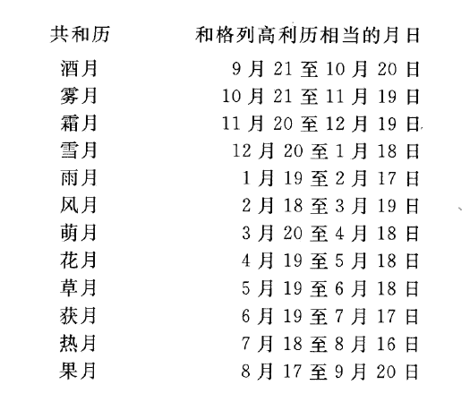

# 地球怎样围绕着地轴和太阳转动
### 地球运动的广泛影响
- 地球的各种运动不仅**对物质生活产生影响**，还深刻影响着**人类的精神生活**
- 这些运动提供了**测量时间的规律**，这种规律又**影响了人们的生活安排**，如工作、休息和节假日的安排
- 我们的**生存时间和岁月的划分**，以及**历法的制定**，都与地球的运动紧密相关

### 其他星球上的时间度量
- **不同的天体**上，时间的度量和地球大相径庭，显示出**自转和公转速度的多样性**
- **月球**上，一年只有**12个白昼**和**12个黑夜**，但总时长与地球上的一年相同，即**365日**
- 木星的自转速度**随纬度变化**，其一年约为**地球的12年**，但其单日时间非常短，一年中至少有**10500日**

### 长周期行星年的例子
- 土星和海王星表现出**极长的周期年**，与地球的时间单位有极大差异

- 土星的一年约为地球的**29年**，共有**25000日**
- 海王星的一年相当于地球的**165年**，而冥王星的一年更是长达**249年**，几乎是两个半世纪

## 昼夜
### 昼夜循环的基本概念
- **昼夜循环**（Diurnal Cycle）是由**地球的自转**引起的，导致太阳**对地球一侧的照射**和**另一侧的黑暗**
- 人类**最初的时间感知**基于昼夜循环，这是我们感受到的**第一种时间尺度**
- **季节变换**和**月相的变化**虽然也影响时间感知，但相对于昼夜的直观影响来说，**更为复杂且难以觉察**

### 夜晚对古人的心理影响
- 古代文化中常有**对夜晚的恐惧和不安**，例如印度古诗中表达了对太阳消失的恐惧和对黑夜的焦虑
- 黑夜被视为**缺乏光和热的状态**，人们担忧太阳**是否会再次升起**
- **昼夜更替**被诗歌和叙事中描绘为一种**宇宙间的永恒循环**，具有重要的文化和哲学意义

### 时间测量的演变
- 时间的测量最初基于**日**（day）和**月**（month）的自然周期，随后发展出**年**（year）的概念
- 不同的文化和地理位置**对时间的划分和测量有不同的方法**，如**日晷**的使用和对时刻的**标记**
- 地球的自转导致全球**不同位置的时间不一致**，这解释了为什么在任何时刻，一些地方处于**白昼**，而另一些地方则处于**黑夜**

### 地球自转对日常生活的影响
- 地球的自转不仅影响**时间的感知**，还影响人们的**日常活动**，如工作和休息的安排
- 地球自转引起的昼夜更替是决定地球上**生物节律和活动模式**的关键因素
- 在全球不同位置观察太阳的运动（如东升西落），进一步印证了地球**自转的物理现象**

## 时间
### 地球自转与时间的全球差异
- 地球上不同地点的时间由**子午圈**（meridian）定义，这些是通过地点的**经度差异**确定的
- 例如，在巴黎正午时，全球各地的真太阳时都有**显著差异**，显示了地球自转对时间感知的直接影响
- 地球的自转使得地点经过**不同的子午圈**，导致同一时刻在全球各地表现出**不同的时间**，如纽约的时间比巴黎晚约五小时

### 时间差异的具体示例
- 在**巴黎**是正午时，其他城市如**伦敦、罗马和东京**则分别显示为11时50分、12时40分和21时09分
- 这种时间差异**在法国国内也显著**，例如**斯特拉斯堡**的日晷时间比巴黎快21分40秒，而**布雷斯特**慢27分19秒
- 时间的差异也体现在日常生活中，**巴黎圣母院**的一个人看太阳上升的时间比**废兵院广场**上的另一个人早10多秒

### 地球自转对飞行和旅行的影响
- 如果飞行员沿巴黎的纬度线向西以**每小时1100千米**的速度飞行，他会看到太阳**始终在左边的上空**，因为他的速度**与地球自转速度相抗衡**
- 这种飞行模式使得飞行员在飞行24小时后**回到出发点时**，尽管**仍然是正午**，但地面上的同伴已经**经历了整整一昼夜**
- 类似的，绕地球旅行时，穿越**国际日期变更线**（International Date Line）会导致**日期的增加或减少**，这是为了保持日历**与地球自转的一致性**而设立的规则

### 时间与旅行的文化影响
- 穿越时间带和日期变更线对**长途旅行者**的日程有显著影响，如**麦哲伦**的航海伙伴们在返回时发现他们的日子**比预期少了一天**
- 这种现象在**Jules Verne**的《**八十天环游地球**》中被文学化，旅客们尽力避免超时以保持旅程在规定的80天内完成
- 时间的这种相对性和地球自转的物理现象提醒我们，在全球化时代，时间管理和日历系统的重要性及其对日常生活的深远影响

### 太阳日与恒星日的差异
- **太阳日**（Solar Day）即太阳**连续两次经过同一子午圈**的周期，其长度**不均匀**（平均为24小时），因为地球围绕太阳的**公转速度**在不同时间**不一致**，使得**太阳过子午圈的时间变化**
- **地球自转一周**的时间称为**恒星日**（Sidereal Day），通过**距离遥远的恒星**连续两次经过**某地的子午圈**的周期来测定，长度为**23小时56分4秒**，比太阳日短

- 由于地球在**公转的同时自转**，太阳日**比恒星日长**，平均差约**3分56秒**
- **恒星时**（Sidereal Time）因为基于**远处恒星**，相对于太阳时**更为稳定**，适用于**天文观测**

### 太阳时与标准时的区分
- **真太阳时**（True Solar Time）或**真时**通过**太阳日**来判定；其**不均匀性**导致时钟需要**频繁调整**，以匹配真正的太阳时间
- **民用时**（Civil Time）则是一种**均匀前进的时间**，其等于**真太阳时的平均值**，在一年内，真时比民用时快的总和和真时比民用时慢的总和**恰恰相互抵消**
- 在过去，人们依靠**午炮声**或其他方法来校准时钟，以符合真太阳时的变化
- 随着**民用时**的普及，人们渐渐**放弃了复杂的太阳时**，采用更为均匀的时间度量，简化了日常生活和技术操作的复杂度

### 地方时与日晷的现代应用
- 测量太阳时的**日晷**虽然不再是主要的时间测量工具，但依然可以通过调整显示**民用时**
- 日晷上的时间需要通过**时差**（equation of time）调整，以**匹配民用时**

- 日晷上附有装置，如**平时子午线**（analemma），这是一个**8字形曲线**，帮助直接读取**每天中午的民用时**

### 地方时的基本概念
- **地方民用时**（Local Civil Time）即**地方时**，由地点的**经度**决定，因为地球上不同地点的**子午圈**（Meridian）具有**不同的地理位置**
- 时间的差异由**两地的经度差**，或**两地经圈所成的角度**决定，显示了地球自转对时间感知的直接影响；不同经度的地点时间**均不同**
- 天文观测和航海依赖于精确的时间和地理位置的测量，使用如**六分仪**（sextant）和**星盘**（astrolabe）等工具进行

### 时区制度的实施
- **时区制度**（Time Zone System）被设计来**统一国家内不同经度位置的时间**，尤其是在**现代交通工具**发明后，统一时刻变得尤为必要
- **法国**在1891年废止地方时，规定使用**巴黎时**（Paris Mean Time）为**全国统一时间**，以解决地方时差异问题
- 地球被划分为**不同的时区**，每个时区内的时间**被统一**，但这种制度仍存在不是理想的问题，特别是在**地理边界附近**

### 时间的国际标准化与时区制度的建立
- 20世纪初，法国和其他国家逐渐废止基于**地方子午圈**的时间，改用**格林尼治子午圈**（Greenwich Meridian）决定的**标准时**（Standard Time）

- **时区**（time zone）制度通过划分地球**为24个时区**，每个时区相对于格林尼治的时间有**整数小时的差异**，简化了全球时间的管理
- 大部分国家（包括中国）所有的领土均在**同一时区**，而部分经度宽广的国家，如美国、加拿大和俄罗斯把自己的领土分为**若干个时区**

- 部分国家的**夏令时**（daylight saving time）和**冬令时**的使用是对标准时间的**季节性调整**，以更好地适应社会经济活动

### 地球自转速度的不均匀性及其对时间测量的影响
- 地球自转**并非完全均匀**，受多种因素影响，如**潮汐作用**和**气象条件**，导致**自转速度有微小变化**
- **恒星日**（sidereal day）与**太阳日**（solar day）的差异主要由地球在轨道上的**位置和速度变化**引起
- 现代天文学已能通过**极高精度的原子钟**（atomic clock）等设备，测定**地球自转的微小不均匀性**

### 高精度时间测量技术的发展与应用
- 精确的时间测量技术如**石英钟**（quartz clock）和原子钟在科学研究和技术应用中发挥着**重要作用**
- 原子钟通过利用**原子的振动频率**，提供了**远超传统机械时钟的精度**
- 这些高精度时间测量技术对于天文观测、全球定位系统（GPS）和其他高科技领域至关重要

## 历法的发展与年的计算
### 年与日的天文基础
- **回归年**（tropical year）是地球**相对太阳公转一周**与**季节周期**对应的时间，长**365天5小时48分46秒**，这是**决定年历长短的基本周期**
- **恒星年**（sidereal year）是地球**相对于恒星完成一周的公转时间**，略长于回归年，这种差异由**岁差**（precession of the equinoxes）引起

- 因**地球轴的岁差**，太阳在达到春分点的周期与完成一次完整公转的周期**有所不同**，影响了历法的计算与日常使用

- **常规年**（Common Year）是回归年的简化，即365天；**闰年**（Leap Year）是弥补常规年和回归年误差的修正，为366天

### 闰年的设置与历法的调整
- 地球围绕太阳公转的时间**不是整数天**，而是**365天**和约**四分之一**的时间，导致历法中必须设置闰年以保持**日期与季节的对应**
- **儒略历**（Julian calendar）开始**设置闰年**，每四年一次，但由于差距并非正好1/4天而是略短，这样设置将**矫枉过正**
- **格列高利历**（Gregorian calendar）通过**在四年一次的基础上**调整**百年和四百年周期**的闰年规则，规定每**逢百的四年之中**三年不置闰，只有能**被400除尽**的年才有闰年，纠正了儒略历的**累积误差**
- 这种调整是为了补偿地球绕太阳公转时间与整数天的**微小差异**，确保历法的**长期精确性**

### 不同历法的采纳与国际协调
- **1582年**，教皇**格列高利十三世**引入格列高利历，取消了之前积累的**10天差异**，这直接影响了当时使用该历法的国家
- 格列高利历最初主要在**天主教国家**使用，后逐渐**被世界多数国家接受**，成为现今国际上**广泛采用的标准时间系统**
- 英国和其殖民地直到1752年才从儒略历改为格列高利历，期间的日历调整引起了**社会上的混乱和抗议**

### 罗马历法的月份命名与起源
- **罗马历法**原始的岁首是**3月1日**，12个月的命名有其**特定文化和神话背景**
- 月份名称反映了罗马文化中的**神祇和社会活动**，如**Martius**（战神月）、**Aprilis**（开发月）、**Maius**（纪念玛亚女神）、**Junius**（纪念司婚女神朱诺）
- 后来的月份命名如**Quintilis**和**Sextilis**直接表示**月份的序号**，即第五月和第六月，这些后被改为**Julius**（7月）和**Augustus**（8月），以纪念儒略·恺撒和奥古斯都

### 共和历与气候适应性问题
- 1789年法国大革命期间创建的**共和历**（Republican calendar）试图更符合**气候变化**，每月名称与当地气候或农业活动相对应

- 共和历的月份如**酒月**（葡萄收获月）、**霜月**（霜降月）和**风月**（多风月），显示出尝试**与自然节律同步**的努力
- 尽管共和历在设计上考虑了气候变化，但因为只适用于**欧洲部分地区**且不适合南半球，因此**缺乏全球适用性**

### 现代历法的不合理性与改革建议
- 现行历法的不合理性体现在**岁首的设置**（1月1日）和**月序的安排**，如将原本以3月开始的历法改为**从1月开始**
- 改变历法的提议包括**调整月份名称**以适应**从3月开始的年度周期**，或者重新设计历法，使其**更为合理地反映历史和天文规律**
- 在历法设计上应考虑**全球性和适用性**，避免因局限于某一文化或地理位置而导致的适用性问题

### 历法与社会文化的关系
- 历法的设置与调整不仅是**技术问题**，也与文化、宗教和政治**紧密相关**，不同国家和文化对历法的改革和采纳有**不同的反应**
- 历史上的历法改革常常引起**民众的不安和抵制**，例如英国历法改革引起的抗议
- 历法的选择和调整反映了一个国家或文化在时间观念、工作、宗教节日等方面的社会实践和价值观