[TOC]
# 天空中的地球
## 天文学的重要性与其对人类理解的贡献
### 天文学对人类理念和生活的假设影响
- 如果地球永远被**浓云或不透光的覆盖物**遮蔽，天文现象将被**完全隐藏**，导致人类**对宇宙的无知**
- 在这种假设的情况下，人类的生活、意识和哲学将与现在**截然不同**
- 永恒的浓雾中生活会使我们对天上的奇妙现象**全无所知**，这种无知可能导致一种**完全不同的文化和科学发展**

### 天文学对人类自我定位的启发
- 天文学不再是少数专家的秘密，而是**启发了所有人的智慧**并揭示了自然界的真相
- 这种科学教育了人们**了解自身在宇宙中的位置**，增进了**对宇宙真相的基本认知**
- 即使是基本的天文学知识也**对每个人都是必要的**，这有助于消除对我们所居住世界的荒谬看法

### 天文学对地球认知的贡献
- 天文学揭示了地球是一颗**行星**，并且详细说明了它的**形状**（shape）、大小（size）、**质量**（mass）、**位置**（position）和**运动**（motion）
- 古代天文学起始于**对地球位置和运动的研究**，但确切的认识是依靠**近代天文学基于观测的结果**
- 地球**并非宇宙的中心**，而是在时间的长河中，向一个未知的目标**快速移动**，带着生死不已的人类**在太空中运行**

### 天文学知识的普及效应
- 几千年来，人类对地球性质和宇宙位置的认识**曾广泛错误**
- 现代教育使得即使是小学生也能轻易说出“**地球是圆的**”这一真理
- 这反映了经过长期努力，人类如何借助几何学和天文学揭示这一真理，而今天这已成为**基本常识**

### 地球在人类文化中的中心地位的误解
- 从表面现象来看，大地好像是**固定不变的基础**，使得人们**容易相信**地球是宇宙的中心和为人类居住而创造的
- 这种**中心论视角**如果没有受到挑战，可能会被**长期保留**
- 天文学的发展和普及帮助人类摒弃了这种**过时且中心化的看法**，认识到地球仅是宇宙众多行星之一

## 天文学的发展历程
### 天文学的起源和原始目的
- 天文学最初由**牧羊人**开始，他们在日落和日出时**观察简单的天象**，如月亮的盈亏和行星的运动
- 这些初步的观察促进了**对天文现象的系统研究**，最终发展成为**科学**，其中包括对日食、月食和彗星等的研究
- 例如，**流星**（meteors）被视为从天而降的奇观，**日食**和**月食**（eclipses）则是神秘而可怕的事件
- 天文学的主要发展动机是**了解天文现象与劳动生产的关系**，而不仅仅是出于好奇（curiosity）
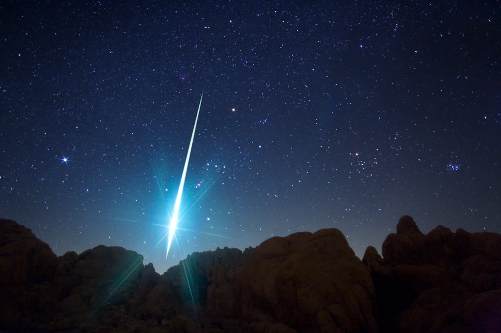

### 古代天文观察的历史记录
- **中国和古埃及**是**最早记录天文现象的文明之一**，中国记载了**公元前的新星和彗星**，古埃及则发展了**较为完备的历法**
  - 中国人观测了公元前2679年的新星，公元前2316年的彗星等
- 古代记录的保存通常**受到战争等因素的影响**，但一些重要的天文记录，如中国和古埃及的记录，被认为是**最早的系统性观测**
- 对天文现象的记录和观察帮助古人**调整和改进了历法**，例如古埃及在公元前4200年间**将一年的天数从360天改为365天**
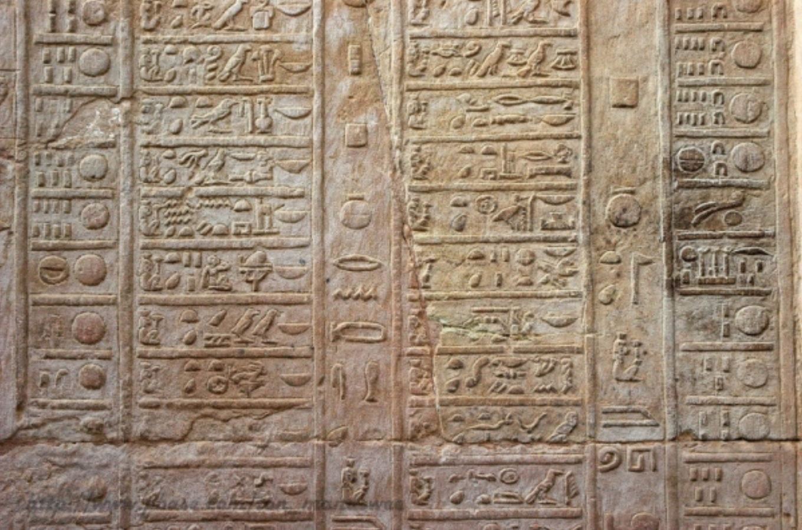

### 星期制度的天文学根据
- **星期**的制度最早起源于**犹太或巴比伦**，而**7天一星期**的命名是根据当时已知的**运动星体**（moving celestial bodies）：日、月、火（Mars）、水（Mercury）、木（Jupiter）、金（Venus）、土（Saturn）
- 星期**名字**的来源与**拉丁语**有关，尽管这种制度在3世纪才传入欧洲
- 如果古人认识到**更多的天体**，如天王星（Uranus）、海王星（Neptune）和冥王星（Pluto），我们今天的星期可能会是10天而非7天

### 古代对地球形状的理解和观念
- 在荷马时代，人们认为地球周围环绕着名为**俄刻阿诺斯的海洋**（Ocean）和太阳每晚**在其中熄灭重燃**的概念

- 人们注意到太阳、月亮、行星、恒星都有**东升和西落**的现象，而在落下去和升起来的时间间隔里，这些星辰都应该从**地下面**经过，这样就破灭了地是**无限深厚**的假象
- 人们根据地下和天空的观察提出了**地球形状的各种理论**，如地球是**悬空的**，或者是**固定在某些支柱上**
  - **赫西俄德**（Hésiode）以为地是一个**圆盘**，处于天穹和地狱之间，其间的距离曾经被**伏尔甘**（火神，Vulcan）所测定，他的砧从天穹落到地面需要九日九夜，再从地面落到地狱也需要同样长的时间
- 对地球和宇宙的观念在许多年代中一直影响着人们的思想和科学发展，直至更系统的地理学和天文学观测证明了地球是球形
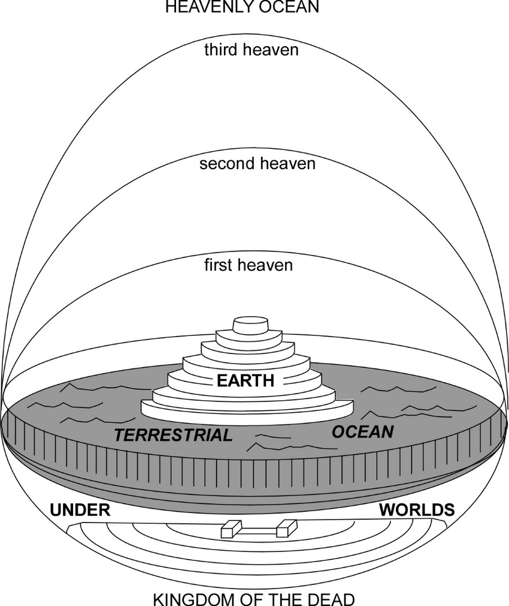

### 现代天文学观测与地球形状的证据
- 从1935年开始，人们使用**气球和火箭进行高空拍摄**，直接证明了**地球的球形**
- 高空照片显示**地平线的明显曲率**，这些是直接观测地球形状的重要证据
- 自1961年以来，**载人宇宙飞船的高空照片**进一步加强了对地球球形理论的认证

## 天文学的进展与对地球运动理解的深化
### 哥白尼革命与地球运动的历史
- **哥白尼**（Copernicus）在其著作《**天体运行论**》（De revolutionibus orbium coelestium）中提出**地球围绕太阳转动**的理论，挑战了长期以来的**地心说**
- 这一理论最初由古希腊学者如**伊塞塔斯**（Hicetas）、**埃斯方特**（Ecphante）和**阿利斯塔克**（Aristarchus）等提出，但在哥白尼之前并未被广泛接受
- 哥白尼的理论直到**1543年**他去世时才逐渐被接受，其思想改变了人类对宇宙的根本理解，证明了天文学的**重要性和进步**

### 地球运动的具体现象和影响
- 地球**每24小时绕其轴旋转一周**，这一运动形成了**昼夜更替**
- 地球同时**绕太阳运行**，一年内完成**约9.4亿千米的轨道**，这一运动形成了**季节的变换**
- 地球的**快速运动**，每秒**约30千米**，是日常生活中**不可感知的**，表明我们的居住环境极为动态而不是静止的
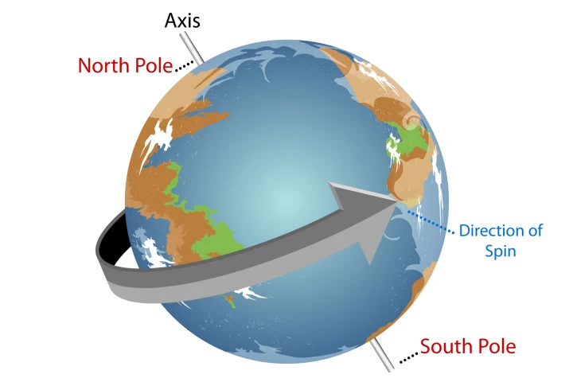

### 天文观测对地球角色的重新定义
- 哥白尼将地球定位为宇宙中的一个**普通星体**，与月亮或其他行星无异，其光是**反射太阳光的结果**
- 从宇宙的**其他地点**（如金星）看地球，地球可能是天空中**最明亮的星之一**
- 地球的**自转和公转运动**是我们**时间观念的基础**，如天、星期、月、季、年等时间单位都是基于这些运动的周期
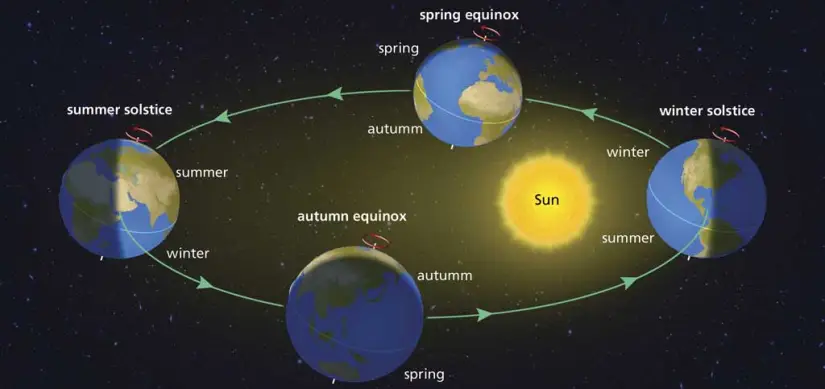

### 地球运动的哲学和视觉影响
- 假想场景中，如果有人在距离地球轨道不远的空中看到地球滚动而来，会感到极大的震惊和惊奇
- 我们生活在一个**不断移动的平台上**，所有**周围的环境**如空气和水都参与这种运动
- 地球在空中的运动**没有摩擦和碰撞**，显示了其在宇宙中理想轨道上的稳定和优雅

## 地球的多种复杂运动及其影响
### 地球与月亮的重心运动
- 地球和月亮围绕**它们的共同重心**进行运动，这个重心位于地球中心下方约1700千米的位置
- 由于地月系统的这种运动，地球在这个较小的轨道上**每月转动一周**，直径为**9320千米**
- 这种运动导致所谓的**月角差**（Parallactic equation），影响天文观测和历法的精确性
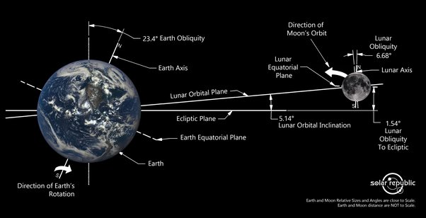

### 地球自转轴的岁差运动
- 地球的**自转轴**（Rotational Axis）并不固定，而是进行**慢速的圆周运动**，这被称为**岁差**或**二分点的进动**（precession）
- 这种运动由于太阳和月亮**对地球赤道凸出部分的引力作用**而产生
- 完成一次完整的岁差周期大约需要**26000年**，这种**慢速变化**对长期天文学研究极为关键
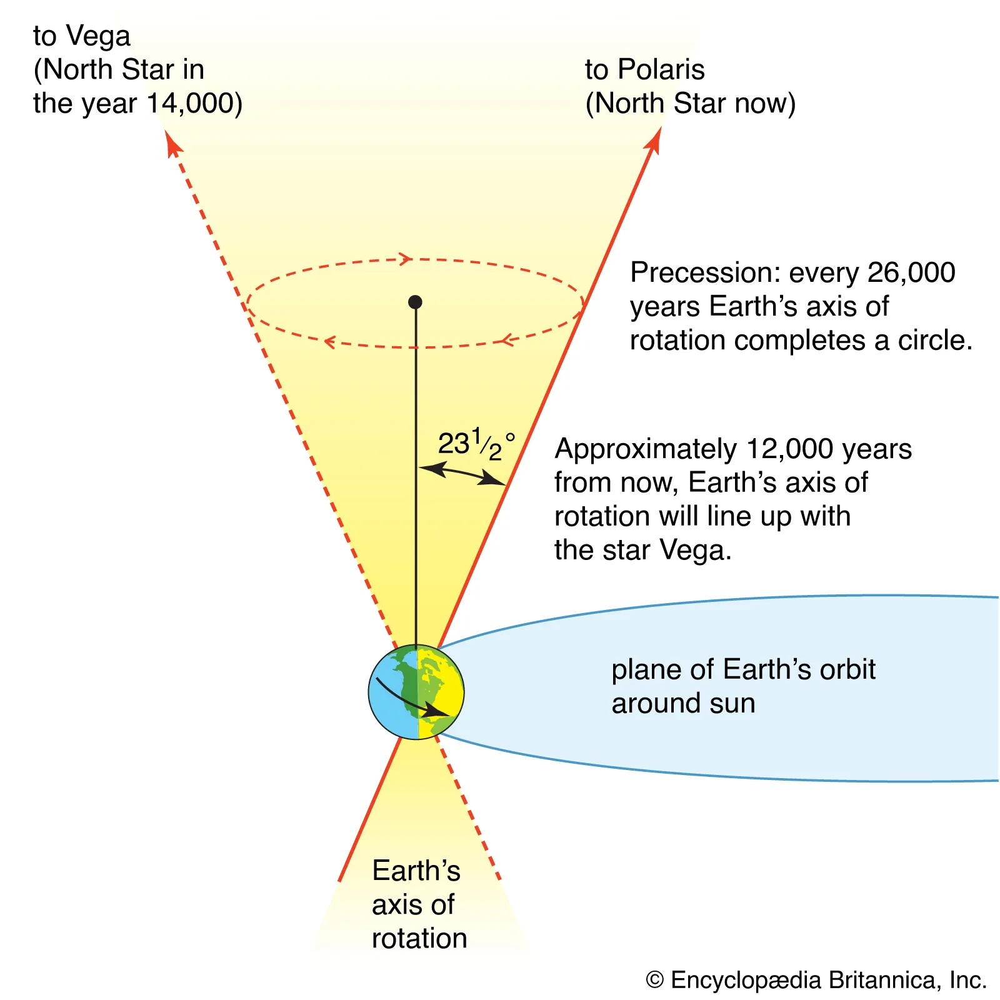

### 地球自转轴的章动运动
- 除了岁差，地球自转轴还展现出**章动运动**（nutation），主要由**月亮对地球赤道凸出部分的吸引**引起
- 极点在星空中的路径为一个**小椭圆**，大约**18年7个月**绕行一周
- 章动的轨迹和周期是岁差的一个补充，同样重要于精确的天文定位
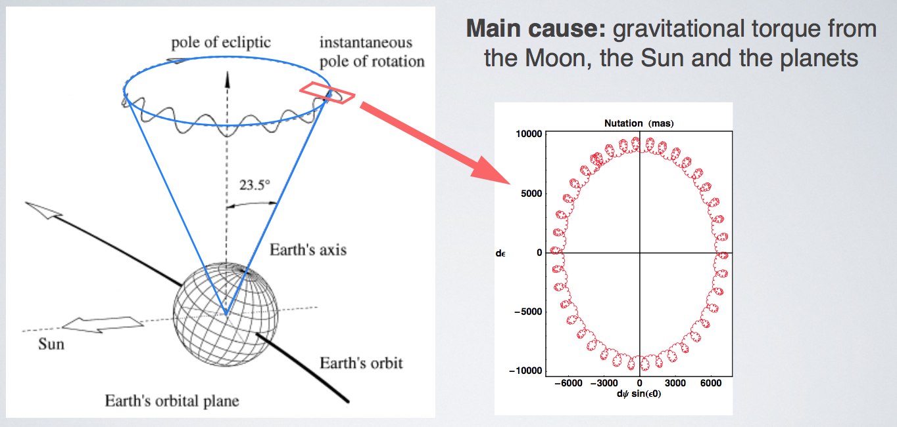

### 黄赤交角的变化
- 地球的**自转轴**和**轨道平面**（黄道，ecliptic）之间的交角也在缓慢变化，目前约为**23°27'**
- 这个交角的变化对地球的**季节变化**有深远影响，决定了季节的**强度和持续时间**
- 长期而言，这种变化导致**地球气候的显著变化**，从而影响生物多样性和生态系统
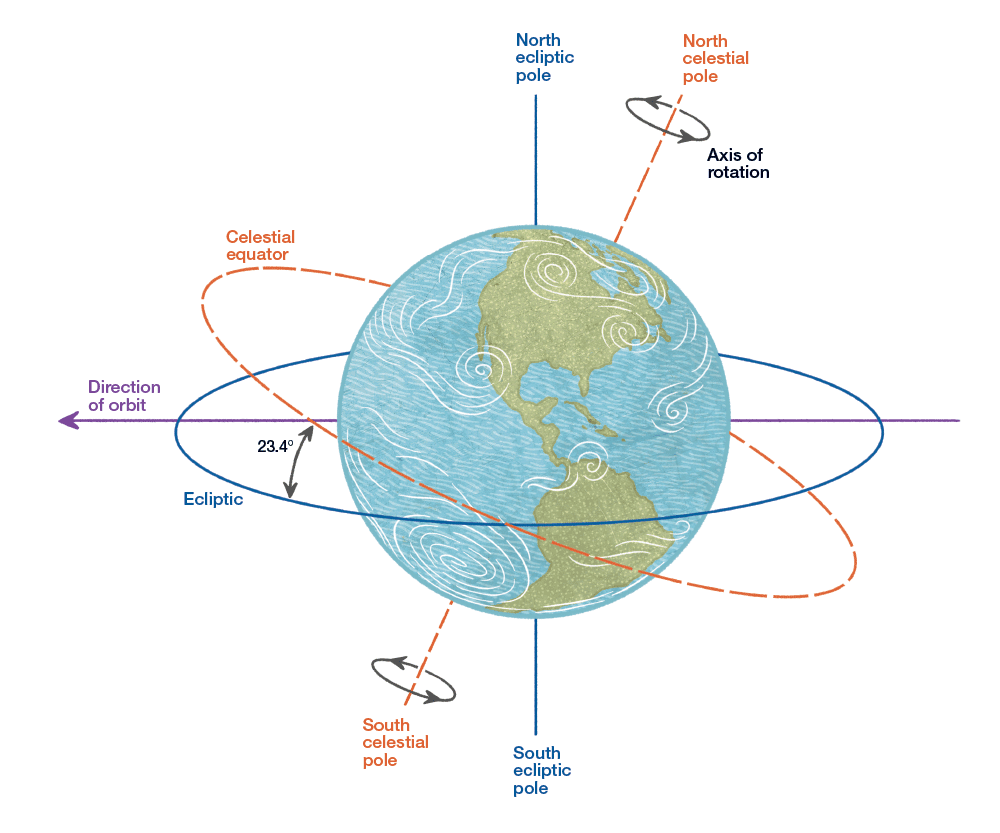

### 偏心率的长期变化
- 地球绕太阳运行的轨道不是完美的圆形，而是呈**椭圆形**，且这个椭圆的**扁率**（eccentricity）在逐渐变化
- **近日点**（perihelion），即地球轨道上**离太阳最近的点**，也在逐渐移动
- 这种**偏心率的变化**以及**近日点的移动**对地球的**季节和气候变化**有着重要影响
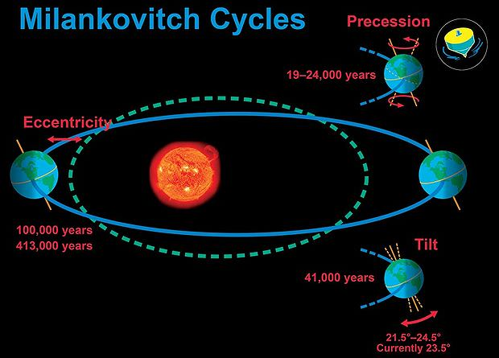

### 太阳系重心与行星间的相互作用
- 太阳围绕**太阳系**（Solar system）的**公共重心**（Barycenter）运动，影响了**地球公转轨道的中心**
- **行星间的引力变化**，尤其是**金星和木星**的影响，导致地球轨道的各种**摄动**（perturbation）
- 这些行星间的相互作用使地球的**轨道和运行速度**出现微小变化，影响地球的气候和环境
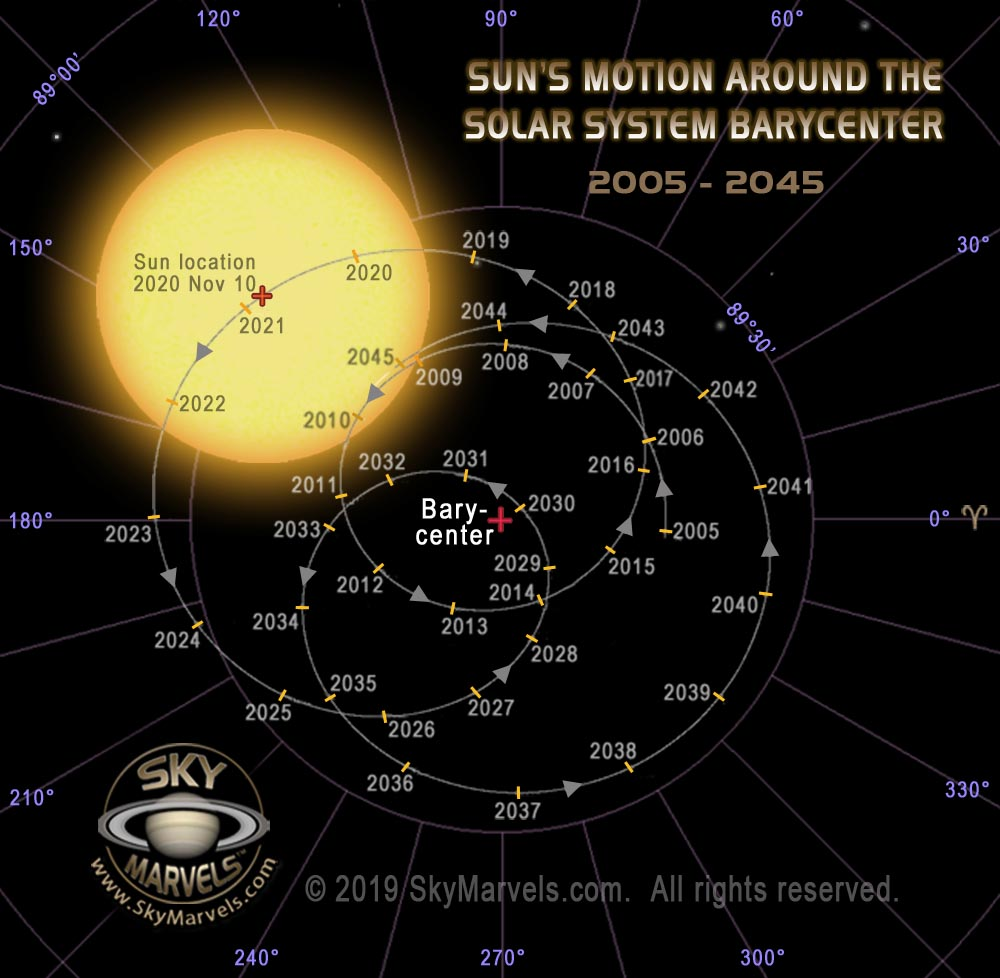

### 太阳系及银河系内的行星运动
- 地球不仅在太阳系内运动，还随太阳在**银河系**（Milky Way galaxy）中运动
- 银河系内的运动涉及**所有太阳系的星体**，银河系自身可能也在**进行旋转**
- 地球的位置和运动轨迹在星空中是**唯一且不重复的**，呈现出无穷尽且常变的**螺旋运动**
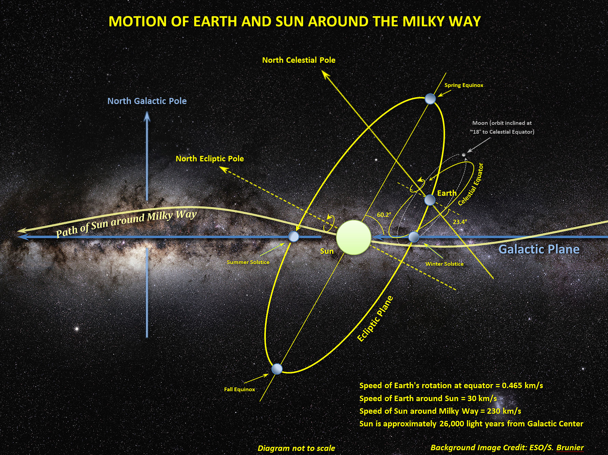

### 地球自身的物理变化
- 地球因为**潮汐力、气象现象、地理纬度的变化**以及**地震和火山活动**，正在经历不断的**物理形态变化**
- 这些变化虽然**在短时间尺度上不显著**，但在**地质历史**的长期尺度上造成了显著的**地貌和环境变化**
- 地球表面的改变是地球作为行星在持续运动中的必然结果，对生物和环境有深远的影响
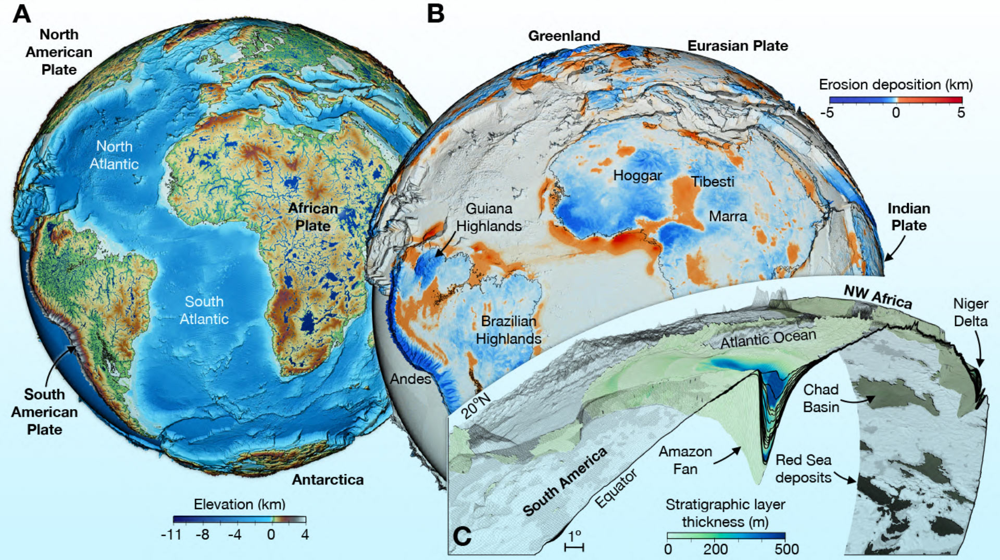
