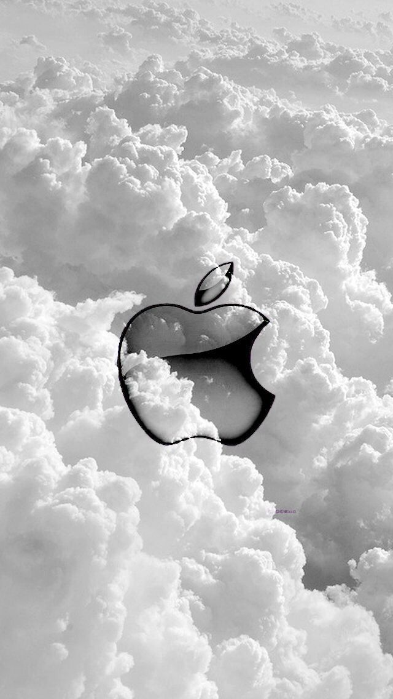
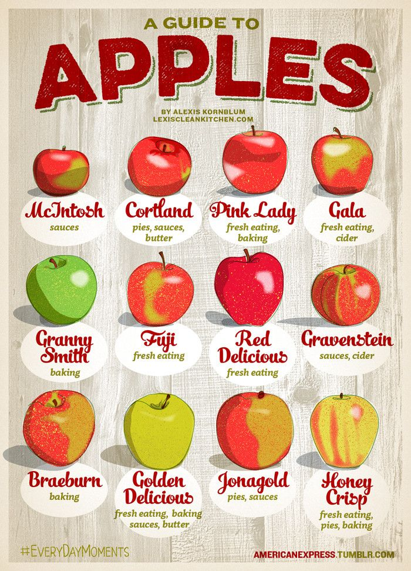
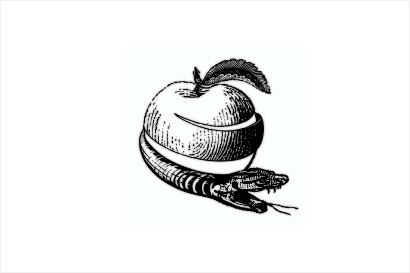

# 图像设计基础
## 图像的分类
* 图形代表事物本身，我们称这类图形为**指示图形**（denotative images）
  * 指示图形也可以象征大量的内涵，例如用于制作形象的技术，形象的美学，以及事物本身的性质，例如苹果看起来健康，美味或腐烂和恶心
  * 设计师增加额外的信息，并且与受众交流信息，这会对受众对事物的态度产生很大的影响

* 当设计师开始改变它的指示形象或者原型形象，将之与其他元素的图像搭配时，图形将变得更加复杂；事物不再只是事物本身，它可以代表了或暗示了一个不同的想法，我们称这类图形为**内涵图形** （connotative images）
  * 例如，如果把学位帽放在苹果上，苹果图形就变成了关于知识的；如果放了几条线，表明苹果正在下落，你能明白那个图形是关于重力的；苹果一半是红色，一半是绿色，这可能是关于善良和邪恶的；或是一条蛇缠着苹果，观众可能会领会到关于罪或诱惑的形象
*  我们不一定要看谁能画出最完美的苹果；平面设计并不总是关于完美，往往更多的是创造**意外的或原创的作品**

## 指示图形
* 指示图形制作是一种最简单的图形制作；它是对象**原来的样子**，是该对象的一个准确表述，没有任何其他意义附加其上
* 当制作一个指示图形时，首先要做的是了解这个对象的**精华**是什么；如果没有能够成功传达出其最明显的特点，对象就可能被错认为其他事物
  * 例如，作为一个苹果，我们如何认出这个图形？ 它在一定程度上的形状，它的部分颜色，部分纹理，可能是它的比例， 可能是它有某些元素帮助我们认识到这是一个苹果，而不是别的东西
* 单一对象能以许多**不同的状态**存在，也能以**不同的视觉风格**被设计，却可以仍然表达自身
  * 我们甚至可以将图像分解个更小的部分，我们仍然可以识别出它是一个苹果；我们可以用这些苹果切片来组成一个新的整体，我们也能改变我们看苹果的视角

* 可以用非常**简单化的和标志性的图形**表达事物，传递很少的信息与细节，但可辨认性非常高；也可以使用**复杂与装饰性的图形**，传递更多的信息与细节，但可辨认性相对不高
## 内涵图形
* 内涵图形传达了一个比喻或一个想法，可以被从**其他的意义**去解读
* 内涵图形的制作所呈现的东西，要比仅仅的视觉表现多得多；设计师实际上是在创造意义，在讲述故事，创造叙述给观众提供**额外的信息**
* 解读外延（指示）是很容易的；但讲述间接的故事，支配我们向观众传达的意义更加困难
* 内涵图形可以是**文化意义上**的，对不同的文化来说可以意味着不同的东西；文化共识的观念可能会发生作用，但有时候确实要了解一定的历史，涉及到一定的文化，或者一定的语境，这使它更加复杂
* 内涵与我们如何使用语言的方式联系在一起；解读内涵图形的作用有时可以替代文本的表达
