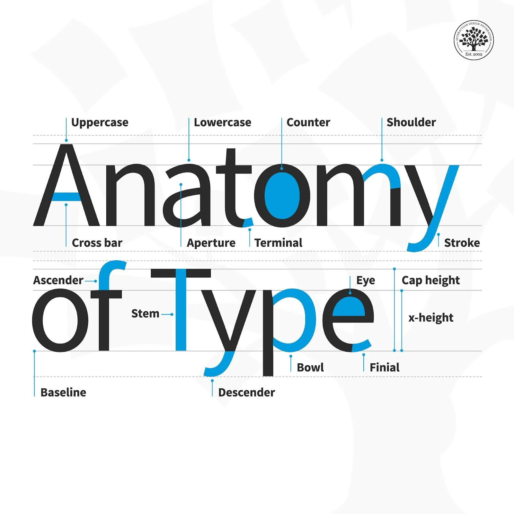
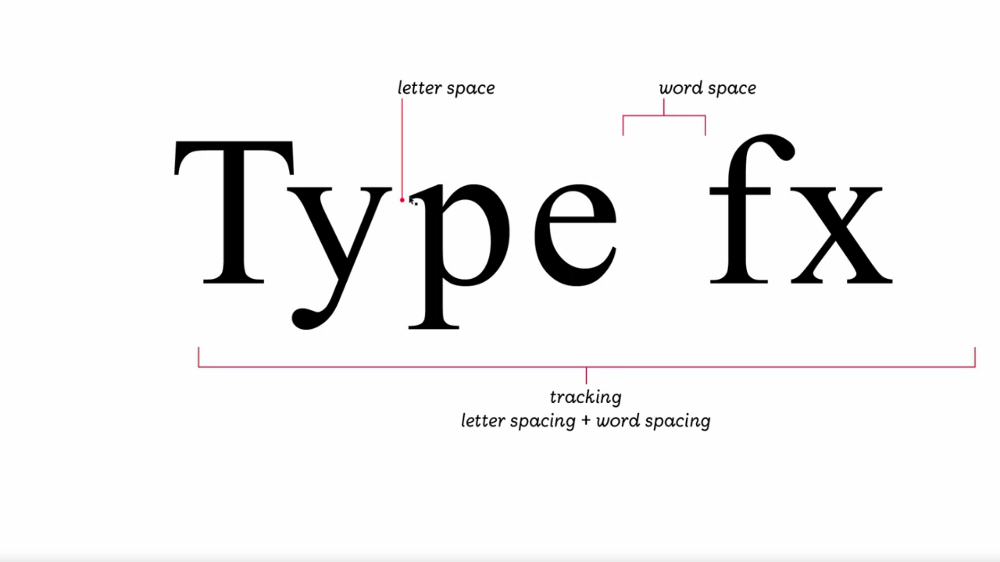
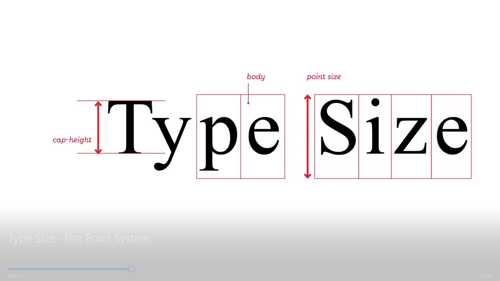
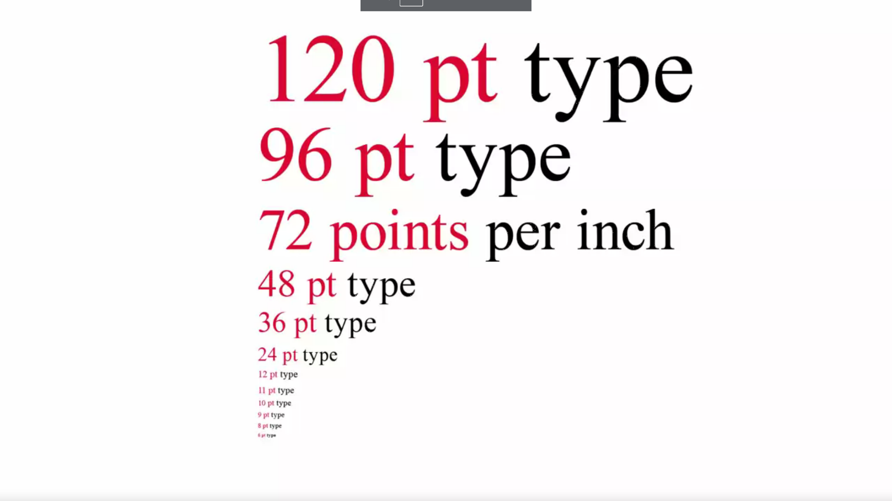
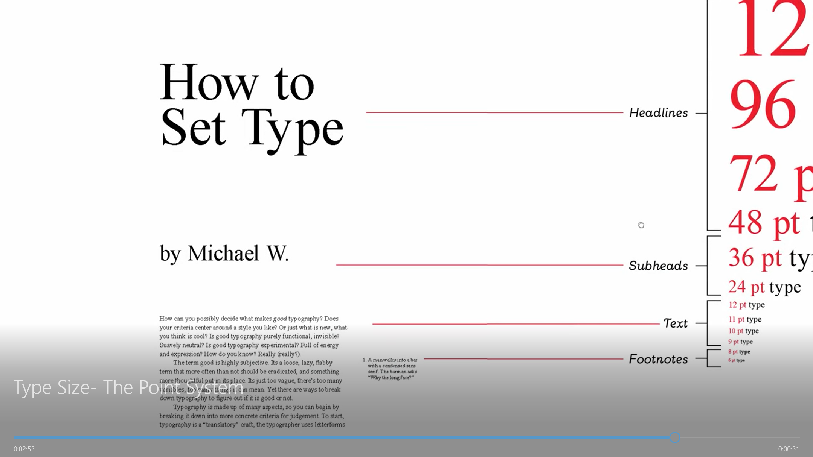
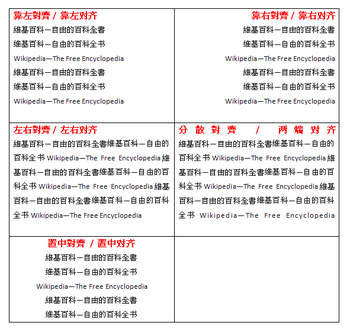
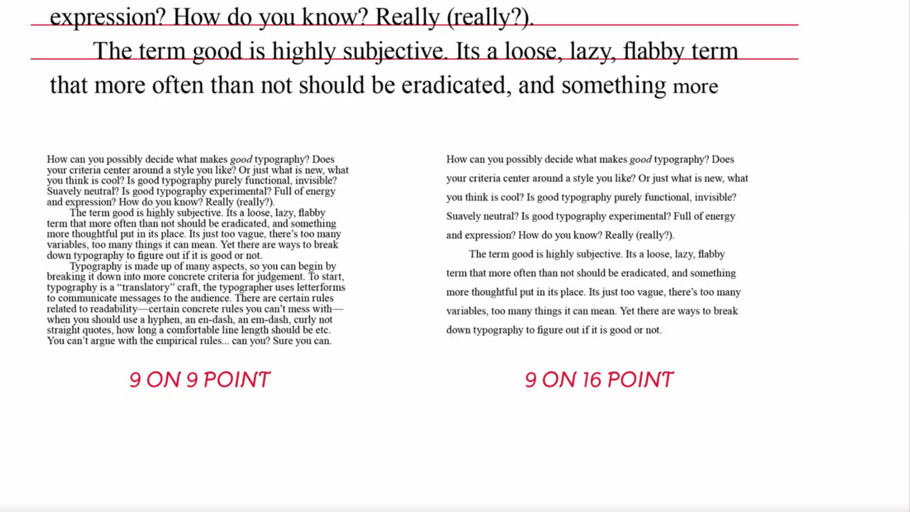
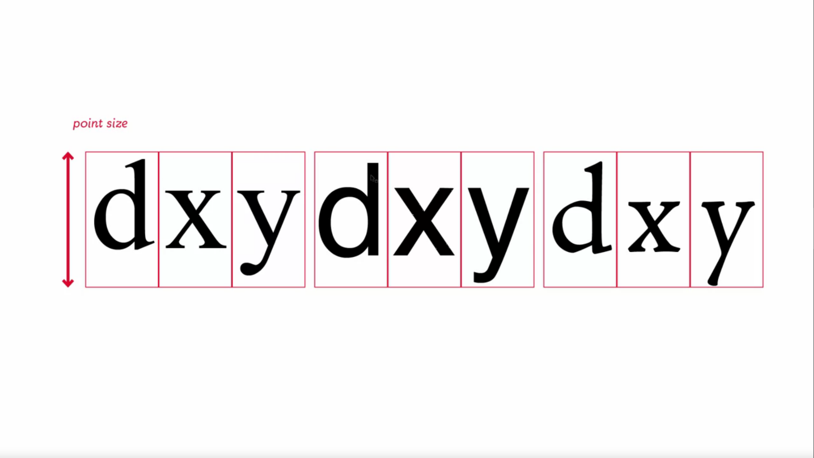

# 基础
## 字母的组成
* 字母形式是由**笔画**构成的
  * **孔径**（Aperture）：字体的部分封闭空间
  * **字碗**（Bowl）：一般为圆形或椭圆形，是字母的基本体形
  * **字怀空间**（Counter）：由字体包围的空白区域
  * **横杆**（Cross bar）：字母中的水平笔画
  * **点**（Dot）：也称为tittle，是小写字母 i 或 j 上的小变音符号
  * **眼**（Eye）：小写字母 e 的封闭空间
  * **尖顶**（Finial）：字形上的锥形或弯曲的末端
  * **连字**（Ligature）：两个或多个字母连成一个字符
  * **字肩**（Shoulder）：源自茎部的弯曲笔画
  * **字脊**（Spine）：小写或大写字母的主要弯曲笔划
  * **字茎**（Stem）：或多或少笔直的主要笔画，不是字碗的一部分
  * **衬线**（Serif）：添加到字母主要笔画之一的开头或结尾的笔画
  * **笔划**（Stroke）：构成字母主要部分的直线或曲线
  * **末端**（Terminal）：在字母末端的圆形形式
  * **粗细**（Weight）：字体笔划的粗细

## 词语与字距
* 单一字母形式组成的单词，看起来浮动在页面的空间上，但它们实际上排列在一条称为**基线**（Baseline）的无形的线上；基线落在大写字母的底部以及小写字母的主要的、中央部分的底部
* 罗马字母形式通常有两种不同的类型，有**大写字母**（Uppercase），还有**小写字母**（Lowercase）
  * 这些字母形式之所以被称为大写字母和小写字母，是因为在过去，金属铅字会被保存在铅字抽屉里，这些箱子会被恰好堆在印刷机的旁边；小写字母将会被保存在下面的一个箱子里，大写字母将保存在上面的箱子里
  * 旨在与小写文本混合的短大写字母被称为**小体大写字母**（Small Capital）
* 字母x可以真正揭示小写字母的高度，被称为**x高度**（x- height），即基线与小写字母'x'的高度之间的距离；大多数小写字母**高度相同**
  * **大写字母高度**（Cap height）即从基线到大写字母顶部的距离
  * **上升部**（Ascender）即延伸到字母x的高度上方的笔画
  * **下降部**（Descender）即延伸到超出基线的向下笔画
* 字母之间的空间被称为**字母间距**（letter space）；词语之间的空间被称为**词间距**（word space）
  * 如果你同时改变字母间距和单词间距，那就叫做**字间距**（tracking）

  * 如果我们把字间距调得**很小**，那么单词就会变得很难阅读，它们开始相互碰撞；如果我们增加字间距，让字体变得**很松散**，字母之间将会有很多空格，这也会让它看起来很难阅读
## 字体的尺寸
* 我们使用的测量印刷文字系统基于**印刷机**的时代，那时印刷用的文字实际上是放在金属上的，而金属用于在印刷机上打印字母形式；因此，每一个字母形式都是一个突出的**文字块**，而且它在背后有一个坚固的**金属正方块**作为“身体”（Body）

  * 为了打印它，印刷文字将有一个**统一的大小**，以便可以在印刷机上排列整齐；当我们测量印刷文字时，我们测量的是它的“身体”大小，又被称为印刷文字的**点的大小**（point size,pt）
  * 一英寸包括**72个点**，因此，一个点是一英寸的72分之一

*  在金属排字中，你必须选择你将要设置的尺寸，以一个**特定的大小**铸造印刷字体；在电脑屏幕上，你可以使文字呈现你喜欢的**任何点的尺寸**
*  120，96，72pt一般被用于**标题**（Headlines）上；中等规模的大小的印刷文字，如36，24pt被用作**小标题**（Subheads）；10点左右的印刷文字一般被设置为**文本**（Text），**脚注**（Footnotes）一般使用6、7pt的文字

## 排版文本
* 当文本被设置在一个块中以供阅读时，它被称为**正文文本**（body text）
* 首先要考虑的事情之一是该文本将如何**对齐**（Alignment）
  * **靠左对齐**（flush left）：文字靠齐**左侧边界**，在左边是均匀对齐的，而在右边是不均匀或粗糙的
    * 世界上诸多语言如英语，都是**从左到右书写**，文字对齐方式大都为“靠左对齐”；靠左对齐是**阅读长文章**的最佳对齐方式，如小说以及其他不设栏位的文本
  * **靠右对齐**（flush right）：文字靠齐**右侧边界**，在右边是均匀对齐的，而在左边是不均匀或粗糙的
    * 在其他（如阿拉伯文或希伯来文等）**从右到左书写**的语言，文字排列方式大多为“靠右对齐”；另外，英语也会使用此对齐方式，例如书籍或杂志中作者将其书献给某人的**引言**，或是某些表格资料的排版
  * **两端对齐**（justified）：文字同时靠齐**左侧及右侧边界**，字母或文字间的间距会跟着拉开以对齐右侧边界，更倾向于形成一个方形的**立体形状**，但段落的末行则不套用此对齐方式，而保留靠左或靠右对齐的方式（依据不同的语言决定）
    * **出版业**中最常见的排版方式为两端对齐；字间距被拉伸超过正常宽度的行称为**宽松行**（loose lines），而字间距被压缩的行称为**收紧行**（tight lines）
  * **居中对齐**（centered）：文字不靠齐左右侧边界，而是左右侧对著**文件中间点**靠拢
    * 这种对齐方式经常用在文件、诗或歌曲的**标题**，其与靠右对齐一样也可用于呈现**表格**内的资料；如果是多行的文章时，置中对齐是对读者来说是很**吃力**的，因为其会妨碍读者找寻下一行的起始点
  * **分散对齐**（distributed）：文字不论末行与否，全部**贴紧左右侧边界**

* **行长**（line length），也被称为**度量**（measure），即文本中行的长度
  * 对于**左对齐**的文本，**9到12个单词**的行长，大约是**60到70个字符**，对大多数人来说是一个舒适的阅读量，这意味着他们到达一行的末尾，可以很容易地找到下一行的开头
  * **两端对齐**的文本每行可以有更多的单词，大概在**70或80个字符**左右
* **行距**（leading）即两行文本间的距离，即是上下文本间**从基线到基线**的距离
  * 当字体大小和行距相同时，每行字体之间的空间非常小，这被称为**实行**（solid）

  * 在电脑上判断你的行距是否接近正确的一个方便的技巧就是用你的光标**高亮显示文本**；如果你能看到形成的黑条之间有太多的空间，那么你的行距可能太多了，如果你看不到任何空格，则可能需要多一点行距
* 即使不同的字体有相同的字体大小，在视觉上仍然表现不同
  * 这里有三种不同的字体，它们的大小都是72点，但可以看到中间的字体在视觉上要大得多；它的x高度要大得多，有较短的上升部和下降部，在正文中占据了更多的空间
