[TOC]
# “新艺术”运动
## “新艺术”运动概述
* **新艺术运动**（Art Nouveau）是19世纪末20世纪初在欧洲兴起的一场影响面相当大、内容非常广泛的设计运动
  * 从1880年代至1910年代，延续时间将近30年，其中1895—1904年间更是其**高潮期**；1906年以后，“新艺术”运动逐渐退潮，至第一次世界大战期间，完全结束
  * 这场运动席卷了**大部分欧洲大陆国家**，影响到英国和美国
* 作为人类社会进入20世纪以来最初的一种**原创性装饰模式**，也是第一个应用到**大众产品**中去的装饰模式，“新艺术”运动决绝地与19世纪热衷的各种历史风格复兴**分道扬镳**，为20世纪的设计，尤其是**应用美术**的设计打下一个新的形式基础
* 究其本质而言，“新艺术”并不单纯是一种风格或一种时尚，它是进入20世纪以来的**第一场设计运动**
  * **阿拉斯泰尔·邓肯**（Alastair Duncan）在他的著作《**新艺术**》（Art Nouveau）一书的前言中，就开宗明义地指出了这一点，其理由是这场运动在欧洲各国产生的背景虽然相似，但所体现出的风格却是**各不相同**
  * 苏格兰设计家**查尔斯·马金托什**的家具设计与西班牙建筑家**安东尼奥·高迪**（Antoni Gaudí，1852—1926）的建筑和室内设计之间，几乎找不出共同点

### “新艺术”运动的产生原因
* “新艺术”运动的产生原因“新艺术”运动与19世纪下半叶在英国和美国兴起的“**工艺美术**”运动既有不少**相似的地方**，也有许多**区别**
  * 两者都是对矫饰的**维多利亚风格**和其他过分装饰风格的反动，都是对**工业化风格**的反动，都受到**威廉·莫里斯**的思想理念和设计实践的影响
  * “新艺术”运动继承了“工艺美术”运动对**大自然的崇尚**，强调从自然界汲取设计的灵感和动机，以大自然作为最基本的创作源泉
  * 拉斯金、莫里斯等人关于将绘画、雕塑等纯艺术与装饰艺术融合起来，打造“**整体艺术**”（total work of art）的主张，对于“新艺术”运动的设计师们很有启发
  * 但是，“工艺美术”运动推崇**哥特风格**，强调**手工艺的复兴**；而“新艺术”运动则放弃任何一种传统装饰风格，完全走向**自然主义**，强调自然中**不存在直线**，强调自然中**没有完全的平面**，在装饰上突出表现曲线、有机形态
  * “新艺术”运动的设计师们接受莫里斯对于工业化批量制造的产品丑陋粗劣的批评，但并不认可他对于**工业化机械生产**的完全抗拒和彻底否定
* “**拉斐尔前派**”艺术家们作品中那些含情脉脉的、略显神秘的**女性形象**，在“新艺术”运动的广告、海报创作中得到继承和进一步的发展
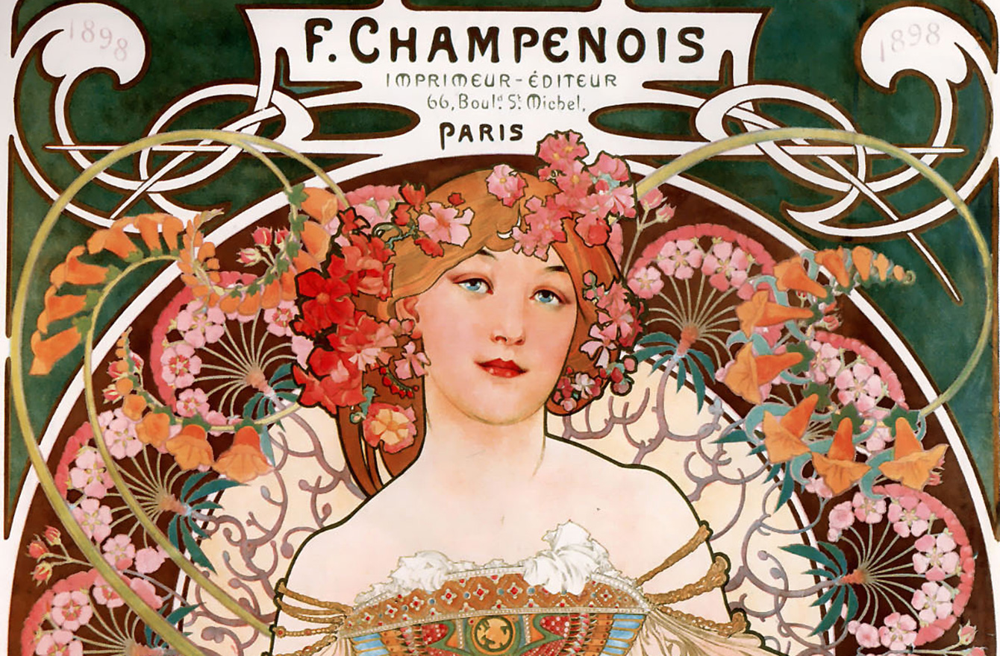
* 和“工艺美术”运动相似，“新艺术”运动在很大程度上也受到**日本装饰风格**，特别是日本**江户时期**的艺术与装饰风格，以及**浮世绘**的影响
  * 尤其是**葛饰北斋**的作品，以其摒弃几何透视的**二维视角构图**，以及**强烈的色彩**，为“新艺术”运动注入新的活力
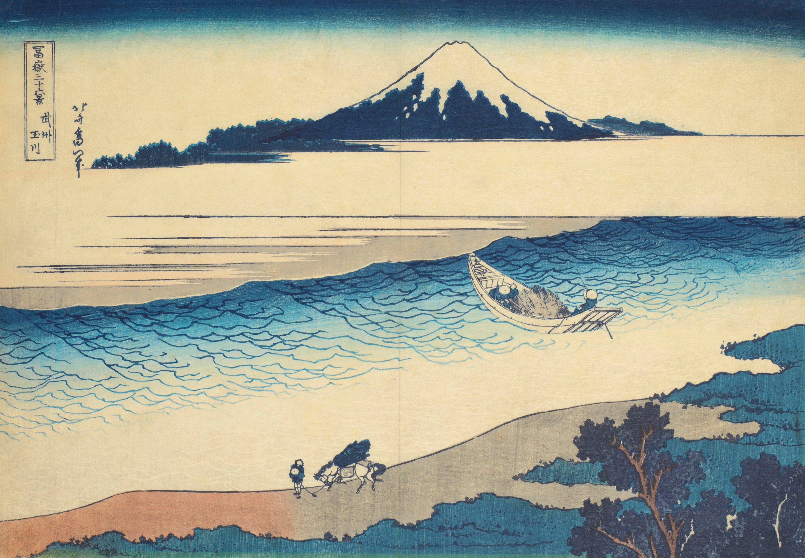
* “新艺术”运动的代表人物之一、苏格兰设计师**马金托什**将从**凯尔特人**那里借鉴而来的图案用在他设计的海报中，以此来呼唤民族的自尊心
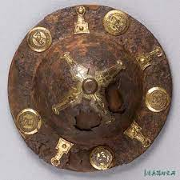
### “新艺术”运动的特点
* “whiplash”（挥鞭的痕迹）一词，被广泛用来形容“新艺术”运动的**曲线特点**：生动的，起伏绵延的，带有一种音乐中切分音的韵律
  * 以**埃米尔·盖里**（Emile Galle）和**南锡派**（The Ecole de Nancy）为代表的一批设计师，他们那些自然主义作品中强调的曲线，感性而生气盎然，与**早期洛可可风格**有比较多的关联

  * 而在格拉斯哥的**查尔斯·马金托什**和维也纳的**约瑟夫·霍夫曼**的作品中，却突出地采用了比较矜持的**以直线为主**的装饰模式，他们将强而有力的**直线型结构框架**当作装饰的一个重要组成因素，这一理念在20世纪的建筑中影响深远
* 在“新艺术”风格的设计中，以下特点比较突出
  * 线条的形状与流动的轮廓融合一体，表面常采用**浅浮雕**作为装饰
  * 刻意地采用**不对称**的形式，色彩则选用**柔和**的浅红、淡紫、嫩绿等奶油色系
  * **风格化**的**树叶和昆虫**是常用的装饰动机
  * 选用的**材料很多**，包括丝绸、天鹅绒、果木、半宝石，以及金属
  * “新艺术”运动的一个重大成果是将两种原本被认为只能用作工业用途的材料——**铸铁**和**玻璃**也赋予了美学价值，**赫克特·吉马德**（Hector Guimard）和**维克多·霍塔**的设计就是很好的例子
  * 可以说，“新艺术”运动提供了一种形式、线条和色彩方面的**崭新设计语汇**
* “新艺术”运动的设计，在形式上和图案上，都更重视**象征性**；维多利亚时代的设计师，更多的是通过**复兴**埃及式、哥特式或其他历史风格去寻找灵感，“新艺术”运动的设计师们则将孔雀、百合、天鹅等作为他们**理想的象征**
* “新艺术”运动强调一种新的美学观念：**形式是由功能来决定的**
  * 在维多利亚时代，连机车、工具的设计，都无意展示其**功能性**，而在“新艺术”运动时期，连家庭用具的设计，都可以令人清楚地感受到它的功能作用
* 从意识形态角度来看，“新艺术”运动是部分知识分子精英人士在**工业化**来势汹汹，过分装饰的**贵族风格**泛滥的**双重压力**下，所做的一次设计改革的尝试
  * 虽然进入20世纪以后，随着大批量工业化生产的推进，这场运动消散得比较快，“新艺术”风格很快地就被**现代主义风格**所取代，然而这并无损于它的重要性——它是一个无可替代的从新古典主义、历史复古主义向现代主义**转化的过程**，是传统设计与现代设计之间**承上启下**的一个重要阶段
## “新艺术”运动的平面设计
* 平面设计大概可以算是“新艺术”运动影响**最深刻**的一个设计范畴
  * 维多利亚风格的海报往往被繁复的插画和文字**挤得满满**的，“新艺术”运动的海报则简洁得多，**大胆留白**
  * 再加上**抽象变形的人物**，从日本印刷中学到的**平面化**和**阴阳空间的利用**等手法，都使得“新艺术”运动的海报从维多利亚风格中脱颖而出
* **亚瑟·马克穆多**（Arthur Heygate Mackmurdo）是英国“工艺美术”运动晚期的代表人物，也是“新艺术”运动的开创性人物
  * 他所创立的“**艺术家世纪行会**”，是当时最成功的设计团体之一
  * 马克穆多的设计非常讲究**装饰的整体感**，具有更加强烈的自然主义特点，将植物的枝叶扭曲成**蜿蜒的曲线**是他最喜爱的设计动机之一，这个特点日后也成为“新艺术”运动风格的基本特点之一
  * 1883年，马克穆多以富有韵律感的花卉图案为“**雷恩的城市教会**”（Wren‘s City Churches）设计的**木刻封面**，可以算是“新艺术”运动最早的木刻作品

* 法国包装设计师**乔勒斯·谢列特**（Jules Cheret）最先将新艺术风格带进**海报设计**；他的作品色彩鲜明，轮廓线清晰简洁，字体粗壮，成为新艺术风格海报的代表，对于以后的海报设计师很有启发
* 法国画家**亨利·德·图卢兹·劳特累克**（Henride Toulouse-Lautrec）是一位极具才华的设计师，他将海报设计的水平大大地提高了一步
  * 他总是通过一些**不寻常的角度**去刻画人物，善用**侧影**，以求获得最强而有力的视觉效果
  * 他的线条**粗壮**，但**能少则少**，再加上他那些恣意纵横、**随手画出**的字体，都使得他的海报设计独具一格
  * 劳特累克对于**彩色石印技术**很有研究，是当时最早采用这种印刷方法的艺术家

* 英国插图画家**奥伯利·比亚兹莱**（Aubrey Vincent Beardsley）的作品基本都用**墨水**画成，黑白分明，画面上留下**大片的空白**，与其他部分非常精确细致的描绘形成**鲜明对比**，线条虽然**纤细**，却很清晰，非常流畅，可以明显看出受到**日本绘画风格**的影响
  * 他为**奥斯卡·王尔德**（Oscar Wilde）的戏剧“**莎乐美**”创作的画作是他最具代表性的作品之一

* 捷克画家**阿尔丰斯·穆夏**（Alfons Maria Mucha）为很多书籍、海报、广告，以及舞台剧绘制过画作，还设计过舞台布景，以及首饰、地毯、墙纸等
  * 1895年，他为巴黎女演员**莎拉·伯恩哈特**（Sarah Bernhardt）主演的一出舞台剧《**吉斯蒙达**》（Gismonda）绘制的海报，令他一举成名，他的绘画风格被称为“**穆夏风格**”（Mucha Style），并旋即成为最流行的新艺术风格画风

  * 穆夏喜欢用**彩色粉笔**作画，他的画作经常以**美丽的少女**为主题，飘曳的新古典主义风格的长袍，茂盛的鲜花和树木的背景，少女头上时常佩戴的花环都成为经常被人模仿的特色
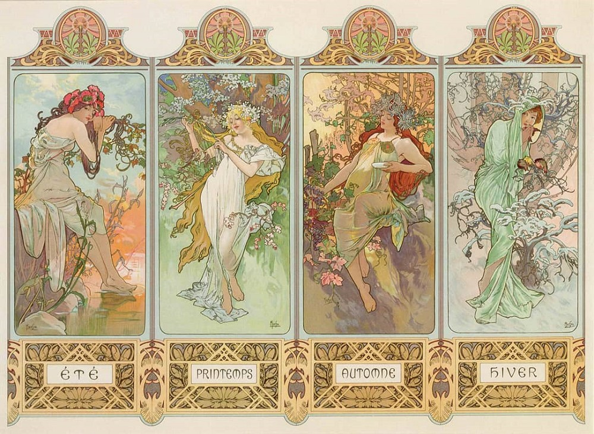
  * 1939年德国法西斯侵入捷克，因为穆卡强烈的**捷克民族主义立场**，盖世太保第一批就逮捕了他；虽然后来他因肺炎而被释放，但很快就在**布拉格**去世了
* 除了海报和插图等平面作品之外，“新艺术”运动的设计师们也对沿用多年的**字体**进行了改革
  * **尤金·格拉赛特**（Eugene Grasset）是一位出生在瑞士的法国插图家，他在1820年设计了第一套“新艺术”运动的字体；不过，他的字体与老字体还是比较相似，粗细并不分明
  * 德国艺术家**奥托·伊克曼**（Otto Eckmann）设计的字体以**罗马字体**为基础，但不再由规规矩矩的弧线和直线构成，而是戏剧性地强化了粗和细、黑与白的**对比**，几乎没有完全平直的部分

  * 多才多艺的**凡·德·威尔德**也设计过字体，不过他的字体着重在装饰，比较难以阅读了；与他形成鲜明对比的，是**彼得·贝伦斯**为AEG公司设计的产品目录，干净利索的直线字体，预示了一种新的风格——现代主义风格即将诞生
## “新艺术”运动在各地的发展
* “新艺术”运动于1895年左右在**法国**开始兴起，之后蔓延到荷兰、比利时、意大利、西班牙、德国、奥地利、斯堪的纳维亚国家、中欧各国，乃至俄罗斯，也越过大西洋影响到美国，成为一个影响广泛的国际设计运动
  * 。这场运动在法文中被称为“**Art Nouveau**”，意思是“新的艺术”；在西班牙卡塔兰语中被称为“**Modernisme**”，意思是“现代主义”，其最重要的代表人物是建筑师安东尼奥·高迪；在德文中被称为“**Jugendstil**”，意思是“青年风格派”或“年轻人的风格”，这个名称来自积极推动这场运动的德文杂志《青年》（Jugend）；在俄文中被叫作“**Модерн**”，意思是“现代”；在斯堪的纳维亚各国，则称之为“工艺美术运动”（**Arts&Crafts Movement**）
* 一些特别因这种风格的作品出名的**艺术家的姓名**，也被用来作为风格的名称
  * 例如，**赫克特·吉马德**为巴黎地铁所做的设计，就使得这种风格在巴黎被称作“Style Metro”（地铁风格）；在意大利，“新艺术”运动风格的推广，与伦敦**李柏提百货公司**在当地销售的商品风格有关，因而被称作“Stile Liberty”（李柏提风格）；在美国，因为**路易斯·C·蒂凡尼**那些漂亮的镶花玻璃而被称作“Tiffany Style”（蒂凡尼风格）；在奥地利，因为这场运动是由聚集在维也纳的一个名为“**分离派**”的艺术家团体来推动的，其风格就被称为“Sezessionstil”（分离派风格）；在英国则由于**马金托什**在格拉斯哥设计了一批重要的“新艺术”运动风格的建筑、室内和家具等，因而被称作“Glasgow Style”（格拉斯哥风格）
### 法国的“新艺术”运动
* **法国**是“新艺术”运动的**发源地**，早在19世纪末已经开始酝酿，到1900年的巴黎世界博览会开始崭露头角，首次向世界展示了法国的“新艺术”风格，特别是它的家具和室内装饰，引起世界性的广泛关注
  * 法国的这场设计运动历时**20余年**，是所有有关国家中**持续最久**的，对于欧美起到重要的影响作用
  * **巴黎**和**南锡**（Nancy）是该运动在法国的两个中心
#### 巴黎的“新艺术”运动
* 19世纪末和20世纪初，巴黎是现代艺术及现代设计**最重要的中心**；作为法国的首都和最大的都会，**巴黎**不仅是法国的精英，同时也是世界精英的荟萃之地，各种艺术和设计的新思潮、新动向、新流派都在这里登场亮相，引起轰动
* 从设计组织方式来看，法国的这场运动由几个关系密切的、以家具设计为主的**设计团体**为中心，而不像英国“工艺美术”运动那样囿于小规模的手工作坊
  * 其中影响最大的有三个，即西格佛里德·宾的“新艺术之家”画廊，“现代之家”设计事务所以及“六人集团”
##### 新艺术之家（Maison de l'Art Nouveau）
* **西格佛里德·宾**（Siegfried Bing）是一位出版商、贸易商和艺术经纪人，他对**日本艺术**和**日本手工艺**非常着迷，曾经专程去日本体验当地艺术，并且收购了相当数量的日本工艺美术品

  * 宾曾形容19世纪末的局面是“世界性科学发明的一片剧变和动荡”。他很敏感地意识到，伴随着技术的迅速发展，对于设计师和新艺术形式的需求一定会与日俱增
  * 他于1895年在巴黎普罗旺斯路22号开办了一家画廊，取名“**新艺术之家**”，专门推广当时的现代艺术，出资支持多位重要的设计家从事新艺术风格的设计，成为巴黎时尚的引导者
  * 宾在**1900年的世界博览会**上展示了他代理的家具、艺术挂毯和其他一些艺术品；这些作品强调“**回到自然去**”，刻意强调有机形态，模仿植物的形态和纹样，取消直线
* 具有比利时和荷兰血统的法国设计家**乔治·德·方列**，是宾集团中一位重要的人物，他在平面设计上很具功力；他的装饰风格**纤细优美**，被称为“女性的赞美诗”

* **盖拉德**的风格比较凝重、敦实，采用**植物的弯曲纹样**作为形式重点，结构厚重，木料也选择比较坚实的材质，采用色泽深浅不同的木头组成**装饰镶嵌效果**，非常生动

* **爱德华·科洛纳**出生在德国，在比利时上学，1882年移民美国；1890年代，他重回欧洲，在巴黎为宾的画廊设计了一些“新艺术”风格的产品，是巴黎“新艺术”运动的重要设计师，他的设计线条简练、流畅，整体感觉**清爽轻盈**，比较**现代**
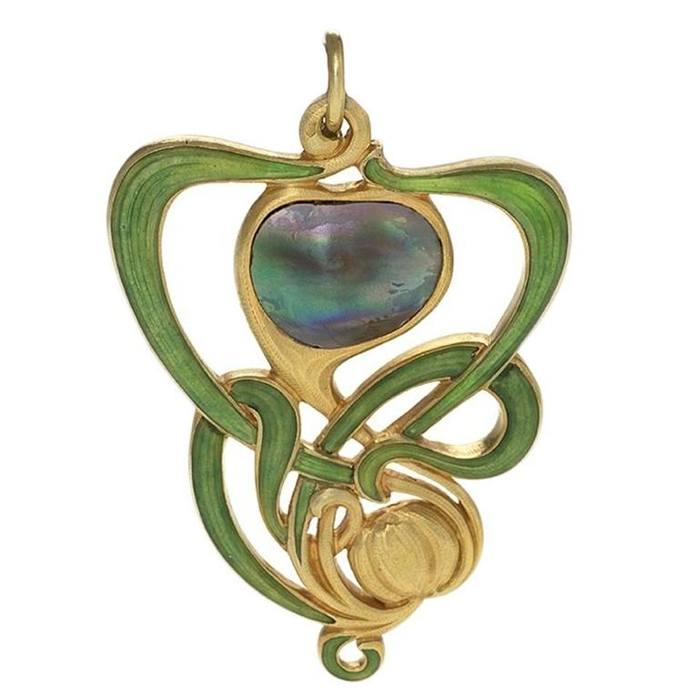
* 1905年，西格佛里德·宾去世，这个组织在他去世之后基本解散了
##### 现代之家
* 它的中心人物是德国艺术评论家**朱利斯·迈耶-格拉斐**（Julius Meier-Graefe）；与宾一样，他也是一位**热衷于自然风格**的设计赞助人
  * 1898年，他在巴黎开设了称为“**现代之家**”的设计事务所和展览中心，从设计到制作，为顾客提供新艺术风格的家具、室内装饰和日用品

  * “现代之家”的顾客以**年轻人**为主，尤其对于那些喜欢东方艺术的时尚青年很有吸引力；这里还集中了一批**富有才华的年轻设计师**
  * 他们的设计风格与“新艺术之家”无论在观念上还是在形式特征上都比较**近似**；虽然“现代之家”只存在了4年，但这批设计师中不少人在随后兴起的**装饰艺术**（Art Deco）运动中，获得很大成功
##### 六人集团
* “**六人集团**”也是在1898年成立的；顾名思义，它是由6个设计家组成的松散设计团体，虽然没有像宾那样强有力的赞助人，但是由于设计杰出，他们的影响比以上两个集团要大得多
  * 这6个人包括**亚历山大·查平特**（Alexandre Charpentier）、**查尔斯·普伦密特**（Charles Plumet）、**托尼·塞尔莫斯汉**（Tony Selmersheim）、**赫克特·吉马德**，**乔治·霍恩切尔**（George Hoentschel）和**鲁帕特·卡拉宾**（Rupert Carabin）
  * 这6个人其实算不上一个组织严密的设计实体，他们之间的关系相当松散，但是在**设计理念**上则比较一致，都强调**自然主义**，提倡“回到自然”的口号
* 建筑师出身的**吉马德**是“六人”中成绩最为卓著的一个，他从1888年开始从事建筑设计，1890年代开始逐渐转向“新艺术”风格探索；他的设计黄金时期是1890年代到1905年左右
  * 他的设计采用了大量**植物的缠枝花卉**为动机，造型奇特，他刻意在木家具上摆脱简单几何造型，而模拟**自然的形状**
  * 他的作品基本上**无法批量生产**，因为太多的自然主义装饰细节，事实上，在设计与制作的时候，吉马德不得不自己动手处理细节装饰，因此，他的家具同时应该被视为**雕塑式的艺术品**
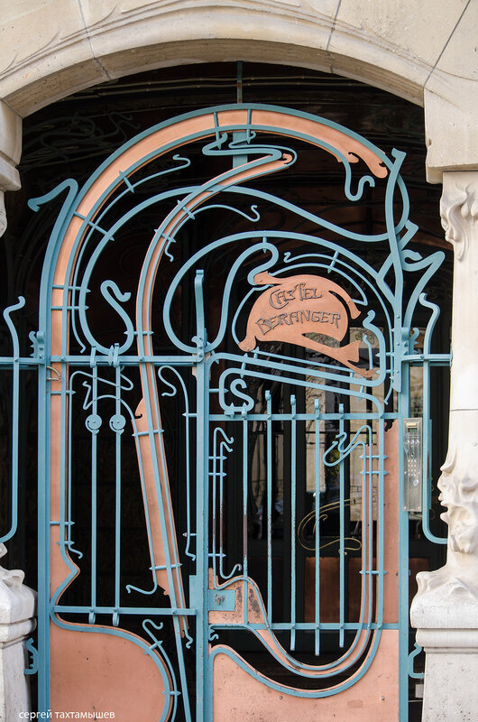
  * 吉马德习惯进行**室内总体设计**，他设计的室内，其中的全部用品，从家具、挂钟、摆设、壁炉、彩色玻璃镶嵌，一直到门把手和金属构件，都巨细无遗地亲力亲为
  * 吉马德最重要的作品还不是他的家具，而是他在20世纪初受巴黎市政府委托，设计的100多个**巴黎地铁入口**；吉马德充分发挥了他的**自然主义特点**，这些入口的顶棚和栏杆都模仿植物的形状：扭曲的枝干，缠绕的藤蔓，顶棚还着意采用了**海贝的形状**，建筑结构则基本采用青铜和其他金属铸造而成
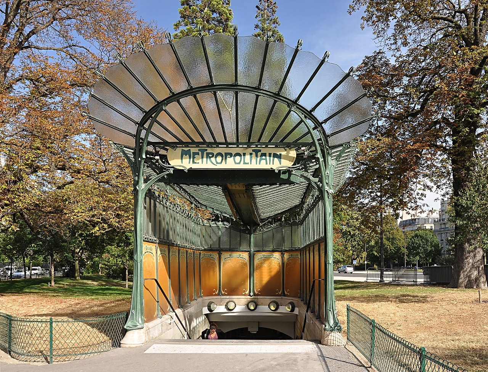
* “六人集团”之中的**卡拉宾**在设计上非常标新立异，他设计的家具大部分都采用**整块木头**制作，装饰的方法是把木头雕成**高浮雕**或者干脆成为**立体的雕塑**
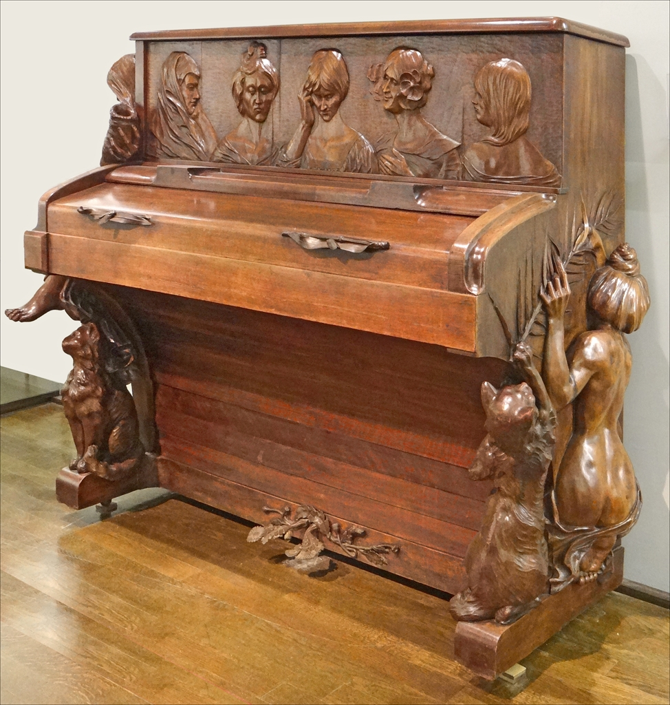
#### 南锡的“新艺术”运动
* **南锡市**是法国“新艺术”运动另一个重要中心，以家具设计与制造为主，产品广受欢迎，影响很大；设计师**埃米尔·盖里**（Emile Galle）是这个中心的领军人物
  * 以**家具设计**起家的盖里早在1880年代就开始了“新艺术”风格的探索，由于出身于一个富裕的家具生产商家庭，他对于家具的设计和生产具有丰富的经验；**对于材料的选择和关注**是“新艺术”运动的一个特色，盖里的作品是这个特色的一个很好的诠注

  * 利用**不同的木料**做镶嵌，是他常用的装饰手法，他有时还采用**螺钿**镶嵌，明显受到东方家具，尤其是日本和中国家具的影响
  * 他的装饰图案也具有典型的“新艺术”风格：以**曲线**表现的植物和动物纹样，带有强烈的**自然主义倾向**
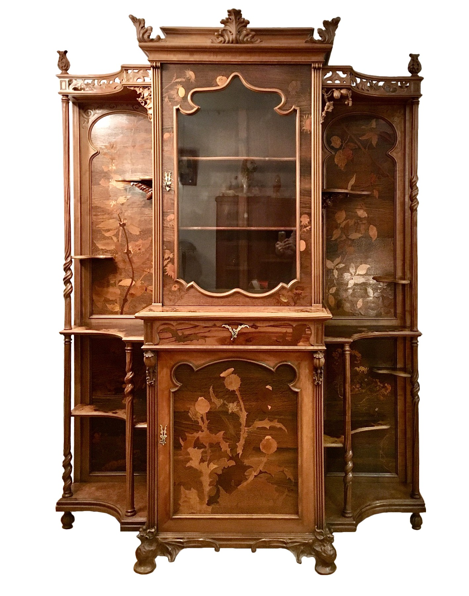
  * 他是法国“新艺术”运动中最早提出在设计中必须以**重视功能性**为原则的设计家，虽然他本人的设计未必完全做到这一点，但这种提倡在设计史上是很有意义的
* **路易斯·莫卓列里**受盖里影响最大，他也常常用不同类型的木材进行细木镶嵌，结合弯曲的线条，形成鲜明的南锡“新艺术”运动风格
  * 他在使用自然形式时，比盖里的作品更加**抽象和流畅**，他还经常在木家具上采用**金属构件**来增加装饰效果，这也是他的个人风格特征

* 格鲁伯、瓦林、安德烈都是**南锡工业艺术地方联盟学校**（Écoledes Beaux-Arts de Nancy）的成员，这所学校是盖里在1901年创立的，后来成为南锡设计的中心，这几位杰出设计家对于南锡地区“新艺术”运动的发展起到非常重要的推动作用
### 比利时的“新艺术”运动
* 自从工业革命开始以来，比利时虽然没有经历像英法等国那样大规模的海外殖民运动，但是工业发达，对外事务平稳，国家安定，因此经济在这个时期逐渐繁荣起来了
* 1884年比利时**自由派政府倒台**之后，比利时的**社会党人非**常活跃，特别是一批具有资产阶级民主思想的知识分子尤为突出；在他们的影响下，比利时出现了相当一批具有民主思想的艺术家、建筑设计师
  * 他们在艺术创作上和设计上提倡**民主主义**、理想主义，提出艺术和设计**为广大民众服务**的目的；在比利时进入“新艺术”运动的时候，这些艺术家和设计家更提出了“**人民的艺术**”的口号
  * 因而，比利时的运动具有相当浓厚的**民主色彩**，从意识形态上来说，他们为**现代设计思想的诞生**打下了基础
#### 亨利·凡·德·威尔德
* 比利时在19世纪末和20世纪初最为杰出的设计家、设计理论家、建筑家无疑是**亨利·凡·德·威尔德**（Henry van de Velde）
  * 他对于**机械**的肯定，对**设计原则**的理论，以及他的**设计实践**，都使他成为不仅是比利时现代设计的奠基人，也是世界现代设计的先驱之一
  * 他于1906年在德国魏玛建立的**魏玛工艺与实用美术学校**（School of Arts and Crafts），成为早期德国现代设计教育的**中心**，一直维持到第一次世界大战爆发的1914年；战后，这所学校于1919年重新开办，成为世界著名的**包豪斯设计学院**
  * 威尔德具有**强烈的设计民主思想**，他与**朱利叶斯·德斯特里**（Jules Destree）等比利时社会主义活动的一些积极分子，都有长期密切的往来，深受他们的社会主义与民主主义思想影响，并通过自己的设计与设计教育而将这些影响传播开来
* 在比利时的设计史上，这场设计运动被称为“**先锋派**”运动，始于1880年代
  * 1881年，比利时人**奥克塔夫·曼斯**（Octave Maus）创办了民主色彩浓厚的艺术刊物《**现代艺术**》，宣传新艺术思想
  * 在他的组织下，一批有志于艺术与设计改革的青年人在1883年组成一个前卫小组——“**二十人小组**”（Les XX），他们每年举办一次艺术展览，除了展出自己的作品外，还展出欧洲当时最前卫的艺术家的作品；受邀参展的重要艺术家有：毕沙罗、劳特累克、莫奈、高更、塞尚、凡·高、修拉等人，使比利时公众有机会了解当时前卫艺术发展的状况，接触**现代艺术思想**

  * “二十人小组”以建筑师出身的**威尔德**为领袖，并逐渐开始从纯艺术向**实用美术和设计**的方向转化，从1891年开始每年举办一次**设计沙龙**，展出各种产品设计和平面设计作品
  * 1892年，“二十人小组”改名为“**自由美学社**”（La Libre Esthétique），在学社举办的第一次年展上，展出了比利时设计家**古斯塔夫·博维**（Gustave Serrurier-Bovy）的整套室内设计
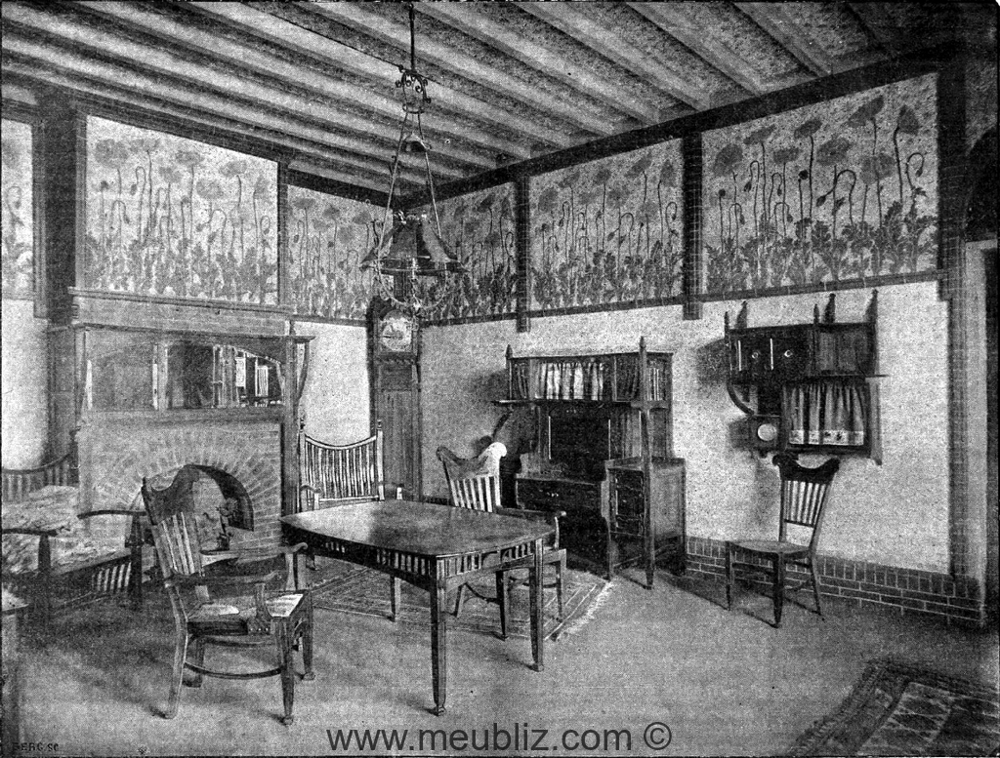
* “自由美学社”的重要领导人物有三位，即**威尔德**、**博维**和**维克多·霍塔**
  * 从设计上来看，比利时的“新艺术”运动与法国的运动风格**非常相似**，观念也比较吻合，都是希望能够以手工艺的方式，来挽救衰落的设计水平
  * 他们也主张采用**自然主义**的装饰构思，特别是**曲线式的花草枝蔓**来达到浪漫的设计装饰效果，其设计也受到**日本传统设计**很大的影响
* **亨利·凡·德·威尔德**起初是位**画家**，之后从事建筑教育，也从事过**建筑设计**；威尔德在比利时时，主要从事“新艺术”风格的家具、室内和染织品设计，也从事一些**平面设计**工作
  * 从装饰上看，他的设计大量采用**曲线**，特别是花草枝蔓，缠绕攀援地组成复杂的图案；这在他的平面设计和纺织品纹样设计上反映得最充分

  * 与大多数“新艺术”运动设计家强烈反对现代技术和机械的立场不同，威尔德**支持新技术**，他曾经说，“技术是产生新文化的重要因素”，旗帜鲜明地提出了设计中**功能第一**的原则
  * 在**德国**期间，威尔德的设计思想得到进一步发展；他认为，机械如果能够得到适当合理的运用，将可引发建筑与设计的革命
  * 他提出“产品设计结构合理，材料运用严格准确，工作程序明确清晰”这三个设计的**基本原则**，以期达到“工业与艺术结合”的**最终目标**
#### 维克多·霍塔
* **维克多·霍塔**（Victor Horta）的建筑设计不但代表了比利时“新艺术”运动最高水平，而且也是当时整个“新艺术”运动建筑设计中最杰出的代表之一
  * 有历史学家倾向认为：比利时的几个重要建筑，包括威尔德在乌克尔设计的**布劳曼维尔伏住宅**（Bloemenwerf），霍塔在布鲁塞尔设计的**塔塞旅馆**（Hotel Tassel）等，是**现代建筑转型的代表作品**
  * 其中，**塔塞旅馆**是“新艺术”运动最杰出的设计作品之一，无论建筑外表设计，立面装饰，还是室内设计，栏杆、墙纸、地板陶瓷镶嵌、灯具、窗户的玻璃镶嵌设计等等，都具有**高度统一**的“新艺术”运动风格，曲线流畅，色彩协调，得到广泛的好评

  * 他在塔塞旅馆的设计中，充分利用**铸铁**的可锻铸特性，将其应用到室内装饰上来，使得这种**工业材料**也成为一种**室内装饰材料**；那些由铸铁铸出的千姿百态的**优美曲线**，表现出一种如同植物生长的茁壮生机，创造出更适宜空气流通、光线穿透的**开阔空间**来
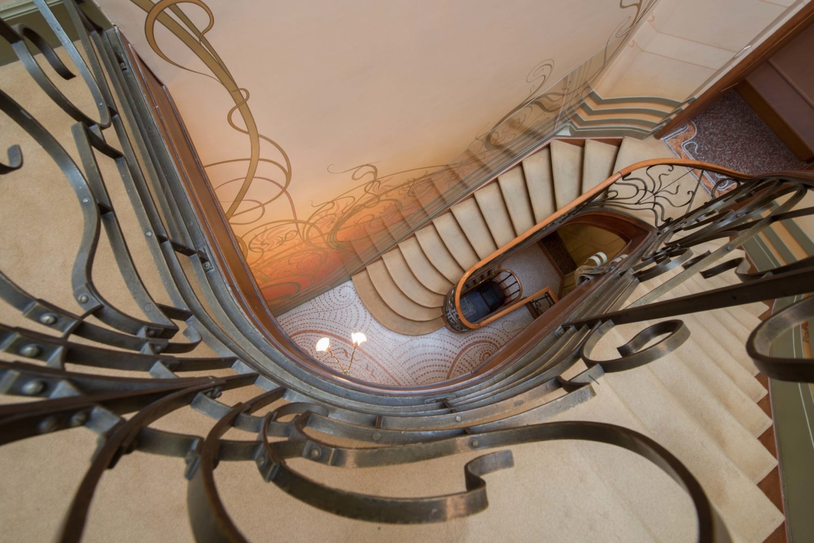
* 比利时“新艺术”运动一方面保持了“新艺术”运动的基本风格，同时也在功能和装饰之间取得很好的**平衡关系**，与大部分法国“新艺术”风格设计师**对于外表的重视远高于其功能**的极端方式相比，更加稳健和完美
### 安东尼奥·高迪和西班牙“新艺术”运动
* 欧洲各国的“新艺术”运动目的相似，都是对于矫饰的维多利亚风格的反对，都是对于机械、大工业化风格的不安的体现，都采用了自然主义的形式，都反对采用直线，被一些评论家揶揄为“面条风格”“蠕虫风格”
  * 其中，最为极端、最具有宗教气氛的“新艺术”运动是在**地中海沿岸地区**，特别是在**西班牙的南部地区**和**巴塞罗那地区**，而其中最重要的代表人物、可能也是唯一重要的西班牙“新艺术”运动的代表人物是建筑家**安东尼奥·高迪**

* 高迪出身卑微，1852年6月25日生于**雷乌斯**（Reus）的一个铜匠家庭，是一名普通手工艺人的儿子；先天身体不好，一生受到**肺炎**折磨
  * 17岁时，高迪到卡塔兰的省城**巴塞罗那**学习建筑；他在学校不算是一个特别优秀的学生，但基本功相当扎实，他的素描被评为“优等”
  * 在学院的最后一段时期中，他已经开始**离开常规的建筑规范**，进而追寻自己的发展方向了；他被教授们认为或者是天才，或者是疯子，他一生都被人这样看待
  * 从心理上来讲，高迪相当**平民化**，他一向觉得自己是一介平民，一个普通人；当他被车撞成重伤，刚刚苏醒过来，发觉人们已经认出他是建筑大师，要把他从平民医院移到高级医院时，他说：“我的地方是这里，是在穷人之中。”这正反映出高迪的矛盾心态——精神上的贵族和感情上的平民
* 高迪的设计灵感大量来自他广泛阅读的**书籍**
  * 他的青年时代，正是**欧洲建筑设计革命**的年代，设计师们都在寻找新的形式来代表新的时代风格；在**园林设计**上，这种探索的努力也显而易见，**法国巴洛克风格**的**对称园林规划**逐步被**英国**的利用大量药草（herbage）的**乡村园林风格**取代，表现了对于野趣的向往

  * 其中，影响最深的是**中世纪的哥特风格**；不但在建筑上模仿哥特风格的特点，连中世纪那种残破的、颓败的废墟也被模仿到园林设计之中
  * 高迪所熟读的书籍当中，法国建筑师**维奥列特-勒-杜克**（Eugène Emmanuel Viollet-le-Duc）的作品对他影响相当大，杜克的作品主要描述与介绍了11~13世纪的法国建筑，成为当时青年建筑师们的“圣经”
* **巴塞罗那**是西班牙的**经济中心**，同时也是艺术、**设计的中心**；1854年，巴塞罗那的旧城墙被拆毁，几年之内，巴塞罗那市区的面积就**扩大了10倍以上**
  * 19世纪后半期，巴塞罗那的人口增加了4倍，棉纺工业和钢铁工业是该城经济发展的主干，加上繁荣的商业贸易，使巴塞罗那成为当时西班牙最重要的经济中心
  * 经济实力雄厚的巴塞罗那颇具**自由主义**的思想气氛，它的艺术和建筑设计风格也非常独立，高迪自然会受到影响；他很快就接受了当时在巴塞罗那十分流行的**反基督教会思想**，在设计上倾向于非宗教化的方向
  * 他的民主思想也是十分明显的，他的第一个设计项目就是给工人设计住宅，那是**玛塔罗工人集体住宅**（Cooperativa Obrera Mataronense）；这个设计的观念常常使人们联想起空想社会主义者罗伯特·欧文（Robert Owen）雄心勃勃的计划

* 巴塞罗那与卡塔兰地区**历史相当悠久**，早在罗马帝国时期，这个城市就已经成为一个**贸易中心**，大约在公元343年，巴塞罗那开始**独立**；公元5世纪，卡塔兰地区成为一个**自治区**，在整个中世纪时期都非常发达
  * 现代以来，特别是在西班牙的**卡斯蒂兰**（Castilian）政权统治以来，巴塞罗那与卡塔兰地区逐渐失去了往日的光彩；因此，19世纪复兴中世纪的哥特风格除了受国际运动的影响之外，还有强烈的**怀旧情绪**在内，民族主义情绪是哥特风格在西班牙复兴的核心
  * 虽然如此，高迪却从来没有因为这种强烈的民族主义而参加任何政治党派，他认为卡塔兰的光荣在于民间，在于**艺术**，而不在于**政治**
* 高迪从不在意所谓**风格的单纯性**，他的设计充满了各种风格的**折中处理**，对于他来说，所有他喜欢的过去的风格都是可资借鉴的源泉
  * 他反对简单的复古，他的设计绝对不是古典风格的翻版，而是通过**自己吸收以后的结晶**
* 高迪的作品很少有在完工时得到官方奖励的，大部分都是事后的颁奖，因此，他总认为自己是**不成功的**
  * 其实是因为他的作品总是过于大胆、极端、特异，而使官方评判人感到无所适从；他一生当中只有一件作品在完工之时受到奖励，那是他的最为常规的作品——**卡维特公寓**（Casa Calvet）
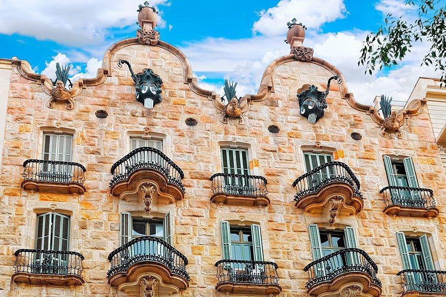
* 1881年，一个宗教组织“圣约瑟祈祷者联盟”在巴塞罗那买下一大块地，委托高迪在这块地上设计一座大型教堂，那就是日后大名鼎鼎的**圣家族教堂**（Sagrada Familia）
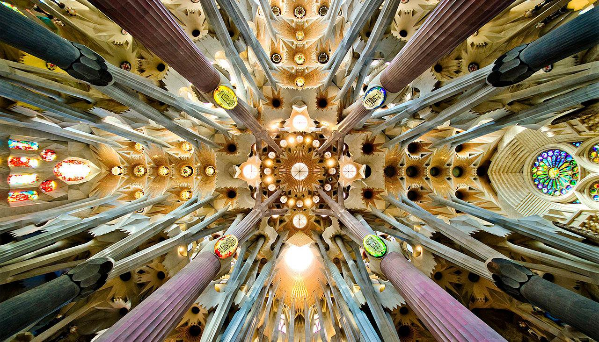
  * 这个教堂的设计目的是为了抗衡日益增长的工业化影响，因此，它的设计宗旨是**反工业化**的
  * 高迪为这个项目可以说是投入了**毕生的精力和心血**，设计基本上是一个高度的**个人表现**的作品，没有遵循任何古典教堂设计的清规戒律，具有强烈的**雕塑式**的艺术表现特征
  * 高迪是在1883年11月2日正式接受这个设计委托的，遗憾的是由于他的**突然去世**，使得这个教堂迄今还没有完成
* 高迪的职业生涯分成几个**非常特殊的阶段**
  * 起初是所谓的“**摩尔风格阶段**”（the Moorish Period），这个时期的作品大部分都有强烈的阿拉伯摩尔风格的特点；比较典型的这个时期的设计有：**文森公寓**（Casa Vicens），墙面大量采用**釉面瓷砖**做镶嵌装饰处理，具有摩尔建筑的特点，是高迪的**第一座摩尔风格建筑**
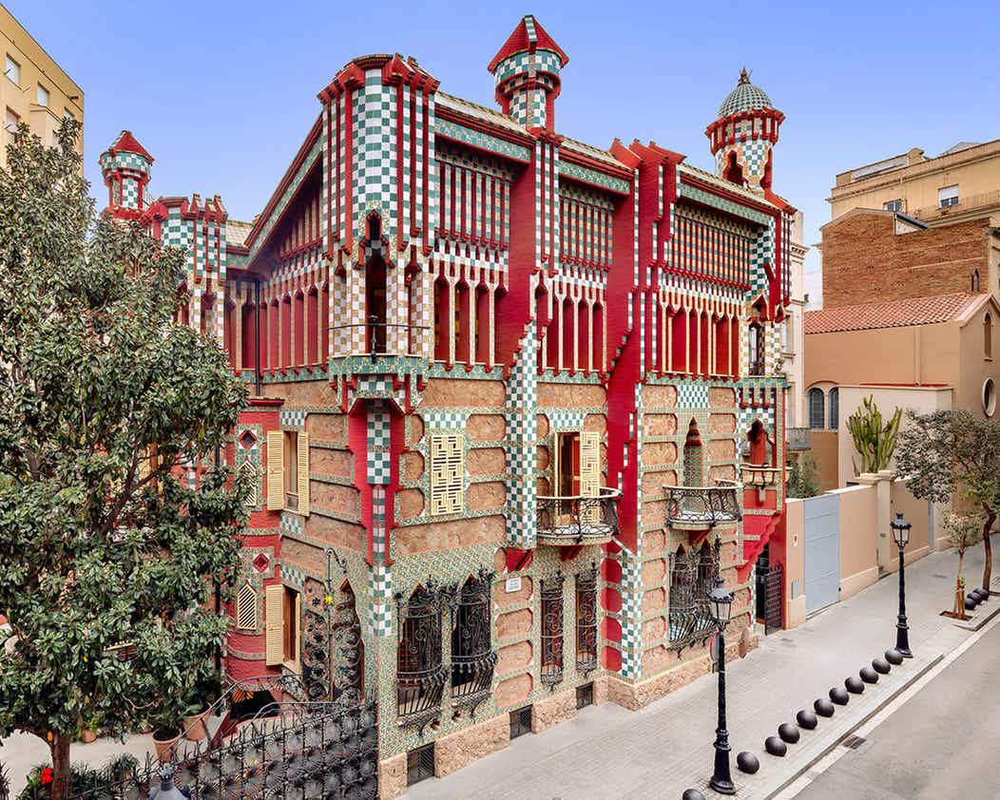
  * 高迪在他的职业生涯中，长期得到企业家**居里家族**的积极支持和赞助；1883年，高迪为居里设计了第一个项目，那是在加拉夫（Garraf）的一幢**狩猎的小屋**，其风格与文森公寓相似，受摩尔风格的影响
  * **新哥特主义风格**和**新艺术风格**的混合，在高迪为居里后来设计的多栋建筑中都可以看到；1886年，他开始为居里设计在巴塞罗那的**主要住宅**（Güell Pavilions），那是一所巨大的宫殿式建筑，以上两种风格的混杂处处可见，特别是大量采用金属浇铸工艺制作的**金属构件**，具有强烈的“新艺术”运动特征
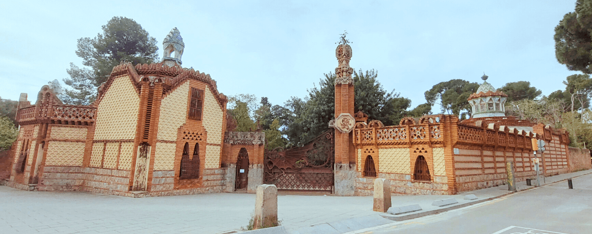
  * 高迪中期的作品大部分都有哥特风格的明显特征，他对于哥特风格的**飞肋结构**（the flying buttresses）非常有兴趣，在**卡勒基修道院**的设计上第一次采用；他日后在巴塞罗那设计的**菲格雷斯住宅**（Casa Figueres）上，则大量运用**尖拱门式窗户**（pointed arched windows）

  * 高迪从中年开始，逐渐摆脱了单纯哥特风格的影响，走出了自己的风格道路；他的新风格具有**有机的特征**，同时又具有神秘的、传奇的色彩，不少装饰图案都有很强烈的**象征性**
  * **居里公园**（Park Güell）是高迪的一个非常重要的设计项目，事实上也是一个没有完成的设计项目；他只完成了整个宏大设计计划中的**两个建筑**，这个项目是他第一次身体力行地把设计、艺术、雕塑设法混为一体的努力
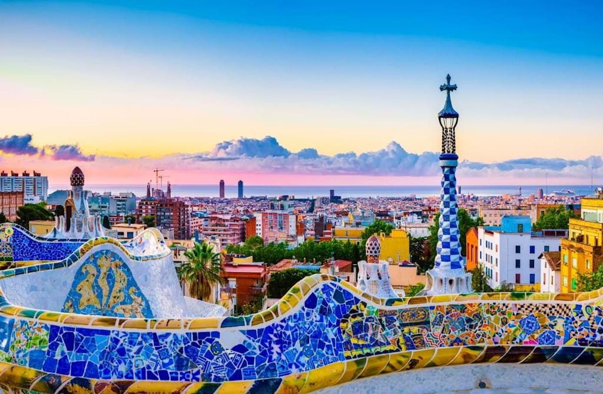
  * 1904—1906年，高迪在巴塞罗那设计了**巴特罗公寓**（Casa Batllo），这个项目进一步发展了他在居里公园上的想象力，房屋的外形象征海洋和海生动物的细节，该建筑标志着他的个人风格的形成
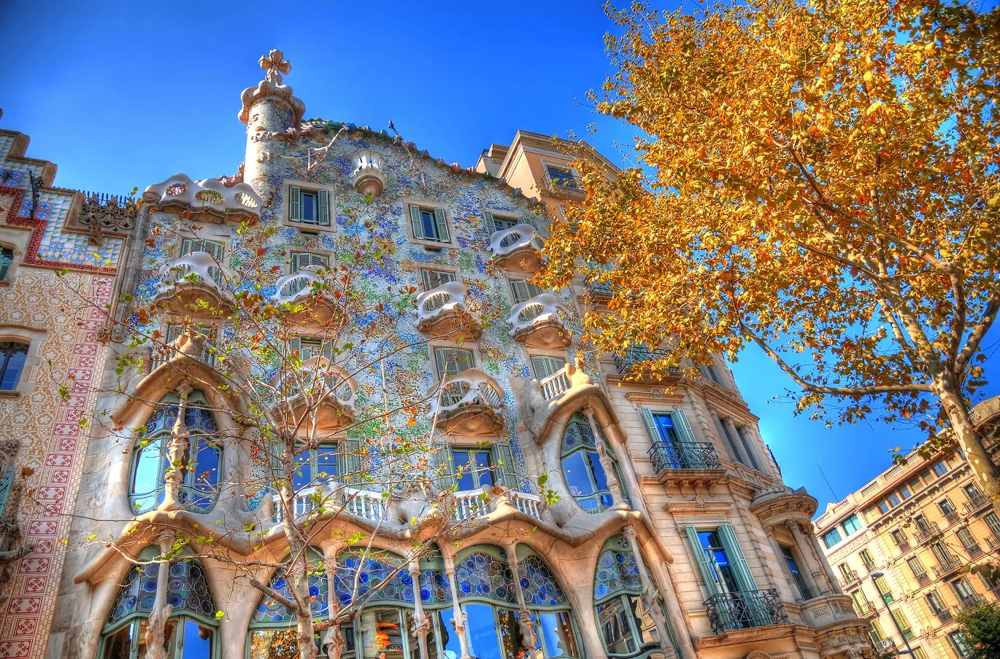
* 他在同一时期设计的另一栋公寓——**米拉公寓**（Casa Mila），由于风格极端，引起当时巴塞罗那市民的愤怒，报纸上以“蠕虫、大黄蜂巢”等各种诨名来攻击这个设计

  * 这栋公寓完全采用有机主义手法，是“新艺术”运动的**极端作品**；无论外表还是内部，包括家具在内，都尽量**避免采用直线和平面**，整个建筑好像一块正在融化的冰激凌，采用混凝土模具成型，全力造成一个彻底的**有机形态**，内部的家具、门窗、装饰部件也全部是吸取植物、动物形态构思的造型
  * 这是高迪最著名的设计之一，同时也是“新艺术”运动的有机形态、曲线风格发展到最极端化的**代表作品**，对于了解“新艺术”运动风格的思想实质和形式特征非常有帮助
* 当然，在高迪所有的设计当中，最重要的还是他投入43年之久，并且至今尚未完成的**圣家族教堂**；这座教堂的**有机结构和外形**，大胆地向当时弥漫世界的工业化风格**挑战**，虽然这种挑战是微弱的、孤立的，但是在巴塞罗那地区却显得非常**雄壮有力**

* 高迪去世迄今90多年了，但是他的影响却依然存在；特别是在**后现代主义**风起云涌的时期，他的风格一度被新一代的设计师作为一种可以与国际主义、现代主义抗衡的符号来借鉴
### 查尔斯·马金托什和苏格兰“新艺术”运动
* 19世纪末20世纪初，“新艺术”运动不但在欧洲大陆广泛流传，在英国也有所发展；在苏格兰的**格拉斯哥**市，以青年设计家、建筑家**查尔斯·马金托什**（Charles Rennie Mackintosh）为首的“**格拉斯哥四人**”的探索，在国际上获得高度评价
* 马金托什是世纪之交英国**最重要**的建筑设计师和产品设计师
  * 他所设计的建筑、室内，以及产品，特别是他设计的**格拉斯哥艺术学院**（Glasgow School of Art），既具有“**新艺术**”运动的风格特征，也包含了**现代主义**的特点，是他的设计风格的突出代表，成为20世纪初期设计的经典之作，为现代主义设计在20世纪的发展铺垫了道路
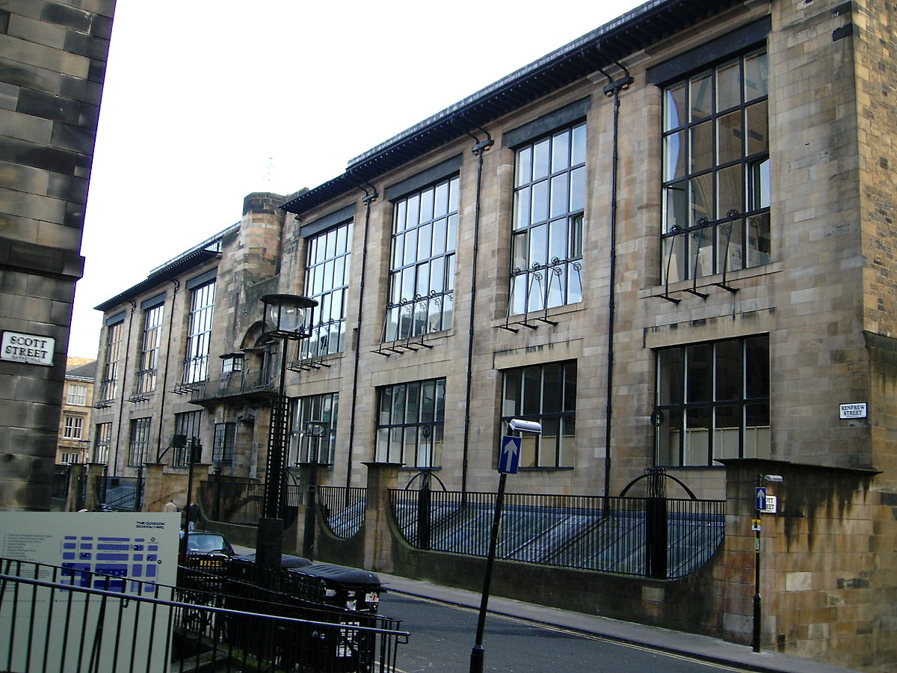
* 马金托什是一位**多面手**，他不但设计建筑、家具、室内、灯具、玻璃器皿、彩色玻璃、地毯和挂毯，同时还是一位非常杰出的画家、艺术家
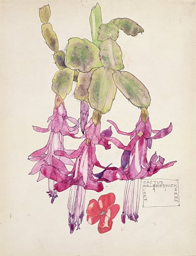
* 马金托什虽然设计出众，但是早年在**英国本岛**却并未获得承认，他的作品曾于1897年发表在英国的《**工作室**》杂志上，但没有引起重视
  * 一年以后，德国的《**装饰艺术**》杂志上发表文章介绍他的作品，立即引起广泛的注意，他因而被邀请去参加1900年举办的**维也纳分离派**（Vienne Secession）第八届展览
  * 通过这次展览，他的设计走出了国门，受到欧洲艺术和设计界的**广泛称颂**
* 马金托什的设计创作主要是在**格拉斯哥**和附近的地区完成的
  * 19世纪下半叶，格拉斯哥是个充满朝气的**大都会**，是苏格兰文化、商业中心；一批富裕的资本家成为艺术、设计的重要赞助人和支持者，这对于格拉斯哥的设计发展起到重要的作用
  * 1980—1990年间，格拉斯哥的各种艺术活动十分活跃，出现了很多新生代的艺术家；比如称为“**格拉斯哥男孩**”（Glasgow Boys）的画家集团，他们创作了大量的新作品，表现了**格拉斯哥印象主义**的风格 
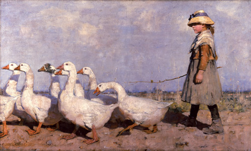
  * 格拉斯哥的设计也逐渐形成自己的独特风格——“**格拉斯哥风格**”（Glasgow Style），主要的代表人物除马金托什外，还有**赫伯特·马克奈**（Herbert MacNair）、**玛格丽特·麦当娜**（Margaret Macdonald）和**佛兰西斯·麦当娜**（Frances Macdonald）姐妹，他们被称为“**格拉斯哥四人**”（The Four）
* 马金托什的风格不是凭空产生的，而是英国、欧洲大陆设计运动的发展成果之一
  * 他是“工艺美术”时期与现代主义时期一个重要衔接人物，在设计史上具有承上启下的作用和意义
* 马金托什1868年6月7日生于**格拉斯哥**，他的一生大部分时间都生活在这里
  * 他在9岁时，就读于**艾伦·格林学校**（Allan Glen‘s Institution），这是一所专为各类技工和手艺人的孩子提供职业训练的私立学校
  * 15岁时，他就在**格拉斯哥艺术学院夜校**学习；16岁时，他便与**约翰·哈奇逊**（John Hutchins）建筑事务所签订了五年的实习契约，一边学习一边工作
  * 1889年，马金托什赢得苏格兰建筑师、建筑理论家亚历山大·汤姆逊专为有志学习古典建筑的青年设计师设立的**旅行奖学金**，使他得以在1891年去**意大利**旅行
* 马金托什的设计风格形成，在很大程度上受到日本的**浮世绘**的影响
  * 他对于日本绘画中**线条的运用方法**非常感兴趣，特别是日本传统艺术中的**简单直线**，通过不同的编排、布局、设计，取得强烈的装饰效果，使他改变了认为只有曲线才是优美的、才能取得杰出设计效果的想法
* 马金托什早期的建筑设计一方面依然受到**传统的英国建筑**影响，另外一方面则具有追求**简单纵横直线的形式**倾向
  * 他的建筑设计预想图大部分采用**铅笔单线**，线描功夫精细，显示出他**对于直线的偏好**
* 1896年，**格拉斯哥美术学院**（Glasgow School of Art）邀请当地12所建筑事务所竞标设计该校的**新校舍**，霍尼曼－凯柏事务所提交的马金托什的设计方案胜出
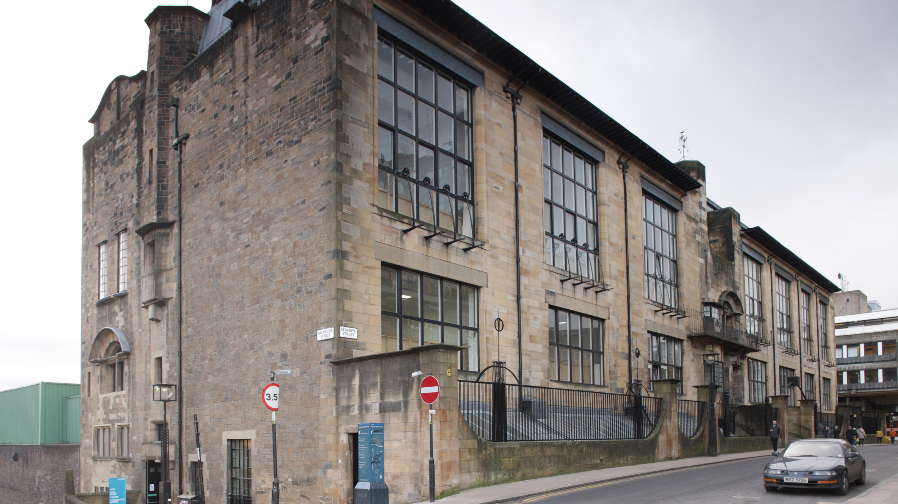
  * 这成为马金托什**第一个**，也是**最重要**的一个设计项目，经历了**两个阶段**的设计与建造才最后完成；第一个阶段是1897—1899年期间，第二个阶段是1907—1909年期间
  * 建筑外部和内部的设计都采用**简单的几何形式**，稍加细节装饰，整栋建筑极具整体感，可以说是一个**立体主义**的建筑探索；室内大量采用**木料结构**，充满了民间的和中世纪的气息
  * 他不但设计了建筑与室内，同时也设计了全部的家具与用品，从而达到**风格高度统一**的目的
  * 家具采用**木材原色**，强调**纵向线条**的应用，利用直线的搭配进行装饰，而尽量避免过多的细节装饰，因此非常**朴实大方**
* 除了建筑设计之外，马金托什的**室内设计**也非常杰出
  * 他以**直线**和**简单的几何造型**为主，以**白色和黑色**为基本色彩，细节稍许采用**自然图案**，比如花卉藤蔓的形状，因此达到既有整体感，又有典雅细节的装饰目的
  * 他比较重要的室内设计项目包括他在格拉斯哥设计的**艺术爱好者之家**（House for an Art Lover）、**格拉斯哥美术学院**的内部设计、**格拉斯哥希尔家族住宅**（The Hill House），以及著名的**杨柳茶室**（Willow Tearoom）等等
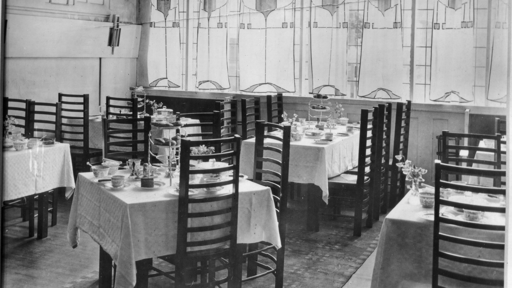
* 马金托什的产品设计和装饰设计也非常突出，他为杨柳茶室设计的**彩色玻璃镶嵌**，他设计的各种**金属建筑构件**、**餐具**和其他**金属制品**，都有他一贯的风格特色，对于“新艺术”运动的新一代设计家有很大的影响
* 马金托什与“格拉斯哥四人”代表了“新艺术”运动一个**重要的发展分支**
  * “新艺术”运动设计主张**曲线**、**自然主义**的装饰动机，反对直线和几何造型，反对黑白色彩，反对机械和工业化生产
  * 而马金托什则恰恰相反，他主张**直线**，主张**简单的几何造型**，讲究黑白等**中性色彩**，为机械化、批量化、工业化的形式做出有益的探索
### 奥地利“分离派”与德国的“青年风格”运动
* 德国的“新艺术”设计运动被称为“**青年风格**”（Jugend stil）派，与法国、比利时、西班牙的情况类似，发起这个设计运动的主要人物也是艺术家、建筑家，他们同样希望通过恢复手工艺传统，来挽救当时颓败的设计
  * 但是，自从1897年以后，这个运动越来越摆脱**以曲线装饰为中心**的法国、比利时、西班牙等国的“新艺术”运动主流，开始与“**格拉斯哥四人**”，特别是与**查尔斯·马金托什**的设计探索相似，从简单的几何造型，从**直线的运用**上找寻新的形式发展方向
* 与此同时，**奥地利**的一批设计家也公开提出与正宗的学院派分离，自称“**分离派**”，在形式方面与德国的“青年风格”接近，成为德语国家的一股新兴设计力量
* 大约在1900年前后，德国的设计开始受到欧洲大陆的“新艺术”风格影响
  * 当时，德国设计家**奥古斯特·恩代尔**（August Endell）设立的设计事务所，在产品设计、室内设计等方面，与法国的吉马德、比利时的霍塔和西班牙的高迪的设计非常相似，具有以曲线装饰为主、被戏称为“面条风格”的特点
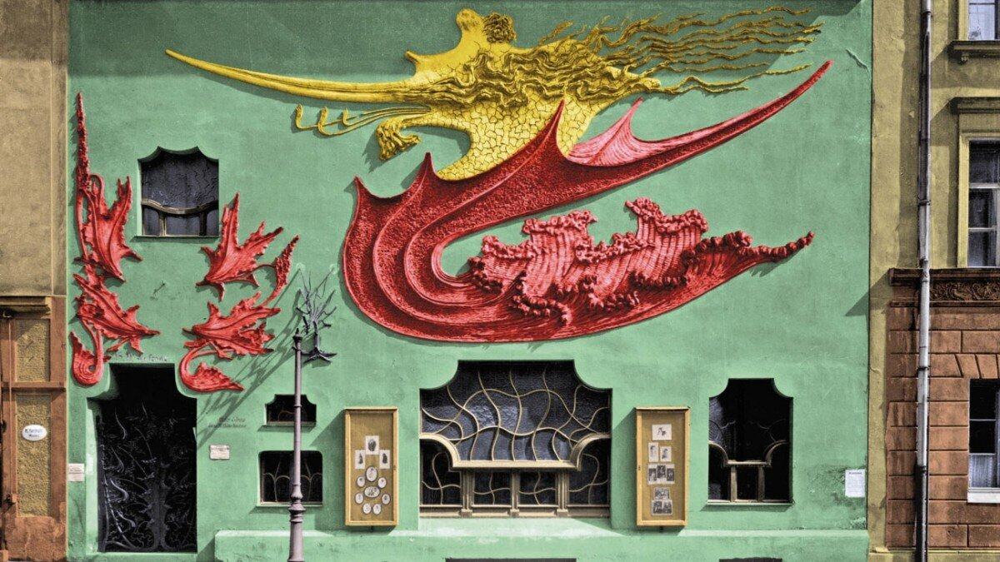
* 1896年，奥地利设计家**奥托·瓦格纳**（Otto Wagner）发表了他的著作《**现代建筑**》，在这本书中，他提出建筑设计应该集中为现代生活服务，而不是模拟以往的方式和风格
  * 瓦格纳对**城市规划**颇有心得，在他1898年为维也纳城市所作的规划中，已经提出**交通或者交流系统**是城市规划的重点，他称此系统为“Stadbahn”（相当于英文的“transport system”）
  * 他的理论，立足于建筑是人类居住、工作和沟通的**场所**，而不仅仅是一个空洞的环绕空间，建筑应该为这种交流、沟通、交通为中心的设计考虑，以促进交流、提供方便的功能为目的，装饰则应该**为此服务**
  * 瓦格纳设计的建筑**迈奥里卡住宅**和**维也纳卡普拉茨车站**（Karlsplatz Stadtbahn Station）就体现了这种功能第一、装饰第二的设计原则，并且开始摒弃正宗“新艺术”风格中过分注重形式的自然主义曲线，采用了简单的几何形态，以少数曲线点缀装饰效果

* 他的设计思想与维也纳的一批前卫艺术家和建筑家不谋而合。这个艺术家、设计家团体自称为**维也纳分离派**（Vienna Secession），提出“为时代的艺术，为艺术的自由”的口号，与瓦格纳《现代建筑》一书中的主张基本一致，德国和奥地利的设计力量开始融合起来
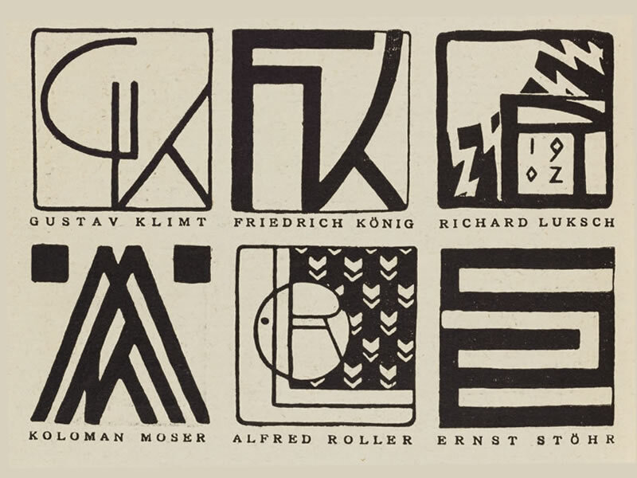
* “分离派”运动中还有另外两位重要的**建筑设计家**
  * 一位是**约瑟夫·霍夫曼**（Josef Hoffmann），他在设计上与瓦格纳有同样的立场和原则，在风格上也比较接近；霍夫曼的设计 很多，其中最负盛名的设计是他在1905年设计的、位于比利时布鲁塞尔的**斯托克列宫**（Palais Stoclet in Brussels, Belgium），这座宫殿设计的方式基本是**立体形体**，细节部分有少数精致的**浮雕**和立体雕塑装饰，采用**混凝土和金属构件**，相得益彰
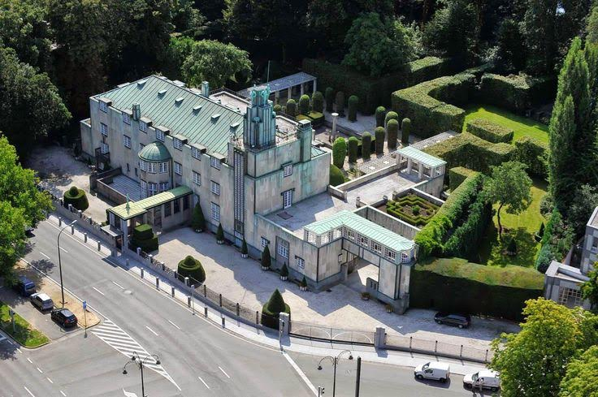
  * 另一位是**约瑟夫·奥尔布里奇**（Joseph Maria Olbrich），他设计的维也纳“分离派”**总部**（The Secession Building）是“分离派”风格集大成的作品，充分采用**简单的几何形体**，特别是方形，加上建筑立面上**少量的植物纹样装饰**，具有功能和装饰高度吻合的特点，与外形奇特、功能不好的高迪建筑形成鲜明对照

* 1907年，**德国工业同盟**（Deutscher Werkbund）的成立，促进了**工业设计**的发展，工业设计师的地位被德国工业界正式确认了
  * 德国人对于**机械化生产**一向抱有**热情**，不像英国人对工业产品存在那么多疑虑和抗拒，因而，德国的工业设计师们趋向于比较适合机械化生产的直线型“新艺术”风格，就非常自然了
### 彼得·贝伦斯
* **贝伦斯**（Peter Behrens）是德国“青年风格”运动最重要的设计家，是德国现代设计的奠基人，被视为**德国现代设计之父**
  * 1868年，贝伦斯出生于**汉堡**，后就读于汉堡艺术学校；1897年去**慕尼黑**，当时德国的艺术正处于被称为**第二次文艺复兴**的巅峰时期，而慕尼黑又是整个艺术运动的中心，他在那里受到很多的文化、艺术上的影响
  * 1901年，贝伦斯在**达姆斯塔德**设计了自己的住宅（Peter Behrens’ House，Darmstadt，Germany），还设计了全部家具

  * 1893年，他仿效奥地利同行的方式，组织成立了前卫设计组织——**慕尼黑分离派**
* 1907年是贝伦斯成功的开端；这一年，他受邀为**德国大型电器公司AEG**（Allgemeine Elektricitats Gesellschaft）担任**艺术指导**
  * 从此，他更专注在**工业产品设计**方面，为这家德国最大的电器生产企业设计电风扇、电灯和电水壶这类工业产品
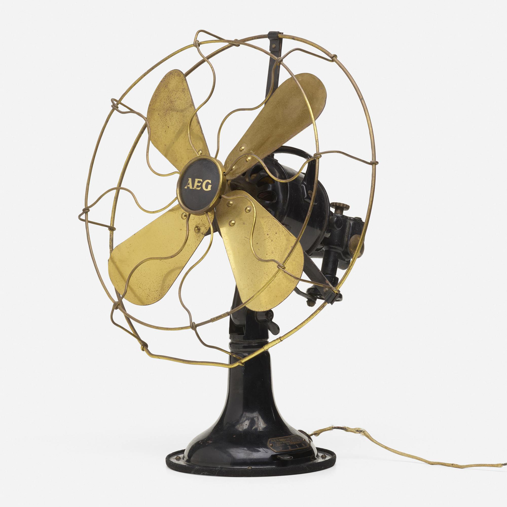
  * 贝伦斯采用正八边形和简单的黑白字体设计了**公司的企业标志**，还设计了产品包装、工厂建筑物、产品目录、办公室文具、企业的标准字体、来往公文的版面标准等等，构成这个**公司的形象**，成为**世界最早的企业形象设计项目**，奠定了**企业形象设计系统**（CIS，Corporate Identity System）的基础，他所建立的这套企业形象系统，迄今依然具有非常积极的参考价值
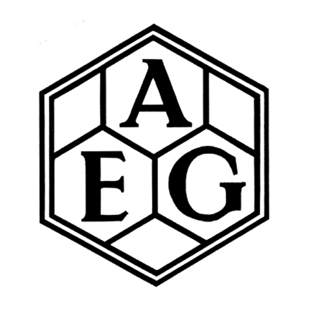
  * 他的设计基本**摒弃了烦琐的装饰**，强调简洁、功能良好的外形和结构，得到工业界一致好评；他在设计上讲究**功能**，理性、严谨，为德国的工业产品设计风格定下了基调
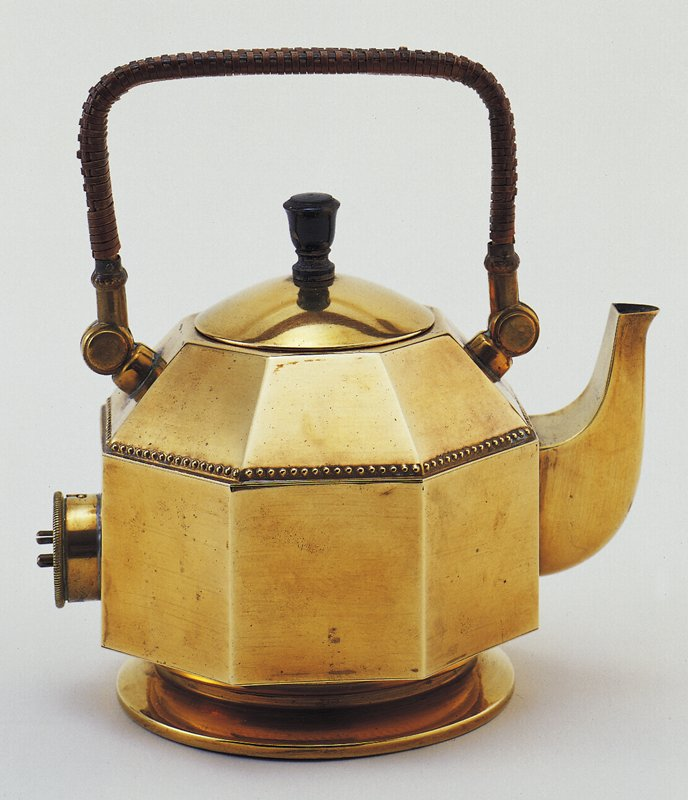
  * 他被指任为德国电器公司的**设计总负责人**，负责产品设计、平面设计和企业形象设计工作，是世界上最早的**企业内工业设计师**
* 1909—1912年期间，他还为AEG设计了公司总部的管理、工厂混合大楼，其中最重要的是他设计的**涡轮机工厂**（AEG Turbine Factory）建筑，这座建筑基本上完全摒弃传统的工业建筑结构，采用**钢铁和混凝土**为基本建筑材料，结构上也开始朝**幕墙方式**发展，是日后现代主义的幕墙式建筑的**最早模式**
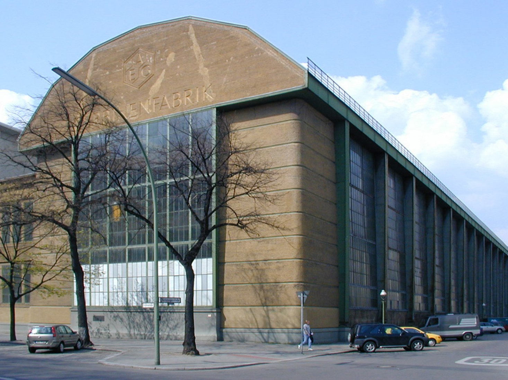
* 除了上述国家以外，“新艺术”运动在荷兰、意大利也有一定的发展；**荷兰**的风格与法国的风格接近，**意大利**的“新艺术”运动集中在意大利的北部地区，有时称为“**李柏提**”风格（style of Liberty），与法国风格也很相似，这两个国家的“新艺术”运动发展时间都不长，影响也有限

* “新艺术”运动的影响范围非常广泛，不但在西欧国家有发展，而且在**东欧国家**也有所出现，在**莫斯科郊外**也发现了在1900年前后设计的典型“新艺术”运动建筑，其中一栋别墅，设计精美，俄国作家高尔基和作曲家普罗科菲耶夫都曾在此生活过
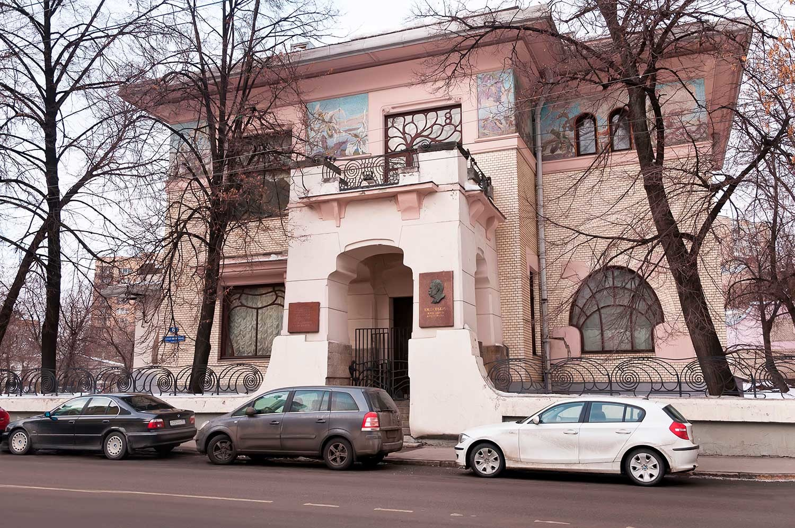
* 该运动在一些方面的确表现出**对新时代的憧憬与探索**，但是，在很大程度上，它所推崇的手法，即装饰性的、手工艺的方法依然是**陈旧**的
  * 它所采用的方式，比如装饰、自然主义的风格等等，使这个运动依然是为豪华、奢侈的设计服务的，是为**少数权贵**服务的
  * 如果说英国“工艺美术”运动的创始人拉斯金、莫里斯在他们的运动宗旨中还提倡“进步”，那么可以说“新艺术”运动则仅仅停留在**表面的装饰**上，就思想层次而言，反而比英国的“工艺美术”运动**退步**了
  * “新艺术”运动不仅继承了“工艺美术”运动强调的**简单、朴实的中世纪风格**和“合适的设计”这种**功能主义的思想特征**，同时也在某种程度上具有开创性的意义
  * **象征主义艺术**作为19世纪末的一个非常显著的艺术运动流派，对“新艺术”运动也造成了一定的影响
  * “新艺术”运动较少强调历史风格，但其历史的渊源，仍可追溯到中世纪**自然主义风格**的影响；这场运动**风格细腻**、装饰性强，大量采用花卉、植物、昆虫作为**装饰的构思**，因此又常常被称为“**女性风格**”（a feminine art），与**简单朴实**的英国“工艺美术”运动风格强调比较**男性化的哥特风格**形成鲜明对照
