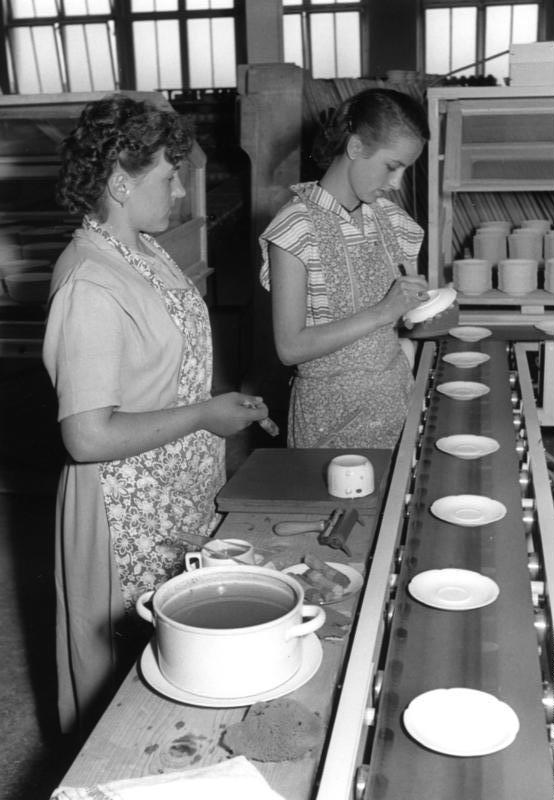

[TOC]
# “维多利亚”和“第二帝国”风格
* **烦琐**的历史风格在19世纪初期依然兴盛，特别是在**维多利亚时期**；英国的哥特复兴风格、法国的“第二帝国”风格和美国以这两种风格混杂的折中主义风格，占据着主导地位
* 直到1850年代之后，“**工艺美术**”运动（the Arts&Crafts）和“**新艺术**”运动（Art Nouveau）相继兴起，涌现出一批新设计家，突破了这类以皇权思想为中心的烦琐奢华时尚，提倡恢复自然的手工艺设计，逐步引导出现代设计来
## 维多利亚风格的建筑
* 从1830年代之后，**新古典主义**逐步式微，法国国王**路易十六**被革命党处死，风格开始瓦解，后被**法兰西第二帝国风格**取代；英国的汉诺威王朝转入了**维多利亚女皇时代**，设计上也走上**烦琐奢华**的方向，时间长达70多年
* **维多利亚风格**（Victorian Style）一词，常用来形容19世纪在欧洲和北美、澳洲等地，尤其是英国、美国、澳大利亚等英语系国家相当盛行的建筑和装饰风格
* 英国女皇**维多利亚**（Queen Victoria，本名为Alexandrina Victoria，1819—1901）在位的70年里，大英帝国正处于其鼎盛时期，国力大幅提升，殖民地几乎遍布全球，有“**日不落帝国**”之称；他们可以从皇冠阴影下任何一个角落获得原材料、汲取设计灵感，英国的设计师们完全无须顾忌欧洲大陆上的风格流派，而有足够的底气广采博纳，**自成一统**
* 然而，虽然一般认为华丽、丰富、堆砌，甚至杂乱，是“**维多利亚风格**”的特征，但严格说来，这并不是一种固定的、统一的风格；在**维多利亚时代早期**，流行风格的主流的是**哥特复兴风格**，然后逐步发展得更加华丽、堆砌、花哨起来；到了**维多利亚时代的后期**，一系列反对这种奢华趋势的设计潮流——如“**工艺美术**”运动（the Arts and Crafts movement）、“**新艺术**”运动（Art Nouveau）、**自由风格**（Liberty style），以及后来的**装饰艺术运动**（Art Deco）相继出现
* 即便在维多利亚时代，也不是所有的社会阶层都热衷于维多利亚风格的；维多利亚风格真正的消费者，只是正在富裕起来的**中产阶级和专业人士**，新兴的**工厂主**等人群
* 19世纪初以来，**伦敦**成为一座技术突破和发明创造不断涌现的大都市，**铸铁建筑**、**蒸汽发动机**相继诞生，世界上第一条**地铁**（英国人称为the Tube）、第一台**缝纫机**、第一个**有冲水马桶的公共厕所**接连出现；在这一片热潮中，伦敦成为维多利亚风格建筑的**大本营**
* 从事维多利亚风格设计的设计师，对**传统的欧洲风格**非常留恋，他们将自己喜欢的历史风格一股脑儿混合起来，加以采用，而在这些风格中，最具有特点的是**哥特风格**的运用，形成英国独特的“**哥特复兴**”运动（the Gothic Revival）
* 1835年由**查尔斯·巴利**（Sir Charles Barry）设计、**奥古斯都·普金**（Augustus Pugin）做室内设计和装饰的**英国议会大厦**（House of Parliament），采用了**哥特式三叶草形**的立面装饰，还采用了一些具有异国情调的装饰细节——西班牙式的锁孔型拱、近东地区的尖塔等等，并且首次将这种新哥特风格引入到**大型公共建筑**里来

* 在苏格兰，开始广泛使用**钢铁结构**设计建筑的先驱之一是**亚历山大·汤姆逊**（Alexander Thomson），他的作品采用了现代结构，在形式上虽然放弃了新古典的欧洲传统建筑形式，却依然沿用了埃及、东方建筑的装饰动机，他于1863年在格拉斯哥设计的**巴克斯·希德大楼**（Buck Head Building）就是这样的一个例子

* 准确地来说，维多利亚风格谈不上是一种统一的风格，它的实质是**古典折中主义**，表现出一种**高度烦琐**的装饰特征，且具有明显的违反“功能第一”原则的倾向；这种风格的流行，反映了新生的资产阶级企图利用烦琐、华贵的设计来炫耀自己财富的欲望，这种风格不仅表现在建筑上，同时还表现在室内设计、园林和环境设计、家具和产品设计、平面设计等方面
* 在这场新技术、新材料引起的骚动中，没有一座新建筑能够比1851年**伦敦世界博览会**会址——**水晶宫**更引起震惊的了
  * 在**阿尔伯特王子**的倡导下举办的**伦敦世博会**（英文全称为：Great Exhibition of the Works of Industry of All Nations，通常简称为The Great Exhibition），吸引来全球各地的新产品，成为新工业时代的一个巨型展示橱窗，并由此引发了随后举办的一系列国际博览会，极大地促进了**全球商品经济的发展**
  * **约瑟夫·潘克星顿**（Joseph Paxton）曾经建造过深受维多利亚女皇称赞的**查特沃斯温室**（Chatsworth Green house）；在水晶宫的设计中，他从温室和**王莲的网络状支撑**的设计中获得启示，决定选用平板玻璃、钢铁等**工业材料**，并采用新的预制件**拼装**的建造方式
  * 他先在其他地方将建筑的梁柱、框架等建筑部件**预先做好**，分批运到工地来进行**装配**，然后再安装上平板玻璃的**墙体**，大大缩短了工期，降低了施工成本；同时，这座拥有约8万平方米室内面积的巨大建筑还可以很方便地**拆卸**、移走
  * 水晶宫的设计稿为了不破坏**海德公园**原有的自然环境，帕克斯顿测得建筑范围内的榆树高度后，在设计中增加了一个**桶状的圆顶**

  * 水晶宫中，既没有希腊柱头，也没有哥特尖拱，被当时守旧的人讥为“没有品位”，然而潘克星顿和他的这栋水晶宫，用**机械性重复的模数单位**、**坚硬闪亮的玻璃几何体**，以及**预制加工部件的装配式建造方式**，为即将来临的新世纪建筑提供了意义重大的启示：**机械**可以是一种风格的模式，**技术**可以提供新的材料和新的施工方法，建筑上的创新者不一定是建筑师

  * 世博会结束后水晶宫移至伦敦南部的**西得汉姆**，并以更大的规模重新建造，1854年6月10日由维多利亚女王主持向公众开放，作为伦敦的娱乐中心存在了82年；1936年11月30日晚上6点，在中央大厅的员工厕所内突然**着火**，很快大火烧遍了整幢建筑，除了一堆扭曲的金属和融化的玻璃，什么都没有留下
* **工业革命**对于英国建筑的影响有两个方面：一方面，正是工业材料、工业技术、工业加工方式的发展促成**水晶宫这样的新型建筑**的出现，推动了**现代建筑**的发展；另一方面，工业时代引发的动荡，不仅影响到风格和品位，同时也造成社会结构、经济基础的剧烈变更，因而激起了强烈的**回归过去**的情绪——历史成为守旧、害怕变革的人们的避风良港，而这也是**维多利亚风格**出现的重要原因之一
* 到19世纪，迁来美国、加拿大和其他英国殖民地国家的**英国建筑师**更多了；他们带来了英国流行的各种建筑风格，英国当时的一本《**营建者**》（the Builder magazine）杂志对于传播英国流行的建筑风格起到相当大的推动作用
* 英国建筑师**雅科布·莫得**（Jacob Wrey Mould）甚至担任了纽约市的公共建筑部的**总建筑师**（Chie Architect of Public Works in New York City）、**纽约中央公园**的设计者，对纽约城市面貌的影响迄今处处可见

* 美国人很**实用主义**地将各种风格都笼统地称为“维多利亚风格”，特别突出花哨、烦琐的装饰，而且往往在一栋建筑上混杂使用上述几种风格，这和英国比较**严谨**的手法大相径庭
* 1840—1890年之间，维多利亚风格在**澳大利亚**也非常流行，并且有多种不同的派生风格出现；当时，澳大利亚正处在**淘金热**高潮，大量**移民**涌入，交通、贸易都有很大增长，经济发展很快，在淘金热最盛的**维多利亚州**和**新南威尔士州**，新的建筑大量涌现，其中不少都采用了维多利亚风格，包括在维多利亚州州府墨尔本建成的**皇家展览馆**（Royal Exhibition Building）

## 维多利亚风格的家具和室内设计
* 维多利亚设计风格还在装饰艺术、产品设计、平面设计上有相当广泛的发展，总的特点是以**烦琐复杂的装饰**，取代了新古典主义的庄严、简练；这点在家具设计、用品设计、服饰设计、室内设计上非常明显，有一种暴富的**炫耀感**，这与70年来无大战一片升平，**中产阶级**在人口上比例大增的历史背景有密切关系
* 维多利亚时期的**家具**已不再专为皇室、贵族服务，而是开始**面向市场化**了，因此，所谓维多利亚风格并不是一个固定的风格，而是设计师根据客户的喜爱，从各个不同时代的风格中选出一些来拼凑而成的
* 虽然维多利亚风格混杂了多种历史传统风格的装饰动机，然而维多利亚时期的家具设计师们的确创造了**注重表面的处理**、**体量较大**、**非常华美**的特点
* 在造型上，维多利亚风格的家具外轮廓大多展示出**两凸一凹的轮廓线**；**亚瑟·琼斯**（Arthur Jones）设计的椅子是最清楚不过的例证，这把在水晶宫展出的椅子，椅背像一把放大了的提琴，或者像维多利亚时代女性所穿的鲸骨裙撑，令人感觉是从女性胴体的丰腴中受到的启发

  * 后来到了Art Nouveau时代，两段凸线就被压缩成一条连绵蜿蜒的曲线
  * 而到再晚一些的现代主义风格，则将缠绵流畅的曲线变成不食人间烟火的完美的几何抛物线和酷酷的直线，展示出工业时代机械的冷静和理性
* “**白日梦者**”椅子（Daydreamer）也在水晶宫里展出过，它是由英国人**菲兹·库克**设计的
  * 这把扶手椅的整体轮廓是标准的两凸一凹曲线，**没有任何直线的部分**；椅脚采用了洛可可风格的向两边蜷曲，而不是与椅面垂直；椅子的面料是华美的绸缎，上面布满了天使、雪花、小狗等复杂的纹样
  * 椅身上满是雕刻的图案和人形——椅背顶上一位是美梦天使，一位是噩梦魔鬼，两边扶手外侧和椅脚的中间也都在讲述着不同的故事，而**偏爱叙事情节**，也正是维多利亚风格的一个设计特征

* 设计师们在试用新材料方面表现出明显的热情，“白日梦者”椅身所用的材料就不是常见的木料，而是**造型纸浆**（Papier-mache，将掺入面粉和胶料的纸浆逐层涂到金属模具上成型）；其他人在制作家具的时候，已开始用到了铸铁、锌，甚至橡胶
* 在采用新材料和发明新的加工工艺方面，**约翰·亨利·贝尔特**的**层压胶合花梨木板家具**大概可以算是当时最大胆的尝试了
  * 这位从德国移居纽约的家具设计师，在1856年成功地申请到一项专利：他将**花梨木**（Rosewood）锯成大约1/16英寸厚的薄板，先将这些薄板用砂纸打磨得非常**光滑**，再**用胶粘起来**，这是世界上最早的**夹板**之一

* 在室内设计方面，维多利亚时期很讲究**功能空间的布局**，房间、公共空间、私人空间分隔得清清楚楚，绝不含糊，室内的空间布局反映了对于尊卑、长幼、公私、内外等社会关系的重视
  * 一栋住宅里，最重要的空间是**接待室**，英语叫作“Parlor”（亦称为Drawing Room），就是正式客厅、接待厅的综合空间，这是反映主人身份地位的门面
  * 第二重要的空间是**正式餐厅**，也具有这种炫耀的目的性；在餐厅中，**壁橱柜**是最突出的，其他部分也装饰华贵

* 维多利亚风格的**墙面**有几种不同的装饰方式，一种是用**单色**，不同空间的墙面色彩是不同的，入口、楼道、走廊用浅灰色，目的是衬托出房间的色彩；比较富裕的家庭用**大理石、木料**做墙面，收入低一点，但又钟情于维多利亚风格的家庭就采用**墙纸**
  * 房间内的色彩大多选用**色温相同**的色彩，不同的房间选用色彩环上**邻近的颜色**，叫作“**统一调和**”（the harmony by analogy）
  * 不过，全部用相邻色会显得过于沉闷，因此，在维多利亚的室内设计中又加入了第二条原则，叫作“**对比调和**”（the harmony by contrast），方式就是在一个**色调一致**的房间内采用少许**对比色**，起到提神、出彩的效果
  * 比较花哨的维多利亚室内，有时候还会在墙的底部用一个色彩系列的踢脚板（dado）、护板（wainscoting），中部用另外一个色彩，到顶部檐线（frieze）、顶部框架（cornice）再换一个色彩，因此室内是**三段色**的，很能代表维多利亚时期的市民品位，这种墙面在19世纪上半叶特别流行
* 虽然自18世纪以来，**洗浴的私人空间**已经开始出现，但浴盆、马桶等依然被视为**不洁、污浊的东西**，以至于1851年，当时的美国总统**米勒德·菲尔莫尔**想在白宫安放一个浴盆，竟激起了极大的愤怒；直到1877年，美国的第19任总统**拉瑟福德•B•海斯**才算终于在白宫有了自己的浴室
* 虽然缓慢，但浴室作为一个重要的室内空间毕竟在维多利亚时期日渐受到重视，浴室专用设备的设计也开始出现了；当然，这些设计也带上了浓重的时代色彩，各种传统装饰动机的混杂使用，连洗手池、厕所马桶也都加上了烦琐的装饰细节
## 维多利亚时期的产品设计
* 从19世纪开始，倚仗持续的科学和技术的进步，在一个有益于贸易和国际竞争的政治、经济氛围中，**制造业**不断**加速扩张**，以满足市场的需求；从1790—1900年，仅仅美国专利局，就收到了60万份新的专利申请
* 面对这些从未有过的**新产品**，大多数设计师选择了**沿用过去的风格**，从水晶宫里展出的许多产品的设计上，可以清楚地看出这一趋势
* 英国银匠**约瑟夫·安格尔**设计的一套酒具算是个极端的例子；这些源于哥特风格的酒壶、酒杯，其把手扭结纠缠到让人难以握住，壶身上凹凸不平的复杂花纹让清洗成为麻烦

* 当时的产品设计，往往流于**两个极端**——或者是因循守旧地抄袭历史上的**传统风格**，而不顾及产品的功能性和实用性，烦琐、过饰，**华而不实**；或是简单地**顺应工业生产流程**，不顾使用者的心理感受和审美需求，产品虽然具有使用功能，但**粗糙、简陋**
* 虽然存在着种种问题，但维多利亚时期的设计还是有很大进步的；除了用**工业生产方式加工**，大大降低了成本之外，产品的**功能性和易加工性**都有重要的提高
* 例如美国柯尔特·彼得逊公司生产的单发、0.44口径的**左轮手枪**（于1835年获得专利），在水晶宫展出时，虽然曾因为外形简练而被嘲讽为“丑陋”“土气”，但傲慢的英国人也不得不为其优良的功能性而折服
  * 这把手枪的配件都是**标准化批量生产**的，不但加工速度比手工操作快得多，而且精准度也高得多，部件容易互换，因而维修方便，成为第一把商业化批量生产的自动手枪，并且很快就改进到可以连发五六颗子弹

* 另一个引起工业生产大变革的先声是**装配线**的出现；费城的发明家**奥利维·伊万斯**于1785年开始在他的面粉作坊中建起了**自动生产线**，半成品在传送皮带上传动，工人无须离开自己的位置，每人只负责一道**单一的工序**，大大提高了劳动生产率

## “第二帝国”风格的设计
* 当**维多利亚风格**在英国与受英国影响的国家和地区（如美国、加拿大、澳大利亚、新西兰、中国香港、印度、锡兰、马来亚、新加坡等等）流行的时候，法国流行的是“**第二帝国**”（Second Empire）风格；当时，拿破仑的侄子**拿破仑三世**当政，成立了**法兰西第二帝国**，因此也被人干脆称之为“**拿破仑三世**”风格（the Napoleon Ⅲ style）
* 第二帝国风格主要起源于**建筑**，影响到室内、家具和时尚，流行时间在1865—1880年之间；第二帝国风格和以前的**新古典风格**有非常密切的关系，比如从墙面使用的石砌方式上，可以看出文艺复兴、意大利风格的特点
* 这种风格的主要特征是：以**公共建筑**居多，一般体量都相当大；平面布局呈**正方形**（或近似正方形），室内空间大多呈轴向布局；对于建筑**正立面**的装饰非常重视，装饰细腻，手法丰富，但轮廓线相当清晰；大多采用**双重斜坡屋顶**，室内装饰细节上采用了大量古典主义或文艺复兴风格的动机
* **塔楼**是第二帝国风格的一个重要建筑元素，或用于建筑中部，或用于建筑尾端；**装饰柱**则是另一个常用的外墙装饰元素，或在首层的弓形门廊上设有一排，或一层一层地从下往上排列
* 在巴黎，既有大量的公共建筑，例如**爱丽舍宫**（ElyseePalace，拿破仑第三曾于1867年完成重大整修，现为法国总统官邸），还有成片的临街五层公寓，都是集中体现这种风格的建筑、室内、家具设计的典型例子

* 第二帝国风格虽然是在法国发展起来的，但是很快就成了一种国际风格，尤其在19世纪的下半叶，影响极其深广；在欧洲，维也纳的歌剧院、罗马的意大利银行、柏林的国会大厦都是这类建筑的代表

* 第二帝国**家具和其他室内用品**的设计都具有类似的风格特征，以古典主义为基础，加上代表拿破仑皇权、贵族权势的徽章、符号、象征性的植物、动物纹样，气势大、金碧辉煌，是拿破仑**皇权**的反映
