[TOC]
# “装饰艺术”运动
## “装饰艺术”运动的概况
* 进入1920年代，西方社会从**第一次世界大战**的硝烟中重新站立起来，整个社会的气氛是**乐观**的
  * 机械化时代里，日新月异、价格实惠的**家用器具**大批量地生产出来，**新的技术**大大提高了民众的生活质量
  * 欧洲各国经济**普遍繁荣**，美国经济更是**高速发展**，形成了**新的市场**，为新的设计和艺术风格提供了**生存和发展的机会**
  * 正是在这样的历史条件下，产生了20世纪初期一场重要的设计运动——“**装饰艺术**”运动（Art Deco）
* 当时，欧美一批艺术家和设计师已经敏锐地认识到**新时代的必然性**，他们不再回避**机械形式**，也不拒绝**新的材料**（比如钢铁、玻璃等）
  * 摆在设计师面前的任务是寻求一种与过去时代不同的设计和装饰语汇，以适应新的时代和新的生活方式的要求
* “装饰艺术”兴起于**1920年代**，退潮于**1930年代的大萧条**，是20世纪里延续时间比较长的一次设计运动
  * 其名称出自1925年在巴黎举办的“**国际现代装饰和工业艺术展**”（the Exposition Internationale des Arts Décoratifs et Industriels Modernes），该展览旨在展示“新艺术”运动之后的新建筑与新装饰风格
  * 但是，“装饰艺术”这一术语，其内容**并不仅是一种单纯的设计风格**；和“新艺术”运动一样，它包括的范围相当广泛
  * “装饰艺术”运动，影响了**几乎所有的设计领域**：包括纯艺术、装饰艺术、时装、电影、摄影、平面设计、交通工具和工业产品的设计等等，成为一种几乎无处不在的现代风格
  * 在欧洲，“装饰艺术”运动的发展，主要集中在**奢华消费产品**的设计与**艺术品**的创作上；而当这种风格传入美国后，却很快延伸到建筑设计、室内设计、火车站、电影院等规模更加宏大的**公众性质的项目**上，以及许多**大众日常用品**的设计中
* “装饰艺术”运动是一场**国际性设计运动**，不少欧美国家都参与其中，尤以法国、英国和美国的设计运动较具代表性
  * 它甚至还影响到**欧美以外的一些国家**，在拉丁美洲、澳大利亚、中国的上海都有过相当大的影响，出现了一批非常精彩的这种风格的建筑物
* “装饰艺术”运动是一场**承上启下的运动**，它既对“工艺美术”运动、“新艺术”运动的自然装饰、中世纪复古表示反对，也对单调的工业化风格加以批评
  * 它是**新艺术运动**和**现代主义运动**之间的一个**衔接**，双方的特征都兼而有之，但却不是简单的重复或再现
  * “装饰艺术”运动将传统设计的精华，用来赞颂全新的机械化的摩登时代；“装饰艺术”运动的设计师们，并不执着于某种纯粹而同一的风格，而是善于从不同的文化源头不拘一格地**兼收并蓄**
* 这场运动的装饰特点，在时装、首饰、化妆用品、高级酒具等方面，一直**得以保持**
  * 而在1980年代，当现代主义的**单调、枯燥**受到批评的时候，“装饰艺术”的装饰特点则**重新焕发出活力**，在**后现代主义风格**中再次受到重视
## 影响“装饰艺术”运动风格的重要因素
### 古代埃及装饰风格的影响
* 1922年，英国考古学家、探险家**霍华德·卡特**（Howard Carter）发现了一个从未为人所知的古代帝王墓——**图坦卡蒙陵墓**（Tutankhamun）
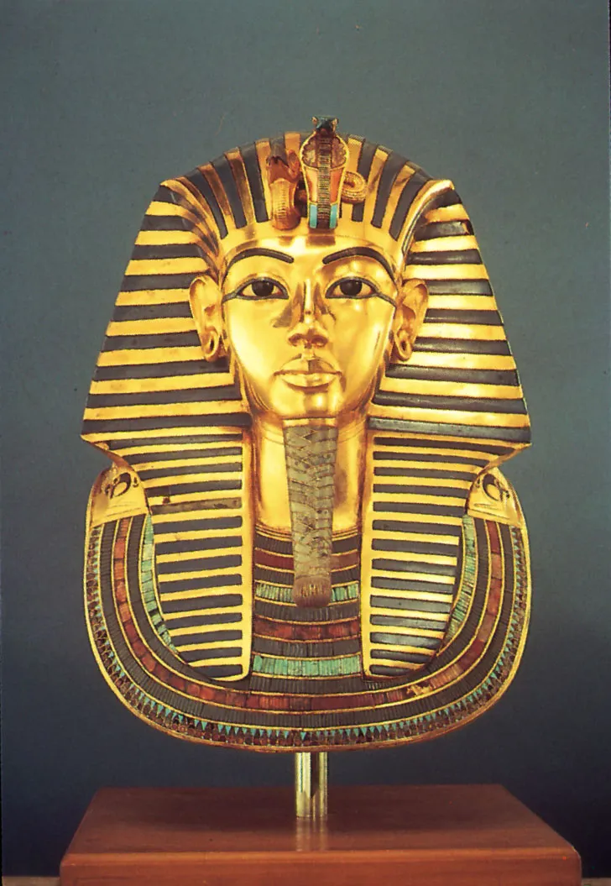
  * 从墓葬出土的战车、家具、木乃伊棺木，尤其是金首饰和那副无与伦比的法老的金面具，采用简单明快的从自然抽象出来的**几何图形**，并加以变形，使用金属色系和黑白色彩系列，达到**高度装饰的效果**，给了设计师们强而有力的启示
  * 埃及元素在**时装界**尤为流行，有时甚至泛滥到匪夷所思的地步；1920年代兴起的“**木乃伊装**”（Mummy Wrap）的设计灵感，就来自古代木乃伊身上层层叠叠的包裹布

[古埃及.md](../../History/国别史/北非/古埃及.md)
### 原始艺术和异域风格的影响
* 20世纪初以来，**原始艺术**的影响，特别是来自**非洲和南美洲**的原始部落艺术对于欧洲前卫艺术界的影响是非常大的
  * **毕加索**（Pablo Picasso）的《**亚维农的少女**》就受到非洲原始艺术的影响；挪威艺术家**爱德华·蒙克**（Edvard Munch）则在很大程度受到南美洲的原始部落文化影响
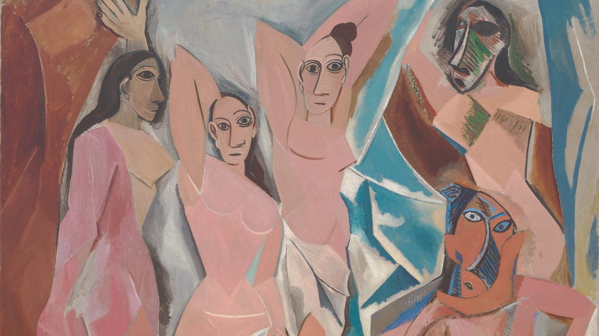
* 世界各地不同的地方艺术、**民间工艺**，也是“装饰艺术”运动的一个重要源泉，异域的艺术品、家具、用具、服装、纺织品和民间工艺品中所呈现的生机勃勃、野性十足的**原创动机**，经过简化、风格化（很多时候是几何化），为现代化装饰提供了**丰富的语汇**
  * “装饰艺术”设计师们从**中南美洲古代印第安文化**（如玛雅文化、阿兹台克文化和印加文化）中汲取养分，创造出新的建筑和装饰造型来
  * 纽约和美国其他大城市那些高耸的“装饰艺术”风格**摩天大楼**，顶层多采用**阶梯式尖顶**的形式，正是借用了中南美洲**古代通灵塔**的建筑元素
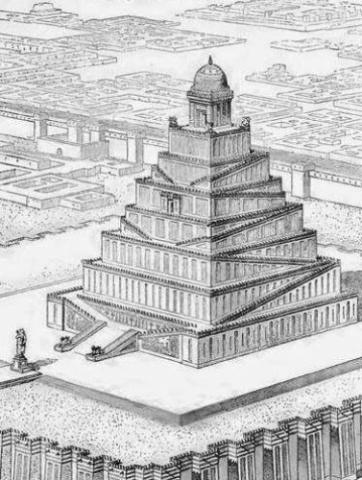
* **中国元素和日本元素**亦是“装饰艺术”风格中重要的成分，“装饰艺术”时期的许多作品都采用了东亚地区传统的设计材料和制作技术
  * “装饰艺术”的设计师们大量借鉴了**中国古代铜器**和**早期中国瓷器**优雅的器型、精致的花纹，以及**中式硬木家具**简洁洗练的线条
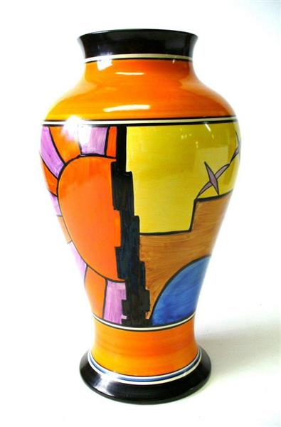
* **非洲**纺织品、盾牌和民间雕塑上那些粗壮的、抽象的、几何化的之字形图案，那些圆圈和三角形的组合成为“装饰艺术”设计作品上最常见的**装饰纹样**
  * 很多艺术家和设计师还直接运用从非洲传统的面具和雕塑中发掘到的**非洲黑人形象**作为设计的动机
  * 美国最早获得全国性声誉的黑人艺术家**萨金特·约翰逊**（Sargent Johnson）以非洲艺术作为自己创作的源泉，在设计作品中强烈地表达了现代都市黑人的文化和活力

### 前卫艺术的影响
* 20世纪早期的**前卫艺术**，以其全新的视觉语言、丰富的色彩和大胆的意象，对“装饰艺术”运动造成深刻的影响
  * 野兽派、立体主义、未来主义、“分离派”、至上主义、构成主义都被转化到“装饰艺术”之中；“装饰艺术”运动的设计师们采用这种几何化的、抽象的、割裂的**艺术语汇**，为现代都市生活和文化注入了生气
  * 同时，不少**前卫艺术家**也自己动手将他们的艺术理念应用到设计中去
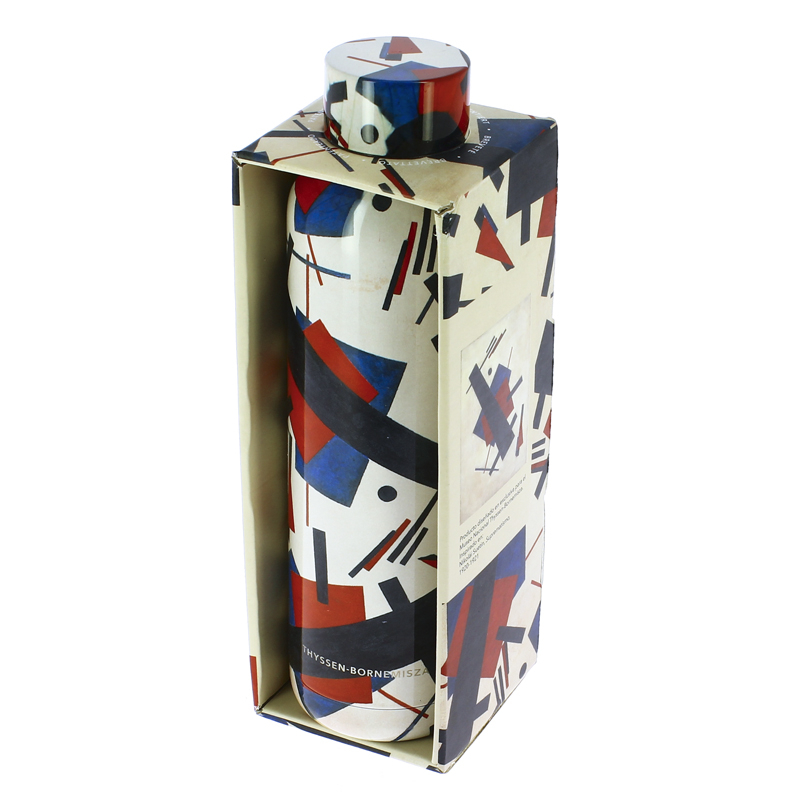
### 古典艺术的影响
* 第一次世界大战结束后，人们都在寻求抒情、欢乐的主题，不少艺术家、设计师便将他们的目光转向了**古希腊、古罗马**，飞行的欧罗巴、雅典娜等形象变得十分流行，纺织品、墙纸、玻璃器皿、装饰陶瓷罐上出现了许多希腊神话和罗马神话中的形象，诸如女猎手、舞蹈的花神等等
* 在众多“装饰艺术”风格的艺术家、设计师中，瑞典雕塑家**卡尔·米勒斯**（Carl Millers）和美国雕塑家**保罗·曼施普**（Paul Manship）非常出色地将古典风格的裸体形象，制作成现代的公共雕塑或装饰性建筑浮雕，他们的设计深受公众欢迎

### “新艺术”运动的影响
* 对于“新艺术”运动过**于复杂的曲线、缠枝纹样**以及**过于崇尚手工技艺**的倾向，“装饰艺术”运动的设计师们是持**批评态度**的，然而这并不影响他们也从“新艺术”运动的设计中**吸收精华**
* 而许多“新艺术”运动的老将，如毛利斯·迪佛雷纳、保罗·佛洛特等人，也已经认识到需要将传统的设计**现代化**，并且要应用到**机械产品**的设计中去
### 舞台艺术的影响
* 20世纪初期，**舞蹈**，特别是**芭蕾舞**开始出现了与传统决裂的**重大改革**；这种改革，在芭蕾舞重要中心之一的**俄国**已经有所发展
  * 改革的内容体现在音乐、舞蹈编导、舞台设计、服装设计等各个方面，由著名芭蕾舞编导**谢尔盖·迪亚吉列夫**（Sergei Pavlovich Diaghilev）带领的“**俄国芭蕾舞团**”（The Ballets Russes）出国演出，也就把这种改革的影响带到欧洲，对于“装饰艺术”运动产生了非常强烈的影响
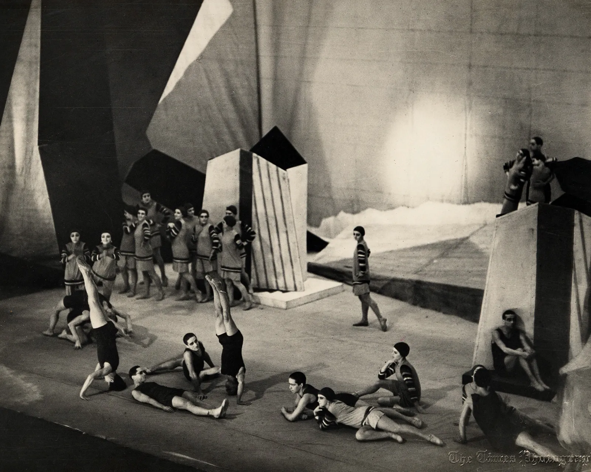
  * 在舞台表演中，美国出生的法国歌舞演员**约瑟芬·贝克**（Josephine Baker）成为异域世界里原始风情的代表人物

  * 另外一种造成影响的舞台艺术风格是美国的**爵士乐**；1920年代和1930年代是美国黑人爵士音乐发展的高峰期，这种强烈的、节奏鲜明而特殊的美国民间音乐和它的表演方式，对于设计家来说是极为新鲜和富于感染力的
### 汽车设计的影响
* 1898年前后，**汽车**被发明出来，很快成为重要的交通工具；20世纪初期，汽车被不少前卫人士视为**未来的象征**，速度感即是时代感
  * 特别是第一次世界大战后，**对于汽车的热爱**在设计师当中非常流行，启发了“装饰艺术”运动的设计师们大胆地采用**现代工业文明的成果**，作为自己的设计构思，在形式上和思想上都具有相当重要的启迪作用
  * 而“装饰艺术”运动在发展的高潮时期与汽车设计中第一个流行风格——**“流线型”运动**（Streamlining）互相影响，在许多设计中，特别是美国的建筑设计、产品设计中出现了两者兼有的特征，形成**流线型现代风格**（Streamline Moderne）
  * 因此，有时候很难分清一栋1920年代到1930年代的美国高层建筑中哪部分属于“装饰艺术”运动，哪部分属于“流线型”风格，美国纽约的**克莱斯勒大厦**的设计就是一个典型的例子
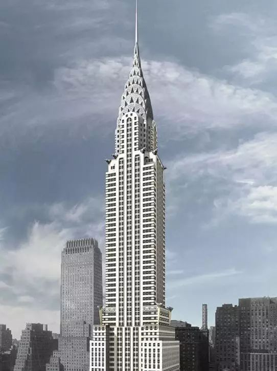
### 大型国际展览的影响
* 在为了推动“装饰艺术”运动的发展而举办的多个展览中，最重要的当数1925年**巴黎**举行的**国际展览会**
  * 该展览的正式名称是“**国际现代装饰和工业艺术展**”（the Exposition Internationaledes Arts Décoratifset Industriels Modernes），专门展览“**现代装饰艺术**”作品
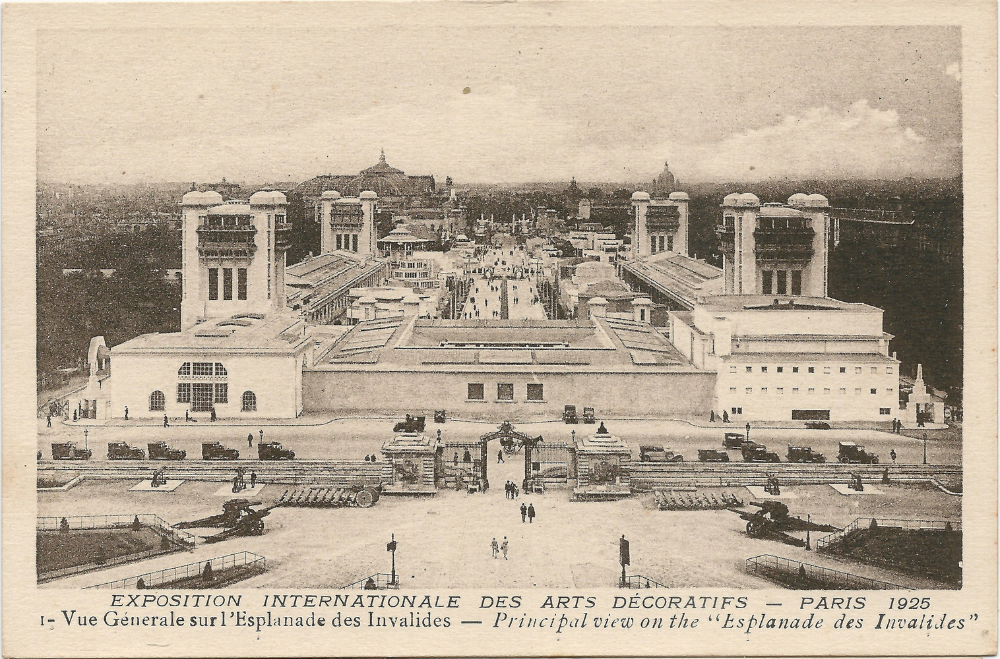
  * 这个展览吸引了欧洲几乎所有国家以及一些欧洲以外国家的几千名设计师参展，有超过1600万观众前来参观，成为“装饰艺术”运动发展的**第一个高潮**
  * 为了让法国品位和法国的奢华产品统领世界装饰艺术界，**法国展品**雄心勃勃地占据了展览的大部分展台，**巴黎**更借此机会展示了世界上最时髦城市的风貌；巨大的**雪铁龙汽车标牌**悬挂在高耸的**埃菲尔铁塔**上，将这个19世纪的建筑工程奇迹变成20世纪消费主义的巨大广告牌，展示了“装饰艺术”运动毫不掩饰的**商业化倾向**
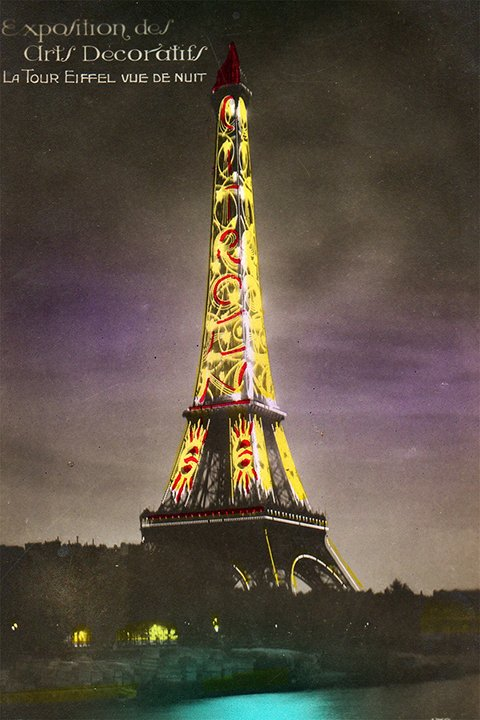
* 1925年的巴黎展览中，最令人瞩目的展馆大约要数**珍藏家酒店**［The Hôteld‘un Collectionneur，亦称**鲁赫曼展馆**（Ruhlmann Pavilion）］了
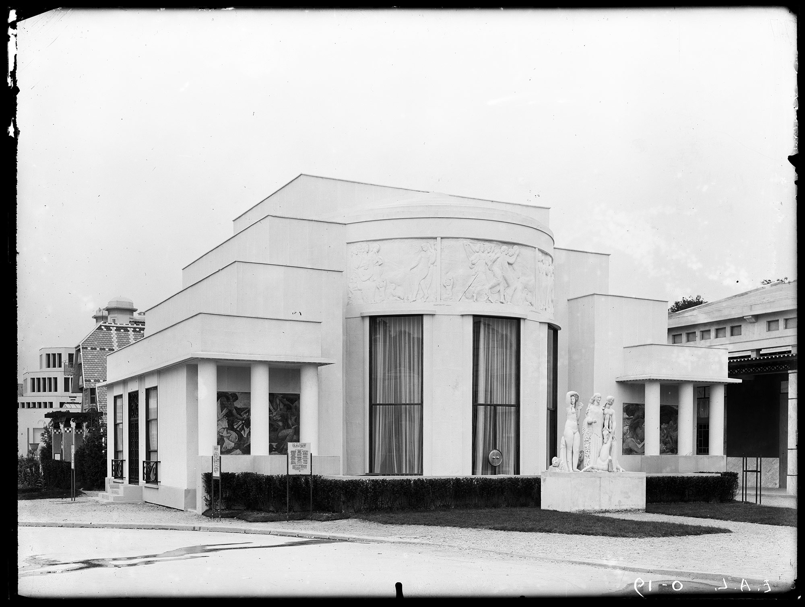
  * 展馆的建筑由法国著名的建筑师**皮埃尔·巴陶特**（Pierre Patout）设计，以一个名为“**大沙龙**”（Grand Salon）的巨大椭圆形展厅作为展馆的视觉焦点；室内设计、家具设计，以及展示设计，则由当时法国顶尖的家具设计师**埃米尔·雅可布·鲁赫曼**领衔的一批著名的艺术家和设计师来完成
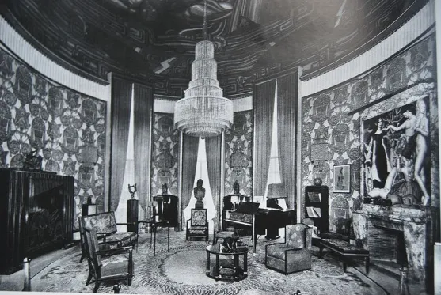
  * 他们用新的技术和材料，将法国的传统设计加以**现代化**，“大沙龙”华丽奢侈的装饰、丰富的色彩、优雅的格局，被评论家们称为法国装饰艺术**最重大的成果**，并成为“装饰艺术”运动的标志之一
* 这次展览中，**优雅大厅**（Pavilion Del‘ Elégance）是集中展示法国时装的中心，此外各个大百货公司，以及**保罗·布尔列特**（Paul Poiret）、**索尼娅·德劳内**等法国时装界的重量级人物也都纷纷开设独立的展台，充分展示了法国时装的雄心和实力

* 这次展览明文规定了参展作品必须是表现**现代精神**的，展品的大部分也的确具有**新时代的创新意味**
  * 众多欧洲国家都参加了这次巴黎国际展览，但德国和美国却引人注目地缺席了：**德国**在第一次世界大战中，是主要的侵略者，也是法国在装饰艺术和设计方面最强劲的竞争对手，因此，派送给德国的邀请函“到得太迟”，以至于德国来不及筹备送展
  * **美国**则是另外一个故事：美国商务部对该展览提出的“参展作品必须是现代设计”这一要求的回应居然是“美国没有现代设计”（“there was no modern design in America”）
  * 不过，美国虽然没有参展，**美国艺术家和设计师**们却是非常积极地前来巴黎参观展览，这次展览对于美国现代设计的兴起和发展起到重大的推动作用
## “装饰艺术”运动的设计特点
### 简洁的几何外形
* 和以往历次设计运动强调从**有机的自然形态**中找寻装饰动机不同，“装饰艺术”风格的设计大多采用了简洁的**长方形块状结构**，以**几何方式**衔接起来，然后再用**曲线的装饰元素**令这些“方块”生动起来
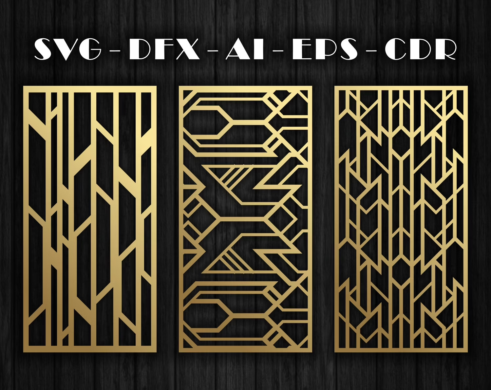
  * 这些装饰元素，通常都是**重复连续**的，除了视觉效果的考虑之外，便于机械加工和批量化生产亦是一个重要的考量
  * “装饰艺术”风格的建筑和产品，通常都表面光洁、平直，边缘清晰，线条流畅而简练；**阶梯式**的造型在“装饰艺术”风格设计中，运用得相当普遍
  * “装饰艺术”风格的**产品**，造型大多是**长方形或其他直线形状**，用到曲线时，亦大多是**浑厚的圆弧**
### 强烈的装饰性
* “装饰艺术”风格，**对功能的考量**不像现代主义那样十分强调，但所有的设计都很强调**装饰性**，不论是建筑、产品、平面设计等等，总会附有一些**装饰的细节**
  * “装饰艺术”运动中所采用的装饰纹样大多是有棱有角、强劲利落的，即便是植物性的纹样，也常常被**几何化**了，立体主义化了，比较**简约**
  * 直接采用**几何图形**，如矩形、方形、圆形、菱形等作为装饰图案，也是“装饰艺术”风格设计的独特手法
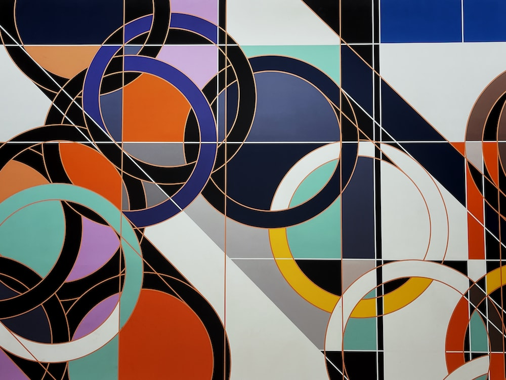
* “装饰艺术”风格的产品通常具有厚重的体量、清晰的边界，其设计重点仍然在**表面的装饰**上
  * **常用的手法**有：在平坦的表面上刻出凹槽或留出凸纹，用贵重材料贴面、髹漆、镀金，在造型比例上强调纵向效果，突出垂直感
  * **彩绘**的装饰手法，在“装饰艺术”风格中也应用得比较广泛，而且通常会使用**鲜艳、明亮的颜色**
### 独特的色彩系统
* “装饰艺术”具有**鲜明强烈的色彩特征**，摒弃了“工艺美术”运动和“新艺术”运动中讲究典雅含蓄、温柔婉约的奶油色系、泥土色系，特别重视**强烈的原色**和**金属色彩**，其中包括鲜红、鲜黄、鲜蓝、橘红和金属色系列古铜、金、银等色彩
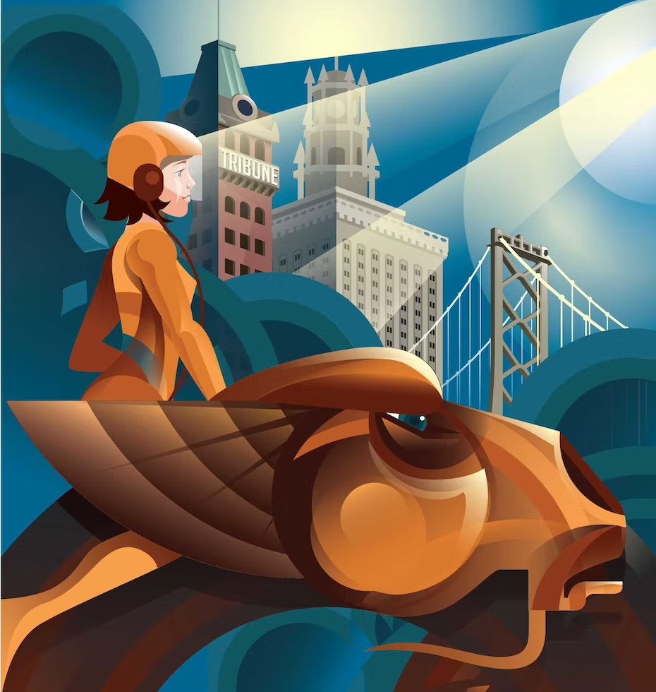
  * “装饰艺术”风格的设计师们在色彩方面既**优雅浪漫**，又**浓烈大胆**，红色、绿色、橘色、白色与黑色、金色、银色的搭配造成强烈的对比
  * 在**室内色彩**上，墙面通常采用比较**柔和**的米色、灰褐色或浅棕色，这些比较中性的颜色正好为画龙点睛似的**戏剧化高光**做好铺垫，以便令室内陈设的色彩鲜艳的地毯、壁挂、家具、装饰品和艺术品更加跳脱出来
  * **黑色**和**烟灰色**常被看作是新技术、现代化的象征，在“装饰艺术”风格的室内设计或产品设计中，亦很常见
### 材料的选择
* “装饰艺术”风格的设计师们陶醉于**奢华的设计语汇**，黑檀木、斑马木、皮革、丝绸、青铜等，都是他们的首选材料，并时常采用鲨鱼皮、象牙、黄金等贵重材料加以点缀，强化奢华、性感氛围
  * 随着中国、日本等东亚艺术热度的高涨，**生漆**在“装饰艺术”运动家具和装饰品中的应用也日益普遍
  * 高光泽的镜面、玻璃，高度抛光的镀铬金属材料等，在“装饰艺术”运动中亦都广泛地被用来打造一种现代的、华丽的氛围
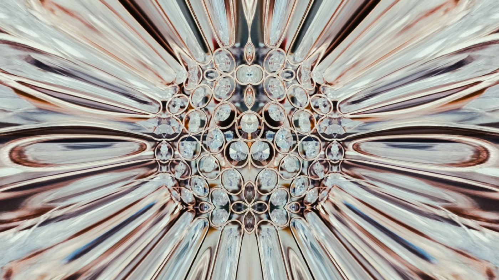
* “装饰艺术”风格实际上是富裕奢华、充满闲情逸致的生活形态的反映，在1929年**经济大萧条爆发**之后当然难以为继
  * 1929年华尔街金融业崩溃引发了美国经济的大萧条，对**奢华设计**而言，是一个沉重的打击，但同时也开辟了另一个新的商机，更加提升了民众对那些价格实惠的**日用消费品**，那些符合现代机械美学观念、可以用现代的机械化方式进行批量生产的价廉物美产品的需求
  * 因而，玻璃、胶合板、镀铬铁材、黑胶木和卡塔林（Catalin，一种铸塑酚醛塑料）等新兴塑料，由于适用性强、易于仿真（例如仿玳瑁、仿大理石等）、便于机械化批量化生产，也得到更加广泛的运用
* 特别值得提及的是当时还属于创新材料的**塑料**，在“装饰艺术”运动中，被赋予了现代化、工业化的**想象力**，除了工业生产的家庭用品之外，表面平滑、精细抛光、色彩丰富明丽的塑料还广泛地应用于首饰和家具设计之中
## “装饰艺术”风格在平面设计上的发展
* 1920年代，现代艺术运动风起云涌，刚刚过去的**第一次世界大战**更使人们认识到传媒、宣传的重要性
  * 在这种历史背景下，**平面设计**作为“装饰艺术”运动的一个重要组成部分，得到很大的发展
* 欧洲一些国家出现了以海报为中心的新平面设计运动，由于都以绘画为设计的核心，同时又受现代主义艺术运动影响，因此被称为“**图画现代主义**”运动（the Pictorial Modernism）
  * 该运动基本局限在平面设计范围之内，非常注重**图像和文字的整合效果**，综合了当时流行的各种现代艺术流派和设计流派的特点，发展出自己独特的、新鲜的平面设计风格来
  * 这场运动源起于**德国**，从1905年德国设计师**鲁西安·伯恩哈特**（Lucian Bernhard）的“普莱斯特”火柴广告开始，一直发展到第二次世界大战爆发前
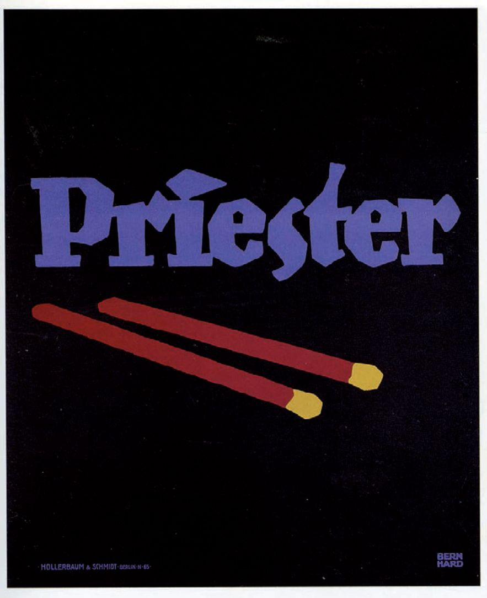
  * 设计师们从**现代艺术**中汲取养分，脱离了以往的**自然主义倾向**，转而形成了自己**独特的风格面貌**，形成新的视觉语言：画面简洁、形象鲜明，以平涂的原色为主要色彩，强调诉求力
  * 这些海报画面绚丽，形象鲜明，诉求明确，力图为人们描绘出一幅“现代化”和“未来”的**美好景象**，在当时社会生活中，具有很大的影响力
  * 与“新艺术”运动的广告仍以**写实手法**为主不同，“装饰艺术”运动在平面设计上，从现代艺术的发展汲取养分，亦采用了许多**抽象、变形、立体主义**的创作手法
  * 在1920年代，随着欧美各国交通和旅游业的迅速发展和普及，消闲旅游成为时尚，向年轻人和富人推销外国（异国情调）的**旅游观光景点**变得越来越重要；于是，**旅游海报**就成了“装饰艺术”运动中平面设计的一项重要内容
  * 另一个重要的海报题材是**电影**，电影在19世纪末走进人们的生活，引起人们越来越大的兴趣，然而在1927年之前，电影尚是无声的；1927年，第一部有声电影《**爵士歌手**》（The Jazz Singer）登上大银幕，1935年，第一部彩色故事片《**蓓姬·夏普**》（Becky Sharp）问世，昭示着电影艺术的日趋成熟，好莱坞的影响越来越大，电影海报也与时俱进地成为平面设计的重要题材
[声音.md](../../Movie/基础/%E5%A3%B0%E9%9F%B3/%E5%A3%B0%E9%9F%B3%EF%BC%881%EF%BC%89.md)
* 1927年为德国乌法电影公司出品的影片《**大都会**》（Metropolis）设计的宣传海报
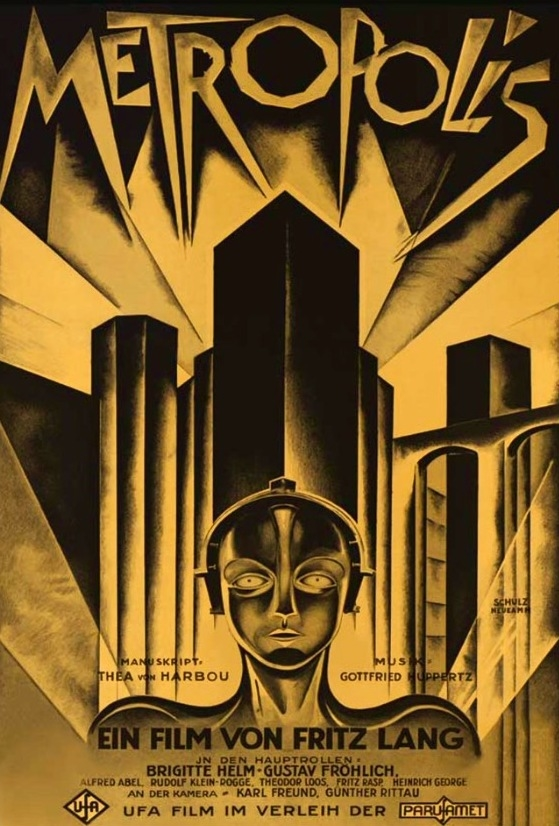
  * “装饰艺术”风格的**字体设计**，既不像现代主义风格的无饰线字体那么简洁明了，又不像“新艺术”运动风格的字体那么婀娜多姿，而是和整个运动的基本风格**相当协调**：粗壮的黑体，平行的装饰线；是一种**带有装饰性的现代字体**
  * 在这方面，法国平面设计师**A·M·卡桑德拉**（原名为Adolphe Jean-Marie Mouron）贡献很大，他为法国的**德拜尼与派诺字体铸造工厂**（the Deberny and Peignot type foundry）设计的**彼夫字体**（Bifur typeface），具有大胆采用当时流行的“装饰艺术”风格和前卫艺术风格的特点，成为当时最流行的风格典范
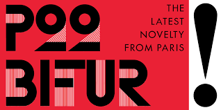
  * “**百老汇**”体（Broadway font）则是由美国字体设计师**莫里斯·富勒·本顿**（Morris Fuller Benton）为当时最著名的美国字体公司**ATF**（American Type Founders的简称）设计的，最初的设计全部为大写字母，两年之后，另一位美国字体设计师**索尔·赫斯**（Sol Hess）将其扩展至小写字母，并开发出带装饰线的百老汇字体来
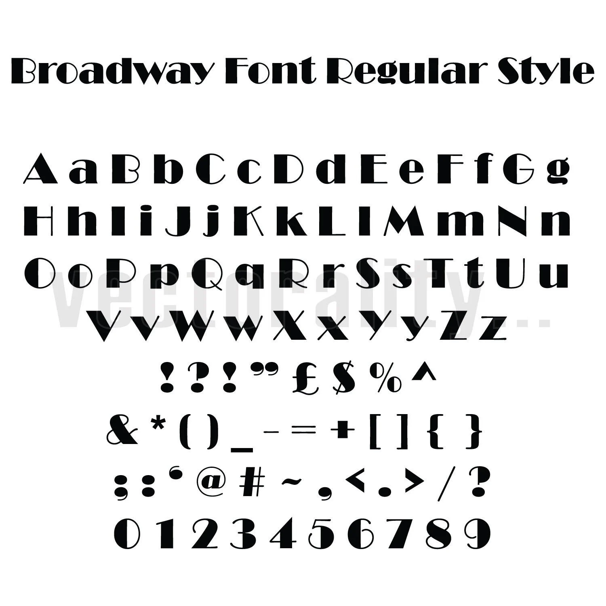
* 在法国，有大量艺术家和设计家从事**商业海报和其他平面设计**，取得了傲人的成绩
  * 他们的广告、海报都具有独特的**形式主义**特点，创作的题材也比较集中于**法国上层阶级的奢华生活**
  * 法国在“装饰艺术”的平面设计方面，实力雄厚，独领风骚，形成了两个重要的中心，即**波尔多**和**巴黎**，并涌现出一批非常优秀的艺术家、设计师
* **A·M·卡桑德拉**于1901年出生于乌克兰的克拉科夫市，父亲是法国人，母亲是出生在乌克兰的俄国人
  * 他的设计图形非常简单，具有**高度象征性**；他对于文字非常有兴趣，总是尽量**把文字和图形融为一体**，他的海报设计是象征性的**立体主义平面风格**的杰出典范
  * 1925年，他为巴黎的一份**报纸**《L‘Intransigeant》设计海报，描绘了一个正在高声呐喊的女性，多条放射状排列的电线通到她的耳孔中，既有强烈的“装饰艺术”风格，又非常形象地强调了报纸的**宣传特性**
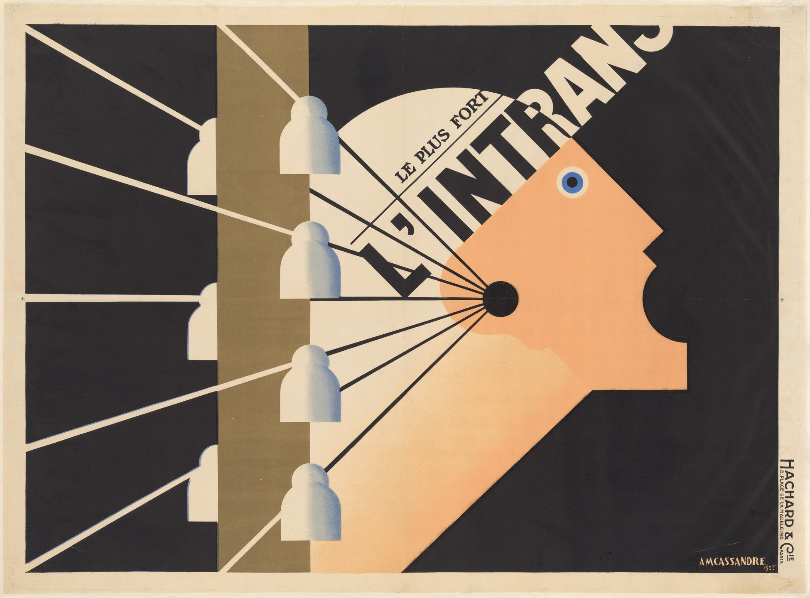
  * 卡桑德拉在1931年为法国横渡大西洋的轮船“**大西洋号**”（L‘Atlantique）设计的海报，夸张地把轮船描绘成一个**巨大的纵向长方形**，视觉效果非常强烈；巨轮前面有一只小小的**拖船**，利用这个强烈的大小对比，凸现了“大西洋号”的**庞大和安定的特征**
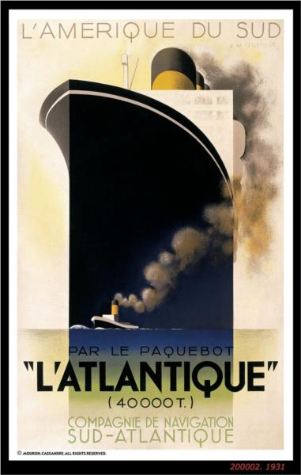
  * 他在1927年为法国铁路公司的**巴黎—布鲁塞尔—阿姆斯特丹路线**设计的海报，完全利用铁路的透视和道岔的交错组成几何的图案，铁路无限延伸，消失点上是一颗星，具有强烈的时代感
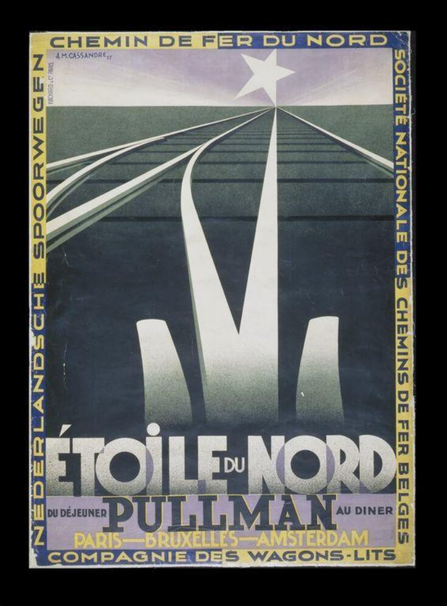
  * 除了海报设计、字体设计之外，卡桑德拉后来还做过一些**企业标志设计**，其中最著名的要算是他为法国时装大师**圣罗兰**（Yves Saint Laurent）设计的标志了
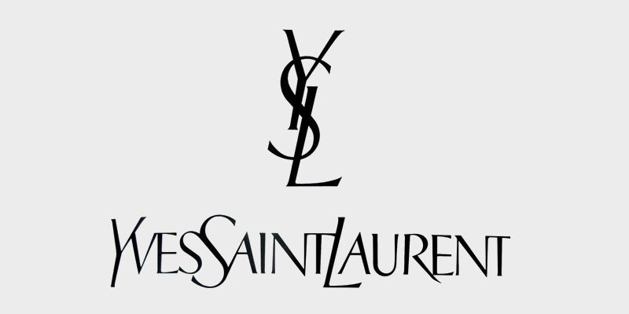
* **查尔斯·盖斯玛**（Charles Gesmar）是20世纪初巴黎最著名的舞台服装和演出海报设计师
  * 他虽然在风华正茂的时候（未满28岁）就不幸因**肺炎**去世，但是他留下的**大量设计作品**成为法国“装饰艺术”运动的重要成果
  * 尤其是他为当时巴黎最走红的演艺女星**斯平涅里**（Spinelli）和**米斯廷奎特**（Mistinguett）设计的海报和服装，影响很大
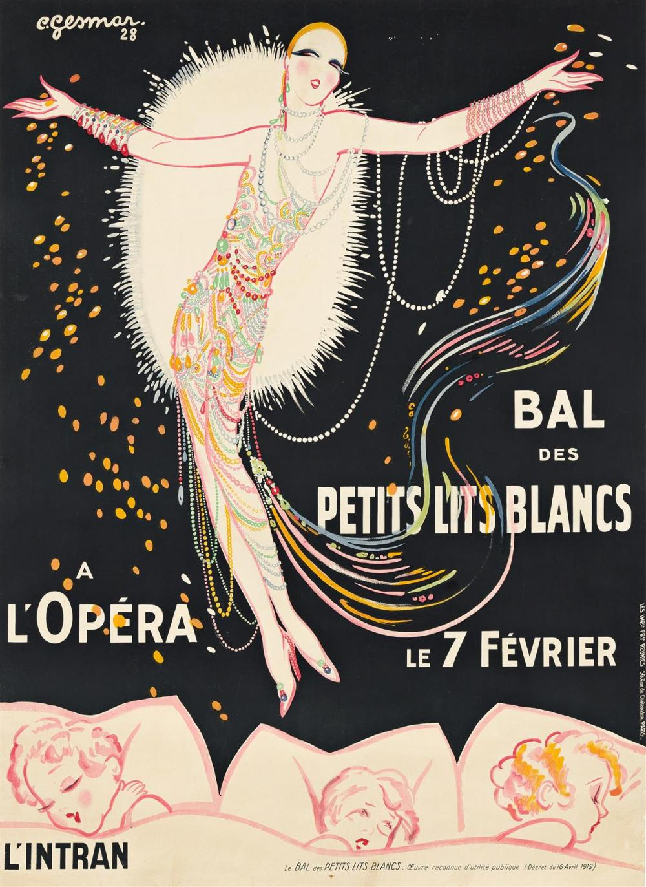
* **让·卡卢**（Jean Carlu）原来是学建筑的，18岁的时候，因车祸失去右手，于是他开始练习左手绘画，并很快掌握了熟练的美术技能
  * 1931年，他为《**名利场**》杂志设计的封面，采用由简洁线条组成的象征性的男女头像，用色彩烘染出霓虹灯的效果，黑色的背景上有摩天大楼的灯光，表现了繁华的、醉生梦死的名利场的特色，很具代表性
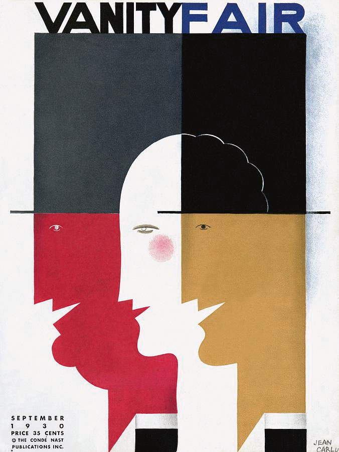
  * 1940年，卡卢到美国为**法国的情报服务部**（the French Information Service）举办“**战争中的法国**”（France at War）展览，这个展览在**纽约的世界博览会**（the New York World Fair）举行，他的设计取得很大成功

* **保罗·科林**（Paul Colin）原来是位业余美术爱好者，第一次世界大战期间，他被征入伍，在前线打仗，在战壕中遇到一个也在当兵的印刷出版家，出版家发现他对于设计很有天赋，因此问他战后愿不愿意到巴黎的**香榭丽舍剧院**（the Theatre des Champs-Elysees in Paris）担任舞台设计和平面设计师；科林一口答应，战后，就立即去剧院上班，开始了他的设计生涯
  * 他的**人物**是**重叠**的，尽量把几个不同的人物或者描绘的题材利用透明重叠方法综合为一体，提高**结构上的整体性**
  * 布局上则采用**倾斜方法**，造成不太平衡和不太对称的安排，增加**动感**
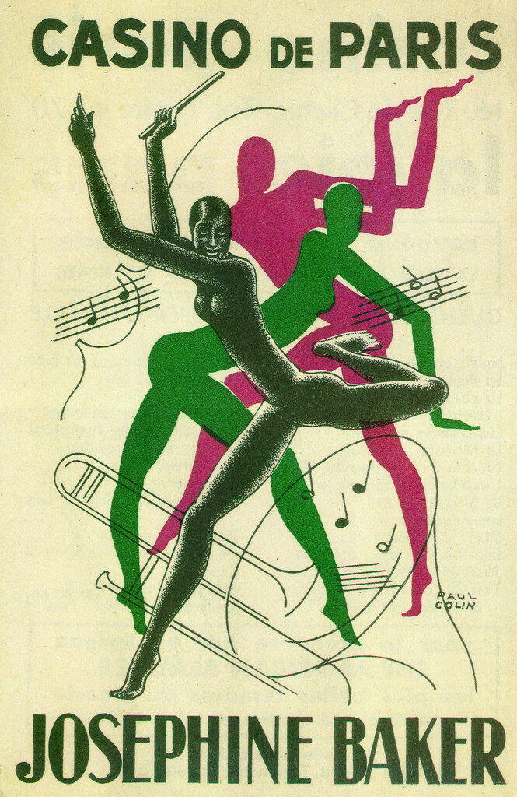
* **罗杰·布洛德斯**（Roger Broders）是一位法国插图家、海报设计师
  * 线条粗壮简练，山川海洋等背景有**清晰的透视关系**，色彩平涂，是布洛德斯的设计特点；他画上的人物总是身形高挑、服饰优雅、充满活力，海报上的字体粗壮有力，一目了然，并常常配有**生动的口号**
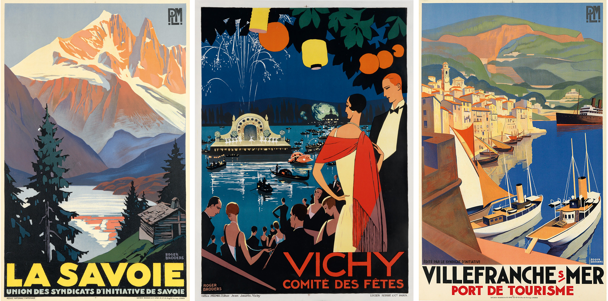
* **罗伯特·法尔库西**（Robert Falcucci），出生在法国中部的**沙托鲁**，很小就开始学习绘画和设计
  * 他最为人称道的海报是为**蒙地卡罗汽车大赛**设计的宣传海报，画面上的汽车并不着意细节的精细准确，而是特别用一簇强劲的细线渲染出高速运行的速度感；再加上用色单纯、对比强烈，令人有身临其境、亲眼看到赛车从面前飞驰而去的感觉

* “装饰艺术”运动平面设计的另一位重要代表人是**爱德华·考佛**（Edward McKnight Kauffer），他以前卫艺术风格的平面设计著称，尤其在海报设计方面非常突出，有“**海报之王**”（King of Poster）的美称
  * 1913年，纽约举办了美国第一次欧洲现代艺术展——“**军火库展览**”（the Armory Show），虽然这个展览引起当时保守的美国舆论界一片大哗，纷纷对欧洲的立体主义艺术和未来主义艺术进行**攻击与指责**，但是，现代主义毕竟从此进入了美国，改变了美国艺术发展的途径
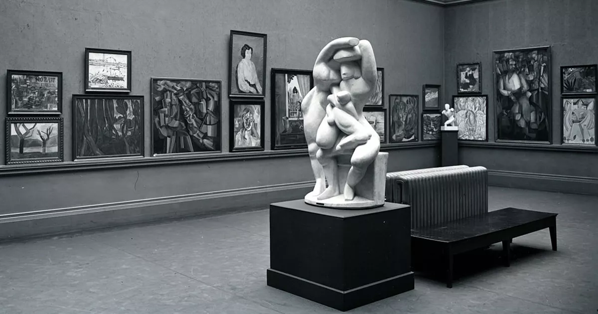
  * 当时正在**芝加哥艺术学院**（The Art Institute）进修美术的考佛第一次看到欧洲最杰出的现代主义艺术作品，受到很大震动，决心到**欧洲**去了解真正的、最新的艺术
  * 考佛的平面设计生涯是从伦敦开始的，1919年他为英国重要的报纸《**每日论坛报**》（the Daily Herald）设计的海报，得到英国设计界的一致好评；这张海报以**黄色的纵向长方形**为底，顶部是一群**立体构成的黑白色的飞鸟**，下面是报纸的名称和标题“**早起的鸟儿**”（Early Birds），构图简洁，主题鲜明，视觉效果强烈，并且具有立体主义影响下发展出来的新平面设计风格
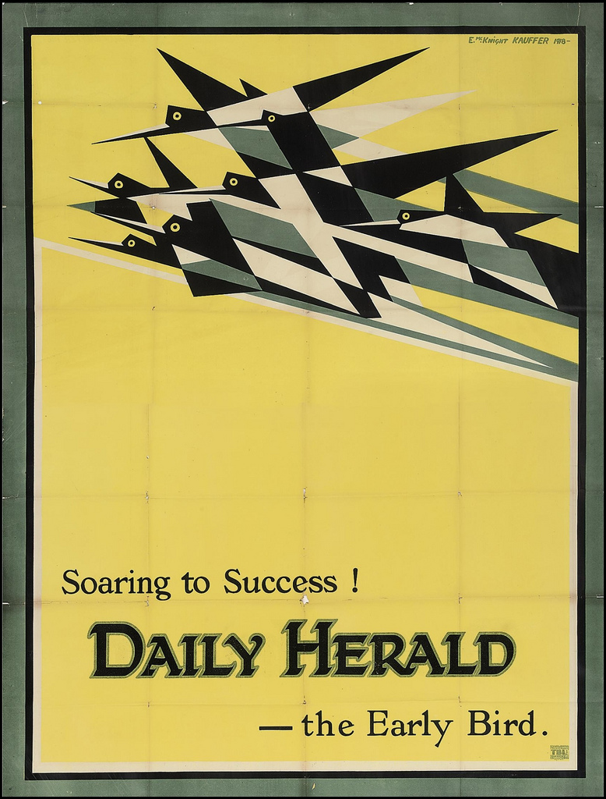
  * 考佛最为人称道的作品包括为**伦敦地铁系统**（the London Undeground Transport）设计的140张大型海报，这些海报具有他**个人的鲜明风格**：色彩鲜艳，图形大量采用几何形式，特别是明显地采用立体主义的形式特征来设计，而反映的内容也具有**现代化的特色**
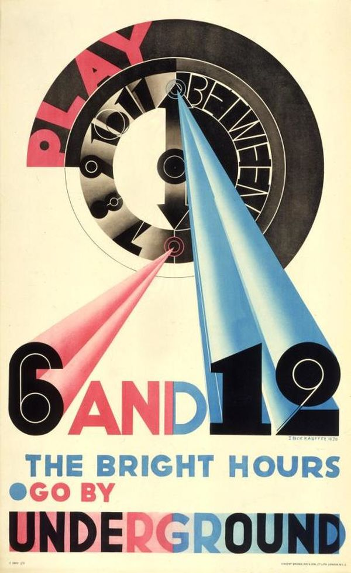
  * 1924年，考佛出版了他的著作《**海报的艺术**》（Art of the Poster），从历史脉络和美学发展的角度，界定了现代海报艺术，是现代平面设计重要的经典读物
* **奥斯丁·库柏**（Austin Cooper）也是英国“图画现代主义”平面设计运动中一位重要的设计师
  * 库柏的海报设计，完全采用**立体主义**的绘画语汇；他习惯把图形主题以立体和象征的方法重叠起来，构图类似早期的立体主义绘画，生动而具有现代感
  * 他设计的**南巴黎周末火车游**海报，把凯旋门、卢浮宫的维纳斯塑像、咖啡和红酒等统统重叠起来，非常像立体主义绘画
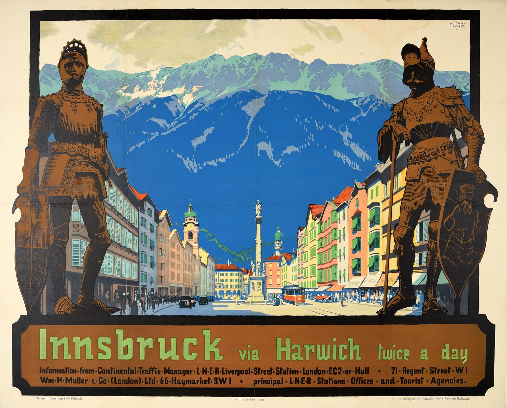
  * 1924年，他为**伦敦地下铁路**设计了一组海报，完全采用小方格的抽象合成，小方格从上到下杂乱安排，好像从上面落下一样
    * 冬季的主打广告，色彩是从深蓝开始，依次从红色到橙色、黄色、白色渐变，最下面是标题：“下面更加暖和”（It is warmer down below），吸引大家在冬天乘用地铁
    * 而夏季的主打广告色彩则正好相反，从黄、红、浅紫，向深蓝过渡，标题改为：“下面更加凉快”（It is cooler down below）
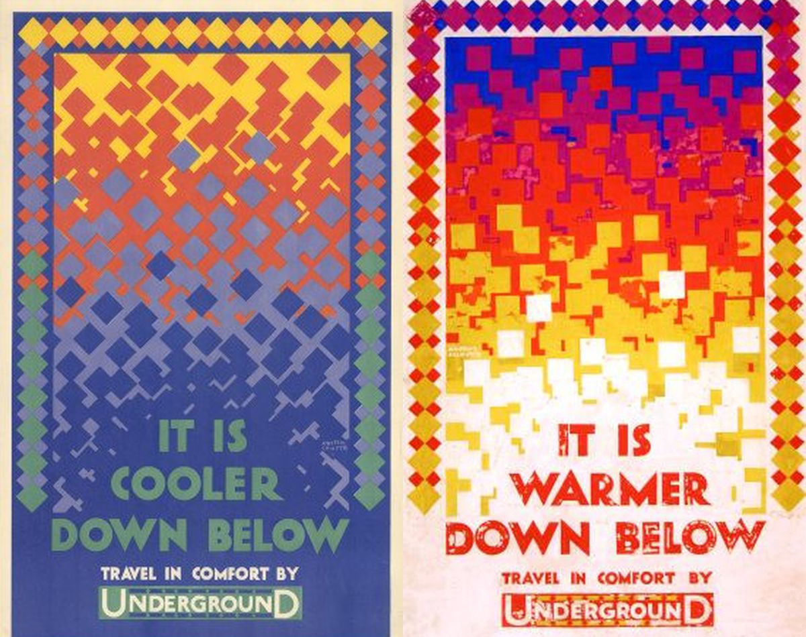
  * **阿伯拉穆·盖姆斯**（Abram Games）是英国“图画现代主义”平面设计运动的最后一位代表人物
    * 他在战争期间设计的作品都具有**视觉传达高度准确**的特点，比如他设计的宣传**为士兵献血**的海报，描绘了一个大手掌的轮廓，手中托着一个巨大的献血玻璃瓶，内里有一位冲锋陷阵的士兵，三个图形重叠，非常形象，标题也清晰：“如果他倒下了，只有你的血能够救他！”
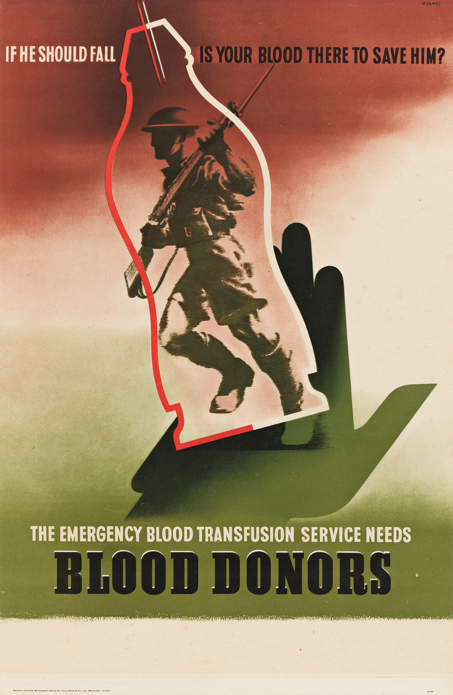
  * “图画现代主义”平面设计运动在**欧洲其他国家**也有所发展，并涌现出一些优秀的设计师，其中一位是奥地利的**约瑟夫·宾德**（Joseph Binder）
    * 他为**1924年维也纳音乐和戏剧节**（Musikund Theaterfest，Der StardWien）设计的海报是其代表作之一：上面有两个吹号的艺人，完全用立体主义的方法分解组合成为三角形，简单明快，且主题清晰
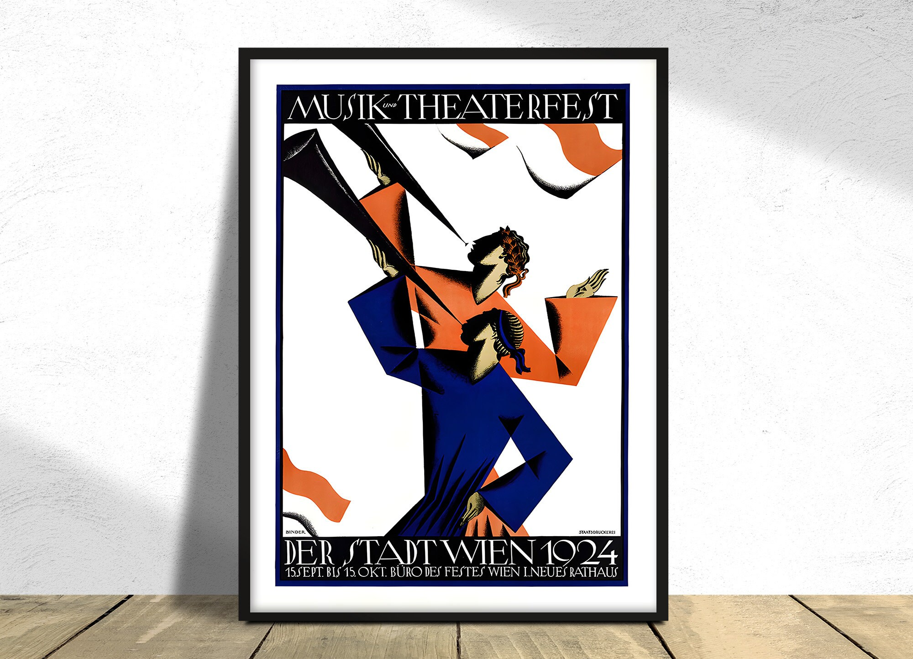
    * 1935年宾德移民到**美国**，在纽约开设自己的**设计事务所**；他为纽约国际博览会设计的海报广受好评，从此开始了在美国的设计生涯
    * 由于他开始使用**喷笔**完稿，因此很多以前利用画笔处理的细节必须适应新的工具而改变；他逐步放弃写实技巧，采用**简练和象征的图形**来设计海报
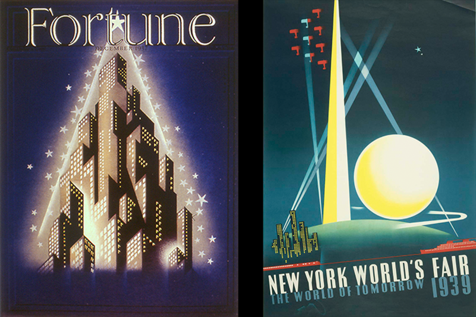
    * 第二次世界大战期间为**国防部**设计海报，鼓舞士气，这个时期设计的一系列征兵海报，是他最杰出的一部分作品；战后为**联合国、美国红十字会**设计各种海报，风格日益简明、强烈
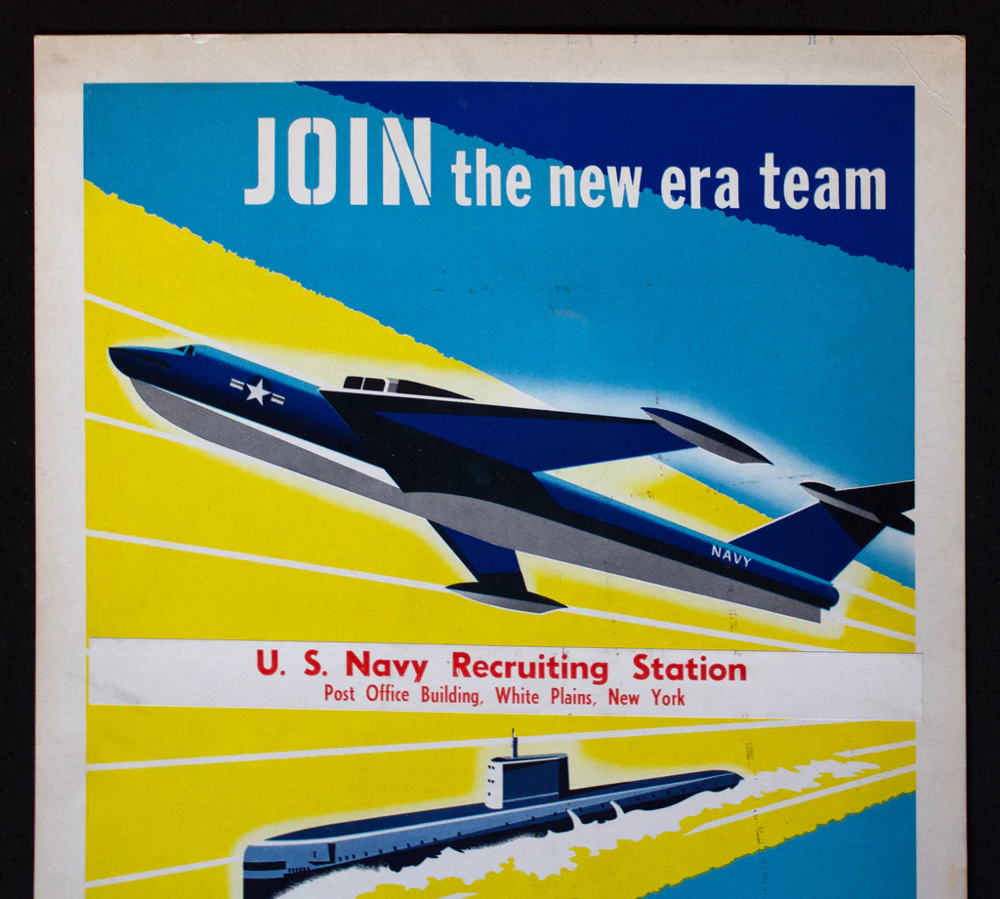
  * **美国**的“装饰艺术”平面设计，受**欧洲**的影响很深；尤其是1920—1930年代，不少欧洲的设计师移民美国，或者与美国的出版公司建立合作关系
    * **艾蒂**（Ert）出生在圣彼得堡，是一位海军将领的儿子。他在巴黎学习美术和设计，很快成为以“装饰艺术”风格为主的插图画家和平面设计家