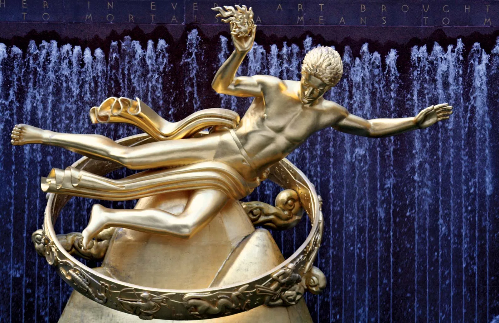

# “装饰艺术”运动
## “装饰艺术”运动的概况
* 进入1920年代，西方社会从**第一次世界大战**的硝烟中重新站立起来，整个社会的气氛是**乐观**的
  * 机械化时代里，日新月异、价格实惠的**家用器具**大批量地生产出来，**新的技术**大大提高了民众的生活质量
  * 欧洲各国经济**普遍繁荣**，美国经济更是**高速发展**，形成了**新的市场**，为新的设计和艺术风格提供了**生存和发展的机会**
  * 正是在这样的历史条件下，产生了20世纪初期一场重要的设计运动——“**装饰艺术**”运动（Art Deco）
* 当时，欧美一批艺术家和设计师已经敏锐地认识到**新时代的必然性**，他们不再回避**机械形式**，也不拒绝**新的材料**（比如钢铁、玻璃等）
  * 摆在设计师面前的任务是寻求一种与过去时代不同的设计和装饰语汇，以适应新的时代和新的生活方式的要求
* “装饰艺术”兴起于**1920年代**，退潮于**1930年代的大萧条**，是20世纪里延续时间比较长的一次设计运动
  * 其名称出自1925年在巴黎举办的“**国际现代装饰和工业艺术展**”（the Exposition Internationale des Arts Décoratifs et Industriels Modernes），该展览旨在展示“新艺术”运动之后的新建筑与新装饰风格
  * 但是，“装饰艺术”这一术语，其内容**并不仅是一种单纯的设计风格**；和“新艺术”运动一样，它包括的范围相当广泛
  * “装饰艺术”运动，影响了**几乎所有的设计领域**：包括纯艺术、装饰艺术、时装、电影、摄影、平面设计、交通工具和工业产品的设计等等，成为一种几乎无处不在的现代风格
  * 在欧洲，“装饰艺术”运动的发展，主要集中在**奢华消费产品**的设计与**艺术品**的创作上；而当这种风格传入美国后，却很快延伸到建筑设计、室内设计、火车站、电影院等规模更加宏大的**公众性质的项目**上，以及许多**大众日常用品**的设计中
* “装饰艺术”运动是一场**国际性设计运动**，不少欧美国家都参与其中，尤以法国、英国和美国的设计运动较具代表性
  * 它甚至还影响到**欧美以外的一些国家**，在拉丁美洲、澳大利亚、中国的上海都有过相当大的影响，出现了一批非常精彩的这种风格的建筑物
* “装饰艺术”运动是一场**承上启下的运动**，它既对“工艺美术”运动、“新艺术”运动的自然装饰、中世纪复古表示反对，也对单调的工业化风格加以批评
  * 它是**新艺术运动**和**现代主义运动**之间的一个**衔接**，双方的特征都兼而有之，但却不是简单的重复或再现
  * “装饰艺术”运动将传统设计的精华，用来赞颂全新的机械化的摩登时代；“装饰艺术”运动的设计师们，并不执着于某种纯粹而同一的风格，而是善于从不同的文化源头不拘一格地**兼收并蓄**
* 这场运动的装饰特点，在时装、首饰、化妆用品、高级酒具等方面，一直**得以保持**
  * 而在1980年代，当现代主义的**单调、枯燥**受到批评的时候，“装饰艺术”的装饰特点则**重新焕发出活力**，在**后现代主义风格**中再次受到重视
## 影响“装饰艺术”运动风格的重要因素
### 古代埃及装饰风格的影响
* 1922年，英国考古学家、探险家**霍华德·卡特**（Howard Carter）发现了一个从未为人所知的古代帝王墓——**图坦卡蒙陵墓**（Tutankhamun）

  * 从墓葬出土的战车、家具、木乃伊棺木，尤其是金首饰和那副无与伦比的法老的金面具，采用简单明快的从自然抽象出来的**几何图形**，并加以变形，使用金属色系和黑白色彩系列，达到**高度装饰的效果**，给了设计师们强而有力的启示
  * 埃及元素在**时装界**尤为流行，有时甚至泛滥到匪夷所思的地步；1920年代兴起的“**木乃伊装**”（Mummy Wrap）的设计灵感，就来自古代木乃伊身上层层叠叠的包裹布

[古埃及.md](../../History/国别史/北非/古埃及.md)
### 原始艺术和异域风格的影响
* 20世纪初以来，**原始艺术**的影响，特别是来自**非洲和南美洲**的原始部落艺术对于欧洲前卫艺术界的影响是非常大的
  * **毕加索**（Pablo Picasso）的《**亚维农的少女**》就受到非洲原始艺术的影响；挪威艺术家**爱德华·蒙克**（Edvard Munch）则在很大程度受到南美洲的原始部落文化影响

* 世界各地不同的地方艺术、**民间工艺**，也是“装饰艺术”运动的一个重要源泉，异域的艺术品、家具、用具、服装、纺织品和民间工艺品中所呈现的生机勃勃、野性十足的**原创动机**，经过简化、风格化（很多时候是几何化），为现代化装饰提供了**丰富的语汇**
  * “装饰艺术”设计师们从**中南美洲古代印第安文化**（如玛雅文化、阿兹台克文化和印加文化）中汲取养分，创造出新的建筑和装饰造型来
  * 纽约和美国其他大城市那些高耸的“装饰艺术”风格**摩天大楼**，顶层多采用**阶梯式尖顶**的形式，正是借用了中南美洲**古代通灵塔**的建筑元素

* **中国元素和日本元素**亦是“装饰艺术”风格中重要的成分，“装饰艺术”时期的许多作品都采用了东亚地区传统的设计材料和制作技术
  * “装饰艺术”的设计师们大量借鉴了**中国古代铜器**和**早期中国瓷器**优雅的器型、精致的花纹，以及**中式硬木家具**简洁洗练的线条

* **非洲**纺织品、盾牌和民间雕塑上那些粗壮的、抽象的、几何化的之字形图案，那些圆圈和三角形的组合成为“装饰艺术”设计作品上最常见的**装饰纹样**
  * 很多艺术家和设计师还直接运用从非洲传统的面具和雕塑中发掘到的**非洲黑人形象**作为设计的动机
  * 美国最早获得全国性声誉的黑人艺术家**萨金特·约翰逊**（Sargent Johnson）以非洲艺术作为自己创作的源泉，在设计作品中强烈地表达了现代都市黑人的文化和活力

### 前卫艺术的影响
* 20世纪早期的**前卫艺术**，以其全新的视觉语言、丰富的色彩和大胆的意象，对“装饰艺术”运动造成深刻的影响
  * 野兽派、立体主义、未来主义、“分离派”、至上主义、构成主义都被转化到“装饰艺术”之中；“装饰艺术”运动的设计师们采用这种几何化的、抽象的、割裂的**艺术语汇**，为现代都市生活和文化注入了生气
  * 同时，不少**前卫艺术家**也自己动手将他们的艺术理念应用到设计中去

### 古典艺术的影响
* 第一次世界大战结束后，人们都在寻求抒情、欢乐的主题，不少艺术家、设计师便将他们的目光转向了**古希腊、古罗马**，飞行的欧罗巴、雅典娜等形象变得十分流行，纺织品、墙纸、玻璃器皿、装饰陶瓷罐上出现了许多希腊神话和罗马神话中的形象，诸如女猎手、舞蹈的花神等等
* 在众多“装饰艺术”风格的艺术家、设计师中，瑞典雕塑家**卡尔·米勒斯**（Carl Millers）和美国雕塑家**保罗·曼施普**（Paul Manship）非常出色地将古典风格的裸体形象，制作成现代的公共雕塑或装饰性建筑浮雕，他们的设计深受公众欢迎

### “新艺术”运动的影响
* 对于“新艺术”运动过**于复杂的曲线、缠枝纹样**以及**过于崇尚手工技艺**的倾向，“装饰艺术”运动的设计师们是持**批评态度**的，然而这并不影响他们也从“新艺术”运动的设计中**吸收精华**
* 而许多“新艺术”运动的老将，如毛利斯·迪佛雷纳、保罗·佛洛特等人，也已经认识到需要将传统的设计**现代化**，并且要应用到**机械产品**的设计中去
### 舞台艺术的影响
* 20世纪初期，**舞蹈**，特别是**芭蕾舞**开始出现了与传统决裂的**重大改革**；这种改革，在芭蕾舞重要中心之一的**俄国**已经有所发展
  * 改革的内容体现在音乐、舞蹈编导、舞台设计、服装设计等各个方面，由著名芭蕾舞编导**谢尔盖·迪亚吉列夫**（Sergei Pavlovich Diaghilev）带领的“**俄国芭蕾舞团**”（The Ballets Russes）出国演出，也就把这种改革的影响带到欧洲，对于“装饰艺术”运动产生了非常强烈的影响

  * 在舞台表演中，美国出生的法国歌舞演员**约瑟芬·贝克**（Josephine Baker）成为异域世界里原始风情的代表人物

  * 另外一种造成影响的舞台艺术风格是美国的**爵士乐**；1920年代和1930年代是美国黑人爵士音乐发展的高峰期，这种强烈的、节奏鲜明而特殊的美国民间音乐和它的表演方式，对于设计家来说是极为新鲜和富于感染力的
### 汽车设计的影响
* 1898年前后，**汽车**被发明出来，很快成为重要的交通工具；20世纪初期，汽车被不少前卫人士视为**未来的象征**，速度感即是时代感
  * 特别是第一次世界大战后，**对于汽车的热爱**在设计师当中非常流行，启发了“装饰艺术”运动的设计师们大胆地采用**现代工业文明的成果**，作为自己的设计构思，在形式上和思想上都具有相当重要的启迪作用
  * 而“装饰艺术”运动在发展的高潮时期与汽车设计中第一个流行风格——**“流线型”运动**（Streamlining）互相影响，在许多设计中，特别是美国的建筑设计、产品设计中出现了两者兼有的特征，形成**流线型现代风格**（Streamline Moderne）
  * 因此，有时候很难分清一栋1920年代到1930年代的美国高层建筑中哪部分属于“装饰艺术”运动，哪部分属于“流线型”风格，美国纽约的**克莱斯勒大厦**的设计就是一个典型的例子

### 大型国际展览的影响
* 在为了推动“装饰艺术”运动的发展而举办的多个展览中，最重要的当数1925年**巴黎**举行的**国际展览会**
  * 该展览的正式名称是“**国际现代装饰和工业艺术展**”（the Exposition Internationaledes Arts Décoratifset Industriels Modernes），专门展览“**现代装饰艺术**”作品

  * 这个展览吸引了欧洲几乎所有国家以及一些欧洲以外国家的几千名设计师参展，有超过1600万观众前来参观，成为“装饰艺术”运动发展的**第一个高潮**
  * 为了让法国品位和法国的奢华产品统领世界装饰艺术界，**法国展品**雄心勃勃地占据了展览的大部分展台，**巴黎**更借此机会展示了世界上最时髦城市的风貌；巨大的**雪铁龙汽车标牌**悬挂在高耸的**埃菲尔铁塔**上，将这个19世纪的建筑工程奇迹变成20世纪消费主义的巨大广告牌，展示了“装饰艺术”运动毫不掩饰的**商业化倾向**

* 1925年的巴黎展览中，最令人瞩目的展馆大约要数**珍藏家酒店**［The Hôteld‘un Collectionneur，亦称**鲁赫曼展馆**（Ruhlmann Pavilion）］了

  * 展馆的建筑由法国著名的建筑师**皮埃尔·巴陶特**（Pierre Patout）设计，以一个名为“**大沙龙**”（Grand Salon）的巨大椭圆形展厅作为展馆的视觉焦点；室内设计、家具设计，以及展示设计，则由当时法国顶尖的家具设计师**埃米尔·雅可布·鲁赫曼**领衔的一批著名的艺术家和设计师来完成

  * 他们用新的技术和材料，将法国的传统设计加以**现代化**，“大沙龙”华丽奢侈的装饰、丰富的色彩、优雅的格局，被评论家们称为法国装饰艺术**最重大的成果**，并成为“装饰艺术”运动的标志之一
* 这次展览中，**优雅大厅**（Pavilion Del‘ Elégance）是集中展示法国时装的中心，此外各个大百货公司，以及**保罗·布尔列特**（Paul Poiret）、**索尼娅·德劳内**等法国时装界的重量级人物也都纷纷开设独立的展台，充分展示了法国时装的雄心和实力

* 这次展览明文规定了参展作品必须是表现**现代精神**的，展品的大部分也的确具有**新时代的创新意味**
  * 众多欧洲国家都参加了这次巴黎国际展览，但德国和美国却引人注目地缺席了：**德国**在第一次世界大战中，是主要的侵略者，也是法国在装饰艺术和设计方面最强劲的竞争对手，因此，派送给德国的邀请函“到得太迟”，以至于德国来不及筹备送展
  * **美国**则是另外一个故事：美国商务部对该展览提出的“参展作品必须是现代设计”这一要求的回应居然是“美国没有现代设计”（“there was no modern design in America”）
  * 不过，美国虽然没有参展，**美国艺术家和设计师**们却是非常积极地前来巴黎参观展览，这次展览对于美国现代设计的兴起和发展起到重大的推动作用
## “装饰艺术”运动的设计特点