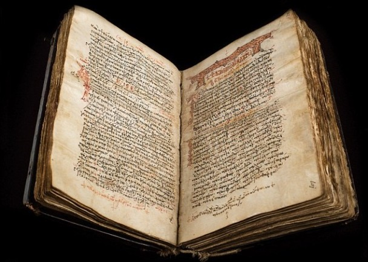

[TOC]
# 工业革命前欧洲的设计情况
## 工业革命前的欧洲陶瓷业
* 陶瓷起源于**中国**，东汉已有早期的**绿釉瓷**，唐代吸收了西方、波斯的一些材料和设计动机，极为生动，“**唐三彩**”是当时很流行的一种釉陶明器，宋代中国陶瓷达到第一个高潮，涌现了汝窑、官窑、哥窑、钧窑、定窑**五个窑口**，习惯称“汝官哥钧定”，元代的**青花瓷**因为国际化商业而发达，明清两代更是绚丽多彩

* 欧洲的陶瓷发展得比较**晚**，很长一段时期内，欧洲人没有掌握瓷器制作技术，只能**从中国大量进口**；16世纪**葡萄牙人**首先从中国带回**高岭土**（瓷土）试做瓷器，起初并不成功

* 1680年代，德国萨克森州的**辛豪斯**尝试提高熔炼温度，用可熔性石料与黏土混合来烧制瓷器，炼金术士**博特格**协助他；经过大量的实验，终于在1708年获得成功：用1350摄氏度的高温烧制成欧洲第一只真正的**无釉瓷杯**，辛豪斯在这一年去世，留下的工作由博特格继续完成
* 因为奇货可居，萨克森州陶瓷的制作技术一直高度保密；直到1712年，法国耶稣会神父**殷弘绪**在欧洲**公开发表**了中国瓷器的制造技术，随后，陶瓷技术很快传播到欧洲的各个君主国，18世纪中，大部分欧洲国家皇室都建立了自己的**陶瓷厂**
### 欧洲皇室对于设计的影响
* 在**工业革命之前**，设计优良的手工产品主要是供西方的**权贵**使用和鉴赏的；而民间大量日常用品往往比较**粗糙**缺乏设计
* 在欧洲皇权时代，皇室和贵族的用品不但是**定做**的，并且是在**皇家控制的工厂**里生产的，这个情况和中国皇帝长期以来仅使用“官窑”瓷器一样；在欧洲，皇家还**直接管理**生产、设计过程，**法国**的情况最为典型
* 大量奢侈品都在这些**皇家工厂**中生产，直接送到**皇宫**使用，皇室、贵族阶层形成一个**单一的产品消费群**，英语叫作“royal patrons”
* 法国最奢侈的皇帝是**路易十四**（Louis XIV,1638—1715），他在位期间，大量定制各种皇家用品；1662年在巴黎南部的戈别林大道42号设立了**皇家制造局**（The Manufacture des Gobelins），雇用250位匠人，主要生产**挂毯**和**室内软饰用品**
* 凡尔赛宫里的一套14块**大挂毯**，就是由他的宫廷画家**查尔斯·勒·布隆**（Charles Le Brun）设计，在戈别林工场加工完成的；挂毯描绘了路易十四视察戈别林工场的情景

* **家具工匠**当时叫作“cabinet-maker”，就是“柜子匠”的意思，可知他们当时的工作主要是制作**精美的柜子**
* 法国还有**皇家镜子和玻璃工厂**（The Manufacture royale de glaces de miroirs），为了给正在兴建的**凡尔赛宫**提供镜子和玻璃等装饰材料而成立于1665年，在其后的125年内，专为法国皇室建造宫殿而设计、制造镜子、玻璃，而且垄断着这方面的技术；这家工厂目前仍在，更名为**圣—戈班工厂**（Saint-Gobain）
* 欧洲皇室当时多有这类自己的专属工场，丹麦的**皇家哥本哈根陶瓷厂**（Royal Copenhagen）是1775年由朱莉安·玛丽皇后（Queen Juliane Marie）下令成立的；当时因为受到从中国进口的**青花瓷**的刺激，欧洲各个皇家瓷厂大都烧造青花瓷，皇家哥本哈根瓷厂却不然，发展出自己的**镀金白瓷**来，成为皇家哥本哈根陶瓷厂的特产

* 1779年，丹麦皇帝克里斯提安七世下令由皇室完全承担这个瓷厂的费用，不考虑市场，全力投入研制一流的皇家陶瓷，从而促成著名的**丹麦卷草青花瓷餐具**系列（Flora Danica 'Blue Fluted' dinner service）的成功，这个系列的餐具迄今依然是这个工厂的重要产品

* 英国的体制有所不同，不是由皇室建立专属工厂，而是皇家向**私营工厂**定点采购皇室专用的产品，这些工厂除了生产专供皇室使用的产品之外，也生产其他供应市场的产品；从1908年**爱德华七世**开始，各厂为皇家定制的产品正式印上“皇家”（Royal）字样
* 英国的**韦其伍德陶瓷公司**（Wedgwood & Sons）由**约西亚·韦其伍德**（Josiah Wedgwood）在1759年成立，约西亚成功生产出一种白色和蓝白色的瓷器，称为“**珍珠器**”（pearl ware），式样是当时流行的**新古典主义**风格；英国**夏洛蒂王后**因为喜欢这种瓷器，特许韦其伍德冠以“王后御用陶瓷”（Queen's Ware），韦其伍德陶瓷因具有皇家御用地位，热销整个西方

* 韦其伍德不断探索新类型的陶瓷系列，1760年代后期，他用特殊的工艺生产出了一种细腻无釉的**黑色炻器**（black basalt ware），1775年，韦其伍德又推出了**碧玉细炻器**（Jasper ware）；后来，韦其伍德为了仿制中国瓷器，无意间在瓷土中加入了一定比例的动物骨粉，使瓷器色泽纯白，有一种半透明效果，就是**骨瓷**（bone ware），手感润柔轻盈

### 法国的御用工艺家
* 在工业化之前，欧洲皇室都有负责设计的**御用艺术家**，他们主管风格、设计细节，负责和厂商联系，保证供应皇室使用；因此，这些御用艺术家在十七八世纪欧洲的设计中影响力很大
* 在巴洛克风格、洛可可风格全盛期影响法国设计的皇家御用艺术家有两位，一位是**查尔斯·勒·布隆**，另外一位是**弗朗索瓦·布歇**（François Boucher）
* 布隆本人是画家、理论家，深受法国皇帝路易十四的宠爱，对17世纪法国皇室风格影响最大；他曾被送到罗马深造4年，跟随法国最主要的古典风格大师**尼古拉斯·普桑**（Nicolas Poussin）研究古典设计和艺术；回到巴黎后，勒·布隆被任命为**戈别林工厂**的负责人，巨细无遗地管理皇家用品的设计和生产
* **布歇**是**洛可可风格**最重要的画家，画风柔弱、唯美，情色味道很重，极受当时皇室欢迎；布歇于1755年被任命为皇家戈别林工厂的艺术指导，1765年被任命为皇帝的**首席画师**（Premier Peintre du Roi），他设计挂毯，也指导设计其他装饰品，由此而对法国设计产生影响

## 工业革命前的欧洲家具业
* 工业革命前法国的家具行业以**巴黎**为中心，主要生产各种奢华家具，为皇室、贵族、刚刚出现的**上层资产阶级**（upper bourgeoisie）提供服务；至于外省的家具行业，主要分布在各个省份的**省府城市**，则以生产供**一般市民**使用的家具为主，具有更加强烈的地方色彩、传统特点
* 巴黎家具设计除了明确以皇室、贵族、权贵为服务对象之外，在风格上则显示出大都会**兼收并蓄**的特点，不但有西欧国家皇室家具的特色，也能够看到来自西班牙、瑞典、俄罗斯这样较偏远地方的设计影响
* 皇室家具是巴黎家具业的龙头，源起**路易十四**时期，皇家家具厂的建构基本都模仿皇家戈别林工厂，直接承接皇室的订货；大套的多用在**卢浮宫**，而件数少一点、尺寸略微小一点的套件，则用在路易十五时期兴建的**凡尔赛宫**内

* 1660—1815年之间，是法国**波旁王朝**的全盛期，也是法国家具的**鼎盛时期**，其中奢华家具，具有强烈新古典风格、巴洛克和洛可可风格的家具最为突出；18世纪中期是**路易十五**的时代，这个时期的椅子非常有特色，线条流畅，用髹漆和丝绸装饰，再镶上青铜配件，金碧辉煌

* 正因为巴黎家具和皇朝有关，所以很多家具的风格就**冠以皇朝、皇族的名称**
* 巴黎家具之所以能享有如此崇高的声誉，还在于巴黎有延绵不断的**手工艺传统**，产业**高度发达**；家具贸易形成很大的行业，按照功能细分为床、座椅、桌子、柜子等不同门类，按照**手工艺行会**划分，有严格的行规保护免受**侵权**（infringements），各行业只能做范围的工作，不允许**越界**
* 除了巴黎之外，法国的**各个行省**也有自己的家具行业，并且各有特点，比较大的中心包括了罗瓦河谷（the Loire valley）地区的**布拉瓦**（Blois）和**奥尔良**（Orléans），还有上面提到过的**里昂**、**列日**；这些行省的家具设计和生产，具有当地民风特色，但是从流行、奢华水平来看，比巴黎要落后几十年
* 有些特色是只有在行省家具中才能看到的，比如桌子常用弯曲的“**虎腿**”（cabriole legs）做桌子脚的造型，茶几或小桌面有时用简单的**海蚌形**（scalloped carving），餐椅有**麦穗纹样浮雕**反映农村生活

* 法国家具是工业革命前欧洲其他国家家具行业的一个**缩影**，其他国家的情况**大致雷同**，只是行业规模、规范水平均**不及法国**而已
## 工业革命前的欧洲平面设计
### 印刷术在欧洲的发明
* 印刷术最早是**中国人**发明的，欧洲人直到15世纪为止都没有掌握这种技术；不过中国的印刷大多是采用整块木版刻上文字和插图，然后进行印刷，其实是**固定凸版**，西方称这种方法为“xylography”

* 而真正带动现代批量出版的是**活字版**，称为“typography”，欧洲印刷的真正起点是与金属活字的发明分不开的

* 中世纪后日益增多的大学设立、人数日益庞大的中产阶级的产生，都市化的进程，宗教的普及化和市民化，都需要大量书籍来传播知识，而**手抄本**成本高昂、耗时费工，当时一本200页的手抄本需要4～5个月才能完成；这种状况，造成出版书籍数量**稀少**，1424年，英国的剑桥大学图书馆藏书仅有手抄本120册

* 根据史料的记载，首先把活字技术发展完善，使之成为现代印刷的主要方法的是德国人，来自曼兹地区的**约翰·古腾堡**（Johann Genfleischzug Gutenberg）；大约在1439—1440年期间，古腾堡已经开始研试、发明印刷技术了，他用铅来铸造**字模**，用金属字模进行印刷
* 古腾堡终于在1454年，印刷出了第一本完整的书——那是一本页数不多的《圣经》片段，题为《**三十一行书信集**》；从该书中可以看出古腾堡的活字字体，具有几种**不同尺寸**，已有**大写和小写的区别**，排列也已经**比较工整**，是西方最早的活字印刷品
* 在1450—1455年这段时间，他集中探索印刷完整书籍的技术，终于获得成功：完全运用金属活字印刷出一部完整的《圣经》，被称作《**古腾堡圣经**》（Gutenberg Bible），尺寸**很大**：30厘米×40.5厘米；书中文字分两栏编排，并且将插图和文字分开编排到不同的页面上，而不像过去的手抄本书籍那样混在一起，使阅读更为方便

* 古腾堡的最大贡献在于发明和运用**金属活字**，由于欧洲文字全部是**拼音字母**，因此，活字的种类无须太多，与中国繁多的汉字相比，欧洲印刷术的改革就比中国容易得多；在造纸和印刷技术方面，欧洲虽然比中国**晚了上千年**，但是一经掌握，其发展的速度、技术的完善、应用的普遍则**大大超越**了中国的水平
### 出版业在欧洲的发展
* 古腾堡发明的印刷技术，不但促进了德国出版业的发展，对于整个欧洲的出版业也有极大的推动；当时大量出版的**自然科学书籍**，就越来越普遍地利用插图描绘动物、植物的形状和特征，很受欢迎
* 文艺复兴艺术的一个**巨大贡献**，就是绘画上**透视技术**的发明和广泛运用；透视的运用，产生了非常逼真的绘画效果，运用在书籍插图上，则大大地扩展了读者的视野和想象空间
* 欧洲各国这个时期的各种出版物都广泛地采用**木刻插图**，德国画家**阿尔布雷特·丢勒**（Albrecht Durer）为“**启示录**”（Apocalypse）绘制的16幅木刻组画，于1498年印刷出版，欧洲的平面设计发展到一个新的高度

* 德国自从**马丁·路德**的**宗教改革**以来，**出版业**进入高速发展阶段，**纽伦堡**成为德国当时出版业最重要的中心，其他城市的出版业也有很大的发展，涌现了一批杰出的书籍设计家、插图艺术家、版面设计家；他们的书籍设计也各具特色，特别是在版面编排方面，日益趋于**功能化**，但又同时保持了**高水平的艺术处理特点**，是世界平面设计史中一个重要的阶段
* 欧洲的印刷业首先在几个大城市中发展起来，其中包括法国的**巴黎**、德国的**纽伦堡**和意大利的**威尼斯**；到16世纪上半期，新的中心出现了，瑞士逐渐成为欧洲出版业重镇之一，其中比较突出的是**巴塞尔**（Basel），这座城市在1501年成为瑞士的一部分，印刷业发展非常快，成为该市的主要产业
* 而在巴塞尔南面300公里的法国城市**里昂**，也同样成为印刷业的新中心；这两城市的印刷业者交流频繁，**互相促进**，是设计史上很少见的情况
* 里昂的出版业也相当繁盛，有40多家印刷工厂，出版大量**言情小说**，以适应市民的需求；这些书籍的字体则都是**哥特体**，与巴塞尔流行使用的**罗马体**不同

### 报纸业的出现和兴盛
* 1605年，在当时仍属**神圣罗马帝国**（Holy Roman Empire）的**斯特拉斯堡**（Straßburg，今在德国境内）用德文发行了世界上**第一份报纸**，德文全名为《Relation allerFernemmenü und gedenkwürdigen Historien》（意为：所有突出的或值得记忆的新闻之集合），被后人简称为《**Relation**》（按字面意思姑且译为《**关系报**》）
* 第一份真正的**德国**报纸名为《**阿维莎**》（Avisa），1609年在德国城市沃芬巴特尔出版；1618年，**荷兰**的第一份报纸《**来自意大利、德国等地的科兰特**》在阿姆斯特丹每周出版一次，这份报纸影响较大，后来很多国家的报纸都用了“科兰特”一词代表“报纸发行”的意思
* 1645年，首份**瑞典**文的报纸《**邮政公报**》在斯德哥尔摩发行，并一直**发行至今**，是世界上目前仍在发行的报纸里面最年长的“寿星公”；1665年，《**牛津宪报**》（后改名为《伦敦宪报》）在**伦敦**出版，有明显的报纸名称、有清晰的日期，每周印行两次

* 随着美洲的发现，北美成为英国的殖民地，印刷技术也随之被一位英国人**斯蒂芬·戴伊**带到美洲；1690年，移居北美的英国出版商**本加明·哈里斯**编辑发行了北美首份多页报纸《**外国和本地的公共消息**》，报纸以**本地消息**为主，前三页是**印刷的文章**，第四页**留空**，让读者可以将自己知道的新闻用笔写上去；这被视为北美第一张报纸；不过，因为报纸有些内容冒犯了英皇，所以只出版了一期便被殖民地官员封掉了
* 直到1704年，北美才出现了第一份真正定期发行的报纸《**波士顿新闻报**》；北美早期的报纸业在**新英格兰地区**，特别是波士顿发展迅速

* 1692年，法国国王**路易十四**不满当时法国的印刷水平，下令成立一个皇家特别委员会设计标准化、规范化的字体；最后以圆的分割为基础，设计出一种比较科学，同时又比较典雅的新字体——“**帝王罗马体**”（The Romain du Roi）；虽然这个皇家委员会的成员创作的字体，仅供**皇家出版物**使用，但在他们设计的新字体的影响下，当时**法国民间的印刷工厂**也纷纷开始设计新的字体

