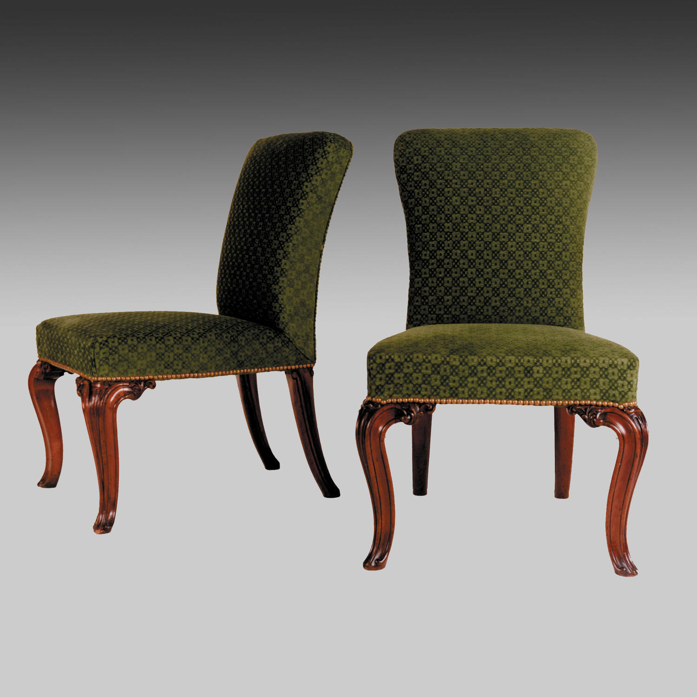
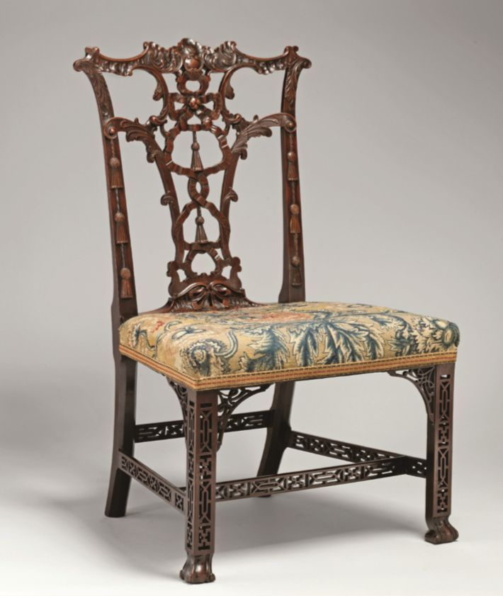

# 新古典设计运动
## 新古典设计运动的时代背景
* 18世纪下半叶和19世纪上半叶，欧洲几个主要资本主义国家相继出现了建筑和设计上的**复古主义**（Classic Revival）现象，其中以**法国**的**古典主义复兴**，**英国**的**新哥特主义复兴**［NeoGothic，有些建筑史家称之为“**浪漫主义**”（Romantism）］以及在**美国**和其他欧洲国家（也包括英国和法国在内）产生的**折中主义**（Eclectism）古典复兴三个浪潮最具有代表性；设计史上经常笼统地称之为“**新古典主义**”（Neoclassicism）运动
* 影响欧美出现复古主义设计运动的背景很复杂，其最主要的动机应该是新生的**资产阶级**希望通过大型公共建筑、产品设计、平面设计风格来凸现他们的**政治立场**的象征性要求，希望从建筑上、产品上体现出与以往的贵族、皇室、地主阶级鲜明的区别
* **法国**皇帝**拿破仑**（Napoléon Bonaparte）企图通过建筑和设计强调他作为资产阶级利益代表的新统治者的权力实质，因此采用古典主义风格，特别是**罗马风格**，建造了一系列纪念性建筑，比如拿破仑修建的**雄狮凯旋门**（Arc de triomphe de l'Étoile），就是罗马同类建筑物的宏大化复兴，同时也暗示他本人取得了比罗马**恺撒大帝**（Gaius Julius Caesar）更为卓越的政治和军事成就

* **英国**人则由于其**清教徒**（Anglicanism）的国民性，对于法国式的宏大奢华颇不以为然，因此在19世纪初发展出**模仿中世纪风格**，特别是哥特风格的建筑、产品、平面设计，为后来的“**工艺美术**”（the Arts and Crafts）运动奠定了思想和形式的基础

* **美国**作为一个新兴国家，刚摆脱英国统治而缺乏统一的民族传统，因此便融会欧洲各国的传统，形成古典复兴的**折中主义**

* 自从18世纪以来，特别是19世纪期间，欧洲在**世界考古**上有很大的进步，考古学家深入到世界各个角落，研究人类的起源和人类文明的发展，通过考古学和人类学的研究，人们能够通过考古发掘看到**真实的古典的建筑形式**；如对意大利**庞贝古城**的发掘，把罗马的建筑、城市规划、室内设计、园林设计和环境艺术完整地呈现在欧洲人面前
* 长期以来，受**文艺复兴思想体系**的影响，**罗马风格**一直被认为是古典建筑之源，是古典主义的集中体现；而18、19世纪的考古发掘和学术研究成果表明，所谓建筑之源的罗马风格，其实并不是源，而只是流，真正严肃的、理性的建筑是更加早期的**古希腊风格建筑**，甚至是**托斯坎尼风格建筑**
* 基于这样的认识，希腊和更早时期的托斯坎尼文化被欧洲十八九世纪的先进建筑家们视为最高经典，欧洲也自18世纪末开始，出现了称为“**新希腊主义**”的建筑设计、产品设计、平面设计的热潮
* 美国总统办公和居住的**白宫**（White House），就是希腊风格和托斯坎尼风格的混合形式；美国的创立者们殷切希望通过这栋建筑，向世界阐述自己的新国家所包含的**政治内容**

* **新希腊主义风格**在整个欧洲也有相当水平的发展，其中**法国**是一个重要的探索区；法国有两位建筑家、设计师，一位是**埃廷涅－路易斯·波勒**（Étienne-Louis Boullée, 1728—1799），另外一位是**克劳德·尼可拉斯·勒杜瓦**（Claude NicolasLedoux, 1736—1806），采用古典的简单几何形式来设计建筑、公共设施，是试图采用古代传统开辟新的可能性的先驱
* 在德国首都柏林，**卡尔·戈特哈德·朗汉**（Carl Gotthard Langhahns）设计了新希腊风格的**勃兰登堡城门**（The Brandenburg Gat），这座城门成为欧洲19世纪兴建的大量纪念性城门的第一座，振兴了德国的古希腊风格

* 新希腊主义在**英国**也非常流行，其中从事设计的最主要建筑家是**约翰·索恩**（Sir John Soane），他设计的**伦敦英格兰银行**（Bank of England）就是这种风格的杰作

* 英国出生的美国建筑家**本加明·H.拉托伯**（Benjamin Henry Latrobe）受到约翰·索恩很大的影响，美国开国元勋之一、美国总统**托马斯·杰斐逊**对拉托伯的才华非常赞赏，邀请他参与设计刚刚独立的**美国首都**，其中最突出的代表作是他设计的**巴尔的摩大教堂**，这些工作为他赢得了“**美国建筑之父**”的美誉

* 这一系列的设计努力，其形式根源都是对古希腊、托斯坎尼的建筑和建筑精神的探索，希望从这些时期的建筑中找到以**简单的形式**表现**崇高思想**和精神的构思；通常，这种努力被笼统称为“**古典复兴风**”（classic revival），亦有某些建筑理论家称之为“**浪漫主义运动**”（the romantic movement）；这个运动的精神最早可以在英格兰18世纪诗歌运动中找到痕迹，但是真正的大发展是18世纪末和19世纪初叶
* 作为一种文化运动，**浪漫主义**同时也在其他领域得到令人瞩目的发展，文学方面有**威廉·华兹华斯**（William Wordsworth, 1770—1850）、**拜伦**（George Gordon Byron, 1788—1824）、**济慈**（John Keats,1795—1821）、**歌德**（Johann Wolfgang von Goethe, 1749—1832）、**席勒**（Johann ChristophFriedrich von Schiller, 1759—1805）、**莱辛**（Gotthold Ephraim Lessing, 1729—1781）、**司各特**（Walter Scott, 1771—1832）、**大仲马**（Alexandre Dumas, 1802—1870）、**玛佐尼**（Alessandro Francesco Tommaso Manzoni, 1785—1873）、**布朗特姐妹**（Emily Jane Brontë，1818—1848; Charlotte Brontë 1816—1855; Anne Brontë，1820—1849）、**爱伦·坡**（Edgar AllanPoe, 1809—1849）等；美术方面有**德拉克罗瓦**（Ferdinand Victor Eugène Delacroix, 1798—1863）、**康斯太勃尔**（JohnConstable, 1776—1837）、**透纳**（Joseph Mallord William Turner,1775—1851）等；音乐方面有**舒伯特**（FranzPeter Schubert, 1797—1828）、**贝多芬**（Ludwig van Beethoven, 1770—1827）等
* 他们向往自由、平等、博爱，热爱自然，重视和强调**个人价值**，对**自然**，对于简朴的自然观，对于淳朴的古代文明充满了真诚的热爱；在他们看来，重要的不是国家或者教会所强加于人的价值观和审美观，而是个人自己从自然和古代文明的探索中得到的**价值观念和审美立场**；重要的不是历史的外在形式，而是**内在精神和思想**
* 在建筑理论中较早提到古典复兴的是建筑史家西格佛列德·吉迪翁，他在1922年提出**浪漫古典主义**（Romantic Classicism），并且认为法国皇帝**路易十六风格**（The Louis XVI style）就是这股风气的起点，“浪漫主义”这个术语，就包含了“罗马风格”的内涵
## 新古典设计
* **新古典主义**主要集中在建筑设计和家具设计上，具体的时间因国家不同略有差异，大概从18世纪中期开始，一直到19世纪初期；在英国叫作“**乔治风格**”（Georgian style），在法国叫作“**路易十六风格**”（Louis XVI style），在美国叫作“**联邦风格**”（the Federal style）或者“**帝国风格**”（the Empire style），在有些欧洲国家则叫作“**格里希风格**”（Grecian style）、“**埃特鲁斯坎风格**”（Etruscan style）
* 古典时期的**家具**传世极少，人们能够接触到的古典式样，一方面来源于少数遗存的绘画、雕塑、浮雕作品，而主要的第一手资料是来源于18世纪中期**庞贝古城**的发掘，从发掘的文物、壁画中得到了直接的认识
* 新古典家具对于**形式**非常重视，其目的是要让家具表现出强烈的**古典感觉**，舒适感倒在其次，与巴洛克风格比较，新古典家具鲜用曲线、弧线、漩涡装饰，因而更显**挺拔庄严**；新古典家具虽然也有许多细节装饰，但很少是原创的，基本都是从古典家具的装饰中**借鉴**过来的，因此**仿古**的成分在设计中占很重要的地位
* 新古典家具的种类比以往更多，**屏风**、**壁炉屏**（fire screens，围在壁炉前面起保护作用的金属屏），各种椅子、沙发、**脚凳**（footstools）、书架，还有不少**躺椅**（the chaise lounge）；从考古中得知埃及女皇**克里奥帕德拉**（Cleopatra）经常倚在躺椅上，从而造成躺椅的流行
### 英国的新古典设计
* 英国王权历史上的**汉诺威王朝**（the House of Hanover, 1714—1901）中，有一段叫作“**乔治王时期**”（The Georgian era），是指1714—1830年之间，四位都叫乔治的英国国王（从乔治一世到乔治四世）在位的时期；乔治三世曾经患病不能当政，因而让乔治四世以摄政王的身份代理国王，在英国历史上叫作**摄政时期**（the Regency）；之后从1837—1901年，是**维多利亚女皇时期**，她去世之后，汉诺威王朝就结束了
* 英国的新古典主义家具和设计，集中在乔治时期，因而也叫作“**乔治风格**”；乔治时期又可分为三段，分别是：**早期乔治时期**（Early Georgian,1745—1780），**中期乔治时期**（Mid Georgian,1730—1750年代）和**晚期乔治时期**（LateGeorgian, 1750—1830），晚期乔治时期的设计是**最典型的新古典主义风格**
* 在三个时期中，皇室、贵族的家具风格都走**模仿古典**的方向，但是**乔治一世**为人呆板，因此早期乔治时期的设计并不出色，**缺乏灵气**；中期开始有了比较丰富的发展变化，当时由于从中国进口的家具越来越多见于英国和欧洲市场，因此乔治风格中也出现了一些**中国的元素**，设计讲究比例、平衡

* 到**摄政时期**已经相当庄严华贵，更趋成熟的新古典主义，线条流畅，外形更加简洁，家具的脚往往用**球形**（ball feet）、**虎爪形**（claw feet），有些时候还用蛋形、贝壳形、狮头形雕刻做装饰；家具表面采用**亚光**，色彩也比较沉着，拉手多用**白铜**，其他五金件也多以铜为材料，家具的**体量**也比早期乔治时期小一些，除了审美考虑之外，也考虑市场上能够让更多顾客买得起

* **托马斯·齐彭戴尔**（Thomas Chippendale）代表的“**齐彭戴尔风格**”（Chippendale）成了早期乔治时期设计风格的代名词，他的家具风格以古典为依据，很**凝重**，但有些**沉闷**；齐彭戴尔的家具主要采用**桃花心木**（Mahogany）为材料，此前的英国家具多采用**胡桃木**，乔治时期由于海外贸易、殖民地发达，能够进口珍贵的木材，因此设计师转而使用进口的名贵硬木；**硬木**除美观之外，还比较**抗虫蛀**，所以高档家具多用硬木制作

* 第二位重要的匠人是**乔治·赫普怀特**（George Hepplewhite），他的家具风格就被称为“**赫普怀特风格**”（Hepplewhite）了；他设计的家具除了用桃花心木，还增加了**椴木**（Satinwood），而使家具出现**轻松**的感觉，但同时仍有新古典的稳重，他的设计风格轻巧、典雅，椅背常呈**扇贝形**

* 第三位匠人叫作**托马斯·舍兰顿**（Thomas Sheraton），他的风格被称为“**舍兰顿风格**”（Sheraton）；舍兰顿的家具设计常常从古典建筑中获得灵感，除了用椴木、桃花心木之外，舍兰顿还喜欢用**花梨木**（rosewood），并在木料表面绘画；他还喜欢**雕刻装饰**，设计的柜子常带有可以拉出的小桌面，作品更加生动有趣

* 新古典主义的英国家具，种类相当多，有一些是在这个时期特别设计的，比如**躺椅**（chaise lounges）、**摇椅**（wind chairs），代表了一种**更加悠闲的生活方式**；**书桌**是乔治风格很特别的一个类型，因为社会变化，需要用书桌的时间越来越多，所以书桌的款式、种类也特别多
* 新古典时期建筑风格最流行的是**新帕拉丁诺风格**（the Neo-Palladian architecture），空间、体量都趋向比较大的，这种建筑、室内配合乔治风格家具相得益彰

* 英国的**工业革命**发生得比较早，在**18世纪中期**已经开始了，这场革命极大地促进了英国现代建筑和现代设计的发展；随着工业革命的深入发展，英国的城市**急剧扩大**，人口**猛增**，住房问题**日趋严重**，而且工业生产的发展也对工业建筑不断提出了新的要求
* 人口的**急剧增长**，改变了以前城市规划的**简单轮廓**，工厂主和劳工的居住区域成为都市当中对立的、完全不同的**两个部分**，社会生活也呈现严重的**贫富悬殊区别**，造成的必然结果是大量贫民窟的出现
* 因此，从英国的情况来看，可以知道**现代建筑的起源**首先是来自经济、社会的**需求**，而不是知识分子的**观念**；也就是说：现代建筑的起源首先是**社会总需求**，然后才是**现代建筑思想**的形成
* 从设计上来看，英国的古典复兴主义是非常有特色的，其中最为重要的是**约翰·纳什**（John Nash）的**伦敦改造计划**；他设计的**摄政王大街**（Regent Street）和沿街的一系列重要建筑，**摄政公园**（Regent's Park），**特拉法加广场**（Trafalgar Square），**皮卡迪里广场**（Piccadilly Square）等都是具有典型罗马、希腊特点的建筑

### 法国的新古典设计
* 在法国，新古典主义最集中的代表是“**路易十六风格**”（Louis XVI style），和路易十六之前的几个皇帝时期的风格最大的差异，在于**弯曲线条**为主的设计风格在这个时期开始消退，让位给严肃、端庄、典雅的**新古典**；由于和古希腊、古罗马的风格有密切的联系，因此也有人称之为“**埃特鲁斯坎风格**”（the "Etruscan" style）
* 路易十六风格家具多用**直线、几何形式**，受古希腊、古罗马家具影响很大，家具设计上**细节装饰减少**，使用**柱形的立柱**多，家具楣头用**浅浮雕装饰**，装饰图案包括橡叶、桂叶卷草、花环、腊缎带，摆脱了洛可可的阴弱之风，显得比较**阳刚大气**

* 路易十六时期主要设计师是**雷瑟奈**（Jean-Henri Riesener），他主持了大部分凡尔赛宫的家具设计和制作，和英国乔治风格相比，法国的新古典主义风格代表路易十六风格突出的主要是**趣味性**，通过**小尺度**达到亲和感

* 1789年**法国大革命**推翻皇朝，在1793年把路易十六、皇后送上断头台，革命改朝换代，转成**共和国**，新古典风格因此在法国突然中止了；经历了法国大革命的动乱之后，**拿破仑**上台，组成了**法兰西第一帝国**，他依然崇尚新古典主义，并尤其注重**古罗马风格**，拿破仑上任至1814年，这段时期的设计风格叫作“**帝国风格**”（the Empire Style），是法国新古典主义最后一个风格时期
* 大革命以后，拿破仑在1804年加冕，重新称帝，但他所代表的已经不是旧封建贵族的利益，而是**新兴资产阶级**的利益；拿破仑建立了一系列**新的法律制度**，并且在法国推动了**民主化**的进程，作为一个强势君主，他自然希望能通过建筑来彰显他的改革精神——他在位的10多年期间（1804—1815），法国建造了一系列**大型的公共建筑**，基本是采用古罗马的风格，只是更加**宏大化**
* 拿破仑时期的大型建筑包括三个主要方面内容：为经济和贸易发展而设计的新型建筑，比如由**伯朗尼阿特**（Alexandre-Théodore Brongniart）设计的巴黎的**证券交易所**（Palais de laBourse）；为解决人口日益膨胀的城市居住问题而建造的大量**多层住宅公寓建筑**，大部分是5~6层，底层是商店，上部是住宅单元，人行道宽敞，且有人行道的绿化带，**西欧现代城市**的面貌由此基本定型；为了炫耀拿破仑征服的功绩而兴建的大型纪念性建筑，如**玛德林教堂**是一座典型的罗马围廊柱式庙宇，是“帝国风格”最突出的代表作

* 为了体现拿破仑与**贵族阶级**没有继承关系，他们刻意避免采用任何**波旁王朝**使用过的风格，特别是巴洛克风格、洛可可风格等等；他们对于古典风格情有独钟，认为没有任何风格能够超过**古罗马风格**
### 美国的折中主义风格
* **美国**通过长时期的**独立战争**，摆脱英国的殖民统治，在1776年成为一个独立的**联邦国家**；对于这个新大陆上的新国家而言，通过建造**政府公共建筑**来体现国家的原则和立场是非常紧迫和重要的，美国的开国元勋都高度强调这些公共建筑
* 美国建国初期，还有相当一部分亲英国的**保皇派分子**，他们在建筑上主张接近**英国的主流风格**，表示对于英国皇室的效忠，这类建筑在**美国东海岸**，特别是新英格兰地区和弗吉尼亚州一带相当多；而开国的革命者则希望能够通过建筑体现美国的**民主精神**，他们主张以罗马风格为主，兼容各种欧洲风格，由此形成**古典折中主义**的建筑面貌
* 美国开国元勋之一的**托马斯·杰斐逊**（Thomas Jefferson, 1743—1826，后任第三届美国总统）是促进**罗马风格复兴**的主要人物，他本人就是**建筑家**，曾经在法国学习建筑，美国立国之后，他要求在建筑和规划上消灭一切殖民地的痕迹，建立自己独特的建筑面貌；他亲自设计的美国**弗吉尼亚州的议会大厦**（Virginia StateCapitol），就是以罗马建筑为依据的典型作品

* 美国首都**华盛顿**的规划与设计，集中反映了美国当时建筑的倾向和存在的问题；美国立国初期，曾以**费城**为首都，但经过很短一段时间之后，在农业型的南部和工业型的北部，文明水平比较高的东部地区和比较蛮荒的西部地区交界的地点，位于马里兰州和弗吉尼亚州交界、阿巴拉契亚山脉的东侧，美国选择了一个**菱形地带**作为首都，称为**哥伦比亚特区华盛顿市**（Washington D.C.），也就是人们平时所说的华盛顿
* 为了突现古代文明的传承和民主精神，华盛顿的早期设计基本采用了古**希腊和托斯坎尼风格**，尽量努力避免与贵族阶级统治的英国建筑有任何关系；美国总统住所白宫，是由建筑师**詹姆斯·霍班**（James Hoban, 1758—1831）在1792年以希腊爱奥尼亚风格为核心风格来设计的，是所谓的“**新希腊风格**”（the new Greek style）代表作

* 1825年，美国政府投资建造立法机关建筑——美利坚合众国国会，由于建筑在华盛顿市中心一个小山丘上，因此俗称为“**国会山**”（the Capital Hill）；美国首位本土成长起来的建筑师**查尔斯·布芬奇**（Charles Bulfinch）参与了国会山庄设计方案的修改和兴建，采用了以希腊建筑形式为主，其他欧洲传统建筑形式为辅的**混合方式**，也就是后来称为的“**折中主义**”风格设计

* 华盛顿市的城市规划是美国“**折中主义**”（Eclectism）建筑思想的体现，也是美国初期城市规划的一个典型的**失败例子**，这个城市的规划是法国工程师**皮埃尔·查尔斯·朗方**（Pierre Charles L'Enfant, 1754—1825）设计的；虽然华盛顿摆脱了英国贵族形式，但是严重地受到**法国贵族风格**的影响，特别是朗方设计的华盛顿城市规划，基本是法国波旁王朝，特别是路易十四时期的巴黎和凡尔赛宫规划风格的翻版，整座城市规划宏大、宽敞，采用**几何放射形**布局，充满了权力的象征意义，但是在功能方面，无论是建筑布局、街道安排，或是城市尺度的大小，都**不符合市民的居住要求**
* 法国在17世纪、18世纪和19世纪都经常发生**市民暴动和革命**，为了分隔和控制群众的骚动，所以将街区设计成**中心放射型**，把城市划分成小块，以达到防止暴动蔓延到城市其他部分的目的；然而，作为美国首都的华盛顿并不存在这个需求因素，这样的设计，造成了华盛顿日后交通阻塞、道路辨认困难等**诸多问题**
* 此外，华盛顿不但应该设计为一个首都，同时也应该是一个能够**舒适居住的城市**，而朗方在整个设计过程中并没有考虑居住功能需求，仅以**政治象征性**为设计的出发点，道路和建筑的尺度**过大**，冷漠而缺乏人情味，交通亦不方便

