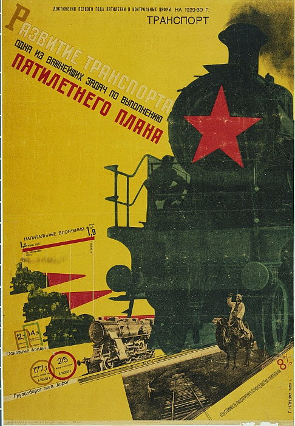

# 现代主义运动
## 未来主义
1. **未来主义的核心理念**：
   - 在第一次世界大战后期，未来主义艺术家**摒弃了对自然的关注**，转而从**机械化环境**中寻找灵感
   - 该运动创造了一种**新的形式语言**，强调铁路、汽车和运输的多样性
   - **工人**被**英雄化**，因为他们参与了现代工业城市的建设

2. **代表人物和作品**：
   - 意大利诗人**菲利波·托·马索·马里内蒂**是未来主义的重要代表，他在作品中**赞美机器之美**，将其视为速度、进步和自由的象征

   - 马里内蒂在1909年的《**未来主义宣言**》中，描述了赛车、机枪、火车站、建筑工地和桥梁等的美
   - 未来主义艺术家如**吉诺·塞韦里尼**、贾科莫·巴拉等人的作品展现了狂放的节奏，对美国艺术家**厄尔·赫特尔**的作品《**蓝色狂想曲**》产生了影响

3. **艺术表现手法**：
   - 未来主义艺术家借鉴了立体主义的**碎片化和空间错位手法**
   - 受**朱尔斯·玛瑞**等艺术家的**间隔拍摄技术或连续摄影术**影响，将运动表现为一系列**重叠、抽象的线性图案**

4. **社会和政治影响**：
   - 未来主义不仅限于**纯艺术领域**，还涉及**实用艺术**，例如广告和插画
   - 马里内蒂通过**大众媒体**传达理念，使用**咄咄逼人的说服方法**
   - 未来主义反映了电力、内燃机和飞机等新技术带来的**精神上的自由感**
   - 马里内蒂希望超越传统艺术形式，吸引工厂工人和年轻人，推翻守旧的艺术和社会政治制度，呼应**快速的变革和进步**

5. **马里内蒂的文学创新**：
   - 马里内蒂在其诗作中采用了象征主义诗人**斯丹芬尼·马拉梅**的影响，通过**铅字在页面的排列**直接传达**文字的视觉含义和声音感受**
     - 在诗作《**月下花床**》中，他通过**不等的字体排列**和**由不同字体及字母组成的词汇**，打破了印刷中的常规方向、距离和标准间距
     - 这种自由表现形式采用**图片剪贴**的手法，将文字、手写笔迹和图形重新组合，为**平版印刷**做准备，从而为印刷实践带来更大的自由

1. **贾科莫·巴拉的时装设计**：
   - 从1912年开始，贾科莫·巴拉对**男士服装**产生兴趣，他在服装上印刷或绘制**非对称式图案**，反映城市生活的节奏
     - 1915年，巴拉设计了一款夹克，以及1914年为未来主义诗人弗朗西斯科·坎朱洛设计的被称为“**反中性**”的西服，这些设计展现了**对称式的几何图案**
     - 巴拉认为现代服饰应避免对称和温和的色彩，而应强调**强烈、柔韧和多元性**，以促进**感官和行动的解放**，并提供**活动自由**

1. **未来主义艺术家对消费文化的理解**：
   - 与现代主义设计师和批评家不同，未来主义艺术家理解并利用服装界对季节性服饰变化的强调，认为这为设计师提供了**展示创意的机会**，同时为消费者提供**新鲜选择**
   - 未来主义艺术家对消费文化的吸引力与现代主义设计师的鄙视流行服饰、追求持久形式的观点形成**鲜明对比**

2. **未来主义在广告创意中的应用**：
   - 未来主义艺术家在20世纪20年代晚期的广告创意中广泛采用了**文字的强烈表现**和对比**强烈的几何图形**
   - 这种风格通过创造**紧张不安的力量**和**旋律性**的连续图形，在大众媒体上向民众传达**未来主义者的感受**
   - 例如，**弗图纳多·德培罗**作为平面设计师，为“**堪培利**”开胃酒创作了一系列**黑白对比强烈的报纸广告**，使用简单锋利的图形和机械化的玩具人物，体现了未来主义的视觉传达手法
     - 德培罗的广告作品不仅带有**趣味性和视觉双关**的含义，而且在广义上具有**政治性**
     - 产品名称的字母排列和视觉上的设计，如**扩音器**的形象，展现了未来主义对视觉传达手法的**深刻理解**

1.  **玩具设计与乌托邦理想**：
    - 德培罗和巴拉共同撰写了论文《**重新创造未来主义的社会**》，讨论了**未来主义式的玩具人物的意义**
    - 这些玩具寄存着**想象力和自发性**，被视为对成年人有益，能使他们保持**年轻、灵活、欢快和直觉**
    - 这反映了未来主义对**社会乌托邦理想**的追求，试图通过创意和设计影响成年人的思维和行为

## 风格派
1. **风格派的成立与主要成员**：
   - 风格派是一种艺术运动，由艺术家兼设计师**希奥·凡·杜斯堡**于1917年创立，发行了专业期刊《**风格**》
   - **其他重要成员**包括荷兰画家皮埃尔·蒙德里安、维尔莫斯·哈查尔，比利时雕塑家乔治·万东格洛，荷兰家具制造商格里特·里特维尔德，建筑师罗伯特·范特·霍夫、J.J.P. 奥德和简·维尔斯
   - 风格派**从未举办过集体性的展览会**，其成员间达成共同理念与合作精神**相当困难**，部分原因是凡·杜斯堡**个性强硬**，导致与其他成员存在分歧

2. **风格派的艺术展览和影响**：
   - 尽管风格派在1925年的国际装饰艺术与现代工业博览会上没有展出，但其成员如**蒙德里安**在巴黎有**显著影响**
   - 凡·杜斯堡、里特维尔德等设计师的作品于1923年在现代画廊展出，凡·杜斯堡因此结识了**勒·科比西埃**

3. **风格派的组织性质和理念**：
   - 《风格》杂志宣称**个人主义**是第一次世界大战的**根本原因**，提出建立个人意识与普遍意识之间的平衡
   - 风格派认为新的意识应带来**对时间内涵的全新领悟**，即**普遍与个体之间的平衡**、

4. **荷兰建筑师的理论影响**：
   - **亨里克·伯尔拉赫**提出了“**在差异中求统一**”的理念，即在建筑和设计中实现**个性与普遍因素之间的平衡**
   - **马蒂厄·劳威里克斯**致力于在几何构成的框架中**调和统一与分化**，这与德意志工匠联盟成员**赫尔曼·穆特西乌斯**的思想相一致，后者探讨了制造业中**个体表现与标准的关系**

5. **风格派的设计原则与实践**：
   - 风格派艺术家将理论应用到**多个领域**，如插图、绘画、雕塑、活字印刷、家具、室内组合以及建筑
   - 杜斯堡认为家具是**室内的雕塑**，建筑是**三维空间的绘画**，强调艺术**与现代生活的融合**
   - 风格派艺术家通过**负面空间的积极角色**来模糊纯艺术与实用艺术之间的界限，实现了**统一的美学原则**

6. **蒙德里安的新造型主义理念**：
   - 蒙德里安的理念是艺术与建筑可以实现**绘画所达到的有限形式**，即**和谐与平衡的获得**
   - 他的理论强调**正负空间的转换**，通过线性元素之间的**对称平衡**实现对立面之间的平衡
   - 蒙德里安主张**艺术与生活之间不应有区别**，艺术作品应**与日常生活融合**，他的这一理念体现在他的多篇文章和作品中

7. **风格派在家具设计中的应用**：
   - **格里特·里特维尔德**在1918年设计的**扶手椅**采用预制板材，椅座和椅背使用**长方形胶合板**
   - 他在设计中故意**延长直角交接处**，强调**负面空间的协调作用**，同时呼应**非写实派雕塑**

8. **风格派在杂志封面设计中的创新**：
   - 蒙德里安和凡·杜斯堡在1920年合作修改《风格》杂志封面，为“新造型主义”提供**有形图解**
   - 封面设计采用**无衬线字体**，平衡非对称布局，通过字母大小和方向决定信息层次，创造**视线的对角移动**
   - 这种设计手法后来也出现在19世纪20年代德国的“**新版式**”和第二次世界大战后**瑞士的平面设计**中

9. **风格派在建筑和室内设计中的实践**：
   - 凡·杜斯堡为**诺威克豪特的杜奇大楼**设计彩色瓷砖图案，尝试将抽象、非客观的绘画与建筑融合

   - 施罗德夫人提供的建议在**施罗德别墅设计**中得到体现，如顶层开放空间的私密性和可移动分隔墙
   - 施罗德别墅的设计元素，如色彩鲜明的地板、漆绘家具和平屋顶，体现了风格派的美学观念和对“**非客观艺术**”的追求

1.  **风格派在家具和室内设计中的实践**：
    - **格里特·里特维尔德**在家具设计中强调**结构的统一和功能的独立性**，尽管这在实践中并不总是可行
    - **凡·杜斯堡**在1928-1929年设计的**奥贝特咖啡馆室内空间**显示了他对现代抽象艺术**个性化和表现性趋势**的接纳
    - 在**奥贝特咖啡馆**的项目中，凡·杜斯堡设计的荧幕舞厅结合了功能多样性和动感十足的**对角线设计**，表现出与风格派宣言的**差异**

1.  **风格派理念的分歧与转变**：
    - 早在1923年，**凡·杜斯堡**开始在设计中应用**对角元素**，与蒙德里安和风格派的关系**日渐疏远**
    - 蒙德里安于1925年**退出《风格》杂志**，显示出风格派成员间的理念和方法上的分歧
    - 凡·杜斯堡的设计灵感转向**更加个性化和想象力丰富的方向**，与风格派的**普遍与个体意识的平衡宣言**存在

2.  **风格派在城市规划中的影响和偏离**：
    - 建筑师如**J.J.P. 奥德**逐步偏离凡·杜斯堡的**集体合作理念**和蒙德里安的**反物质主义观念**
    - 奥德在**鹿特丹的低造价公共住房设计**中强调了**功效、经济必要性和社会责任感**，而非风格派的综合美学理想
    - 这表明风格派在实际的**城市规划领域**中面临着**理念的调整和实践的挑战**

3.  **现代主义建筑在社会住房的应用**：
    - 奥德于1927年为**德意志工匠联盟世博会**设计建造的**斯图加特魏森霍夫单元住宅群**采用白色墙体和标准化直角门窗，反映了早期功能型“**国际风格**”建筑的特点
      - 这些建筑满足了**低收入社会阶层的需求**，采用预制材料提供**经济且现代的解决方案**，符合二十年代经济状况恶化下对节制住房方案的需求

    - 维也纳的**卡尔·马克思·霍夫住宅群**由**卡尔·恩**设计建造，作为政府资助的公房，强调**集体价值**，提供有限的公用设施

4.  **设计与社会进步的关系**：
    - 这一时期的设计争议集中于**装饰派艺术与精神化、早期风格派乌托邦**的启迪“**艺术与工业**”的模式
    - **威利·堡梅斯特**设计的海报捕捉了这种**争议的双重性**，通过大写粗体无衬线的“展览”二字和巨大红色“X”标志，质疑现代家居生活中的装饰、历史性因素和奢华

5.  **现代主义设计在公共空间中的挑战**：
    - **奥贝特咖啡馆的室内设计**起初赢得了艺术家和媒体的**广泛接受**，但随着时间的推移，成为**公众批判的对象**
    - 凡·杜斯堡的设计原貌被店主**随意改动**，失去了原作的痕迹，表明其抽象环境中实现生活与艺术统一的观念**在社会问题解决方案上的不足**
    - 这反映了现代艺术和当代生活理想之间**共同愿景的缺失**，以及现代主义设计在公共空间应用中的挑战

## 构成主义
### 起源
1. **亚历山大·罗琴科设计的工人俱乐部**：
   - 罗琴科在1925年的巴黎国际装饰艺术与现代工业展览会上展示了**苏维埃工人俱乐部的室内装饰样板间**
   - **设计特点**包括长方形的阅览室、可以折叠的长木桌、圆形靠背椅子和扶手椅，以及用于宣传册和书籍陈列的移动平台
   - 罗琴科的设计强调**简约风格、结构的组合和工业材料的使用**，与当时巴黎展览会的奢华风格形成鲜明对比

2. **构成主义的社会和文化背景**：
   - 构成主义作品如罗琴科的工人俱乐部反映了1917年**俄国革命**和布尔什维克1920年**内战胜利**后艺术家**参与国家重建的意愿**
   - 1918年新成立的**人民教育委员会**为进步艺术家提供了将理想主义意识形态付诸实践的平台
   - 革新艺术家们共同的目标是**解放人民大众**，坚信艺术与设计拥有改变价值观念和现代生活状况的力量

3. **构成主义设计的意图和影响**：
   - 罗琴科的工人俱乐部设计不仅是**功能性的**，还旨在**塑造共产主义价值观念的场所**
   - 设计强调了**标准化和基本几何元素**的使用，同时以**鲜活的色彩**缓解简约设计，创造活跃多元的室内空间
   - 构成主义在艺术与设计中的实践突显了艺术与社会主义革命的紧密联系，反映了艺术家改变社会的使命感和创新精神

### 马列维奇和至上主义
1. **卡西米尔·马列维奇和至上主义**：
   - 马列维奇使用“**至上主义**”一词描述其**抽象绘画风格**，定义为艺术中**对情感的诠释**
   - 他在绘画中使用**简化的几何图形**，如**正方形**和**长方形**，将这些形式与**现代科技和工业**相联系，象征性地结合社会主义价值观与新艺术及科技的应用

2. **构成主义的实践与影响**：
   - 罗琴科的工人俱乐部设计采用简约、功能性和工业材料，强调标准化和基本几何元素
   - **UNOVIS艺术组织**中，艺术家们采用**至上主义的装饰手法**，设计**标志、标语和临时性建筑**，如舞台和演讲台

   - **瓦西里·康定斯基**在俄国革命后回国，采用**更精确的几何语言**创作抽象艺术，研究图形与色彩对心理的影响

1. **非客观抽象艺术的应用**：
   - 海报、宣传标语和舞台服饰设计被视为非客观的抽象“艺术”，早在18世纪晚期与19世纪早期的广告海报中已经使用
   - **柳博芙·波波娃**设计的《**绿帽王**》舞台剧服饰和布景于1922年在俄国上演，展现了**机械化特点和抽象艺术**的创作组合

2. **构成主义与集体主义价值观**：
   - 马列维奇强调**至上主义的普遍性**高于个人化，鼓励人民艺术学院的艺术家**匿名参展**
   - 波波娃的舞台设计强调了**集体主义身份和抽象表达**，通过表演活动打破了艺术与生活间的阻隔
   - **立体主义者**参与构成主义运动，提倡在无产阶级中灌输**新的集体主义价值观**，转变与精英主义相关的传统艺术形式

### 构成主义的初期发展
#### 利希茨基和塔特林
1. **利西茨基的抽象艺术和教学**：
   - 利西茨基在德国学习建筑后加入**人民艺术学院**，与**卡西米尔·马列维奇**共事
   - 他在“PROUNS”建筑系执教，并创作了一系列以“PROUNS”为主题的**抽象几何图形**组成的油画和石版画作品
   - 利西茨基将“PROUNS”定义为**建筑与绘画间的中转站**，强调抽象几何的**实用主义潜质**

2. **利西茨基的平面设计作品**：
   - 利西茨基的平面设计作品著名于**结合文字、符号和摄影**的视觉传达手法
   - 他为**弗拉基米尔·马雅可夫斯基**的诗集《**蒂拉戈罗莎**》设计了平面设计作品，用于公众性表演的宣传
   - 设计中的**红色正方形**象征苏联国旗和革命烈士的鲜血，字母、布局和抽象符号的呼应关系挑战了传统的书籍印刷设计

3. **利西茨基的艺术观念和社会角色**：
   - 利西茨基强调新艺术形式应基于**客观而非主观**，类似科学，具有构成的本质
   - 他认为艺术家应是学者、工程师和劳动人民的伙伴，将纯艺术与**社会实用主义**结合
   - 他的观点体现了艺术家在**新文化前沿**的角色，旨在促进艺术与社会进步之间的融合

4. **利西茨基和塔特林的抽象艺术**：
   - 利西茨基和塔特林尝试**缩短抽象艺术与大众之间的差距**，通过使用常规工业材料进行**抽象拼贴创作**
   - 塔特林的作品如《**材料的选择：铁、泥灰、玻璃与沥青**》运用**普通材料**作为**抽象浮雕**构成的创作元素
   - 这些作品虽然几乎没有实用性，但被称为“**实验作品**”，意在为未来**实用主义家具**的创作奠定基础

5. **利西茨基的平面设计与期刊出版**：
   - 利西茨基的平面设计作品使用文字、符号和摄影相结合的手法，如为弗拉基米尔·马雅可夫斯基的诗集设计的平面设计作品
   - 他于1922年开始发行国际性专业期刊《**物体**》，涉猎纯艺术、装饰艺术以及工业产品
   - 期刊采用**半色调图像制版技术**，传达出利西茨基提倡使用**摄影图片**的兴趣，强调无衬线字体、非客观几何构成与工业造型之间的抽象关系

6. **利西茨基的新页面布局方法**：
   - 利西茨基的设计强调**明确、迅速与戏剧性**的信息交流，使页面布局更**直观**
   - 他的设计将文字、符号与图片**结合**，积极地捕捉读者的注意力
   - 这种设计方法与未来主义诗人**马里内蒂**的试验性活版印刷作品相呼应，体现了现代生活的**错位与同步的新感性特点**

#### 科鲁茨
1. **科鲁茨的构成主义政治海报**：
   - 科鲁茨在政治海报中采用**摄影剪贴**作为现代“拼贴”的形式，宣传斯大林领导下的苏联政府政策
   - 他的海报使用**不同比例和重复使用的摄影图片**来传达**运动感和进步性**，如1929年宣传交通运输发展的海报
   - 海报中的**并置手法和倾斜的文字**在非对称的布局中强调**视觉层次感**，代表着苏联的红色象征和对未来的指向

2. **构成主义艺术与摄影的结合**：
   - 构成主义艺术家认为**摄影**具有**现代化特点**，因其复制性和机械化，无需依赖传统插图或绘画
   - 科鲁茨对摄影剪贴的使用传达了**交通运输发展的普遍含义**，鼓励对官方政策的支持和遵守

### 构成主义的困境
1. **构成主义在苏联政治环境中的命运**：
   - 20世纪20年代晚期**斯大林对苏联媒体的进一步控制**限制了构成主义艺术家探索印刷方法在平面设计中的应用
   - **理想化的工人和农业人员肖像插画**最终取代了摄影和多元组合，构成主义者的努力不断受到排斥
   - 古斯塔夫·科鲁茨因不明原因在1938年**被捕并处决**，反映了构成主义艺术家在苏联政治环境中的悲剧命运

2. **构成主义在纺织品设计中的应用**：
   - 构成主义艺术家在政府控制的工业部门设计了一系列**纺织品**，其中包括**塞尔吉·布雷林**设计的以“**煤炭的回收利用**”为主题的作品
   - 设计中使用**二维平面图示**绘制矿山、绞架、传送带和象形工人，反映了苏联**工业大集体**的方针
   - 这些设计虽为**无产阶级**创作，但由于消费者对**革命前西方设计**更熟悉，因此未获普遍认同

1. **构成主义艺术家与社会主义文化政策的关系**：
   - 罗琴科等艺术家在"**艺术文化机构**"等组织中工作，遵循马列主义思想和物质主义的文化观念
   - 这些组织鼓励艺术家参与社会主义国家的生产和实用项目，强调**集体主义需求**
   - 由于**重视实用性**，与早期构成主义关注的艺术与生活融合相比，作品被认为**过于刻板**
   - 由于对"**艺术家的角色**"以及艺术作品的作用等观点上的冲突，导致许多苏联艺术家**投奔西方**，包括康定斯基以及雕塑家瑙姆·盖博

2. **构成主义在室内陈设设计中的变革**：
   - 罗琴科设计的苏维埃工人俱乐部模型展示了构成主义在室内陈设中的应用，强调使用**有限统一的部件和现代工业材料**
   - 设计师的角色转变为**与工程师合作**，采用**产品原型设计**，取消手艺人对材料的**直接操控**
   - 设计中强调**客观和含蓄**，以几何图形和精确的建筑组件取代有机外观

3. **罗琴科的作品的实际应用受限**：
   - 罗琴科的作品，包括为巴黎世界博览会设计的工人俱乐部，虽具创新但**在实用性上存在限制**
   - 工人俱乐部的室内陈设品是**独特的**，缺乏工厂制造的原型，受经济萧条的影响，缺乏新设计所需的**投资和资源**
   - 这导致工人俱乐部的设计初衷**未能实现**，即塑造新的社会主义者和集体主义社会

### 转变与落幕
1. **构成主义在苏联社会主义环境下的挑战**：
   - 20世纪20年代早期，许多前构成主义艺术家转向**现实主义**，采用**理想化自然主义风格**作为说服性的大众艺术手法
   - 这种风格能够**赢得共产党的认可**，成为官方政策的辅助工具
   - 构成主义艺术家对工业生产产生影响的理想因缺乏**公众和党派支持**而幻灭，苏联现代主义工业设计受到**排斥**

2. **构成主义在印刷和平面设计中的应用与转变**：
   - 构成主义艺术家如罗琴科将创作活动转向**海报、专业期刊和广告的生产**
   - 他们运用构成主义原则中的**机械化复制方法**，结合摄影和插图剪贴的手法
   - 例如，《**新左岸**》期刊封面展现了摄影在构成主义设计中的戏剧性，以及与文字和鲜明构图的互动
、

1. **共产主义政府对艺术的控制**：
   - 到20世纪20年代中期，共产主义政府开始建立一套**官方的集体标准**，希望艺术能为社会主义国家建设作出贡献
   - 这一标准逐步实现，但并非沿着构成主义的抽象非客观道路发展，而是转向**自然主义**（社会主义现实主义）

2. **构成主义艺术家的适应与创作**：
   - 在政治压力下，苏联艺术家转向**自然主义风格**，刻画工人阶级、运动员和军事活动，创造有说服力的图景
   - 尽管环境压抑，艺术家如罗琴科、利西茨基继续**利用摄影手法创作平面设计**，保持**一定的实验性**
   - 例如，利西茨基1928年为**苏黎世苏联艺术博览会**设计的海报，创意地刻画了一对青年男女，体现了社会平等和性别平等的共同理想

   - 古斯塔夫·科鲁茨的《**归还亏欠国家的煤矿**》海报借鉴了构成主义的多元化构图手法
