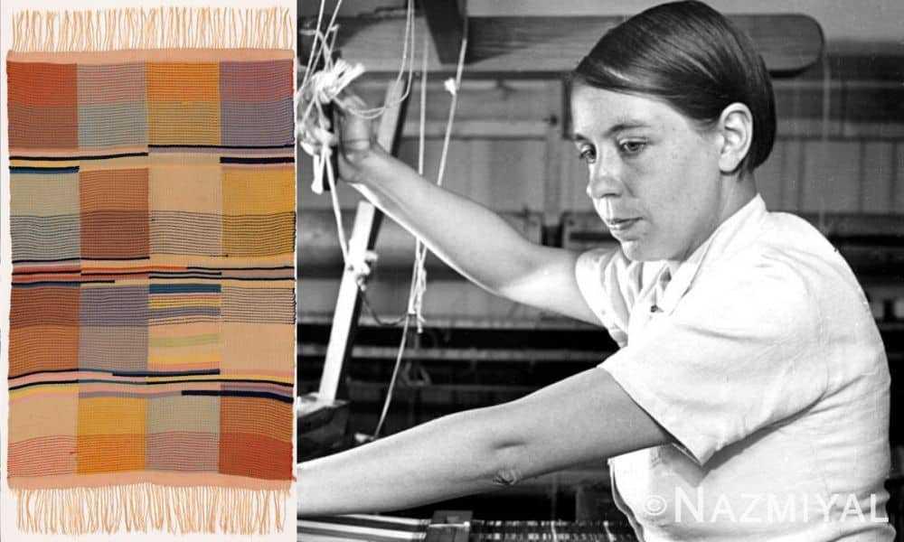

# 现代主义运动（2）
## 包豪斯 (Bauhaus)

### 起源与思想
#### 概述
- 包豪斯是一个集中于**设计、建筑和艺术**的教育机构
- 成立于1919年，位于**德国魏玛**
- 特点：结合**艺术和工艺**，强调功能性和简洁设计

#### 历史背景
- 前身是**魏玛艺术学院**和**魏玛艺术与手工艺学校**
- 两所学校均在第一次世界大战期间**关闭**

#### 创始人
- **瓦尔特·格罗皮厄斯** (Walter Gropius, 1883-1969)
- 曾在战前工作于**彼得·贝伦斯** (Peter Behrens) 的工作室
- 设计作品包括工业有轨电车和车厢的室内陈设

#### 格罗皮厄斯的建筑项目
- **法古斯鞋厂** (Fagus Factory)：1911年设计，与**阿道夫·迈耶** (Adolf Meyer) 合作
- 特点：钢筋结构、大面积玻璃幕墙、淘汰传统装饰
- 被视为**早期现代主义建筑的典范**

#### 包豪斯宣言
- **1919年**发布
- 强调艺术家与手工艺师之间的**平等与合作**
- 主张创造**融入生活的艺术**，而非与生活隔离
- 提倡将**中世纪建筑模式**作为克服纯艺术与实用艺术之间分歧的范例
- 倡导建立**无阶级分别的手工艺行会**

#### 包豪斯的影响
- 对现代设计产生**重大影响**
- 强调**理想主义**意识形态、**新工业材料**的应用（如钢筋混凝土和管状金属）
- 重视**机械化工业生产**
- 在《风格》杂志和《物体》杂志上发表相关论文
- 影响了艺术家如凡·杜斯堡、蒙德里安，以及建筑师勒·科比西埃

#### 格罗皮厄斯的社会参与
- 在**德意志工匠联盟**中表现积极
- 支持艺术**自由与个性的发展**
- 反对“**强制的典型**”

#### 中世纪行会模式和工艺美术运动
- 包豪斯的理念源自**中世纪行会模式和工艺美术运动**
- 受**威廉·莫里斯** (William Morris) 的平均主义和工艺美术运动影响
- 强调**产品和设计实践对社会环境的积极改善**

### 教师团队
#### 包豪斯的教育哲学
- 格罗皮厄斯将科系负责人称为“**大师**”而非“教授”
- **手工行会模式**在包豪斯实践中得到体现
- 包豪斯教育理念强调艺术、雕塑和建筑的融合
- **奥奈尔·法宁格** (Lyonel Feininger) 设计的封面插图象征艺术融合

#### 包豪斯的发展阶段
- 初建时期，格罗皮厄斯聘请了新的“技师”或“大师”
- 这些大师主要是**纯艺术家**，强调艺术与生活的融合
- 他们对**实用产品的设计**持开放态度

#### 教学与实践
- 艺术家与手工艺师之间的**合作关系**被强调
- 旨在培养具备**统一建筑原则**下的设计师
- 1919年任命的讲师包括**约翰尼斯·伊登** (Johannes Itten)，**格哈德·马尔克斯** (Gerhard Marcks) 和**法宁格**

#### 重要人物
- **保罗·克利** (Paul Klee)：1921年加入，瑞士画家，强调装饰性艺术的社会角色

- **瓦西里·康定斯基** (Wassily Kandinsky)：1922年加入，俄国艺术家，于十月革命后在俄国担任讲师

#### 克利的审美观念
- 强调**装饰性艺术**在社会中的重要性
- 1919年的书信中探讨了**艺术与政治气候的关系**
- 提倡新艺术将掌握**工艺技巧**，并在**共产主义社会**中获得鼓舞

#### 康定斯基对艺术和社会的看法
- 认为个人化的艺术是**资本主义的奢侈**
- 预见在共产主义社会中艺术将受到**更大鼓舞**

### 专业课程和教育制度

#### 预科培训 (Vorkurs)
- **预科**是学生选择专业工作室前必须经历的**基础培训**
- 包括陶瓷、玻璃彩绘、壁画、木工、金属工艺、纺织品设计等课程
- 由**乔治·穆赫** (Georg Muche) 担任助教
- **克利**和**康定斯基**负责必修课和非专业性理论课程

#### 教学方法和目标
- 培训由瑞士艺术家**约翰尼斯·伊顿** (Johannes Itten) 指导
- 旨在激发学生对材料、绘画技巧和形体的兴趣
- 帮助学生发掘**自身直觉和创造力**，找到合适的专业方向
- 学生作品展示了不同材质间的纹理质感对比和生活绘画的韵律感

#### 性别歧视
- 女学生通常被迫选择**针织工作室**
- **性别歧视**在包豪斯普遍存在
- 例子：**玛丽安娜·勃兰特** (Marianne Brandt) 通过艰辛努力，最终才进入金属工艺工作室学习

#### 预科的重要性
- 预科被视为所有专业性工作室培训的**基础**
- 强调艺术形式的**共同基础**，不依赖于特殊技术
- **中心理论原则**应用于建筑、陶瓷、金属工艺、家具设计和印刷等领域

#### 教育理念
- 包豪斯的专业课程强调**理论与实践的平衡**
- “形体”大师（纯艺术家）与工艺师共同指导学生
- 伊顿强调艺术间的**互相关联和统一**
- 早期预科制度也引导学生建立**艺术创作与现实无意识**之间的联系

#### 影响和传承
- 包豪斯的预科教育模式影响了**后续的设计教育**
- 在美国和英国被**制度化**，成为第二次世界大战后**设计教育的基础**
- 包豪斯宣言强调**艺术的统一与平等**，为创新性努力提供了基础

### 索末非别墅 (Sommerfeld House) 的设计和影响

#### 索末非别墅的设计特点
- 位于德国柏林，由**格罗皮厄斯**为**阿道夫·索末非**设计
- 结构和室内设计展示了**早期魏玛包豪斯**的成就
- 别墅的建造过程与**包豪斯设计工作室**合作完成

#### 结构与装饰的结合
- 设计中展示了包豪斯强调的**手工艺技术**
- 结合了**结构和创造性抽象装饰**
- 索末非别墅利用**柚木**，通常用于船舶制造

#### 建筑风格与影响
- 立面设计中**水平线和悬垂屋檐**的强调，与**弗兰克·赖特草原住宅**风格相似

- 木质浮雕装饰镶板，探索二维和三维空间中的**几何形体关系**
- 装饰主题包括**常规图案和非对称组合式布局**

#### 装饰与结构的关系
- 索末非别墅的装饰强调**抽象几何图形**
- 装饰元素在结构上**从属**而不是与结构融合
- 与**风格派** (De Stijl) 的设计理念存在对比

#### 风格派与包豪斯的比较
- 风格派强调**标准化、简单材料的装饰**
- 包豪斯早期采取**耗时的手工制作工艺**
- 风格派的施罗德别墅设计中，装饰与结构元素创造出有生命力的艺术作品
- 风格派的中心目标是创造有生命力的艺术作品

### 在变革与挑战中的发展

#### 设计合作与商业成就
- 索末非别墅的设计是包豪斯**集体努力**的结果
- 纺织和陶瓷工作室**商业成就有限**
- 包豪斯在**有限的教育资源和非正统式教育方针**下挣扎

#### 批评与反应
- 构成主义设计师**批评包豪斯教学原则**
- 认为包豪斯的设计作品**过于接近手工艺和纯艺术作品**
- 包豪斯于1919年提倡的**社会目的观念**与**个性化艺术**的运动有所不同

#### 凡·杜斯堡的批评
- 风格派成员**凡·杜斯堡** (Theo van Doesburg) 对包豪斯持批评态度
- 1921年移居魏玛，参与国际构成主义艺术家代表大会
- 尽管未正式执教于包豪斯，但曾考虑受聘并与格罗皮厄斯交往

#### 格罗皮厄斯的调整
- 格罗皮厄斯对外界批评敏感，开始**调整教学纲领**
- 对荷兰政府出资兴建的**公房新统一标准化预制材料**产生兴趣
- 1923年强制要求伊顿辞职，聘请**拉茨洛·莫霍伊-纳吉** (László Moholy-Nagy)

#### 莫霍伊-纳吉的贡献
- 强调**工业化**的影响和**新材料科技**的运用
- **削弱**了手工艺专业化和传统工作室培训的重要性
- 通过绘画和电话指导助理，强调**机械化大生产**

#### 1923年包豪斯展览和新方向
- 包豪斯师生作品展，展示了**教学定位上的转变**
- 展览海报由**约斯特·施密特** (Joost Schmidt) 设计

- **霍恩街住宅**（Haus am Horn）展示了低造价独立式民宅的模式
- 强调经济实用性和预制建筑材料的使用

#### 包豪斯的新教学和设计
- 学院科系和学生负责住宅设计和室内家居用品的制作
- 家具设计采用标准尺寸木材，无装饰，强调直线外观
- 照明设计由莫霍伊-纳吉负责，强调**管状金属材料和机械生产标准部件**
- 纺织品和地毯设计以**抽象几何元素**为基础

#### 厨房设计的影响
- 霍恩街住宅厨房设计影响了20年代晚期与30年代的“**理性化厨房**”设计
- 设计理念源于**家务工作效率**的研究

### 搬家与学员发展

#### 新型工业设计师的培养
- 格罗皮厄斯聘请**刚毕业的学生**担任导师
- 取消了“造型”师与工艺技师**并存的教育制度**

#### 机械科技的重要性
- 强调设计师、材料与生产之间的新关系
- 削弱了**纯艺术家**在工作室中的作用

#### 包豪斯迁址德绍
- 1925年，包豪斯从魏玛迁至**德绍**（Dessau）
- 设计了新的教学设施，重新命名为**包豪斯设计学院**
- 新设施包括**现代化印刷机**和纺织工作室的**提花机**
- 校园外观类似**工厂**，反映了莫霍伊纳吉对“艺术工业”的观点

#### 工业化试验与建筑系的创立
- 包豪斯在德绍为科系提供**工业化试验**的可能
- 学生开始为工业生产创造**样板模型**
- 建立了**包豪斯建筑系**

#### 包豪斯对工业生产的影响
- 艺术史学家**约翰·赫斯科特**强调包豪斯**对德国工业生产影响有限**
- 但是包豪斯设计建立了**商业性联系**，为大众市场需求生产

#### 成功的商业合作与设计
- **马塞尔·布罗伊尔** (Marcel Breuer) 设计的**木质藤编座椅**由索涅特投产
- 布罗伊尔的座椅采用“**悬梁支撑**”设计原理

-  **威·瓦根费尔德** (Wilhelm Wagenfeld) 设计的**固定式照明设施**也取得商业成功

#### 包豪斯学生的工业设计工作
- **玛丽安娜·勃兰特** 和**威·瓦根费尔德**作为工业设计师工作
- **贡策·斯图慈尔** (Gunta Stölzl) 成为纺织工作室教授，研究工业纤维制造和染色工艺
- 斯图慈尔鼓励学生使用新工业材料进行创作
- 对材料特征的研究超越了设计中对审美的关注

### 印刷工作室的发展与影响

#### 构成主义方法在视觉交流中的应用
- **莫霍伊-纳吉**支持下，**赫伯特·拜尔** (Herbert Bayer) 引入构成主义方法
- 包括**照相制版工艺**和非传统的**凸版印刷技术**
- 出版包豪斯简介、展览海报、陈列品和专业期刊

#### 通用无衬线字体的发展
- 在德绍，拜尔发展了基于几何形的“通用”**无衬线字体**
- **减少**手写体痕迹，**统一**字母高度
- 新字体布局强调简化和视觉通信的有效性

#### 版面布局的创新
- 强调版面的**非对称和积极秩序感**
- 采用**几何网格**，**非对称平衡**，大量**留白**
- 重视视觉清晰和现代化的阅读形式

#### 版面布局与建筑设计的关联
- 包豪斯版面布局中的留白与**建筑设计**相似
- 如霍恩街住宅的室内设计，强调白色墙面和规矩家具
- 体现**机械化大生产**和标准化的**社会主义象征**

### 尾声与影响

#### 格罗皮厄斯的辞职与迈耶的接任
- 1928年，格罗皮厄斯辞去包豪斯校长职位
- **汉内斯·迈耶** (Hannes Meyer) 成为包豪斯建筑系教授和新校长

#### 迈耶的设计哲学
- 认为设计是“**功能性+经济**”的产物
- 将设计服务于**工人阶级需求**
- **排斥**与设计相关的纯艺术价值

#### 莫霍伊-纳吉的辞职
- 莫霍伊-纳吉认为新工艺和材料的尝试，需要保留设计过程中的**直觉性和创造力**
- 在迈耶成为校长后不久**宣布辞职**

#### 现代主义设计中的分歧与理论
- 迈耶与莫霍伊-纳吉之间的分歧反映出现代主义**不是单一性的运动**
- 现代设计的**角色争议**：工程师、工业工人或艺术家

#### 包豪斯的政治问题
- 迈耶的政治观点更具**革新性**
- **政治理论**成为教学课程的一部分，引发政府不满
  - 迈耶在1930年辞职后移居**苏联**
- 1930年迈耶辞职，随后**路德维希·密斯·凡德罗** (Ludwig Mies van der Rohe) 接任

  - 密斯曾被任命为1927年斯图加特举办的**魏森霍夫现代住宅展**的总指导

#### 包豪斯的关闭
- 密斯将德绍的包豪斯迁址于**柏林**
- 1933年，包豪斯在纳粹政权下**被迫关闭**

#### 包豪斯的教育与影响
- 对设计师的培养和教育产生**深远影响**
- 提倡艺术、手工艺与工业的**合作**
- 对现代设计的贡献不在于工业产品设计，而在于**教育和理念**

## 包豪斯之外
#### 包豪斯毕业生的设计实践
- 1933年包豪斯关闭后，部分毕业生在德国以**顾问身份**设计工业产品
- **威·瓦根费尔德** (Wilhelm Wagenfeld) 设计了**库布思** (Kubus) **玻璃器皿**

- **特露德·彼得里** (Trude Petri) 设计了**乌尔比诺** (Urbino) **陶瓷餐具**

#### 设计作品的特点
- 利用**新工业材料**，强调**功能性和经济性**
- 受现代主义“**纯粹**”审美观念的影响
- 产品面向**富裕消费者**，由知名制造商生产

#### 办公空间和住宅设计的标准化
- 采用**弗雷德里克·泰勒** (Frederick Taylor) 的**科学管理理论**

- 强调生产过程的**效率**和工人操作的**优化**
- **弗雷德里克·克里斯蒂娜** (Christine Frederick) 提倡理性化厨房设计

#### 现代主义设计与功能性
- 现代主义设计强调**形式主义和功能性**
- 关注人体工学、照明影响和家具设计
- 旨在创造**符合科学标准的设计**，限制主观表现

#### 法兰克福厨房的设计
- 在法兰克福城市建筑师**厄恩斯特·梅** (Ernst May) 的领导下设计
- **格雷·许特-利赫斯基** (Grete Schütte-Lihotzky) 指导设计
- 采用移动照明轨道、连续工作台和内置储藏柜

#### 现代主义设计的多样性
- **约瑟夫·弗兰克** (Josef Frank) 的设计手法灵活，采用自然纹理
- 反对单一设计倾向，强调室内设计的舒适性和个性化
- 弗兰克的设计强调对使用者的关注和心理舒适

#### 办公与住宅空间的标准化
- 办公空间和住宅设计采用科学管理理论
- **弗雷德里克·克里斯蒂娜**提倡理性化厨房布局
- 设计强调效率、光照和人体工学

## 印刷工业与新字体
### 无衬线字体与现代主义平面设计
#### 无衬线字体和新审美的普及
- **无衬线字体**和新审美观念超越了《风格》杂志、包豪斯宣传手册、《物体》杂志等专业书籍和期刊的**有限发行量**
- 影响扩展到**广泛的平面设计作品中**

#### 商业铸造厂对字体类别的兴趣
- 欧洲和美国的**大型商业铸造厂**在两次世界大战之间对字体类别产生了浓厚兴趣
- 目的在于**宣传自身在印刷方面的成就**

#### 生活类杂志的影响
- 例如《**时尚**》（Vogue）杂志（1892年首次出版）结合摄影展现当代时装和休闲娱乐

- 通过**尝试性手法**在平面设计中表现**大胆和与过去的独立**，通常不含社会性和政治性倾向

#### 现代主义运动与设计变革
- 字体设计中**取消衬线**和**流畅手写体**特点，将图片、字体和简化象形语言结合
- 这些变化与两次世界大战之间的**现代主义运动**呼应
- 例如，由包豪斯毕业生拜尔设计的**无衬线字体**，象征**标准化机械生产**

#### 无衬线字体在印刷业的应用
- 20世纪主要铅字公司采用**无衬线字体**，主要用于报纸印刷和广告
- 这一革新与德意志工匠联盟的建立及其他行业标准化同期出现
- 在德国，标准的建立得到了**德国标准化协会**（DIN, Deutsches Institut für Normung）的支持，1917年成立于**柏林**

#### 字体命名的地区差异
- 无衬线字体在欧洲被称为“**Grotesk**”，在美国被称为“**Gothic**”
- **富兰克林黑体字**（Franklin Gothic）由美国字体公司创制，保留了罗马字体的特点

- 德国博特核德字体公司推出的“**AkzidenzGrotesk**”与富兰克林黑体字极为接近，两种字体主要用于报纸广告标题和新闻头条

### 字体发展与商业化
#### 字体的展示与印刷页面应用
- 无衬线字体（"Grotesk"或"Gothic"）初用于**展示**后用于**印刷页面**
- 要求控制字体、间距及笔画粗细
- 商业字体公司强调字体的**易读性、辨认度和精确性**以满足多样化印刷需求

#### 字体公司的创新与多样化
- 字体公司开发出**丰富、不同粗细**的字符集和**可缩放、扩充**字体
- 这些成就延续了17世纪以来的**专业手工艺传统**
- 大批独立印刷从业人员转以**合约形式**受聘于大型字体公司

#### 大型字体公司的资源与生产
- 大型字体公司拥有**从事大规模生产的资源**
- 美国字体公司的形成是**小型字体公司合并**的结果，以应对市场竞争
- 《**美国字体公司目录**》（American Type Founders Catalog）展示了高质量多样化的字体形式

#### 新技术与设计师协作
- 商业环境和新科技促进**铸造、切割铅字和开创新字体**
- 设计师和印刷师之间的**交流**得到加强
- 包括**鲁道夫·科赫** (Rudolf Koch) 和**斯坦利·莫里森** (Stanley Morison) 等人参与设计或指导新字体尝试

#### 弗图拉字体的创造与特点
- **保罗·伦纳** (Paul Renner) 创造的**弗图拉字体**（Futura）以其组合式无衬线和“几何体”特点著称
- 字体设计体现了**兼容性和早期试验性字体**的特点
- 德国其他印刷公司也制造**竞争性的组合式无衬线字体**

### 字体设计中的传统与现代性
- **卡贝尔字体** (Kabel) 由**鲁道夫·科赫**设计，保留罗马字体特点
- 尽管无衬线与现代主义字体有所不同，这一字体形式具有**历史性**
- 科赫作为书法大师深谙**印刷式样和字体传统**，为卡贝尔字体注入“现代性”的无衬线特点
