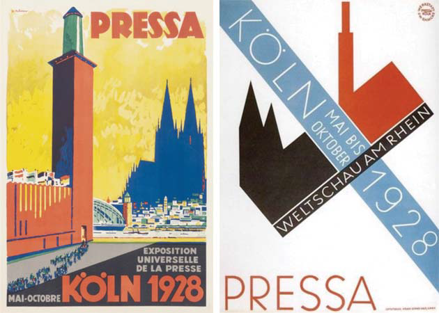

# 现代主义运动（3）
## 扬·茨池侯德与新字体
### 扬·茨池侯德与20世纪早期构成主义
#### 生平背景
- **扬·茨池侯德**（Jan Tschichold, 1902-1974）是构成主义观念中最具影响力的倡导者之一
- 在德国莱比锡接受过**良好的书法训练**，并从事广告、品牌名称以及服务中使用的展示字体设计
- 1923年参观了魏玛**包豪斯**（Bauhaus）的展览，对**无衬线字体**（Sans-serif fonts）和**非对称式书籍页面设计**产生兴趣

#### 设计理念
- 茨池侯德提倡在页面设计中**综合考虑文字和图片的布局**，淘汰**装饰性的书边与印刷花饰**
- 强调将字体与缩写、统一的符号与易识别的图像相综合，例如为《**书坛**》杂志设计的商标
- 关注点主要在**商业性印刷范畴**，包括海报、信纸、产品目录与书籍

#### 影响与作品
- 在《**新版式**》（Die Neue Typographie）一书中阐述了他的设计手法，对后世平面设计师，尤其是瑞士平面设计师产生了深远影响
- 提倡**清晰直接**的交流手法、**无衬线字体**的使用、图片印刷采用的**半色调**以及**非对称式**的版面布局
- 反对**手绘插图**的使用，强调**理性使用**非对称式局部，以引导读者视线的移动

#### 设计原则
- 文字与文字间的价值与明确的侧重点、逻辑关系**受内容左右**，强调**清晰而明确的表达**
- 使用字体比例的大小、轻重、"线"的布局、颜色的使用和图片的选择，来促进信息的有效传达
- 在海报设计中强调"**直角元素**"的使用，以及**白色空间**的重要性，以吸引读者视线并传达经济以及纯粹的侧重

#### 特殊贡献
- 其代表性作品通常作为出版公司的设计委托，体现出**将字体与图像综合的能力**
- 在现代读者**有限的阅读时间**下，要求印刷材料能**积极吸引读者视线**并**有效传达信息**
- 通过不同比例的铅字、布局与色彩等因素的协调，实现**逻辑性的文字布局**

### 茨池侯德的《新版式》及其对印刷工艺的影响
#### 网格结构与版面设计
- 茨池侯德强调使用基于几何“**网格结构**”（Geometric grid structures）来**调整版面元素间的层次关系**
- 网格结构保证了页面上**横排与竖排元素间关系的精确性**，为**活版印刷**提供了基础
- 这种方法成为“**瑞士或国际字体风格**”（Swiss or International Typographic Style）的基础，并用于**发展企业的统一视觉身份**

#### 版面设计的规范化与创新
- 新版面设计为设计师强加了**一定程度的规范化**，但同时强调**调整与完善的必要性**，而不是简单套用公式
- 设计中的**抽象平衡**带有**内在的“正规”性**，强调页面中不同元素间信息层次的**主次关系**
- 指导方针虽可以作为**制度甚至条约**，但**不能完全系统化**，要求考虑信息交流的**逻辑性和有效性**

#### 摄影在现代印刷中的应用
- 茨池侯德积极宣传在印刷中使用**半色调图片**，认为**摄影**是时代最显著的视觉表现形式
- 摄影不仅提供了不同程度的色调与文字之间的呼应，还确保了**吸引读者注意力的统一性**
- “**图像制版**”（Image plate making）为印刷工业提供了新的可能，特别是在广告和政治宣传中的应用

#### 摄影技术的创新应用
- 茨池侯德在《新版式》中列举了“**黑影照片**”（Photograms）的实例，并阐述了**直接曝光于感光板的暗房程序**
- 通过**蒙太奇技术**，将摄影图像与文字**并置**，创造出有力的视觉效果
- 摄影的直接性和忠实表现力，特别是与表现性绘画及插图作品相比，为设计提供了独特的视觉语言

#### 商业应用与视觉连贯性
- 德国摄影师兼设计师**马克斯·波柯茨**（Max Burchartz）采用**蒙太奇手法**，强调**摄影的直接性**和**产品视觉的统一性**
- 在产品目录设计中**有效利用摄影与布局**，加之**对产品的文字介绍**，便于读者**了解公司产品**
- 通过采用“**印刷水线**”（Printed waterlines）作为间距，体现视觉上的连贯性，平衡促销和产品信息的流畅关系

### 摄影在20世纪平面设计中的革新应用
#### 约翰·哈特费尔德的影响力
- **约翰·哈特费尔德**（John Heartfield）作为**达达派艺术家和共产主义者**，在平面设计中有效地使用**摄影**作为塑造舆论和煽动手段的工具
- 与苏联的**构成主义者**不同，哈特费尔德的作品更多是作为“**旁观者**”的成果，目的在于动摇当时的政治权威并影响工人阶级
- 他的作品多以**剪贴组合手法**制作，再通过**摄影技术**进行**印刷**，这种技术的应用使得作品表面呈现出**独特的粗糙质感**

#### 摄影的力量与应用
- 哈特费尔德的作品中展现了图像之间**熟悉、相关、陌生甚至对立含义间的冲突**，通过这种对比强化了作品的**视觉表现力**
- 将客观及**非个人化的摄影技术**与**达达主义的拼贴技巧**结合，提高了**图像并置的煽动性**
- 他的设计**缺乏幽默感**，反映在作品中的是**更加严肃和直接的政治批判**，例如1932年设计的《**日内瓦的意义**》封面，通过强烈的视觉符号传达和平结束的信息

#### 赫伯特·拜尔的创新设计
- **赫伯特·拜尔**（Herbert Bayer）离开包豪斯（Bauhaus）后，将摄影与拼贴、蒙太奇技巧应用于**商业广告和杂志封面设计**，展示了摄影作为大众媒介的**强大说服力**
- 在《**新路线**》杂志封面设计中，拜尔利用高质量的**四色印刷技术**和大胆的**视觉并置**，创造出具有强烈吸引力的图像，促使读者产生对当代重大事件的联想
- 拜尔的设计**几乎不使用文字**，通过**视觉元素本身**讲述故事，例如1930年杂志封面，通过对比和简化的手法，创造了一种过去与现实并置的氛围

#### 平面设计的政治与艺术价值
- 摄影在两次世界大战之间的平面设计中显示出其重要性，不仅在广告领域，还作为一种**公众艺术**，在分歧的政治气候中展示了其**比文字更强大的力量**
- 艺术家、政府和商人都认识到摄影**作为一种大众媒介的潜在影响力**，用于广告宣传和塑造公众观念
- 通过摄影和平面设计的结合，创造了**新的视觉语言和表达形式**，强化了设计的社会功能和艺术价值

### “新版式”在20世纪初的影响与应用
#### 杂志与平版印刷海报的艺术定位
- “**新版式**”在20世纪20年代晚期欧洲和美国杂志的艺术定位中**占据重要地位**，拜尔的实践表明了在字体与双页印刷中的创造性探索
- **平版印刷海报**，如1928年科隆世界博览会海报，展示了“新版式”元素，使用单一大写无衬线字体，通过颜色、比例和留白建立**信息的主次关系**
- 海报设计中**简化抽象的符号**用于表现科隆哥特式教堂双塔和展览会高塔，体现科隆城天际线

#### 德国国家社会主义与“新版式”
- 德国国家社会主义工人党利用**摄影蒙太奇技巧**，支持纳粹党和希特勒，如1936年设计的海报展示了大众收音机作为集会外参与形式的重要性
- 海报中传统和国家标准的**德国哥特式字体**强化了信息传达，同时**并置手法**预示着**收音机**在团结国家方面的作用
- 尽管纳粹政府利用“新版式”技巧，但对包豪斯艺术活动和构成主义支持者**持怀疑态度**，导致茨池侯德和其他艺术家**遭受迫害**

#### 茨池侯德对“新版式”的反思和影响
- 茨池侯德在遭遇纳粹迫害后**流亡瑞士**，开始反思早期批判性文章中的观点，认识到**没有一种单一风格**能满足所有印刷品的要求
- 他倾向于使用**更灵活的设计对话**，反对将刻板理论强加于设计任务，强调创造性的现代平面设计的**多样性和差异性尊重**
- 茨池侯德的这一转变暗示了**对“新版式”独裁和争议的排斥**，他的设计哲学最终影响了后世对平面设计的理解和实践

#### “新版式”在国际上的扩展和应用
- 在德国和瑞士之外，少数设计师如波兰的**亨里克·伯勒威**也追随“新版式”，在广告设计中使用无衬线字体、非对称版面布局和抽象几何图形
- 伯勒威的声明反映了对个人主义的抵制和对**现代多元生活方式**的赞赏，他的作品鼓励将**广播**作为新的宣传形式
- 通过创新的设计技巧，如使用**印刷水线**和**对角排列的铅字**，伯勒威的广告作品不仅传达电子信息交流的概念，还象征广播塔上的天线

## 英国与现代设计
### 英国与现代设计的发展
#### 爱德华·约翰斯顿的贡献
- **爱德华·约翰斯顿**（Edward Johnston）为**白鸽出版社**（Doves Press）设计了**装饰性的缩写字母**，展示了其**在字体设计上的才华**
- 1916年为**伦敦地铁**设计的**无衬线字体**，至今仍在使用，体现了其设计的长久影响力
- 该无衬线字体应**弗兰克·皮克**（Frank Pick）之邀，专为**地下铁路系统**创作，展示了现代交通视觉交流的需求

#### 埃里克·吉尔的设计实践
- **埃里克·吉尔**（Eric Gill）是**雕塑师兼字体设计师**，为英国莫诺铸排机公司设计了**吉尔无衬线字体**（Gill Sans），广泛应用于**公共交通系统**
- 吉尔无衬线字体在设计上少了**机械化与几何形**的特征，依赖于**弧形或直边**，避免采用草写体形式
- 通过对英国**蒙纳字体**（Monotype）及私人出版物的研究，创造了包括“Perpetua”在内的**复杂精致字体**

#### 英国无衬线字体的特点
- 英国设计师在**无衬线字体形式**的设计上，展现出不同于欧洲大陆同行的独特风格，更加重视**弧形和直边**的使用
- 这些设计反映了英国字体设计的**传统与创新**，并在公共交通等领域找到了其实际应用
- 约翰斯顿和吉尔的工作不仅限于字体设计，还包括了针对印刷从业人员的**广泛论文和书籍**，处理行业的实践、审美、学术和社会问题

#### 对传统与现代的融合
- 通过继续基于**罗马字母**进行创新，英国设计师能够创造出**更复杂精致的字体设计**
- 吉尔设计的**Perpetua字体**是对传统字母形式的**现代诠释**，小写字母的上伸与下伸添加，以及字碗笔触的调整，体现了设计的精细考量
- 这些设计实践反映了英国设计师在尊重传统的同时，对现代设计需求的响应和创新思维

### 英国的现代设计与字体创新
#### 字体设计与应用
- **斯坦利·莫里森**（Stanley Morison）通过改良历史字体设计，如**泰晤士新罗马字体**（Times New Roman），适应**现代印刷技术**的需要
- **爱德华·约翰斯顿**（Edward Johnston）与**埃里克·吉尔**（Eric Gill）强调了主体文字发展，展示了**无衬线字体**（Sans-serif fonts）在交通运输领域的应用优势
- 吉尔为英国莫诺铸排机公司设计的**吉尔无衬线字体**（Gill Sans）在伦敦及东北铁路公司的印刷材料中广泛应用，反映了设计师对企业品牌统一视觉策略的贡献

#### 现代印刷与设计的社会影响
- 英国设计师在两次世界大战期间继承并发展了**17世纪的印刷与字体设计传统**，适应了商业印刷的扩展和新技术的挑战
- **比阿特丽斯·沃德**（Beatrice Warde）通过《**水晶杯**》隐喻，强调了理想印刷字体的透明性和内容展示的重要性

- **企鹅公司的平装小说系列**，针对现代生活中的**铁路旅客**设计，展示了印刷材料在现代社会多样角色的体现

#### 设计创新与家具设计
- 企鹅平装小说系列的推出配合了便于携带的“**毛驴书架**”（Donkey Bookshelf），由**爱兹康公司**生产，体现了非传统的设计思维
- 书架的设计考虑了**企鹅平装小说的尺寸**，展示了设计与日常生活需求的**紧密结合**
- **埃贡·瑞斯**（Egon Riss）的设计通过使用**有机胶合板材料**和**非对称隔断**，创新了书架的形态和功能，体现了现代设计理念的实践

### 伦敦交通系统的设计
#### 视觉身份的创造
- **弗兰克·皮克**（Frank Pick）利用视觉传达技巧为伦敦客运总署创造了统一的“**视觉身份系统**”（Visual Identity System），包括建筑、室内设计、家具及标牌
- 统一的形象系统为公众提供了**条理、可靠性和协调性**，强化了对地下铁路系统不同线路与中转站的控制感
- 通过站台墙上的**彩色旅游宣传海报**，鼓励游客探索伦敦及其城郊的旅游景点

#### 设计手法与公众交流
- 海报设计如**麦克奈特·考弗**（McKnight Kauffer）的**冬季削价海报**，采用简化形式和统一视点的缺失，与传统插图技巧形成反差
- **亨利·贝克**（Henry Beck）的**伦敦地下铁路交通示意图**（London Underground Map）以几何网格为基础，简化了信息交流，使乘客易于识别站点与线路联系
- 此交通图虽然简化了设计，但未考虑**统一比例**，可能导致旅客误判站点间距离及长距离步行的需要

#### 抽象几何元素在设计中的应用
- 皮克的设计方法展示了**抽象几何元素**在实现普遍视觉交流中的潜力，特别是在航空运输标志设计中得到应用
- **奥托·诺伊拉特**（Otto Neurath）发起的**伊索体系运动**（Isotype movement），尝试发展统一的“**图示符号**”（Pictograms）以直接方式进行统计交流，促进社会与商业问题的公众信息共享
- 伊索体系运动与伦敦地下铁路交通示意图一样，在两次世界大战间对平面设计领域的发展做出了贡献

## 斯堪的纳维亚与现代设计
### 斯堪的纳维亚设计手法的兴起与特征
#### 斯堪的纳维亚设计的背景
- 斯堪的纳维亚在**20世纪30年代**成为**国际现代设计的范例**，其设计手法介于标准化、高效率与现代生活的心理需求之间
- 设计起点可追溯至瑞典，通过设计师如**爱德华·哈尔德**（Edward Hald）和**西蒙·盖特**（Simon Gate）在**奥勒福斯**（Orrefors）玻璃制品商的工作开始

#### 设计风格与影响
- 哈尔德和盖特的设计作品在**1925年巴黎国际装饰艺术与现代工业博览会**中展出，展示了瑞典玻璃艺术品的国际竞争力
- 哈尔德的作品在风格与技术上与当时的巴黎设计师如**勒内·拉利克**以及美国设计师**斯托本**的作品相似，展示了**蚀刻技术与吹制工艺的结合**

#### 设计推广与标准化
- 瑞典工业设计协会在**格雷戈尔·保尔森**（Gregor Paulsson）的指导下，受**赫尔曼·穆特西乌斯**（Hermann Muthesius）观念影响，推广**实用性为基础的设计标准**
- 20世纪30年代，斯堪的纳维亚设计的特征为**个人主义与传统手工艺的平衡**，以及标准化与机械化生产方式的有效整合
- 斯堪的纳维亚现代主义通过**瑞典和芬兰设计师**在世博会的作品中得以体现，强调实用性与美学的融合

#### 斯堪的纳维亚在建筑与家具设计中的应用
- 斯堪的纳维亚的设计手法不仅体现在玻璃艺术品上，也广泛应用于**建筑领域和家具设计**，展现了其设计理念的广泛影响
- 设计中的**简约主义**和**对自然材料的偏好**反映了斯堪的纳维亚对现代工业科技影响下社会和审美问题的独特回应

### 阿尔瓦·阿尔托的设计哲学
#### 家具设计的革新
- **阿尔瓦·阿尔托**（Alvar Aalto）通过使用**叠层桦木板材料**（Laminated Birch Plywood）与**模压工艺**（Moulding Process），创新了家具设计，尤其是其**桦木椅子**（Birch Chair）被视为斯堪的纳维亚式综合性现代主义风格的典范
- 阿尔托的设计在1937年**巴黎世界博览会**与1939年**纽约世界博览会**中展出，强调了**工业化程序在材料使用上的革新**
- 阿尔托借鉴**滑雪橇制作工艺**应用于椅子设计，注重材料的自然属性与有机外观，体现在为帕伊米奥城结核疗养院设计的扶手椅上

#### 工业材料与自然美学的融合
- 尽管采用**工业化生产过程**，阿尔托的家具设计依然注重**舒适、心理和审美因素**，超越对功用和经济的单一关注
- 阿尔托设计中的**简约与自然**保持连带关系，通过减少家具装饰、采用胶合板取代手工雕刻木材，实现了**生产系列化与外观统一化**
- 他的作品在模压工业家具领域中，呈现出与同时代设计的**柔和对比**，尤其是与使用**纯净几何形态和朴素简约设计**的家具相比

#### 心理学与审美在设计中的角色
- 阿尔托将**心理学与审美关注**纳入设计理念，认为扩展“**理性**”概念的范畴是实现更人性化建筑环境的途径之一
- 他强调对与物品相关需求的**理性检验**，包括**心理需求**，提倡在设计过程中考虑**人性化结果**，避免产生非人性化的设计
- 阿尔托的观点与早期以及同时代的设计理念形成对比，其中**工业设计**常视为解决社会问题的手段，阿尔托更注重**个性化的表达和心理需求的满足**

### 斯堪的纳维亚现代设计中的创新与传统
#### 布鲁诺·马松的家具设计
- **布鲁诺·马松**（Bruno Mathsson）是20世纪30年代最先在设计中采用**叠层木板**（Laminated Wood）与**有机外形**的瑞典设计师
- 他的扶手椅设计采用**带状编织材料表面**，体现了对**人体坐姿**理想比例的研究与遵循
- 马松的设计强调家具外观的**雕塑式形态**和结构上的**细节处理**，例如**椅腿**的设计与**扶手**的**额外结构支撑**

#### 丹麦设计师的贡献
- **乔治·延森**（Georg Jensen）通过**餐具器皿的设计**建立了国际声誉，他的作品展示了**高超的银制品工艺**

- **卡雷·克林特**（Kaare Klint）的家具设计强调**简约几何形态**和**木材自然表面**的保留，减少或淘汰雕刻装饰

- 克林特的家具采用**手工制作工艺**，关注结构质地的结实与对细节的精细处理，避免了家具的频繁更换

#### 现代设计的多方面回应
- 克林特的设计不仅仅受功能性左右，而是在现代家居生活中寻找**长久性的解决方案**，如餐具柜设计就是以**日常用品尺寸**为标准
- 他的现代设计作品在结构上**耗时且价格昂贵**，但通过对起居和备餐等日常生活方面的研究，找到了**家居问题的解决方法**
- 克林特的设计理念涉及直觉与逻辑性、诗意与科学的结合，旨在为现代家居生活提供**实用而又审美的设计解决方案**
