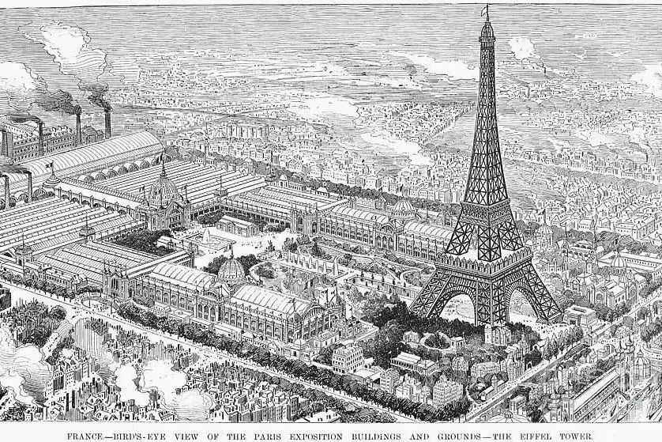

# 现代设计萌发的时代背景和促进因素
## 时代背景
* 进入19世纪以来，建筑上、设计上的**复古风潮**此起彼伏，如何处理和借鉴历史上的各种风格，成了建筑界面临的一个主要问题
* 到19世纪中期，少数先进的设计思想家已经清醒地看到：传统的建筑风格和未来的建筑风格之间可能存在**冲突和矛盾**，并且开始质疑未来的建筑是否必须采用历史风格作为依据；但是他们尚未能提出可能的解决方式和新的形式来
* **卡尔·佛列德里克·辛克尔**、**亨利·拉布罗斯特**（Henri Labrouste）、**亨利·里查逊**（Henry Hobson Richardson）等人，大胆采用新的建筑技术、新的建筑材料，对古典风格进行**综合与折中处理**；他们认为古典风格与现代需求之间应该存在**延续关系**，深信对历史风格的折中和综合应用是建筑发展的未来

* 但建筑的发展是否还能够继续遵循传统方式进行，历史风格是否依然是设计的必然模式，已经受到**质疑**；辛克尔代表的这种**对于传统高度重视**的观点，虽然在西方还有相当大的市场和支持，但已经受到现代建筑思想越来越强烈的冲击
## 现代设计的促进因素
### 初期世界博览会的促进作用
* 19世纪建筑、设计上的重大突破点之一，是该世纪下半期欧洲和美国一系列的**世界博览会**的规划和兴建；因为博览会的特殊要求，从而导致了新建筑形式和新建筑技术的发展和普及应用
* 而这些博览会绝大部分是为展示**工业产品**而举行的，因此，从产品设计的角度来看，这些博览会也是**现代工业产品设计的开端**；1851年在“水晶宫”举办的**伦敦世界博览会**被认为是现代工业产品设计的开始
* 长期以来，基于**重农主义**的封建立场，除**英国**以外的大部分欧洲国家一直严格控制对外贸易，并采用各种法令来**阻止对外贸易**；1850年前后，随着**工业革命**的发展，欧洲各国先后进入**资本主义阶段**，为了促进国际贸易，这些国家都纷纷**取消了关税壁垒**，并且重视**出口贸易**的发展
* 1851年，在伦敦海德公园水晶宫内举办的**世界博览会**（正式名称为The Exhibition of Art and Industry，史书上也常称作The Great Exhibition），是设计史上的一个**分水岭**，显示欧洲已经出现了一种和以往不同的**中产阶级消费文化**，追求能够表现出他们的社会转型、个性特点，展示华丽、进取精神面貌的产品

  * 为了炫耀国力，展示工业革命带来的伟大成果，**英国**在1850年提出了举办**世界博览会**（The Great Exhibition of 1851）的建议，得到欧洲各国的积极响应；此事由英国的**阿尔伯特亲王**（Prince Albert of Saxe-Coburg and Gotha，1819—1861，他是维多利亚女王的丈夫）主持，地点选择在**伦敦海德公园**内
  * 在以往所有时代里，**装饰和工业美术**（industrial arts）从未得到过如此广泛的关注，引起如此强烈的兴趣，激起公众如此丰富的想象力，这些关注、兴趣甚至已经跨越了当时存在的阶级藩篱
  * 这一届伦敦展览会大大扩展了以往曾在巴黎举办过的工业展览的规模，共展出1.4万件产品，其中一半来自英国以外的其他国家；在6个月的展期内，吸引了超过600万观众，其中相当多人来自英国国外，从而使得这次展览真正具有重大的国际意义
    * 随着1869年**第一家百货公司**“the Bon Marche”在巴黎开张，**梅西公司**（Macy‘s）在纽约，**万纳市场**（Wanamaker‘s）在费城，谢菲尔德（Serfield）在伦敦相继成立；这些商品门类齐全的大型百货公司不仅用其庞大的多层建筑吸引了消费者的目光，也以合理的价格、不时举办的降价销售等促销活动点燃了消费者的购买热潮
  * 除了上述的具体影响之外，“水晶宫”展览对于现代工业设计的影响还表现在引发了对于**现代设计思想**的讨论；针对部分展出的工业产品采用**古典主义风格**装饰，也包括“水晶宫”采用古典主义设计风格的倾向，一部分人认为这种趋向**不可取**，现代设计与古典风格之间并没有内在的联系，因此造成形式与内容的分离，也造成功能与形式的脱离
    * “水晶宫”展览刚一开幕，《**伦敦时报**》（The Times of London）就尖锐地指出：“在装饰设计方面没有任何原则和标准，是这次展览暴露出来的大问题，而且似乎整个欧洲的艺术生产界都还根本没有准备好”；当时还没有“**设计**”（design）一词，而是用“Art Manufacturer”来代指
* 为了纪念法国大革命一百周年，1889年的世界博览会在**巴黎**举行；这届博览会上的两个标志性建筑给世人留下深刻印象：一个是由法国工程师**古斯塔夫·埃菲尔**（Alexandre Gustave Eiffel，1832—1923）设计和监督兴建的**埃菲尔铁塔**（La Tour Eiffel），另一个是由工程师**维克多·康塔明**（Victor Contamin）设计的**机械大展厅**（Palais des Machines）

* 1893年，为了纪念哥伦布发现新大陆400周年，名为“**世界哥伦比亚博览会**”（World‘s Columbia Exhibition）的世界博览会，在美国**芝加哥**举行；此时距1871年的**芝加哥大火**刚刚22年，芝加哥已经从灾后重建阶段迎来了黄金时代，成为美国工商业重镇

  * 这次展览对于**美国建筑的发展**，对于美国**国家文化价值观的建立**都产生了重大的影响
* 19世纪这些在各国大都市（基本上都是制造业和贸易重镇）举办的世界博览会取得很大成功，促进了国际贸易，刺激了生产，娱乐和教育了消费大众，也由此促进了现代设计的发展
### 专利制度对于现代设计的促进作用
* **专利法**在西方已经有相当悠久的历史了，早在**公元5世纪**，中世纪的统治者已经允许发明者拥有对所发明之物的“垄断”权利
* 正式的立法，出现在**1474年的意大利**，政府法令授予发明者对其发明物拥有独占的权利
* 1624年，英国政府通过了一项名为《**垄断条例**》（Statute of Monopolies）的提案，确定任何“新”的发明在14年内，都拥有垄断的权利；150年后，法国也制定了名为《**创新法令**》（Innovative Law）的专利法，确认发明者对于他的发明拥有所有权
* 1790年美国的制宪会议将有关专利的条款加入到**美国宪法**中去了；美国最初的**专利法**，设定的时间限度是14年，保护的对象是有用的、重要的、新的发明（useful，important and new inventions），这份1790年的专利法非常重要的一点是：申请者在提交申请时必须附有对于自己的发明的**说明**
* 1790—1900年间，仅仅美国专利局，就收到了60万份新的专利申请，与此同时，工业产品的门类、品种极大地丰富起来
## 英国的设计改革和“工艺美术”运动
### 英国的设计改革
* 工业革命最先在英国发生，并不是偶然的；**启蒙运动**带来思想的解放和科学的昌明，不断扩展的**海上贸易**又带来了广阔市场及丰富的原材料，英国本土上**煤矿的大量发现**为蒸汽机车提供了充足的燃料，也带动了纺织厂、铸造厂的运转
  * 工业革命引起了深刻的经济、社会、艺术大变革，手工劳动被**机器制造**所代替，祖祖辈辈生活在田野的农民离开了土地，**进入城市**；也带来了巨大的机会，催生了一个新的社会阶层——**中产阶级**，他们有能力购买工业生产制造的日用品，而这在过去只是上层社会的专利
  * 工业进程为大英帝国提供了巨大的**财富**，但同时也引发了各种**社会病**——城市里急剧增长的人口、污染、娼妓、童工、劳工阶层普遍的穷困
* 在工业化时代里，同一种产品的**生产流程**已经与过去完全不一样了；以往的**手工生产**，产品从头到尾基本是由同一个人完成的，而早在1776年，苏格兰哲学家、经济学家**亚当·斯密**（Adam Smith，1723—1790）在他的名作《**国富论**》（The Wealth of Nations）中就已指出，生产一颗简单的图钉，已经细分成18道不同工序，由生产线上不同的工人完成了
* 1836年，英国议会的**艺术和生产特别委员会**（Parliamentary Select Committee on Art and Manufactures）发表了一份报告，报告中指出：与法国、德国、美国的产品相比，英国产品在质量上和外观上都显得不足，缺乏竞争力，担心英国会在出口贸易中落败
* 以**亨利·科尔**、**理查德·里德格雷夫**（Richard Redgrave）和**阿尔伯特亲王**为代表的一批改革派人士，企望通过行政机构设定一些广泛适用的，带有普遍性、指导性的设计原则，来指导如何将装饰艺术实施到工业制造的各类商品上去，以纠正当时设计上存在的偏差
  * 首先，**装饰**应从属于产品的形状
  * 其次，产品的形状必须根据**产品的功能**和**所用的材料**来决定
  * 再次，设计应该以**英国历史风格**，或**非西方的传统风格**，抑或**大自然中的动植物**为依据，提炼出简洁的、线性的装饰动机来
* **改革派**主张：真实的装饰，并不是单纯地模仿自然物件，而是根据被装饰物品的形状和材料特性，根据艺术规律，根据生产过程的可能性，有限度地从大自然中找到合适的形状和色彩之美；理查德·里德格雷夫设计的一个玻璃水瓶——“**泉**”，很好地体现了改革派的这些主张
  * 他在瓶身画上了茂密的**芦苇**，与水瓶作为**盛水工具**的功能非常匹配，芦苇的根生长在水面下，叶绿而茂密，这是从观察自然而得到的体验；然而芦苇的根又抽象成交叉的**线性图案**，而不是单纯地抄袭自然
  * 玻璃材料的**透明**性，正好展示了水的特质与所绘装饰图案的**交融**，也显示了瓶身的**三维造型**

* 改革派的另一个重要措施是设立了几家由政府管辖的**设计学校**（其中包括皇家艺术学院、圣马丁设计学院等名校的前身），以期加强对青年设计师的教育和训练
* **亨利·科尔**在他漫长的公职生涯中，一直非常注重**公众教育**，他认为公共博物馆应该照顾到**劳工阶级的兴趣**，为社会提供负责任的社会行为、和谐社会关系的榜样和模式；他力主将伦敦博览会的盈余用于创办了**南肯星顿博物馆**（即今日的**维多利亚-阿尔伯特博物馆**），该馆是目前世界上**最大的**装饰艺术和设计博物馆，藏品超过450万件

* 另一个导致设计改革（尤其在室内设计和家具设计方面）的原因，是当时社会上日益增强的**对于健康和卫生的重视**
  * 19世纪里，经常发生的**霍乱**等疫情给社会带来很大的困扰，医学界已经发现了**细菌和病毒**
  * 由于当时的家具大部分是**木制的**，臭虫时常藏在床架、椅座里面，即便是贵族家庭里也无法避免，而那些**烦琐的雕饰**尤易藏污纳垢，难以清理，使情势更为恶化；工厂烟囱里喷出的**煤烟**，令都市里每一栋住宅都无法避免被污染
* 关于健康和卫生的新概念，也引发了1860年代到1880年代的**美学运动**（Aesthetic Movement）；该运动的发起人**爱德华·威廉·古德温**（Edward William Godwin）宣称“绒毛和尘埃是生命的两大敌人”

  * **美学运动**彻底**反对任何的历史借鉴**，主张从生活本身、从人类各种感官经验中获取灵感来设计；他们强调，美可以存在于**世俗生活**中，可以存在于异国情调中，也可以存在于非常简单的东西里面，不论是西方的，或者是非西方的，甚至是当代的设计，只要喜欢，便可以**混在一起**
  * 他们的格言是“**为艺术而艺术**”（Art for Art‘s Sake），这一格言当时在英国的中产阶级圈子里相当风行
* 不过，19世纪下半叶英国的这场设计改革运动，从来也**没有彻底达到它的目的**
  * 改革派们忽略了这样一个事实：在自由贸易和自由企业经济中，实际功能与美好外形的协调统一只是促使消费者购买商品的**多种动机之一**；事实上，生产者和消费者的品位更多地取决于对于自身身份、社会地位的不同设定，标准和原则**并不能放之四海而皆准**
  * 然而，这场运动的确为现代设计奠下了**理论基石**
## 设计改革的思想基础——拉斯金提出设计革命 