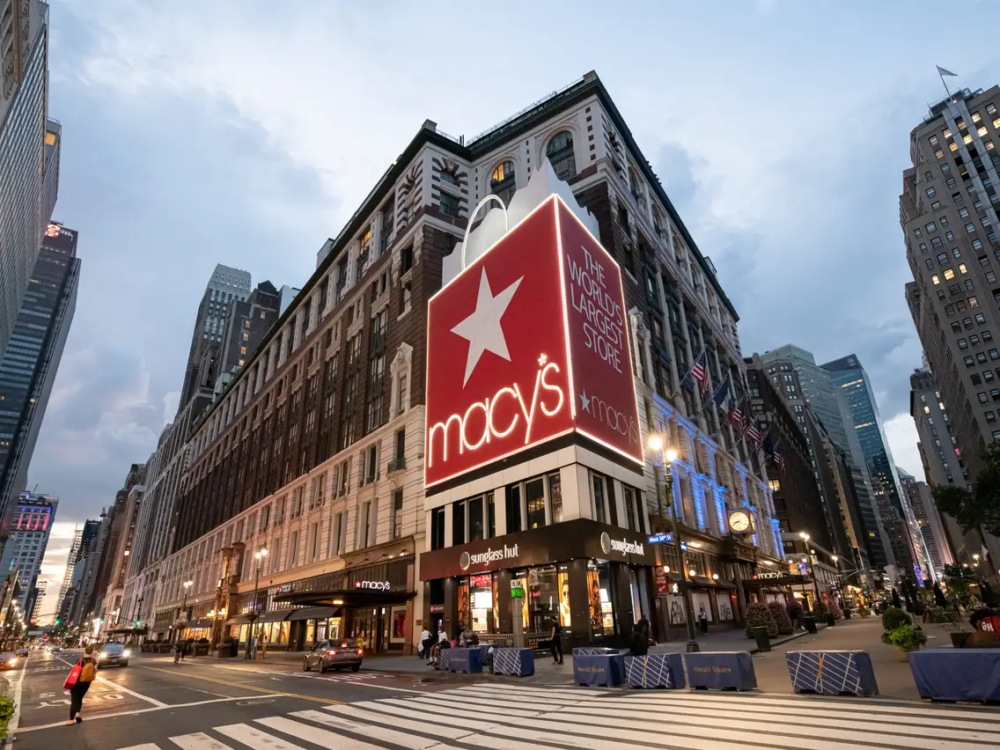

# 美国的设计
## 
### 美国20世纪30年代的设计与艺术创新
#### 美国设计领域的保守倾向与变革
- 美国在20世纪20年代中期之前，设计领域保持了**手工艺基础的保守倾向**，未受法国及欧洲其他国家装饰艺术设计师影响
- 尽管最初由于**赫伯特·胡佛**（Herbert Hoover）的建议拒绝参加**1925年国际装饰艺术与现代工业博览会**，美国最终还是参与了博览会并受其启发
- **大都会艺术博物馆**（Metropolitan Museum of Art）在20世纪20年代每年举办现代装饰与工业艺术展览，推广**现代风格**

#### 艺术与工业设计的交融
- 芬兰建筑师**埃列尔·沙里宁**（Eliel Saarinen）设计的木质座椅和**悉尼·沃**（Sydney Waugh）为斯托本玻璃制品公司设计的蚀刻玻璃碗展示了新形式和新材料的探索
- **克兰布鲁克艺术学院**（Cranbrook Academy of Art）由沙里宁一家创建，成为艺术与实用艺术教育的中心
- **玛格丽特·佐拉奇**（Marguerite Zorach）的地毯设计采用手工编织技巧，展现野兽派绘画灵感和印尼蜡纺印花技术

#### 现代设计在商业与文化中的应用
- 美国零售商认识到支持当代消费品设计的商业价值，如**洛德泰勒**（Lord & Taylor）和**梅西**（Macy's）等百货公司展示了法国设计师的奢华品
- 博物馆和杂志通过教育和宣传推广现代生活方式，强调**艺术融入中产阶级生活的重要性**
- 现代设计不仅是时尚、体育、旅行与积极休闲活动的象征，也为**文化进步**做出贡献，提升公众品味

### 美国在20世纪30年代的设计创新与艺术发展
#### 美国制造商与现代风格的拥抱
- 美国制造商在1925年巴黎博览会后开始聘请**具有欧洲教育背景的艺术家**，致力于现代风格家具及家居陈设品的设计
- 这些设计作品通常带有**表现主义的装饰性**，特征是**生硬且棱角分明**的设计语言，与美国高层建筑设计中的**巨大凹凸轮廓及雕塑般的装饰**相呼应

#### 建筑与家居设计的相互影响
- **克莱斯勒大厦**（Chrysler Building）由**威廉·范艾伦**（William Van Alen）设计，以及**保罗·弗兰克尔**（Paul Frankl）设计的摩天大楼灵感书架，展现了摩天楼风格在家具和室内陈设领域的应用
- **雷蒙德·胡德**（Raymond Hood）的**商务主管办公室样板间设计**，采用工业材料铝，与棱角和梭形元素的侧重展示了工业材料在室内设计中的重要角色

#### 艺术与工艺的创新表达
- **露丝·里夫斯**（Ruth Reeves）的纺织品设计《**电器化**》（Electrification），通过“之”字形重叠图案传达速度感和电能力量

- **尼兰·格林**（Nilan Green）利用不同尺寸的“**字母模板**”创造密集的抽象图案，体现了科技与都市生活创造的快速节奏
- **亨丽埃特·赖斯**（Henrietta Reiss）在纺织品创作中采用丝网印刷工艺，其《**韵律系列**》（Rhythmic Series）通过特殊工艺表达抽象纹理

#### 现代设计在文化与生活中的影响
- 设计师通过新的工艺流程和材料使用，探索了**与时代相符的表达方式**，如通过丝网印刷和新纺织品设计，反映了现代生活的动态和美学
- 艺术家作品，如**约瑟夫·斯特拉**（Joseph Stella）和**约翰·马林**（John Marin）的绘画，展现了对现代大都市的迷人与宏伟的艺术体现
- 现代设计不仅体现在视觉艺术中，也在音乐领域如**爵士乐**中找到表达，反映了对快速都市生活的热情和追求

### 美国20世纪20年代的现代设计与消费文化
#### 现代设计的推广与影响
- 美国在20世纪20年代通过博物馆展览、大型百货公司和高层摩天楼的设计及室内陈设**推广现代设计**
- 尽管存在**艺术与工业之间的联盟**，现代设计主要吸引了**高消费阶层**，但通过杂志、广告和电影院室内布景等途径触及了**广泛公众**

#### 设计创作的商业化与普及
- 低成本的现代装饰产品开始融入立体主义、未来主义影响，使得低收入家庭通过**购买个性家居用品**模仿富裕生活方式
- **鲁本·黑利**（Reuben Haley）设计的**卢巴罗贝克玻璃花瓶**展示了雕塑特点和多面性霜化玻璃材质，为联合玻璃制品公司设计

- **维克多·斯科勾斯**（Viktor Schreckengost）及**唐纳德·斯科勾斯**（Donald Schreckengost）兄弟的**陶瓷设计工作**体现了现代感外观与图案

#### 消费者对现代与传统设计的接受
- 美国消费者接受20世纪20年代的设计作为新材料和社会进步的认同，设计与现代生活的联系通过**强大的广告宣传**实现
- **辛克莱·刘易斯**在《**巴比特**》中通过**广告和设计产品**描绘了美国中产阶级生活，反映了现代设计产品给消费者带来的**心理满足**
- 市场对“现代”与“传统”的**分类需求**与现实市场环境存在冲突，消费者的设计品味受到**历史、文化和时尚影响**

### 工业设计与福特制在20世纪早期的美国
#### 福特制与现代设计的推广
- 工业设计波及机械工业、机动车生产、家用电子以及电气产品领域，**亨利·福特**（Henry Ford）的**福特汽车公司**通过**T型汽车**的标准化生产引领工业生产优势
- **福特制**被视为**社会文化民主化进程**的代表，体现了大众生活标准的普及与进步
- 美国工业化被认为是**经济复苏与繁荣的基础**，商业、机械化及生产流水线在美国文化中具有几乎**宗教性**的重要性

#### 福特T型汽车的生产革命
- 福特T型汽车的成功基于高效率机器的使用、标准化兼容性的零部件以及对劳动力科学的管理，实现了**组装速度的提升**与**零部件的精确和标准化**之间的融合
- 亨利·福特的“福特制”**工业流程**是对**亚当·斯密经济学原理**的实际应用，强调在生产机动车过程中保持每一辆汽车的**品质和外观的一致性**
- T型汽车在设计上采用**相同的黑色表层喷漆**，其外观设计受到**马车车厢**的启发，反映了工业设计中**压制个性化选择和艺术性创造**的趋势

#### 社会影响与消费者文化
- T型汽车的生产**降低了成本**，使得中产阶级以及工人家庭能够通过购买廉价的个性家居用品来仿效富有城市男女的生活方式
- 1914年亨利·福特提出的“**利润共享**”方案，“**五美元一天**”计划，鼓励工人通过使用**信用卡消费方式**拥有**自己生产的T型汽车**，将工厂工人转化为大众消费者
- 福特T型汽车与福特制的成功在市场上**几乎没有遇到实际的竞争**，成功履行了制造标准化汽车的承诺，为逐步扩展的中产阶级及工人家庭的个人汽车市场服务

### 美国汽车产业的变革与消费文化
#### 消费者对汽车需求的变化
- 随着**二手汽车市场**的兴起，美国消费者开始更加关注汽车的**舒适度、奢华性和款式**，这些因素成为决定性的购车考量
- 汽车从简单的交通工具转变为**反映个人品味和身份的消费品**，与时尚和家居消费品地位相仿

#### 通用汽车公司的战略调整
- **通用汽车公司**（General Motors）在**艾尔弗雷德·P·斯隆**（Alfred P. Sloan）的领导下，通过**加强与零售商的联系**，迅速响应新的消费趋势
- 通用公司采用**丰富的车身颜色和瓷漆技术**，**区分车型**并满足消费者**对个性化的追求**
- 通过推出外观设计简洁统一、体积轻巧的**雪佛兰汽车**以及**加大广告投资**，通用汽车公司强化了公众的购买意愿

#### 汽车产业的市场策略与社会影响
- 通用汽车的市场策略表明，汽车生产的目的已经演变为满足消费者对于个性化和身份象征的需求
- 汽车成为了一种**重要的社会文化符号**，其设计、广告和市场定位强化了汽车作为个人品位和社会身份标识的角色
