[TOC]
# 英国的设计改革和“工艺美术”运动
## 英国的设计改革
* 工业革命最先在英国发生，并不是偶然的；**启蒙运动**带来思想的解放和科学的昌明，不断扩展的**海上贸易**又带来了广阔市场及丰富的原材料，英国本土上**煤矿的大量发现**为蒸汽机车提供了充足的燃料，也带动了纺织厂、铸造厂的运转
  * 工业革命引起了深刻的经济、社会、艺术大变革，手工劳动被**机器制造**所代替，祖祖辈辈生活在田野的农民离开了土地，**进入城市**；也带来了巨大的机会，催生了一个新的社会阶层——**中产阶级**，他们有能力购买工业生产制造的日用品，而这在过去只是上层社会的专利
  * 工业进程为大英帝国提供了巨大的**财富**，但同时也引发了各种**社会病**——城市里急剧增长的人口、污染、娼妓、童工、劳工阶层普遍的穷困
* 在工业化时代里，同一种产品的**生产流程**已经与过去完全不一样了；以往的**手工生产**，产品从头到尾基本是由同一个人完成的，而早在1776年，苏格兰哲学家、经济学家***亚当·斯密**（Adam Smith，1723—1790）在他的名作《**国富论**》（The Wealth of Nations）中就已指出，生产一颗简单的图钉，已经细分成18道不同工序，由生产线上不同的工人完成了
* 1836年，英国议会的**艺术和生产特别委员会**（Parliamentary Select Committee on Art and Manufactures）发表了一份报告，报告中指出：与法国、德国、美国的产品相比，英国产品在质量上和外观上都显得不足，缺乏竞争力，担心英国会在出口贸易中落败
* 以**亨利·科尔**、**理查德·里德格雷夫**（Richard Redgrave）和**阿尔伯特亲王**为代表的一批改革派人士，企望通过行政机构设定一些广泛适用的，带有普遍性、指导性的设计原则，来指导如何将装饰艺术实施到工业制造的各类商品上去，以纠正当时设计上存在的偏差
  * 首先，**装饰**应从属于产品的形状
  * 其次，产品的形状必须根据**产品的功能**和**所用的材料**来决定
  * 再次，设计应该以**英国历史风格**，或**非西方的传统风格**，抑或**大自然中的动植物**为依据，提炼出简洁的、线性的装饰动机来
* **改革派**主张：真实的装饰，并不是单纯地模仿自然物件，而是根据被装饰物品的形状和材料特性，根据艺术规律，根据生产过程的可能性，有限度地从大自然中找到合适的形状和色彩之美；理查德·里德格雷夫设计的一个玻璃水瓶——“**泉**”，很好地体现了改革派的这些主张
  * 他在瓶身画上了茂密的**芦苇**，与水瓶作为**盛水工具**的功能非常匹配，芦苇的根生长在水面下，叶绿而茂密，这是从观察自然而得到的体验；然而芦苇的根又抽象成交叉的**线性图案**，而不是单纯地抄袭自然
  * 玻璃材料的**透明**性，正好展示了水的特质与所绘装饰图案的**交融**，也显示了瓶身的**三维造型**

* 改革派的另一个重要措施是设立了几家由政府管辖的**设计学校**（其中包括皇家艺术学院、圣马丁设计学院等名校的前身），以期加强对青年设计师的教育和训练
* **亨利·科尔**在他漫长的公职生涯中，一直非常注重**公众教育**，他认为公共博物馆应该照顾到**劳工阶级的兴趣**，为社会提供负责任的社会行为、和谐社会关系的榜样和模式；他力主将伦敦博览会的盈余用于创办了**南肯星顿博物馆**（即今日的**维多利亚-阿尔伯特博物馆**），该馆是目前世界上**最大的**装饰艺术和设计博物馆，藏品超过450万件
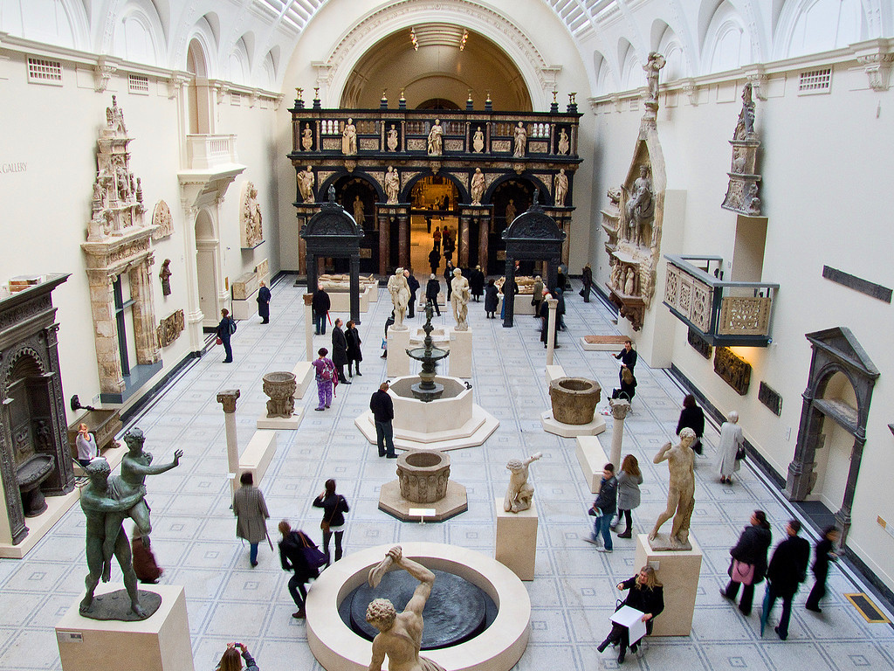
* 另一个导致设计改革（尤其在室内设计和家具设计方面）的原因，是当时社会上日益增强的**对于健康和卫生的重视**
  * 19世纪里，经常发生的**霍乱**等疫情给社会带来很大的困扰，医学界已经发现了**细菌和病毒**
  * 由于当时的家具大部分是**木制的**，臭虫时常藏在床架、椅座里面，即便是贵族家庭里也无法避免，而那些**烦琐的雕饰**尤易藏污纳垢，难以清理，使情势更为恶化；工厂烟囱里喷出的**煤烟**，令都市里每一栋住宅都无法避免被污染
* 关于健康和卫生的新概念，也引发了1860年代到1880年代的**美学运动**（Aesthetic Movement）；该运动的发起人**爱德华·威廉·古德温**（Edward William Godwin）宣称“绒毛和尘埃是生命的两大敌人”

  * **美学运动**彻底**反对任何的历史借鉴**，主张从生活本身、从人类各种感官经验中获取灵感来设计；他们强调，美可以存在于**世俗生活**中，可以存在于异国情调中，也可以存在于非常简单的东西里面，不论是西方的，或者是非西方的，甚至是当代的设计，只要喜欢，便可以**混在一起**
  * 他们的格言是“**为艺术而艺术**”（Art for Art‘s Sake），这一格言当时在英国的中产阶级圈子里相当风行
* 不过，19世纪下半叶英国的这场设计改革运动，从来也**没有彻底达到它的目的**
  * 改革派们忽略了这样一个事实：在自由贸易和自由企业经济中，实际功能与美好外形的协调统一只是促使消费者购买商品的**多种动机之一**；事实上，生产者和消费者的品位更多地取决于对于自身身份、社会地位的不同设定，标准和原则**并不能放之四海而皆准**
  * 然而，这场运动的确为现代设计奠下了**理论基石**
## 设计改革的思想基础——拉斯金提出设计革命 
* 英国美术理论家、教育家**约翰·拉斯金**（John Ruskin），是最早提出现代设计思想的人物之一；他针对1851年伦敦世界博览会的建筑和展品尖锐地提出批评意见，之后推出了自己关于现代设计的理念，为19世纪末的设计家、建筑家提供了发展的依据和启示
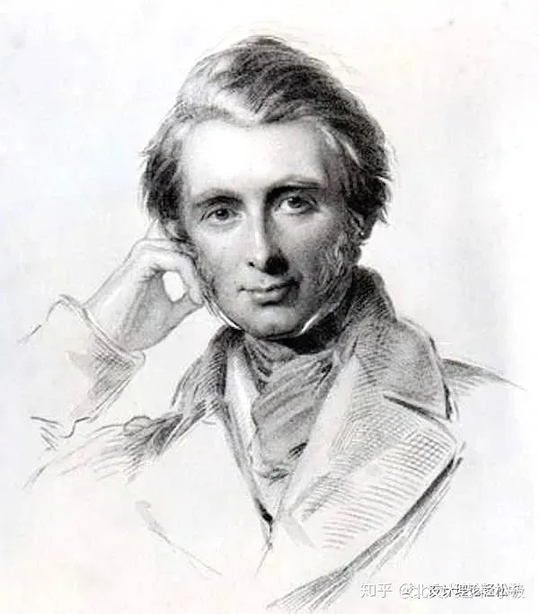
* 拉斯金对于“水晶宫”并没有什么好感，他在看到水晶宫后长叹一声说：水晶宫可算庞大无比，但其意义仅在于表明人类目前可以造出何等巨大的温室花房来；他发现展品中的工业产品存在着**烦琐装饰**的问题，发现**功能与形式的脱离**，深感严重和紧迫，因此逐渐形成自己的理论立场
* 1843年，拉斯金的第一部重要著作——《**现代画家**》（Modern Painters）的第一卷出版，引起广泛的重视，他提出画家最根本的角色应该是**忠实于自然**（the principal role of the artist is"truth to nature"）
  * 他在论及当时的**建筑**时，认为建筑**无法与社会道德分离**
  * 从**浪漫主义**的立场出发，他主张**师法自然**，强调真、善、美，反对虚伪、邪恶和丑陋；强调艺术家必须在自然中找到艺术的真谛，而不是在古典中寻找
  * 他认为，伟大的艺术作品必须是能**与自然沟通**的，只有通过直接观察、亲身感受，艺术家才能以色彩和形式来表现自然，那些因循守旧、复制传统的作品应该被**摒弃**；他呼吁艺术家要“全身心地走进自然，不要抗拒、不要挑剔、不要带任何成见”
* 1849年，拉斯金重要的建筑评论著作《**建筑的七盏灯**》（The Seven Lamps of Architecture）出版；在这本书里，他表达了对于建筑，尤其是**哥特式建筑**的热爱
  * 书的标题代表了作者认为对于所有建筑都是至关重要，且密不可分的**七个道德标准**：献身、诚实、力量、美丽、活力、记忆、忠实
  * 他认为最具有真实内涵的建筑风格，也就是形式与功能最佳吻合的建筑风格是**意大利文艺复兴风格**以及**英国13世纪、14世纪的哥特主义风格**；在他的著作中，相当赞赏文艺复兴和中世纪时期建筑和设计的优秀，拉斯金认为**哥特式建筑**是世俗和新教美德最好的体现方式
  * 他并且呼吁对于历史建筑，应该**完整地保存下来**，而不要企图通过修整来除去那些经年累月沉积下来的历史编码
  * 拉斯金很强调建筑家必须**牺牲某些传统**，通过建筑设计来达到**真实、诚挚**的目的，所谓真实和诚挚，在他来说就是**形式与功能的一致性**；就此而言，拉斯金已经开始从早期的浪漫主义、形式主义立场向比较讲究功能的**现代立场**转移
* 在《**威尼斯的石头**》（The Stones of Venice）中，拉斯金从罗马统治时期到文艺复兴时期的建筑技术发展着手，进而讨论了更为广泛的**文化史**，比较全面地表述了他对于当时**英国社会**的看法，对社会的道德和精神健康提出警示
  * 拉斯金对于**威尼斯的哥特风格**进行了反复深入的讨论和研究，从而建立了他强调**手工艺**水平、提倡发扬中世纪手工艺传统的理论立场
  * 他认为**中世纪手工艺人**的团结、合作、精益求精的工作方式是当时英国乃至欧洲设计界缺乏的东西；没有这样**团结合作**的设计方式，没有对于形式和内容的深入了解，没有精益求精的工作态度，是没有办法创造出中世纪那些宏伟的大教堂来的
  * 拉斯金认为工业社会将社会人群分割成了**思想者**和**执行者**，称前者为“**绅士**”（gentlemen），后者为“**劳工**”（workmen），并在两者之间筑起藩篱，其后果是产生了病态的思想者和悲惨的劳作者，同时社会就这样被撕裂了
  * 拉斯金认为，理想的社会里**思想者也会劳作**，而**劳动者也有思想**，劳作能促进健康，思想能引起欢乐，二者不应该被分割
  * 拉斯金的这一著作既是一篇**美学宣言**，也是一篇对当时造成社会割裂的工业资本主义的**锋利檄文**，其社会影响极其深远，不仅在英国国内，而且在世界上都有**广泛声望**

* 拉斯金在1850—1860年代与**拉斐尔前派**（Pre-Raphaelites）画家建立了密切的合作关系，通过他们的试验发展自己的理论和思想，从而促进了设计的发展
* 他于1858年，创立了**剑桥大学的艺术学院**，后来成为**安格利亚-拉斯金大学**（Anglia-Ruskin University）
* 约翰·拉斯金生活在英国维多利亚女皇时期，具有**双面的立场**
  * 一方面对于工业化造成的一连串**社会问题**感到忧虑，因此发展出**社会主义思想**来
  * 另一方面，在艺术观上，他则**崇尚自然**，强调哥特风格的真实性和诚实性，是一个典型的**浪漫主义知识分子**
  * 他**早期**的浪漫主义色彩特别强烈，**晚年**则逐步转向严肃的社会主义立场，经历了一个非常大的**立场转变过程**
* 综合而言，拉斯金的设计思想包括如下几个**重要的方面**
  * 强调设计的**重要性**，强调设计与艺术虽然相关，却是性质不同的两个范畴，设计具有自己的特性，是美术**不能取代**的
  * 强调设计的**社会功能性**，他认为设计应该为社会中占人口绝大多数的**民众**服务，而不是为少数权贵服务
  * 拉斯金还提出了早期的**功能主义**设计原则立场，即他所说的“**实用性**”目的
  * 拉斯金提出了对现代设计发展方向的看法，认为设计只有两条路，即**对现实的观察**（提倡从自然形式中发展装饰设计的题材和动机）和**表现现实的构思与创造能力**（提倡创新）
  * 换言之，拉斯金的设计主张包含着**两个主要内容**：一是强调**设计形式与功能的关系**（与现实的关系），二是主张采用**自然形式**，即他称为的“回归自然”的理论
  * 与他的绝大部分同代人不同，拉斯金认识到工业化、批量生产是不可避免的生产手段，是未来的生产方式，因此他肯定**工业化**在设计中应该具有**相当重要的地位**
* 拉斯金对于他的同代人具有**非常重要的影响**，在他之前，英国建筑家仅仅是从古典风格中**断章取义地抽取**一些装饰和建筑细节，仅仅达到“形似”的目的，而在他的理论影响下，英国建筑界开始重新对各个历史时期的建筑风格和装饰风格进行**审议和研究**，寻求功能与形式的新统一；最突出的有由**托马斯·迪恩**和**本加明·伍德华特**设计的**牛津大学自然历史博物馆**（Oxford University Museum of Natural History）
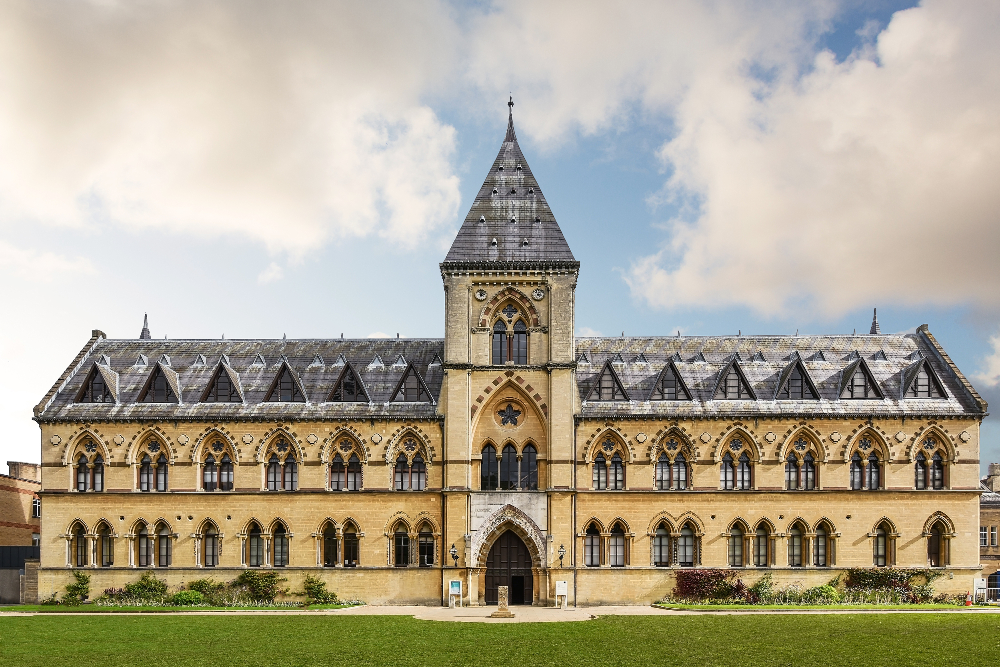
* 拉斯金本人是**反天主教**的，他的基督教立场始终保持在**哥特时期**，因为他认为那个时期是最真实的、信仰上最诚实的，而19世纪的宗教信仰充满了虚伪；但他的设计理论主张却往往引导建筑家设计**英国国教风格**（High Anglicanism）建筑
* 拉斯金的另外一个重要的理论贡献是他通过建筑和设计提出了**严肃的社会主义思想**；不过，他本人的**资产阶级地位**与他的思想是矛盾的，因此，他并未发展出真正成为体系的社会主义建筑思想来
  * 拉斯金的设计思想也包含了一系列与时代发展格格不入的内容，比如他特别强调**哥特风格的重要性**，认为这种风格是“诚挚的”“真实的”
  * 拉斯金认为，劳动本身应该是给人**带来愉悦**的，既有完成一件成品的**满足感**，也有提高了技艺的**自豪感**；然而过细的**工业化流水线分工**，既分化了制作过程，也剥夺了工作者的满足感，工人成了工业生产线的附属品，已无技艺可言
    * 这样的看法确实有一定的道理，但由此而否认工业化生产则**失之偏颇**了，而且也与他本人对于工业化的积极肯定态度是**互相矛盾**的
* 在19世纪下半叶，直到第一次世界大战爆发为止，拉斯金的影响是巨大的，对于塑造现代英国的文化生活起到重要的作用
## “工艺美术”运动概述
* “**工艺美术**”运动，是有史以来**第一场大规模的风格运动**，在将近半个世纪的时间内，成为西方设计界的一股主要力量；虽然这场运动缘起**1850年代的英国**，但它的影响却在将近1/4个世纪里遍及欧洲和北美，对于建筑、家具、纺织品和平面设计都产生不小的影响
  * 这场运动的领袖人物是**约翰·拉斯金**和**威廉·莫里斯**，主要参与者有：建筑史家**威廉·列萨比**（William R.Lethaby）、设计师**查尔斯·罗伯特·阿什比**、建筑师**查尔斯·沃赛**（Charles Francis Annesley Voysey）、画家**爱德华·伯纳-琼斯**（Edward Burne-Jones）、陶瓷艺人**威廉·德·摩根**（William De Morgan）、建筑师**菲利普·韦伯**（Philip Webb）等
* 这场运动的目标之一，就是要将**应用艺术**提高到艺术的境界，将**手工艺工匠**提升到艺术家的地位；“工艺美术”运动主张，努力提高生活用品的**设计标准**，使广大民众能够很容易地**负担得起**
  * 他们**反对机器美学**，认定机械化生产是设计上的**负面因素**，而手工艺制作是用来与非人性的工业化生产对抗的武器，希望能在日益壮大的批量生产的工业世界里，为那些手艺精良的铁匠、木匠、织工保留一片天地
  * 除了**中世纪的哥特风格**之外，“工艺美术”运动的建筑师、设计师们也从**大自然**寻求灵感，从**日本风**、**安妮皇后风格**等外域或以往的设计风格中汲取养分
  * “工艺美术”运动遵循拉斯金的理论，主张在设计上回溯到**中世纪的传统**，恢复**手工艺行会传统**，主张设计的真实、诚挚，形式与功能的统一，主张在设计装饰上要**师法自然**
* “工艺美术”运动不仅是一场风格流派的运动，更主张在**社会主义原则**下进行**经济和社会的改革**，反对工业化、都市化的社会模式
* **建筑设计**是英国“工艺美术”运动的一个**重要组成部分**，具有非常强烈的**自我建筑设计原则**
  * 其中特别重要的是强调以**功能性**为设计的主要考虑，突出功能第一的原则，强调**就地取材**，采用本地的建筑方法和技术
  * 尽量**控制使用装饰**，在使用历史装饰风格的时候，必须考虑到装饰与本地建筑历史之间的**文脉关系**，反对**断章取义**地滥用装饰
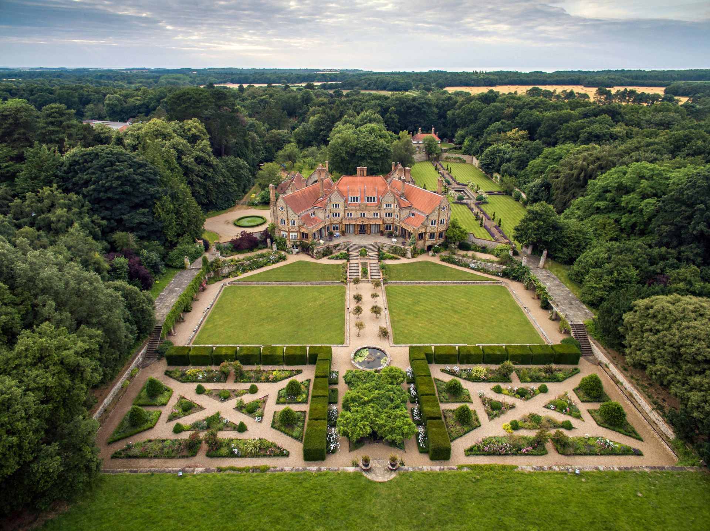
* “工艺美术”运动的产品外形简洁，材料坚实，轮廓分明
  * 设计师们喜欢采用一些**手感丰富的材料**，例如橡木、黄铜、木材、麻料、皮革，甚至还有宝石；他们的**色彩**既丰富，又柔和，常用的色调包括棕色、绿色、黄色、赭石、赤褐等
  * 与维多利亚风格相似，他们也常从**自然界汲取设计动机**，但他们更强调平面的、二维的**装饰效果**，而且将这些装饰作为产品本身的**固有部分**，而不是粘贴上去的可有可无的点缀
  * **亚瑟•H•马克穆多**（Arthur Heygate Mackmurdo）在1883年设计的一把椅子，是一个相当典型的例子；这把椅子以**深绿和深褐色**为基调，以**橡木和皮革**为材料，手感舒适，轮廓分明，椅背由通雕的**不对称的植物纹样**构成，既是一种装饰，其本身也是椅子结构的一个部分

* 关于这场运动的主要争议在于——这场运动**在现代世界的可行性**
  * 这场运动的许多主张，具有**空想社会主义**性质，在大规模的都市环境下和工业化社会的现实环境里，社会的发展将导致工业产品和工业化建筑在市场中**必然的统治地位**
  * 这些产品和建筑虽然不如手工制作的产品那般精美，甚至有些**丑陋**，但相较于贵族阶层消费的设计烦琐的建筑和产品，它们可以**批量生产和营造**，因此**价格低廉**，能为社会人口的绝大多数所接受，以满足他们的**基本生活需求**
  * 因而，“回归中世纪的手工制作”理想，无异于企图**将时钟倒拨**，是不可能实现的；其在道德上的自负和骄傲，反映的是运动参与者对前工业社会**留恋不舍**的心态而已
* 这一场激荡在1860—1910年间的“工艺美术”运动，一定程度上体现了英国设计师**对于城市建筑和工业产品发展的困惑**
  * 从**理论**上来说，工业化肯定要取代传统手工业，随着工业化的发展，城市的现代化进程**不可逆转**，如何在**工业化蓬勃发展**的同时，**保护传统价值**，成为不少设计家关心的议题
  * 从**功能**上来说，工业化造成了城市的贫困区和富裕区，如何通过建筑和城市规划设计来**解决贫困区域的丑陋面貌问题**，也是很多社会工作者和学者关心的问题
  * 从**形式**上来说，什么是真实的、诚挚的形式，什么是代表未来的形式，应该如何处理中世纪、哥特风格和现代需求中的**平衡和协调关系**，如何从自然形态、日本及东方风格、哥特风格中找到**为未来建筑提供发展基础的内容**，也十分令人困扰
* 在19世纪、20世纪交替之际，工艺美术运动已经成为影响当时设计风格的主要因素，它的影响遍及欧美各国家，引起对于设计的国际性的重视，催生了欧洲的另一场设计运动——“**新艺术**”运动（Art Nouveau）
## 威廉·莫里斯
* “工艺美术”运动最主要的代表人物是英国设计家、诗人和社会主义者**威廉·莫里斯**（William Morris，1834—1896）；他身体力行，从一个画家、建筑家发展为全面的**设计家**，并开设了世界上**第一家设计事务所**，通过自己的设计实践，促进了英国和世界的设计发展
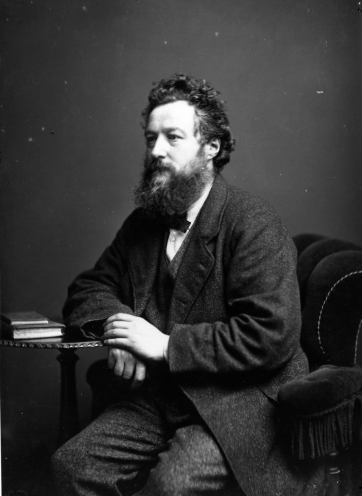
* 莫里斯是一位重要的设计先驱，但严格而言，他**并不是**现代设计的奠基人。因为他的探索重点恰恰是要取消工业化造成的“恶果”，恰恰是要**否定**现代设计赖以依存的基础——**大工业化**和**批量化机械生产**
* 他认为要复兴**哥特风格**和中世纪的**行会精神**，在设计中，唯有中世纪的、哥特的、自然的这三个来源可以依赖；从这一点来说，他是在设计实践中，真正将英国艺术理论家**拉斯金**关于设计的理论思想付诸实践的第一人
* 莫里斯家庭**殷富**，父亲是一个富裕的**商人**，为他留下了丰厚的遗产；在1851年伦敦世界博览会之后，莫里斯决心学习设计，他就读于**玛尔博罗学校**（Marlborough School）和**牛津大学**的**建筑系**
* 在牛津大学期间，他偶然读到**拉斯金**的著作《**威尼斯之石**》，对书中崇尚中世纪设计精华内容非常着迷，产生了对**哥特风格**的热爱
* 成立于1848年的“**拉斐尔前派兄弟会**”（Pre-Raphaelite Brotherhood），是一个旨在复兴中世纪风格的画家群体，发起人是画家**但丁·罗西蒂**（Dante Gabri，1829—1896）和**霍尔曼·杭特**（William Holman Hunt）；他们反对当时英国画坛因循守旧、故步自封的保守主义，主张**忠实于自然**，主张“真实的”“诚挚的”新艺术风格
* 莫里斯此时认识了**罗西蒂**，受到他很大的影响，于1857年离开斯特里特设计事务所，而参加了他们的画会；他与**柏纳-琼斯**在伦敦的“**红狮广场**”开设画室，准备在画坛上大干一番
* 莫里斯于1859年结婚，夫人是当时英国著名的艺术模特儿**珍·伯顿**（Jane Burden）；他与**菲利普·韦伯**合作设计了自己在伦敦郊区肯特郡的住宅
  * 一反当时住宅通常采用的**对称布局**、粉饰表面的常规，他们设计的住宅是**非对称性的**、功能良好的，同时完全**没有表面粉饰**，采用单纯的**红砖**，既是建筑材料，也是装饰构思，建筑结构完全裸露
  * 同时采用了不少**哥特式建筑**的细节特点，比如塔楼、尖拱入口等等，具有民间建筑和中世纪建筑的典雅、美观，并因其**反对**追逐时髦的维多利亚风格的设计特点广受好评，因为砖瓦都是红色的，而被广泛称为“**红屋**”（Red House）
  * “红屋”的**建筑外观**和**内部用品设计**，为一种新风格的奠立打下了基础，那就是1860年前后在英国展开的“**工艺美术**”运动风格

* 1861年，莫里斯与他的两个朋友开设了英国乃至世界上第一家**独立的综合设计公司**——**莫里斯-马歇尔-福尔克纳公司**（Morris，Marshall，Faulkner，and Company），设计和生产一些手工制作的金属制品，首饰、墙纸、纺织品、家具和书籍

* 随着公司业务的迅速发展，莫里斯将其他两位合伙人的股份买了下来，于1875年成立了“**莫里斯设计公司**”（Morris and Company），成为该设计公司的独资老板；这是世界上最早的**由艺术家领导的设计事务所**
  * 随着生产的规模不断扩大，他在1881年将纺织品生产中心独立出来，成为专门的**地毯工厂**；1890年，莫里斯再次拓展了他的业务——成立了**科尔姆斯格特出版社**（Kelmscott Press），在1891到1898年间，先后出版了53本手工雕版印刷的书籍

* 莫里斯本人热心于**纺织品和墙纸的纹样设计**；他设计的图案往往以植物的枝蔓和花卉为构思，充满了浪漫的**自然主义色彩**
  * 他很擅长在**二维的平面设计**中，通过**深浅色调的变化**，纹样细节的设计（如花园栏杆的穿插编排、植物叶茎的重叠交错、小动物在植物丛中的出没跃动），表现出三维空间的深度和**立体感**来
  * 这种设计，与拉斯金提倡的“**向自然学习**”是一致的；而他的设计事务所设计与生产的金属制品、家具、装饰品、彩色玻璃镶嵌等等，都具有类似的风格特征
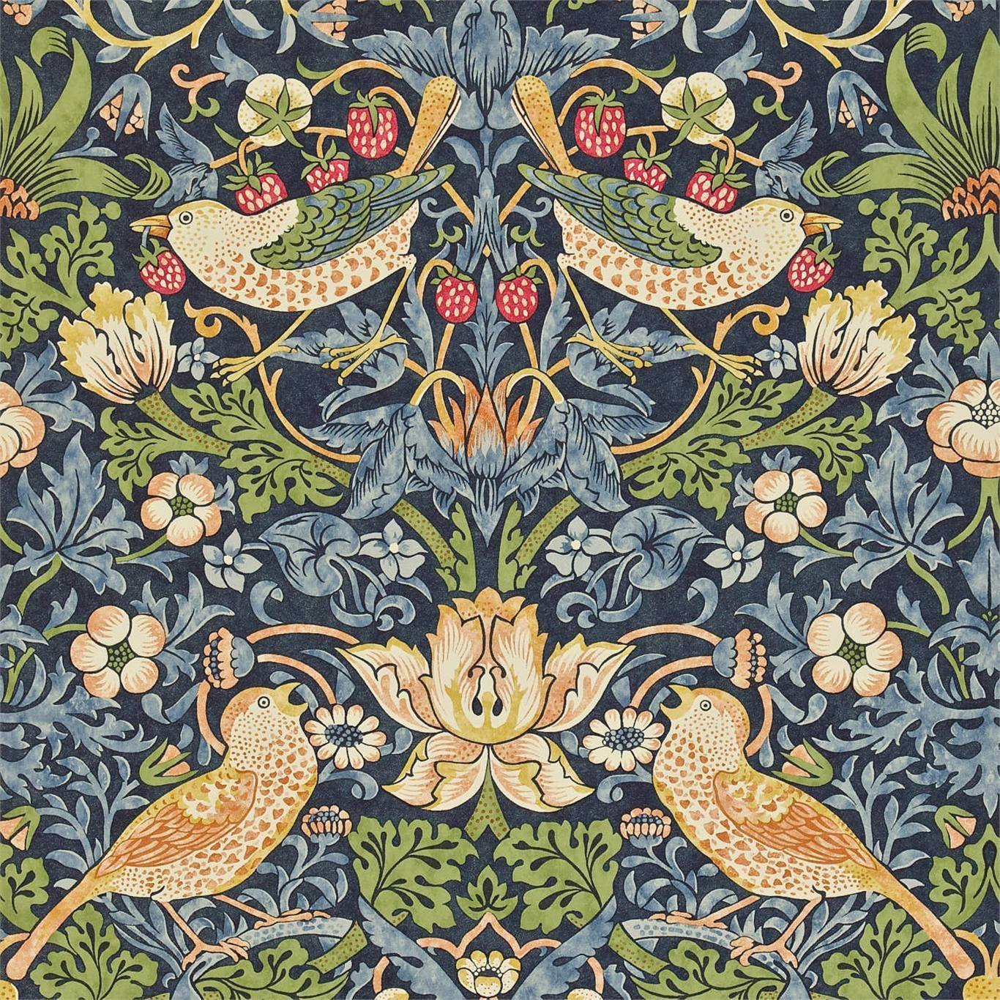
* 莫里斯在这个时期逐渐形成自己的设计思想，他受到**拉斯金**的民主主义、社会主义思想很大的影响，在设计上强调**设计的服务对象**，同时也希望能够重新振兴**工艺美术的民族传统**，反对矫揉造作的维多利亚风格
  * 他反复强调设计的**两个基本原则**，即：产品设计和建筑设计是**为千千万万的人服务**的，而不是为少数人的活动；设计工作必须是**集体的活动**，而不是个体劳动
* 莫里斯在具体设计上，强调**实用性和美观性的结合**，对于他来说，实用但是丑陋的设计不是好的设计
* 1870年代里，莫里斯更多地投入到**政治活动**中去，他成立了“**社会主义者同盟**”（Socialist League），通过写作和演讲，宣传社会主义，主张社会改革
  * 基于他的乌托邦社会主义理论，莫里斯原意是制作一些能够表现手工艺匠人的**创造性和个性**（这两点都是工业化批量生产所不具备的），价格又能为劳工阶层承受的**精美产品**，然而具有讽刺意味的却是：这样生产出来的产品，由于**成本太高**，只有富裕家庭才能买得起
  * 莫里斯一直反对和**抗拒**工业化的批量生产，然而他所寻求的**大众品位的提高**，却是由那些抄袭了他的设计，再用机械化较低成本的批量生产出来出售给各个阶层的**制造商**完成的
## 英国的“工艺美术”运动
* 莫里斯的设计，**莫里斯设计事务所**的活动，以及莫里斯及他的同伴们提倡的原则和设计风格，在19世纪下半叶获得了相当广泛的回响；英国有不少年轻的设计家仿效莫里斯的方式，组织自己的设计事务所，称之为“**行会**”（guild），从而开始了一场真正的设计运动，史称**工艺美术运动**，而他们推崇的风格，就称为**工艺美术运动风格**
* “工艺美术”运动的一个重要促进因素，是1888年在伦敦成立的、由英国插图画家**沃尔特·克朗**（Walter Crane）担任首任会长的“**工艺美术展览协会**”（The Arts and Crafts Exhibition Society）
  * 这个协会自成立起，连续不断地在英国本土举行了一系列的**展览**，在英国向公众提供了一个了解好的设计及高雅设计品位的机会，从而促进了“工艺美术”运动的发展
  * 协会还出版一份《**工艺美术**》季刊（Arts and Crafts quarterly），作为宣传“工艺美术”运动精神的言论阵地，发表包括拉斯金、莫里斯和其他“工艺美术”运动代表人物的文章，广泛地宣传了这个设计运动的宗旨和内容
* 1896年，威廉·莫里斯去世，设计家**威廉·阿瑟·本森**（William Arthur Smith Benson）接手负责莫里斯设计公司的工作，继续发展“工艺美术”运动，起到承上启下的重要作用
* 从设计内容来看，英国的“工艺美术”运动又可以简单分成以下几个组合
  * **家具设计**：以查尔斯·沃赛、巴里·斯各特（Mackay Hugh Baillie Scott）、查尔斯·罗伯特·阿什比、威廉·列萨比为主要代表人物
  * **建筑与室内设计**：以菲利普·韦伯、理查德·肖（Richard Norman Shaw）等人为代表
  * **日用陶瓷设计**：以克里斯多夫·德莱赛、威廉·穆克罗夫特（William Moorcroft）等人为代表
### 查尔斯·沃赛
* **建筑师**出身的**查尔斯·沃赛**（Charles Francis Annesley Voysey），他也长期从事**室内与家具设计**
  * 虽然受到莫里斯思想的影响，但由于毕竟比莫里斯**年轻20多岁**，因而并不像莫里斯那样对中世纪、哥特风格顶礼膜拜，从来**不盲目崇尚古风**
  * 他设计的家具都比较简单、朴实，而比较**少有中世纪风格的重复出现**，也更加容易进行**批量化生产**
* 沃赛最著名的设计项目是他在1900年设计的自用住宅“**果园住宅**”（the Orchard，Chorleywood），他设计了建筑、室内和全部家具用品，风格统一

  * 从形式上和思想倾向上，这栋住宅建筑与莫里斯的“**红屋**”有异曲同工之妙
### 巴里·斯各特
* **巴里·斯各特**（Mackay Hugh Baillie Scott）被称为第三代英国“工艺美术”运动设计师中的代表人物
  * 他出生于1865年，当时威廉·莫里斯关于好的设计的理念已经相当普及；他起初是在**农学院**学习，但后来读到莫里斯、韦伯和理查德·肖的著作，决定放弃学农，转而学习**建筑和设计**
  * 他与**沃赛**一样也是**建筑师出身**，后来转而从事家具设计和产品设计；但凡建筑设计出身的设计家，由于习惯从建筑总体考虑，因此设计上都具有明显的**统一性**特点
* 与当时许多豪华大宅相比，斯各特设计的住宅**体量较小**，比较接近一般的民众的经济能力
  * 建筑的布局规划开阔流畅，**空间感强**，着意将室内空间与室外环境联系起来；建筑外形简洁，轮廓清晰，依靠材料和建筑结构本身的**丰富层次和肌理**来制造美感
  * 斯各特喜欢采用**动物和植物的纹样**作为装饰动机，并在家具上以凸出的线条勾勒出这些自然纹样来，他设计的家具，简练而典雅
  * 他将自己的这些设计理念，在1906年编写的《**住房与花园**》（Houses and Gardens）一书中，做了比较详细的说明
* 斯各特的重要设计项目有位于英格兰温德米尔的**布莱克威尔山庄**（BlackwellHouse，Windermere），这是为当时曼彻斯特一位富裕的酒商设计的度假屋，现已成为英国“工艺美术”运动建筑的一个典型作品，于2001年向公众开放参观
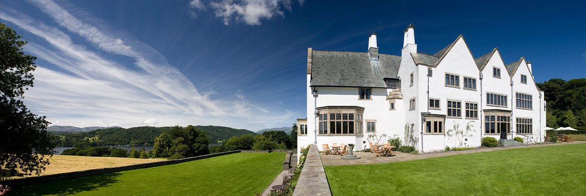
### 查尔斯·罗伯特·阿什比
* **查尔斯·罗伯特·阿什比**（Charles Robert Ashbee）也是英国“工艺美术”运动后期的重要代表人物之一
  * 他曾就读于剑桥的**国王学院**，最初主要设计**金属器皿**，特别是各种银器，后来也设计**家具**，他的设计讲究典雅的造型，细节装饰不过分

  * 1888年，他在贫穷、高失业率的东伦敦成立了“**手工艺行会**”和手工艺学校，为行会里的手工艺工人提供训练，并成立工作坊，让工人们在那里生产金属制品、皮革制品、银器、首饰和家具，这些产品大部分是由他自己设计的
* 值得一提的还有专门生产“工艺美术”风格产品的英国**李柏提公司**（Liberty&Co.），这家公司是由**阿瑟·李柏提**（Arthur Lasenby Liberty）创建的
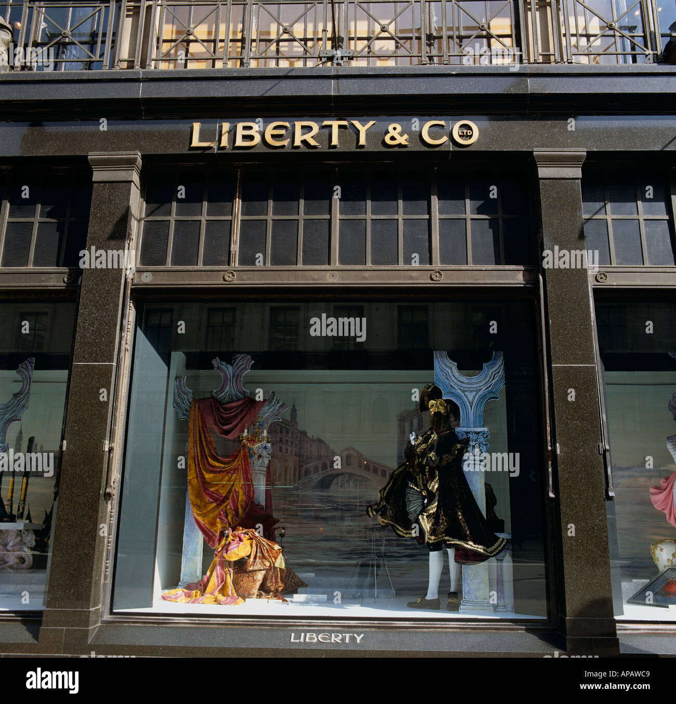
* 英国的“工艺美术”运动建筑家和设计家，大都具有**非常矛盾**的特征：他们的设计，绝对是为**资产阶级**，特别是富裕的资产阶级服务的，他们自己大部分也都因为设计而致富，在物质上具有非常彻底的资产阶级色彩；但是在精神上却具有高度的**自由色彩**，甚至受拉斯金影响，具有一定的**社会主义色彩**或者空想社会主义色彩
## 美国的“工艺美术”运动
* 19世纪末，在**美国**兴起的“**工艺美术**”运动，与那场发生在**英国**，并且扩展到**欧洲其他国家**的“工艺美术”运动有着千丝万缕的联系
  * 英国“工艺美术”运动几位重要的设计家，比如**沃尔特·克朗**、**阿什比**等当时都曾访问过美国，在美国介绍了英国设计的探索成果
* 美国的“工艺美术”运动最先发生在**波士顿**，这座历史上一直与英国有密切的联系的城市，于1897年6月，最先成立了**工艺美术社团**（Society of Arts and Crafts）；紧跟着，**芝加哥工艺美术社团**（Arts and Crafts Society）也在1897年10月份成立

* 1897年，在波士顿的**柯普利大厅**（Copley Hall，Boston）举办了第一届美国工艺美术展览，展出了160多位手工艺人士的1000多件作品；1900年，纽约的“**工艺美术行会**”成立，完全遵照英国“工艺美术”运动行会的方式运作
* 与英国的运动不同，美国的“工艺美术”运动并没有明确提出**统一的设计哲学**，**社会主义思潮**亦没有在运动中扮演重要角色
  * 虽然有为数不多的几个**乌托邦式的聚居地**，从事一些工艺美术风格的手工制作，但均为期不长，影响不大
  * 至于都市里的社会主义活动团体，则着重于开展**对于年轻女子的教育普及**，其中也包括向那些年轻女子传授手工技艺，让她们通过工艺创作表达自己，建立自信
* 由于美国幅员广阔，各地差异很大，因而并没有像英国的“工艺美术”运动那样发展出一个统一的运动风格来，而是在东海岸、中西部、加利福尼亚各有**不同特点**
* **查尔斯·罗赫尔福斯**（Charles Rohlfs），从1897年开始设计和制作带有明显“工艺美术”运动风格的家具
  * 他认为自己是艺术家，因而称他的家具为“**艺术家具**”（Artistic Furniture）
  * 他的家具多用**橡木**为材料，以**手工方式**制成，在设计中非常突出独创性和个人表现
  * 罗赫尔福斯1899年设计的一把**摇椅**，由几片预先加工好的木板仔细地榫接成型，背板和扶手板上均以锁孔状的小缺口作为装饰，扶手板的中间则饰以明显带有亚洲风格的圆形通雕图案；这把摇椅成为他最重要的代表作品之一
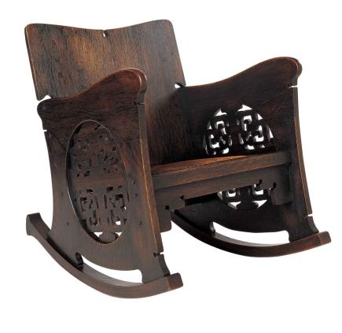
* **古斯塔夫·斯提格利**（Gustav Stickley），是工艺联合会（The United Crafts）的创办人，积极推广英国“工艺美术”运动的设计理念
  * 斯提格利相信批量生产的家具结构很**低劣**，设计起来太**复杂**；他希望能通过手工艺人或传道者的家具，提升美国公众的品位

* 随着**白炽灯泡的**发明，**灯具的设计**成了美国“工艺美术”运动中的一个重要项目
  * **德克·凡·伊尔普**（Dirk Van Erp）出生在一个荷兰铜匠的家庭里，移民来美国之后，定居旧金山；他用**铜片和云母**制作的台灯，不添加任何颜料或附加装饰，单纯利用铜料本身的颜色和灯的结构造型而使产品富有天然的美感，是美国“工艺美术”运动中的杰出作品

* 在美国“工艺美术”运动的发展中，**大众出版物**起到推波助澜的作用
* 美国“工艺美术”运动还受一个特殊因素的影响，就是**美洲大陆原始印第安文化**
  * 在美国首届工艺美术展览中，特地辟出一个**印第安之角**（Indian Corner）来展出印第安人的毯子、纺织品等
  * 从**路易斯•C•蒂凡尼**（Louis Comfort Tiffany）当时设计的一个吊灯灯罩上，可以清晰地看到印第安文化的影响
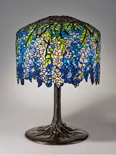
* 英国的“工艺美术”运动对于美国设计的影响，尤其反映在美国当时的建筑设计方面，芝加哥建筑学派的主要人物**路易斯·沙利文**和**佛兰克·L·莱特**等人，都深受影响
  * 这种具有英国“工艺美术”风格的美国建筑，最早出现在**新英格兰地区**，比如亨利·里查逊设计的马萨诸塞州坎布里奇市的**斯托顿住宅**（1882—1883）、罗得岛州施里斯托的**罗威住宅**（1887）都是典型代表
  * 这两栋建筑都明显表现出美国建筑师力图摆脱长期接受的传统英国风格，特别是维多利亚风格的影响，朝“工艺美术”风格发展的倾向；这些建筑采用**当地材料**建造，特别是本地盛产的木材、木瓦（shingles），突出了“工艺美术”运动对于就地取材、运用本地建筑方法、考虑本地环境的基本设计原则
* **佛兰克·L·莱特**通过他的建筑设计（连同室内的家具、灯具、装饰配件、镶花玻璃等等），为美国人提供了一种新的生活方式
  * 他的建筑风格被称为“**草原小屋**”风格（Prairie School），特点是低矮、宽阔的**倾斜屋顶**，开放的室内，强调**水平线**的效果；在建材上主要使用石头、木料、黏土等**就地取材的天然材料**，与环境非常协调
  * 同时，平直、基本无装饰的墙面也容易使用**机械加工**，连带他设计的家具也多是**直线形**的，保持**天然原色**的表面
  * 位于巴法罗市的**达文·马丁住宅**（Darwin Martin House），建于1903年，是佛兰克·L·莱特『草原小屋』风格住宅建筑的代表作之一

* 另一个显著的例子是在南加州的建筑师格林兄弟——**查尔斯·S·格林**（Charles Sumner Greene）与**亨利·M·格林**（Henry Mather Greene），两兄弟也是将建筑、室内、家具、灯具的设计统一进行的，他们的艺术品位明显受到**东方艺术的影响**颇带禅意
  * 他们在南加州帕萨迪纳市设计的**根堡住宅**和**布莱克住宅**（Black House，Pasadena），室内室外，都精心地运用了许多**日本的装饰动机**
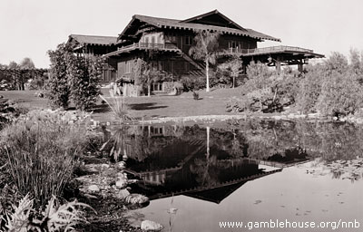
* 1951年荣获美国建筑师协会金奖的建筑师**伯纳德·迈别克**（Bernard Ralph Maybeck）一生作品很多，他在1910年设计的**加州伯克利第一基督教堂**（First Church of Christ Scientist）被认为是美国“工艺美术”运动建筑中的精品

* 美国的“工艺美术”运动延续时间**比英国要长**，一直到**1915年前后**才结束
  * 美国“工艺美术”运动的重要转折发生在**1893年**，这年芝加哥举办了“**哥伦比亚世界博览会**”，**莱特**展出了他设计的具有典型“工艺美术”风格的家具，这些家具与英国的“工艺美术”风格既有**相似之处**，但也有自己的特点，体现了美国设计师**自己的探索**
* 美国的“工艺美术”运动虽然是受到英国或者其他欧洲国家的“工艺美术”运动的影响发展起来的，但是，在**背景上**却有一定的差别
  * 美国人对于工业化却并没有欧洲人那种**忧虑感**，他们之所以发展“工艺美术”运动，在很大程度上是希望能够**突破欧洲传统的单一影响**
  * 与英国“工艺美术”运动产品设计，特别是家具设计最大的区别，就是美国的设计具有非常明显的**东方设计影响**；英国设计中的东方设计影响主要存在于**平面设计与图案上**，而美国设计中东方的影响是**结构上的**
  * 莱特在他的“草原住宅”系列中广泛采用的低矮、强调平向延伸的大屋顶，格林兄弟和斯提格利的建筑和家具中对于木构件的突出强调，采用所谓“装饰性地运用功能性构件”的方法，都取自日本建筑和中国明代的家具设计，这种情况在英国就很少见
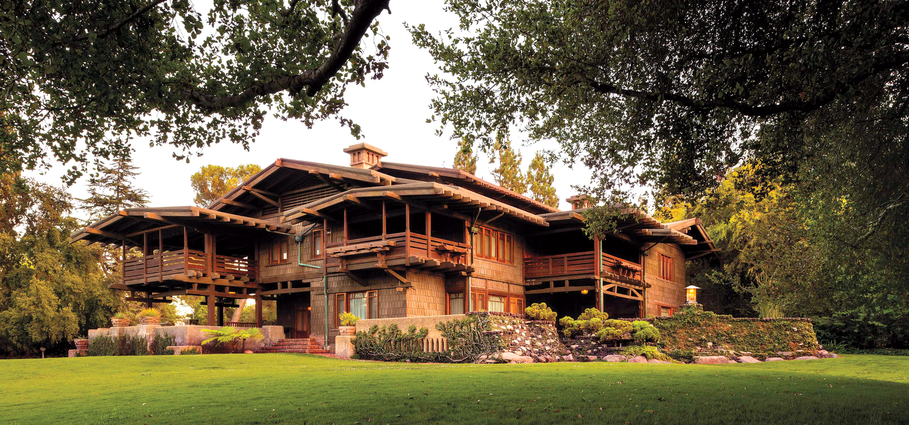
* 美国“工艺美术”运动与英国的“工艺美术”运动不同，并不是一个统一的、具有比较集中性活动的设计运动，而仅仅是一种**设计思潮**而已
  * 比如部分美国“工艺美术”运动也包含**芝加哥学派**的设计；而活跃于加利福尼亚州的一批设计家和建筑家，他们的设计虽亦受到英国“工艺美术”运动的影响，但是更多的是与**日本和东方文明**，以及与中南美洲的**印第安文明**相关，在设计语汇上与欧洲的“工艺美术”运动相去甚远
  * 到了1920年代，美国设计师和消费者关注的焦点，更多地转向对**机器时代的现代化**，以及对于**民族身份定位的追求**，很自然地，“工艺美术”运动在美国也走到了**终点**
* 源起英国的“工艺美术”运动，除了对美国造成重大影响之外，在**斯堪的纳维亚地区**也造成一定的影响
## 克里斯多夫·德莱赛
* 苏格兰设计师**克里斯多夫·德莱赛**（Christopher Dresser），被认为是在19世纪下半叶的**设计改革运动**中出现的**第一位工业设计师**
  * 他是一位多产的设计师，为英国、法国、美国多个厂家设计过种类繁多的产品，同时也是一位优秀的植物学家和作家
  * 1834年，德莱赛出生于**格拉斯哥**，他从13岁开始在位于伦敦的由政府开设的设计学校学习
  * 德莱赛的设计，特别是他设计的金属制品，相当清晰地表现出**减少主义**的趋向，采用了比较现代的几何形态，这些特征都对40年后包豪斯的金工车间产品留下深刻影响

  * 虽然德莱赛也和他的同代人一样，存在一些**偏颇的道德理念**，偏爱“诚实”的设计，对**日本手工艺**情有独钟，然而，和那些同代人不同的是：对他而言，追溯手工操作的传统从来不是主要的追求，他更看重的是无论采用何种材料，设计何种产品，如何在设计上达到**柏拉图式的完美**，同时要适应**工业化的制作过程**
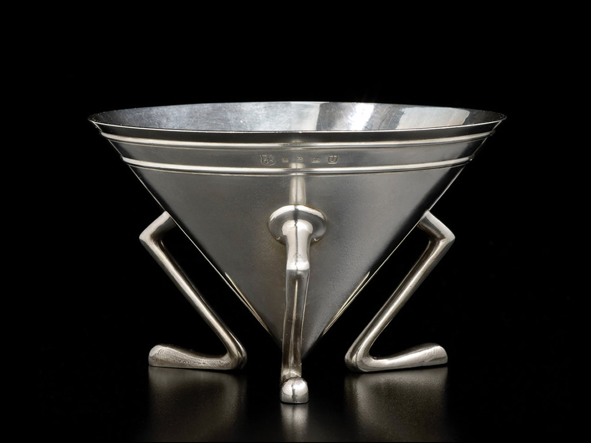
* 德莱赛1880年设计的一套**盖碗和瓢**，是他的金属制品的代表作之一
  * 整体造型由**基本的几何形体**构成，简洁而典雅，没有任何多余的装饰纹样，用两道水平的环形饰边，与平直的盖和把手相呼应，用象牙制作的碗把、盖顶和瓢把与纯银制成的碗体和瓢体形成对比
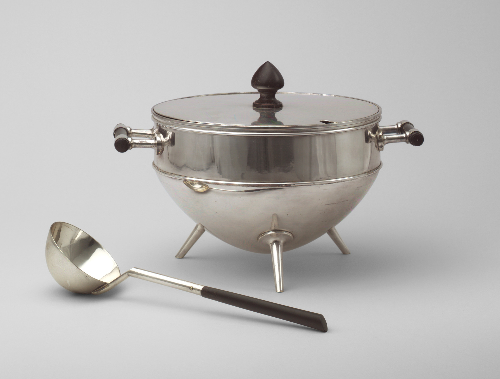
* 在设计学校学习的过程中，德莱赛接触到当时的新学科——**植物学**，对此产生了浓厚的兴趣
  * 1856年，当**欧文·琼斯**出版其著作《**装饰的语法**》（The Grammar of Ornament）的时候，德莱赛帮他绘制了书中的**植物插图**
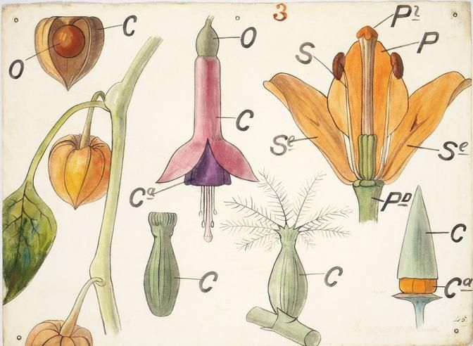
  * 1859年，德莱赛从**德国基纳大学**（University of Jena）获得**植物学博士学位**，并于1860年入选**爱丁堡植物学会会员**
  * 他的作品中有大量设计是以植物形态为**装饰动机**的；虽然他在植物学方面的训练令他对植物的描画非常准确、逼真，但他却清醒地提出，不应该照抄植物的**自然形态**，而应该根据几何的原理，将天然植物抽象化，赋予风格，创造出**单纯的装饰细节**来
* 在19世纪，产品表面施用**贴面材料**的装饰手法，曾被视为“欺骗”；在**二维**的软装饰（地毯、壁挂等）设计中，通过画出阴影营造出**三维**的幻想花园，也被认为是“骗人”“不道德”
  * 为了寻求合乎当时社会道德标准的设计语汇，德莱赛提出了三个原则
    * **真诚**：反对使用仿制材料
    * **美丽**：设计上永恒的完美
    * **力量**：在装饰中显示出韧性、能量，以及力度
  * 1880年代初期，德莱赛成立自己的设计工作室时，还将“**知识就是力量**”设计成一块铭牌，钉在工作室门上
* 作为生活在维多利亚时代的设计师，德莱赛很注重从各种**非西方的文化中**汲取设计灵感
* 而**日本工艺品**对他的影响尤为重大；德莱赛于1854年**亲自访问了日本**，成为**第一位访问日本的西方设计师**
  * 从1860—1870年间他的设计作品中，可以明显看到他从日本工艺展品中汲取了许多**设计的动机和细节**
  * 1876—1877年，德莱赛**再次访问**日本，加深了他对日本工艺品形态的认识，他将这种收获在自己的设计中转化成对材料、形状、表面处理，以及加工技术的高度重视
  * 1880年设计的“波浪”果盘，清晰地反映出日本风格对他的影响；设计的灵感来自日本画家**葛饰北斋**（Katsushika Hokusai）1831年的画作《**神奈川巨浪**》（The Great Wave of Kanagawa），然而他并不照抄原画的纹样或细节，而是将其中日本风格的装饰细节**抽象化**，融合在一个圆形的几何体中
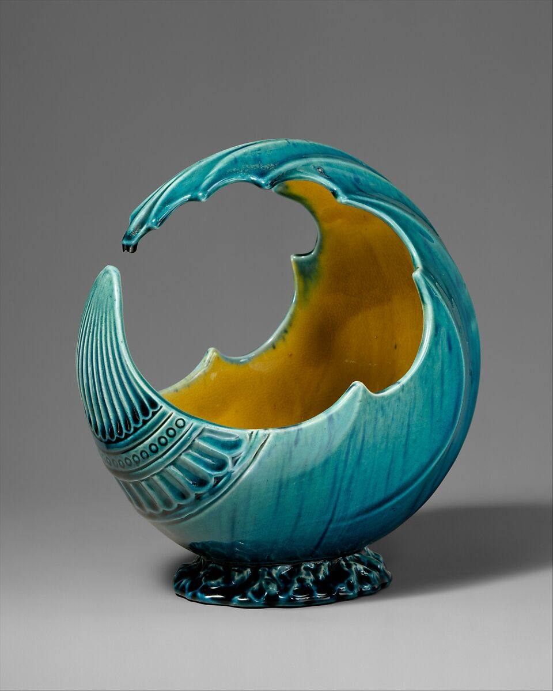
* 作为威廉·莫里斯的同代人，德莱赛在致力于生产具有良好功能的、价廉物美的家用产品的同时，对于**工业化带来的问题**和**社会改革议题**亦给予很大的关注
  * 但和莫里斯不同的是，德莱赛充分认识到**工业革命带来的进步**，并且有意识地为日益增长的消费市场进行设计；能够为各种**不同的制造商**设计产品，是德莱赛成功的原因之一
  * 作为一个**自由职业的商业设计师**（有时候兼任公司的艺术指导），德莱赛为各种门类的制造商提供设计；他为超过30家英国、爱尔兰、法国和美国厂商设计墙纸、纺织品、地毯；至少为7家公司设计陶瓷，其中包括韦其伍德等著名厂家；并为很多家公司设计铸铁家具和金属制品
* 在其职业生涯中，德莱赛出版了许多书籍，并举办了许多讲座，专题涵盖植物学、设计，以及如何为工业制造品设计
  * 德莱赛的著作包括1862年出版的《**装饰设计的艺术**》（The Art of Decorative Design），1873年出版的《**装饰设计的原则**》（Principles of Decorative Design）、《**在设计中学习**》（Studies in Design），以及1886年出版的《**现代装潢**》（Modern Ornamentation）等
  * 1882年出版的《**日本：建筑、艺术和艺术制造业**》（Japan：Its Architecture，Art，and Art Manufactures）也是他的重要著作之一，此书影响了19世纪最后10年在欧洲刮起的**日本风**（Japonisme）