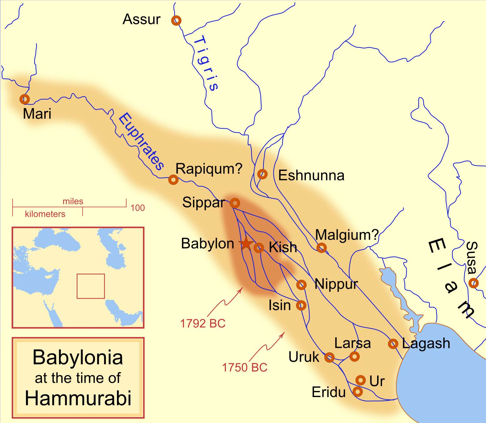
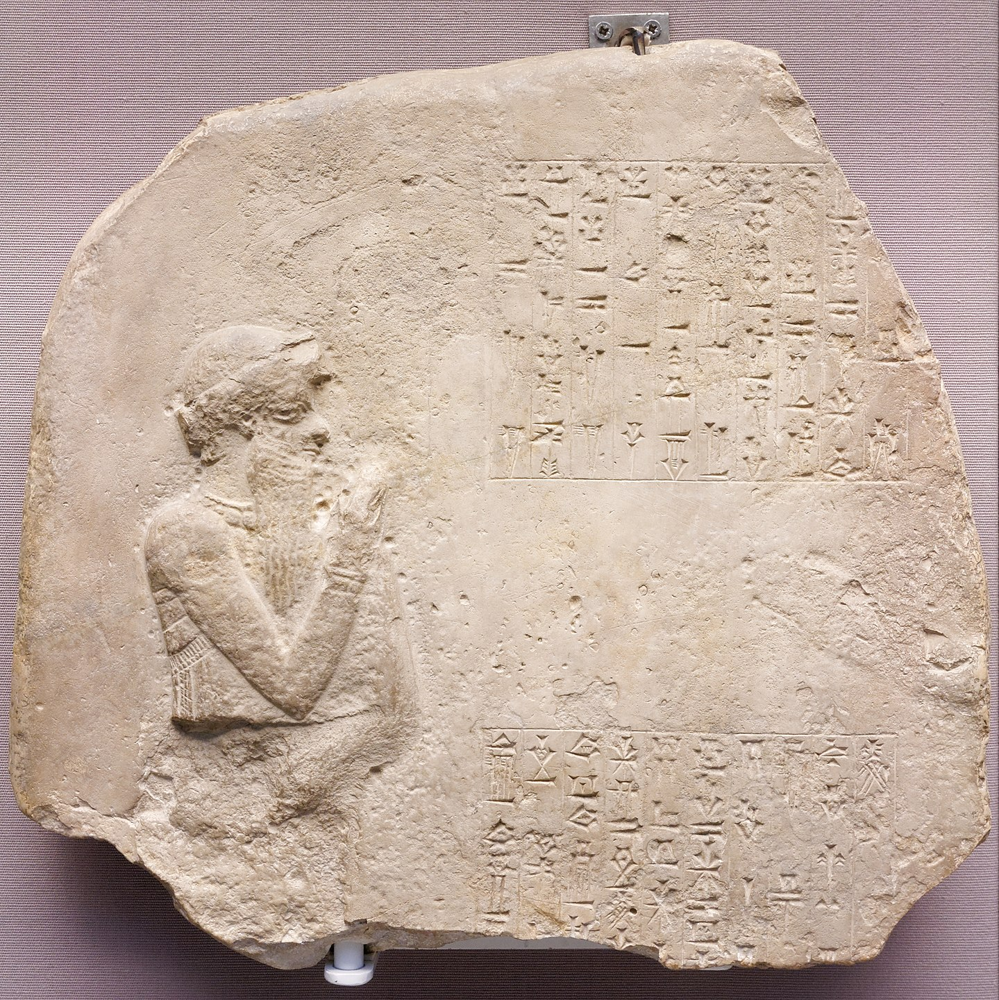

# 巴比伦（巴比伦尼亚）
* **时间**：1894 B.C.——593 B.C.
  * “**四大文明古国**”之一
* **地点**：美索不达米亚**中南部**（今伊拉克和叙利亚部分地区）

* **地理**：见“阿卡德”
* **起源**
  * 在巴比伦出现之前，美索不达米亚已经享有悠久的历史；**苏美尔文明**公元前 3500 年在该地区出现，以及讲**阿卡德**语的人在公元前 30 世纪出现
  * 苏美尔在公元前 22 世纪后期与**乌尔第三王朝**一起崛起，并在公元前 2161 年将**古提人**从美索不达米亚南部驱逐出去；他们似乎也一度在美索不达米亚北部的**亚述-阿卡德国王**的大部分领土上取得了优势
  * 随着公元前 2002 年苏美尔“乌尔三世”王朝在埃兰人手中垮台，外来西北闪米特语民族**亚摩利人**（“西方人”）开始从**黎凡特北部**迁徙到**美索不达米亚南部**，逐渐控制了美索不达米亚南部的大部分地区，在那里他们建立了一系列小王国，而亚述人则在北部重申了他们的**独立**
  * 当**萨尔贡一世**（公元前 1920 年 - 公元前 1881 年）于公元前 1920 年继位为亚述国王时，他最终将亚述从该地区**撤出**，宁愿集中精力继续在安纳托利亚和黎凡特大力扩张亚述殖民地，最终南美索不达米亚沦陷给**亚摩利人**
  * **名称起源**：**巴比伦市**为一个较小的行政城镇，最早提及巴比伦城的是**阿卡德萨尔贡统治时期**（公元前 2334 年至公元前 2279 年）的一块泥板，可追溯到公元前 23 世纪；它在**阿卡德帝国时期**（公元前 2335-2154 年）是一个省级小镇，但在公元前 18 世纪上半叶的**汉谟拉比统治期间**得到了极大的扩张，并成为一个主要的**首都城市**
* **简史**
  * **亚摩利王朝**：1894 B.C. —— 1595 B.C.
    * **早期**
      * 其中某个亚摩利王朝建立了一个小王国**卡扎卢**，其中包括大约公元前 1894 年当时仍然很小的**巴比伦城镇**，最终接管了其他王国并形成了短命的**第一个巴比伦帝国**，也称为**第一个巴比伦王朝**
      * 一位名叫**Sumu-abum**的亚摩利人首领从邻近的亚摩利人统治的美索不达米亚城邦**卡扎卢**手中夺取了一块土地，其中包括当时相对较小的城市**巴比伦**，它最初是卡扎卢的领土
      * 他把新获得的土地变成了一个**州**，然而，Sumu-abum 似乎从来没有费心给自己冠以巴比伦国王的头衔，这表明巴比伦本身仍然只是一个小城镇或城市，不配称王
      * 紧随其后的是Sumu -la-El、Sabium和Apil-Sin，他们每个人都以与 Sumu-abum 相同的模糊方式进行统治，当时的任何书面记录都没有提到巴比伦本身的王权；Sin-Muballit是这些亚摩利统治者中第一个被正式视为巴比伦国王的人，而且只有一块泥板
      * 在这些国王的统治下，巴比伦所在的国家仍然是一个控制很少领土的小国，并且被更古老、更大、更强大的邻国所掩盖，例如：古伊朗北部的伊辛、拉尔萨、亚述和东部的**埃兰**；**埃兰人**占据了美索不达米亚南部的大片地区，早期的亚摩利人统治者大部分都**隶属于​​埃兰**
    * **汉谟拉比帝国**
      * **汉谟拉比**（约公元前 1810 年–约公元前 1750 年）是旧巴比伦帝国的第六位亚摩利王，他在巴比伦进行了重大的**建筑工程**，将它从一个小镇扩展成一个配得上王权的大城市；作为一个非常有效率的统治者，他建立了一个**官僚机构**，有税收和中央集权政府

      * 汉谟拉比将巴比伦从埃兰人的统治下**解放**出来，将埃兰人完全赶出了**美索不达米亚南部**，并系统地**征服**了美索不达米亚南部；他的征服使该地区在动荡时期后稳定下来，并将小国拼凑成**一个国家**，直到汉谟拉比时代，美索不达米亚南部才获得**巴比伦**这个名称
      * 汉谟拉比将他纪律严明的军队转向**东方**，入侵一千年后成为**伊朗**的地区，征服了埃兰、古提斯、卢鲁比和卡斯特；在西方，他征服了**黎凡特的亚摩利国家**（现代叙利亚和约旦），包括强大的马里和亚姆哈德王国
      * 汉谟拉比随后与**旧亚述帝国**为控制美索不达米亚和近东地区进行了一场旷日持久的**战争**；在与强大的亚述国王Shamshi-Adad I和Ishme-Dagan I进行了数十年的长期斗争之后，汉谟拉比迫使他们的继任者Mut-Ashkur向巴比伦**进贡**
      * 汉谟拉比最重要和最持久的作品之一是**巴比伦法典的编纂**，它改进了苏美尔、阿卡德和亚述的早期法典，这是汉谟拉比在驱逐埃兰人并建立他的王国后下令制作的；1901 年，雅克·德·摩根和让-文森特·谢尔在埃兰的苏萨的一块石碑上发现了汉谟拉比法典的副本，后来被视为掠夺品放在在**卢浮宫**
      * 从公元前3000年以前到汉谟拉比统治时期，美索不达米亚南部主要的文化和宗教中心一直是古城**尼普尔**，那里有至高无上的神**恩利尔**；汉谟拉比将这种统治权转移到了**巴比伦**，使**马杜克**成为美索不达米亚南部万神殿中的至高无上的神，巴比伦城被称为“**圣城**”，美索不达米亚南部的任何合法统治者都必须在这里加冕
    * **衰退**
      * 美索不达米亚南部没有天然的、可防御的**边界**，因此很容易受到攻击；汉谟拉比死后，他的帝国开始**迅速瓦解** 
      * 在他的**继任者**Samsu-iluna（公元前 1749-1712 年）的统治下，美索不达米亚的最南端落入了当地**讲阿卡德语的国王**Ilum-ma-ili手中，他驱逐了亚摩利人统治的巴比伦人；南方成为本土的**西兰王朝**，在接下来的 272 年里一直不受巴比伦的控制
      * **亚摩利人的统治**在大大缩小的巴比伦得以幸存，Samshu-iluna 的继任者Abi-Eshuh试图为巴比伦夺回西兰王朝，但在国王 Damqi-ilishu 二世手中失败了；到他统治结束时，巴比伦尼亚已经缩小到它建国时**相对弱小**的国家，尽管这座城市本身比汉谟拉比崛起之前的小镇要**大得多**
      * Samsu-Ditana将成为巴比伦的**最后一位**亚摩利人统治者，在他统治初期，他受到来自**卡西特人**的压力，卡西特人说一种明显孤立的语言，起源于今天伊朗西北部的山区；巴比伦随后于公元前 1595 年遭到以印欧语为母语、以安纳托利亚为基地的**赫梯人**的袭击
      * Shamshu-Ditana 在赫梯国王**穆尔西里一世**洗劫巴比伦后被推翻；赫梯人并没有停留太久，但他们造成的破坏最终使他们的卡西特盟友获得了**控制权**
  * **卡西特王朝**：1595 B.C. —— 1155 B.C.
