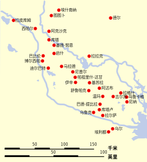
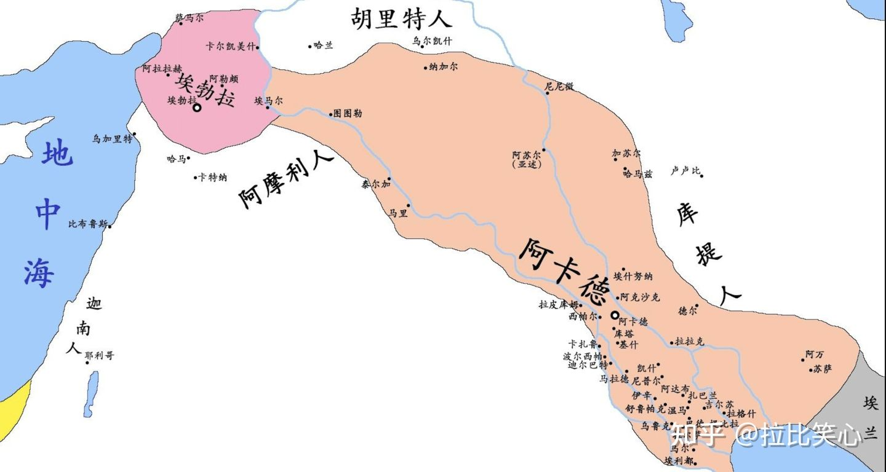
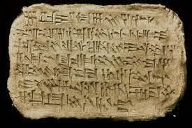
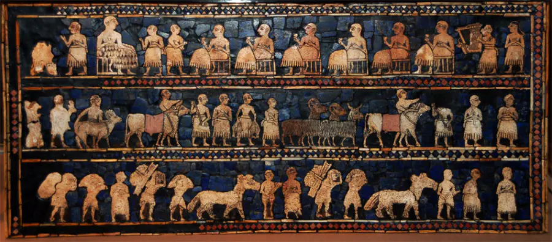
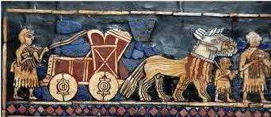
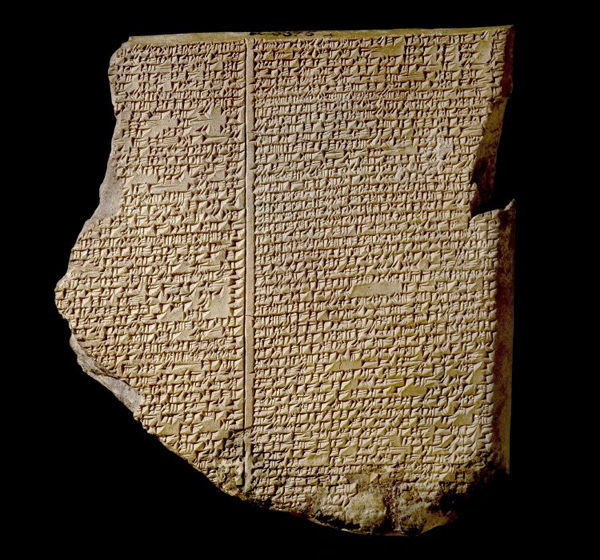

# 苏美尔
* **时间**：4500 B.C.——1900 B.C.
  * 已知最早文明，最早可考证文明
* **地点**：美索不达米亚南部，幼发拉底河与底格里斯河之间，现伊拉克东南部

  * **地理**：这里为干旱的冲积平原，居民必须有控制两河的能力来保证水源，故在苏美尔语中运河、水库这样的词非常丰富
* **起源**：苏美尔人为美索不达米亚的本地人，发源仍是个谜（不是印欧或闪米特人的一支），有伊朗高原说和大海说
  * **名称来源**：由阿卡德人先使用，可能是某个地方方言的变异；苏美尔人称自己为“黑头人”，住的地方为“文明的君主的地方”；《旧约》中苏美尔被称为“希纳国”
  * **与其他文明的联系**
    * **前王朝**：苏美尔文明的源头，欧贝德——乌鲁克——原始文字时期
    * **萨迈拉文化**：与苏美尔文明竞争失败，其陶瓷与苏美尔的欧贝德文化早期陶瓷有联系
* **简史**
  * **早期高度文明**：4000 B.C.——3000 B.C.
    * 这一时期苏美尔城邦都已存在，文字也已存在，主要是经济或行政方面的文书；**但历史依然很不清楚**
    * 由数个独立的**城市国家**组成，之间以运河和界石分割；每个城市国家的中心为该城市守护神的庙，由国王或祭司统治
  * **早王朝时期**：2900 B.C.——2371 B.C.
    * “诸国争霸”的时代；考古史料有限
    * **基什**为一个较强大城邦，许多苏美尔君主自称“基什之王”，已知**最早国王**为基什国王**巴拉格西**
    * **拉格什**在2500 B.C.后的150年**有铭文传世**，使其成为唯一比较了解城邦
    * 约2500 B.C.，拉格什接近统一苏美尔；后**乌鲁卡基那**推翻国王卢加尔安达统治并自立为王，进行了**人类第一次政治改革运动**，并编撰《乌鲁卡基那法典》保护平民利益
    * 温马王**卢加尔扎克西**征服拉格什，杀死乌鲁卡基那，其在位仅六年，改革被全面废弃；卢加尔扎克西以乌鲁克为首都，自称帝国从波斯湾延伸到地中海
    * 阿卡德国王**萨尔贡**篡夺基什王位，并俘虏卢加尔扎克西，统一了美索不达米亚
  * **阿卡德王国时代**：2371 B.C.——2154 B.C.
  
    * 阿卡德人属于**闪米特族**，并非苏美尔人
  * **苏美尔复兴**
    * 阿卡德王国晚期苏美尔城邦开始复兴；阿卡德后被蛮族**库提人**所灭，拉格什在**古迪亚**领导下建立第二王朝
    * 乌鲁克国王**乌图赫加尔**赶走库提人，让**乌尔纳姆**镇守乌尔城
  * **乌尔第三王朝**：2111 B.C.——2003 B.C.
    * 乌尔纳姆在**乌尔**建都，统一了美索不达米亚，建立了乌尔第三王朝，自称”乌尔和阿卡德之王“
    * 与阿卡德王国相同，为强大的**中央集权制国家**，建立世界上已知**最早法典**《乌尔纳姆法典》，在乌尔城建立遗迹留存至今
    * 王朝末期各地割据，阿摩利人、埃兰人入侵，最后国王伊比辛被俘，王朝灭亡  
  * **没落**
    * 此后，**再无苏美尔人建立的政权**，其**民族也渐消失**，巴比伦和亚述时期作为传说，古希腊和犹太人根本没有提及，其历史**完全是近代考古学成果**
    * 阿摩利人占领了苏美尔，建立了巴比伦；约1595 B.C.胡里特人在北部建立米坦尼王国，最后被赫梯王国打败，赫梯王国又被巴比伦打败；1460 B.C.亚述打败巴比伦；1150 B.C.埃兰人打败亚述
* **城市文明**
  * 苏美尔文明是世界上**最早建立城市的民族**；早在公元前4300年就开始在两河流域内部平原上建立城市 
  * 城市的建立，标志着两河流域南部地区氏族制度的解体与向文明时代的过渡
  * **城邦**：具有共同血缘和地域的城市国家，如乌尔、乌鲁克、基什等
* **语言文字**
  * **苏美尔语**不与任何其他已知语言相近；可能属于德内-高加索语系，是一种**黏着语**（词由黏在一起的词段组成）；闪族语言的人成为美索不达米亚的统治者后，苏美尔语依旧是**宗教和法律的语言**
  * 公元前3500年的石板记载了**两河流域南部迄今为止最早的文字**
  * 书写材料为粘土制成的半干泥板，笔由芦苇尖制作而成，削成三角形尖头，刻压后的字迹笔画自然成为楔形，因此称为**楔形文字** ( cuneiform ) ，楔形文字由象形文字发展而来；写好的泥板晾干或烧干，长期保存

  * 楔形文字被后来的阿卡德人、巴比伦人、亚述人承袭，并传播到**西亚和西南亚**，在巴比伦亚述时期有更大发展；后被波斯人改造为**字母文字**
  * 今天已经发掘出上十万苏美尔文章，大多数刻在黏土板上；许多文章有不同版本，包括汇款、菜谱、科学文章等
  * 即使是专家也很难懂苏美尔文字；早期的文字尤其困难，因为它们经常不包含所有语法结构
* **艺术及建筑**
  * 在建筑方面达到古代很高水平，最主要遗迹为**塔庙**，建造在巨大平台上
  * 由于两河流域无巨大花岗石，用**泥砖**建造塔庙；习惯在旧庙遗址建新庙，因历代续建，地基变为多层塔形高台，顶端供奉神龛，称为“**古吉拉特**”

  * 因缺少石矿和树，用**泥砖**建造建筑，砖与砖间无灰浆水泥连接，**过一段时间就需要重造**；两河平原城市因此**不断抬高**，这样的古迹称为“**台勒**”
  * 在造型艺术上早期以小型雕塑和镶嵌艺术为主，如牛头竖琴、**乌尔军旗**等；后期以大型浮雕、雕像为主，如纳拉姆辛石碑

* **经济**
  * **农业和狩猎**
    * 植物包括大麦、鹰嘴豆、小扁豆等；牛为主要负物牲畜，驴为主要运输牲畜；许多重要农作物与牲畜由此扩展出去
    * 农业依靠灌溉系统，有专门的水渠与运河管理人员，定期修补并清除淤泥；由于过度使用，苏美尔人受土壤盐化所困
    * 秋季收割，三人一队；公元前3000年普遍使用犁
    * 大约公元前1300年，小麦与大麦从中东传入中国
  * **贸易**
    * 在波斯湾沿岸有很广的贸易网；货币通常为银块或银环，每次交易后都需称其分量
    * 吉尔伽美什史诗中提到与遥远国家的贸易以换取美索不达米亚地区稀缺的货物如木头；黎巴嫩的雪松木获得好评
    * 使用奴隶，但并非其经济支柱  
* **军事**
  * 使用泥砖砌的城墙保护城市，可被挖掘以致倒塌
  * 军队主要由步兵组成，近武器为斧、匕首和矛，还有由四头野驴拉的四轮车，车轮为实心；远武器包括投石索和简单的弓

  * 可能发明了军事阵列
* **科技**
  * **车轮**发明于公元前3200年左右，前3000年已经将车轴装到手推车上，轮子不直接与车身连接；可能由伊朗陶轮启发
  * **数学运用出色**，已有位的概念，十进制与六十进制混用；金字塔附近的一块泥板上记载了一道结果是**十五位数**的乘法数学题，而希腊人认为10000即为“大到无法计算的值”，西方人直到19世纪才对多位数有所认识
  * 以月的圆缺，周而复始为一个月；将一年分为12个月，6个月30天，6个月29天，全年共354天；设置闰年以符合公转周期，形成**太阳历**
  * 引入了60分钟、60秒的**计时系统**，以及**圆周**的360度
  * 最早记录了**天文学现象**
  * **冶金术**被逐渐掌握，从冷加工的反复捶打和磨制到后来的热处理；最早提炼的金属是**铜**；公元前3000年左右制造铜加锡的**青铜**
* **神话与宗教**
  * 相信人用粘土制作，为服侍神而诞生，只有在神之怜悯下生存；国王是神明在世间的代理人；神之发怒即为地震或风暴
  * 每个城市都有特有神及神学，神随时间及政治兴衰也发生变化；无集体宗教，拥有多神教及一主神教 
  * 相信天圆地方；人死后会成为鬼魂，不安的在阴间游荡
  * 主神为天神安努，太阳神为乌图，月神为伊南娜，母亲神为娜姆，此外还有上百小神
  * 冥界即“阿普斯”，原为神之一，后被水神恩基囚禁至地下而死，化身为冥界；除守护神外，其他神无法进入冥界，因为一旦死亡便无法回到人间；神或人死后均会依据生前的作为，在阿普斯得到不同的待遇
* **吉尔伽美什史诗**
  * 《吉尔伽美什史诗》是已知世界**最古老**的英雄史诗，最早来源于公元前2100年苏美尔的乌尔第三王朝，在古巴比伦王国时期改编成**巴比伦版本**流传下来
  * 古代近东地区发现了许多不同版本的史诗，较为完整的版本来自公元前7世纪尼尼微的**亚述巴尼拔图书馆**的藏品，后由大英博物馆的乔治·史密斯发掘，共12块**泥板**，计约3600行

  * 《吉尔伽美什史诗》围绕**乌鲁克**国王**吉尔伽美什**（Gilgamesh）和他的朋友**恩奇都**（Enkidu）的之间的友谊故事展开，大致可分为四个部分
    * 第一部分讲述了半人半神的吉尔伽美什是乌鲁克的君主，但暴虐无度，他的人民只能求助于诸神，创造女神阿鲁鲁（Aruru）便制造了恩奇都；恩奇都来到乌鲁克后，吉尔伽美什与他大战一场，经历这场战斗后两人惺惺相惜，结为好友
    * 第二部分讲述了吉尔伽美什在太阳神沙马什（Shamash）帮助下杀死杉树林怪兽洪巴巴（Humbaba）；女神伊什塔尔（Ishtar）为吉尔伽美什的魅力所倾倒向他求爱，结果却遭到了拒绝，被侮辱的女神请求其父神安努（Anu）派出带来旱灾的天之公牛（Bull of heaven）下凡为她复仇，然而天之公牛被两人杀死
    * 第三部分讲述了恩奇都梦见他因为杀死洪巴巴和天牛被众神惩罚，病重而死，吉尔伽美什面对友人的死亡悲痛欲绝；知晓死亡恐怖的吉尔伽美什为了永生开始了艰难跋涉，乌特纳比西丁接待了他，让他经过6天7夜不睡觉的试炼；吉尔伽美什没有成功，但是去海底得到了永生之草，在归途中泡澡放松，草药被蛇偷吃；吉尔伽美什最后空手返回了乌鲁克，终于理解了即使是最伟大的英雄也会有死亡到来的一天
    * 第四部分讲述了吉尔伽美什回到乌鲁克城后十分怀念亡友，祈求神的帮助让他们再见一次面；通过沙马什创造的生死通道吉尔伽美什见到了恩奇都并与之对话，恩奇都向他描述了死后世界的阴暗悲惨
  * 吉尔伽美什史诗中的各种主题，情节元素和人物在**希伯来圣经**中都可以找到类似的对应，特别是伊甸园的记载、传道者的建议和创世纪的洪水叙述等；许多学者已经注意到吉尔伽美什史诗的主题、情节和诗句对**荷马史诗**的影响