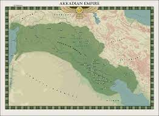
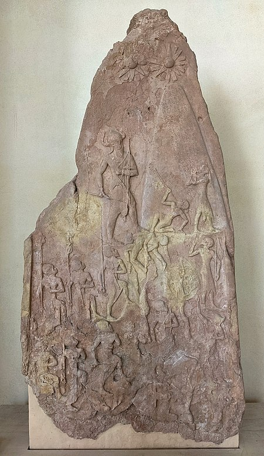
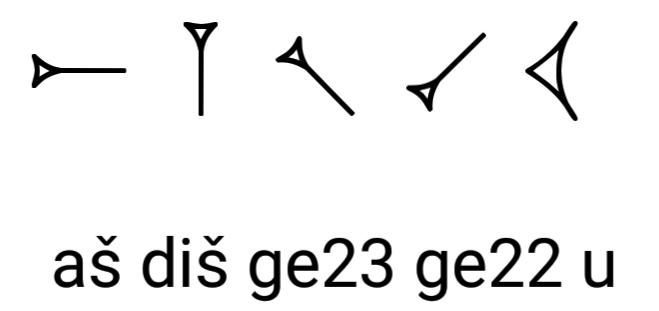

# 阿卡德
* **时间**： 2334 B.C. – 2154 B.C.
  * 阿卡德有时被认为是历史上的**第一个帝国**，尽管这个词的含义并不准确，而且有更早的苏美尔人声称
* **地点**：阿卡德帝国在**美索不达米亚、黎凡特和安纳托利亚**施加影响，派遣军事远征南至阿拉伯半岛的**迪尔蒙和马干**（现代沙特阿拉伯、巴林和阿曼）

  * **地理**：**美索不达米亚地区**基本由沙漠、山峦和大海环绕而成，其西边是**叙利亚沙漠**，北部是土耳其的**托罗斯山脉**，东部是伊朗的**扎格罗斯山脉**，南边滨临**波斯湾**，**幼发拉底河**和**底格里斯河**发源于土耳其东部的山脉和高地，随后几乎平行地向南流入**波斯湾**，沿两岸形成的冲积平原就是美索不达米亚；以今天的巴格达为界，可将美索不达米亚分为南北两部分，即北部的**亚述**和南部的**巴比伦尼亚**
    * 划为**亚述**的北部地形为**高地**，自然资源和降雨相对丰富，以这里为中心，在前1600年产生名为**亚述**的军事帝国；而划为南方的**巴比伦尼亚**地形为**低地**，缺乏石头、木材、金属之类的材料，此地年降雨量不足200毫米，当地人们使用灌溉进行农业生产，丰收的农产品使城市得以发展，此地区于前3500年左右，产生**苏美尔文明**：包括初期的乌鲁克城市文明、苏美尔早王朝时期和阿卡德帝国；前2000年左右，苏美尔文明一度衰落，不过南方后来兴起的巴比伦继承苏美尔的文明，并成为该地区的中心城市
* **起源**：虽然阿卡德城尚未被发掘，但从各种文字资料中可以得知，其中至少有一篇**早于萨尔贡统治**的文本；再加上阿卡德这个名字并非源自阿卡德语，这表明阿卡德市可能在**前萨尔贡时代**就已经被占领了
  * **名字起源**：阿卡德帝国得名于**该地区**和**阿卡德市**，位于底格里斯河和幼发拉底河的总**汇合区**
* **简史**
  * **萨尔贡**：2334 B.C. – 2279 B.C.
    * 萨尔贡据称是拉伊布姆或伊蒂贝尔的儿子，父亲是一个卑微的园丁，母亲可能是伊什塔尔或伊南娜的女祭司
    * 萨尔贡最初是一位名叫乌尔扎巴巴的基什国王的**酒政**（Rabshakeh）；此时的御酒侍实际上是一个显赫的政治职位，与国王关系密切，并肩负着职位名称本身所没有的各种高级职责，这使他能够接触到一支纪律严明的工人队伍，他们也可能是他的**第一批士兵**
    * 萨尔贡取代乌尔扎巴巴被**加冕为国王**，并开始了**征服外国**的事业；他四次入侵叙利亚和迦南，他花了三年时间彻底征服“西方”国家，将它们与美索不达米亚联合为“一个单一的帝国”
    * 阿卡德的萨尔贡在**乌鲁克战役**中击败并俘虏了**卢加尔扎格**，并征服了他的帝国；萨尔贡甚至被记录为组织了前往迪尔蒙（巴林）和马干的海军远征，这是历史上**第一次有组织的海军远征**
    * 然后，萨尔贡更进一步，征服了许多周边地区，建立了一个向西延伸到**地中海**甚至**塞浦路斯**（Kaptara）的帝国，向北一直到**山脉**（后来的赫梯文字声称他与布鲁珊达的哈提国王努尔达加尔作战，深入安纳托利亚）；向东越过**埃兰**；南至**马干**（阿曼） ——据称他在此统治了 **56 年**，尽管只有四个“年名”幸存下来
    * **阿卡德语**最早的记录可以追溯到萨尔贡时代；萨尔贡引入了阿卡德语作为**书面语言**，并为此采用了**苏美尔楔形文字正字法**
  * **里穆什**：2278 B.C. – 2270 B.C. 
    * 萨尔贡在年老时忙于**粉碎反对派的叛乱**；这些困难在他的儿子统治时期再次爆发，在里穆什统治的九年期间爆发了叛乱，他为保住帝国而奋战，直到他被他的手下所暗杀
    * 里穆什造成了**苏美尔城邦**的**大屠杀和大规模破坏**，并坚持详细记录他的破坏；大多数主要的苏美尔城市都被摧毁，苏美尔人的损失是巨大的
  * **马尼什图舒**：2269 B.C. – 2255 B.C. 
    * 马尼什图舒似乎与 32 位国王进行了一场**海战**，这些国王聚集在一起反对他并控制了他们的前阿拉伯国家，包括现代的阿拉伯联合酋长国和阿曼；尽管取得了成功，但和他的兄弟一样，他似乎在一场宫廷阴谋中被暗杀
  * **纳拉姆辛**：2254 B.C. – 2218 B.C. 
    * 在纳拉姆辛的统治下，帝国达到了最大的实力；他是已知的第一个自称**神性**的美索不达米亚国王，获得“**阿K卡德之神**”的称号（“辛”一词意为神），也是第一个获得“**四隅之王，宇宙之主**”称号的人，作为其中的一部分，他成为了**阿卡德的城神**
      * “**宇宙之主**”词源来源于古代苏美尔城市**基什**，原意为**基什国王**；第一个使用宇宙之王头衔的统治者是阿卡德的**阿卡德·萨尔贡**，后来的一系列帝国都使用了它；这个头衔在塞琉古王朝时期得到了最终使用，**安条克一世**（公元前 281-261 年在位）是已知的最后一位被称为“宇宙之王”的统治者
      * 有学者认为，**宇宙王**和**四隅王**的称谓，意义相近，区别在于宇宙王是指统治**宇宙领域**，而四隅王是指统治**地球**
    * 纳拉姆辛打败了位于波斯湾南部尽头的马干国王，并征服托鲁斯山脉北部的高山部落；以及在**尼尼微**设立行政中心
  * **沙-卡利-沙里**：2217 B.C. – 2193 B.C. 
    * 公元前2217年，他在祸乱不断的年代即位；始于其父在位的**库提人**在亚达布的袭击越来越频繁，他面临着许多封臣国王的**叛乱**，因为他们被迫支付高额税收以资助国王防御库提人的威胁
    * 尽管拉加什的总督**卢加-乌苏姆加尔**自称是沙-卡利-沙里的**附庸**，但他的继任者**普泽尔-妈妈**在沙-卡利-沙里统治期间控制了拉加什，并开创了拉加什的第二王朝
    * 在沙-卡利-沙里去世后，苏美尔陷入**无政府状态**，没有国王能够长期统治；此时阿卡德帝国已**不复存在**，此后的国王很可能只控制阿卡德本身，这意味着沙-卡利-沙里是最后一个真正拥有帝国控制的阿卡德国王
  * **崩溃**：2193 B.C. – 2154 B.C.
    * 阿卡德帝国很可能在公元前 22 世纪，在其建国后的 180 年内倒塌，迎来了一个“**黑暗时代**”，直到乌尔第三王朝才没有显赫的帝国权威；该地区的政治结构可能已经恢复到城邦地方治理的现状
    * 经过几年（和 4 位国王）的混乱，**舒图鲁**和**杜都**似乎已经恢复了几十年的中央集权，但他们无法阻止帝国最终彻底崩溃，最终将权力割让给了以亚达布为基地的**库提人**
    * 关于**库提时期**，或者它持续了多久，人们知之甚少；楔形文字资料表明，库提人政府对维护农业、书面记录或公共安全几乎没有表现出任何关心，据称，他们释放了所有农场动物，在美索不达米亚自由漫游，很快就带来了饥荒和粮价飞涨
    * 苏美尔国王**乌尔纳姆**（公元前 2112-2095 年）在其统治期间将库提人从美索不达米亚清除；公元前2112年至公元前2004年被称为**乌尔三世时期**
    * 一种理论将阿卡德时期末期（以及古埃及古王国之后的第一个中间时期）的**区域衰退**与全球百年一遇造成的**古代近东地区干旱**和降雨减少联系起来
* **政府**
  * 阿卡德政府形成了一个“经典标准”，所有未来的美索不达米亚国家都可以与之进行比较
  * 传统上，**恩西**是苏美尔城邦的**最高官员**；在后来的传统中，一个人通过与女神伊南娜结婚而成为恩西，通过神圣的同意使统治合法化
  * 当**萨尔贡**将他的征服从“下海”（波斯湾）扩展到“上海”（地中海）时，人们觉得他统治着“整个天下”，šar kiššati这个头衔被公认为“宇宙之主”的意思；在萨尔贡的统治下，恩西通常保留他们的职位，但更多地被视为**省长**
  * **纳拉姆辛**比萨尔贡走得更远，国王不仅被称为“四分之主（地球）”，而且还被提升为**众神**的行列，建立他自己的寺庙；以前，像吉尔伽美什这样的统治者可以在死后成为神，但从纳拉姆辛开始，阿卡德国王在他们还活着时就被认为是地球上的神
* **经济**
  * 与几乎所有前现代国家一样，阿卡德的人口完全依赖该地区的**农业系统**；该地区似乎有两个**主要中心**：**伊拉克南部**的灌溉农田，以及**伊拉克北部**的粮食播种和雨养农业
  * 在阿卡德时期，伊拉克南部似乎已经接近其每年不到20毫米（0.8英寸）的现代降雨量，结果农业完全依赖**灌溉**；在阿卡德时期之前，由于排水不良的灌溉导致土壤逐渐**盐碱化**，该国南部的小麦产量下降，导致大麦转向更耐盐的种植方式
  * 苏美尔和阿卡德的**农产品过剩**，但其他几乎所有东西都**短缺**，尤其是金属矿石、木材和建筑石材，所有这些都必须**进口**；阿卡德国家扩张到“银山”（可能是金牛座山脉）、黎巴嫩的“雪松”和马干的铜矿，很大程度上是出于**控制这些进口的目标**
  * **国际贸易**发展于阿卡德时期，**印度河**与美索不达米亚的关系似乎也在扩大：阿卡德的萨尔贡（约公元前 2300 年或 2250 年）是第一位明确提到梅卢哈地区的美索不达米亚统治者，该地区通常被理解为俾路支省或印度河地区
* **艺术**
  * 在艺术方面，阿卡德除了延续早期苏美尔艺术之外，还非常强调王朝的**国王**在艺术作品中的地位
  * **阿卡德雕塑**以其精细和逼真而著称，**现实主义**的程度大大提高，与前一时期的苏美尔艺术相比有了明显的进步
  * **纳拉姆辛**国王著名的**胜利石碑**描绘了国王穿越陡坡进入敌境的叙事场景；虽然石碑在被舒特鲁克-纳昆特的埃兰军队偷走时被折断，但它仍然显着地展现了纳拉姆-辛的骄傲、荣耀和神性
    * 石碑在两方面是独一无二的：大多数征服描绘都是**水平显示**的，国王位于顶部中心，这块石碑则以**对角线的方式**描绘了胜利，国王仍然位于顶部中心，但其他人都可以**仰望**他；该作品的第二个独特之处在于，纳拉姆辛被展示为戴着**牛角头盔**在这块石碑被委托时，这种头盔只有神佩戴，这块石碑本质上是在告诉观者，纳拉姆辛是一个胜利的征服者，因为他的**神圣地位**
    * 弱小混乱的对立力量被从山坡上抛下，被长矛刺穿，逃跑并乞求纳拉姆辛的怜悯，并被纳拉姆辛本人踩在脚下；这应该是为了传达他们不文明和野蛮的本性，使征服是**正当的**
    * 石碑上的文字是用**阿卡德楔形文字**书写的，描绘了阿卡德人在鲁鲁比安人的崛起

  * **阿卡德国王头像**是在尼尼微发现的真人大小的**青铜半身像**，可能描绘的是阿卡德的萨尔贡或萨尔贡的孙子纳拉姆辛
    * 复杂的胡须卷曲和图案以及复杂的发型暗示了社会理想男性的皇室、权力和财富
    * 除了其美学特征外，这件作品也非常壮观，因为它是已知**最早使用失蜡铸造工艺的空心铸造雕塑作品**
    * 左侧面部和眼部有刻意损伤，表明半身像后来被刻意切割，以示**政治反传统**

* **语言文字**
  * **阿卡德语**是一种**东闪米特语**，也是**最早记载的闪米特语**，现已绝迹，从公元前三千年开始在**古代美索不达米亚**（阿卡德、亚述、伊辛、拉尔萨和巴比伦）使用，直到到公元前 8 世纪，在美索不达米亚人中逐渐被受阿卡德影响的**古亚拉姆语**取代
  * 在公元前 3 世纪，苏美尔人和阿卡德人之间形成了一种非常亲密的文化共生关系，其中包括广泛的**双语**；**苏美尔语**对**阿卡德语**（反之亦然）的**影响**在所有领域都很明显，从大规模的词汇借用到句法、形态和语音的融合
  * 在青铜时代中期（古亚述语和古巴比伦时期），阿卡德语实际上**取代了苏美尔语**，后者被认为在公元前 18 世纪作为一种活的语言已经**灭绝**；但直到公元 1 世纪，苏美尔语在美索不达米亚继续被用作一种神圣、仪式、文学和科学语言
  * 巴比伦语、亚述语、马里奥蒂特语等都属于阿卡德语的**方言**；一直使用到公元前 19 世纪的**古阿卡德语**逐渐被这些方言所取代，到公元前 21 世纪，将成为主要方言的**巴比伦语**和**亚述语**很容易区分
  * 阿卡德语是用**阿卡德楔形文字**书写的，这是一种从苏美尔人那里采用的文字，使用楔形符号压在湿粘土上；阿卡德语是闪米特语，其结构与苏美尔语完全不同，没有办法直接使用苏美尔文字系统，阿卡德人找到了一个实用的解决方案，即使用相应的苏美尔语音符号以语音方式书写他们的语言
  * 阿卡德王国在前23世纪采用**古字体**（archaic cuneiform），至青铜时代中期，对苏美尔文的字形作了修改，演变为**古亚述楔形文字**

* **文学**
  * 在阿卡德时期，苏美尔文学继续蓬勃发展
  * **恩赫杜安娜**被誉为世界历史上已知**最早的有名作家**，历史上第一位为人所知的**诗人**，是乌尔辛神庙的月神的**高级女祭司**和**萨尔贡的女儿**；她着名的作品包括对女神伊南娜的赞美诗、伊南娜的崇高等，虽然它们开始时使用**第三人称**，但在中间转变为诗人本人的**第一人称**，它们标志着楔形文字使用的**重大发展**

  * 《**阿卡德的诅咒**》写作于阿卡德帝国陷落的一个世纪之内，并将阿卡德的沦陷归因于对恩利尔神的掠夺之后**众神的愤怒**；阿卡德的国王在后来的美索不达米亚文明中是传奇人物，**萨尔贡**被认为是强大而睿智的领袖的原型，他的孙子**纳拉姆辛**却被认为是邪恶和不虔诚的领袖