# 历史的自然实验
## 莫里奥里人和毛利人
* 在新西兰以东500英里处的查塔姆群岛上，**莫里奥里人的长达几个世纪的独立**，于1835年在一片腥风血雨中宣告结束
  * 一群群**毛利人**走过莫里奥里人的一个个定居点，宣布说莫里奥里人现在是他们的奴隶，并杀死那些表示反对的人
  * 在以后的几天中，他们杀死了数以百计的莫里奥里人，把他们的许多尸体煮来吃，并把其余所有的人变为奴隶，在其后的几年中又把其中大多数人随心所欲地杀死
* 莫里奥里人和毛利人之间这场冲突的残酷结果，本是**不难预见**的
  * 莫里奥里人是一个很小的**与世隔绝的族群**，他们是以**狩猎采集**为生的人，所掌握的仅仅是最简单的技术和武器，对打仗毫无经验，也缺乏强有力的领导和组织
  * 毛利人入侵者（来自新西兰的北岛）是**人口稠密的农民族群**，他们长期从事残酷的战争，装备有比较先进的技术和武器，并且在强有力的领导下进行活动
* 毛利人和莫里奥里人的这次冲突使人们了解到一个可怕事实，原来这两个群体是在不到1000年前从同一个老祖宗那里分化出来的，他们都是**波利尼西亚人**
  * **现代毛利人**是公元1000年左右移居**新西兰**的**波利尼西亚农民的后代**；在那以后不久，这些毛利人中又有一批移居**查塔姆群岛**，变成了**莫里奥里人**
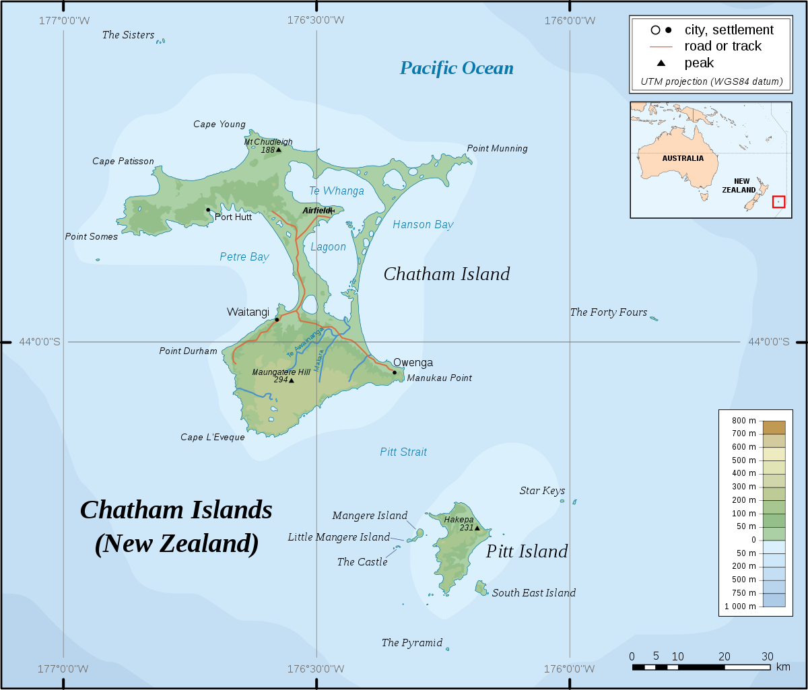
  * 在这两个群体分道扬镳后的几个世纪中，他们各自朝相反的方向演化，北岛毛利人发展出比较复杂的技术和政治组织，而莫里奥里人发展出来的技术和政治组织则比较简单；莫里奥里人回复到以前的狩猎采集生活，而北岛毛利人则转向更集约的农业
* 莫里奥里人和毛利人的历史构成了一个短暂的小规模的**自然实验**，用以测试环境影响人类社会的程度
  * 有目的的实验不可能用于人类社会；科学家只能去寻找“自然实验”，因为根据这种实验，人类在过去也碰到了类似情况 
* 这种实验在人类**定居波利尼西亚**时展开了
  * 在新几内亚和美拉尼西亚以东的太平洋上，有数以千计的星罗棋布的岛屿，它们在面积、孤立程度、高度、气候、生产力以及地质和生物资源方面都大不相同
  * **公元前1200年**左右，一批来自新几内亚北面**俾斯麦群岛**的从事农业、捕鱼和航海的人，终于成功地到达了其中的一些岛屿；在随后的**几百年中**，他们的子孙几乎已移居到太平洋中每一小块可以住人的陆地上来
  * 这个过程大都在**公元500年**时完成，最后几个岛大约在**公元1000年**或其后不久有人定居
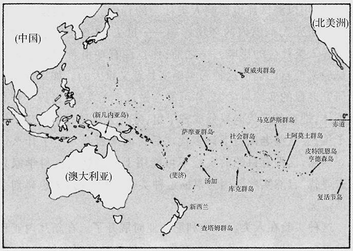
  * 这样，就在一个**不太长**的时间内，存在**巨大差异**的各种岛屿环境中都**有人定居**下来，所有这些人都是**同一群开山鼻祖**的**子孙后代**
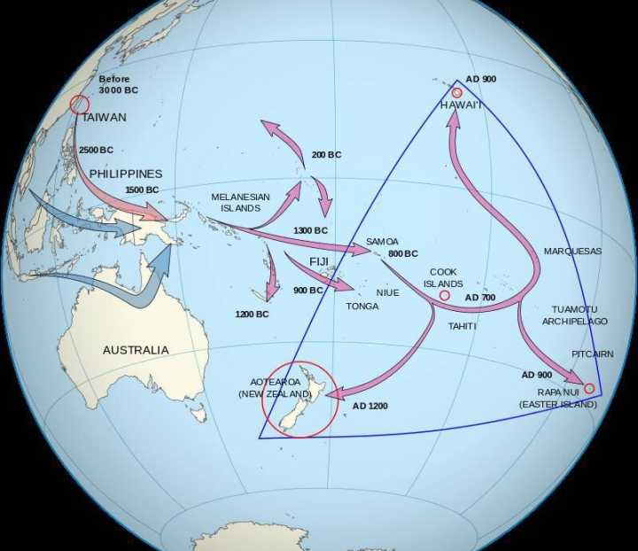
* 在这个中等规模的试验内，莫里奥里人的命运又构成了一个更小的试验
  * 虽然最早在查塔姆群岛移民的毛利人祖先可能都是**农民**，但毛利人的**热带作物**不可能在查塔姆群岛的**寒冷气候**下生长，所以那些移民别无他法，只得重新回到**狩猎采集生活**
  * 由于他们以**狩猎采集**为生，他们不能生产多余的农作物供重新分配和贮藏之用，所以他们无法养活不事狩猎的专门手艺人、军队、行政官员和首领；查塔姆群岛都是一些比较小、比较偏远的岛屿，能够养活的总人口只有**2000个左右**的以狩猎采集为生的人，其结果是出现了一个小小的不好战的群体，他们的技术和武器简单粗陋，也没有强有力的领导组织
  * 相比之下，新西兰的北部（比较温暖）是波利尼西亚的**最大岛群**，适宜于波利尼西亚的农业，留在新西兰的那些毛利人人数增加了，直到**超过10万人**；由于他们栽种的农作物有剩余并可用来贮藏，他们养活了一些专门的手艺人、首领和兼职士兵
## 波利尼西亚群岛的环境差异
* 在波利尼西亚群岛之间，至少有6种**环境可变因素**促成了波利尼西亚社会之间的差异：**岛屿气候**、**地质类型**、**海洋资源**、**面积**、**地形的破碎**和**隔离程度**
* 波利尼西亚从靠近赤道的大多数岛屿上热带或亚热带的**温暖**，到新西兰大部分地区的**不冷不热**，以及查塔姆群岛和新西兰南岛南部地区的亚南极的**寒冷**，各种气候都有
  * 夏威夷的大岛虽然地处北回归线以内，但也有**高山**，足以维持一些高山栖息地，山上偶尔也会**降雪**；**雨量**也因地而异，有些地方雨量创**世界最高纪录**（在新西兰的峡湾地和夏威夷考爱岛上阿拉凯沼泽），有些岛上雨量只有上面的**十分之一**，这些地方干旱得只能勉强发展农业
* 岛屿**地质类型**包括环状珊瑚岛、隆起的石灰岩、火山岛、陆地碎块，以及这些类型的混合类型
  * 在一个极端，是一些刚刚露出海面或者大大高出海面的**低平环状珊瑚岛**；这两种类型的环状珊瑚岛使人类移居碰到了难题，因为它们完全由**石灰岩**构成，没有其他石头，只有薄薄的一层土壤，也没有长年不竭的淡水
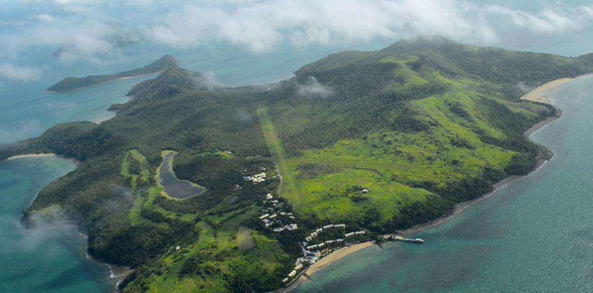
  * 在另一极端，波利尼西亚最大的岛屿是**新西兰**，它是一个从冈瓦纳大陆分离出来的古老的、具有**地质多样性**的陆块，上面有一系列矿物资源，包括可作商业开发的铁、煤、黄金和玉石
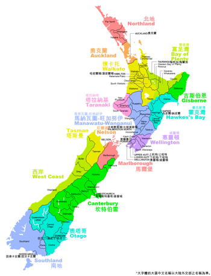
* 至于**海洋资源**，波利尼西亚群岛中的大多数岛屿都由**浅水**和**礁石**包围着，有许多上面还有潟湖，这里盛产**鱼**和**有壳水生动物**
  * 然而，复活节岛、皮特凯恩岛和马克萨斯群岛的多岩石海岸和陡峭直下的洋底以及周围缺少珊瑚礁，使这里的海产少得多
* **面积**是另一个明显的可变因素
  * 从只有100英亩的**阿努塔**这个有永久性居民的与世隔绝的波利尼西亚最小岛屿，一直到103000平方英里的**新西兰**这个微型大陆，各种大小应有尽有
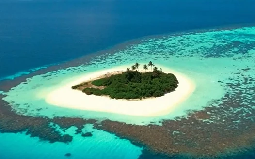
* 最后一个需要予以考虑的环境可变因素是**隔离程度**
  * **复活节岛**和**查塔姆群岛**面积很小，同其他岛屿又相距甚远，一旦开始有了移民，则那里所建立的社会就只能在与世界其余地区**完全隔绝**的状态下发展
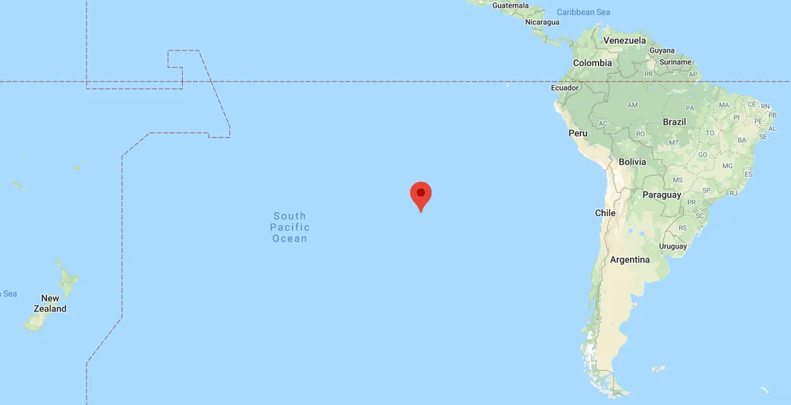
  * **新西兰**、**夏威夷**和**马克萨斯群岛**也很偏远，但后两者在首次有了移民后确曾与其他群岛有过某种**进一步的接触**，而所有这三者又都是由许多岛屿组成，这些岛屿相距很近，有利于同一个群岛中各个岛屿之间的经常接触
  * 波利尼西亚其他岛屿中大多数保持着或多或少的**经常接触**；尤其是，**汤加群岛**与**斐济群岛**、**萨摩亚群岛**和**瓦利斯群岛**咫尺相望，使各群岛之间可以定期航行，并最终使汤加征服了斐济
## 环境差异的影响
* 波利尼西亚人赖以生存的手段五花八门：捕鱼、采集野生植物、捕捞海洋有壳动物和甲壳动物、猎捕陆栖鸟和繁殖季节的海鸟，以及生产粮食
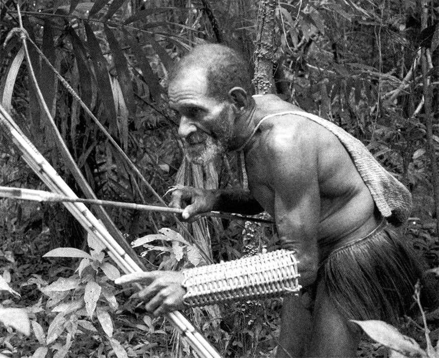
  * 波利尼西亚大多数岛屿原来都有一些**大型的不会飞的鸟**，新西兰的恐鸟和夏威夷的不会飞的野鹅就是这方面最著名的例子；虽然这些鸟是最早移民的重要的食物来源，但其中大多数在所有岛屿上很快**灭绝**了，因为它们很容易被追捕到
  * 波利尼西亚人的祖先曾带来3种**驯化动物**（猪、鸡和狗），从那以后，在波利尼西亚范围内就再也没有驯养过任何其他动物；许多岛上仍然饲养着所有这3种动物，但那些比较孤立的波利尼西亚岛屿总要缺少一两种；例如，与世隔绝的**新西兰**最后只剩下了**狗**，**复活节岛**和**提科皮亚岛**只剩下了**鸡**
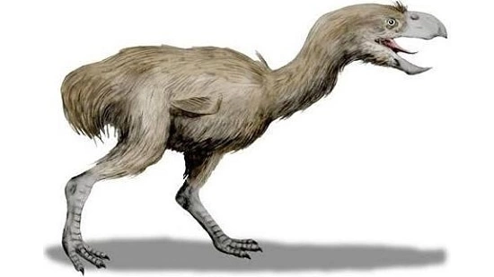
  * 波利尼西亚人的食物生产主要依靠**农业**，而在亚南极纬度地区是不可能有农业的，因为波利尼西亚的所有作物都是**热带作物**，当初在波利尼西亚以外的地方驯化，后来被移民带了进来；查塔姆群岛和新西兰南岛寒冷的南部地区的移民，因此不得不**放弃**他们的祖先在过去几千年中发展起来的农业遗产而再次成为以**狩猎采集**为生的人
  * 波利尼西亚其余岛屿上的人也从事**农业**，主要是**旱地作物**（特别是芋艿、薯蓣和甘薯）、**灌溉作物**（主要是芋艿）和**木本作物**（如面包果、香蕉和椰子）
  * 在亨德森岛、伦纳尔岛和环状珊瑚岛的人口密度是**最低**的，因为那里土壤贫瘠，淡水有限；这些岛上和其他一些岛上的波利尼西亚人，从事一种非集约型的、轮垦的、刀耕火种的农业
  * 其他一些岛屿虽然**土壤肥沃**，但因高度不够而没有长年不竭的大溪流，因此也就**没有灌溉之利**；这些岛上的居民发展了**集约型的旱地农业**，这需要投入很大的劳动力来修筑梯田，用覆盖料覆盖地面，进行轮作，减少或取消休耕期，以及养护林场
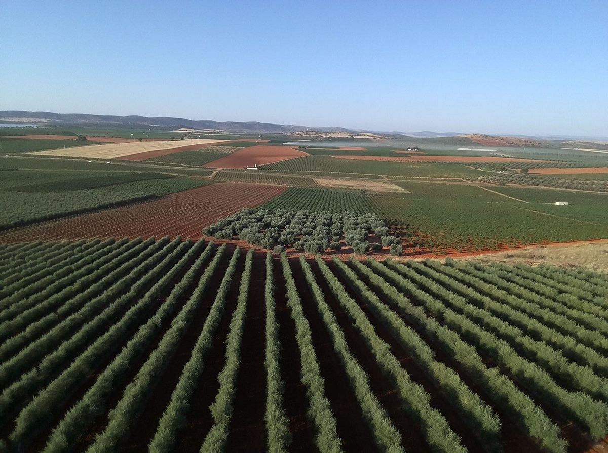
  * 波利尼西亚的最多产农业是在水浇地里**种植芋艿**；**夏威夷**用强征劳动力修建了浇灌芋艿田的**复杂的灌溉系统**，使每英亩芋艿产量达到24吨，是整个波利尼西亚农作物的**最高产量**，这些产量反过来又支援了集约型的养猪业

* 由于在生存方面所有这些与环境有关的差异，**人口密度**（按每平方英
里可耕地上的人数来测算）在整个波利尼西亚也差异很大
  * 人口密度低的是**查塔姆群岛**（每平方英里仅5人）和**新西兰南岛**上以狩猎采集为生的人，还有**新西兰其余地区**的农民（每平方英里28人）
  * 相形之下，许多从事**集约型农业**的岛屿的人口密度则超过每平方英里120人：**汤加**、**萨摩亚**和**社会群岛**达到每平方英里210—250人，**夏威夷**则达到每平方英里300人
  * **阿努塔**这个高地岛则达到了人口密度的另一极端，即每平方英里1100人，岛上的人把所有陆地都改作集约型粮食生产之用，从而在这个岛的100英亩土地上挤进了160个人，使自己跻身于世界上密度最大的自给自足的人口之列
* **人口的多少**是人口密度（每平方英里的人数）和面积（平方英里）的乘积
  * 相关的面积并不就是一个岛的面积，而是一个行政单位的面积，这个单位可以大于也可以小于一个岛
  * 一方面，一些彼此靠近的岛可以组成一个行政单位，另一方面，一个高低不平的大岛则分成许多个独立的行政单位；因此，行政单位的面积不但因一个岛的**面积大小**而异，而且也会因该岛的**地形破碎**和**隔离程度**而有所不同
  * 对于一些孤立的小岛来说，如果不存在影响岛内交往的巨大障碍，那么**整个岛**就是一个行政单位——例如有160人的**阿努塔岛**
  * 有许多较大的岛在行政上却从来没有统一过，例如，在邻近的**马克萨斯群岛**上四面峭壁的山谷中生活的人要通过**海路**来互相交往；每个山谷就是一个由几千居民组成的独立的行政实体，而马克萨斯群岛中大多数单独的大岛仍然分成许多这样的实体
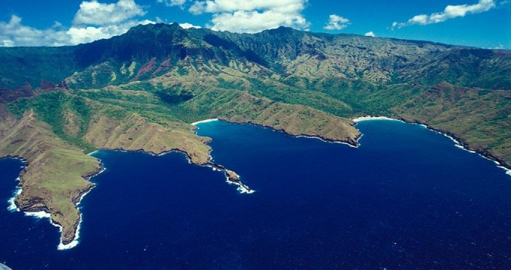
  * **汤加群岛**中各岛之间的距离，以及汤加群岛与邻近群岛之间的距离，都不算太大，所以能够最后建立了一个包含**4万人**的多岛帝国；这样，波利尼西亚的行政单位从几十个人到4万人，各种大小都有
* 在波利尼西亚社会中，与**不同的人口密度**和**人口多少**相联系的差异有以下几个方面
  * 在人口密度低、人数少的一些岛屿上，很少有或根本不存在经济的**专业化**；专业化在一些面积较大、人口密度较高的岛屿上发展起来，在萨摩亚、社会群岛、尤其是汤加和夏威夷达到了顶峰
  * 社会的复杂程度也同样存在着差异，查塔姆群岛和环状珊瑚岛仍然是最简单、最**平等**的社会，在一些人口密度高、设有大行政单位的岛屿上，**社会差别**扩大了，首领的权力也增加了，这一现象在汤加和社会群岛尤为明显
  * **政治组织**也遵循同样的趋势，在查塔姆群岛和环状珊瑚岛，首领可以掌握的资源**不多**，决定也是通过全体讨论作出的，土地所有权属于整个社区，而不属于首领；在汤加和夏威夷，政治的**复杂程度**最高，世袭首领的权力接近于世界上其他地方**国王**的权力
* 当欧洲人于18世纪到达时，**汤加**的首领管辖部落或国家业已成了一个由各群岛组成的**帝国**
  * 由于汤加群岛本身在地理上**紧密结合**在一起，而且包含几个地形完整的大岛，所以每一个岛都在**一个首领统治**下统一起来；接着，汤加的最大岛屿（**汤加塔布岛**）的世袭首领们**统一了整个群岛**，并最后征服了该群岛以外的一些岛屿，最远的达500英里
  * 他们与**斐济**和**萨摩亚**进行**远距离定期贸易**，在斐济建立汤加的**殖民地**，并开始劫掠和征服斐济的一些地区；对这个海洋原型帝国的征服和管理，都是靠每只最多可载150人的**大独木舟**组成的海军来实现的
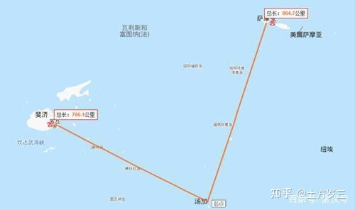
* 同汤加一样，**夏威夷**也是一个行政实体，它包含几个人口众多的岛屿，但由于它的极其孤立的地理位置，它只是一个**局限在一个群岛中**的行政实体
  * 当欧洲人于1778年“发现”夏威夷时，行政统一已在夏威夷的每一个岛的内部产生，而岛与岛之间的某种行政联合也已开始；最大的4个岛——大岛（狭义的夏威夷）、毛伊岛、瓦胡岛和考爱岛——仍然是独立的，它们控制着（或互相耍弄手腕图谋控制）较小的岛屿（拉奈岛、莫洛凯岛、卡胡拉韦岛和尼豪岛）
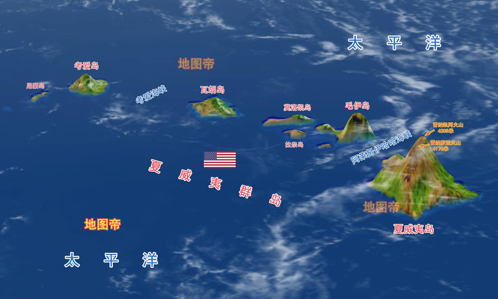
* 波利尼西亚各社会之间的其余一些需要予以考虑的差异，涉及**工具与物质文化**的其他方面
  * 查塔姆群岛的岛民们除了用来杀死海豹、鸟和龙虾的手持棍棒外，几乎再不需要其他东西；其他大多数岛民则制造了大量的形形色色的鱼钩、扁斧、首饰和其他物品
  * 波利尼西亚的**最大产品**要算几个岛上的巨型石头建筑——复活节岛上著名的雕像、汤加首领的陵墓、马克萨斯群岛上的举行仪式的平台以及夏威夷和社会群岛上的庙宇；波利尼西亚的这种纪念性建筑的演进方向，显然与埃及、美索不达米亚、墨西哥和秘鲁这些地方的金字塔相同
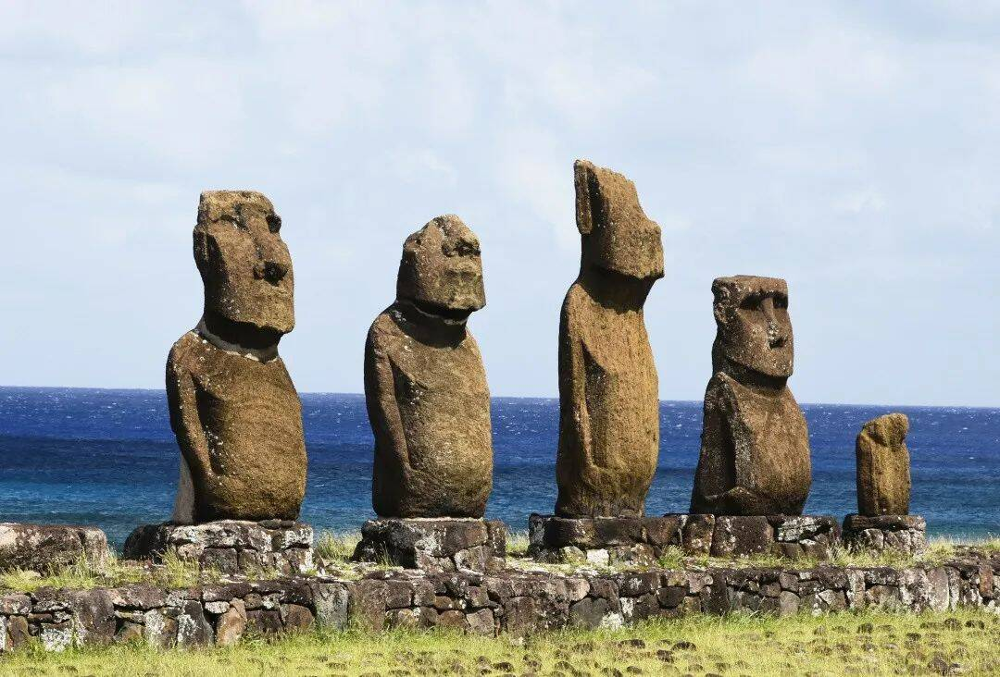
## 实验分析
* 因此，波利尼西亚的岛屿社会在其经济专业化、社会复杂程度、政治组织以及物质产品方面存在着巨大的差异；这些差异与人口的数量和密度的差异有关，又与岛屿的面积、地形破碎程度和隔离程度有关，也与维持生存和加强粮食生产的机会有关
  * 波利尼西亚内部的这种种文化差异，基本上也就是世界上其他每一个地方所出现的那些差异
* 当然，在世界其余地区的**差异程度**，要**远远超过**波利尼西亚群岛内的差异程度
  * 虽然现代大陆民族也包括像波利尼西亚人那样的依靠**石器**的族群，但南美洲也产生了一些**熟练使用贵金属**的社会，而欧亚大陆的人和非洲人又进而利用**铁器**；这些发展阶段都不可能在波利尼西亚得到实现，因为除新西兰外，波利尼西亚没有一个岛有重要的**金属矿床**
  * 甚至在波利尼西亚有人定居前，欧亚大陆已有了一些**成熟的帝国**，南美洲和中美洲在晚些时候也出现了**帝国**，而波利尼西亚这时才刚刚有了两个**原型帝国**，其中的一个（夏威夷）只是在欧洲人到达后才和另一个联合起来
  * 欧亚大陆和中美洲有了本地的**文字**，而文字却没有在波利尼西亚出现，也许复活节岛是个例外，然而无论如何，那里的神秘文字可能出现在岛民与欧洲人发生接触之后

* 这就是说，关于全世界人类社会的**差异性问题**，波利尼西亚给我们看到的只是一个小小的剖面，而不是全貌；这并不使我们感到意外，因为波利尼西亚给我们看到的只是全世界地理差异性的一个**小小的剖面**而已

