# 走上起跑线
* 用以比较不同大陆的历史发展的合适起点是**公元前11000年左右**
  * 这个年代大致相当于世界上一些地区**村社生活的开始**
  * 这时，**美洲**毫无疑问已经出现了首批定居者，更新世和上一次冰期已经结束，地质学家所说的**全新世**已经开始
  * 在那个年代的几千年内，**动植物的驯化**至少在世界上的一个地方开始了
* 这一章将要就各大陆的人类历史进行一次旋风式的旅行，从我们作为一个物种的起源开始，经过几百万年，直到13000年前
## 人类的进化
* 我们活着的近亲是现存的3种**类人猿**：**大猩猩**、**普通黑猩猩**和**矮脚黑猩猩**（也叫倭黑猩猩）
  * 这3种猩猩只生活在**非洲**，那里又有丰富的**化石证据**，这就表明人类初始阶段的演化是在非洲进行的

* 人类的历史与动物的历史分道扬镳，大约在**700万年前**开始于**非洲**（据估计在500万至900万年之前）
  * 约当此时，**非洲猿**的一个种群分成了几个种群，其中一支继续演化成**现代大猩猩**，一支演化成两种**现代黑猩猩**，还有一支则演化成**人类**；大猩猩这一支的分化显然稍早于黑猩猩与人类之间的分化
* 一些化石表明，我们的直系祖先到了大约**400万年前**基本上已能**直立**，然后在**大约250万年前**身体开始长高，相对**脑容量**开始增大
  * 这些原人通常叫做**非洲南方古猿**、**能人**和**直立人**，他们显然是按照这个顺序进行演化的
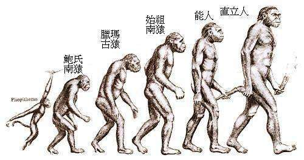
  * 虽然大约在**170万年前**即已达到了直立人这个阶段，但直立人也只是在**身材方面**和现代人接近，他的脑容量几乎仍然不到我们的一半
  * **石器**在大约250万年前已很普遍，但它们仍然不过是最**粗糙**的石片和石头砍凿器
* 人类在这方面的全部历史，在人类于大约700万年前起源后的最初**500万或600万年**中，仍然局限于**非洲**；首先走出非洲的人类祖先是**直立人**，这已从**东南亚爪哇岛**上发现的化石得到证明，这些化石通常称之为**爪哇人**
  * 年代最久远的爪哇人化石，其年代通常被认为约**100万年前**；然而，最近有人认为，其年代实际上是**180万年前**
  * 目前，对于**欧洲人类**公认的最早证据产生在大约**50万年前**，但也有人认为时间可能更早
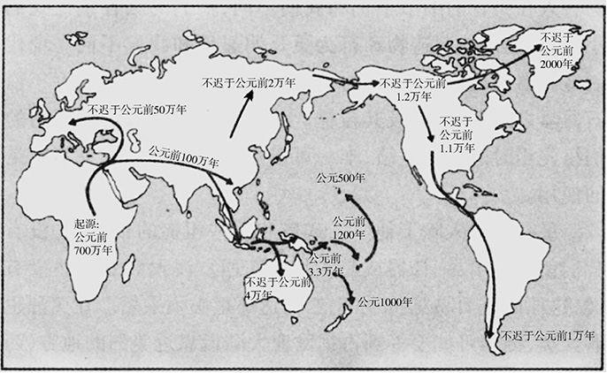
* 这说明了一个将反复出现的问题，每当某个科学家宣布发现了“最早的Ⅹ”，这一宣布又刺激了其他科学家去发现更早的东西以便更胜一筹；对这类问题，常常要花几十年时间去仔细探究，考古学家们才能达成共识
* 到了大约**50万年前**，人类化石的**头骨**变得较大、较圆也较少棱角，这已和较早的直立人的骨骼**有所不同**
  * 50万年前的非洲人和欧洲人的头骨与我们现代人的头骨已相当近似，所以被归入我们**智人**这一类，而不是归入直立人一类
  * 然而，这些初期的智人在头骨的细节上仍和我们**不同**，他们的脑容量比我们的**小得多**，他们的制造物和行为更是明显地和我们不同；唯一可以用浓墨重彩加上一笔的是**火的使用**
  * 最初的智人除了他们的残骸和那些粗糙的石器外，没有给我们留下艺术品、骨器或其他任何东西
* 从50万年前往后，**非洲和亚欧大陆西部的人类**彼此之间以及和**东南亚人类**之间，从骨骼的细节来看在**继续分化**
  * 从**13万到40万年前**，欧洲和亚洲西部人口的集中体现是特别众多的骨骼化石，他们被认为是尼安德特人，有时被归入一个单独的人种——**尼安德特人**
  * 尽管尼安德特人在许多漫画里被描绘成住在洞穴里像猿一样的野蛮人，但他们的脑却比我们的还要**稍大一些**；有强有力的证据表明，他们还是第一批懂得**埋葬死者、照顾病人**的人
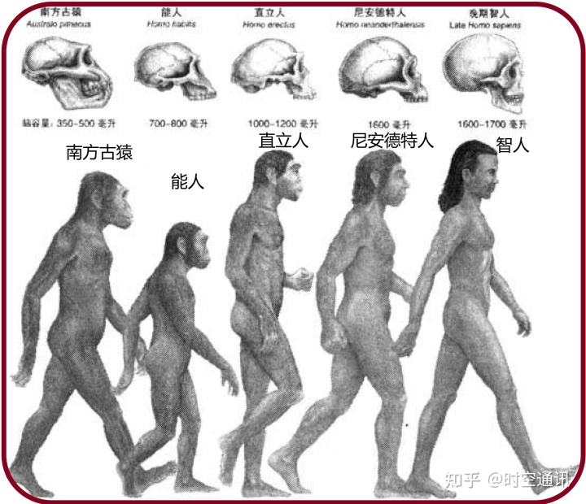
  * 然而，同现代新几内亚人的磨光石斧相比较，他们的石器仍显得**粗糙**，他们还不曾造出形制标准、形状多样、每件都有其明确功用的工具来
* 现在保存下来的、与尼安德特人同时的少数几个**非洲人的骨骼残片**，与其说像尼安德特人的骨骼，不如说更像我们**现代人的骨骼**
  * 他们所制造的石器基本上和尼安德特人的石器同样**粗糙**，仍然缺乏标准的形制，也没有任何保存下来的艺术品，狩猎技巧平常，甚至不会捕鱼；他们和同时代的尼安德特人仍然**不能算作完全的人**
* 人类历史终于在大约**5万年前**开始了，也就是在所谓的“大跃进”时期
  * 这种大跃进的最早的明确迹象是在**东非遗址**出土的**标准石器**和**第一件保存完好的首饰**（鸵鸟蛋壳做的珠子项链）；同样的情况不久又出现在**近东和东南欧**，然后（约4万年前）又出现在**西南欧**，那里大量的**人工制品**与称作**克罗马努人**的完全现代人的骨骼一起被发现了
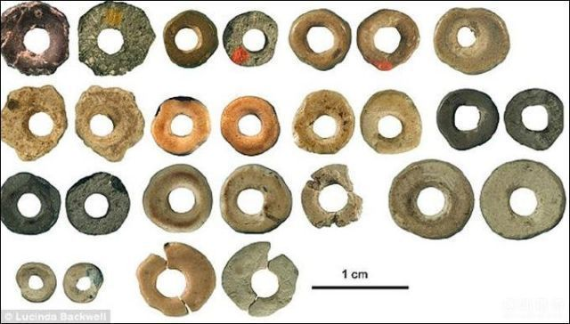
  * 在克罗马努人的遗物堆积中不仅有**石器**，而且还有**骨器**，骨器易于成形（如做成鱼钩）这一点显然是以前的人所没有认识到的；有些工具做成了各种不同的**特殊形状**，就像现代的工具一样，有针，有锥子，有雕刻工具，还有其他等等
  * 出土的不仅仅是单件工具，还有多件**复合工具**；在克罗马努人遗址上可以认出来的**复合武器**包括鱼叉、梭镖投掷器，最后还有弓箭，这些都是步枪和其他现代复合武器的前身
  * 在一直保存完好的克罗马努人的物品中，最著名的是他们的**艺术作品**：壮丽的洞穴壁画、雕像和乐器，这些东西我们今天仍然当作艺术品来欣赏
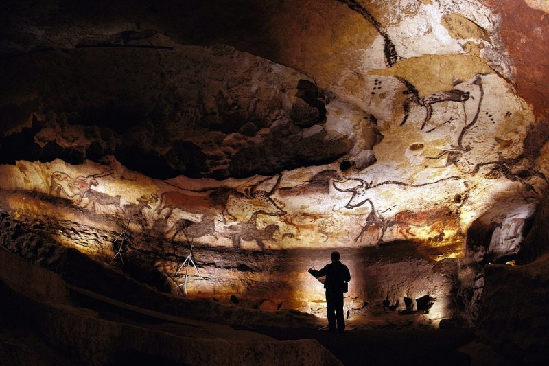
* 显然，从大约10万年到5万年前，我们祖先的能力发生了某种**重大的变化**
  * 那次大跃进提出了两个未解决的主要问题，即其**触发原因**及**发生地点**问题
    * 至于**原因问题**，《第三种黑猩猩》一书中主张，是**喉的完善**为**现代语言**提供了解剖学的基础，而发挥人的创造力是要大大依靠语言的；而另外一些人则提出，在当时脑容量不变的情况下**脑组织**发生的变化，使现代语言成为可能
* 至于这个大跃进发生的**地点问题**，它是不是发生在某一个地理区域，发生在某一群人当中，因而使他们能够扩张自己的势力范围，并取代了世界上其他地方以前的那些人？或者，它是不是在不同地区同时发生，而今天生活在这每一个地区的人可能就是大跃进前生活在该地区的人的后代？
  * 在非洲出土的、看上去相当现代的、大约10万年前人的头骨，一直被用来支持前一种观点，认为大跃进明确地发生在**非洲**
  * 另一方面，千百万年前生活在**中国和印度尼西亚**的人的头骨，则被一些体质人类学家认为分别显示了仍可在现代中国人和澳大利亚土著居民身上发现的一些特征
  * 主张现代人发源于一个局部地区，接着向外扩散，到后来又取代了其他地方的人，这方面最强有力的证据似乎是在**欧洲**；大约4万年前，**克罗马努人**带着他们现代人的体格、优良的武器和其他先进的文化特征进入欧洲，不出几千年，**尼安德特人不复存在**，虽然几千年来，他们作为欧洲唯一的居民，一直在这块土地上繁衍生息
    * 这个结果有力地表明了，现代的克罗马努人以某种方式**杀害或取代**了尼安德特人，而又**很少或根本没有任何证据**可以证明尼安德特人和克罗马努人之间的**混合现象**
## 人类的扩张
### 澳大利亚与新几内亚
* 这种大跃进同我们的祖先在欧亚大陆定居以来**第一次被证实的人类地理的重大扩张**，在时间上不谋而合
  * 这次扩张包括占据**澳大利亚和新几内亚**，这两个地方在当时还连在一起成为一个大陆
  * 许多用碳-14测定的遗址证明，从**4万年到3万年前**（还有那照例必有的对正确性提出质疑而认为时间多少要早一些的主张），人类已在澳大利亚/新几内亚出现了
* 在冰川时代，海洋中大量的水被**锁闭在冰川中**，因此全世界海平面要比现在**低几百英尺**
  * 结果，现在亚洲和印度尼西亚的苏门答腊、婆罗洲、爪哇和巴厘这些岛屿之间的**浅海**当时成了**干燥的陆地**（其他一些水浅的海峡如白令海峡和英吉利海峡情况也是如此）；东南亚大陆边缘比现在的位置要**往东700英里**
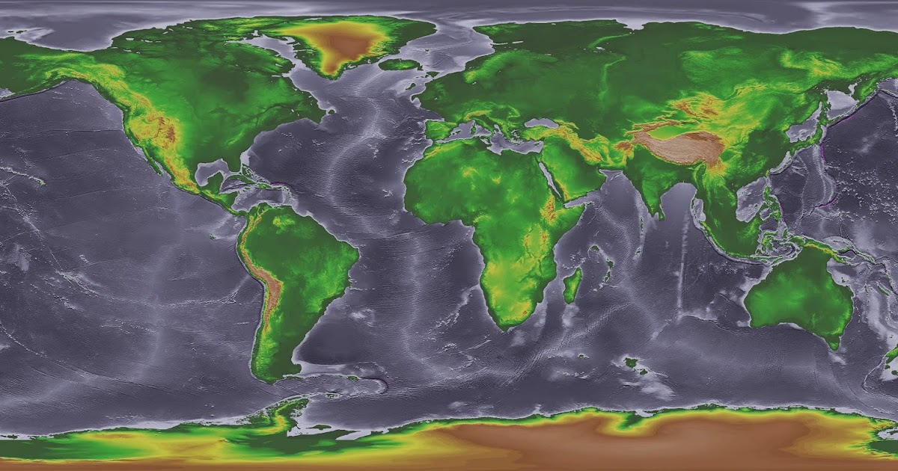
  * 然而，在巴厘岛和澳大利亚之间的**印度尼西亚中部诸岛**仍然为一些深水海峡所包围和分隔；那时候，要从亚洲大陆到达澳大利亚/新几内亚，仍然需要渡过**至少8个海峡**，其中最宽的一个海峡至少有50英里宽
  * 因此，对澳大利亚/新几内亚的占有是一个重大事件，因为那需要有水运工具，因此这一点显然提供了关于历史上**使用水运工具的最早证据**；直到大约3万年后（13000年前）才有了除地中海外世界上任何其他地方出现了水运工具的有力证据
* 起先，一些考古学家认为，向澳大利亚/新几内亚移居可能是**意外的结果**：有几个人在印度尼西亚的一个岛屿旁的木筏上捕鱼时被卷入海中
  * 但是，相信这种**偶然移民论**的人却由于最近的一些发现而大吃一惊，这些发现表明，到了大约35000年前，在新几内亚东面还有一些**无法看到的岛屿**紧接在新几内亚本土之后也有人移居了
  * 因此，早期的澳大利亚人和新几内亚人可能是**有意识地**渡水前往一些看得见的岛屿，同时由于经常使用**水运工具**，他们不断地在无意中抵达了甚至看不见的、遥远的岛屿
* 除了人类自到达欧亚大陆以来第一次使用水运工具和扩大活动范围外，对澳大利亚/新几内亚移民还与另一个重大的第一次联系在一起：**人类第一次大规模灭绝大型动物物种**
  * 今天的澳大利亚/新几内亚没有**大型哺乳动物**，事实上连大于100磅重的**袋鼠**的哺乳动物也没有了
  * 但澳大利亚/新几内亚以前也曾有过它自己的一批**多种多样的大型哺乳动物**，包括大袋鼠，和其状如犀、其大如牛、叫做古草食有袋动物的有袋类动物，以及有袋类的“豹”
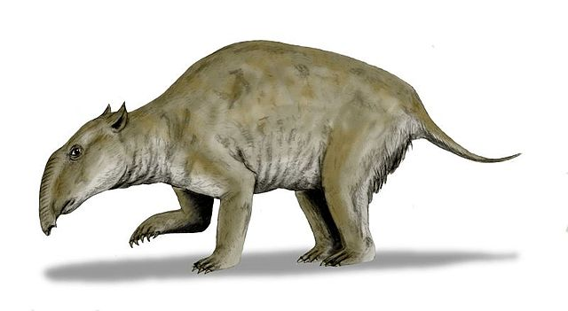
* 澳大利亚/新几内亚的所有这些巨型动物**在人类到达后全都消失了**
  * 虽然对于这些动物灭亡的确切时间一直存在争议，但有几个澳大利亚考古遗址，其年代绵延几万年之久，动物遗骨沉积惊人地丰富，在经过仔细地发掘之后，竟没有发现有关**过去35000年中**现已灭绝的巨型动物的一丝痕迹
  * 因此，这种巨型动物大概在**人类到达澳大利亚不久后**就灭绝了
* 一个显而易见的**可能答案**是：它们被首批到达的人类**杀光了或间接消灭了**
  * 澳大利亚/新几内亚的动物曾经在没有人类猎杀的情况下演化了**几百万年**，**加拉帕戈斯群岛**和**南极**的鸟类和哺乳动物同样也是在没有人类的情况下演化的，并且直到**现代**才看见了人，所以今天仍然**温顺**得不可救药；如果不是环境保护主义者采取了**保护性措施**，它们可能已经很快灭绝
  * 在其他一些最近才发现的岛上，由于保护措施没有很快实施，**消灭动物**的事的确发生了：一个这样的受害者就是毛里求斯岛的**渡渡鸟**，渡渡鸟实际上已成了一种绝种的象征
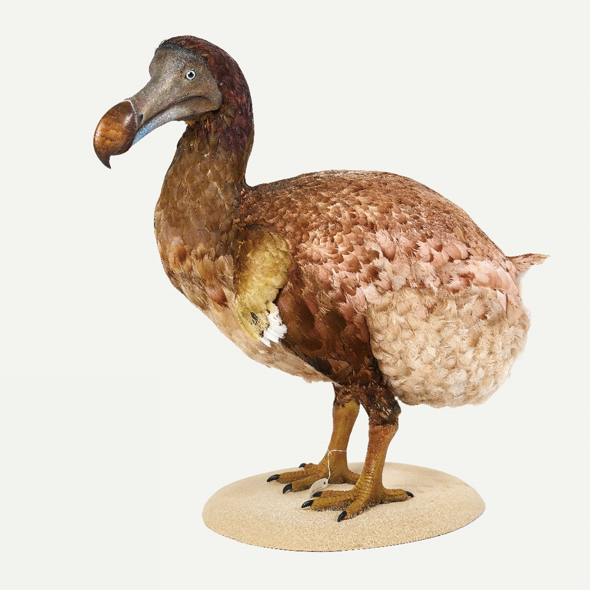
  * 因此，关于**澳大利亚和新几内亚**的巨型动物消失的一个假设是，它们在大约4万年前遭到了同样的命运；相形之下，倒是**非洲和欧亚大陆**的大多数大型哺乳动物活到了现代，因为它们已和原人一起共同进化了几万年或几百万年，因此，由于我们祖先开始时并不高明的**狩猎技巧**提高得很慢，它们就有了充裕的时间来逐步形成**对人类的恐惧**
* 然而，就澳大利亚/新几内亚的情况而言，对这种所谓**过度猎杀**的假设也并非没有人**提出异议** 
  * 那些持批评意见的人则回敬以一种**相反的理论**：这些巨型动物是死于**气候的变化**，例如在本已长期干旱的澳洲大陆发生了严重的旱灾
  * 但令人无法理解的是，澳大利亚巨型动物在其澳大利亚的几千万年的历史中何以历经**无数的干旱**而不死绝，后来却决定几乎**同时倒毙**（至少在几百万年这个时间范围内），而时间又正好和第一批人类到达的时间碰巧一致
  * 这些巨型动物灭绝的地方不仅有澳大利亚**中部的干旱地区**，而且还有潮湿的新几内亚/澳大利亚**东南部地区**；它们灭绝于一个个栖息地，从沙漠地带到冷雨林和热带雨林，无一例外
* 澳大利亚/新几内亚所有大型动物的消失对其后的人类历史带来了**严重的后果**；这些动物绝种了，本来可以用来**驯化**的所有大型野生动物也就被消灭了，这就使澳大利亚土著和新几内亚人再也没有一种**属于本地的家畜**了
### 美洲
* 人类移居澳大利亚/新几内亚差不多到**大跃进**的时候才实现；随后接着发生的人类活动范围的又一次扩张，是进入欧亚大陆的**最寒冷地区**
  * 虽然**尼安德特人**生活在冰川时代，对寒冷的气候已经适应，但他们再没有向北进一步深入，只到**德意志北部**和**基辅**为止；这并不奇怪，因为尼安德特人显然没有针，没有缝制的衣服、温暖的住房以及其他为在最寒冷气候中生存所必不可少的**技术**
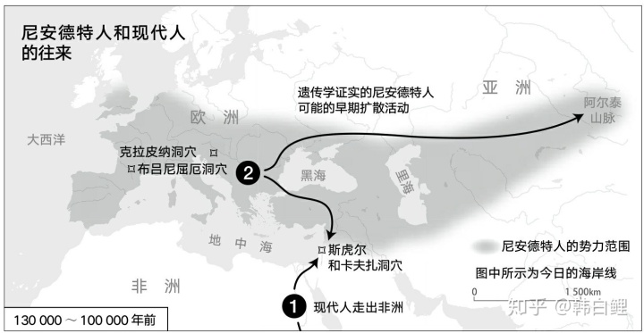
  * 从解剖学看，确实掌握了这种技术的现代民族，在大约2万年前进入**西伯利亚**（对此通常都有一些认为时间还要早得多的说法）；这一扩张可能就是欧亚大陆**长毛象**和**长毛犀**绝种的原因
* **北美洲**和**南美洲**无疑是最后两个有人定居的大陆（除19世纪才有人到达的南极大陆外）
  * 这原因很明显，因为从旧世界到达美洲要么用**船**（甚至在印度尼西亚直到4万年前才有证据表明已有了船，而欧洲要晚得多才有船）去渡海，要么得先占有**西伯利亚**（直到大约2万年前才有人居住）以便通过**白令陆桥**
* 然而，不能肯定的是，在大约**35000年前**到**14000年前**这段时间里，美洲究竟于**何时**第一次有人移居
  * 美洲最古老的没有争议的人类遗存是**公元前12000年**左右的**阿拉斯加遗址**，随后是加拿大边界以南的美国和墨西哥的大量遗址，时间是**公元前11000年**以前的几百年 
  * 后一种遗址称为**克罗维遗址**，是按照新墨西哥州克罗维城附近的那种类型的遗址命名的；现在已知有**数以百计**的克罗维遗址散布在北美南部的美国本土全部48个州，往南直到墨西哥 
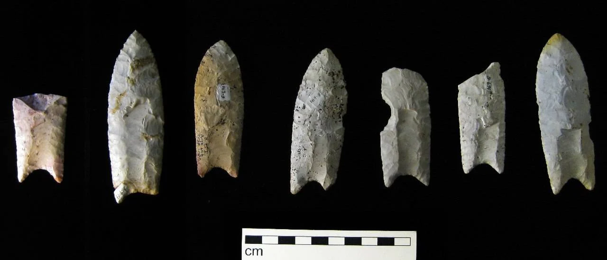
  * 在那以后不久，关于存在人类的没有争议的证据出现在**亚马孙河地区**和**巴塔哥尼亚高原**
* 人们开始时会感到惊讶：克罗维的子孙们竟能在**不到1000年**的时间里到达美加边界以南**8000英里**处的**巴塔哥尼亚高原**
  * 然而，说得简单一点，就是平均**每年**只向前推进**8英里**，这对于那些以狩猎和采集为生的人来说简直是小事一桩，因为他们平常在寻找食物时，在**一天之内**也可能走这么远的距离
* 人们开始时同样会感到惊讶：美洲显然很快就**布满了人**，所以他们就有目的地不断往南朝巴塔哥尼亚高原推进
  * 如果美洲最终容纳**以狩猎采集为生者**的人数，达到平均人口密度稍低于**每平方英里一个人**（对于现代的以狩猎采集为生的人来说，这是一个很高的值），那么整个美洲地区最终就能容纳**1000万**以狩猎采集为生的人
  * 但是，即使最初的移民只有**100个人**，而他们的人数以每年1.1%增加，那么，不出1000年，人口最高可达**1000万人**
  * 每年1.1%的人口增长率又是**小事一桩**：在现代，当人们向处女地移民，就像英国皇家海军“邦蒂”号上的反叛者和他们的塔希提妻子向皮特凯恩岛移民那样，曾经观察到的**人口增长率**高达每年4.3%
* 克罗维遗址突然出现在**公元前11000年前的几百年**中，而不是出现在公元前16000或21000年前的几百年中，这可能会有什么意义呢？
  * 西伯利亚终年严寒，在更新世冰期的很大一部分时间里，**连绵不断的冰原**在整个加拿大成了无法通行的障碍
  * 这些早期的西伯利亚人到了对面的阿拉斯加，或是由**海路**渡过白令海峡（甚至在今天也只有50英里宽），或是在白令海峡还是**干燥陆地**的冰川时代徒步走过去的
  * **白令陆桥**在其几千年的间歇存在期间可能宽达1000英里，覆盖着一望无际的苔原，适应了寒冷条件的人是**容易越过**的；最近一次，当大约公元前14000年后海平面上升时，陆桥被水淹没，又一次成了**海峡**
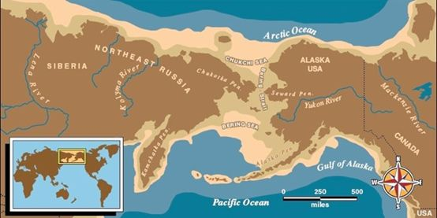
  * 在那以后不久，**加拿大的冰原**上出现了一条由北向南的没有冰雪的走廊，使首批阿拉斯加人得以从中通过，来到了现代加拿大城市**埃德蒙顿**周围的**北美大平原**
  * 埃德蒙顿的这些开路先锋们可能发现大平原上到处都是猎物；他们就在这里**繁衍生息**，他们的人数增加了，于是逐步地**向南扩散**，最后占据了**整个西半球**
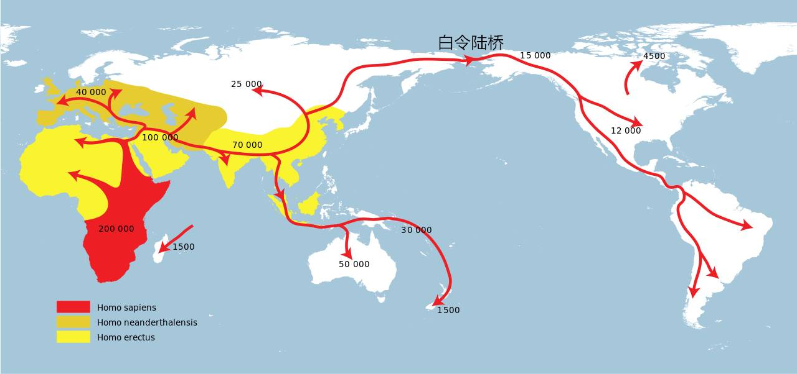
* 克罗维现象的**另一个特征**和我们关于加拿大冰原以南首次出现了人类这一推测不谋而合
  * 和澳大利亚/新几内亚一样，美洲原来也是到处都有**大型哺乳动物**；正和在澳大利亚/新几内亚一样，在美洲大多数这样的大型哺乳动物也**灭绝**了，这些动物的灭绝在澳大利亚大概发生于3万年前，而在美洲则发生在**大约17000年到12000年前**
  * 也许，灭绝时间测定得最精确的两种动物是沙斯塔的**地懒**和大峡谷地区哈林顿的**石山羊**；这两种动物的种群在公元前11000年前后的一两百年内就消失了
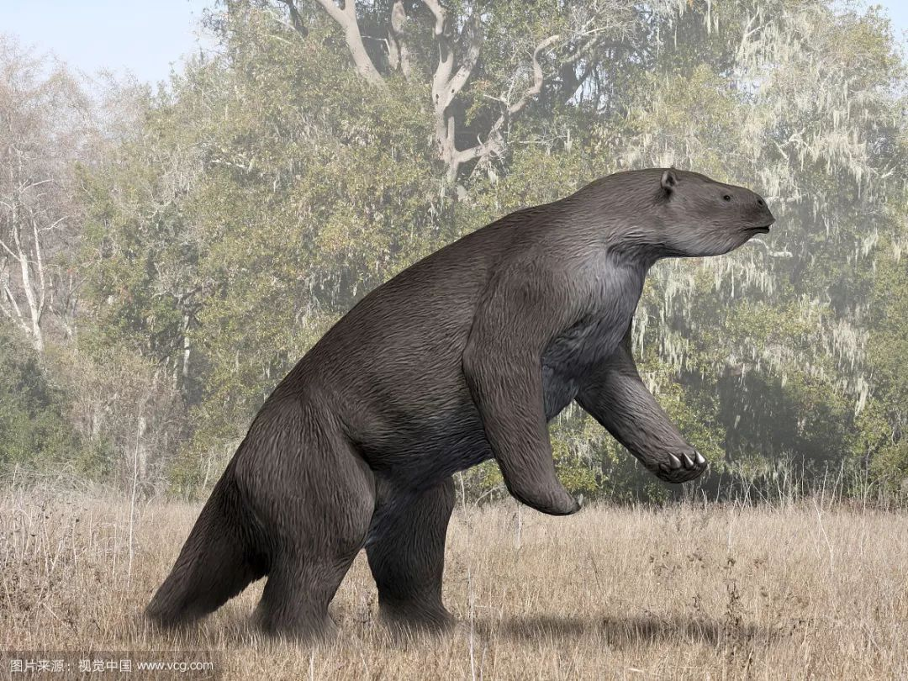
* 在许多毛象骨骼的肋骨之间都嵌着**克罗维人的矛头**，这一发现表明，上述年代的一致并非巧合；克罗维的猎人们在美洲向南推进，遇到了以前从未见过人的**大型动物**，他们可能发现这些美洲动物很容易杀死，于是就把它们**消灭**了
* 没有解决的问题是：克罗维猎人是否真是**最早的美洲人**
  * 每当有人宣布发现了什么最早的东西时，就会不断地有人作出新的宣布，说是在美洲发现了**克罗维人以前的人类遗址**
  * 所报道的在遗址中发现的石器真的是人工打造的，或者不过是**天然的特定形状的石块**？所报道的用碳-14测定法测定的年代是否真的很正确，且不会由于可能困扰**碳-14测定法的许多难题**中的任何一个难题而变得毫无价值呢？如果这些年代是正确的，那么它们是不是真的和人类的制品有关，而不恰好是一块15000年的木炭落在了实际上是在9000年前打造的一块石器旁边？
  * 在巴西的一个叫做**佩德罗弗拉达**的岩棚上，一些考古学家发现了一些无疑是人画出来的**洞穴壁画**，他们还发现，在一处悬崖的底下有一堆堆石头，其中有些石头的形状表明它们可能是一些**粗糙的石器**；此外，他们还在无意中发现了一些被认为是**炉灶**的东西，里面烧过的木炭用碳-14测定法测得的年代是**大约35000年前**
  * 但是，在那悬崖底下的那些石头中，没有一块石头像克罗维人的矛头和克罗马努人的石器那样一眼就可看出是**人类制造的工具**；如果几十万块石头在几万年的过程中从高高的悬崖上落下，其中有许多在撞击下面的石头时变成了屑片和碎裂开来，有些会**碰巧像**人工削凿成的粗糙的石器；没有任何证据可以把35000年前的木炭同佩德罗弗拉达的无庸置疑的洞穴壁画**联系起来**
  * 在美洲找到的比克罗维人更早的证据的弱点，同在欧洲找到的证据的优点形成了**鲜明的对比**，因为欧洲的数以百计的遗址证明了远在克罗维猎人于公元前11000年出现在美洲之前，现代人就已在欧洲存在了
  * 要么是：美洲在公元前11000年左右**首次有人类定居**，并很快地布满各地；要么是：人类首次定居发生的时间要**稍早一些**，但直到公元前11000年左右，这些比克罗维人更早的移民人数**仍然很少**，或者不引人注目，或者**几乎没有发生过任何影响**
## 大陆的比较
* 随着人类在美洲的定居，各个大陆和陆边岛屿以及从印度尼西亚到新几内亚东面的洋中岛，凡是可居住的大多数地区都有人类在生活
  * 在世界上其余岛屿的定居直到现代才完成：**地中海诸岛**如克里特岛、塞浦路斯岛、科西嘉岛和撒丁岛约在公元前8500年到前4000年之间；**加勒比海诸岛**从公元前4000年左右开始；**波利尼西亚群岛**和**密克罗尼西亚群岛**在公元前1200年到公元1000年之间；**马达加斯加岛**在公元300年到800年之间；**冰岛**在公元9世纪
  * **美洲印第安人**可能是现代**伊努伊特人**的祖先，他们大约在公元前2000年遍布**北极附近地区**
  * 这样，在过去的700年中，唯一的无人居住、等待欧洲探险者光顾的地区就只剩下大西洋和印度洋中那些**最偏远的岛屿**（如亚速尔群岛和塞舌尔群岛）和**南极大陆**了
* 如果**领先优势**能够说明什么问题的话，那么**非洲**就是处于巨大的优势了：非洲大陆出现**独立的原人**比任何其他大陆至少要早**500万年**
  * 此外，如果**现代人类**的确是在大约10万年前出现在**非洲**，然后向其他大陆扩散，那么其他地方在这期间积累起来的优势都会被一扫而光，从而使非洲人取得新的领先优势
  * 而且，人类遗传的**多样性**以非洲为最高；也许更多样的人类集体会带来更多样的发明创造
* 尽管非洲人拥有巨大的领先优势，但他们可能会在最多1000年内被最早的**美洲人**迎头赶上
  * 人类在**不到1000年**的时间里就布满了甚至整个新大陆
  * 从那以后，美洲的**较大面积**（比非洲的面积大5%）和大得多的**环境多样性**可能会使美洲土著获得对非洲人的优势
* **欧亚大陆**是世界上**最大的大陆**；除非洲外，它比任何其他大陆人类定居的时间都**长**
  * 人类在100万年前才在欧亚大陆定居，而非洲在这之前很久就有人定居了；但这可能不说明任何问题，因为原人当时还处在一种**相当原始的阶段**
  * **旧石器晚期**的**西南欧**一片繁荣，有著名的艺术品和复杂的工具
* **澳大利亚/新几内亚**的**面积很小**（它是最小的一个大陆），它的很大一部分是只能养活很少人的**沙漠**，这个大陆是**与世隔绝**的，人类在那里定居比在非洲和欧亚大陆都要**晚**
  * 澳大利亚人和新几内亚人是世界上最早发展**水运工具**的人，他们创作**洞穴壁画**显然至少和欧洲的克罗马努人一样
  * 人类从亚洲大陆架岛屿到澳大利亚/新几内亚来定居，需要学会应付他们在印度尼西亚中部岛屿上碰到的那种**新环境**——具有世界上最丰富的海洋资源、珊瑚礁和红树林的犬牙交错的海岸线
  * 当这些移民渡过每个印度尼西亚岛屿和它东面的另一个岛屿之间的海峡时，他们又一次适应并布满了这个岛，接着再向下一个岛屿移民；这是一个迄今为止**人口连续爆炸**的、史无前例的**黄金时代**
  * 也许，这种周而复始的移民、适应性变化和人口爆炸，是专为**大跃进**做准备的；大跃进在这里发生后，再向西传播回欧亚大陆和非洲
* 因此，一个被送回到公元前11000年的观察者可能不会预测到哪个大陆上的人类社会会发展最快，但他可以提出充分的理由说明**任何一个大陆**都有这样的机会
  * 从事后来看，**欧亚大陆**就是这样的一个大陆；但结果表明，欧亚大陆社会发展较快的**真实原因**根本不是直截了当的原因