[TOC]
# 从平等主义到盗贼统治
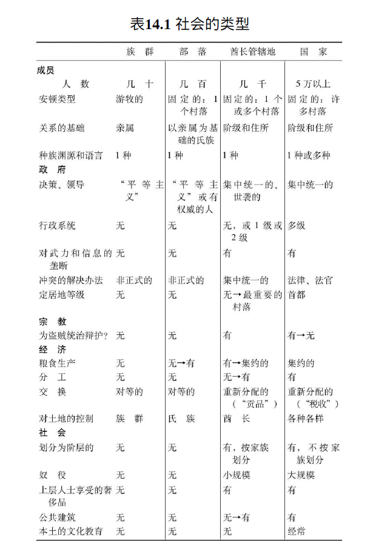
## 族群
1. **人类社会的多样性与分类**
   - 文化人类学家通常将人类社会分为**多种类型**，如族群、部落、酋长管辖地和国家
   - 这种分类虽然有助于**理解社会多样性**，但**存在缺陷**，如阶段间界限的模糊和发展顺序的不一致性

2. **族群的特征与生活方式**
   - **族群**是**最小的社会单位**，通常由**5到80人**组成，成员多为**近亲**
   - **现代**的族群主要生活在**偏远地区**，如**新几内亚和亚马孙河流域**，以**狩猎和采集**为生

   - 族群**没有固定住所**，土地**共同使用**，缺乏正式的经济专门化和社会阶层
   - 族群内部和族群间的冲突解决**不依赖正式制度**，如法律和警察

3. **族群生活的环境因素**
   - 族群的游牧生活方式**受环境资源限制**，如新几内亚湖泊平原的西谷椰子树
   - 疾病、资源缺乏和食物供应限制影响族群的**规模和稳定性**
   - 人类的早期祖先和与人类亲缘关系接近的动物，如**大猩猩和黑猩猩**，也是以族群形式生活

4. **从族群到现代国家的演化**
   - 直到**至少40000年前**，所有人类都生活在族群中
   - 随着**觅食技术的改进**，某些狩猎采集族群开始在**资源丰富的地区**定居
   - 超越族群阶段的发展是**近几万年的事**，涉及更复杂的社会、经济和政治组织形式

5. **现代社会与族群的对比**
   - 现代社会拥有专门的警察、机关、城市、金钱和社会制度，与族群生活形成鲜明对比
   - 这些制度的出现是**逐渐演化的结果**，而非同时产生

## 部落
1. **部落的基本特征**
   - **部落**通常由**几百人**组成，相较于族群的几十人规模更大
   - 部落成员通常居住在**固定的地点**，与族群的游牧生活方式不同
   - 然而，一些部落，如**新几内亚高原居民**，仍然保持着**随季节迁移**的牧人生活方式

2. **部落的政治与社会结构**
   - 部落的政治单位可能是**一个村落或几个紧密结合的村落**
   - 部落的定义在政治上和语言学、文化人类学上**有所不同**；例如，**福雷族**的例子显示了部落在语言和文化上的统一，但政治上的分散
   - 部落成员之间的冲突解决依赖于**亲属关系和社会压力**，而非正式的法律和警察制度

3. **部落的经济与文化特点**
   - 部落经济基于**对等交换**，缺乏中央权威的重新分配
   - 经济专门化**程度低**，缺乏全职工匠，每个成年人都**参与食物的生产**
   - 部落社会保持一种“**平等主义**”的社会制度，身份地位不世袭，财富分配相对均等

4. **部落与族群的相似性与差异**
   - 部落和族群都具有**非正式**、“平等主义”的政府制度
   - 部落的人数较多，成员间存在**更复杂的亲属关系网络**
   - 部落的形成与**定居点的出现**有关，如新月沃地的考古证据所示

5. **部落向酋长管辖地的演化**
   - 随着部落规模的扩大，解决冲突的难度增加，促使政府组织**从部落向酋长管辖地转变**
   - 部落中的“**大人物**”角色预示了**酋长在其管辖地中的角色**，如食品和货物的收集与再分配
   - 部落的**公共建筑**，如新几内亚的鼓屋，可能是酋长管辖地庙宇的前身

## 酋长管辖地
### 社会结构与经济特征
1. **酋长管辖地的历史与地理分布**
   - 酋长管辖地在20世纪初**基本消失**，但在1492年前**广泛存在于美国东部、南美洲、中美洲、非洲撒哈拉沙漠以南和波利尼西亚**
   - 考古证据显示，酋长管辖地最早出现在**新月沃地约公元前5500年**，中美洲和安第斯山脉地区约公元前1000年

2. **酋长管辖地的社会特点**
   - **人口规模**：从**几千到几万人**，远超部落
   - **社会结构**：由**酋长领导**，拥有**继承权**的职位，与部落的无政府状态和权力分散相对
   - **酋长的权力和象征**：拥有**使用武力的独占权利**，有醒目的**标志**，如伦纳尔岛酋长的大扇子，夏威夷酋长的羽毛斗篷

   - **官员体系**：官员**多功能**，无专门分工，如夏威夷的科诺希基官员负责征收贡品、管理灌溉和组织徭役工作

3. **经济特征与资源管理**
   - **粮食生产**：主要依靠**农业**，部分地区依赖**狩猎和采集**，如美洲太平洋西北沿岸的印第安人
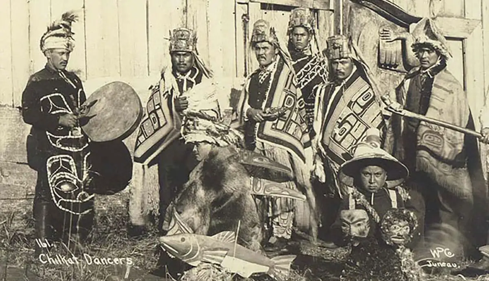
   - **社会分层与资源分配**：平民生产的粮食用于养活酋长、官员和专门人才，奢侈品归酋长所有
   - **再分配经济**：酋长**从平民处收集资源后进行再分配**，形成了**税收的前身**
   - **公共工程**：酋长要求平民**提供劳动力**，有利于社区（如灌溉系统）或主要利于酋长（如豪华墓葬）

4. **酋长管辖地的多样性**
   - **规模与权力**：较大的酋长管辖地拥有更大的权力，更多的酋长家族等级，更明显的酋长与平民差异
   - **社会组织**：从自治村庄到由多个村庄组成的地区社会，其中最大的村庄由至高无上的酋长控制
   - **土地与资源控制**：在大型岛屿如夏威夷岛、塔希提岛和汤加岛，酋长控制所有土地和大部分资源

### 权力动态与社会结构
1. **酋长管辖地的双重作用**
   - 酋长管辖地在集中管理的**非平等主义社会**中扮演着复杂的角色
   - **正面作用**：提供**个人无法承办的昂贵服务**，如公共建设和社会秩序维护
   - **负面作用**：形成**盗贼统治**，将财富**从平民转移到上层阶级**，如蒙博托总统在扎伊尔的统治
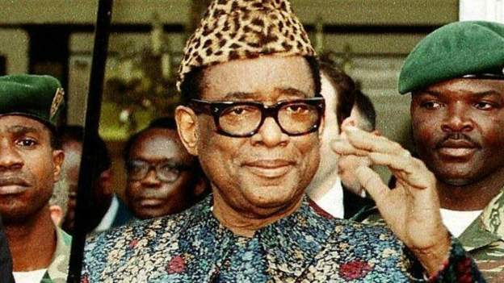

2. **政治领导者的类型与影响**
   - 盗贼统治者与英明政治家的区别在于**财富的分配和使用**
   - **例子**：**乔治·华盛顿**被视为政治家，因为他将税款用于**广泛赞誉的计划**，而非个人利益

   - 盗贼统治者和公益赞助人之间的区别在于**榨取财物的比例**和**平民对财物重新分配的接受程度**

3. **平民对盗贼统治者的容忍原因**
   - **问题提出**：为何平民会容忍其劳动成果被盗贼统治者占有
   - **反抗的可能性**：盗贼统治者面临**被压迫平民或其他盗贼统治者**推翻的风险
   - **例子**：夏威夷历史上的**反压迫者酋长叛乱**，通常由承诺减轻压迫的**酋长的兄弟**领导

4. **盗贼统治者维持权力的策略**
   - **解除平民武装**，同时**武装上层掌权人物**，现代武器的垄断使其更易实现
   - 用通行的方法**将大部分财物再分配给群众**以博取欢心，如夏威夷酋长与美国政治家
   - 利用**武力的绝对控制**维持公共秩序和制止暴力，促进社会幸福
   - 制造为盗贼统治辩护的**意识形态或宗教**，如夏威夷酋长宣传神性和与诸神沟通

5. **宗教在中央集权社会中的作用**
   - 宗教作为一种**独特的意识形态**，维持着酋长的权威
   - **宗教的两个重大好处**：解决**非亲属间的和平共处**问题；激发人们**为社会牺牲自己生命**的动机
   - **例子**：夏威夷酋长利用宗教建立权威，通过寺庙建设等公共工程展示权力

## 国家制度
### 演化与特征
1. **国家制度的普遍性和历史**
   - 国家制度是目前**全球普遍的政治、经济和社会制度**，覆盖**全球绝大多数地区**
   - **国家的出现时间和地点**：美索不达米亚（公元前3700年左右）、中美洲（公元前300年左右）、安第斯山脉地区、中国和东南亚（2000多年前）、西非（1000多年前）
   - **国家的考古标志**：标准化设计的庙宇废墟、不同规模的定居点、风格各异的陶器

2. **国家与酋长管辖地的比较**
   - **人口规模**：酋长管辖地人口**几千至几万**，国家人口通常**超过100万**，如中国超过10亿
   - **城市的形成**：国家拥有**真正的城市**，具有重要的公共工程、宫殿、资本积累和非农业人口集中
   - **中央集权**：国家拥有**类似国王的世袭领袖**，对信息和决策有更大的控制权
   - **经济再分配**：国家通过**税收**进行**更广泛**的经济再分配
   - **经济专门化**：国家经济专门化**程度更高**，农民**无法自给自足**
   - **行政管理层次**：国家拥有**更复杂的行政管理系统**，包括纵向和横向的多层次结构

3. **国家的特征和发展**
   - **中央控制**：早期国家如美索不达米亚实行**中央控制经济**，管理粮食生产和分配
   - **奴隶制**：早期国家的奴隶制规模**大于**酋长管辖地，用于大规模生产和公共工程
   - **法律和法制**：国家发展了**正规化**的法律、法制和警察机关
   - **文字的发明**：与国家的出现**几乎同时**，文字被发明，用于记录法律和管理
   - **国家宗教**：早期国家发展了国家宗教，国王常被视为**神授**，与宗教活动紧密相关
   - **政治和领土组织**：国家基于**政治和领土组织**，不同于基于**亲属关系**的部落和酋长管辖地
   - **多元化**：国家通常包括**不同种族和语言**，尤其是在帝国形成过程中更为明显
   - **领导的变化**：后期国家领导常**非世袭**，许多国家放弃了世袭阶级制度
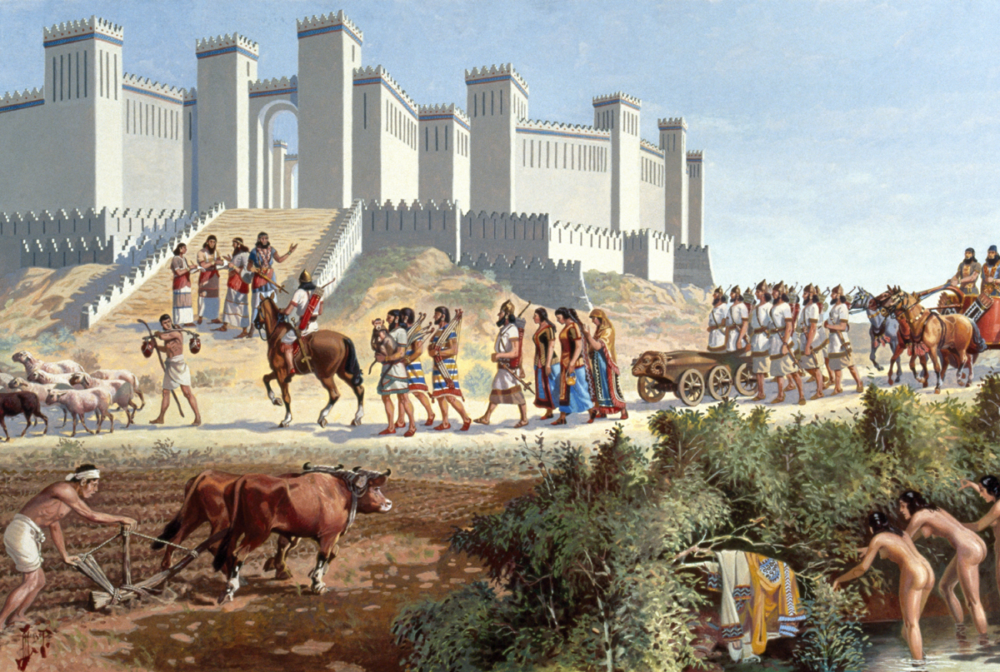

### 国家的优势
1. **社会组织的历史趋势**
   - **主要趋势**：过去13000年中，**大型复杂社会单位**逐渐取代小型简单单位
   - **变化的复杂性**：尽管存在**统一和分裂的循环**，如苏联、南斯拉夫和捷克斯洛伐克的分裂，以及亚历山大帝国的崩溃，但总体趋势仍向着更大、更复杂的社会单位发展

2. **国家与其他社会形式的冲突**
   - **技术和人口优势**：国家在与较简单社会单位的冲突中**通常占优**，部分原因是**武器和技术上的优势**，以及**人口数量的优势**
   - 国家具有中央决策者**集中军队和资源**的能力，以及**官方宗教和爱国热忱**激发的**军事士气**
   - **例外情况**：复杂的单位并非总能**征服简单单位**，如罗马帝国和中华帝国被较为简单的“蛮族”和蒙古族所击败
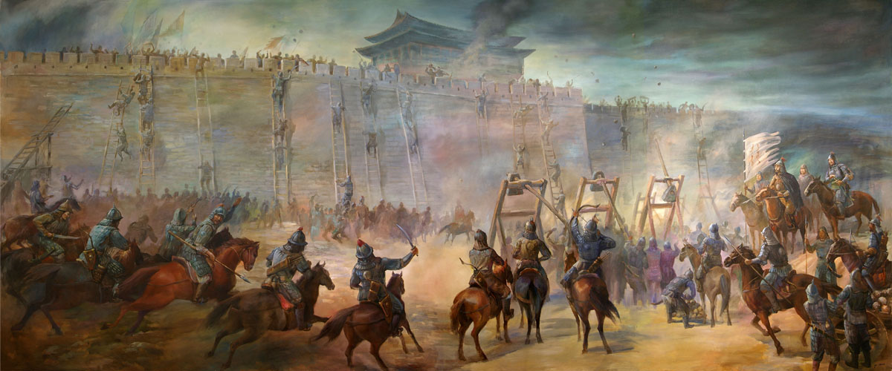

3. **国家社会的特有动力**
   - **爱国主义和宗教热忱**：现代国家通过教育、宗教和政府机构灌输**乐于为国牺牲的思想**，与人类历史的早期形态有**明显区别**
   - **战争动员**：国家能够激发公民**为国家目标而战**的热情，如英国的“为了国王和国家”，西班牙的“为了上帝和西班牙”
   - **部落与国家的对比**：部落社会中缺乏国家社会中的**爱国主义和自杀性冲锋**，战争策略更倾向于**减少自身损失**，限制了军事选择

4. **宗教战争的历史影响**
   - **历史上的宗教战争**：过去6000年中，**基督教和伊斯兰教信徒**的征服战争狂热在酋长管辖地和国家出现之前是罕见的
   - **宗教动员的力量**：宗教信仰驱使信徒**为信仰目标而战**，愿意为消灭或制服异教徒敌人牺牲自己
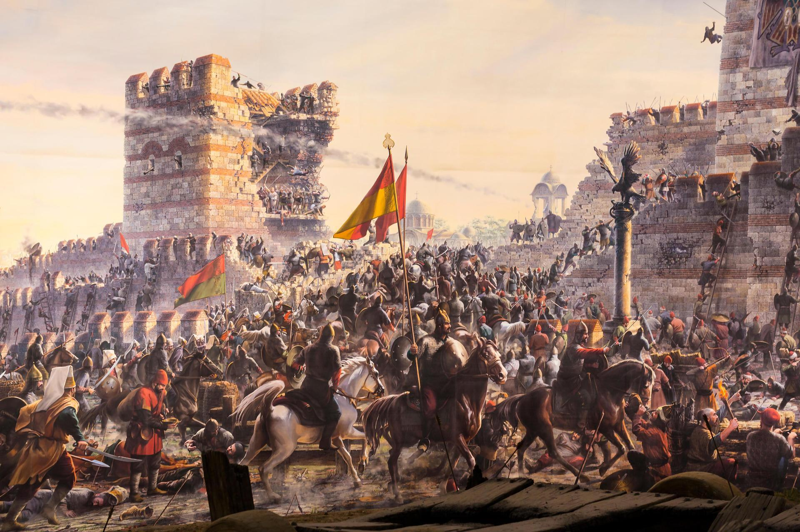

## 社会演化：从族群到国家的转变
### 国家形成理论
1. **社会演化的历史背景**
   - **独立的国家形成**：历史上，许多国家在**没有先例**的情况下独立形成，如美索不达米亚、中国北部、尼罗河和印度河河谷、中美洲、安第斯山脉地区和西非
   - **酋长管辖地的出现**：与**欧洲国家接触**后，如马达加斯加、夏威夷、塔希提和非洲的某些地区出现了**酋长管辖地**
   - **部落和族群的存在**：直到1492年，世界上**许多地区**仍是部落或族群的天下

2. **国家形成理论的探讨**
   - **亚里士多德的自然状态理论**：认为国家是人类社会的**自然状态**，无需解释
   - **社会契约理论**：**卢梭**认为国家是基于**社会契约的理性选择**，但历史并未支持这一理论
   - **水利理论**：认为**大规模灌溉系统的需要**导致国家形成，但这一理论忽略了灌溉系统前的社会演化
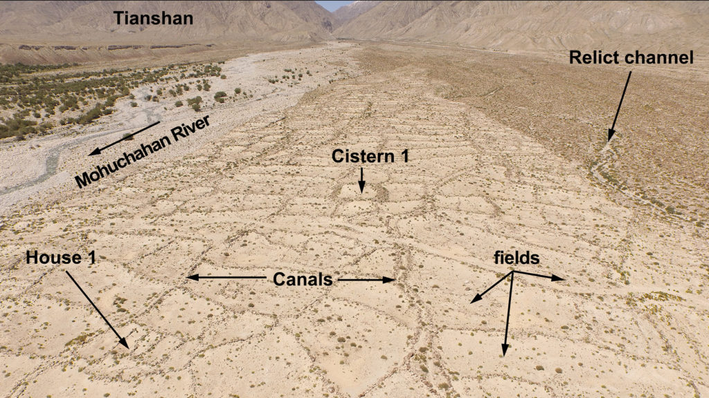

3. **人口与社会复杂度的关系**
   - **人口作为预测因素**：**地区人口数量**是**预测社会复杂程度**的重要因素
   - **社会类型与人口规模**：族群几十人，部落几百人，酋长管辖地几千至几万人，国家超过5万人
   - **人口密度与社会复杂度**：人口密度增加与社会复杂度提升之间存在相关性

4. **人口增长与社会演化**
   - **人口密集地区的形成**：探讨如何形成人口密集地区
   - **大型简单社会的挑战**：分析大型简单社会为何难以持续
   - **从简单到复杂的转变**：探索随着人口增长，简单社会如何逐渐演化为复杂社会
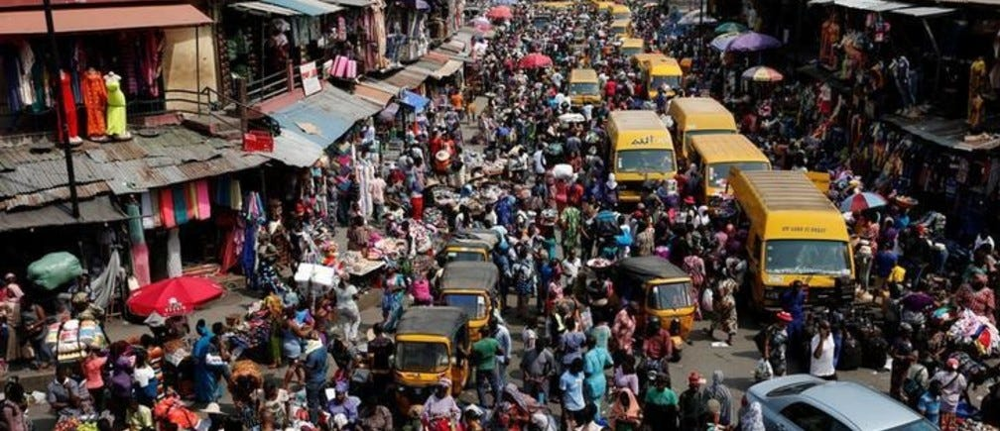

### 粮食生产与社会复杂度的相互作用
1. **粮食生产与人口密度的关系**
   - **粮食生产条件下的人口增长**：**稠密人口**通常出现在粮食生产条件下，或者在狩猎采集条件下**物产特别丰富的地区**
   - **粮食生产与国家形成**：所有国家都依赖粮食生产来**养活其国民**，而狩猎采集社会尽管可能组织成酋长管辖地，但未达到国家水平

2. **粮食生产与社会复杂度的相互促进**
   - **自我催化的循环**：**集约化的粮食生产**和**社会复杂度**通过**自我催化**的方式相互促进
   - **人口增长与社会复杂化**：人口的增长使社会变得复杂，而社会的复杂化又促进了集约化的粮食生产，进一步导致人口增长

3. **中央集权社会的作用**
   - **组织公共工程**：中央集权社会能组织公共工程，如**灌溉系统**，促进粮食生产
   - **远距离贸易与经济专门化**：中央集权社会支持远距离贸易和经济专门团体的活动，如**农民与牧人的互惠关系**
   - **劳动力的利用**：中央集权社会利用农民的劳动力进行**公共工程建设**，如金字塔和灌溉系统
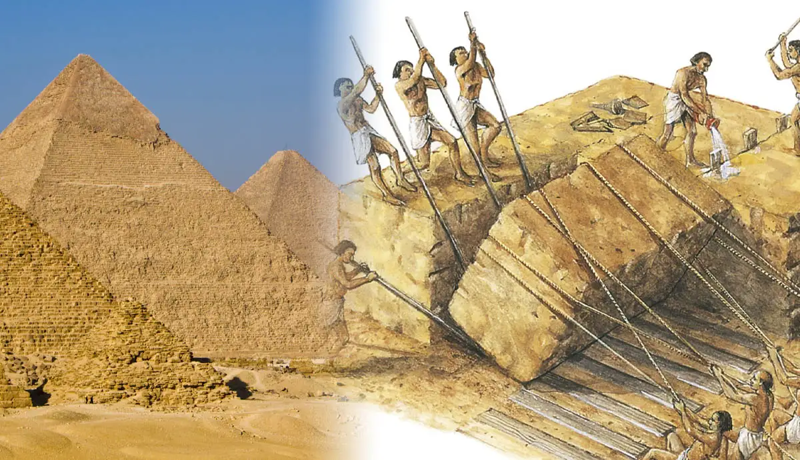

4. **粮食生产对社会形态的影响**
   - **劳动力的季节性投入**：粮食生产允许**劳动力的季节性投入**，为公共工程和征服战争**提供资源**
   - **经济专门化与社会层次化**：粮食生产的剩余促进了经济专门化和社会层次化，支持不同社会阶层的需求
   - **定居生活方式的促进**：粮食生产**鼓励定居生活**，为财产积累、技术发展和公共工程提供基础

5. **定居生活方式的推广**
   - **传教士和政府的目的**：在接触新几内亚和亚马孙河地区的游牧部落时，传教士和政府的目的之一是促使他们定居，以便**提供服务和控制**

### 大型社会的形成与中央集权的必要性
1. **人口增长与社会冲突**
   - 随着社会人口的增加，**非亲属关系的陌生人**之间的冲突问题增多，人际关系的复杂性增加
   - 在小型族群中，亲属关系有助于**调解争端**，但在大型社会中，这种机制不再有效
   - 大型社会中，个体间的争吵更容易**升级为群体间的冲突**

2. **决策过程的变化**
   - 在小型社会中，如**新几内亚的村庄**，**全体成年人参与决策**是可行的
   - 在人口较多的社会中，共同决策变得困难，需要**更有效的组织和中央集权控制**

3. **经济交换的变化**
   - 小型社会中，财货转移可以通过**直接的互惠交换进行**
   -大型社会需要**更复杂的经济系统**，如**再分配经济**，以应对直接交换的低效率
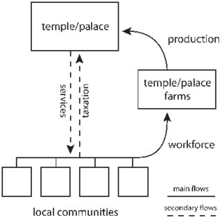

4. **空间与资源的挑战**
   - 大型社会的**人口密度高**，对资源的需求增加，需要更广泛的资源获取方式
   - 例如，荷兰的例子说明了大型社会**不能完全依赖自给自足**，需要更广泛的资源交换和组织

5. **权力集中的后果**
   - **权力集中的必要性**：大型社会需要**中央集权**来解决冲突、做出决策、管理经济和应对空间限制
   - 权力集中为掌权者提供了**利用职权为私**的机会
   - 随着社会的发展，权力集中的个体逐渐成为**社会的上层人物**

## 社会演化：从小型社会到大型复杂社会的转变
1. **社会演化的动力**
   - 社会演化**不是自动或统一的过程**，而是由不同社会的**内在差异和外部条件**驱动
   - 例如，部落和族群中领导者的**个人魅力和决策能力**对社会演化有重要影响
   - 社会的**成功**在于有效解决内部冲突、做出正确决策和实现经济再分配

2. **社会规模的扩大及其挑战**
   - 随着社会规模的扩大，解决因规模增大而产生的问题变得**更加复杂**
   - 这些问题包括领导地位的竞争、平民对统治者的不满，以及与经济一体化相关的问题
   - 大型社会单位可能拥有**对小单位的优势**，但这取决于它们如何**处理规模增大带来的挑战**

### 外部威胁
   - **合并**通常是在**外部威胁或实际征服**的情况下发生，而非自由决定
   - 例如，**切罗基族印第安同盟**是在**白人殖民地威胁下**形成的
      - 切罗基人原本分为**多个独立的酋长管辖地**
      - 为了应对外部威胁，这些酋长管辖地逐渐形成了一个**统一的同盟**
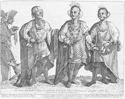
   - 另一个例子是**美洲殖民地**在**英国威胁下**的合并
      - 最初，各殖民地**保护自己的自治权**
      - 面对外部威胁，如谢斯起义和战争债务问题，殖民地最终通过了更有效的**联邦宪法**
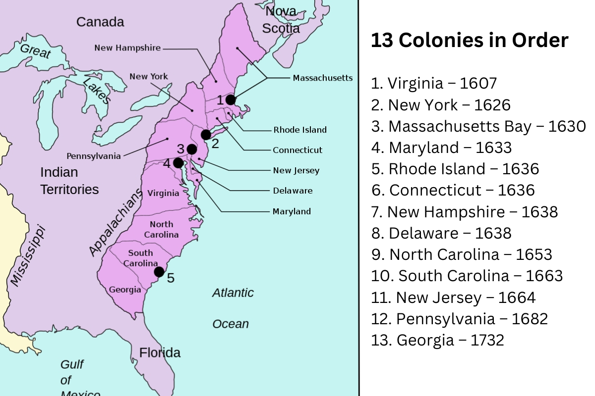
   - **德国各邦的统一**也是在外部威胁（**法国的宣战**）下实现的
      - 早期的统一尝试失败了，但最终在外部威胁下实现了统一
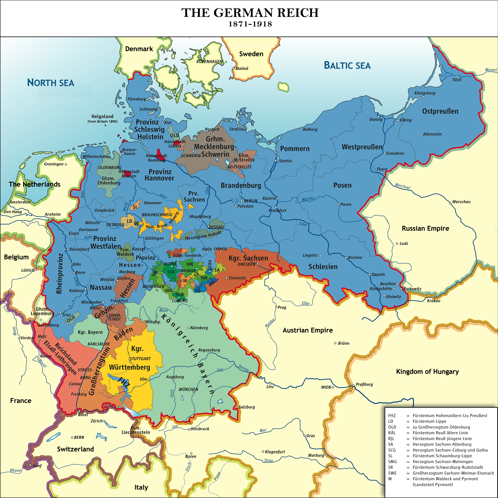

### 征服
1. **征服作为国家形成的关键途径**
   - **征服**是小型社会合并成大型复杂社会的主要方式之一
   - 通过征服，**强大的社会或领导者**能够将周边较小的社会**纳入其统治范围**

2. **祖鲁国的形成与丁吉斯韦约的角色**
   - **祖鲁国**的起源是一个典型的通过征服形成的国家案例
   - **丁吉斯韦约**通过**军事和政治改革**统一了祖鲁族的多个酋长管辖地
     - 他建立了**以年龄为基础**的军事组织，而非以村庄为单位
     - 在征服过程中，他采取了**较为温和的政策**，保护被征服酋长的家族
     - 通过**改进司法系统和礼仪**，他加强了新形成的国家结构
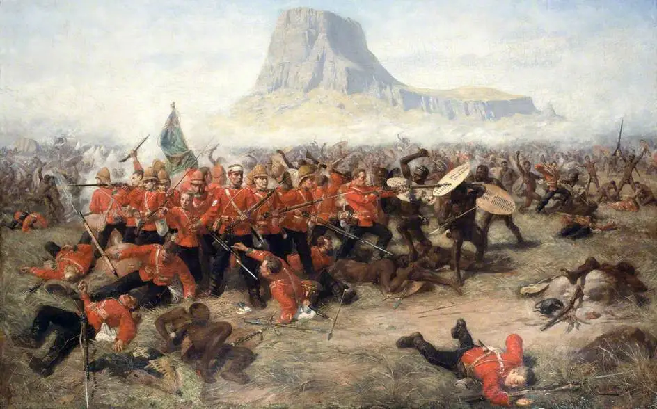

3. **全球范围内的征服与国家形成案例**
   - **世界各地**都有通过征服形成国家的例子
   - 包括夏威夷国、塔希提国、梅里纳国、莱索托、斯瓦齐、阿散蒂国、安科莱国和布干达国
   - **阿兹特克帝国和印加帝国**也是通过征服建立的，尽管欧洲人未亲眼目睹
   - **罗马帝国和亚历山大的马其顿帝国**是古典时期的征服案例，有详细的历史记载
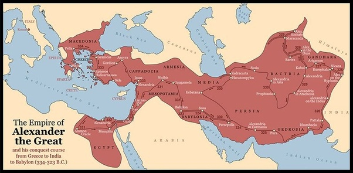

4. **征服与社会演化的影响**
   - 征服不仅**改变了地理政治格局**，也影响了文化、经济和社会结构
   - 征服者通常会引入**新的治理方式、文化习俗和经济制度**
   - 被征服社会可能会经历**文化同化、政治重组和社会变迁**

## 战争、人口密度与社会合并：历史视角下的动力与影响
1. **战争在社会合并中的关键作用**
   - 战争或战争威胁在大多数社会合并中起着**决定性作用**
   - 过去13000年中，战争开始**显著促进社会合并**

2. **人口压力与战争后果的联系**
   - **复杂社会的形成**与人口压力紧密相关
   - **人口密度**影响**战败民族的命运**，进而影响**社会合并的方式**

3. **不同人口密度下的战争后果**
   - **人口密度低**：战败者可以**逃离**，如新几内亚和亚马孙河地区的游牧部族
   - **人口密度中等**：战败者**无处逃避**，男性可能被杀，土地被占领，如粮食生产部落
   - **人口密度高**：战败者**被用作奴隶或继续劳作**，如国家或酋长管辖地

4. **征服与社会结构的演变**
   - 在人口密集的地区，征服通常导致**社会结构的重组**
   - 胜利者可能利用战败者**作为劳动力或纳贡**，如**阿兹特克帝国的贡品系统**
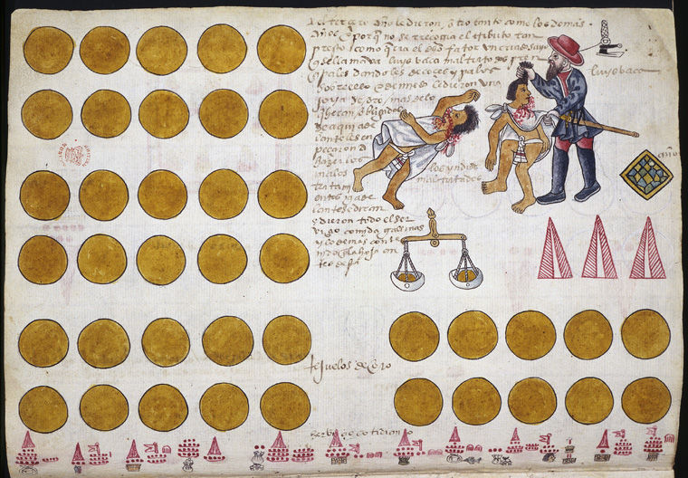

5. **征服的原动力：病菌、文字、技术与政治组织**
   - 粮食生产、社会竞争与混合**产生了征服的直接动力**
   - 这些因素与稠密的人口和定居生活方式密切相关

6. **不同大陆上征服动力的差异**
   - 不同大陆上的终极原因发展不同，导致征服动力的差异
   - 这些动力通常是**相互关联的**，但**并非绝对**，如印加帝国无文字，阿兹特克帝国少有流行病