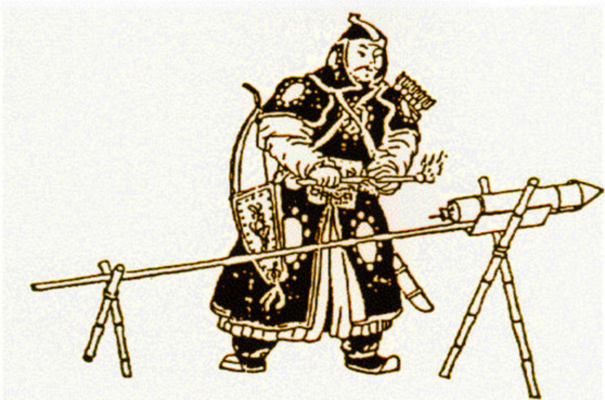

[TOC]
# 发明是需要之母
## 菲斯托斯圆盘：技术史上的谜团与技术演进的不平等
1. **菲斯托斯圆盘的发现与特点**
   - 1908年7月3日，在克里特岛的**菲斯托斯宫殿遗址**中发现了**菲斯托斯圆盘**
   - 圆盘小巧、扁平，直径为6.5英寸，两面都**刻有文字**，文字沿螺旋线排列
   - 共有**241个字母符号**，分为45个不同的符号，表明这是一种**音节文字**而非字母文字（比线形文字A或B要早）
   - 圆盘的制作精细，显示出作者的**用心设计**，目的是充分利用空间

2. **圆盘的未解之谜**
   - 圆盘的文字至今未能解读，其符号形式**与其他已知书写系统不同**
   - 自发现以来89年间，**未再发现**类似文字的其他实物
   - 圆盘是克里特岛**本地文字**，还是**外来物品**，仍然是个谜

3. **圆盘的印刷技术**
   - 圆盘被认为是**世界上最早的印刷文件**，其年代估计为**公元前1700年**
   - 符号是通过带有凸起符号的印章**在黏土上压印而成**，而非手工刻写
   - 这种印刷技术的发明显示了早期人类**在信息记录和传播方面的创新**

4. **技术演进的不平等**
   - 圆盘的发现引发了关于技术演进速度在不同地区**为何不同**的问题
   - **欧亚大陆**在技术发展上领先于其他地区，如火器、远洋船只和钢铁设备
   - 这种技术差异并非因为个体的创造力差异，而是与**社会的接受度和地理环境有关**

5. **技术发展的社会与地理因素**
   - 有些社会对新事物的**接受度较低**，保守且抵制变革
   - **地理环境**也影响了技术的传播和发展，如澳大利亚土著未能采用弓箭
   - 解释技术演进速度的不平等需要考虑社会文化和地理环境的**综合影响**

## 发明与创新：需求、好奇心与社会接受度
1. **“需要乃发明之母”原则的普遍性**
   - 社会普遍认为发明是为了**满足未得到满足的需要**而产生的
   - 发明家通常是被**金钱和名誉的前景**所驱使，他们察觉到社会的需要并努力去满足这些需要
   - 当发明家找到了一个比现有技术**更好**的解决方案，并且这个解决方案**符合**社会的价值观和其他技术时，社会**就会接受**这个发明

2. **战争与发明的关系**
   - **曼哈顿计划**是一个典型的例子，显示了在战争期间，为了满足紧迫的需求，政府会投入**巨额资金**来推动技术的发展
   - 该计划的目的是在纳粹德国之前发明出制造原子弹所需的技术，最终在3年后成功，花费了20亿美元

3. **发明的经典例子**
   - 伊莱·惠特尼的**轧棉机**和詹姆士·瓦特的**蒸汽机**都是为了**满足特定需求**而发明的
   - 轧棉机减轻了棉花剥离的繁重劳动，蒸汽机解决了从煤矿中抽水的问题

4. **发明的非传统路径**
   - 许多发明最初**并没有明确的需求**，而是**由好奇心驱使**的人或**喜欢动手**的人创造出来的
   - 一旦发明了某种装置，发明者就必须为它**找到应用**，消费者也可能在使用一段时间后才意识到他们“需要”它
   - 有些发明最初是**为一个目的**而创造的，最后却在**其他意料之外的领域**找到了广泛应用

5. **发明与社会接受度**
   - 发明需要社会的接受和认可，这取决于发明**是否符合社会的价值观**和**是否能与其他技术协调**
   - 即使是最伟大的发明，如托马斯·爱迪生的**留声机**，也经历了从最初的不被看好到最终被广泛接受的过程

   - 社会对新技术的接受需要时间，有时甚至需要**几代人的时间**
## 发明的社会与历史脉络：超越“英雄理论”和需求论
### 现代
1. **发明与需求的关系颠倒**
   - 常见的观点认为发明是为了**满足社会需求**，但实际上许多发明最初**并没有明确的需求**
   - 发明者常常是在发明之后才为其**找到应用**，消费者也是在使用一段时间后才意识到他们“需要”这个发明

2. **发明的“英雄理论”与专利法的关系**
   - “**英雄理论**”强调**个别发明家的重要性**，而忽视了发明背后的**社会和历史脉络**
   - **专利法**鼓励这种观点，因为申请专利需要**证明发明的新颖性**，这导致发明者**有动机贬低或忽视前人的工作**

   - 从**专利律师**的角度看，最理想的发明是完全没有先例的发明

3. **发明的历史脉络与社会影响**
   - 即使是最著名的发明，其背后也有**被忽视的先例和历史脉络**
   - 例如，**詹姆斯·瓦特**的**蒸汽机**实际上是在修理**托马斯·纽科曼**的原型蒸汽机时产生的想法，而纽科曼的蒸汽机又有其自己的历史脉络

   - 所有现代发明都有类似的发展史，每个发明都是在前人工作的基础上**进行改进和发展**的
   - 这并不是要否认个别发明家的贡献，但我们需要认识到发明是一个社会和历史的过程，而**不仅仅是个别天才的工作**
### 古代
1. **技术发展的长期积累**
   - 现代技术发展史虽然众所周知，但其实技术的发展是一个**长期积累的过程**，而不是依赖于孤立的英雄行为
   - 通过对**古代技术发展史**的观察，我们可以看到这一点**更加明显**，因为古代技术往往没有文件证明，但其发展过程仍然体现了长期积累的特点

2. **技术的发明与社会应用**
   - 技术在发明出来后**往往会找到可以广泛使用的领域**，而不是为了满足某种预见到的需要而发明
   - 例如，古代人类发现炉膛中焚烧过的**沙子和石灰岩的残留物**，这种发现最终导致了**罗马的玻璃窗**的制造，但这个过程是经过了**几千年的积累和发展**的

   - 从最早的表面有半透明薄涂层的物品，到最早的独立的类似玻璃的物品，再到最早的玻璃器皿，这个过程展示了**技术发展的积累和社会应用的特点**

3. **技术发明的实际过程**
   - 通过观察今天在技术上“原始的”族群，我们可以推知**史前的发明方法**
   - 人们通过**观察和反复试验**，学会了利用自然材料制作工具、陶器、玻璃等物品
   - 例如，新几内亚人通过对周围**石头**的观察和试验，学会了如何利用它们，这种“发明”过程是不断进行的
   - 例如，古希腊人发现了**石油**和其他物质的混合物可以用作火攻武器，中世纪伊斯兰教的炼金术士通过蒸馏技术提炼出更强大的燃烧剂，19世纪的化学家们发现石油蒸馏的中间馏分油可以用作油灯的燃料，并且把最易挥发的馏分（汽油）当作一种没有用的废品而予以抛弃；现代才发现那是内燃机的一种理想的燃料

   - 另一个例子是**火药**的发明，最初是由中国人观察到硫磺、木炭和硝石的混合物具有强烈的爆炸力，后来伊斯兰教的学者对其进行了系统的研究和应用

## 社会接受发明的影响因素
### 社会对不同发明的接受程度
1. **经济利益的影响**
   - 新技术是否能带来相对于现有技术**更大的经济利益**是影响其被社会接受的重要因素
   - 例子：古代墨西哥土著发明了**带车轴和车轮的玩具车**，但由于缺乏适合套车的牲口，这种技术**并未用于运输**，显示了经济利益在技术接受中的重要性

2. **社会价值和声望**
   - **社会价值和声望**有时候会**超越经济利益**，成为影响技术接受的重要因素
   - 例子1：人们愿意支付更高的价格购买**设计师品牌牛仔裤**，因为设计师品牌带来的**社会声望的价值**被认为超过了额外的花费
   - 例子2：日本继续使用复杂的**汉字书写系统**，而不是更高效的字母或假名音节文字，因为**汉字体系带来的社会声望**实在太大了

3. **既得利益的阻碍**
   - 既得利益群体可能会**阻碍新技术的接受和推广**
   - 例子1：**标准打字机键盘**的布局是为了**减缓打字速度**而设计的，虽然后来有**更高效的键盘布局被提出**，但由于既得利益群体的阻碍，这种更高效的布局**并未被广泛采用**

   - 例子2：美国的电子器件消费工业**坚持生产真空管**，拒绝与晶体管竞争，最终导致**日本**控制了世界晶体管化电子消费产品市场

   - 例子3：**英国城市**在20世纪20年代仍使用**煤气照明**，因为一些市政府已对煤气照明进行了**大量投资**，对竞争的电灯公司设置了行政管理方面的障碍

1. **新技术优点的可见性**
   - 新技术的优点如果能够**很容易被看到**，那么它更有可能被社会接受
   - 例子：英格兰的两位伯爵在**塔里法战役**中看到了**大炮**的威力，深受印象，随后将大炮**引入英国军队**，并在克勒西战役中成功使用

### 发明在不同社会的接受程度
1. **同一发明在不同社会的接受程度**
   - 同一发明在不同的社会中可能会有**截然不同的接受程度**
   - 观点：**第三世界农村社会**通常不如西方工业社会容易接受新事物
   - 例子：**澳大利亚土著社会**可能由于抵制变革，导致在其他大陆已经出现金属工具时，他们仍然在使用**石器**

2. **影响技术接受的社会经济因素**
   - **预期寿命的增长**可能加快了近来发明的速度
   - **经济和组织结构**对技术接受有重大影响，包括**劳动力成本、知识产权保护、技术培训机会、投资回报可能性和社会价值观**
   - 例子：**高工资和劳动力短缺**刺激了对技术解决方案的寻求，如**加利福尼亚农场**开发机器收获番茄的品种
   - 例子：在**硅谷**，**强大的知识产权保护法律**鼓励了大量的创新和创业活动；许多科技公司愿意在这里投资研发，因为他们相信他们的发明和创新将受到法律的保护
   - 例子：**德国的双元制教育系统**结合了理论学习和实际工作经验，为学生提供了**丰富的技术培训机会**，这有助于培养高技能劳动力，推动了国家的工业和技术发展

3. **意识形态和文化因素**
   - **冒险行为、科学观点、对异端观点的宽容和宗教信仰**对技术接受有深远影响
   - 例子：**文艺复兴**后欧洲的**科学观点**对其技术的卓越地位起到了关键作用
   - 例子：在**荷兰**，**17世纪的宽容氛围**吸引了许多思想家和科学家，如笛卡尔，他们的思想和发明在这里得到了发展和传播

   - 例子：在一些国家和文化中，**女性**在科技、工程和数学领域的参与受到鼓励，而在其他一些地方，传统观念可能仍然**阻碍女性**进入这些领域

4. **地理和环境因素**
   - **战争、政府形式、气候和资源丰富性**对技术发展的影响复杂且不一致
   - 例子：**第二次世界大战**期间对**核武器的巨额投资**开创了新的技术领域
   - 例子：在**寒冷的北欧国家**，极端的气候条件促使了一些特定技术的发展，如**高效的供暖系统**和**耐寒的建筑材料**

   - 例子：在**苏联时期**，政府对科研和技术发展有着**直接的控制和投资**，这种**集中式的管理**推动了一些领域如**太空技术和军事技术**的快速发展

## 技术创新与社会接受：全球视角下的多元解析
1. **技术创新与社会接受的复杂关系**
   - 主要问题是探讨**不同大陆间**是否存在影响技术创新和社会接受的**全面差异**
   - **外行人和历史学家**通常认为**答案是肯定的**，认为不同大陆的社会因为**共同的意识形态特点**而在技术发展上存在差异
   - 这种观点通常是基于**循环论证**，即因为存在技术上的差异，就推断出存在意识形态上的差异

2. **社会意识形态与技术接受**
   - 一些观点认为澳大利亚土著和非洲人因为特定的意识形态特点而技术落后
   - 这些观点通常没有充分的研究支持，是基于**纯粹的猜测**
   - 实际上，即使在同一个大陆或社会内，对技术的接受程度也**存在巨大差异**

3. **不同社会对技术接受的差异**
   - **新几内亚土著社会**中，有的社会**保守**，有的社会富有**创新精神**，并利用西方技术征服保守的邻居
   - 在**尼日利亚**，**伊博族**表现出强烈的创新精神，而在**美国**，**纳瓦霍族**通过适应和创新成为人数最多的印第安部落

   - **澳大利亚土著**中也存在着接受能力强和保守的社会

4. **时间变迁中的技术创新**
   - 在不同的历史时期，同一个地区或社会对新事物的接受能力可能**发生巨大变化**
   - 中世纪的**伊斯兰世界**在技术上领先，而现代则相对保守

   - **中国**在公元1450年前在技术上领先于欧洲，但之后停滞不前
   - **西欧及其衍生的北美社会**直到**中世纪后期**才开始在技术上超越其他地区

5. **创新精神的不可预测性**
   - 创新精神受到**多种因素的影响**，使其成为一种随机变量
   - 在任何特定时间和地区，总会有**一定数量的社会**表现出创新精神
   - 这种多元和复杂的局面使得历史学家的任务变得更加复杂，但也更加丰富多彩

## 技术创新与传播的复杂交织
1. **本地发明与技术借用**
   - 大多数社会的技术**并非完全本地发明**，而是从其他社会借来的
   - 本地发明与借用技术的**相对重要性**取决于发明某个技术的**容易程度**和社会间的**接近程度**

2. **直接产生的发明**
   - 有些发明是通过**处理天然原料**而直接产生的，这些发明在世界史上的不同地点和时间曾有过**多次独立的发展**
   - 例子1：**植物的驯化**在至少9个地方独立进行
   - 例子2：**陶器**的发明，可能源于对黏土这种普遍材料在晒干或受热时变化的观察，它在世界各地多次独立出现

3. **复杂发明的困难**
   - 复杂的发明如文字、水轮、转磨等通常**很难独立发明**，而是通过借用传播的
   - 例子1：**文字**在世界史上只有几次是独立发明出来的，字母显然只产生过一次
   - 例子2：**轮子**最早出现在黑海附近，随后迅速传播到欧洲和亚洲的许多地区

4. **技术传播的方式**
   - 技术可以通过其他社会**看到或听说了**这个发明并选择采用，或者是没有这种发明的社会**发现自己处于劣势**，被拥有这种发明的社会征服或取代
   - 例子1：**火枪**在新西兰毛利人部落之间的传播，没有火枪的部落要么也去弄到火枪，要么被已经用火枪武装起来的部落所征服
   - 例子2：**造纸术**从中国传到伊斯兰世界，是因为阿拉伯军队在战役中俘虏了一些造纸工匠

5. **技术传播的多样性**
   - 技术传播的方式**多种多样**，包括和平贸易、间谍活动、移民和战争
   - 例子1：**晶体管**从美国传播到日本是通过和平贸易
   - 例子2：**家蚕**从东南亚偷运进中东是通过间谍活动

   - 例子3：被从法国驱逐出去的胡格诺派教徒把法国的**玻璃和服装制作技术**传播到整个欧洲

## 地理位置对技术传播和保持的影响
1. **地理孤立与技术传播**
   - 社会的**地理位置**直接影响其**接受外来技术的能力**
   - 例子1：**塔斯马尼亚岛**上的土著由于地理位置极为孤立，过去1万年中与外界几乎没有接触，**没有**从其他社会获得**任何技术**

   - 例子2：**澳大利亚和新几内亚**由于被印度尼西亚群岛隔开，与亚洲大陆的联系有限，只能获得**零星的发明**

2. **地理位置与技术积累**
   - 大陆上的一些**根基深厚的社会**由于**地理位置优越**，能够积累本地和外来的技术
   - 例子：中世纪的**伊斯兰社会**位于欧亚大陆中央，既吸收了印度和中国的发明，又继承了希腊的学术

3. **技术的丢失与保持**
   - 技术一旦获得**并不意味着**它会**永远保持**，社会运动和时尚的变化可能导致技术的丢失
   - 例子1：**日本**在16世纪初接受并大量生产**火绳枪**，但由于社会和文化因素最终**放弃了这项技术**

   - 例子2：**中国**放弃**远洋船只和其他先进技术**
   - 在孤立的社会中，反对或放弃一项技术的时尚可能**持续很长时间**，直到外部压力或变化促使其**重新接受这项技术**

## 技术发展的速度
### 总体特点
1. **技术发展的自我催化性质**
   - 技术能够**产生更多的技术**，一项发明的**传播**可能比原发明本身**更为重要**
   - 整个技术发展过程呈现出**自我催化的特点**，即随着时间的推移，技术发展的速度**逐渐加快**
   - 从工业革命到中世纪，再到青铜时代和旧石器时代晚期，每个时期的**技术爆炸**都给人留下了深刻的印象

2. **技术进步的依赖性**
   - 技术的进步依赖于**对之前更简单问题的解决**
   - 例子：石器时代的农民无法直接进行**铁的冶炼和加工**，因为这需要高温的炼铁炉和数千年的冶金经验

   - 在新月沃地和中国，铁器的普及需要**2000年的青铜冶炼经验**作为基础

3. **新技术和新材料的结合**
   - **新技术和新材料**的结合能够产生**更先进的技术**
   - 例子：**印刷术**在中世纪欧洲的迅速传播，是因为当时的印工能够将六项新技术结合起来，而这些技术在之前是不可得的

   - **谷登堡的印刷机和印刷技术**的成功，依赖于冶金术、纸张、活字、印刷机、油墨和文字等多个方面的技术进步

### 具体情况
1. **技术发展的初期阶段**
   - 从2500000年前的最早石器到1996年的新款激光打印机，人类的技术一直在**不断发展**
   - 在最初的几十万年里，技术发展的速度**极其缓慢**，石器几乎没有变化，其他材料制造的物品也没有留下证据
   - 如今，技术发展的速度**极快**，几乎每天都有新的技术被报道

2. **技术发展的两次重大飞跃**
   - 第一次飞跃发生在100000年到50000年前，可能是由于人体的**遗传变化**，使得**现代语言和现代大脑功能**成为可能

     - 这次飞跃带来了**骨器、专用石器和复合工具**的出现
   - 第二次飞跃源于**人类选择定居生活的方式**，这种方式在不同地区出现的时间不同

     - 定居生活与**粮食生产**紧密相关，因为粮食生产要求人们留在作物和食物储备附近
     - 定居生活对**技术发展**具有决定性意义，因为它使人们能够积累不便携带的财产

1. **技术发展的地理和社会影响**
   - 四处流浪的狩猎采集族群只能拥有**便于携带的技术**，这解释了为什么有些技术很早就出现，但很长时间内没有进一步发展
     - 例如，最早的**陶瓷艺术品**比最早的**陶器**早了很多年，最早的**编织迹象**也比最早的**篮子和布**早了很多年
   - 粮食生产带来的定居生活使**财产积累**成为可能，也使**发展经济专业化社会**成为可能
     - 这种社会由从事粮食生产的农民养活的**不从事粮食生产的专门人员**组成
   - 技术的发展和传播依赖于**地理和生态条件**，以及**社会的数量和创新精神**
     - 人口众多、有许多潜在发明家和许多互相竞争的社会的地区，技术发展最快

## 大陆间技术发展差异的地理与社会根源
1. **欧亚大陆的技术优势**
   - 欧亚大陆是**世界上最大的陆块**，拥有最多的**互相竞争的社会**
   - 是最早开始**粮食生产**的地区之一，包括**新月沃地和中国**
   - **东西向**的主轴线促进了**技术的快速传播**，没有严重的**地理和生态障碍**
   - 技术发展和积累最早开始，形成了**巨大的技术优势**

2. **美洲的技术发展障碍**
   - 尽管是**世界上第二大的陆块**，但地理和生态条件**支离破碎**
   - **巴拿马地峡和沙漠**等地理生态障碍阻碍了技术的传播
   - **主轴线南北走向**，技术传播需**逆纬度和气候梯度**，如轮子和美洲驼的例子
   - 这些因素导致美洲在技术上**落后于**欧亚大陆

3. **非洲的特殊情况**
   - **撒哈拉沙漠**是主要的生态障碍，隔绝了南北非洲
   - **南北轴线**阻碍了技术的传播，如陶器和炼铁术的例子
   - 尽管**与欧亚大陆接近**，但技术传播仍受阻

4. **澳大利亚的孤立与贫瘠**
   - 是**最小且最孤立**的大陆，地理条件恶劣，资源贫乏
   - 粮食生产**从未在本地出现**，人口稀少
   - 这些因素使其成为唯一**在现代仍没有金属制品**的大陆

5. **人口与技术发展的关系**
   - 人口多的地区有**更多的发明家和竞争社会**，促进了技术发展
   - 欧亚大陆人口**远超**其他大陆，为技术创新提供了丰富的土壤
   - 人口差异反映了各大陆在技术发展上的差异

6. **技术自我催化的效应**
   - 技术能够**催化自身的发展**，欧亚大陆的**初始优势**转化为**巨大的领先优势**
   - **地理条件的独特性**，而非人的聪明才智，是技术发展差异的根本原因
   - 在不同环境中，人们的**创新焦点不同**，如新几内亚人的例子
