# 蓝图和借用字母
## 开头
1. **文字与文明的进程**
   - 19世纪的作家将历史视为**从野蛮到文明**的进程，其中文字被视为文明的关键标志
   - 在伊斯兰教和欧洲殖民者扩张之前，许多地区如澳大利亚、太平洋诸岛、非洲赤道以南地区和大部分新大陆**都没有文字**
   - 文字被视为文明社会与“野蛮人”之间的**明显区别**

2. **文字的力量与影响**
   - 文字为现代社会带来了**力量**，使**知识的传播**更准确、大量、详尽、远距离和长时间
   - 文字与武器、病菌和集中统一的行政组织一样，是**现代征服的手段**，如欧洲人对美洲、西伯利亚和澳大利亚的征服
   - 虽然没有文字的社会如**印加帝国**也能管理其领土，但文字**使管理和传播变得更容易**

3. **文字的起源与传播**
   - 只有**某些民族**发明了文字，而其他民族没有，如狩猎采集族群和汤加没有文字，而克里特和伊拉克则有
   - 文字的传播提出了**许多问题**，如为什么文字从新月沃地传到埃塞俄比亚和阿拉伯半岛，但没有从墨西哥传到安第斯山脉
   - 文字的发展可以为我们提供对人类文化历史的**深入了解**，因为文字本身就是**详尽**的记录

## 书写系统的策略与发展
1. **书写系统的三种基本策略**
   - 一个书写符号可以代表一个**基本音**、一个**完整音节**或一个**完整词**
   - **字母表策略**：为每个基本音（音素）提供一个**独特的符号**，但大多数语言的音素数量**超过**其字母表中的字母数量，如英语中的sh和th
   - **语标策略**：一个书写符号代表一个**完整的词**，如**中国文字和日文汉字**，古代的埃及象形文字、玛雅象形文字和苏美尔楔形文字也采用了这种策略
   - **音节策略**：一个符号代表**一个音节**，如迈锡尼时代的**B类线形文字**和日本的**假名**
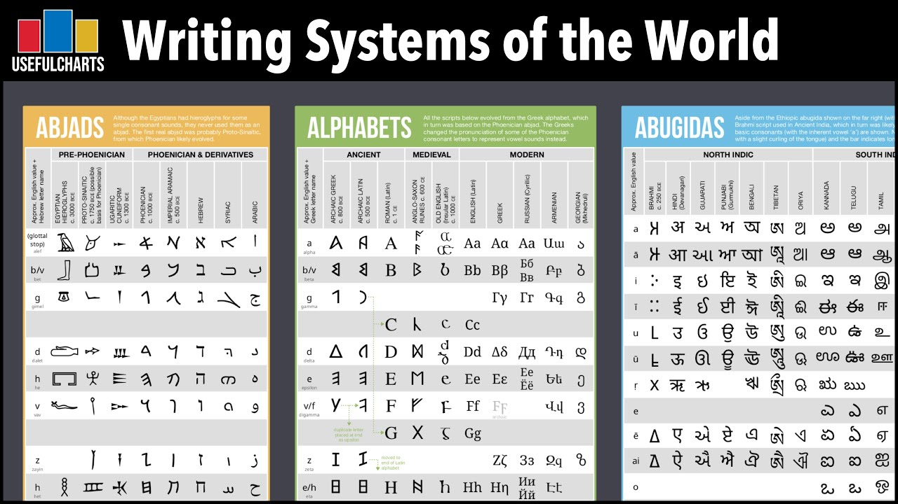

2. **书写系统的混合性**
   - 现行的书写系统通常**结合了多种策略**，如**汉语文字**结合了语标和字母，**英语**结合了字母和语标
   - **B类线形文字**和**埃及象形文字**都包含了**语标、字母和音节符号**
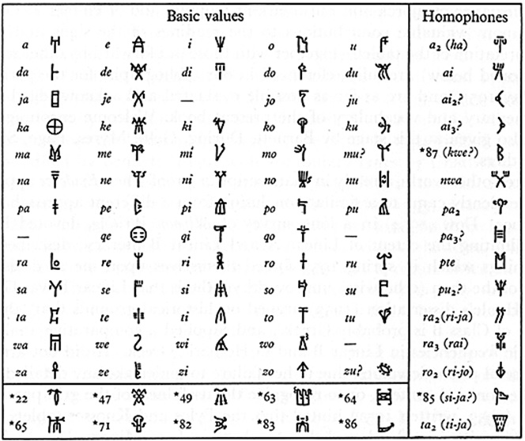

3. **书写系统的发明与传播**
   - 发明新的书写系统是一个**复杂的过程**，需要解决如何将声音分解为言语单位、如何识别相同的音或言语单位以及如何设计代表语音的符号等问题
   - 历史上只有**少数几次**是人们**完全独立地发明书写系统**，如**苏美尔人**和**墨西哥印第安人**，而其他民族则是通过借用和改造或受到其他书写系统的启发来发明自己的文字
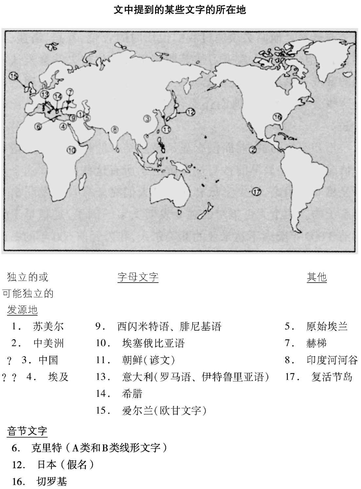

## 文字的独立发明
1. **苏美尔文字的起源与早期发展**
   - 新月沃地的**农业村舍**使用**黏土制成的记号**进行计数，如羊的头数和谷物的数量
   - 技术革新包括使用**黏土刻写板**作为书写表面，开始时**使用尖器刻划**，后来**使用芦苇秆作为尖笔**，因为它可以在黏土板上画出**整齐的记号**
   - 书写格式的发展包括**文字的整齐排列**、**从左到右的阅读方向**以及**逐行从上到下的阅读方式**
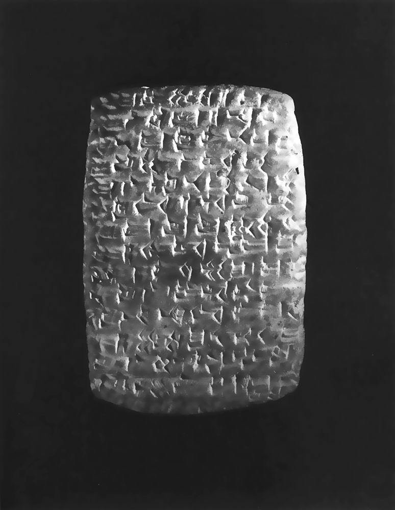

2. **从图形到语音的转变**
   - 最早的苏美尔文字符号是**可以识别的图形**，如鱼和鸟
   - 符号逐渐变得**更为抽象**，尤其是在尖头工具被**芦苇秆笔**替代后
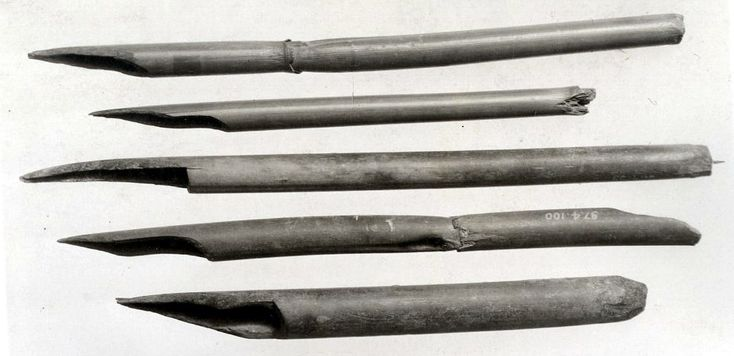
   - 通过**结合**旧的符号**创造**新的符号，例如，为了表示“吃”，将代表“头”的符号与代表“面包”的符号结合
   - **语音符号**的引入是为了解决如何表示实际语言的问题，而不仅仅是表示某些概念或单词

3. **苏美尔文字的复杂性**
   - 苏美尔文字结合了三种符号：**语标**（代表一个完整的词或名字）、**语音符号**（用于拼写音节、字母、语法成分或部分的词）和**义符**（不发音，只用来解决歧义）
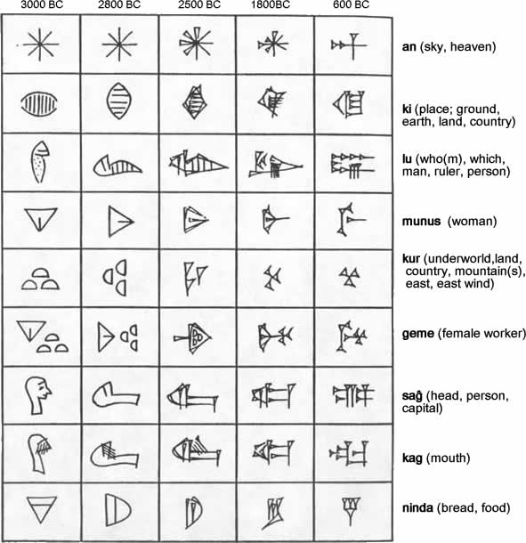
   - 语言学家把**语音符号**这种决定性的创新称之为**画谜原则**，也是今天构成双关语的基础
   - **语音符号**使得文字能够“**拼写**”较长的词，例如，表示“believe”可以通过画一只“bee”和一片“leaf”
   - 尽管如此，苏美尔文字**并没有达到**完备的音节表或字母表的标准，同一个符号可能有不同的发音或读法

4. **中美洲文字的独立发明**
   - 中美洲（可能是墨西哥南部）的**印第安社会**是另一个独立发明文字的例子
   - 中美洲文字与旧大陆文字**在形式上完全不同**
   - 已知的中美洲文字约有**十几种**，其中大部分与**玛雅文字**有亲缘关系，但大多数仍然只是**部分得到破译**
   - 玛雅文字的组成原则与苏美尔文字相似，利用了**语标和语言符号**，例如，玛雅文的音节符号“ne”像一个尾巴，而玛雅文中表示尾巴的词就是neh
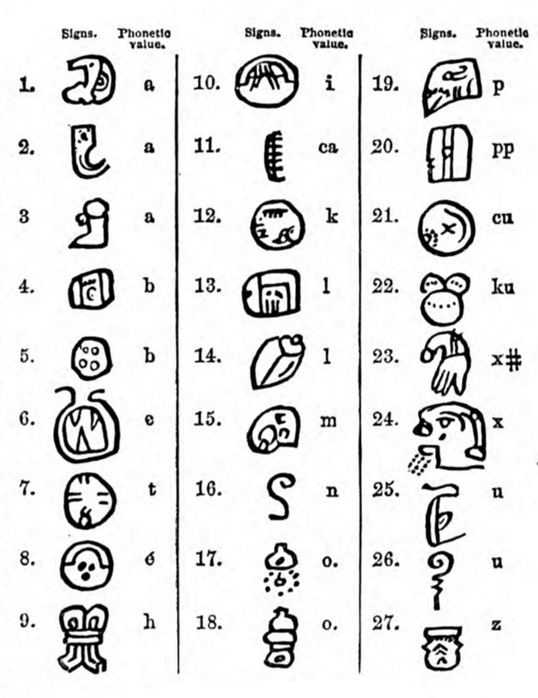

## 文字的传播方式
1. **文字的普遍性与独立发明**
   - 人类的创造力在文字发明中展现了其**普遍性**，苏美尔人和中美洲印第安人在文字发明中都面临了类似的基本问题
   - 苏美尔文字和中美洲文字的**相似性**证明了人类**在不同地方和时间**都能独立地发明文字
   - 除了苏美尔和中美洲外，其他地方的文字似乎都是从**已有的书写系统**派生或受其启发

2. **文字的传播与社会条件**
   - 文字的发明需要**特定的社会条件**，这些条件决定了一个社会是否会认为**文字有用**，以及是否能够养活专职的**文字记录者**
   - 苏美尔人和早期墨西哥人是旧大陆和新大陆**最早满足这些条件**的人，他们的文字传播到其他社会后，其他社会就**无需再花费大量时间**进行文字实验

3. **蓝图复制与思想传播**
   - 发明可以通过两种主要方式传播：**蓝图复制**和**思想传播**
   - 蓝图复制是**对现有的详细设计进行复制或修改**，而思想传播则是**接受基本思想并重新创造细节**
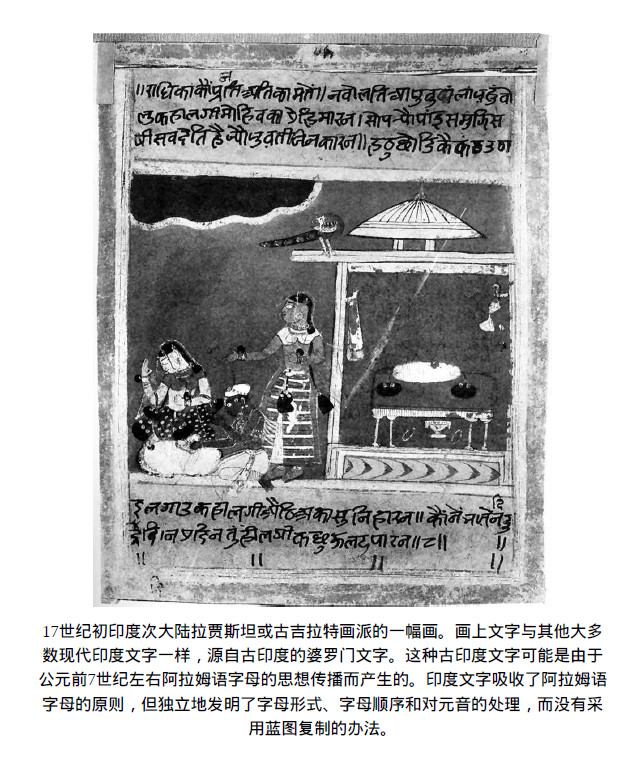
   - 举例：俄国制造原子弹的努力是基于窃取的美国原子弹蓝图（蓝图复制）还是基于美国原子弹爆炸的启示（思想传播）

## 文字的蓝图复制
1. **专业语言学家的蓝图复制法**
   - 专家使用**蓝图复制法**为没有文字的语言**设计书写系统**
   - 通常是**修改现有的字母表**，如**传教士**为新几内亚和印第安语言**修改罗马字母**
   - **俄罗斯的部落语言**采用了**修改后的西里尔字母和罗马字母**，如1928年的土耳其语

2. **古代书写系统的蓝图复制**
   - **西里尔字母**由希腊传教士**圣西里尔**通过改造**希腊文和希伯来文字母**设计
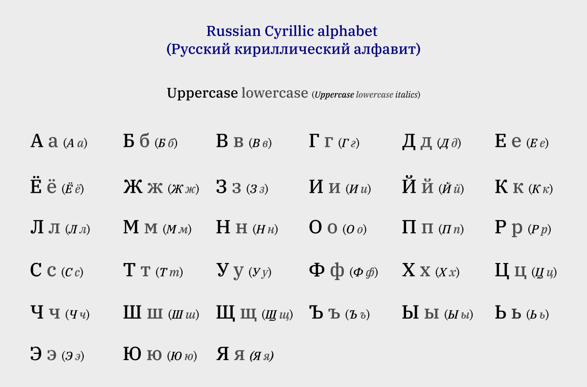
   - **乌尔斐拉斯主教**为**日耳曼语**（包括英语）创造了**哥特文字母**，结合了**希腊、罗马和如尼文字母**

3. **字母的适应与创新**
   - 由于不同语言的**发音差异**，需要**对字母进行调整**
   - **舍弃不需要的字母**，如芬兰语中的b、c、f、g、w、x和z
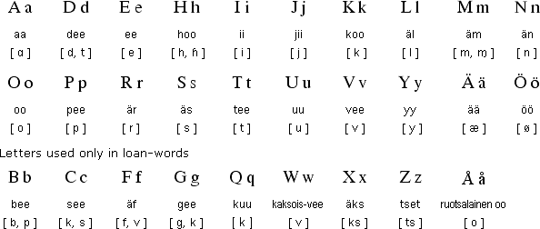
   - **创造新的字母或符号**，如英语的j、u、w或西班牙语的ñ
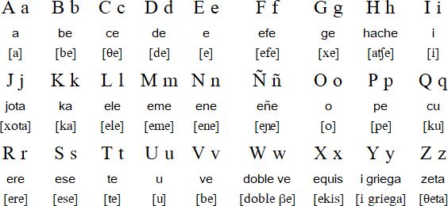

1. **罗马字母的起源与演变**
   - 字母在人类历史上**只产生过一次**，起源于**叙利亚到西奈半岛的闪语**
   - 现代语言的字母，如英语、希腊语**都可以追溯到闪语字母**
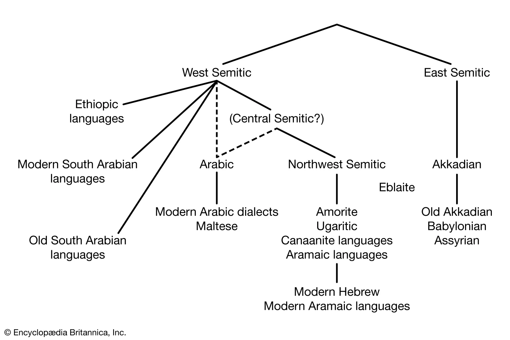
   - 闪语字母的名称如’aleph＝牛，beth＝房子，gimel＝骆驼，daleth＝门，都有其**特定的意义**
2. **字母的三大改革**
   - **单辅音表示**
     - 字母被规定只能用来**代表单一的辅音**
     - 这与其他书写系统，如音节文字或象形文字，有明显的区别
   - **固定的顺序与有意义的名称**
     - 字母被按照一个**固定的顺序排列**
     - 每个字母都有一个**容易记住的名称**，这些名称在原始的闪语中都与某种熟悉的事物相关，如’aleph＝牛，beth＝房子
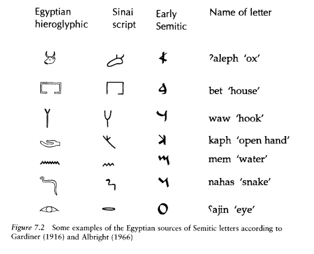
   - **元音的规定**
     - 在字母的早期阶段，开始对**书写元音**的方法进行实验
     - 希腊人成为第一个系统地**使用代表辅音的字母来表示全部元音**的民族
       - 希腊人通过“**征用**”腓尼基语字母中用来代表为希腊语所无的一些辅音的5个字母而得到他们的元音字母**α－ε－η－ι－ο**
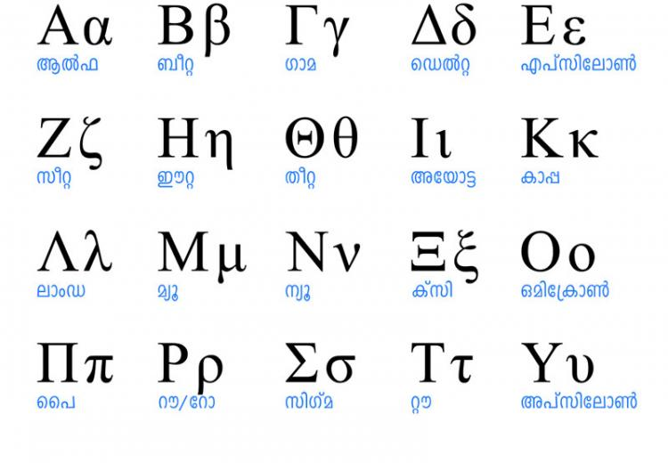

1. **字母的全球传播**
   - 字母从闪语传到**波斯、阿拉伯、希伯来、印度和东南亚**
   - 从**腓尼基人**传到**希腊人**，再到**伊特鲁斯坎人**，最后到**罗马人**，形成了**英文字母**
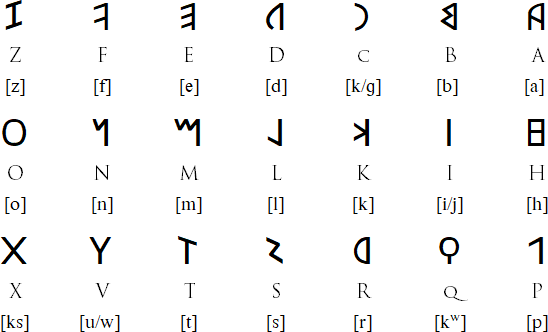
   - 字母因其**精确和简洁**的特点在现代世界得到了**广泛采用**

## 文字的思想传播
1. **蓝图复制的局限性**
   - 蓝图复制是技术传播的**直接选择**，但有时**难以实现**
   - 蓝图可能**被隐藏**，对非专家**难以理解**
   - 有时只知道**基本思想**，如某种技术的成果，但不知道**具体实现方法**

2. **塞阔雅的文字创造过程**
   - **塞阔雅**，一个阿肯色州的印第安人，为**切罗基语**发明了**音节文字**
   - 最初尝试通过**画图**和**为每个词创造符号**，但都失败了
   - 最终意识到词由**重复的音节**组成，设计了**85个音节符号**，大部分代表**一个辅音和一个元音的组合**

3. **塞阔雅音节文字的来源与影响**
   - 借鉴了**英语字母**，如D、R、b和h，但赋予了新的意义，如D代表切罗基语的音节a
   - 修改了一些**英语字母**
   - 创造了一些**全新的符号**
   - 塞阔雅的音节文字得到了语言学家的赞赏，切罗基人迅速学会并开始印刷书报
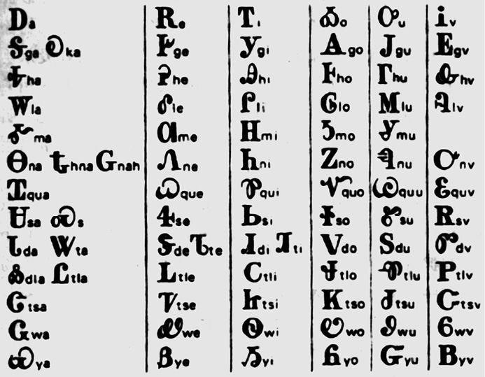

4. **古代书写系统的启示与独创**
   - **朝鲜李朝的谚文字母**：由**世宗国王**设计，受到中国方块字、蒙古和西藏佛教经文的启发，但具有独特的**音节方块组合**、相关字母形状代表相关音素、以及描述嘴唇和舌头位置的**辅音字母形状**

   - **欧甘字母**：在爱尔兰和凯尔特语的不列颠地区使用，采用字母表音原则，但具有**独特的字母形式**，基于手势语的**五指法**
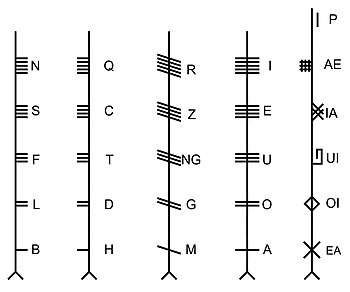

5. **文字的独立创造与思想传播**
   - **谚文字母和欧甘字母**：虽然与其他文字社会有交往，但灵感来源显而易见，被认为是**思想传播的结果**
   - **苏美尔的楔形文字和中美洲的早期文字**：被认为是**独立创造**，因为在它们首次出现时，它们所在的地区**没有其他文字的启示**
   - **复活节岛文字**：**可能**在欧洲人到达之前**独立出现**，但也可能是受到**西班牙探险队书面声明**的启发
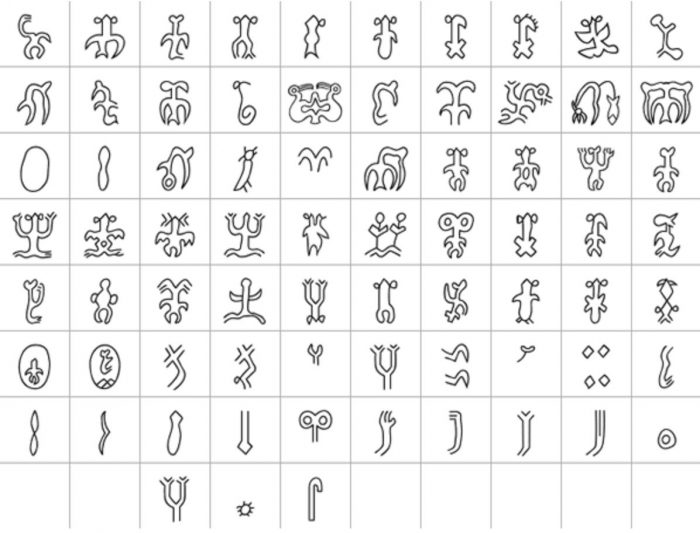
   - **中国文字**：大多数学者认为是**独立发展**，尽管与苏美尔有**贸易往来**，但没有证据显示中国的文字发明者知道其他文字
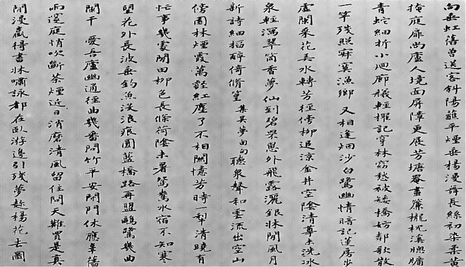
   - **埃及象形文字**：可能是**思想传播的结果**，因为埃及与苏美尔有贸易往来，但**没有证据显示象形文字的逐步发展**
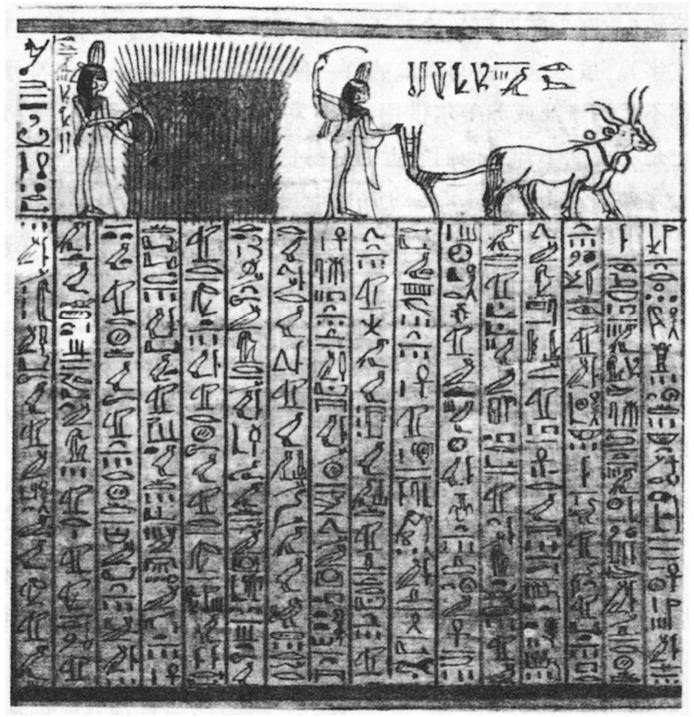
   - 如果多个社会在短时间内独立地发明文字，比起这可能是一个巧合，**更可能的解释**是它们从其他社会那里**得到了启示**

## 文字的演变：从早期简略到个人化的表达
1. **早期文字的特点与局限性**
   - **早期文字的简略性**：例如，最早的**苏美尔楔形文字**仅用于**简略表**达，如“约翰27头肥羊”

   - **文字的不明确性与复杂性**：苏美尔文字混合了语标、音符和多种不发音的义符；迈锡尼时代的希腊B类线形文字省略词尾辅音，同一符号代表多个辅音

2. **早期文字的使用者与用途**
   - **专职文字记录者**：如迈锡尼时代的希腊，只有**少数宫廷官员**使用B类线形文字
   - **早期文字的主要用途**：主要用于**官方记录**，如苏美尔的宫廷和寺庙账目、迈锡尼时代的希腊的羊毛和绵羊账目

3. **文字的功能与社会期望**
   - **早期文字的功能**：正如人类学家**克洛德·列维—斯特劳斯**所说的那样，主要用于“**方便对别人的奴役**”，如苏美尔的国王和祭司用文字记录税务

   - **社会对文字的期望**：早期社会希望文字**仅为专职记录者所用**，而不是为大众所用

4. **文字的演变与普及**
   - **希腊的文字演变**：从**B类线形文字**到**希腊字母文字**，后者**更简单、明确**，用于**私人交际**
   - **早期字母文字的用途**：如希腊字母文字最早用于**酒罐和酒杯上的铭文**，如“舞姿最曼妙者将奖以此瓶”
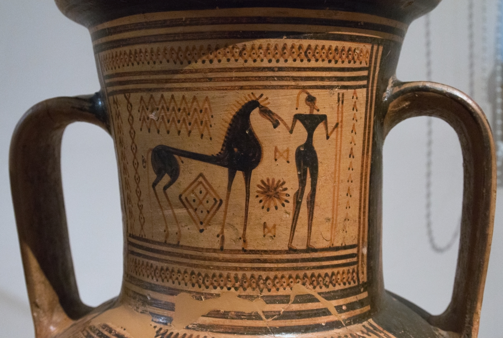

5. **字母文字的个人化与公共化**
   - **字母文字的个人化**：如希腊字母文字初期用于**个人交际**，如酒杯上的诗句“我是内斯特的酒杯，盛满了玉液琼浆”
   - **字母文字的公共化**：随着时间的推移，字母文字也被用于**公共或官方目的**

## 文字的演进：粮食生产、社会进化与地理隔离的影响
1. **文字的晚期出现与早期使用**
   - 早期文字的**使用受限**，反映了文字在人类进化中为何出现得**如此晚**
   - 所有可能的文字**独立发明**（如苏美尔、墨西哥、中国和埃及）都与**社会等级、复杂政治机构和粮食生产**有关
   - 早期文字**服务于政治机构的需要**，如**记录保存和王室宣传**

2. **文字与粮食生产的关联**
   - **狩猎采集社会**没有发明或采用文字，因为**缺乏使用文字的机构和农业机制**
   - **粮食生产和社会进化**对文字和人类流行疾病的病菌的演化都是必不可少的

3. **文字的独立发明与传播**
   - 文字在新月沃地、墨西哥和可能的中国独立出现，因为这些地方是**粮食生产最早的地区**
   - 文字通过贸易、征服和宗教向具有**相似经济结构和政治组织**的社会传播

4. **粮食生产为文字的必要但非充分条件**
   - 有些粮食生产社会，如印加帝国、汤加、夏威夷、西非和密西西比河河谷，尽管具有复杂的政治组织，但**未能发明或采用文字**
   - 文字的独立发明或采用需要**时间，距离和与其他社会的交往**

5. **地理和生态条件对文字传播的影响**
   - **距离、生态障碍和水域阻隔**影响了文字的传播，如撒哈拉沙漠、墨西哥北部的沙漠和达里安地峡
   - 虽然没有文字的社会**并非完全与世隔绝**，如西非接受了新月沃地的家畜和伊斯兰教的影响，玉米从墨西哥传到安第斯山脉地区；但**地理和生态条件**影响了人类发明的传播