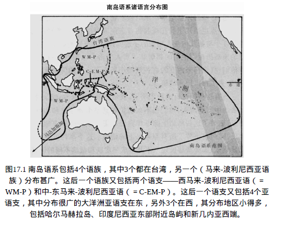

# 东南亚
## 南岛人扩张：太平洋岛屿历史的缩影
### 在查亚普拉的铺子里
- 阿什马德（印度尼西亚政府官员）、维沃尔（新几内亚高原人助手）、索阿卡里（新几内亚北部沿海低地人助手）与平瓦（中国商人）之间的互动揭示了**多种族群体间的复杂关系**
- 阿什马德**对新几内亚山区生存所需物品的不熟悉**，反映了爪哇人对新几内亚文化的**陌生感**
- 维沃尔和索阿卡里对阿什马德不适应新几内亚环境的**嘲笑**，体现了新几内亚原住民对爪哇人的**轻视**

### 群体间的紧张与冲突
- **爪哇人**在印度尼西亚政府中的**主导地位**与**对新几内亚的并吞行为**激发了新几内亚人对爪哇人的**愤恨**
- **华人**在印度尼西亚经济中的**支配地位**与政治上的占优地位之间的**紧张**，在1966年导致了**大规模屠杀**
- 新几内亚高原居民和沿海低地居民之间的**相互轻视**，体现了新几内亚内部的**族群紧张**

### 史前时代的人口流动
- 维沃尔的祖先（40000年前的早期亚洲移民）、阿什马德的祖先（约40000年前沿海迁移的爪哇人）和索阿卡里的祖先（约36000年前的移民）代表了从亚洲大陆到太平洋的**三次海外移民浪潮**
- 这些移民浪潮导致了非欧洲人在史前时代的**海外扩张和更替**，类似于哥伦布之后欧洲人对非欧洲地区的影响

### 南岛人的扩张
- **南岛人扩张**是过去6000年中规模最大的人口流动之一，其影响范围**从马达加斯加到复活节岛**
- 南岛人成为新石器时代中**最伟大的航海者**，代表了亚洲大陆向太平洋岛屿的**成功人口迁移和文化传播**
- 这场扩张解释了为什么最终来自大陆中国的南岛人能够在爪哇和其他印度尼西亚地区**取代原住民**，而新几内亚的某些区域却保留了**原住民特征**

### 对太平洋岛屿历史的影响
- 南岛人扩张不仅改变了**印度尼西亚和新几内亚的人口组成**，也对**远至波利尼西亚的太平洋岛屿**产生了深远影响
- 这场扩张展示了史前人类如何通过海上迁移改变了太平洋岛屿的文化和种族构成
- 分析南岛人扩张揭示了海外人口流动的复杂性和其对当地社会政治动态的长期影响

## 南岛语系与太平洋岛屿的人类迁徙
### 菲律宾和印度尼西亚的居民特征
- 居民外貌和遗传上与**华南中国人**及**热带东南亚人**相似，尤其是与**马来半岛居民**更加接近
- 这些地区的**语言亲缘关系紧密**，均属于南岛语系的**西马来-波利尼西亚语支**
- 南岛语系词汇的一部分已**被借入英语**，例如“taboo”和“tattoo”

### 南岛语系的分布与迁徙
- 南岛语系几乎**覆盖了整个太平洋地区**，从马达加斯加到复活节岛
- 马来-波利尼西亚语族的**广泛分布**表明其**相对近期的扩散与分化**
- 三个较小的南岛语族集中在**台湾**，暗示台湾可能是**南岛语的发源地**

### 台湾的土著与南岛语系的起源
- **台湾土著**长期占据岛屿，直到近几千年中国大陆人开始**大量迁徙至台湾**
- 三个小的南岛语族**只在台湾存在**，表明台湾是这些语言的最后堡垒
- 台湾被视为**所有南岛语**（包括扩散至太平洋各地的马来-波利尼西亚语族）**的故乡**

### 南岛人迁徙的历史影响
- **南岛人的扩张**是导致现代印度尼西亚、菲律宾以及太平洋岛屿居民特征形成的关键因素
- 这一扩张过程**在短时间内完成**，导致了语言的**快速增生**而没有形成深刻的语言差异
- 现代印度尼西亚人和菲律宾人的**外貌、遗传特征与语言的一致性**，反映了近期**大规模人口迁移与文化更替**的结果

### 现代印度尼西亚和菲律宾的文化多样性
- 虽然印度尼西亚和菲律宾展现出遗传和语言上的一致性，但地区间仍存在**文化多样性**
- 南岛语系的扩张与台湾土著语言的遗存提供了关于人类早期迁徙和文化交流的宝贵线索
- 南岛人扩张的研究揭示了太平洋岛屿历史中的人口流动模式，对理解全球史前时期的人类活动提供了重要视角

## 南岛语系与古代文化的扩张
### 考古证据与文化迹象
- **台湾**是南岛语系文化**最早的考古证据地点**，标志着新石器时代文化的开始，包括打磨石器、有图案装饰的陶器以及农业的证据
- **台湾早期居民**的**海洋活动**，如深海捕鱼和海上交通，表明他们具备了足够的**航海技能**，可能用于**后续的太平洋扩张**
- **树皮舂捣器**的使用反映了早期居民**对树皮纤维的利用**，这一技术后来在太平洋岛屿文化中被广泛采用

### 太平洋扩张的证据与过程
- 从台湾开始的**文化扩张迹象**，包括陶器、石器、家畜骨骼和作物残迹，向外扩散并最终覆盖了南岛语系的整个分布范围
- 这种扩张过程首先出现在**菲律宾**，随后是**印度尼西亚、新几内亚及其沿海地区**，最终影响到**波利尼西亚、密克罗尼西亚**甚至非洲东海岸的**马达加斯加**
- 扩张的速度显示了南岛人以**整个文化包裹**（包括作物、家畜和技术）迅速移动，显示出了南岛人在**航海和海洋扩张方面**的高超技能

### 航海技术的关键突破
- **双舷外浮材张帆行驶独木舟**的发明，可能是促进南岛人扩张的重要技术突破，这种设计显著提高了航海的**稳定性和安全性**
- 这种独木舟允许南岛人进行**远洋航行**，包括跨越台湾海峡到中国大陆以及后来的太平洋岛屿之间的**长距离航海**
- 这种航海技术的进步不仅对于**台湾到太平洋岛屿**的扩张至关重要，对于南岛人最初**从中国大陆到台湾的迁移**也是必不可少的

### 南岛语系的扩张与文化影响
- 南岛语系的扩张不仅是一个简单的人口移动过程，而是涉及到**技术、文化和生态知识**的传播
- 这种文化扩张导致了太平洋许多岛屿上**原有狩猎采集社会的更替**，以及**原始语言和文化特征的消失**
- 南岛人扩张的历史反映了人类如何通过技术创新和社会组织改变自然环境，以及这些变化如何塑造了今天太平洋地区的文化和人口分布

## 南岛语系的扩张与文化证据
### 南岛语系的起源与扩张路径
- 考古学与语言学证据一致显示，南岛语系的扩张先是**从华南沿海到台湾**，然后是**从台湾到菲律宾和印度尼西亚**
- 与假设的从**马来半岛**开始的扩张相反，证据表明**台湾**是最早的移民起点，随后才是对**马来半岛和苏门答腊**的移民
- 最深刻的语言变化发生在台湾，表明其为**南岛语系的早期中心**，而马来半岛和苏门答腊的语言变化较少，显示了**较晚的移民活动**

### 考古与语言学证据的一致性
- **台湾的大坌坑文化**提供了早期农业、陶器制作和海洋活动的证据，与南岛语系文化内容的语言学重构相吻合
- 通过比较现代南岛语言，重构出**原始南岛语**包含“猪”、“狗”和“米”等词汇，反映了**古代南岛人的生活方式和文化**
- 原始马来-波利尼西亚语的重构显示，**热带作物**的名称是在南岛人向赤道扩张过程中**加入其语言**的，与考古证据关于作物传播的记录一致

### 文化与技术的传播
- 南岛语系的扩张带动了一系列**文化和技术的传播**，如陶器制作、猪和狗的驯化，以及热带作物的利用
- **海洋经济词汇**的存在表明，原始南岛人拥有**发达的航海技术和海洋资源利用能力**，这些技术是他们能够进行远洋扩张的关键
- 南岛人的扩张导致了他们更替了菲律宾、印度尼西亚西部及其他地区原有的狩猎采集人口，展现了农业社会对狩猎采集社会的**技术和人口优势**

### 南岛语系与中国大陆的联系
- 南岛语系的起源可能与**华南沿海地区**有关，但在今天的中国大陆**已不再存在南岛语的使用**，可能是因为受到了**汉藏语系扩张**的影响
- 与南岛语最接近的语族包括傣-加岱语、南亚语和苗瑶语，表明南岛语的一些亲属语言在中国大陆上**幸存了下来**，尽管南岛语本身在大陆上消失
- 南岛语系的历史表明，人类社会在面对技术、文化和语言的传播和变迁时，展现了复杂的动态过程，涉及到人口迁移、文化互动和语言演变

## 南岛语系的扩张与新几内亚的遗传与语言影响
### 南岛语扩张的初期阶段
- 南岛语的扩张过程从**华南沿海**出发，先至**台湾**，再经**菲律宾**至**印度尼西亚西部和中部**，展现出一条明确的迁移路线
- 这一扩张未能在**新几内亚**取得类似的成功，原住民的遗传和语言特征在新几内亚保持了**较高的持续性和独立性**

### 新几内亚的遗传与语言特征
- 新几内亚高原人的遗传学研究**未发现**南岛人的遗传标志，表明南岛人的扩张**未能深入**新几内亚内陆
- 新几内亚北部和东部沿海的居民在遗传上呈现**一定程度的南岛人特征**，但主要还是接近**新几内亚高原原住民**
- 新几内亚的语言多样性体现在大部分地区仍使用**巴布亚语**，而南岛语仅限于**北部和东南部的一小片地区**

### 语言和文化的相互影响
- 新几内亚北部沿海地区和附近岛屿的南岛语和巴布亚语表现出了**长期互相影响**的结果，难以明确区分原始语言归属
- 语言学和遗传学的证据揭示，说南岛语的人曾与新几内亚的原住民有过**长期的接触和交流**，但在遗传上南岛人的影响**相对有限**
- 南岛人在新几内亚北部沿海及其岛屿上的影响主要体现在**语言的传播**上，而非**遗传特征的广泛传播**

### 南岛语扩张与新几内亚的考古证据
- 考古学证据支持了南岛语扩张至台湾、菲律宾和印度尼西亚的过程，但在新几内亚的影响相对有限
- 新几内亚的考古学证据揭示了与南岛人文化特征（如陶器、农业等）的**关联性不强**，反映了原住民文化的**持续性和抵抗力**
- 南岛语扩张对新几内亚的影响主要限于**北部和东南部沿海地区**，而未能深入新几内亚的**内陆和南部地区**

## 南岛人的扩张及其在新几内亚的影响
### 南岛人的扩张特点与拉皮塔文化
- 公元前1600年，南岛人的迁移标志如猪、鸡、狗、红纹陶、打磨石扁斧等在**哈尔马赫拉岛和新几内亚地区**同时出现
- 与之前到达菲律宾和印度尼西亚的迁移不同，新几内亚地区的陶器具有**独特的水平带状几何图形纹饰**，这种风格的陶器称为**拉皮塔陶器**
- 拉皮塔文化遗址多分布在**新几内亚周边的小岛**上，而不是大岛上，表明他们的扩张模式有所不同

### 拉皮塔人的生活方式与影响
- 拉皮塔人主要依靠**海产**为生，如鱼、海豚、海龟等，并饲养猪、鸡和狗，生活密切关联于海洋
- 他们的文化器材和陶器风格与印度尼西亚和菲律宾的南岛人社会的**早期遗址**相似，表明**文化上的一致性**
- 考古学家通过拉皮塔遗址出土的物品重构出**拉皮塔人的生活基础**，显示了他们**与海洋紧密相连的生活方式**

### 新几内亚与南岛语的扩张
- 虽然拉皮塔文化的标志在**新几内亚**出现，但南岛人**未能深入新几内亚内陆**，他们的遗传和语言特征在新几内亚的影响**有限**
- 新几内亚北部和东部沿海民族在遗传上接近**新几内亚高原原住民**，但在语言上接受了**南岛语**，反映了南岛人与原住民的**长期交流**
- 南岛人在新几内亚北部沿海及周边小岛的活动，更多体现为**语言上的扩张**而非遗传上的扩散，表明了文化和语言的传播

## 南岛人扩张与新几内亚的独特结果
### 南岛人与新几内亚的区别
- 南岛人在印度尼西亚和菲律宾**几乎完全取代了原有居民**，而在新几内亚却**未能深入**，原因在于新几内亚**已有粮食生产的基础**
- 新几内亚高原地区的粮食生产使得南岛人在技术、遗传抵抗力和社会组织上**没有明显优势**
- 新几内亚人已经有打磨的**石器和航海技术**，他们的粮食生产包括可能**独立驯化的作物**，如芋艿、薯蓣和香蕉

### 新几内亚与南岛人的文化交流
- 新几内亚北部沿海和岛屿上的部分人群采纳了南岛语言，反映了双方**长期的交流和贸易**
- 南岛人的一些**文化特征**，如拉皮塔陶器，显示了他们在新几内亚周围小岛上的存在
- 新几内亚人对南岛人的鸡、狗和尤其是猪**迅速吸纳**进他们的经济中，反映了**文化的融合**

### 环境对南岛人扩张的影响
- 南岛人扩张的不同结果突显了**粮食生产在人口流动中的关键作用**，农业基础强的社会能够抵抗外来入侵者
- 南岛人虽然成功地扩张到了印度尼西亚和菲律宾，但在新几内亚遇到了**坚实的农业和技术阻碍**
- 在印度尼西亚，缺乏粮食生产基础的狩猎采集族群**无法抵抗**南岛人的扩张

### 波利尼西亚的扩张与文化发展
- **波利尼西亚人的扩张**反映了从台湾经印度尼西亚到太平洋岛屿的**迁移路径**，展现了**广泛的文化和语言传播**
- 在波利尼西亚，南岛人发展了**多样的社会结构和经济系统**，适应了各种环境条件
- **欧洲人的到来**改变了该地区的历史进程，但东亚和大部分太平洋岛屿依然保持着**原有民族的文化特征和社会结构**

