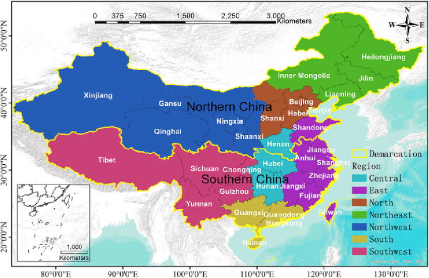
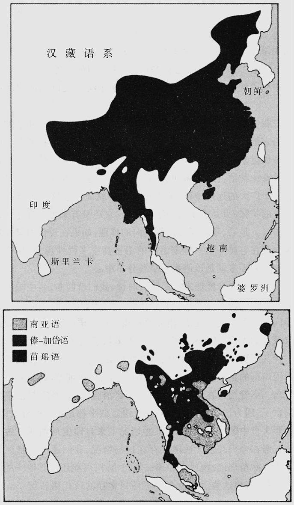
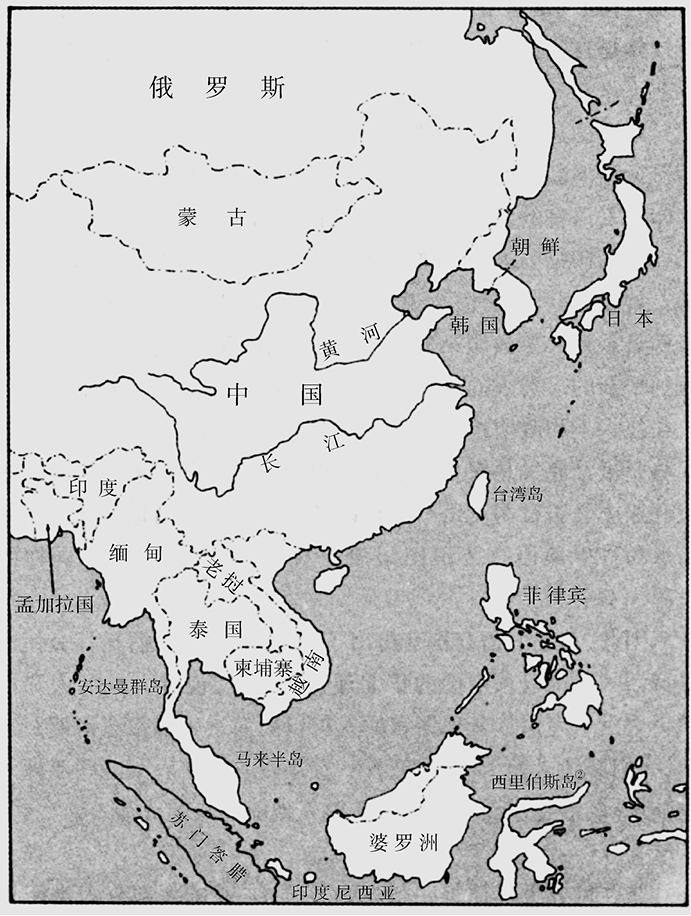
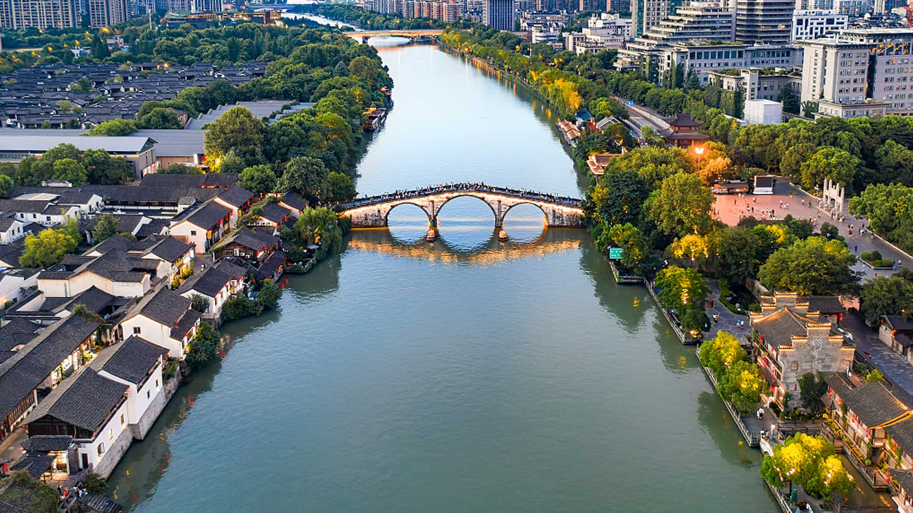
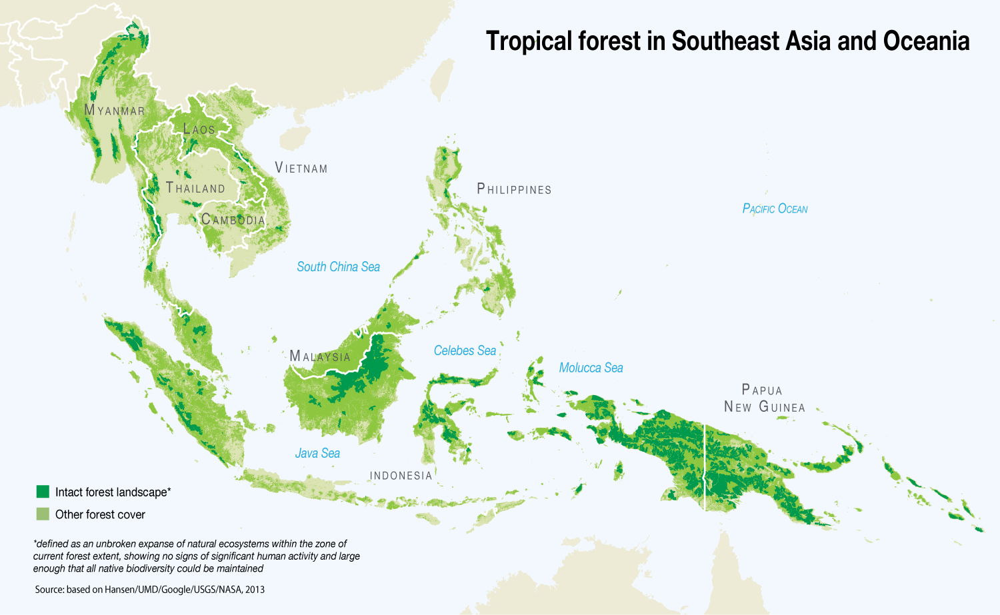

# 中国
## 移民与多样性：加利福尼亚州的经验与历史视角
### 加利福尼亚的多样性实践
- **加利福尼亚州**曾积极推动包括外来移民接纳、少数民族与妇女就业机会的增加、多语言使用、种族多样性等政策
- 洛杉矶公立学校的学生背景体现出**家庭语言的多样性**，80多种语言的使用反映了**加利福尼亚社会的复杂性**
- **多元文化的实践**在孩子们的生活中变得具体而鲜活，英语使用者成为少数

### 美洲的种族多样性恢复
- 美国历史中的**种族多样性**并非新现象，而是回归**印第安部落和语言多样性的传统**
- 除**中国**外，世界上人口最多的国家通常是**由近代政治力量统一的民族大熔炉**，保持着复杂的语言和种族群体

### 中国的独特统一性
- 中国在**公元前221年**实现政治统一，自那以后大多数时间内**保持统一**，与其他国家形成鲜明对比
- 尽管从遗传和体质上看，华北人和华南人存在**显著差异**，中国仍然维持了**语言和文化的近乎统一**
- 中国的统一性是通过**早期的“中国化”过程**实现的，该过程促使广大地区**迅速单一化**，对东南亚及其它地区产生了深远影响

### 语言多样性与统一的对比
- **新几内亚**虽地域不大但语言**极为多样**，反映了人类社会在长时间隔离下的自然分化
- 中国虽历史悠久但**语言相对统一**，这种异常现象提示了中国可能经历了**独特的历史统一过程**
- 其他地区如俄国、印度、印度尼西亚、巴西等通过近代政治力量实现民族和语言的统一或多样性保持

## 中国语言的多样性与统一过程
### 中国语言地图的启示
- 除了**普通话及其7个亲属语言**之外，中国还**有130多个“小”语种**，分属**4个不同语族**
- 普通话及其亲属语言构成汉藏语系的**汉语族**，分布在中国的广大地区
- **其他3个语族**（苗瑶语族、南亚语族、傣——加岱语族）分布**零碎且分散**，被汉语族的**广阔地域**所包围

### 语言分布的历史变迁
- 通过历史逆推，我们可以猜测几千年前东亚语言的分布**更加多样且连续**
- 汉语的族群在**华南**对其他语族人口的**取代**，是通过**征服和吸收非汉语人口**实现的
- 说汉语的族群对其他族群的鄙视和语言上的改变促成了中国**华北向华南的语言扩张**

### 东亚语言剧变的影响
- 东亚地区的语言剧变类似于**欧洲语言向新大陆的扩张**，征服和疾病是语言更替的直接原因
- 类似的语言更替现象也发生在**澳大利亚**（英语取代土著语言）和**非洲**（班图语取代俾格米和科伊桑语言）

### 中国语言统一的原因探究
- **技术、政治和农业方面的优势**可能是说汉藏语的人从华北迁往华南的原因
- 类似地，说南亚语的人和其他原始中国华南语族的人**向热带东南亚的南迁**也可能由于技术和政治优势
- 需要考古学证据来探究某些亚洲人在技术、政治和农业方面获得对其他亚洲人的优势的过程

## 东亚文明的形成与扩张
### 中国的古代文明起源
- 中国的考古记录揭示了**公元前7500年左右**的作物残迹、家畜骨头、陶器和新石器时代的石器，表明中国是**世界最早的粮食生产中心之一**
- 华北和华南的生态差异暗示中国可能有**多个独立的粮食生产中心**，早期作物包括**耐旱的黍子和水稻**
- 除了驯养的猪、狗和鸡外，水牛、蚕、鸭和鹅等动物，以及大豆、大麻、柑橘果、茶叶等作物也在中国得到**驯化**

### 文化和技术的进步
- 中国的**青铜冶炼传统**起始于**公元前3000年至前2000年间**，**铸铁**生产发展于**公元前500年左右**
- 中国最早的城市出现于**公元前第三个千年**，**墓葬的变化**显示了社会阶级的形成，**大运河的建设**反映了等级社会和集中权力
- 中国**文字的出现**可能比现存最早的文字记录**更早**，夏、商、周三个王朝的形成标志了**国家的形成和政治统一**

### 语言和文化的统一过程
- 汉藏语言的向南扩张以及青铜工艺、国家形成的传播是**华北向华南文化统一**的关键方面
- 秦始皇的**书籍焚毁令**可能对华南的苗瑶语和其他语族的零碎分散状况起到了**推动作用**
- 中国的文化和政治统一**在地理上得以实现**，与欧洲相比，中国的地形和河流系统**促进了南北之间的交流**

### 中国对邻近地区的影响
- 东亚的文化进步并非全部源于中国，但中国在粮食生产、技术和文字方面的领先地位对周边地区产生了**深远影响**
- **热带东南亚的中国化**完成了缅甸人、老挝人和泰人的**南下扩张**，这些现代民族是他们华南同胞的**近代旁系亲属**
- **朝鲜和日本**也受到了中国的强大影响，虽然它们在**地理上的隔绝状态**保留了**自己的语言和遗传特征**

### 东亚文明形成的总结
- 中国的文化统一过程**早于欧洲**，中国成为了一个在技术、政治和文化上**高度统一**的国家
- 东亚其他地区的**文化进步**，如**日本的陶器制造技术，**也对该地区的文化发展做出了贡献
- 中国的统一和对周边地区的影响展示了**地理、技术和政治因素**在文明形成中的作用

