# 澳大利亚
## 澳大利亚探险经历与社会建立的困难
### 探险经历
- 作者和妻子玛丽在**澳大利亚**度假，计划访问**梅宁迪镇附近的土著岩画**
- 尽管作者曾在加利福尼亚和新几内亚的**热带草原**工作，认为能应对澳大利亚的挑战，但实际上遇到了**极大的困难**
- 在前往岩画的途中，由于**高温和缺水**，作者产生了幻觉，并最终不得不放弃继续前进的计划

### 土著人的生活
- 作者对土著人如何在**没有现代便利设施**的条件下，**在沙漠中找到水源和食物**感到好奇
- 土著人的生活方式展示了他们**与自然环境的和谐共存**，以及对环境的深刻理解和适应能力

### 澳大利亚的自然环境与人类社会
- 澳大利亚是一个**极端的环境**，是世界上**最干燥、最平坦、最贫瘠**的大陆，拥有**最变化无常的气候**和**最稀少的生物品种**
- 欧洲人在所有大陆中**最后占领**澳大利亚，发现其上的人类社会和人口与其他大陆有着**显著的不同**
- 澳大利亚的特殊环境和社会为研究大陆间社会差异的理论提供了决定性的检验

### 伯克和威尔斯的探险
- **罗伯特·伯克和威廉·威尔斯**是第一支试图**从南到北穿越澳大利亚**的探险队，他们遇到了**极大的困难**
- 尽管他们多次得到土著人的帮助，但由于对土著人的**误解**和**不适当的行为**，最终导致了他们的**悲剧性结局**
- 他们的故事反映了早期探险者如何在艰难条件下与土著人相遇，以及这些相遇如何影响了他们的命运

## 澳大利亚土著社会的误解与文化比较
### 外界对澳大利亚土著的误解
- **澳大利亚土著社会**常被外行人视为“**落后**”，**缺乏**所谓**文明的特征**，如农业、畜牧业、金属使用等
- 澳大利亚土著以**狩猎采集**为生，依赖**石器**，居住在**临时搭建的住所**中，这种生活方式在过去13000年里**几乎没有变化**
- 早期的欧洲探险者对澳大利亚土著的**负面评价**，如将他们视为**与野兽无异的存在**

### 澳大利亚土著的创新与适应能力
- 澳大利亚土著曾在**技术和艺术**上领先世界，发明了**边缘经过打磨的石器**、**有柄石器**和**水运工具**
- 岩画和其他考古发现表明，澳大利亚土著的文化历史**极为悠久**，他们的生活方式是对极端环境的**有效适应**
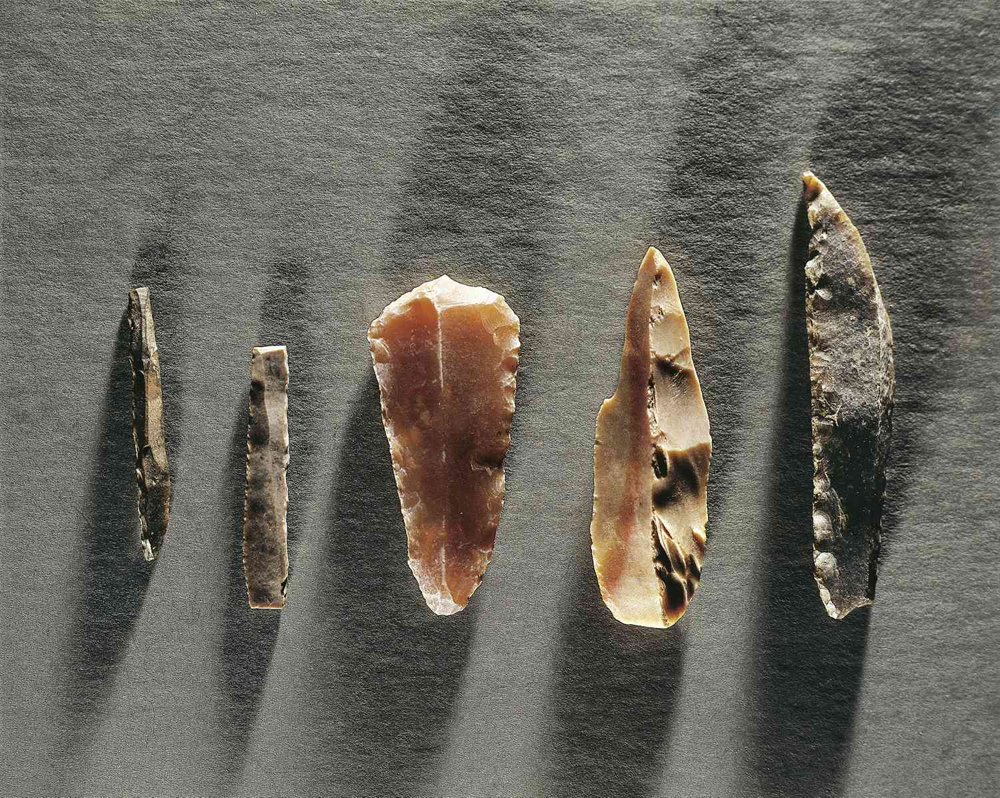

### 澳大利亚与新几内亚的文化对比
- 澳大利亚与新几内亚在**更新世冰期**期间曾是**连通**的，后由于大约12000年前到8000年前**海平面上升**而分离，形成了**截然不同的社会发展路径**
- 新几内亚社会发展出了**农业、畜牧业**和**更复杂的社会结构**，而澳大利亚则保持了较为简单的**狩猎采集方式**
- 尽管两地仅相距90英里，文化和技术的交流却**极为有限**，导致了两者在生活方式和社会组织上的**巨大差异**
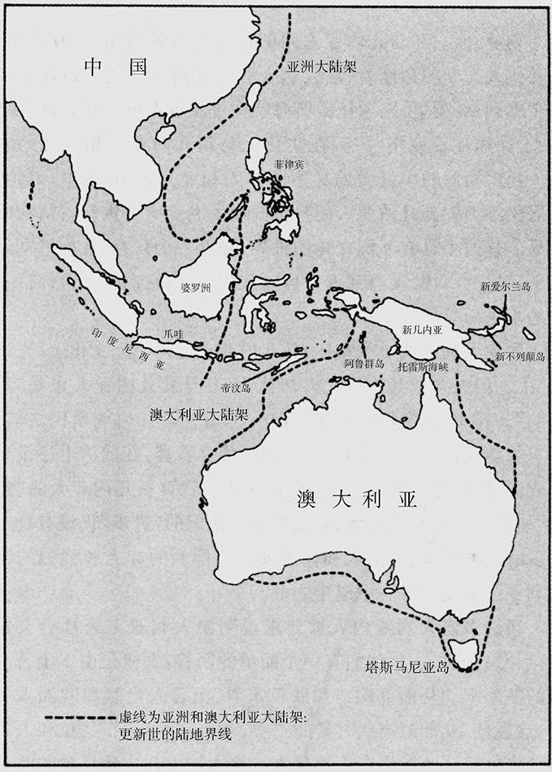
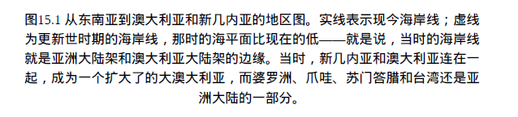
### 种族主义观点的批判
- 对澳大利亚土著社会落后现象的一种解释是**基于种族的差异**，认为土著人的身体特征决定了他们的文化状态
- 这种观点忽略了人类社会发展的**复杂性和多样性**，以及**环境**对社会结构和技术发展的深刻影响
- 作者认为，将澳大利亚土著社会的特点简单归咎于种族差异是一种错误的结论

## 澳大利亚与新几内亚的人类起源和环境差异
### 人类在大澳大利亚的起源
- 澳大利亚和新几内亚至少**在40000年前已有人居住**，那时它们还是连在一起的
- 移民最终来自**东南亚大陆**，逐岛前进，通过**印度尼西亚群岛**到达大澳大利亚
- 这一结论由现代澳大利亚人、新几内亚人和亚洲人之间在**遗传学**上的关系以及**体貌特征**的群体残存支持

### 大澳大利亚的迅速占领
- 移民一到达就迅速扩散至澳大利亚和新几内亚的**遥远和不适居住的地方**
- 证据包括澳大利亚西南角和东南角、塔斯马尼亚以及新几内亚高原地区的**早期化石和石器**
- 占领的速度极快，可能因为用**碳-14测定法**的实验误差，这些不同的年代几乎**没有区别**

### 与亚洲的隔绝发展
- 澳大利亚和新几内亚的人类社会基本上是在**与亚洲社会隔绝**的情况下发展起来的
- 语言学和遗传学的证据表明，与现代亚洲语言和人群**没有密切关系**
- 这种隔绝导致了两地与亚洲其他地区在遗传、体质和语言上的**显著差异**

### 环境因素对文化发展的影响
- 新几内亚和澳大利亚在**地理、气候和生态环境**上存在显著差异，影响了**两地的文化史**
- 新几内亚**多山、高湿、肥沃土壤**，澳大利亚**平坦、干燥、贫瘠土壤**
- 这些环境差异导致了**不同的生存方式和社会结构**，反映在两地的动植物多样性和人类文化发展上
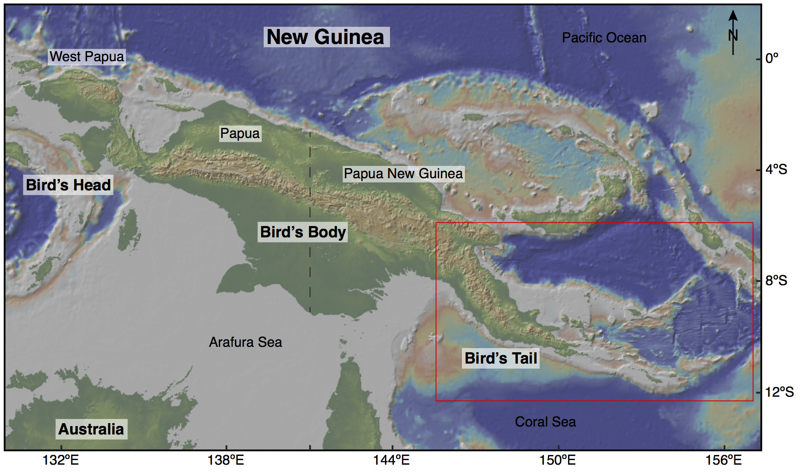

## 新几内亚的农业和文化隔离
### 新几内亚高原地区农业的早期发展
- **高原地区**的农业通过对**本土野生植物**的驯化发展起来，与世界其他几个**独立的植物驯化中心**并列
- **花粉分析**揭示了大约**5000年前**高地河谷普遍发生的**森林砍伐活动**，暗示了农业的发展
- 主要农作物包括**甘薯、芋艿、香蕉、薯蓣、甘蔗**等，证明了新几内亚作为一个**独立农业起源中心**的重要性
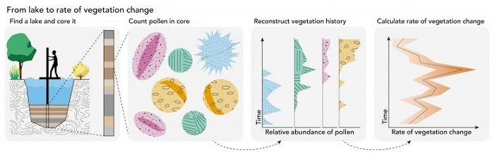

### 农业技术与人口增长的相互作用
- **9000年前**就出现的**排水沟系统和梯田**表明了新几内亚人对**复杂农业技术**的早期采用
- **甘薯的引进**导致了**近几个世纪的人口爆炸**，因为其比传统作物芋艿**成熟时间短**，**产量高**，对贫瘠土壤有**更大的耐性**
- 甘薯的引进提高了土地产出，导致**近几个世纪的人口增长**，改变了传统的生活方式和社会结构
- 欧洲探险者发现的**集约型粮食生产景观**表明了使用石器的新几内亚农民达到的高人口密度
- 其景观与**荷兰**类似，大片的森林**被清理**，谷底铺满了**篱笆围起的农田**，显示出**高密度的农业人口**
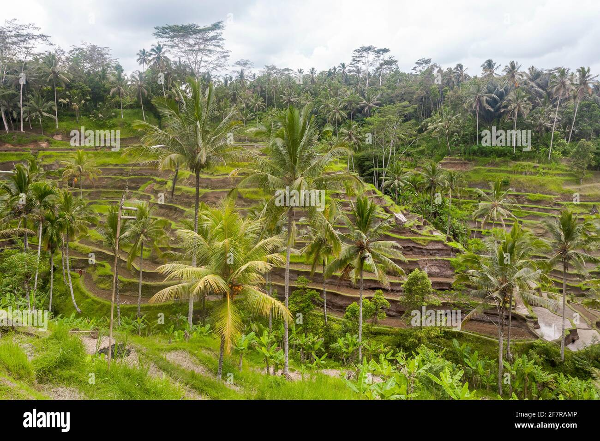

### 文化隔离与限制因素
- 新几内亚的**地理隔离**限制了与外界的接触，导致技术和思想的传入受限
- **地形的复杂性**和**部落间的战争状态**促成了文化和政治的**高度分散**
- 虽然有**南岛人的接触和贸易**，但直到欧洲人的到来，新几内亚的技术和社会组织仍然**相对落后**

### 新几内亚与外界的联系
- **南岛人的扩张**为新几内亚带来了**家畜、作物和更先进的农业技术**
- **鸡、猪的引入**以及**甘薯的普及**对新几内亚的农业有着深远的影响
- 尽管有来自亚洲的技术和作物，新几内亚直到**欧洲殖民时代**前都未能实现技术和社会的显著进步

### 新几内亚的农业特点与挑战
- 新几内亚的农业主要依赖于**低蛋白质的根用作物**，限制了蛋白质的来源和动力来源的多样性
- 新几内亚高原地区的农业只能在**特定海拔高度**发展，**高原地区**适于农业的**土地面积有限**，进一步限制了**人口密度和社会复杂性的提高**
- 不同海拔高度上粮食生产的**差异**导致了**缺乏大规模经济交换**，阻碍了经济和政治一体化的发展

## 澳大利亚土著的适应策略与环境挑战
### 澳大利亚土著与家畜饲养业的缺失
- 澳大利亚曾拥有**众多的有袋目动物**，如袋牛、大袋鼠和大毛鼻袋熊，但这些本可驯化的动物**随人类的到来而灭绝**
- 唯一成功驯化的外来哺乳动物是**狗**，约在公元前1500年由亚洲通过**南岛人**的独木舟引进，成为**澳洲野犬**
- 澳大利亚土著并未像其他文化那样利用狗进行**打猎或食用**，而是作为**伴侣和看门狗**，体现在“**五条狗的夜晚**”这一说法中
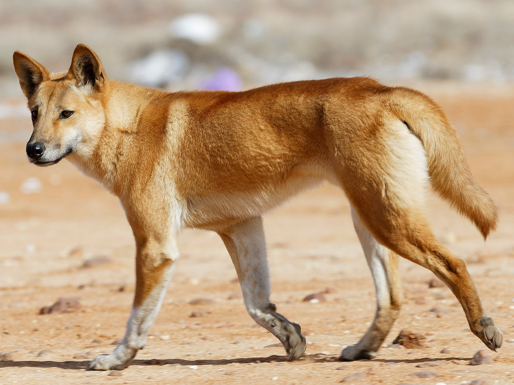

### 农业发展的挑战
- 澳大利亚是世界上**最干旱和土壤最贫瘠**的大陆，农业发展面临**巨大的自然环境挑战**
- **ENSO现象**导致的无法预测的**极端气候变化**，如**长期干旱和洪水**，增加了农业生产的风险
- 缺乏**可以驯化的本地作物**，即便是现代欧洲植物遗传学家也未能从澳大利亚的野生植物中培育出除**澳洲坚果**外的其他作物

### 土著的适应性管理和食物获取策略
- 土著采用“**火耕农业**”管理土地，通过**有意识地焚烧大面积土地**来促进袋鼠等猎物和可食用植物的生长
- 土著居民利用**丰富多样的野生食物来源**，如薯蓣、芋艿、竹芋和黍子等，来降低对**单一食物来源**的依赖和风险
- 特定地区发展了**强化的食物采集活动**，如东南部的**鳗鲡养殖**和东部的**黍子收获**，显示了**朝向粮食生产方向的演进**
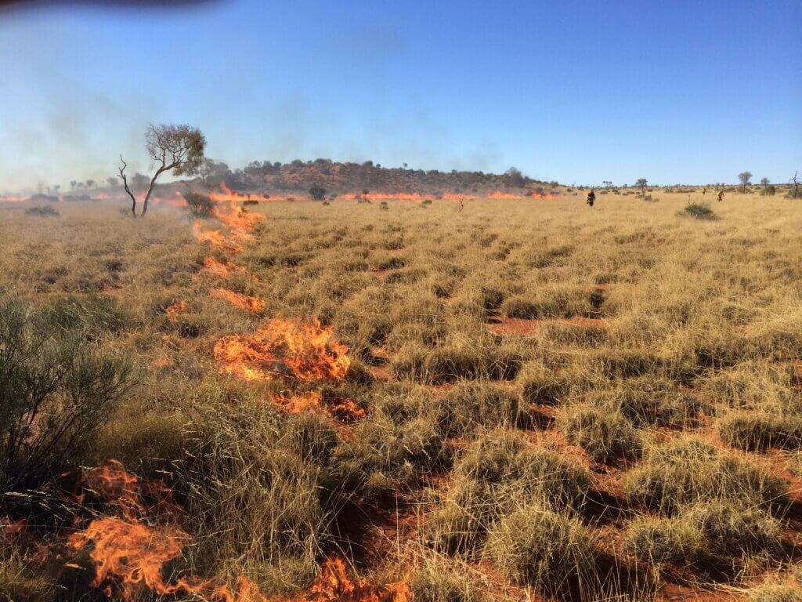

### 技术发展与文化适应
- 土著发明了**新型工具**，如经过打磨的短柄石斧和小型石片，以提高效率和适应环境的变化
- 随着时间的推移，**贝壳渔钩**的出现表明了土著社会**对海洋资源利用**的增强和技术的进步
- 这些适应性的技术和管理策略表明，尽管面临环境和资源的重大挑战，澳大利亚土著成功地在**极端和多变的环境**中生存和繁衍
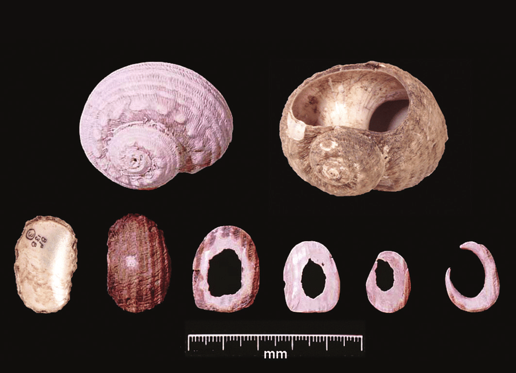

## 澳大利亚土著文化的隔离与发展
### 澳大利亚土著的生活方式
- 澳大利亚土著主要以**狩猎采集**为生，未发展出粮食生产者社会中常见的**金属工具、文字和复杂政治结构**
- 干旱、贫瘠的土壤和不可预测的气候**限制了狩猎采集人口的增长**，导致澳大利亚**潜在的发明者和试验性社会**较少
- 澳大利亚由**人口稀少的沙漠和生态**“孤岛”组成，限制了地区间的相互影响和文化技术的传播

### 土著社会的技术和文化隔离
- 土著澳大利亚由于**地理和生态隔离**，出现了**技术退步现象**，如**回飞镖**在某些地区被弃置，缺乏对**有壳水生动物**的利用
- 尽管与印度尼西亚和新几内亚存在**贸易往来**，但澳大利亚未能采纳这些邻近地区的农业技术、家畜饲养和其他文化特点
- **塔斯马尼亚**和澳大利亚的隔离导致了**技术和文化的损失**，反映了与世隔绝和人口过少对技术发展与维持的**负面影响**
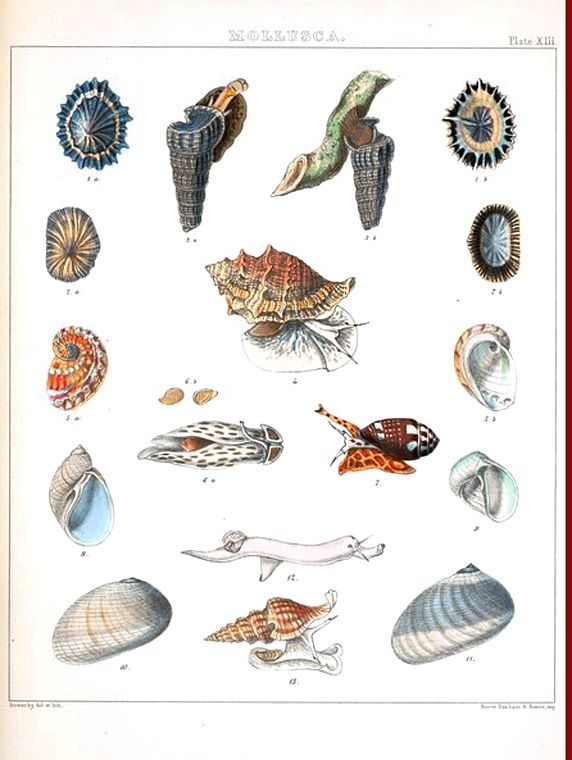

### 新几内亚与澳大利亚的文化接触及其局限性
- 即便澳大利亚与新几内亚通过**托雷斯海峡的岛屿链条**有着间接联系，但新几内亚的农业和社会复杂度并未有效传播至澳大利亚
- 贸易和文化交流主要限于**约克角半岛和托雷斯海峡岛屿**之间，但新几内亚的影响**被削弱**，未能触及澳大利亚的**内陆或东南部高原**
- **地理隔离和生态环境差异**限制了新几内亚文化特点，如**农业和弓箭的传播**，导致澳大利亚保持了其**狩猎采集的生活方式**
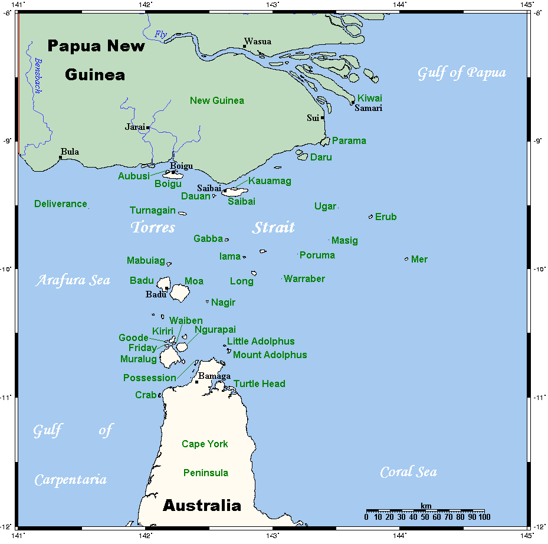

### 对澳大利亚土著顽固不化的考察
- 澳大利亚土著与外界的**有限接触**未能改变其基本的生活方式，反映了**地理条件**对文化和技术传播的重要影响
- 即使是在与外界有贸易往来的地区，澳大利亚土著也选择维持其狩猎采集的生活方式，**抵制采纳**外来的农业技术和社会结构
- 澳大利亚土著社会的发展模式和文化选择展示了人类社会如何受到其地理环境的**深刻影响**，以及文化隔离状态下的适应性和创新的局限性

## 欧洲人对新几内亚和澳大利亚的殖民
### 新几内亚的殖民历史
- 1526年**葡萄牙航海家**首次“发现”新几内亚
- 1828年**荷兰**宣称对新几内亚**西半部的主权**，1884年**英国和德国瓜分东半部**
- 到1960年，**欧洲政府**已对新几内亚大部分地区建立政治控制
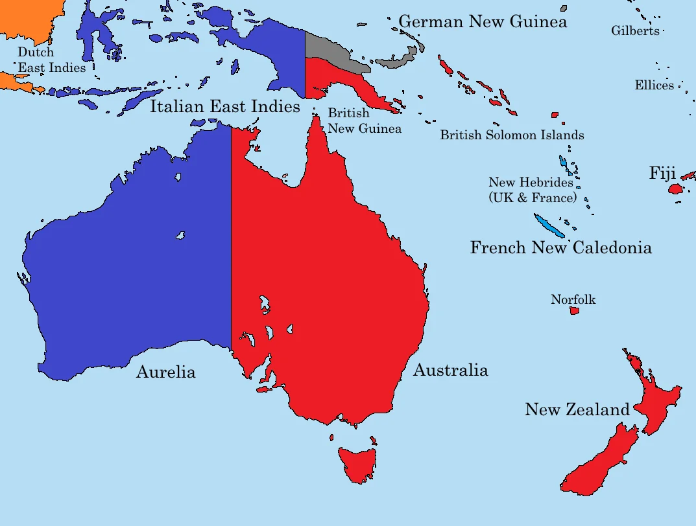

### 欧洲人殖民的技术优势
- 欧洲人拥有远洋船只、罗盘、书写系统、印刷机、政治机构和枪炮
- 这些**技术和制度优势**帮助他们前往并控制新几内亚

### 殖民的环境挑战与局限
- **疟疾和其他热带疾病**阻碍了欧洲人在**新几内亚低地地区**的定居尝试
- 即使在**现代医药条件**下，欧洲人也面临由于**热带疾病引起的健康问题**

### 澳大利亚的殖民经历
- 欧洲人拥有的**技术和制度优势**同样适用于**对澳大利亚的殖民**
- 澳大利亚的某些地区适于欧洲人**发展粮食生产**，特别是在**引进非本地作物和牲口后**

### 土著人口的减少与社会变迁
- 欧洲人的**枪支、病菌和殖民政策**对澳大利亚土著产生了**毁灭性影响**
- 澳大利亚土著人口从欧洲殖民前的**估计30万人**下降到1921年的最低点**6万人**
- 现代澳大利亚由**非土著人口主导**，土著社会成为**社会最底层**

### 殖民影响的对比
- **新几内亚**由于疟疾和其他**热带疾病**的自然屏障，欧洲殖民者**数量有限**
- 澳大利亚**没有类似的自然屏障**，更适宜于欧洲农业，导致土著社会的快速崩溃和欧洲人的广泛定居
- 澳大利亚土著和新几内亚人的**命运差异**，根本原因在于**环境适宜性**和**欧洲殖民者使用的方法**

## 澳大利亚土著与英国殖民者的文化对比
### 澳大利亚土著的生活方式与创造
- 澳大利亚土著在**40000多年的历史**中一直过着**四处流浪的狩猎采集生活**
- 他们所创造的社会并非有文字、从事粮食生产的**工业民主社会**
- 土著社会的形态直接受到**澳大利亚环境特点**的影响

### 英国殖民者的技术与社会结构引入
- **英国白人殖民者**并未在澳大利亚创造出一个有文字的、从事粮食生产的**工业民主**，而是将这些元素**从澳大利亚以外引进**
- 引进的元素包括家畜、作物（除澳洲坚果外）、冶金知识、蒸汽机、枪炮、字母、政治机构以及病菌
- 这些都是在**欧亚大陆环境**下10000年发展的产物，由于**地理的偶然因素**，1788年的殖民者继承了这些成分

### 欧洲人在澳大利亚的生存挑战
- 欧洲人没有学会在**缺乏**他们所继承的欧亚大陆技术的条件下如何在澳大利亚或新几内亚生存
- 罗伯特·伯克和威廉·威尔斯虽**聪明**但未能适应澳大利亚土著生活的**沙漠环境**
- 在澳大利亚创造社会的真正人是**澳大利亚的土著**，他们的社会形态是由澳大利亚的环境特点直接造成的
