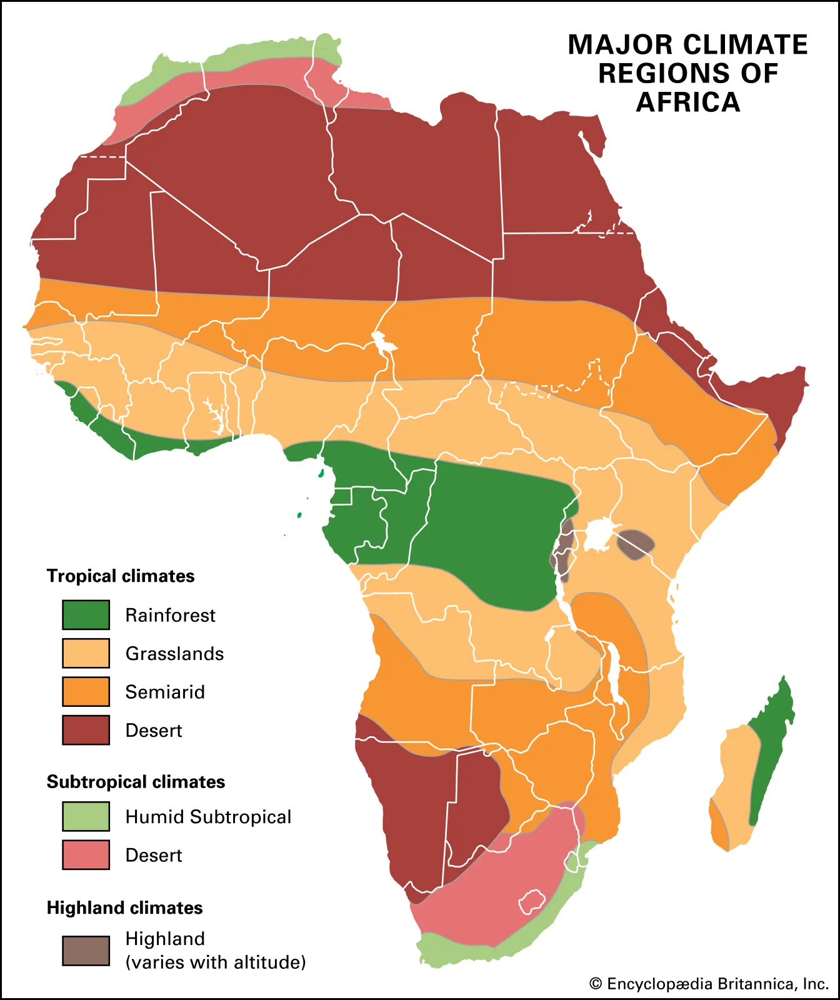
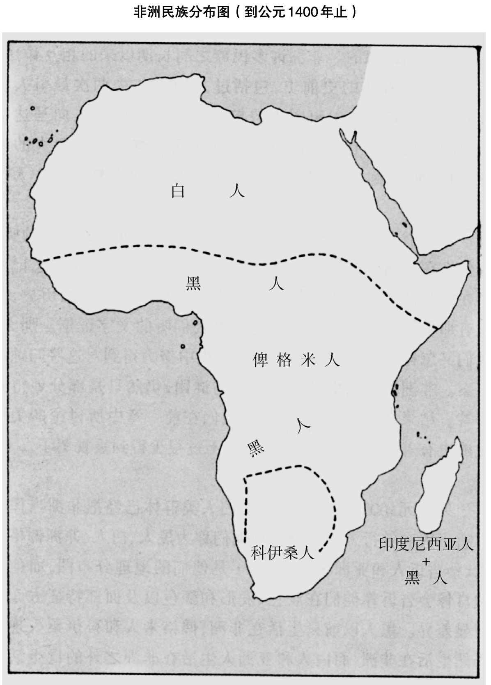
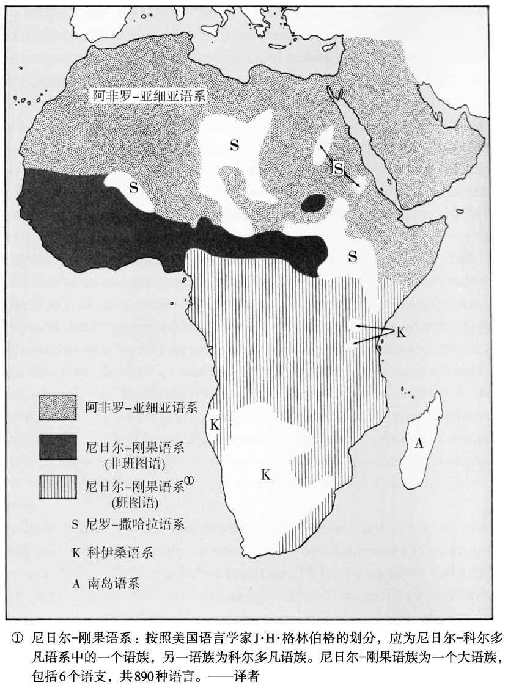
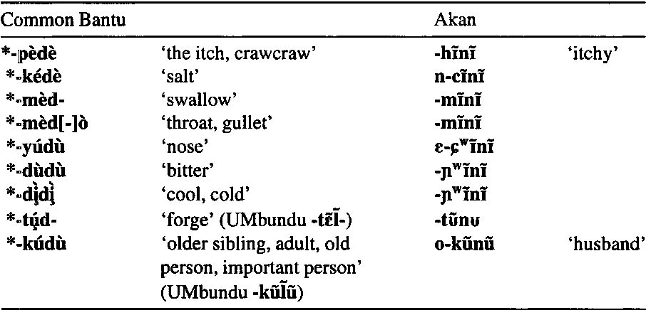
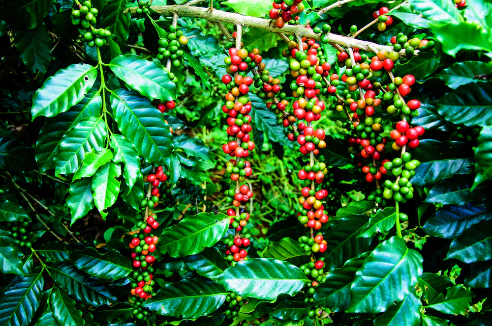
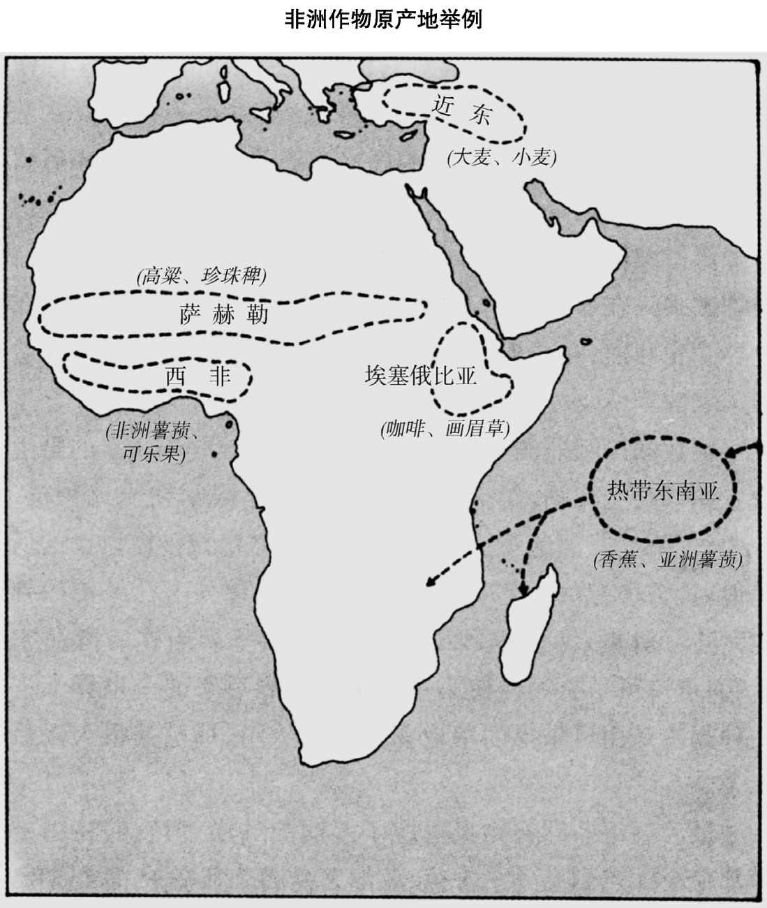
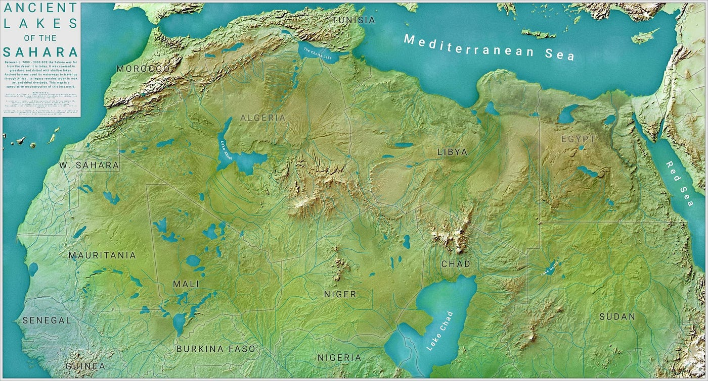
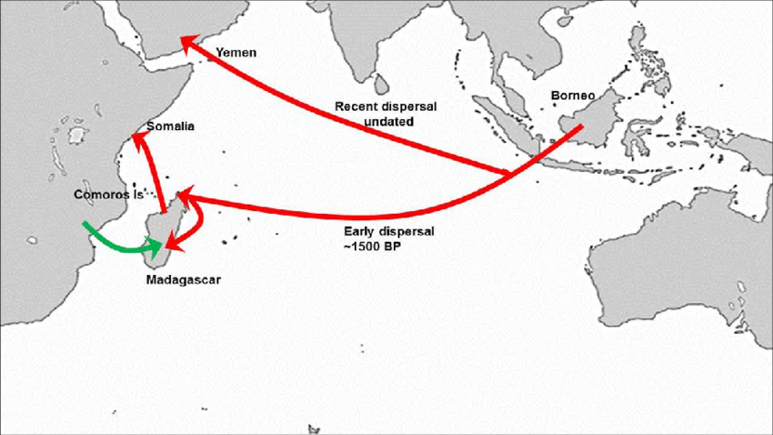
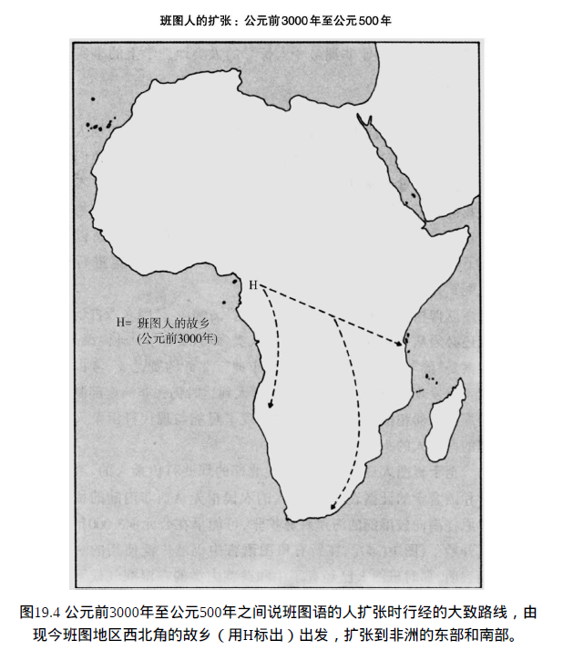

# 非洲
## 非洲的多样性与史前史
### 非洲的首次印象
- 在纳米比亚首都温得和克见识到**多种族的共存**，包括赫雷罗族、奥万博族、白人和纳马族人
- 被称作“**戈林街**”的街道实际上是为了纪念赫尔曼·戈林的父亲**亨利希·戈林**，一位与非洲有深刻联系的**欧洲殖民历史人物**
- **纳米比亚**努力克服殖民影响，构建**多种族和谐社会**，体现非洲过去与现在的复杂关系

### 非洲的多样化人种
- 直到几千年前，**现代黑非洲**大部分地区可能由**完全不同的民族占据**
- 非洲是唯一一个**地跨南北温带**的大陆，拥有**丰富的地理多样性**，包括沙漠、热带雨林和高山
- 人类大约在**700万年前**于非洲发源，非洲是**所有现代智人的出生地**

### 非洲的语言和民族迁移历史
- 非洲有**四分之一的世界语言**，表明其**复杂的民族和文化历史**
- 包括班图人的扩张和印度尼西亚人向马达加斯加的移民在内的**两次主要人口大迁移**，对非洲历史产生了**深远影响**
- 非洲的史前史揭示了**人类早期社会的相互作用和发展**，尽管这段历史大多**未被文字记录**

### 现代认识与历史真相
- 大多数美国人和欧洲人将非洲**与黑人同义**，忽视了非洲人种的多样性和复杂的历史
- **五个人种**在非洲的分布反映了**古老的迁徙和适应历史**，其中黑人成为了**主要群体**
- 非洲的**史前史**，尽管**大部分未被记录**，对理解今天的非洲社会结构和人种分布至关重要

## 非洲人种的分布与历史
### 五大人种在非洲的分布
- **黑人**：占据**撒哈拉以南的广大地区**，包括东非和西非沿海
- **白人**：主要分布在**非洲北部**，包括埃及、利比亚和摩洛哥等地区
- **俾格米人**：身材矮小，分布在**中非雨林**，以狩猎采集为生
- **科伊桑人**：原分布在**非洲南部**，现在人数**大大减少**，主要由于欧洲殖民的影响
- **亚洲人**：指的是在**马达加斯加**与非洲黑人**混居的人群**，他们的祖先可能来自热带东南亚

### 人种的多样性与混合
- 俾格米人和科伊桑人代表**非洲的多样性**，与通常所认知的黑人**有显著区别**
- 马达加斯加的居民是非洲黑人和热带东南亚人的**混合体**，这一事实揭示了**古代人类迁移的复杂性**
- 即使是黑人和白人这样的大类别，内部也**存在极大的多样性**，说明人种的分类是**随意的且具有局限性**

### 语言和文化的传播
- 马达加斯加岛上的居民说的是**南岛语系的语言**，表明了古代**热带东南亚人**向西跨越印度洋**到达非洲**的历史
- 南岛语言的传播与农业、航海技术等文化特征的传播**密切相关**，展现了人类历史上的**文化交流和融合**
- 黑人、俾格米人和科伊桑人的分布变化反映了非洲**内部的人口迁移和文化交替过程**

### 对“人种”概念的反思
- 尽管人种的分类有其**简便性**，但它忽略了人类内部的**丰富多样性**和复杂的**迁移历史**
- 现代科学研究表明，所有人类群体之间的**基因交流**使得严格的人种分类变得更加困难
- 非洲的例子特别说明了如何在认识到人种多样性的同时，也要注意到这些分类的历史、社会和文化背景

## 非洲语言的线索与人种迁移
### 语言与人种的对应关系
- 非洲的1500种语言被划分为**5个主要语系**，这些语系与特定的人种群体有较大的对应关系
- **阿非罗-亚细亚语系**主要由被归类为**白人或黑人的人群使用**，**闪语族**作为其中的一部分，主要分布在**非洲和近东**
- **尼罗-撒哈拉语**和**尼日尔-刚果语**主要由**黑人**使用，**科伊桑语**由**科伊桑人**使用，而**南岛语系**与**印度尼西亚人**相关

### 语言的地理分布与人类迁移
- 俾格米人**没有自己独特的语言**，而是采用了**邻近黑人农民的语言**，这反映了他们**被农业社会所吞并的历史**
- **科伊桑语**的分布表明**科伊桑人曾经占据更广泛的区域**，但随着时间的推移，他们的语言和文化**被其他族群所淹没**
- **班图语**作为尼日尔-刚果语系的一支，其分布和相似性表明班图人从西非喀麦隆和尼日利亚地区**向南和东扩张**

### 班图人扩张的影响
- 语言学证据表明**班图人的扩张**导致**了俾格米人和科伊桑人原有语言和文化的消失**，班图语的扩散覆盖了**非洲中部和南部的广大地区**
- 班图人的迁移和扩张过程中，“**淹没**”了原有的俾格米人和科伊桑人等群体，改变了非洲的人种和文化格局
- 班图人的成功扩张归因于他们**拥有的有利条件**，如**农业技术**，以及**与原住民的混合**，促进了他们在非洲的广泛分布

## 非洲粮食生产与班图人的扩张
### 非洲的粮食生产基础
- **北非的粮食生产**基于**地中海型气候适应的作物**，雨量集中在冬季的几个月，如小麦、大麦，这些作物起源于**新月沃地**，为古埃及文明提供了**粮食基础**
- **萨赫勒地带**和**埃塞俄比亚**的作物适应**夏季多雨气候**，包括高粱、珍珠稗（萨赫勒地带）和咖啡、象腿蕉（埃塞俄比亚）；北非的作物难以传播过来
- **西非湿润气候**下的作物，如非洲稻和油棕，部分作物已**传播到非洲撒哈拉沙漠以南**的其他地区及其他大陆

### 热带东南亚作物的引入
- 香蕉、亚洲薯蓣、芋艿和非洲水稻这些源自**热带东南亚**的作物在15世纪初已广泛种植于**非洲撒哈拉沙漠以南地区**
- 这些作物的引入提供了关于**非洲与亚洲古老联系**的证据，可能通过印度尼西亚人的迁移和交流带入非洲
- 科伊桑人和俾格米人之所以**未能发展出农业**，不是由于他们没有农民的资格，而仅仅是由于碰巧非洲南部的野生植物**大都不适于驯化**；而其他地区传播的植物**依然太少**

### 非洲家畜的驯化和引入
- 唯一确定**在非洲驯化的动物**是**珍珠鸡**，而牛、驴、猪、狗、家猫等可能在北非和西南亚**独立驯化**
- 非洲丰富的野生哺乳动物种类中，**没有一种成为重要的家畜**，这与非洲南部**缺乏本地驯化植物**相似，限制了**粮食生产和人口密度的增长**

### 班图人扩张的背景
- 非洲本地作物的分布和驯化动物的缺乏，结合考古和语言证据，揭示了**班图人利用农业优势“淹没”俾格米人和科伊桑人的过程**
- 班图人的成功扩张归因于他们**继承的农业技术和作物**，这使他们在与原住民的竞争中占据了优势
- 非洲的粮食生产模式和班图人的迁移证明了**环境资源的分布对人类历史发展的深远影响**

## 非洲农业与畜牧业的考古与语言学证据
### 考古学证据揭示的农业起源
- **撒哈拉沙漠**在公元前9000年至公元前4000年期间**相对湿润**，期间撒哈拉人开始**养牛和制陶**，后续**养绵羊、山羊**，可能开始**驯化高粱和黍**
- 撒哈拉的放牧业年代**早于**埃及已知的粮食生产年代，埃及粮食生产的引进标志为**公元前5200年**引进的一整套**西南亚冬季作物和牲畜**
- 粮食生产亦在**西非和埃塞俄比亚**出现，**公元前2500年**左右，牧牛人从埃塞俄比亚进入肯尼亚北部

### 语言学证据的洞察
- 现代非洲语言中用于**指称驯化动植物的词汇**可以**揭示驯化或引进的年代**
- 尼日利亚南部的语言中作物名称的比较显示，最早的作物名称在所有这些语言中都**十分相似**，证明它们是**原产西非并最早在那里驯化的**
- 来自**印度尼西亚**的作物，如香蕉和亚洲薯蓣，其名称在**尼日利亚南部的某些语言中**才保持一致，表明它们是在这些语言**分化后引进的**
- 来自新大陆的作物，如**玉米和花生**，其名称在语族内**完全不一致**，反映了它们是在**横渡大西洋的航运开始后**引进非洲的

### 语言学证据对非洲早期农业的启示
- 撒哈拉**驯化高粱和黍的人**所说的语言可能是现代**尼罗-撒哈拉语的祖代语言**
- **西非湿润地区作物**的最早驯化者所说的语言是现代**尼日尔-刚果诸语言的祖代语言**
- **阿非罗-亚细亚祖代语言**的说话者可能驯化过**埃塞俄比亚的本地作物**，并把**新月沃地的作物引进北非**
- 现代非洲本土的4个语系的幸存归因于**历史偶然因素**，即其说话者的祖先碰巧生活在能够获得作物和家畜的**适宜地点**

## 非洲史前人口大迁移：班图人扩张与南岛人殖民
### 南岛人在马达加斯加的殖民历史
- **南岛人**最迟于**公元800年**，可能早在**公元300年**已到达马达加斯加
- 他们碰到并开始**消灭马达加斯加独特的动物种群**，如大隆鸟、狐猴和矮河马
- 马达加斯加的**最早人类定居点**出土了**铁器、牲畜和作物残留**，表明这些殖民者是**经过充分准备的探险队**
- 《**欧力斯里洋航行记**》提供了南岛人可能通过**已存在的印度与东非贸易路线**达到马达加斯加的线索
- 马达加斯加语言是**南岛语**，但从肯尼亚沿海的**班图语**中借用了一些单词，反映了**南岛人与东非人的交融**

### 班图人的扩张考古与语言学证据
- 班图人**从西非内陆向南向较湿润的海岸森林**扩张，早在**公元前3000年**开始
- 他们的扩张导致“淹没”了**从事狩猎和采集的俾格米人**，把他们一步步**挤进森林**
- **公元前1000年**后，班图人**从森林东缘走出**，进入**东非**，开始与当地的农民和牧人竞争
- 班图人的扩张受益于**适应湿润气候的作物和铁器**，使他们成为在当时非洲赤道以南地区所向披靡的力量
- 科伊桑族群虽未被完全消灭，但在非洲南部的一些地区**被班图农民所取代**，留下的遗产包括**独特的吸气音**和班图族群中**科伊桑人的外貌特征**

### 非洲史前人口迁移的影响
- 班图人的扩张和南岛人的殖民是非洲史前**两次重要的人口大迁移**，深刻影响了非洲的人口分布和文化景观
- 这些迁移的考古和语言学证据揭示了**非洲与亚洲之间的古老联系**，以及**非洲内部不同人群间的动态互动**
- 班图人的扩张和南岛人的殖民证明了环境因素、技术创新和农业发展对于古代人类社会发展路径的重要影响

## 非洲史前史与欧洲殖民的历史轨迹
### 欧洲人在非洲的殖民优势
- 欧洲人进入非洲时拥有技术、普及的文化和政治组织的**三重优势**
- 1498年**法斯科·达·伽马**抵达**东非海岸**，展示了欧洲人的**军事和技术优势**
- 这些优势源自**粮食生产的发展**，但非洲撒哈拉沙漠以南的粮食生产与欧亚大陆相比**被延误**

### 非洲的自然和地理条件
- 非洲缺少**可驯化的本地动植物物种**，限制了早期农业的发展
- 非洲**南北轴向的地理特征**妨碍了**作物和牲畜的传播**，与欧亚大陆东西轴向的地理特征形成对比
- 欧亚大陆拥有**更多的可驯化动植物品种**，更大的面积和人口，促进了**更快的技术和社会发展**

### 欧洲与非洲历史发展的关键因素
- 家畜主要来自**欧亚大陆**，直到几千年后**才到达非洲撒哈拉沙漠以南地区**
- 非洲的**主要粮食生产地区**—萨赫勒地带、埃塞俄比亚和西非—品种数量上**比欧亚大陆少**
- 欧洲人的殖民**不是因为种族差异**，而是地理学和生物地理学的**偶然因素**所致

### 技术和文化传播的地理障碍
- 牲畜和作物沿南北轴线在非洲的传播受到**严重阻碍**，如**采采蝇导致的牲畜疾病**
- **陶器和文字的传播**在非洲也受到南北轴线的限制，与欧亚大陆相比**传播速度缓**