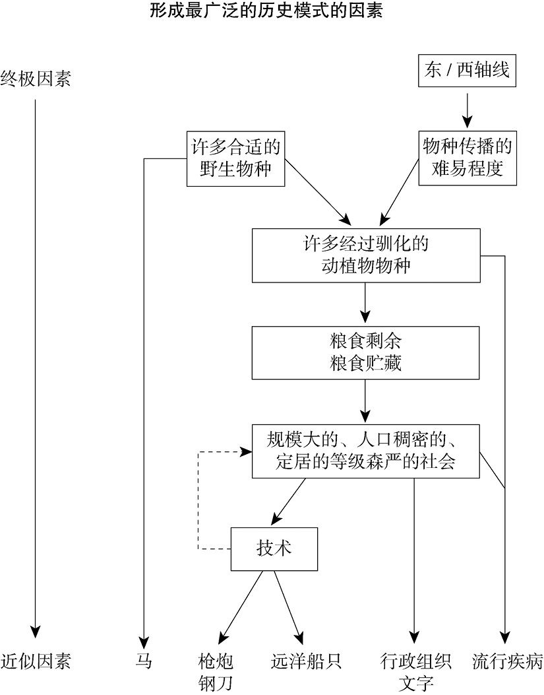
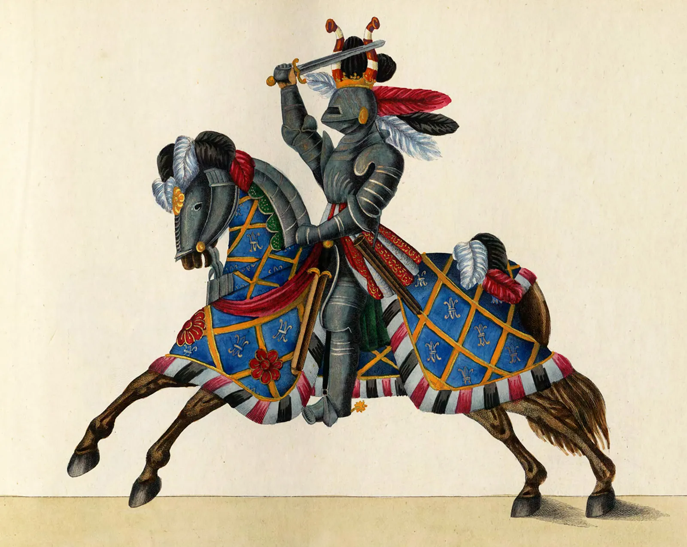

# 农民的力量
* 自从现代人的祖先在大约700万年前从现在的类人猿的祖先分化出后，地球上的所有人类大部分时间都是靠**猎捕野兽**和**采集野生植物**为生，只是在过去的11000年中，有些民族才转向所谓的**粮食生产**
* 今天，地球上的大多数人吃他们自己生产的粮食或别人为他们生产的粮食。按照当前的变化速度，在今后10年内，剩下来的少数以狩猎采集为生的人群将会放弃他们的生活方式，发生解体或逐渐消失，从而结束我们几百万年来专以狩猎采集为生的生活方式
* 不同部族在史前的**不同时期**学会了粮食生产，有些部族，如澳大利亚土著，却**从来没有学会**粮食生产；在那些学会粮食生产的部族中，有些（例如古代的中国人）是靠自己**独立发展**粮食生产的，而另一些（包括古代埃及人）则是**从邻近部族学会**粮食生产的
* 本章将查考一些主要的**因果关系**，因为粮食生产正是通过这种关系带来了所有使皮萨罗俘虏阿塔瓦尔帕的有利条件

* 第一个因果关系是**最直接**的因果关系：能够获得更多的可消耗的卡路里就意味着会有更多的**人**
  * 在野生的动植物物种中，只有很少一部分可供人类食用，或值得猎捕或采集；陆地上大多数生物量（活的生物物质）都是以**木头和叶子**的形态而存在的，而这些东西大多数我们都不能消化
  * 通过对我们能够吃的那几种动植物的选择、饲养和种植，使它们构成每英亩土地上的生物量的90%而不是0.1%，我们就能从每英亩土地获得多得多的**来自食物的卡路里**；结果，每英亩土地就能养活多得多的**牧人和农民**——一般要比以狩猎采集为生的人多10倍到100倍
  * 在饲养驯化动物的人类社会中，牲畜在**4个不同的方面**养活了更多的人：提供肉类、奶脂、肥料以及拉犁

    * 最直接的是，家畜代替野生猎物而成为**社会主要的动物蛋白来源**
    * 驯化的大型哺乳动物还在两个方面和驯化的植物**相互作用**，以增加农作物的产量，首先，现代的园林工人或农民仍然根据经验知道，用动物的粪便做**肥料**可以提高作物的产量；此外，最大的驯化哺乳动物可以用来**拉犁**，从而使人们可以去耕种以前如用来耕种则代价太高的土地
  * 所有这些都是由于动植物驯化比狩猎采集的生活方式能生产出更多的食物从而导致更稠密人口的**直接因素**；另一个比较间接的因素涉及粮食生产所带来的**定居生活方式**，许多狩猎采集社会里的人经常跑来跑去寻找野生食物，但农民必须留在他们的田地和果园附近，因此而产生的固定居所由于**缩短了生育间隔期**而促使人口变得更稠密起来，许多农业部族的生育间隔期是**两年左右**，为狩猎采集部族的一半
* 定居生活的另一个结果是人们可以把多余的粮食**贮藏**起来，因为如果人们不能留在附近看管贮藏的粮食，那么贮藏就是毫无意义的
  * 贮藏的粮食对于养活不生产粮食的专门人材是必不可少的，这种专门人才有两类：**国王**和**官员**
  * 通过税收建立剩余粮食储备，除了养活国王和官员外，还能养活其他专职的**专门人材**；与征服战争关系最直接的是，剩余粮食储备可以用来养活**职业军人**
* 农作物和家畜还有其他用途，例如帮我们**保暖**和向我们提供**有价值的材料**
  * 农作物和家畜生产出的**天然纤维**，可以用来做衣服、毯子、网和绳子；大多数重要的植物驯化中心不但培育**粮食作物**，也培育**纤维作物**——主要有棉花、亚麻（亚麻布的原料）和大麻

  * 有几种驯化动物则出产**动物纤维**——特别是绵羊、山羊、美洲驼和羊驼的毛以及蚕丝；**驯化动物的骨头**是冶金术发明前新石器时代各部族用作人工制品的重要原料，**牛皮**被用来制革

  * **驯化的大型哺乳动物**在19世纪铁路发展起来之前成为我们主要的陆路运输手段，从而进一步使人类社会发生了**革命性的剧变**；在人类历史上第一次有可能迅速地不但把人而且也把大量沉重的货物从陆路运到很远的地方去
  * 动植物驯化对征服战争的**最直接的贡献**是由欧亚大陆的**马**作出的，它们在军事上的作用，使它成了那个大陆上古代战争中的吉普车和谢尔曼坦克

  * 甚至在早得多的时候（公元前4000年左右），尽管那时人们还仍然骑在光马背上，但马可能已成为促使操**印欧语**的人从乌克兰向西扩张的必不可少的军事要素；这些语言最终取代了除**巴斯克语**外的所有早期的欧洲语言
  * 再往后，在**马鞍和马镫**发明后，马使来自亚洲大草原的**匈奴人**和一波接一波的其他民族对罗马帝国和后继国家造成了威胁，最后以**蒙古人**于公元13世纪和14世纪征服亚洲和俄罗斯的许多地方而达到高潮；只是由于在**第一次世界大战**中采用了卡车和坦克，马的作用才最后被取代，而不再是战争中主要的突击手段和快速运输的工具
* 在征服战争中同样重要的是在驯养动物的社会中演化的**病菌**；像天花、麻疹和流行性感冒这类**传染病**作为人类的专化病菌出现了，它们原是动物所感染的十分类似的祖代病菌由于突变而**衍生**出来的
  * 当有部分免疫力的人与以前从来没有接触过这种病菌的人接触时，**流行病**于是产生了，99%的以前没有接触过这种病菌的人因之而**丧命**
  