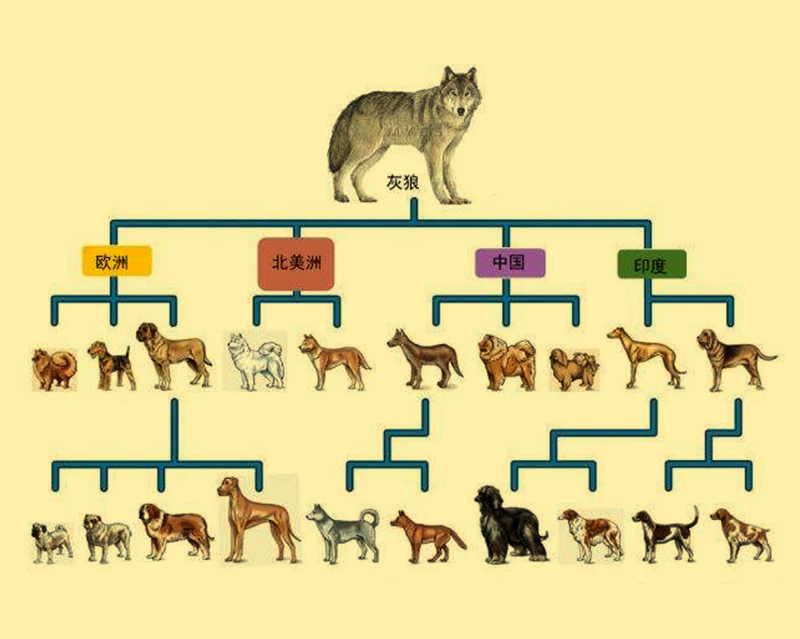
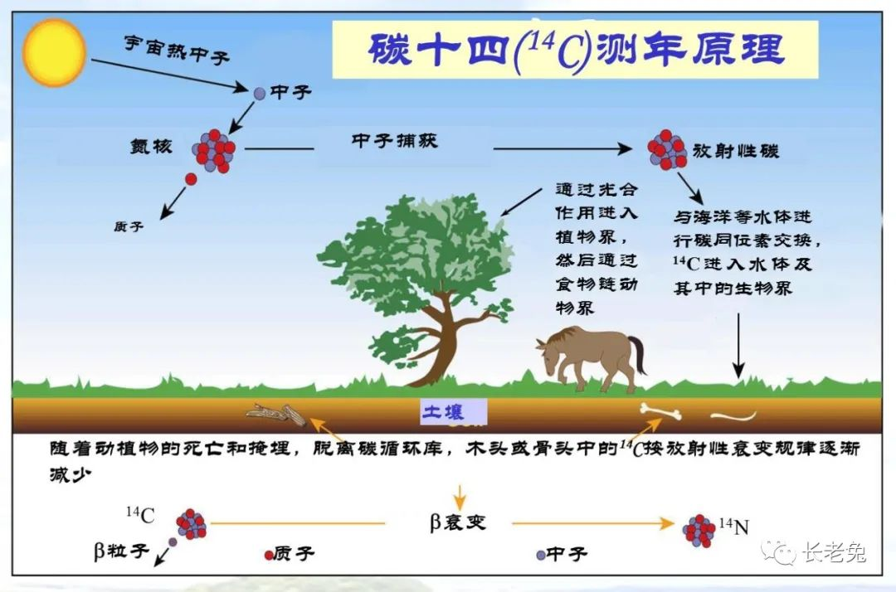
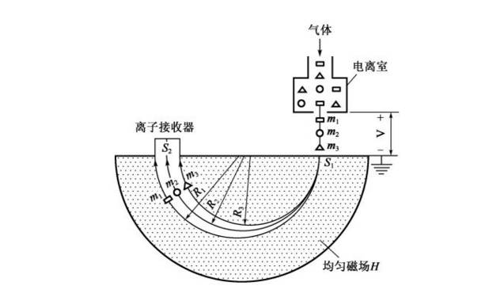
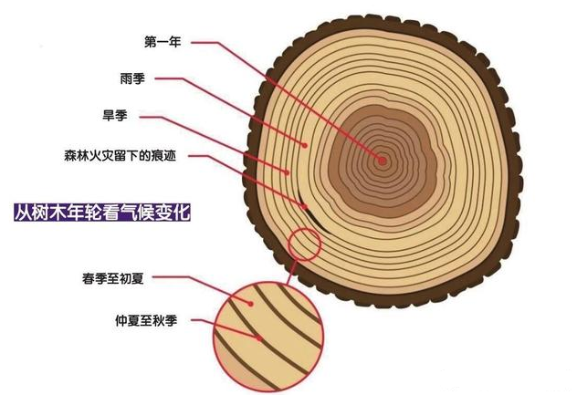
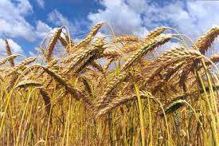
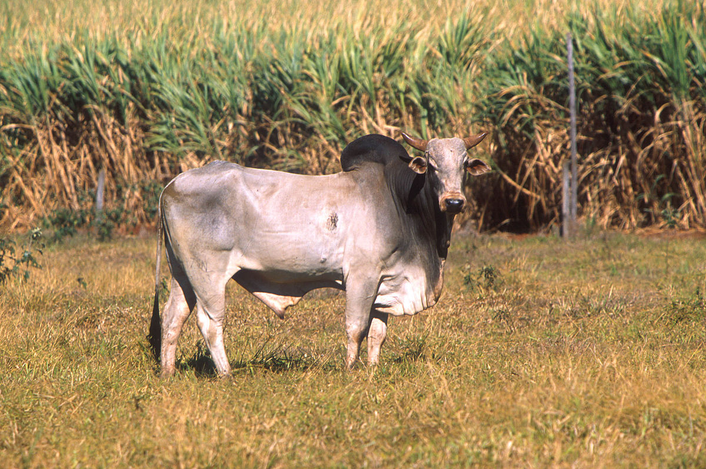
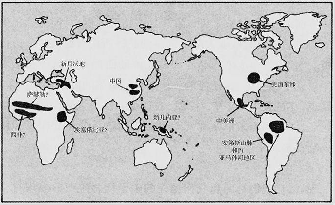
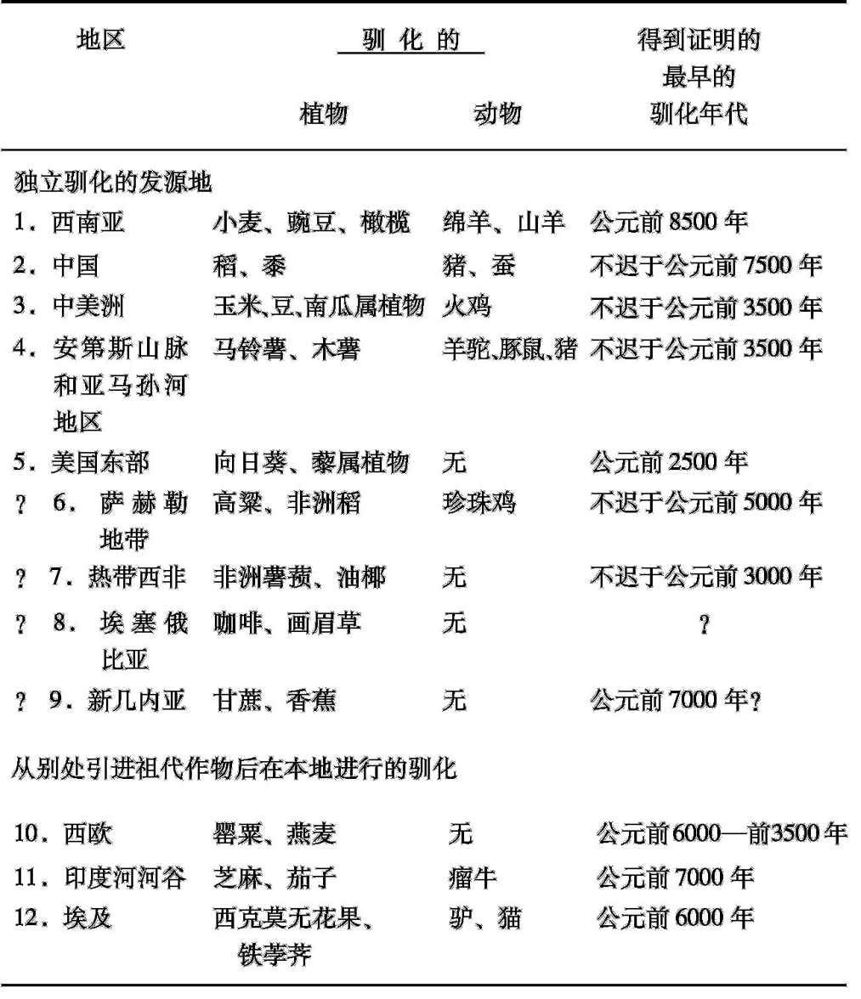

# 历史上的穷与富
## 一系列问题
* 粮食生产在地球上的广大地区**不曾出现过**，这并不令人奇怪，由于**生态原因**，粮食生产在这些地区现在仍然难以出现或不可能出现
  * 例如，在史前期的**北美洲北极地区**，无论农业或畜牧业都没有出现过，而在**欧亚大陆北极地区**出现的唯一粮食生产要素是放牧驯鹿

  * 在远离灌溉水源的**沙漠地区**也不可能自发地出现粮食生产，如澳大利亚中部和美国西部的一些地方
* 迫切需要说明的，反倒是何以在某些生态条件**十分适宜的地区**在现代以前一直未能出现粮食生产，而在今天却成了世界上一些最富足的**农牧中心**
  * 如果我们对粮食生产追本溯源，它的**最早发源地**会再次使我们感到惊异，这些地方已完全不是现代粮仓，它们包括一些在今天被列为有点**干旱或生态退化**的地区：伊拉克和伊朗、墨西哥、安第斯山脉、中国的部分地区以及非洲的萨赫勒地带

* 关于粮食生产赖以出现的方式方面的**地理差异**也同样令人费解，在有些地方，它是**独立发展**起来的，这是当地人驯化当地动植物的结果；而在其他大多数地方，则是把别的地方已经驯化的作物和牲口**加以引进**
  * 既然这些原来不是独立发展粮食生产的地区在**引进驯化动植物**后立刻变得**适宜于史前的粮食生产**，那么这些地区的各个族群为什么没能在没有外来帮助的情况下，通过驯化当地的动植物而成为农民和牧人呢？
  * 在的确独立出现粮食生产的这些地区中，为什么出现的**时间差别**如此之大——例如，在东亚要比在美国东部早几千年，而在澳大利亚东部却又从来没有出现过？
## 年代测定法
* 在我们能够指望回答这些问题之前，我们需要弄清楚**怎样去确定**粮食生产的发源地及其出现的时间，以及某一特定作物或动物最早得到驯化的地点和时间
  * 最明确的证据来自对一些考古遗址中出土的**动植物残骸**所作的鉴定；大多数驯化的动植物物种在**形态上**同它们的野生祖先是**不同的**：例如，驯化的牛和羊形体较小，驯化的鸡和苹果形体较大，驯化的豌豆种皮较薄也较光滑，驯化的山羊角长成螺旋形而不是短弯刀状

  * 因此，如果能在一处**有年代可考的考古遗址**认出**驯化动植物**的残骸，那就是有了强有力的证据，说明彼时彼地已有了粮食生产，而如果在某个遗址仅仅发现了**野生物种**，那就不能证明已有了粮食生产，而只能证明与狩猎采集生活相吻合
* 考古学家们用**碳-14年代测定法**来测定遗址中的含碳物质，从而确定粮食生产的年代
  * 碳是生命的无所不在的基础材料，它的成分中含有很少量的**放射性碳-14**，而碳-14会衰变为非放射性同位素**氮-14**；**宇宙射线**不断地在大气中生成碳-14
  * 植物吸收大气中的碳，其中碳-14和普遍存在的**同位素碳-12**保持着一种已知的**几乎不变的比例**（约1与100万之比）；植物中的碳接下去构成了吃这些植物的食草动物的**躯体**，也构成了吃这些食草动物的食肉动物的躯体
  * 不过，这些植物或动物一旦死去，它们体内碳-14含量的一半每隔5700年**衰变**为碳-12，直到大约**4万年后**，碳-14含量变得很低而很难测出，也很难把它同受到少量的含有碳-14的现代材料的污染区别开来；因此，从考古遗址出土的材料的年代可以根据该材料内的**碳-14与碳-12的比例**计算出来

* 放射性碳受到许多技术问题的困扰，其中**两个问题**值得在这里提一提
  * 一个问题是：碳-14年代测定法在20世纪80年代前需要**比较多的碳**（几克），比小小的种子或骨头里碳的含量多得多；因此，科学家们常常不得不依靠测定在同一遗址附近找到的**材料**的年代，而这个材料被认为是与残存的食物“有联系”的——通常是**烧过的木炭**

  * 但是，考古遗址并不总是把所有同日弃置的材料巧妙密封起来的时间容器；在**不同时间**弃置的材料可能会**混杂在一起**，因为蠕虫、啮齿目动物和其他作用力把地层给搅乱了
  * 今天，考古学家们越来越多地用一种叫做**加速质谱分析法**的新技术来解决这个问题，这种新技术可以使碳-14年代测定法测得**极小的样本**的年代，从而使人们可以直接地测得一粒小小的种子、一块小小的骨片或其他食物残渣的年代

  * 第二个问题是：大气中碳-14与碳-12的比例事实上并不是严格不变的，而是随着时间**上下波动**的，因此，从某种不变的比例这种假定出发去计算碳-14年代测定法测得的年代经常会产生一些**小小的错误**
  * 确定关于过去每个年代错误的程度，原则上可以借助**古老树木**记录下的**年轮**，因为只要数一数这些年轮，就可得到每个年轮在过去的**绝对日历年代**，然后再对用这种方法测定年代的木炭样本加以分析，来确定其中碳-14与碳-12的比例

  * 考古学家们常常把经过校正的和未经过校正的年代加以区分，其方法就是对前者用**大写英文字母**来写，对后者用**小写英文字母**来写（例如，分别为3000B.C.和3000b.c.）；然而，考古文献在这方面可能很混乱，因为许多书和论文在报告未经校正的年代时都写作B.C.，而未能提到这些年代实际上是未经校正的
* 一旦人们辨认出驯化动植物的古代遗存并确定其年代，那么人们怎样来确定这个植物或动物是否实际上就是在这遗址**附近驯化**的，而不是在别处驯化，后来才传到这个遗址来的？
  * 一个方法就是研究这个作物或动物的野生祖先的**地理分布图**，并推断出驯化势必发生在**野生祖先出现的地方**
  * 例如，从地中海和埃塞俄比亚往东到印度，传统的农民普遍种植**鹰嘴豆**，今天世界上鹰嘴豆的80%都是**印度**生产的；因此，人们可能会误以为鹰嘴豆是在印度驯化的，但结果表明，鹰嘴豆的野生祖先只出现在**土耳其的东南部**

  * 确定某个作物或动物的驯化地点的第二个方法，是在地图上标出每个地区驯化物种**首次出现的年代**，出现年代最早的地点也许就是驯化最早的地点
  * 例如，已知最早的人工栽培的**二粒小麦**在公元前8500年左右出现在**新月沃地**，其后不久，这个作物逐步向西传播，在公元前6500年左右到达**希腊**，在公元前5000年左右到达**德国**；这些年代表明二粒小麦是在新月沃地驯化的，这一结论可以用以下事实来证明：二粒小麦的**野生祖先的分布**只限于从以色列到伊朗西部和土耳其这一地区

* 然而，在许多情况下，如果同样的植物或动物是在**不同的地点独立驯化**的，那么就会出现一些**复杂的情况**
  * 例如，印度驯化牛中的**瘤牛**品种具有欧亚大陆西部牛的品种所没有的**肉峰**；遗传分析表明，现代印度牛的品种和欧亚大陆西部牛的品种在几十万年前就已**分化**了，比任何地方任何动物驯化的时间都**早得多**

  * 就是说，在过去1万年中，牛就已在印度和欧亚大陆西部**独立地驯化**了，而它们原来都是在几十万年以前就已分化的印度和欧亚大陆西部野牛的**亚种**
## 粮食生产的发展
* 有些地区的粮食生产完全是**独立出现**的，在其他地区的任何作物或动物来到之前，许多**本土作物**（在有些情况下还有动物）就已**驯化**了
  * 目前能够举出详细而又令人信服的证据的这样的地区只有5个：**西南亚**，亦称近东或新月沃地；**中国**；**中美洲**（该词用来指墨西哥的中部和南部以及中美洲的毗连地区）；南美洲的**安第斯山脉地区**，可能还有亚马孙河流域的毗连地区；以及**美国东部**
  * 在这些粮食生产中心中，有些中心或所有中心可能实际上包含了**附近的几个**或多或少独立出现粮食生产的中心，如**中国北方的黄河流域**和**中国南部的长江流域**
* 除了这5个确然无疑出现粮食生产的地区外，另外还有4个地区——**非洲的萨赫勒地带**、**热带西非**、**埃塞俄比亚**和**新几内亚**——是争取这一荣誉称号的候补地区；然而，每一个地区都有某种**不确定之处**

* 在9个独立发展粮食生产的候补地区中，**西南亚**是**植物驯化**（公元前8500年左右）和**动物驯化**（公元前8000年左右）有最早的明确年代的地区；同时对于早期的粮食生产来说，它显然也是具有最多的用碳-14测定的**准确年代**的地区
  * **中国**发展粮食生产的年代几乎同西南亚一样早，而在**美国东部**则显然晚了差不多6000年；就其他6个候补地区而言，最早的得到充分证明的年代没有超过西南亚的年代
* 下一批地区包括一些**至少驯化了两三种本地植物或动物**的地区，但这些地区的粮食生产主要依靠**在别处驯化的作物和动物**
  * 在三四个这样的地区，引进的祖代动植物来自**西南亚**；其中一个地区是**欧洲的西部和中部**，那里的粮食生产是在公元前6000年和前3500年之间随着西南亚作物和动物的引进而出现的，但至少有一种植物（罂粟，可能还有燕麦和其他植物）当时是在**本地驯化**的
  * 还有一个地区，那里由本地对动植物进行驯化，似乎是在引进西南亚的祖代作物后开始的；这个地区就是印度次大陆的**印度河河谷地区**
  * 同样，在**埃及**，粮食生产也是在公元前6000年随着西南亚作物的引进而开始的；埃及人当时驯化了**西克莫无花果**和一种叫做**铁荸荠**的植物
  * 同样的模式大概也适用于**埃塞俄比亚**，那里种植小麦、大麦和其他西南亚作物已有很长的历史；为了得到作物，埃塞俄比亚人也驯化了许多可在本地得到的物种，这些作物中的大多数仍然只有埃塞俄比亚才有，但其中的一种（**咖啡豆**）现在已传播到全世界

* 在依靠从别处引进祖代作物来发展粮食生产的这些地区和其他地区，当地的**狩猎采集族群**是否从邻近的农业族群那里**采纳**了那些祖代作物，从而使他们自己也成了**农民**？或者，这一揽子祖代作物竟是由**入侵的农民**带来，从而使他们能够在当地以更快的速度繁衍，并杀死、赶走或在人数上**超过本地的猎人**？
  * 在**埃及**，似乎有可能发生前一种情况：本地的狩猎采集族群原来都是以野生动植物为食，现在又有了西南亚的驯化动植物和农牧技术，于是就**逐步停止吃野生食物**；欧洲大西洋沿岸地区、南非的好望角地区、美国西南部也是如此
  * 另一个极端情况是：有些地区的粮食生产毫无疑问不但是从外来作物和动物的引进开始的，而且也是从**外来人的突然到来**开始的，包括加利福尼亚、北美洲西北部太平洋沿岸、阿根廷的无树大草原、澳大利亚和西伯利亚
* 我们怎样来解释**粮食生产的开始**在时间和模式上的**地理差异**呢？这个问题是关于史前史的最重要的问题之一