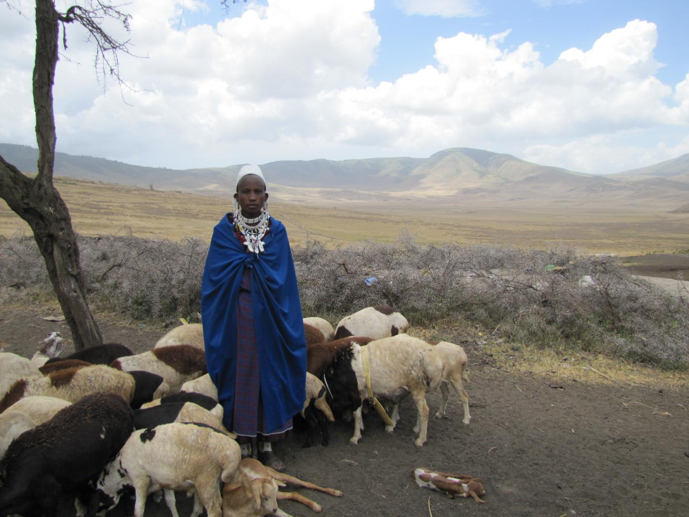

# 斑马、不幸的婚姻和安娜·卡列尼娜原则
* 许多看似合适的**大型野生哺乳动物**，如斑马和西貒，从来**没有被驯化过**，而成功驯化的动物几乎清一色地出产在**欧亚大陆**

* 驯化的哺乳动物的重要性全靠数量惊人之少的几种**大型陆生食草动物**

  * 象被**驯服**了，但绝不是**驯化**；过去汉尼拔的象和今天亚洲的役用象只是捕捉后被驯服的野象，它们在圈养中是不交配的

  * 相比之下，**驯化动物**则可定义为：使某种动物在圈养中通过**有选择的交配**，使其与野生祖先**有所不同**，以便为控制其繁殖与饲养的人类所利用
* 驯化的动物产生了不同于它们的野生祖先的**演变**，有以下几个方面
  * 许多动物的**形体大小**改变了：牛、猪和绵羊在驯化中形体变小了，而豚鼠在驯化中则形体变大了；绵羊和羊驼因保留了**毛绒**并减少或失去了硬毛而得到选择，而母牛则因**产奶量高**而得到选择

  * 有几种驯养的动物同它们的野生祖先相比，**脑袋较小**，**感觉器官**也较不发达，因为它们不再需要它们的祖先赖以逃脱野外捕食者的那种比较大的脑袋和比较发达的感觉器官了
* 这14种古代大型食草类驯化哺乳动物的野生祖先，在地球上的分布是**不均匀**的；这样的野生祖先在**南美**只有1种，它产生了美洲驼和羊驼，北美、澳大利亚和非洲撒哈拉沙漠以南地区连1种都**没有**
  * 相比之下，这14种古代动物中有**13种**（包括主要的5种中的全部）的野生祖先只有**欧亚大陆**才有
* 我们怎样来解释这14种古代哺乳动物集中出现在欧亚大陆的现象呢？
  * 欧亚大陆拥有**数量最多**的**陆生大型野生哺乳动物**，无论它们是否都是驯化动物的祖先
    * “**候补动物**”的定义为平均重量超过100磅的陆生的草食或杂食的野生哺乳动物

    * 欧亚大陆拥有最多的可供驯化的**候补哺乳动物**，达72种，正如它在其他许多植物群和动物群方面拥有最多的品种一样
    * 这是因为欧亚大陆是**世界上最大的陆块**，它的生态环境也是**千变万化**的，动植物的生存环境从广阔的热带雨林、温带雨林、沙漠和沼泽到同样广阔的冻原，应有尽有

    * 非洲热带雨林的面积比东南亚的小，在北纬37°以北没有任何温带的动植物生存环境；美洲以前的可供驯化的候补动物几乎和非洲的一样多，但美洲的大多数大型野生哺乳动物在13000年前就已灭绝了
* 虽然非洲、美洲和澳大利亚的所有那些族群存在着巨大的差异，但他们在动物驯化方面是否都有欧亚大陆族群所没有的某些**文化障碍**？
  * 有**5个方面的证据**可以驳倒上面的解释：非欧亚大陆族群迅速接受了欧亚大陆驯化的动物，人类有豢养宠畜的普遍爱好，古代的那14种哺乳动物迅速得到驯化，其中有几种还屡次独立地得到驯化，以及现代人所作的进一步驯化的努力只取得了有限的成功
  * **班图族农民**由于获得了**牛和绵羊**，从他们的家园向西非扩展，并在**很短的时间**内，在非洲撒哈拉沙漠以南的其余大多数地区打垮了先前的狩猎采集族群

  * 古埃及人和亚述人以及现代的印度人训练**猎豹**用于打猎；古埃及人的绘画表明，他们甚至还驯养（并不令人惊奇）有蹄类哺乳动物如**瞪羚和麋羚**，鸟类如**鹤**，比较令人惊奇的是驯养**长颈鹿**（可能有危险），最令人惊奇的是驯养**鬣狗**

  * 早期牧民很快就驯化了**所有适于驯化的大型哺乳动物**，这些动物全都是在公元前8000年至前2500年这一段时间驯化的——就是说，是在上次冰期结束后出现的定居的农牧社会开头的几千年内驯化

  * 印度人驯化了本地的亚种松毛长角野牛，西南亚人独立地驯化了他们自己的西南亚亚种松毛长角野牛，而北非人可能也是独立地驯化了北非的松毛长角野牛
  * 在19世纪和20世纪，至少有**6种大型哺乳动物**——大角斑羚、驼鹿、麋鹿、麝牛、斑马和美洲野牛——成了一些安排得特别井井有条的计划的研究对象，这些计划由现代的动物育种专家和遗传学家执行，目的就是对这些动物进行驯化；然而，这些现代的努力只取得了**有限的成功**

* **安娜·卡列尼娜原则**：为了得到驯化，每一种候补的野生动物都必须具有许多不同的特点
  * **日常食物**：每一次某种动物在吃某种植物或另一种动物时，食物生物量转换为取食者生物量的效率远远低于100%：通常在10%左右
    * 由于这种根本性的缺乏效率，没有一种**食肉的哺乳动物**为了**充当食物**而被驯化

  * **生长速度**：为了值得饲养，驯化动物也必须生长迅速
    * 这个要求把**大猩猩**和**大象**给排除了，虽然它们都吃素，绝对不挑食，而且身上的肉也多

  * **圈养中的繁殖问题**：我们人类不喜欢在众目睽睽之下性交；有些具有潜在价值的动物也不喜欢这样做
    * 印度**莫卧儿帝国**的一个皇帝圈养了1000头**猎豹**，尽管许多富有的王公贵族为此投入了大量人力和物力，但他们所有的猎豹都是从野外捉来后驯养的；这些王公贵族想要使猎豹在圈养中繁殖的努力都落空了，直到1960年现代动物园的生物学家才成功地使第一头猎豹在动物园里出生

  * **凶险的性情**：动辄杀人的倾向使许多本来似乎理想的动物失去了驯化的候补资格
    * 日本的**阿伊努人**习惯上把饲养**灰熊的幼崽**作为一种宗教仪式的一部分，然而在灰熊的幼崽长到**一岁大**时便把它们杀来吃掉；较长时间地饲养灰熊可能是自杀行为

    * 给**斑马**装上鞍子或骑上它是很少有的事，于是南非人想要驯化它们的热情减少了；具有潜在危险的大型哺乳动物的难以预测的攻击行为，也是在驯化**麋鹿**和**大角斑羚**方面开始时颇有希望的现代实验没有取得更大成功的部分原因

  * **容易受惊的倾向**：有几种大型食草类哺乳动物在觉察到危险时会变得神经紧张，动作敏捷，并且照例立即逃走
    * 几千年来，在新月沃地的一些地区，**瞪羚**是最经常被猎捕的动物，在该地区最早定居的人除了瞪羚再没有更多机会去驯化别的哺乳动物；但没有任何瞪羚得到驯化

  * **群居结构**：几乎所有驯化的大型哺乳动物都证明它们的野生祖先具有3个共同的群居特点：它们生活在**群体**里；它们在群体成员中维持着一种完善的**优势等级**；这些群体占据**重叠的生活范围**，而不是相互排斥的领域
    * **猫**和**雪貂**是唯一的得到驯化的地盘性哺乳动物，我们驯化它们的目的不是为了把它们当作肉食来源而大群地放牧，而是把它们当作独居的猎兽或宠物来饲养

    * 羊群中的雄性**羚羊**在交配期间都划分了地盘，彼此凶猛地争斗；因此，这些羚羊不能像绵羊、山羊或牛那样圈养在拥挤的围栏里

* 欧亚大陆的民族碰巧比其他大陆的民族继承了**多得多**的可驯化的大型野生的哺乳类食草动物；这一结果及其为欧亚大陆社会带来的全部利益，来自哺乳动物地理学、历史和生物学这3个基本事实
  * 首先，欧亚大陆由于其广大面积和生态的**多样性**，一开始就拥有**最多的可供驯化的候补动物**
  * 其次，澳大利亚和美洲，而不是欧亚大陆或非洲，在**更新世晚期动物灭绝的大规模浪潮**中失去了它们大多数**可供驯化的候补动物**——这可能是因为前两个大陆的哺乳动物不幸首先突然接触到人类，而且这时已是我们的进化史的后期阶段，我们的狩猎技巧已经得到了高度的发展
  * 最后，证明**适合驯化**的幸存的候补动物，在欧亚大陆要多于其他大陆