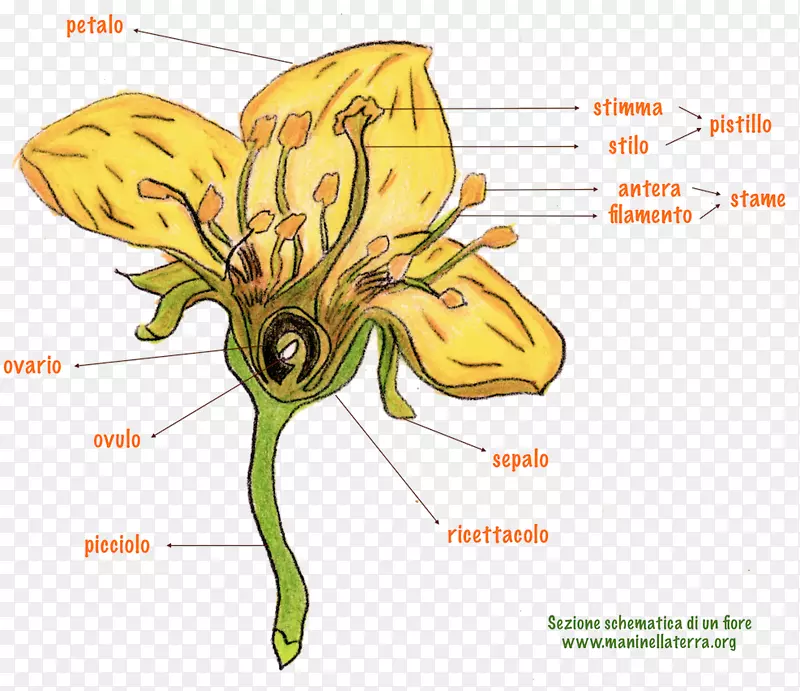

# 杏仁的前世今生
* 所有的**驯化植物**都是从**野生植物**演化而来的，有些驯化植物原来是有毒的或者和现在的样子很不一样
  * 最早的农民不懂**遗传学**，但他们知道种子可以种出**新的作物**，而且如果他们种植自己喜欢的作物的种子，那么新的作物就会**继承**它们“父母”的**有用特性**
  * **动物**也会无意中驯化植物，通过选择、食用、传播和排泄植物的种子；因此，自然选择使得许多植物种类具有**能够被动物消化的种子**
* 植物驯化的过程是一个长期的、不断的、无意识的**选择**
  * 人类并没有刻意去改变植物的基因，而是通过选择和种植自己喜欢的植物，使得这些植物**在自然选择中占据优势**，从而逐渐改变了它们的**形态和特性**
    * **生长速度**：能够快速生长和繁殖的植物更容易被人类选中和培育，也更能适应不同的环境和气候
      * **小麦**是一种生长速度很快的植物，它可以在一年内收获两次，而且可以在不同的气候和土壤条件下生长

    * **种子大小**：种子越大，越容易被人类收集和储存，也越能提供更多的营养和能量
      * **玉米**是一种种子很大的植物，它的果穗上有许多大颗粒的籽粒，每个籽粒都可以发芽成新的植株
      * 最早的玉米棒子的长度几乎不超过**半英寸**，但公元1500年墨西哥印第安农民已经培育出长达**6英寸**的玉米棒子，而现代的玉米棒子则可长达**一英尺半**

    * **种子散布方式**：依赖动物或风力散布种子的植物更难被人类控制和管理，而依赖重力或自身爆裂散布种子的植物更容易被人类驯化
      * **野豌豆**是一种依赖自身爆裂散布种子的植物，它的豆荚在成熟时会突然裂开，把种子弹出去

      * 偶然产生突变的豌豆的豆荚**不会爆裂**；在野外，这种产生突变的豌豆一直到死都是包裹在亲株上的豆荚里面，而只有能爆裂的豆荚才把它们的基因传递给后代
      * 但与此相反的是，**人类**能够收获到的唯一豆荚可能就是留在植株上的那些**不爆裂的豆荚**；因此，一旦人类开始把野豌豆带回家去吃，立刻就产生了对这种单基因突变的选择

    * **发芽抑制**：发芽抑制是指植物的种子在一定条件下不发芽的现象，它是一种保护机制，可以使种子在不适合生长的环境中保持休眠状态，等待有利的条件出现
      * 许多**一年生植物**演化的结果是通过**发芽抑制剂**来减少损失，使种子在开始阶段休眠，然后在几年里分批发芽；这样，即使大多数幼苗由于一次恶劣的天气而**死光**，剩下的一些种子还会在以后发芽

      * 野生植物中偶然产生**突变**的个体没有厚厚的种皮，也没有其他的发芽抑制剂；所有这些突变体**迅速发芽**，最后产生了突变的种子
      * 早期的农民可能没有注意到这种差异，他们只知道去注意和有选择地**收获大**的浆果；但播种—生长—收获—播种这种循环会立即无意识地选择了那些突变体
    * **杂合性**：杂合性指植物体内存在不同形式的基因，使得它们能够产生多样化的后代；杂合性有利于植物在野外适应不同的条件，但不利于人类选育出稳定和理想的特征
      * 对**自我繁殖**的植物来说，突变体会自动地保留下来；对**无性繁殖**（用亲代植物的块茎或根来繁殖）的植物或能够**自花受精**的**雌雄同株**的植物来说，情况也是如此

      * 但大多数野生植物都不是用这种方法来繁殖的，它们或者是**自交不亲和雌雄同株**，或者是**雌雄异株**

      * 有些产生**突变**的雌雄同株植物失去了它们的自交不亲和性，而变得能够**自花受精**——许多果树，如李、桃、苹果、杏和樱桃就是这一过程的例证；有些产生突变的葡萄通常都是雌雄异体，但也会变成**自花受精的雌雄同株**，这些作物能够**繁殖纯种**，因而值得去**重新种植**
    * **毒素含量**：许多野生植物含有毒素或苦味素，用来防止被动物或昆虫吃掉；这些植物如果要被人类驯化，就必须通过选择或处理降低毒素含量，使之变得可食用或可用
    * **含油量**：含油量是指植物的种子或果实中所含的油脂的比例，它是一种重要的营养物质，也可以用来制作食用油或工业油
      * 在地中海地区最早得到驯化的果树有**油橄榄**，栽培的时间大约在公元前4000年以后，栽培的目的就是为了得到它的油

* **杏仁**是一个很好的例子，说明了植物是如何被驯化的
  * 野生杏仁是**苦**的，甚至有毒的，含有**氰化物**；但是有些杏仁有一个**突变**，使得它们不苦

  * 最终，人类肯定会发现这些不苦的杏仁，这些特殊的杏仁的种子就被**收集和重新种植**，产生了一代又一代的不苦杏仁

* 在新月沃地，最早被驯化的食用植物是**谷物和豆类**，大约是在**10000年前**驯化的

  * 这些植物的**野生近亲**已经**可以食用**，而且从种子**快速而容易地生长**
  * 它们**容易储存**，而且只需要**几个基因突变**就可以作为有意识播种的作物
* 在这些最初的植物被驯化之后，人们花了6000年才开始种植第一批**果树和坚果树**；这些树需要**几年**才能成熟，所以只有有**定居生活方式**的人才会从中受益
  * 然而，这些植物——比如**橄榄和葡萄**——一旦被种植就很容易生长，而且它们的后代也和它们一样

* 更晚一些，人们在这个地区开始种植一些**更难培育的树木**，比如**苹果和樱桃**；这些树要靠困难的**嫁接技术**来种植，而这个技术在中国农业开始后很久才发展起来

  * 许多在晚近阶段发展起来的果树的野生祖先完全**不是自花传粉**，它们必须由属于同一品种但产生遗传变异的另一植物进行异花传粉
  * 所有这些问题把苹果、梨、李和樱桃的驯化时间一直推迟到**古典时期前后**
* 肥沃新月地带的植物驯化过程，在很多方面和**其他地方**发生的过程相似

  * 在世界各地，常见的早期驯化作物包括**谷物、豆类**和用于编织的**纤维**；在一些地方，主要的碳水化合物来源是**根茎**或者**瓜类**而不是谷物
  * 不同地区的植物**驯化速度和程度**也不同，取决于当地的气候、土壤、水源、野生植物的多样性和适应性等因素
  * 一般来说，**温带地区**的植物驯化比**热带地区**的植物驯化要**快**，因为温带地区有明显的季节变化，迫使植物有一个**固定的生长周期**，而热带地区的植物则可以一年四季都生长，不需要等待人类的播种
  * 在世界上的许多地方，农业开始还涉及**种子撒播**和**农田单作**以及最后**用牲畜犁地**等问题
* 有些植物**很难被驯化**，因为它们有一些不利于人类利用的特性
  * 例如，**橡树**就是一个很难被驯化的植物，因为它们需要**几十年**才能结果，而且它们的果实——橡子——含有大量的**单宁酸**，需要经过复杂的处理才能食用

* 植物驯化对人类文明的发展有着重要的影响
  * 驯化植物提供了人类**稳定和丰富的食物来源**，使得**人口增长和定居**成为可能
  * 驯化植物也促进了人类**对其他资源和技术的开发**，比如动物驯养、冶金、陶器、文字等
  * 驯化植物还影响了**人类社会的结构和组织**，比如阶级分化、政治制度、宗教信仰等