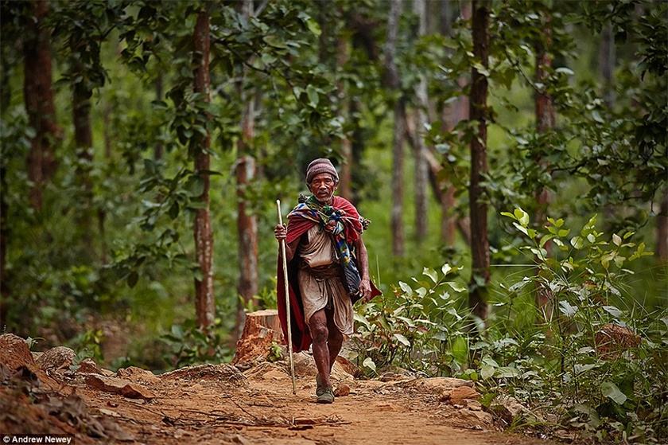
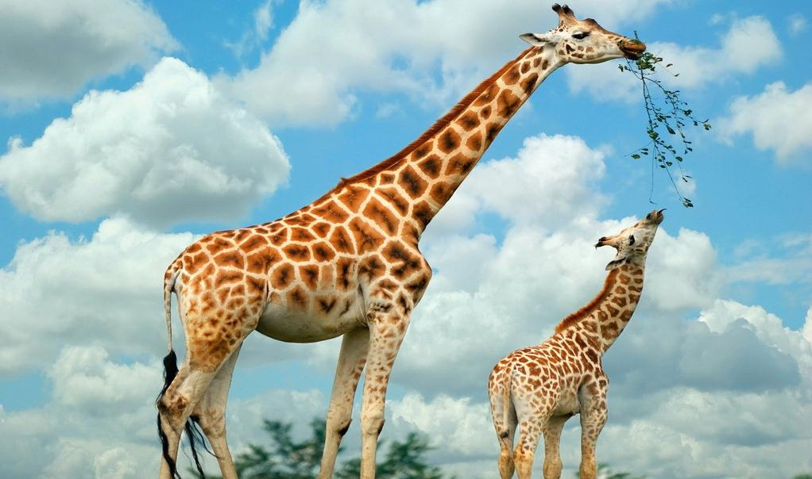
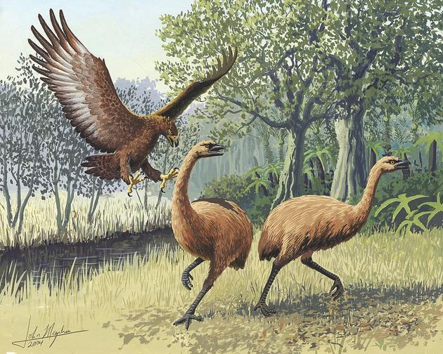
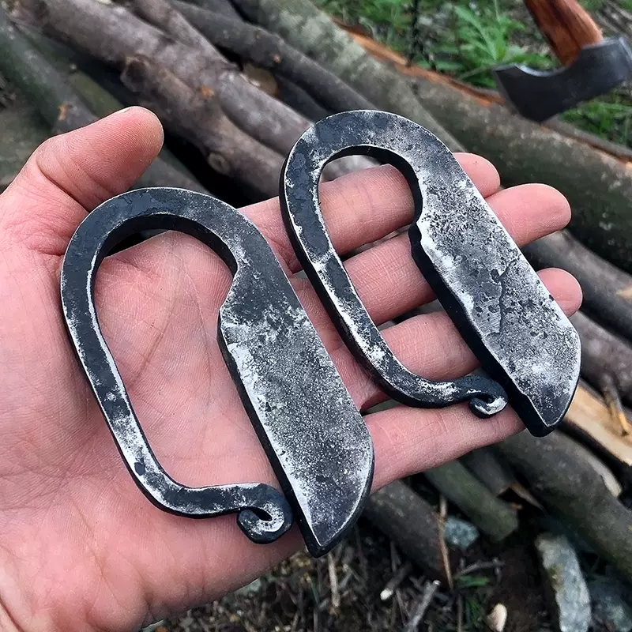
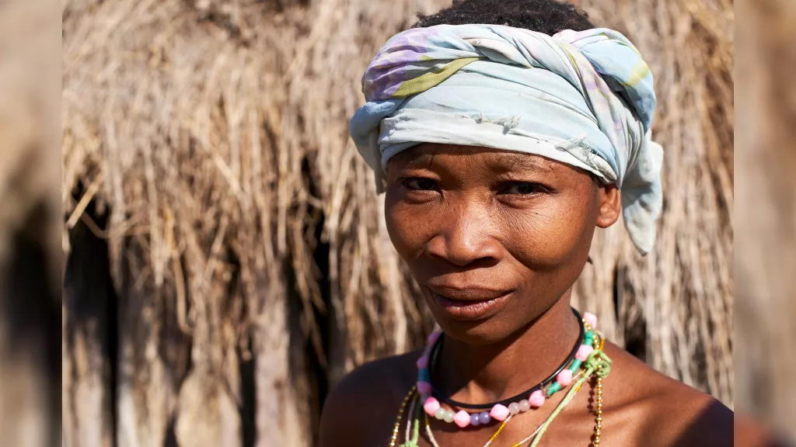

# 种田还是不种田
* 以前，地球上所有的人都以**狩猎采集**为生，为什么他们中竟有人会选定**粮食生产**呢？

  * 从我们现代的观点来看，所有这些问题初看起来似乎有点愚蠢，因为作为狩猎采集族群的不利条件似乎是**显而易见**的
  * 虽然**农民和牧人**构成了世界上实际粮食生产者的大多数，但其中**大部分人**的境况不一定就比以狩猎采集为生的人来得优越；对时间安排的研究表明，他们每天花在工作上的小时和以狩猎采集为生的人相比可能**只多不少**
  * 一些考古学家已经证实，许多地区最早的农民同被他们取代的以狩猎采集为生的人相比，身材较**矮小**，营养较**差**，患**严重疾病**的较多，死时平均年龄也**较轻**
* 有许多实际情况表明，**狩猎采集族群**的确看见过他们的邻居在进行粮食生产，不过他们还是**拒绝接受**想象中的粮食生产的好处，而仍然过着狩猎采集生活

* 还有一些与农民接触的狩猎采集族群最后的确成了农民，但那也只是在我们看来可能是经过**极其漫长的拖延**之后
## 关于粮食生产起源的错误观念
* 我们可能首先会理所当然地认为，**粮食生产**是**发现**的，或**发明**的，但实际情况并非如此
  * 从事粮食生产还是狩猎采集，这中间甚至**不存在有意识的选择**；在地球上每一个地区，最早的选定粮食生产的族群显然不可能不可能有意识地把农业作为他们的奋斗目标，因为他们**从来没有见过农业**，根本不知道农业是怎么一回事
  * 粮食生产是**逐步形成**的，是在不知道会KV有什么结果的情况下所作出的决定的**副产品**
* 另一个错误观念是：在到处流浪的狩猎采集族群与定居的粮食生产者之间必定是**界线分明**
  * 事实上，虽然我们经常把他们分为两种截然不同的人群，但在某些**物产丰富的地区**，包括北美洲的西北太平洋沿岸以及可能还有澳大利亚东南部，**狩猎采集族群**已经**定居下来**，但从未成为**粮食生产者**
  * 相反，粮食生产者中也有**流动的群体**；美国西南部的**阿帕切族印第安人**沿着**季节性的固定路线**变换营地，以利用牧场上可以预料的季节性变化

  * 因此，从狩猎采集向粮食生产的**转变**，并不总是与从游牧生活到定居生活的转变**同时发生**
* 另一个实际上已变得模糊不清的想象中的区别，是粮食生产者**积极经营土地**而狩猎采集族群**采集土地上的野生物产**这两者之间的差异
  * 实际上，有些**狩猎采集族群**集中力量经营他们的土地，例如，新几内亚的从未驯化过西谷椰子和山露兜树的土著，却知道怎样来增加这些可食用的野生植物的产量

## 从狩猎采集到粮食生产的转变
* 粮食生产是由狩猎采集族群发端于前，然后一步步发展起来的
  * 即使是在粮食生产以最快的速度从狩猎采集的生活方式独立发展起来的情况下，也要花上**几千年时间**才能从**完全依赖野生食物**转变为**依赖很少几种野生食物**
* 这种转变是逐步实现的，其根本原因是，粮食生产制度的渐次形成乃是许多关于**时间和劳力分配**的不同决定积累的结果
  * 他们首先集中注意力于**最喜欢的食物**，或者能够产生**最高报偿**的食物；如果这些食物无法得到，他们就转向**不太喜欢的食物**
  * 人们寻找食物是为了**充饥果腹**；他们也渴望得到一些**特别的食物**，如富有蛋白质的食物、脂肪、盐、甜水果以及只要吃起来味道好的食物
  * 如果所有其他情况都相同，人们就用一种以最少的时间、**最小的努力**和最大的把握产生**最大的回报**的方法去寻找食物，从而追求在卡路里、蛋白质或其他特别的食物品种方面得到最大限度的回报
  * 同时，他们也追求**最小限度的风险**：同按平均时间计算回报率很高但也很可能饿死的一种变化不定的生活方式相比，适中的然而可靠的回报显得更为可取
* 相反，**男性猎人**的行动往往要受到**声望**这类考虑的影响
  * 例如，他们可能宁愿每天去猎捕长颈鹿，每月猎获一头长颈鹿，从而赢得伟大猎人的身份，而不是降低身份，每天确保采集到坚果，一个月背回家两倍于一头长颈鹿重量的食物

  * 人们也受到看似随心所欲的**文化偏好**的影响，例如把鱼或者看作是美味，或者看作是禁忌
  * 最后，他们的优先考虑还要受到**他们所喜爱的生活方式的相对价值**的严重影响；在整个人类历史上，农民总是看不起以狩猎采集为生的人，说他们粗野原始，以狩猎采集为生的人也看不起农民，说他们愚昧无知，而牧人则对这两种人都看不起
* 粮食生产一旦在**某个大陆的某个部分**出现，邻近的狩猎采集族群就能看到**粮食生产的结果**，从而作出有意识的决定
  * 在某些情况下，这些狩猎采集族群几乎是**全盘接受**了邻近的粮食生产制度；在另一些情况下，他们只选择**其中的某些成分**；在还有一些情况下，他们则是**完全拒绝**粮食生产，而继续做以狩猎采集为生的人
  * 例如，在**欧洲东南部一些地区**的狩猎采集族群，在公元前6000年左右迅速接受了**西南亚**的谷类作物、豆类作物和牲口，而且是**同时全盘接受**的
  * 相形之下，粮食生产在**西南欧**（法国西南部、西班牙和意大利）则是逐渐被采纳的，那里最先引进的是绵羊，后来引进的是谷物
  * **日本**从**亚洲大陆**采纳集约型粮食生产非常缓慢，而且是逐步实现的
* 正如**狩猎采集的生活方式**可以逐渐转换为**粮食生产的生活方式**一样，一种粮食生产制度也可**逐渐转换**为**另一种粮食生产制度**
  * 例如，**美国东部的印第安人**在公元前2500年左右已开始驯化本地的植物，但也和**墨西哥的印第安人**发生贸易往来，他们采纳了墨西哥的作物，逐步抛弃了本地的驯化植物

  * 甚至偶然也有**放弃粮食生产制度**、复归狩猎采集生活的例子；例如，在公元前3000年左右，**瑞典南部**的狩猎采集族群采纳了以西南亚作物为基础的农业，但在公元前2700年时**放弃**了，**重新回归**狩猎采集生活，又过了400年才又一次**恢复**了农业生活
* 我们必须把粮食生产同狩猎采集看作是**相互竞争的供选择的办法**；在狩猎采集外再种植某些作物或饲养某些牲口的混合经济，不但在和这两种“纯粹”经济竞争，而且也在和粮食生产比例或高或低的混合经济竞争
## 粮食生产的优势
* 尽管如此，在过去的10000年间，普遍的结果一直是从狩猎采集转变为粮食生产；是什么因素使**竞争优势**不属于前者而属于后者？
  * 这个问题之所以仍未解决，一个原因就是**不同的因素**可能在世界上的不同地区起着决定性的作用，另一个原因是怎样理清粮食生产出现过程中的**因果关系**问题
* 然而，我们仍然可以找出**4个起作用的主要因素**；而争论也主要是围绕这些因素的相对重要性而展开的
  * 一个因素是**获得野生食物的可能性减少**了；大多数大型哺乳动物在更新世结束时已在南美洲和北美洲**灭绝**了，还有些在欧亚大陆和非洲灭绝了，这或者是因为气候发生了变化，或者是因打猎的人的技巧提高了和人数增加了

  * 第二个因素是：正如野生鸟兽资源的枯竭往往使**狩猎采集活动好处减少**，由于**获得可驯化野生植物的可能性**增加了，对植物进行驯化的做法可以得到较大的好处
  * 还有一个不利于狩猎采集生活的因素，是粮食生产将要最终依赖的一些技术——对野生粮食的**收集、加工和贮藏的技术**在日积月累地发展

  * 第四个因素是**人口密度增加和粮食生产出现**这两者之间的相互关系；在世界各地，凡是可以得到充分证据的地方，考古学家们都发现了人口密度增加与粮食生产之间出现相互联系的证据，但**因与果**常常争论不休，原则上，人们认为因果链条起着**双向作用**
* 结果，在地球上大多数适于粮食生产的地区，狩猎采集族群只能有**两种命运**：要么他们被邻近的粮食生产者所**取代**，要么他们为了生存只有**采纳**粮食生产的办法
  * 在有些地方，由于存在着强大的**地理或生态障碍**，粮食生产者很难从外面移入，适合本地的粮食生产技术也很难传播进来；只有在这些地方，狩猎采集族群才能在一些适合粮食生产的地区一直**生存到现代**
