# 辽阔的天空与偏斜的轴线
* **美洲**南北向距离（9000英里）比东西向距离**大得多**：东西最宽处只有3000英里，最窄处在巴拿马地峡，仅为40英里
  * 就是说，美洲的主轴线是**南北向**的；**非洲**的情况也是一样，只是程度没有那么大
  * 相形之下，**欧亚大陆**的主轴线则是**东西向**的
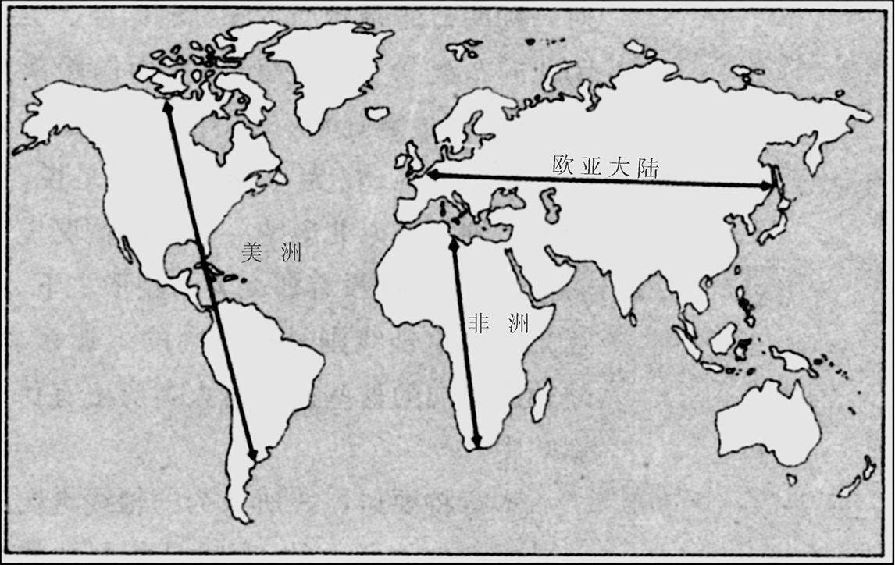
* **轴线走向**影响了**作物和牲口的传播速度**，可能还影响文字、车轮和其他发明的传播速度
  * **粮食生产的传播**对于了解在枪炮、病菌和钢铁的出现方面的地理差异，同**粮食生产的起源**一样证明是决定性的
  * 粮食生产的这种传播的**主要路线**，是从西南亚到欧洲、埃及和北非、埃塞俄比亚、中亚和印度河河谷；从萨赫勒地带和西非到东非和南非；从中国到热带东南亚、菲律宾、印度尼西亚、朝鲜和日本；以及从中美洲到北美洲
* 正如某些地区证明比其他地区更适合于出现粮食生产一样，**粮食生产传播的难易程度**在全世界也是**大不相同**的
  * 有些从生态上看十分适合于粮食生产的地区，在史前期**根本没有学会**粮食生产；即使在所有那些在史前期传播了粮食生产的地区中，**传播的速度和年代**也有很大的差异
  * 在一端是粮食生产**沿东西轴线迅速传播**：从西南亚向西传入欧洲和埃及，向东传入印度河河谷（平均速度为每年约0.7英里），从菲律宾向东传入波利尼西亚（每年3.2英里）；在另一端是粮食生产**沿南北轴线缓慢传播**：以每年不到0.5英里的速度从墨西哥向北传入美国的西南部
  * 虽然**西南亚**的大多数始祖作物和牲口的确向西传入了**欧洲**，向东传入了**印度河河谷**，但在**安第斯山脉**驯养的哺乳动物（美洲驼/羊驼和豚鼠）在哥伦布以前没有一种到达过**中美洲**

* 对于物种传播的这种地理上的难易差别，有一个比较巧妙的说法，叫做**抢先驯化现象**
  * 大多数后来成为我们的作物的野生植物在遗传方面**因地而异**，因为在不同地区的野生祖先种群中已经确立了**不同的遗传突变体**；同样，把野生植物变成作物所需要的变化，原则上可以通过**不同的新的突变**或**产生相同结果的不同的选择过程**来予以实现

  * 如果对**新大陆**的古代主要作物进行这种遗传分析，其中有许多证明是包括两个或更多的不同的**野生变种**，或两个或更多的不同的**转化突变体**
  * 这表明，这个作物是在**至少两个不同的地区独立驯化**的，这个作物的某些变种经遗传而获得了一个地区**特有的突变**，而同一作物的另一些变种则通过遗传而获得了另一地区的突变
  * 相形之下，**西南亚**的大多数古代作物显示出只有**一个**不同的野生变种或不同的转化突变体，从而表明了该作物的所有现代变种都起源于**仅仅一次的驯化**
  * **支持仅仅一次驯化**的证据表明，一旦某种野生植物得到了驯化，那么这种作物就在这种野生植物的整个产地**迅速向其他地区传播**，抢先满足了其他地区**对同一种植物独立驯化**的需要
  * 然而，如果我们发现有证据表明，同一种植物的野生祖先在不同地区**独立地得到驯化**，我们就可以推断出这种作物**传播得太慢**，无法抢先阻止其他地方对这种植物的驯化
  * 某种作物的迅速传播可能不但抢先阻止了**同一植物的野生祖先**在其他某个地方的驯化，而且也阻止了**有亲缘关系的野生植物**的驯化
  * 因此，许多不同的现象归结为**同一个结论**：粮食生产从**西南亚**向外传播的速度要比在**美洲**快，而且也可能比在**非洲撒哈拉沙漠以南**的地区快
* 让我们先来看一看粮食生产从**西南亚**（新月沃地）向外迅速传播的情况
  * 在那里出现粮食生产后不久，即稍早于公元前8000年，粮食生产从中心向外扩散的浪潮在**欧亚大陆西部**和**北非**的其他地方出现了，它往**东西**两个方向传播，离新月沃地越来越远
  * 粮食生产的浪潮到公元前6500年到达**希腊、塞浦路斯**和**印度次大陆**，在公元前6000年后不久到达**埃及**，到公元前5400年到达**中欧**，到公元前5200年到达**西班牙南部**，公元前3500年左右到达**英国**
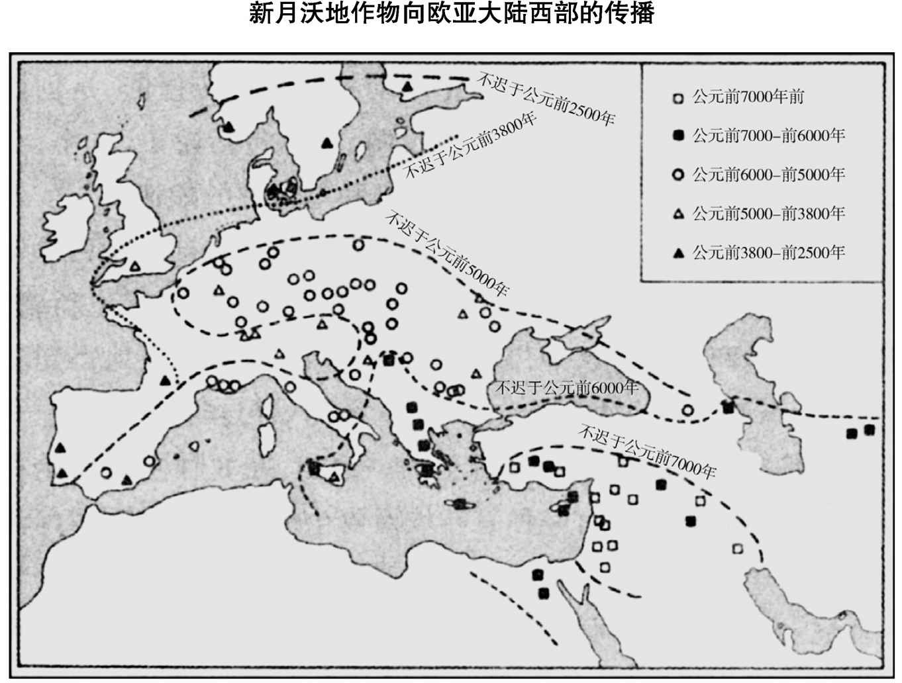
  * 另外，新月沃地的整套作物和牲口在某个仍然无法确定的年代进入**非洲**，向南到了**埃塞俄比亚**；然而，埃塞俄比亚也发展了许多**本地的作物**，目前我们还不知道是否就是这些作物或陆续从新月沃地引进的作物开创了埃塞俄比亚的粮食生产
  * 当然，这全部作物和牲口**并非全都**传播到那些边远地区，例如，埃及太温暖，不利于单粒小麦在那里落户；在有些边远地区，是在**不同时期**分批引进这些作物和牲口的，例如，在西南欧，绵羊引进的时间早于谷物
  * 新月沃地的大多数始祖作物在它们最初在新月沃地驯化后，就不会在其他地方再次驯化；就新月沃地的大多数始祖作物而言，今天世界上所有人工培育的品种的染色体都只有**一种排列**，而它们野生祖先的染色体却有**多种排列**
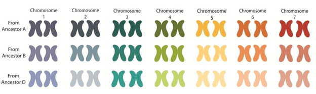
* 为什么作物从新月沃地向外传播的速度如此之快？回答部分地取决于**欧亚大陆的东西向轴线**
  * 位于同一纬度的东西两地，**白天的长度**和**季节的变化**完全相同；在较小程度上，它们也往往具有类似的疾病、温度和雨量情势以及动植物生境或生物群落区（植被类型）
  * 在各个大陆上，被称为**热带雨林**型的动植物生境都在赤道以南和赤道以北大约10度之内，而**地中海型低矮丛林**的动植物生境（如加利福尼亚的沙巴拉群落和欧洲的灌木丛林地带）则是在北纬大约30度至40度之间
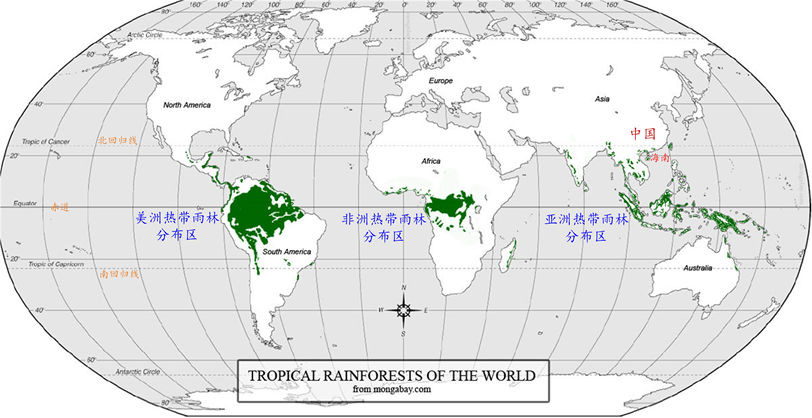
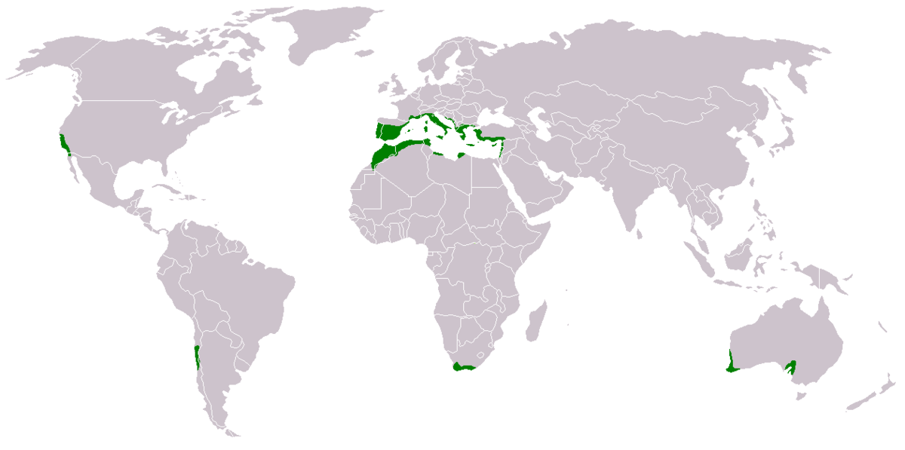
  * 白天长度、温度和雨量的**季节性变化**，成了促使种子发芽、幼苗生长以及成熟的植物开花、结子和结果的信号；每一个植物种群都通过**自然选择**在遗传上作好安排，对它在其中演化的季节性情势所发出的信号作出**恰当的反应**，这种季节性的情势因**纬度的不同**而产生巨大的变化
    * 例如，在**赤道**白天的长度全年**固定不变**，但在**温带地区**，随着时间从冬至向夏至推进，白天**逐步变长**，然后在整个下半年又**逐步变短**；**生长季节**——即温度与白天长度适合植物生长的那一段时间——在高纬度地区**最短**，在靠近赤道地区**最长**
  * 所有这些特点使**低纬度地区**的植物难以适应**高纬度地区**的条件，反之亦然；结果，新月沃地的大多数作物在法国和日本生长良好，但在赤道则生长很差
  * **动物**也一样，能够适应与纬度有关的气候特点
  * 这就是新月沃地驯化的动植物如此**迅速**地向东西两个方向传播的部分原因：它们已经很好地**适应**了它们所传播的地区的**气候**
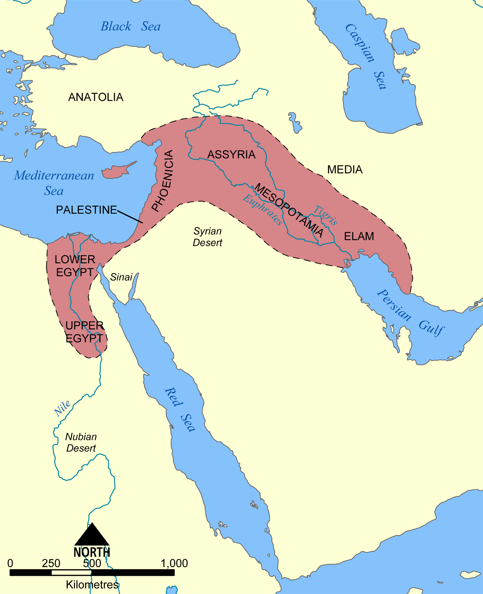
  * 因此，欧亚大陆的东西向轴线使新月沃地的作物迅速开创了从爱尔兰到印度河流域的**温带地区**的农业，并丰富了**亚洲东部**独立出现的农业；反过来，最早在远离新月沃地但处于同一纬度的地区驯化的作物也能够**传回新月沃地**
    * 在**罗马**人的作物中，只有**燕麦**和**罂粟**是意大利当地生产的，罗马人的主食是**新月沃地**的一批始祖作物，再加上榅桲（原产高加索山脉）、小米和莳萝（在中亚驯化）、黄瓜、芝麻和柑橘（来自印度），以及鸡、米、杏、桃和粟（原产中国）；虽然罗马的**苹果**算是欧亚大陆西部的土产，但对苹果的种植却要借助于在中国发展起来并从那里向西传播的**嫁接技术**

  * 在传播速度上堪与新月沃地整批作物相比的是一批**亚热带作物**的向东传播，这些作物最初集中在**华南**，在到达热带东南亚、菲律宾、印度尼西亚和新几内亚时又增加了一些新的作物
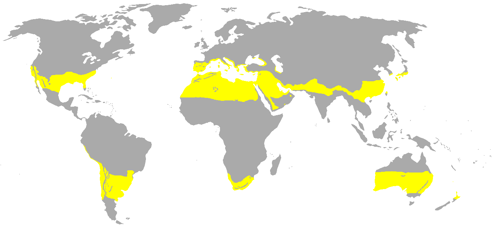
  * 还有一个似乎可信的例子，是作物在非洲广阔的**萨赫勒地带**内从东向西的传播，但古植物学家仍然需要弄清楚这方面的详细情况
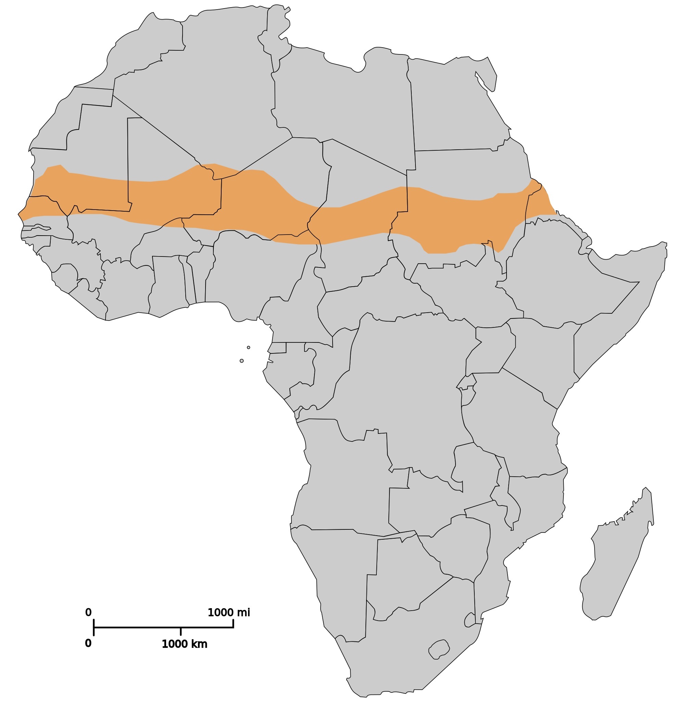
* 可以把驯化的植物在欧亚大陆**东西向传播之易**与沿非洲**南北轴线传播之难**作一对比
  * 新月沃地的大多数始祖作物很快就到达了**埃及**，然后向南传播，直到凉爽的**埃塞俄比亚高原地区**，它们的传播也就到此为止；**南非的地中海型气候**对这些作物来说应该是理想的，但在埃塞俄比亚与南非之间的那2000英里的**热带环境**成了一道不可逾越的障碍
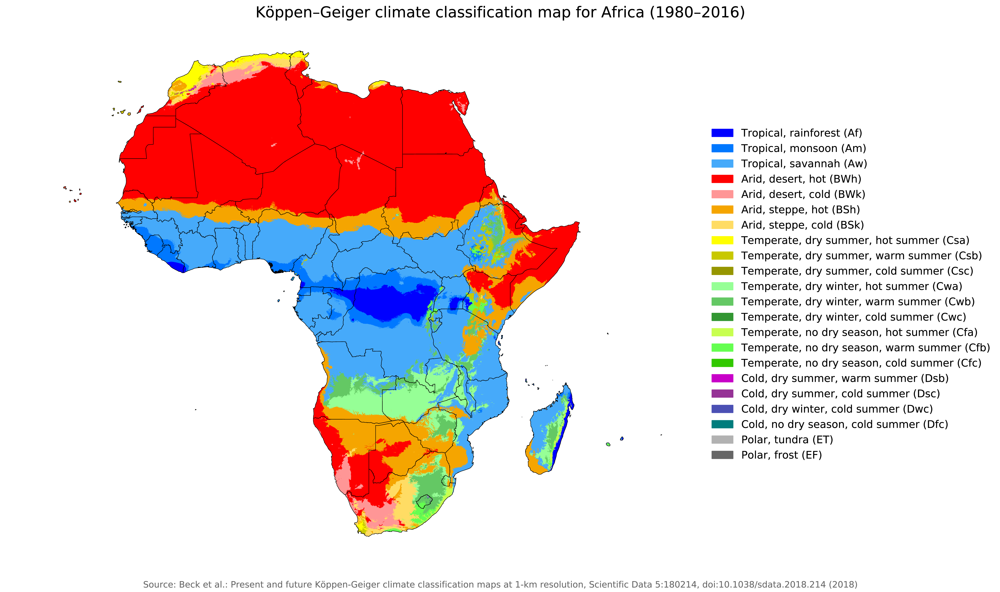
  * **撒哈拉沙漠以南地区的非洲农业**是从驯化**萨赫勒地带**和**热带西非**的当地野生植物（如高粱和非洲薯蓣）开始的，这些植物已经适应了这些低纬度地区的温暖气候、夏季的持续降雨和相对固定不变的白天长度

  * 同样，新月沃地的**家畜**通过非洲向南的传播也由于**气候和疾病**（尤其是采采蝇传染的锥虫病）而停止或速度减慢；**马匹**所到的地方从来没有超过赤道以北的一些西非王国

  * 结果就是人们非常熟悉的过去2000年的**南非历史**：南非土著**科伊桑人**（亦称霍屯督人和布须曼人）有些已有了**牲畜**，但仍**没有农业**；他们在人数上不敌**黑非洲农民**，并在菲什河东北地区被黑非洲农民**取而代之**，但这些黑非洲农民的向南扩张也到**菲什河**为止

  * 只有在**欧洲移民**于1652年由**海路**到达，带来**新月沃地的一整批作物**时，**农业**才得以在南非的地中海型气候带兴旺发达起来
* 还可以把驯化的植物在**欧亚大陆**传播之易与沿**美洲**南北轴线传播之难作一对比
  * **中美洲与南美洲**之间的距离——例如墨西哥高原地区与厄瓜多尔高原地区之间的距离——只有1200英里，相当于欧亚大陆上**巴尔干半岛与美索不达米亚**之间的距离
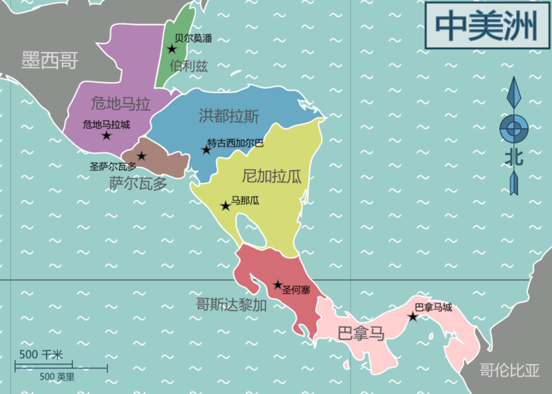
  * 有几种作物，特别是**墨西哥玉米**，确实在哥伦布时代以前就已传播到另一个地区；但其他一些作物和牲畜未能在中美洲和南美洲之间传播

  * **凉爽的墨西哥高原地区**应该是饲养美洲驼、豚鼠和种植马铃薯的理想环境，因为它们全都是在**南美安第斯山脉凉爽的高原地区**驯化的；然而，安第斯山脉的这些特产在向北传播时被横隔在中间的**中美洲炎热的低地**完全阻挡住了
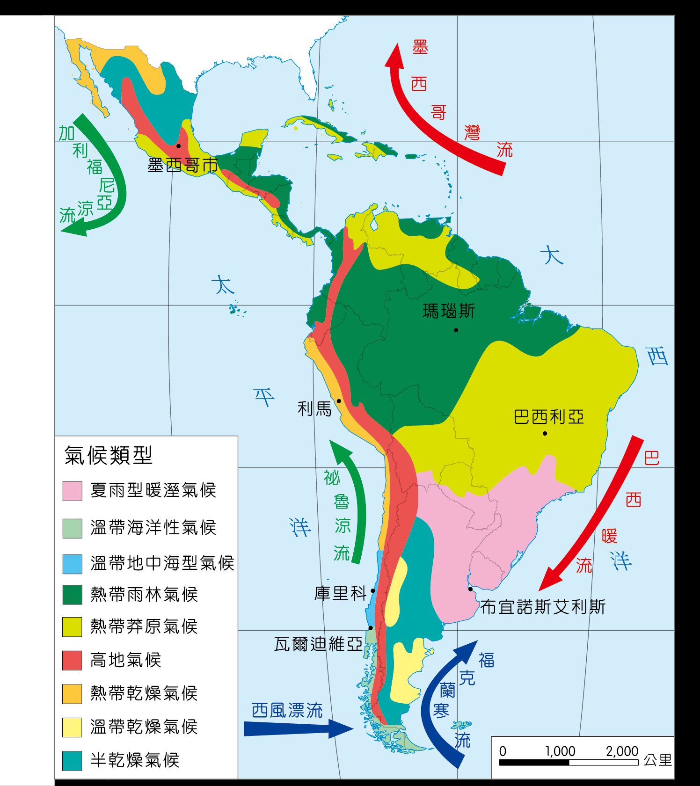
  * 反过来，墨西哥驯养的火鸡和美国东部种植的向日葵本来也是可以在安第斯山脉茁壮生长的，但它们在向南传播时被隔在中间的热带气候区阻挡住了

    * 在**玉米**于墨西哥驯化后的几千年中，它都未能向北传播到**北美的东部**，其原因是那里的气候普遍较冷和生长季节普遍较短；在公元元年到200年之间的某一个时期，玉米终于在美国的东部出现，但还只是一种**十分次要的作物**
    * 直到**公元900年**左右，在培育出能适应北方气候的耐寒的玉米品种之后，以玉米为基础的农业才得以为北美最复杂的印第安人社会——**密西西比文化**作出贡献，不过这种繁荣只是昙花一现，便由于同哥伦布一起到来的和在他之后到来的欧洲人带来的病菌而寿终正寝
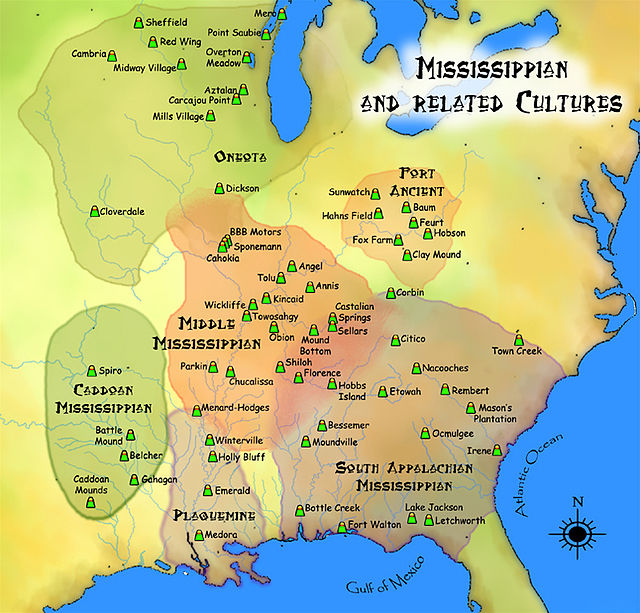
  * 许多显然广为传播的印第安作物中，却包含有一些**亲缘植物**，或甚至属于同一品种但**产生了遗传变异的变种**，而这些作物又都是在中美洲、南美洲和美国东部**独立驯化**出来的
  * 于是，非洲和美洲这两个最大的陆块，由于它们的轴线主要是**南北走向**，故而产生了**作物传播缓慢**的结果
  * 这方面的另一些例子包括作物在**巴基斯坦的印度河流域**与**南印度**之间十分缓慢的交流，**华南**的粮食生产向**西马来西亚**的缓慢传播，以及热带**印度尼西亚**和**新几内亚**的粮食生产未能在史前时期分别抵达**澳大利亚**西南部和东南部的现代农田
* **纬度**是气候、生长环境和粮食生产传播难易的**主要决定因素**，然而不是这方面**唯一的决定因素**，认为同一纬度上的邻近地区有着**同样的气候**，这种说法也并**不总是正确**的
  * 例如，虽然**美国的东南部和西南部**处在同一个纬度上，但这两个地区之间的作物传播却是十分缓慢而有选择性的；这是因为横隔在中间的**得克萨斯和南部大平原**的很大一部分地区**干旱而不适于农业**
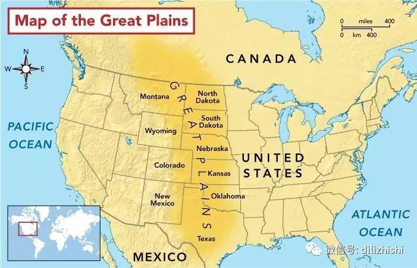
  * 在欧亚大陆也有一个与此相一致的例子，那就是**新月沃地的作物**向东传播的范围；在印度如要再向东去，则由于主要是**冬季降雨**转变为主要是**夏季降雨**而大大延缓了涉及不同作物和耕作技术的农业向**印度东北部恒河平原**的扩展；如果还要向东，则有**中亚沙漠、西藏高原和喜马拉雅山**一起把中国的温带地区同气候相似的欧亚大陆西部地区分隔开来

    * 因此，中国粮食生产的**早期发展**独立于处在同一纬度的新月沃地的粮食生产，并产生了一些**完全不同的作物**；然而，当公元前2000年西亚的小麦、大麦和马匹到达中国时，就连中国与欧亚大陆西部地区之间的这些障碍也至少**部分地得到了克服**
  * 而且，这种**南北转移**2000英里所产生的阻力，也因当地条件的不同而迥异；新月沃地的粮食生产通过这样长的距离传播到埃塞俄比亚，而班图人的粮食生产从非洲的大湖区向南迅速传播到纳塔尔省，因为在这两个例子中，隔在中间的地区有**相似的降雨情势**，因而适合于农业
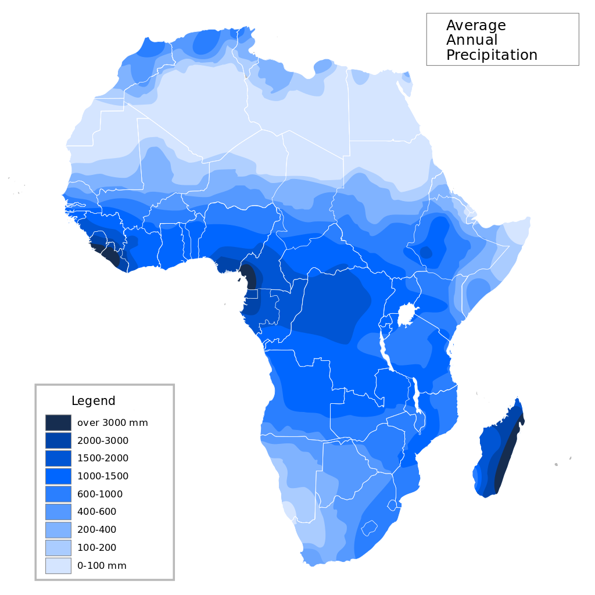
* 大陆轴线走向的差异不仅影响粮食生产的传播，而且也影响**其他技术和发明**的传播
  * 例如，公元前3000年左右在西南亚或其附近发明的**轮子**，不到几百年就从东到西迅速传到了欧亚大陆的很大一部分地区，而在史前时代墨西哥独立发明的轮子却未能传到南面的安第斯山脉地区

  * 同样，不迟于公元前1500年在新月沃地西部发展起来的**字母文字**的原理，在大约1000年之内向西传到了迦太基，向东传到了印度次大陆，但在史前时期即已盛行的中美洲书写系统，经过了至少2000年时间还没有到达安第斯山脉

  * 当然，轮子和文字不像作物那样同纬度和白天长度有直接关系，相反，这种关系是**间接的**，主要是通过**粮食生产系统及其影响**来实现的；最早的轮子是用来运输农产品的牛拉大车的一部分，早期的文字只限于由生产粮食的农民养活的上层人士使用，是为在经济上和体制上都很复杂的粮食生产社会的目的服务的