# 问题在苹果还是在印第安人
## 开头
* 为什么农业没有在一些肥沃的十分合适的地区，如加利福尼亚、欧洲、气候温和的澳大利亚以及非洲赤道以南地区独立地出现？而在农业独立出现的那些地区中，为什么有些地区的农业发展会比另一些地区早得多？
  * 这使我们想到了两个形成对比的解释：**当地人**的问题，或当地可以得到的**野生植物**的问题
* 植物的数量太大，光是会**开花的野生植物**就有**20万种**，它们在陆地植物中占据首要地位，并成为我们几乎全部作物的来源
  * 然而，大多数野生植物都是**木本植物**，它们不出产任何可吃的果实，它的叶和根也是不能吃的；在这20万种野生植物中，只有**几千种**可供人类食用，只有**几百种**得到或多或少的驯化
  * 仅仅**十几种作物**的产量，就占去了现代世界全部作物年产量总吨数的**80%以上**；这十几种了不起的作物是谷类中的小麦、玉米、稻米、大麦和高粱，豆类中的大豆，根或块茎中的马铃薯、木薯和甘薯，糖料作物中的甘蔗和糖用甜菜，以及水果中的香蕉
  * 我们在现代甚至没有能驯化出一种**新的重要的粮食植物**，这种情况表明，古代人也许真的探究了差不多**所有有用的野生植物**，并且驯化了所有值得驯化的野生植物
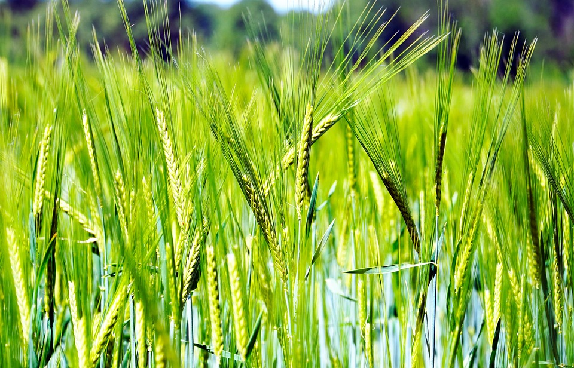
* 然而，世界上有些地方何以**未能驯化野生植物**，这个问题仍然难以解释
  * 重要的谷物**高粱**在非洲撒哈拉沙漠南沿的**萨赫勒地带**驯化了，南至**非洲南部**也有野生高粱存在，但无论是高粱还是任何其他植物，在非洲南部都没有人栽种，直到2000年前班图族农民才从赤道以北的非洲地区引进了一整批作物
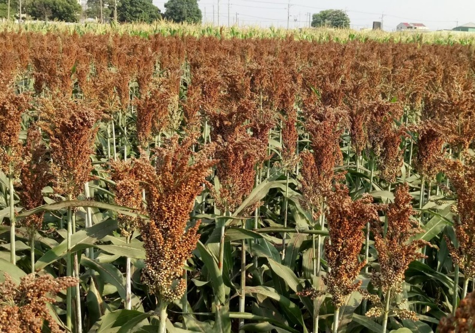
  * 同样令人困惑的是，人们未能驯化欧洲西部和北非的**野生亚麻**，也未能驯化巴尔干半岛南部的**野生单粒小麦**
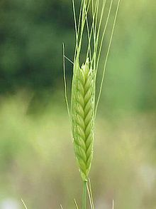
  * 其他一些引人注目的例子涉及这样一些野生植物：它们并没有在那些**从未自发地出现粮食生产**的地区得到驯化，虽然它们也有在其他地方得到驯化的近亲
* 为了回答这个问题，我们可以比较一下在独立的驯化中心中处于两个极端的3个地区
  * 我们已经看到，其中一个地区就是**新月沃地**，它也许是世界上**最早的粮食生产中心**，也是现代世界主要作物中的若干品种以及几乎所有的主要驯化动物的**发源地**
  * 另外两个地区是**新几内亚**和**美国东部**，这两个地区的确驯化过当地的作物，但这些作物品种很少，只有**一种**成为世界上的重要作物，而且由此产生的整个粮食也未能像在新月沃地那样帮助人类技术和行政组织的广泛发展
## 新月沃地
* **美索不达米亚**是最早发展农业文明的地区之一，也是地球上研究得最为详尽和了解得最为透彻的地区；它有以下几个环境优势：
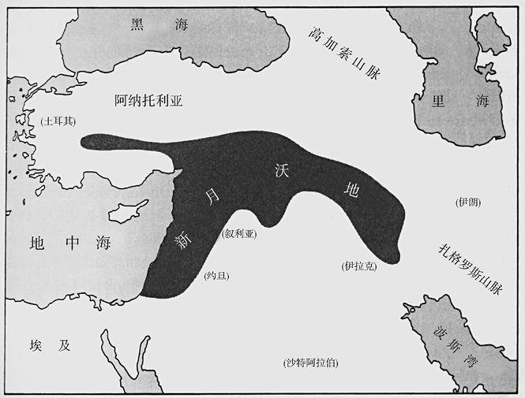
  * 它地处所谓的**地中海气候带**内，这种气候的特点是冬季温和而湿润，夏季漫长、炎热而干燥
    * 气候适宜**一年生作物**，尤其是谷类和豆类植物的生长，这些作物本身会在干旱季节逐渐枯萎死去
    * 由于只有一年的生命，一年生植物必然是**矮小的草本植物**；其中有许多把自己的很大一部分气力用来生产**大籽粒的种子**，种子在旱季休眠，并准备好在雨季到来时发芽
    * 因此，一年生植物不会浪费气力去生长**不可食用**的木质部或纤维梗茎，就像乔木和灌木的枝干那样；但是许多**大籽粒的种子**，主要是一年生谷物和豆类的种子，是可以供人类**食用**的
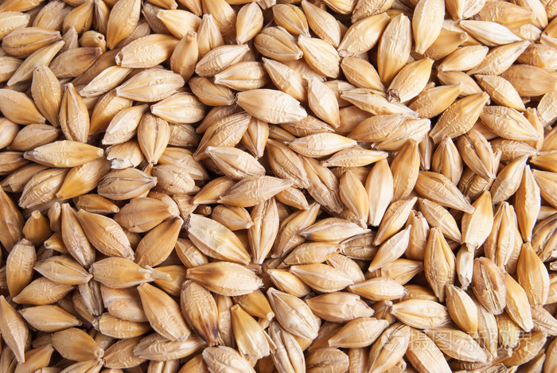
  * 拥有**繁茂而高产**的野生植物，其中许多可以**轻易地驯化**，对于狩猎采集族群来说，其价值必定是显而易见的
    * 植物学家们进行了一些试验性的研究，从**天然的大片野生谷物**中采集种子，就像1万多年前狩猎采集族群所做的那样；这些研究表明，每年每公顷可以收获近一吨的种子，只要花费一个大卡的劳力就可产生50个大卡的食物能量
    * 由于新月沃地的谷物在野生状态中即已如此**多产**，人工栽培几乎没有给它们带来别的什么变化；主要的变化——种子传播和发芽抑制方面自然机制的破坏——在人类开始把种子种到田里之后立即**自动而迅速地形成**了
    * 相反，**墨西哥类蜀黍**作为食物的价值，可能没有给狩猎采集族群留下什么印象：它在野生状态下的产量不及野生小麦，它的种子也比最终从它演化出来的**玉米**少得多，而且它的种子外面还包着不能食用的硬壳
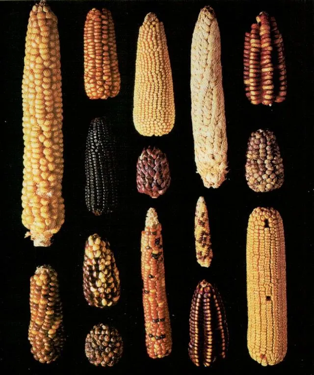
  * **雌雄同株自花传粉**的植物比例很高，这些植物可以稳定地遗传有用的性状，如大粒、无毛刺、无毒素等
    * 大多数野生植物或者是定期进行**异花传粉**的**雌雄同株**，或是包含**单独的雌雄个体**，从而无可避免地依赖其他个体来进行授粉；因此，大部分作物都来自**少数野生植物**，这些野生植物或者是通常**自花传粉**的**雌雄同株**，或者是靠**无性繁殖**来繁殖自己
    * 自花传粉植物也给早期的农民带来了方便，因为这些植物偶尔也会**异花传粉**，从而产生了可供选择的新的植物品种
  * 拥有**高蛋白质含量**的作物，如**小麦**，蛋白质含量高达8%—14%，比亚洲的水稻和美洲的玉米**更有营养价值**
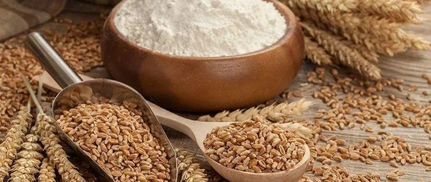
* 然而，新月沃地的地中海气候带**向西延伸**，经过南欧和西北非的广大地区；世界上还有**4个**类似地中海气候带的地区：加利福尼亚、智利、澳大利亚西南部和南非
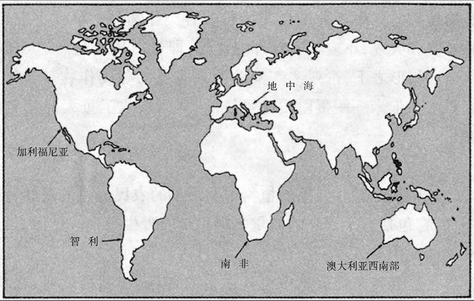
  * 原来的地中海气候带，尤其是在新月沃地那个地区，具有胜过其他地中海气候带的**5个有利条件**
    * 第一，**欧亚大陆西部**显然是世界上属于地中海气候带的**最大地区**；因此，那里的野生动植物**品种繁多**，超过了澳大利亚西南部和智利这些比较小的地中海气候带
    * 第二，在地中海气候带中，欧亚大陆西部的地中海气候带的**气候变化最大**，每一季、每一年气候都有不同；这种气候变化有利于植物群中数量特别众多的**一年生植物的演化**
      * 最有价值的**禾本科植物**以压倒优势集中在**欧亚大陆西部**的地中海气候带
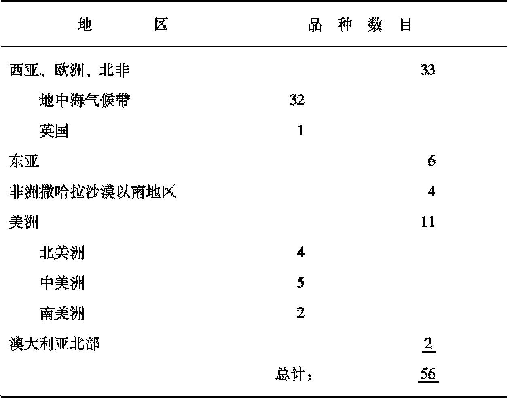
    * 新月沃地的地中海气候带的第三个有利条件，是它在短距离内**高度和地形的富于变化**
      * 它的高度从地球上的**最低点**（死海）到**18000英尺**的高山（在德黑兰附近），应有尽有，从而保证了**环境的相应变化**，也因此保证品种繁多的野生植物可供成为作物的祖先
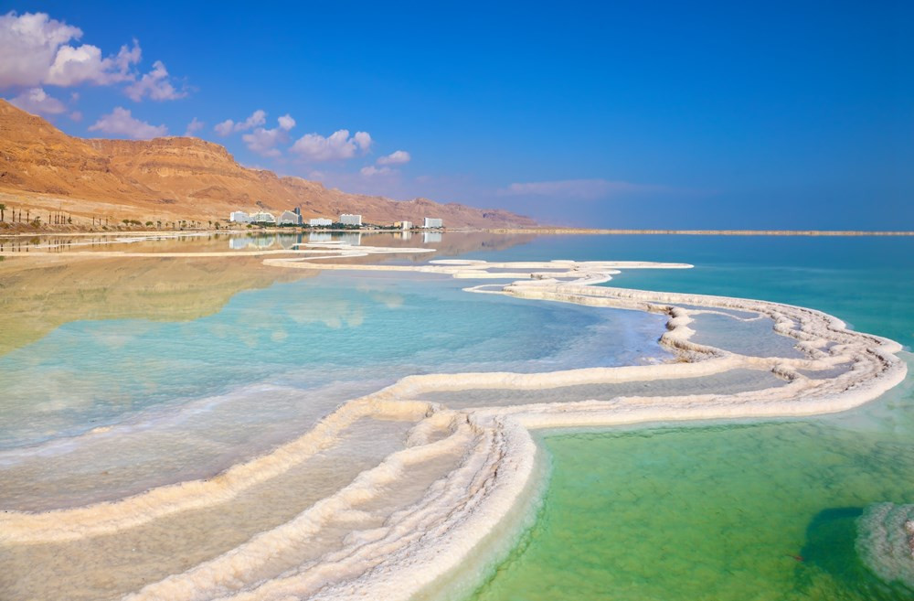
      * 新月沃地的高度变化意味着可以把**收获季节错开**：高地植物结籽比低地植物多少要晚一些；因此，狩猎采集族群可以在谷物种子成熟时沿着山坡逐步向上去收获它们，而不是在一个高度上由于收获季节集中而无法应付，因为在那里所有谷物都是同时成熟的
    * 新月沃地在很小距离内的生物多样性，帮助形成了第四个有利条件——那里不仅有大量的重要作物的野生祖先，而且也有**大量的得到驯化的大型哺乳动物的野生祖先**
      * 有**4种大型哺乳动物**——山羊、绵羊、猪和牛——很早就在新月沃地驯化了，可能比世界上其他任何地方除狗以外的其他任何动物都要早；这些动物今天仍然是世界上**5种**最重要的已驯化的哺乳动物中的4种
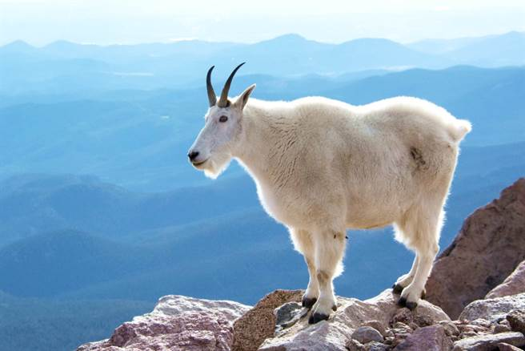
    * 新月沃地早期粮食生产的最后一个有利条件是：同包括西地中海沿岸在内的一些地区相比，那里所面临的**来自狩猎采集生活方式的竞争**可能要少一些
      * 在新月沃地，从狩猎采集向粮食生产的转变是比较快的：迟至**公元前9000年**，人们还没有任何作物和家畜而完全依赖野生的食物，但到**公元前6000年**，有些社会已几乎完全依赖作物和家畜了
* 新月沃地的农业开始于对所谓8大“**始祖作物**”的早期驯化（因为是这些作物开创了这一地区的、可能还有全世界的农业）；这8大始祖作物是谷类中的二粒小麦、单粒小麦和大麦；豆类中的兵豆、豌豆、鹰嘴豆和苦巢菜；以及纤维作物亚麻
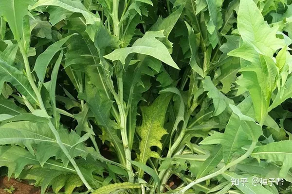
  * 在这8种作物中，只有**亚麻**和**大麦**这2种在新月沃地和安纳托利亚**以外地区**有广泛的野外分布
  * 还有2种始祖作物只有很小的野外分布，一种是**鹰嘴豆**，只限于土耳其东南部，还有一种是**二粒小麦**，只限于新月沃地本身
  * 相反，这8大始祖作物中有**2种**除新月沃地外不可能在世界上的任何地方得到驯化，因为它们在其他地方**没有野生分布**
* 由于能够得到合适的野生哺乳动物和植物，新月沃地的先民们能够为集约型粮食生产迅速装配起一个**有效而平衡的生物组合**
  * 这个组合包括作为**碳水化合物**主要来源的3种谷物，作为**蛋白质**主要来源的4种豆类（含蛋白质20%至25%）和4种家畜，再以小麦的丰富蛋白质为补充；以及作为**纤维和油**（叫做亚麻籽油：亚麻籽含有约40%的油）的来源之一的亚麻
## 新几内亚与美国东部
* **新几内亚**是仅次于格陵兰的**世界第二大岛**，它在澳大利亚北面，靠近赤道
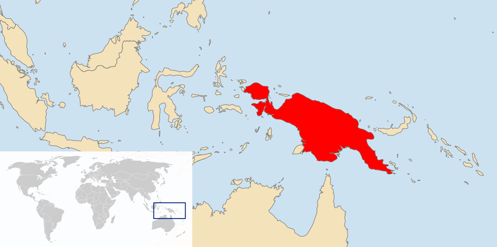
  * 由于地处热带，加上十分多样化的地形和生境，新几内亚的动植物品种**非常丰富**，虽然在这方面它因是一个海岛，比起大陆热带地区来有所不及
  * 人类在新几内亚至少已生活了**40000年**之久——比在美洲长得多，比解剖学上的现代人类在欧洲西部生活的时间也稍长一些；因此，新几内亚人有充分的机会去**了解当地的植物群和动物群**
  * 在新几内亚，**狩猎采集**的回报还没有丰厚到可以打消发展**粮食生产**的积极性；内地的有些**低地**人今天仍然过着狩猎采集生活，但在新几内亚**高原**地区，没有任何居民仍然过着狩猎采集生活
  * 考古学的证据表明，新几内亚**农业起源**很早，可以追溯到**约公元前7000年**；在这早期年代里，新几内亚周围的所有陆块仍然只有狩猎采集族群居住，因此这一古老的农业必定是在新几内亚**独立发展**起来的
  * 在本地驯化的这些植物中位居最前列的是现代世界的主要作物**甘蔗**，今天甘蔗年产量的总吨数几乎等于第二号作物和第三号作物（小麦和玉米）产量的总和；其他一些肯定原产新几内亚的作物是香蕉、坚果树、巨大的沼泽芋以及各种各样可吃的草茎、根和绿叶蔬菜
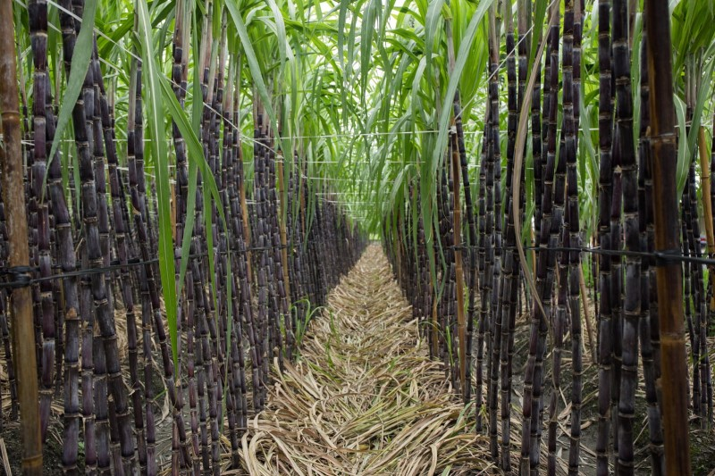
* 然而，结果证明，新几内亚的生物区系受到**3个方面的严重限制**
  * 在新几内亚没有任何驯化的**谷类作物**，而在新月沃地、萨赫勒地带和中国都有几种极其重要的谷类作物
    * 新几内亚未能出现谷物农业的一个可能的原因，是那里的野生起始物种具有一种引人注目的缺点：世界上56种种子最大的野生禾本科植物**没有一种**是生长在那里的
  * 其次，新几内亚的动物群中没有任何可以驯化的**大型哺乳动物**
    * 现代新几内亚驯养的动物只有猪、鸡和狗，它们也都是在过去几千年中经由印度尼西亚**从东南亚引进**的
    * 因此，虽然新几内亚的低地居民从他们捕捉到的**鱼类**获得了蛋白质，但新几内亚的高原地区的居民在获得蛋白质方面受到严重的限制，因为给他们提供大部分卡路里的主要作物（芋艿和甘薯）的**蛋白质含量很低**
    * 新几内亚高原地区的儿童患有**膨胀病**，这是饮食量多但蛋白质缺乏所引起的典型的疾病；新几内亚人无分老幼，常常吃老鼠、蜘蛛、青蛙和其他**小动物**，而在别的地方，由于能够得到大型家畜或大型野生猎物，人们对那些东西是不屑一顾的
  * 最后，以往新几内亚能够得到的**根用作物**不但蛋白质少，而且**卡路里也不高**，因为这些作物在如今生活着许多新几内亚人的高地上生长不好
    * 然而，许多世纪前，原产于南美洲的**甘薯**传到了新几内亚，它先由西班牙人引进菲律宾，后来大概再由菲律宾传到新几内亚的
  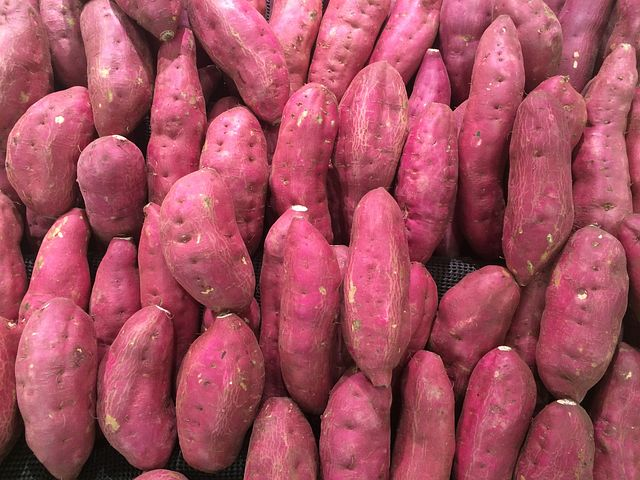
    * 甘薯引进的结果是**高原人口激增**；就是说，虽然在甘薯引进前人们在新几内亚高原地区从事农业已有数千年之久，但当地现有的作物一直**限制**着他们在宜居高原地区所能达到的**人口密度**
* 关于本地农业显然受到当地植物群的限制这个问题，另一个例子来自**美国东部**
  * 人们对美国东部早期发展的**了解**，要比对新几内亚早期发展的了解多得多：美国东部最早的农民所种植的作物已经得到确认，当地植物驯化的年代和作物序列也已为人们所知
  * 原来美国东部的始祖作物是**4种植物**，它们在公元前2500年至前1500年这一时期得到驯化，比新月沃地的小麦和大麦的驯化时间**晚了整整6000年**
  * 当地的一种**南瓜**属植物不但能产生可吃的种子，而且还可用作小型容器；其余3种始祖作物完全是因为它们可吃的种子才被人栽种的（**向日葵**、一种叫做**菊草**的雏菊亲缘植物和一种叫做**藜**的菠菜远亲植物）
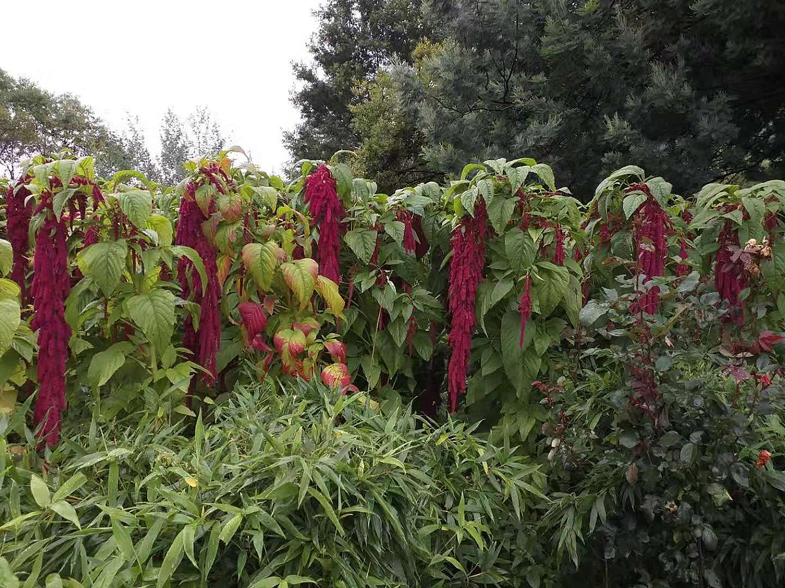
  * 但4种种子作物和一种容器远远够不上完全的粮食生产组合；这些始祖作物在20000年中不过是饮食的小小补充，美国东部的印第安人仍然主要地依赖**野生食物**，尤其是野生的哺乳动物和水鸟、鱼、有壳水生动物和坚果
  * 直到公元前500年至前200年这一时期，在又有**3种种子作物**（萹蓄、五月草和小大麦）得到栽培之后，农业才成为他们食品的主要部分的来源
* 美国东部的这些作物的大多数虽然在**营养方面**有其优点，但它们在其他方面也存在**严重的缺点**
  * 藜属植物、萹蓄、小大麦和五月草的**种子很小**，体积只有小麦和大麦种子的1/10
  * **菊草**是靠风媒传粉的**豚草**的亲缘植物，而豚草是众所周知的引起**花粉病**的植物；同豚草的花粉一样，凡是在菊草长得茂盛的地方，菊草的花粉都会引起花粉病
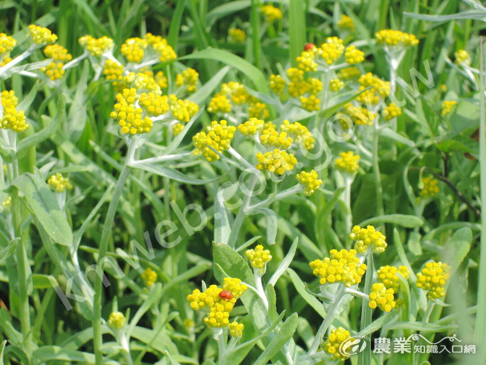
  * 美国东部的印第安人没有驯化过任何可在当地得到的豆类、纤维作物、水果树或坚果树；除了**狗**，他们**没有任何家畜**，而狗大概也是在美洲的其他地方驯化的
* 公元元年后，墨西哥的一些作物最后经由贸易路线开始到达美国东部；**玉米**是在公元200年左右引进的，但在许多世纪中，它所起的作用始终较小
  * 最后，在公元900年左右，一个适应北美洲短暂夏季的新品种的玉米出现了，而在公元1100年左右随着豆类的引进，墨西哥的**玉米、豆类和南瓜**属这三位一体的作物体系便齐全了
  * 到欧洲人于公元1492年开始在美洲殖民时，菊草作为一种作物已经**消失**了；在美国东部所有这些古代特有作物中，只有2种（向日葵和东部南瓜）能够同在其他地方驯化的作物相媲美，并且**至今仍在种植**
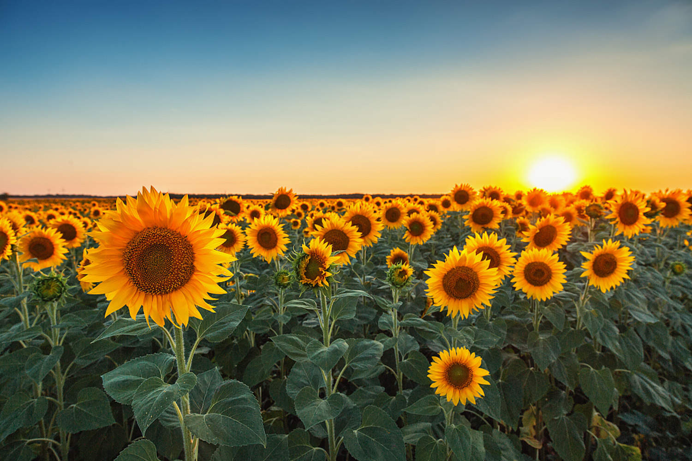
  * 这个结果也表明了印第安人没有受到**文化保守主义**的束缚，而是在看到一种优良的植物时完全能够**认识到它的价值**；因此，同在新几内亚一样，美国东部土生土长的粮食生产所受到的限制，不是由于印第安人本身，而是完全决定于**美洲的生物区系和环境**
* 美国东部的印第安人对他们周围的野生植物中潜在的主要作物**并未视而不见**；即使是用现代科学知识武装起来的20世纪**植物育种专家**，在利用北美的野生植物方面也**很少取得成功**
  * **苹果**在历史上是最难栽培的果树之一，也是在欧亚大陆驯化的最后一批主要的果树之一，因为苹果的繁殖需要**复杂的嫁接技术**
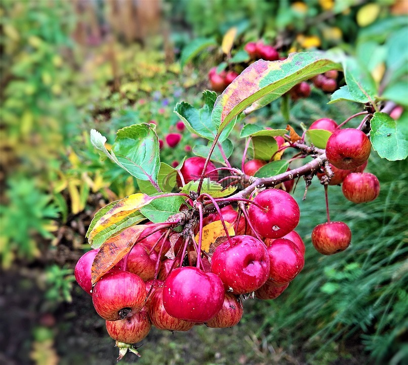
  * 直到**希腊古典时期**，即欧亚大陆粮食生产开始出现后**8000年**，即使在新月沃地和欧洲也没有关于大规模驯化苹果的证据
  * 如果美洲印第安人开始以同样的速度发明或学会嫁接技术，并终于也驯化了苹果，那也要在**公元5500年左右**，即北美在公元前2500年左右出现植物驯化后大约8000年