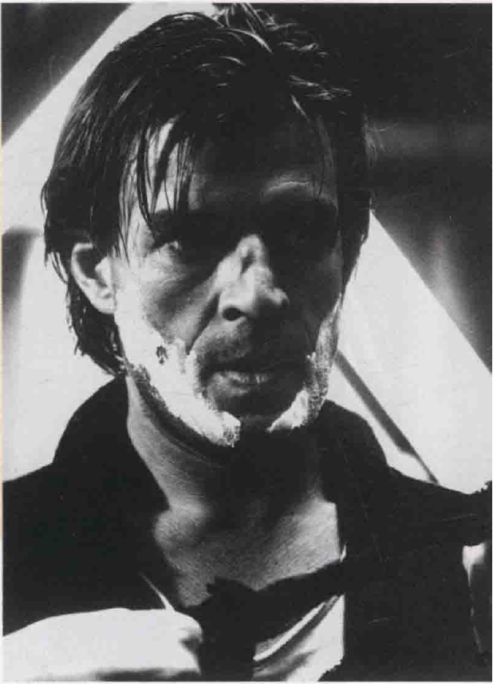

[TOC]
# 剪辑（1）
* 以上所言，考虑的都仍是**单个镜头**（sot），是电影组成的基本单位；除了游动及冗长的镜头外，电影中**镜头的并置**会产生意义，并形成**剪辑的段**，如何组织多种镜头，成为一个整体，便是**剪辑**的问题
* 剪辑是将镜头事先组成“**景**”（scene），在最机械性的层面，剪辑排除掉不需要的时间和空间；经由意念辅助，剪辑连接两个镜头、两个景等等
  * 如此看来，剪辑的发明代表了影评人**特里·拉姆赛**（Terry Ramsaye）所谓的电影“**文理**”（syntax）；就如语言之文法结构，剪辑的文理也得学习，而不是天生就会
* 就艺术而言，剪辑可不理会任何技术上的公式，而**自成一格**
  * 例如，《**猎鹿人**》原始三个小时版本在第一次试片时，大部分观众反应均非常热烈，只是觉得片首那场**长达一小时的婚礼**应剪短一点；因为就情节而言，那场婚礼中并无许多戏或事件“发生”，它的存在主要是抒情的效果——是场象征小区人们情感交融的**社交仪式**
  * 在故事中它真的可以安排成仅有几分钟的银幕时间；后来较短的版本放映后，观众却有负面的反应，使得**奇米诺**与他的剪辑师**彼得・钦纳**（Peter Zinner）赶忙把剪掉的部分接回去
  * 这段漫长的婚礼并非**故事内容本身**需要，而是**情感经验**上的价值需要，它给本片剧情提供一种**平衡**：主角在后段越战戏中忍受炮火摧残，正是为了小区团结一体而战

* 一场戏究竟如何剪，当看**是谁**操剪；**剪辑师**要强调什么，可以**非常主观**
  * 如这场家族吵架戏，显然偏重于右下角被虐的**妻子**（岸惠子饰）和她凶恶的**丈夫**（中间偏左角），她的姐妹和姐夫都站在后面看着
  * 如果换一个剪辑师也可能偏重于**任何另外四个角色**，赋予他们更多的反应镜头从而使他们更突出，也就是说整场戏由他们**个别的视角出发**；简言之，不同的剪法可以有六个**不同的故事**

* 很多人说到电影总说**节奏**“慢”、“快”；总的来说，电影节奏决定于其**题材**——惊悚片一般会比含蓄的心理剧节奏快，但也和**导演的脾性**有关
  * 比方说《**十二宫**》和《**碟中谍3**》都是惊悚片，但芬奇处理旧金山一直未破案的连续杀人事件缓慢沉重，和他其他作品，如《**异形3**》（Alien）、《**搏击俱乐部**》（The Fight Club）、《**本杰明·巴顿奇事**》（The Curious Caseof Benjamin Button）一样；反之，《**碟中谍3**》与其他动作片一样动作奇快
  * 一般好莱坞电影全片约1000个镜头，动作片平均2000个镜头，一般电影每个镜头表达5至8秒，惊悚片则2至4秒；大家认为当今的观众在游戏、电视遥控器以及长期看动作片中长大，如果不在分秒中给他们一些爆破高潮，他们绝坐不住的

* 根据处理剪辑的方法或对剪辑的诠释可分成下列**几种剪辑风格**：最不具操控意味的是中间无任何剪辑的“**段落镜头**”（sequence shot）；浓缩各镜头动作、传达出同一时空中的连续性处理，称为“**连续性剪辑**”（cutting to continuity）；“**古典剪辑**"（classical cutting）则是加强某些细部胜于其他元素以解释某动作意义的剪辑手法；“**主题蒙太奇**”（thematic montage）则主张一个主题论点一连接有关主题的概念镜头；“**抽象剪辑**”
（abstract cutting）则是纯粹形式主义的剪辑风格，与任何可辨识的题材无关

## 连续性
* 早期（即19世纪90年代末期）的电影都**很短**，只是一个**远景的单一镜次**，事件的长度和镜头长度是一样的；后来才有一些导演开始说**故事**（简单但需要更多镜头的故事）
  * **卢米埃尔兄弟**被公认为**纪录片之父**，他们的一些真实事件短片是最原始的**单镜头纪录片**；这些早期的新闻片包含好几个片段，但每一段几乎甚少有剪辑的痕迹，这也就是**段落镜头**

* 20世纪初，导演已经发明出一种实用的剪辑风格，称之为**连续性剪辑**（cutting to continuity）
  * **梅里爱**是第一个发展出连续性剪辑的人，他将故事的段落以**淡入淡出**（fade）来连接，当银幕上光线淡出变成全暗，再渐淡入到下一场戏，通常已换了**另一个时空**，虽然可能还是相同的角色

  * 这种剪辑法至今仍沿用于**剧情片**中（如果只是为了说明场景）；这种剪辑风格是一种速记式的、由来已久的习惯，连续性剪辑是不完全表现全部而能保留事件的**连贯性**

  * 连续性的剪辑，简言之即尽量在连接两个镜头时，使动作维持**连续性**；比如一个女子**下班回家**可分为五六个镜头：（1）女子关办公室的门进入走廊，（2）走出办公大楼，（3）开车门发动车子，（4）在高速公路上开车，（5）车子转入家中车道；这整个**四十五分钟**的动作在电影中只占**十秒**，是一种**谨慎的浓缩**
  * 为了使动作看起来**连贯而具逻辑性**，所有的动作会维持**同一方向**，**因果关系**也必须清楚；例如，这个女子在这个镜头内是由右向左移动，到另一个镜头是**由左向右**，我们会认为她要回办公室，如果这个女子突然刹车，导演得**补个镜头**，好让观众知道她为什么这么做
* 如果时空跳得太突兀，或引起观众的困扰，就成了**跳接**（jump cut）

  * 为了使转场不会太突兀，导演通常会在场景开始或故事开头用**建立镜头**（establishing shots）

  * 一段场景确立后，再切至中景、特写，中间可能有一段始于**再建立镜头**（reestablishing shot）——如同开场的远景镜头，重新提供观众另一个环境脉络；不同的镜头间，其时空可以含蓄地延长或压缩

* 在**格里菲斯**之前，电影多是以一个**固定的远景镜头**拍摄，位置大约等于剧场中最前排的位置，而将**内景和外景的镜头**剪碎，观众就如身居两地一般；此外，电影里的时间和真实的时间**不同**，这个时期的导演都根据**镜头持续的时间**做主观的判断，来决定电影的时间
## 格里菲斯与古典剪辑
* 格里菲斯被称为**电影之父**，不仅因为他稳固并扩充了早期的**电影技巧**，也因为他是第一个将电影引入“**艺术**”范畴的人；事实上，他对**电影艺术基本语言**的贡献超过电影史上任何人
* 电影学者将这种剪辑语法称为**古典剪辑**（classical cutting）；在他1915年的杰作《**一个国家的诞生**》中，即以古典剪辑作为主要的风格

  * 古典剪辑比连续性剪辑更进一步，其剪辑目的在于**加强戏剧性**，强调**情感**而不是简单的连续性而已；格里菲斯史无前例地以**特写**制造戏剧效果，他是第一个用特写做**心理效果**者：观众可以看到演员脸上微妙的表情，使演员也不必一径挥臂撕发地夸张表演
  * 动作的戏分成**零碎的镜头**，使格里菲斯能交代**更多细节**，也掌握观众的反应；他仔细安排远景、中景和特写，能借强化、连接、对比、平行等方法，不断**改变观众的观点**
  * 换句话说，剪辑已不是功能性的连接，而带有**戏剧目的**
* 古典剪辑**精致的形式**中可呈现一连串的**心理效果**——镜头不依真实生活来剪
  * 例如四个角色在一个房间内，导演在两人对话时先剪一个说话者说话时的**主观镜头**，再剪一个第三个人倾听的**反应镜头**（reaction shot），再剪说话人的**二人镜头**（two-shot），最后剪入**第四个人的特写**
  * 古典剪辑法重点在为了强调戏剧点而刻意**凸显可能被忽视的细节**；例如**约輸·休斯顿**导演的这场拳击戏大可以用**一个镜位**交代（a），但他却根据人物之间，如主角（拳手）（b）和经纪人（c）以及观众席上的两个朋友（d）的心理活动和反应来剪辑，以增加**戏剧张力**

  * 镜头段落代表一种**心理上的因果关系**，也就是说，将镜头打碎是因戏剧考虑；一场戏也可以**一个镜头**拍摄，使用距摄影机较远的镜位，这种镜头被称为**主镜头**（master shot）或**段落镜头**（sequence shot）
* 美国制片厂**黄金时代**（约从20世纪30年代至40年代），导演多采用**主镜头**技巧
  * 也就是说，用**远景**完整地拍下**整场戏**作为主架构，然后再重复用**中景**或**特写**拍**个别演员或细节**，再由**剪辑师**决定如何组成其**故事连续性效果**
  * 因为可选择的镜头多了，如何组成一场戏常会引起**争论**，有时，在合约中即载明导演有权做**初剪**（rst cut），不过，制片厂往往有权做最后的**定剪**（final cut）；导演为了避免这种争议，可能**不采用主镜头方式**
  * 大部分导演仍**仰赖主镜头**，以免剪辑时材料不够，在复杂的战争场面中，导演会多拍许多**补充镜头**（cover shots），即用来替代、转换及再建立另一场景的镜头；格里菲斯拍《**一个国家的诞生**》时，用了许多架摄影机来拍摄战争场面，黑泽明的《**七武士**》（The Seven Samurai）也用了同样的方法

* **格里菲斯及古典主义导演**发展出一些他们称之为“**看不见**”（invisible）的**剪辑技巧**
  * 其中之一即是“**视线连线**”（eyeline match，又译：视线匹配）；如我们假设角色B在角色A的左方，那么A面向景框的左方，再从他的观点切到角色B，造成**因果关系**

  * 另一种古典剪辑是“**动作连续性**”（matching action，又译：匹配动作）；角色A正从椅子上起身，再切至他起身后离去的镜头，其目的在于使动作流畅，用不引人注意的连接来掩饰切换的痕迹

* 虽然自大制片厂时代起，“**180°线的规则**”就备受质疑，但至今仍有人遵行（**约翰·福特**就喜欢违反这个规则，他喜欢违反任何规则）
  * 这种手法和**场面调度**较有关联，其目的在于**稳定表演空间**，使观众不致混淆或迷惑
  * 从**鸟瞰**（bird's eye）的角度看一个景，一条“**动作轴**”（axis of action）的**假想线**穿过景的中央；角色A在左方，B在右方
  * 如果导演要拍**二人镜头**，他得用1号摄影机，如要拍**A的特写**（用2号摄影机），摄影机得在**180°线的同一侧**，以使**背景相同**，如要拍**B的特写**（用3号摄影机）也是一样

  * 在拍摄**反角度镜头**（reverse angle shot，又译：交替拍摄镜头、反打镜头）时（通常是对话场面），导演会逐个镜头仔细地确定角色的位置；例如在第一个镜头中A在左方，而B在右方，那么导演得**越过B的肩膀**来拍“反角度”镜头，虽然这样一来就不遵守180°线的规则，但观众仍能接受

  * 即使是目前，导演也很少让摄影机**越过假想线**，除非他们想造成**混乱的效果**；例如，在打斗或发生混乱冲突的场面，导演会用违反180°线规则的方法造成威胁、迷惑、焦虑的感觉

* 格里菲斯最著名的是他片尾的**追逐片段高潮**；这些段落多采取**平行剪辑**（parallel editing）方式，即两个（或三四个）不同场景不时地**交叉剪辑**（cross cutting），使之产生同时发生的幻觉
  * 比如《**一个国家的诞生**》片尾，格里菲斯安排了**四场戏的交叉剪辑**，追逐段落**越接近高潮**时，每个镜头的长度就**越短**，悬疑也越被**加强**；这组段落持续了20分钟，但交叉剪辑的效果（平均每五秒换一个镜头）却表现了**速度和张力**
  * 一般而论，分镜越多，**速度感**就越强；为了不使电影单调沉闷，格里菲斯常常**改变镜位**，如大远景、远景、中景、特写、角度、灯光和摄影机运动（架在轨道上）
* 如果一个段落的连续性是**合逻辑**的，**空间的零碎**不会造成太大的问题，但**时间**的问题则较麻烦
  * 在电影中，时间的处理比空间还**主观**，数年的时间可**压缩**成两小时的放映时间，而短短的一秒钟也可**延长**到数分钟；**剪辑与分镜**也能改变时间的感觉
  * 尽管有些导演尝试将银幕时间**等同于真实时间**，如阿涅斯·瓦尔达（Agnes Varda）的《**五点到七点的克莱奥**》（Cleo From Five to Seven），或弗雷德·齐纳曼的《**正午**》（High Noon），其剧情时间与放映时间同样是两小时；但大部分时候，导演会在**说明性的开场**借剪辑来**压缩**，而在**高潮**时**延长银幕时间**
    * **齐纳曼**的电影《**正午**》是难得一见地真正依照**时空动作真实时间**拍摄而成，全片在令人屏息的84分钟里完成

* 镜头的**时间长**短常与**内容、题材**有关
  * **远景镜头**的视觉因素多半比**特写**丰富一点，而且在银幕上呈现的时间需要**更长一点**，但这只是较机械的说法；事实上，许多剪辑得靠创者**直觉**
  * 早期电影理论家**雷蒙德・斯波斯伍德**（Raymond Spottiswoode）为，切换点必须**恰到好处**，才能达到最好的效果：如果切得太晚，会有**拖延乏味**之感，切得太早则观众**无法领会**其视觉效果
* 但剪辑时对时间的处理大都是**依靠本能**，而不遵守这些机械性的规则
  * 大部分**好导演**常自己操作剪辑，或起码和剪辑师密切合作；格里菲斯对节奏和速度相当敏感，能够**配合题材与气氛剪辑**
  * 比如说，**爱情场面**用的是**较长的抒情镜头**，分镜也减少；**追逐和战争**的场面，则用**短而快的镜头**
* 剪辑其实**没有定规**
  * 有些剪辑师根据**音乐的韵律**剪辑，例如军队的行进可依军歌的旋律剪，**金·维多**（King Vidor）的《**大阅兵**》（The Big Parade）就是最好的例子

  * 有时导演会**提早切换镜头**，特别是在**悬疑性很高**的戏中；**希区柯克**往往用剪辑来吊观众胃口，不到戏剧高潮，镜头已经剪掉
  * **安东尼奥尼**则相反，往往在高潮过后，镜头仍**拉得很长**，节奏沉闷而单调，导演希望观众能和角色一般产生**疲惫之感**，安东尼奥尼的角色通常都是非常疲累的人
    * 强调心理情境的电影常会运用动作的**纵向移动**，以造成沉缓、无力的感觉，此种镜头需要“**期待式**”的镜位，让观众**早已看到**主角的目的地
    * 此处，女主角在旅馆寻觅其爱人的过程象征其**恋情的乏力**，层层门廊代表了她**一再经历的挫折**；这个镜头的许多意义来自时间持续的概念，空间在此用来**暗示时间**
    * 此片在戛纳影展放映时，有些影评人不断对着银幕喊道：“剪！剪！”安东尼奥尼这个手法被人误以为他对剪辑不纯熟，然而他的大多数影片是关于**精神的腐蚀**，《**奇遇**》的缓慢节奏是为了**配合影片的主题概念**

  * 不必遵守**一般剧情片**的剪辑传统，**歌舞片**经常被剪辑成**极端的形式主义风格**
    * 《**西区故事**》的剪辑非常抽象，此片音乐是由**伦纳德·伯恩斯坦**（Leonard Bernstein）所编写，**杰罗姆·罗宾斯**编舞，经过剪辑后造成**极大的美学效果**
    * 剪辑在此不只是为了顺应故事发展，或借由某些主题原则将几个相关的镜头连在一起；当然，这些镜头的串连主要是为了呈现**抒情和活力美**，看起来颇有点音乐MV的味道

  * 在**先锋派影片**中，题材通常被压抑，或转化成**抽象的图形或数据**，镜头之间的连接与故事无关，而依据作者**纯然的主观或形式上的考虑**
    * 和欧洲许多同辈的抽象艺术家一样，**里希特**是“绝对电影”的佼佼者，他的作品都是单纯图像的设计，它们就像抽象画之舞般难以理解

  * **卡普拉**是古典剪辑大师，他的剪辑风格**既快且轻又准**，且**不炫耀**；其实，如同许多其他技巧，剪辑也是**为角色人物的动作需要服务**—这正是古典剪辑的基本宗旨
    * 在此景中，卡普拉加入一个“**反应人物**”（reactive character）——引导观众对剧情反应的人，他代表一般人对一些事物做必然反应
    * 图中是主角（史都华，右）正与左边的天使说话的镜头，他的守护天使向他解释为什么自己不是一个很杰出的天使（他还没有翅膀）；站在中间的汤姆·法登无意间听到，被吓得一愣一愣
    * 在这场喜剧中，只要天使讲到一些怪异的话，卡普拉就剪到汤姆的**反应镜头**

* 剪辑的另一个准则是**圆融**，但要处理得好不容易，因其太依赖**上下文的关系**
  * 无论是真实生活还是看电影时，观众都不喜欢有**明显的提醒**；陈腐的导演总是以**情绪性的镜头**来表现，生怕我们错过了重点
* 为什么有的导演**剪辑**，有的导演却把所有变动放在**同一镜头**内？还有导演宁可让**摄影机随动作移动**也不剪成不同镜头？
  * 对观众而言，这其间的分野意义不大，但严肃的电影工作者知道这三种技巧显示**不同的心理暗示**
  * 《**低俗小说**》这场戏发生在餐馆狭窄的座位中；照理说，导演可以把两人放在同一个镜头内，让他们**侧面对侧面**，但这场戏却使用**另一个策略**
    * **特拉沃尔塔**演一个**吸毒的职业杀手**，他的老大出城时要他带**老大的妻子**去吃饭；他小心翼翼地面对她的轻浮和不按牌理出牌，惟恐一不小心就会要了他的命，所以对她“**保持距离**”——他的疏离使她着迷
    * **塔伦蒂诺**将两人分隔在两个镜头，用传统的**正反打镜头**技巧对剪，强调他俩的**心理距离**

  * 《**角斗士**》此镜头很**真实**，令人同情的主角被饥饿的老虎和敌对的巨人困在同一画面中，两者都要摧毁他
    * 电影里，斯科特将三者**分开拍**显现其悬疑性，但只有像这样将三者放在**同一狭小的画面**内打斗，才传达出巨大的危险

  * **斯科塞斯**是个杰出的剪辑师，也是动感大师，他经常宁可**随动作跟拍**而合弃细碎的分镜；为什么？多半是因为随动作移动的摄影机看来**更流畅和抒情**（也较贵较耗时）
    * 比如《**好家伙**》的这场**跳舞戏**，斯科塞斯要摄影机随二人起舞打转，借此强调他俩的快乐；这种**自然的爆发性**使视觉材料**不稳定**，也使动作充满**活力和电影动感**，好像摄影机也开心了一样

* 格里菲斯在剪辑上最前卫的实验是1916年的《**党同伐异**》，他将剪辑推到**主题性蒙太奇**（thematic montage）的高潮

  * 这部电影和这种技巧对20世纪20年代的导演有很大的影响，尤其是**苏俄导演**；主题性剪辑着重“**意念**”的**联络**，而无视于实际时间与空间的连续性
  * 《党同伐异》的主题是人类对待其他人的**欠缺人性**；格氏大手笔地将古巴比伦、耶稣受难、16世纪法国大屠杀，以及当时的美国（1916年）劳资冲突做成**四大段落**
  * 这四段并非分别处理，而是**平行剪辑**，一个时代的戏插入另一个时代中；尤其结尾时，首段末段均是追逐戏，第二段是耶稣的缓慢受刑，第三段是悬疑而惨烈的屠杀，四个高潮被**剪在一起**

  * 几百个镜头，**时空迥异**，惟有**主题一致**；这种大手笔的剪辑，已不是纯为连续性或心理效果
  * 《**古尔德的32个极短篇**》融合了纪录片、剧情片及先锋派影片**三种类型元素**，它的剪辑风格也十分主观
    * **纪录片部分**包括古尔德生前的记录片段，一位颇富争议性且极度不平凡的加拿大钢琴家，被认为是20世纪重要的音乐家之一；虚构的**剧情片部分**是由科尔姆·费奥尔演出这位天才在世时一些古怪、奇特的言行
    * 影片本身并非是直线叙事，而是一系列片段，根据巴赫著名的32段的《**哥德堡变奏曲**》（Goldberg Variations）——古尔德最为人津津乐道的表演曲目而来
    * 因此全片以**概念结构**，而不是一个线性叙事的故事；**主题蒙太奇剪辑**正是此片的手法

* 有些导演好用格里菲斯的方法**处理时间**
  * 如**西德尼·吕美特**在《**当铺老板**》中以剪辑手法制造一连串**平行的画面**，其目的是使**主题重于时序**，他的剪辑手法**很难察觉**，某些镜头只出现一秒钟
    * 本片主角是个从纳粹集中营生还的中年犹太人，其亲朋好友皆死于集中营，他企图压抑这段回忆，但却徒劳无功；吕美特用几个**回忆镜头**插入现在时空中，来暗示这种心理过程，而现在的事件和过去的事件很相似，当过去和现在并列时，闪动的回忆镜头越来越长，终至**闪回**（flashback）成为主导

  * 有些导演不但插入“过去”的镜头，还插入“**未来**”的镜头，如在**西德尼·波拉克**（Sydney Pollack）的《**孤注一掷**》（They Shoot Horses，Don't They？）中插入**前叙**（lash-forwards，又译：闪进）的审判厅场面
    * 前叙常暗示**宿命**等：如同故事中的舞蹈比赛，前途布满诡诈，而个人的努力等同于自欺

  * 格里菲斯也以**幻想式的插入镜头**来重组时空关系；在《**党同伐异**》中，女孩几乎杀了负心男友时想到她被警察逮捕的样子
    * 通过剪辑，导演可以用**插入幻想**的方式打断现在，显现角色的想法和幻想，比如《**流星之夜**》这部有关第二次世界大战意大利法西斯统治末期，美军正要解放小村村民的电影
    * 故事由一个当年年仅六岁的妇女回忆，这场戏中我们所看到的法西斯恶霸的死法并不是其真正的死法（实际上他是被游击队枪杀的），但却发生在小女孩的想象中：游击队员的穿着有如古代斗士，将他们的愤怒之矛射向恶徒，使他如野猪般被穿心而过的矛刺死

  * 剪辑可使动作/剧情在**现实与超现实幻象**中**快速变换**，这种变换通常会伴随**某种线索**——如怪异的音乐、波浪形的画面，暗示不同的心理层次；有时候，这种转换也可能**无迹可寻**，刻意要使观众知觉迷乱，失去判断力
    * 本片中，男主角**分不清现实与幻想**；这场戏就是他在刮胡子时突然陷于狂乱的精神状态中，他的室友在房外弹奏的音乐更令主角神志不清，主角因而走向室友，紧勒他的脖子
    * 一会儿之后，画面是主角又在刮胡子，但他的室友仍然在房外弹奏音乐，刚才那一幕不过是发生在主角的想象中
    * 由于画面**并没有给予任何线索**，观众于是也坠入现实与幻想的迷雾之中——这正是**本片的主题**，同时也是**编剧创意的起点**

  * 闪回、前叙及转场可使导演**依主题发展其意念**，而不必受时序限制，使他们能自由地探究**时间的本质**；电影的**时间弹性**，使“时间”本身可以成为电影的主题
  * 像福克纳、普鲁斯特等小说家一样，有些导演成功地**打破了机械化时间的独断性**；较为复杂建构时间的例子是《**贫民窟的百万富翁**》（Slumdog Millionaire），由**丹尼·博伊尔**（Danny Boyle）导演。电影背景设在印度之**孟买**
    * 一个贫穷青年参加了电视益智节目《**谁要当百万富翁**》，青年未受过教育，但每个题目都答对了，许多人包括警察都觉得他作弊，以为他早有答案；但我们知道，每个问题出来，导演都**闪回**至青年某个生活片段，益智节目是全片的结构，题题启动青年知道答案的生活片段

  * 现代导演最嗜用的技巧即**多层故事**，用多个角色讲**不同的故事**
    * 但其危险在于观众对故事**混淆不清**，如此片中角色不明，虽然某12场戏突出，表演出色（克鲁尼因扮演良心发现被自己人干掉的中情局特工获奥斯卡奖），却仍让人**难以理解**

* 格里菲斯一手将**剪辑的功用**延展许多，如换场景、时间压缩省略、分镜头、强调心理细节、象征性插入镜头、平行和对比、联想、主观镜头转换、同时性、母题（motif）重复，等等
  * 他的剪辑手法也很经济，**相关的镜头**可以集中起来**一起拍摄**，而不论其在片中的位置（或时空）
  * 特别是最近几年，明星片酬高涨，导演可**不依顺序**在短时间内拍完一位演员的戏分；较便宜的细节（大远景、配角的戏及物品的特写等）也可以在**更方便的时间**拍摄，稍后在剪辑时，这些镜头才被安排在适当的位置
  * 剪辑也经常用来**欺骗/隐瞒事实**；例如，《**闪舞**》中的舞蹈部分都是由**替身**演出，导演利用**灯光以及远距镜头**等，恰当地将这名职业舞蹈家的脸遮起来，并与穿着相同戏服的**珍妮弗·比尔斯**的正面近景表情剪辑在一起
    * 由于**连续的音乐**提供了连续感，比尔斯的插入镜头遂给予一种**动作连续的幻象**，仿佛是她一人跳完全场；这种剪辑技法普遍地运用在武侠片、危险特技表演及其他需要特殊技巧的演出中

