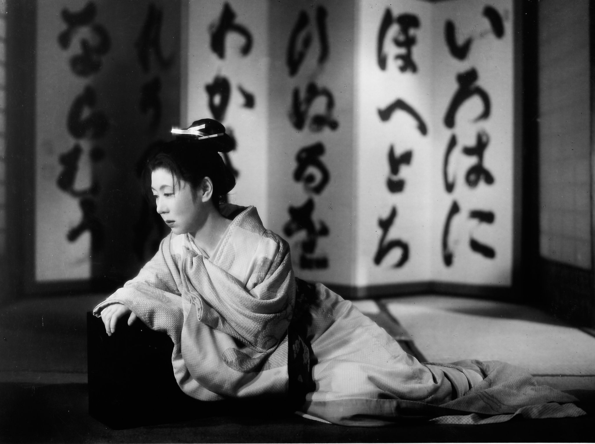
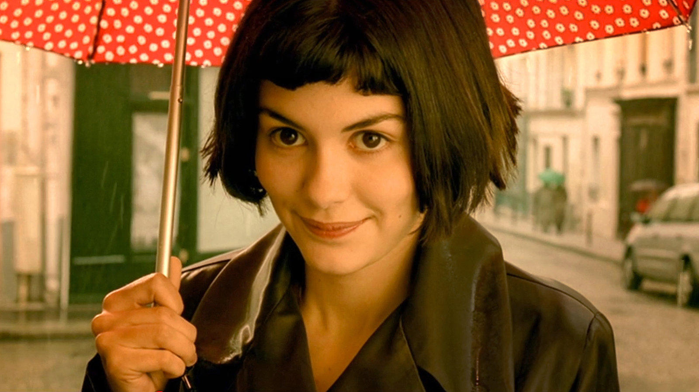
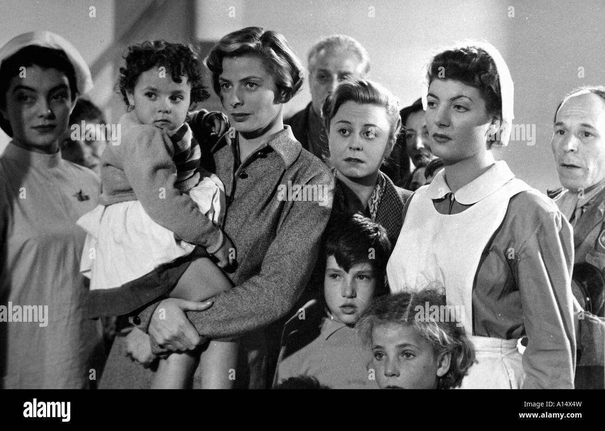
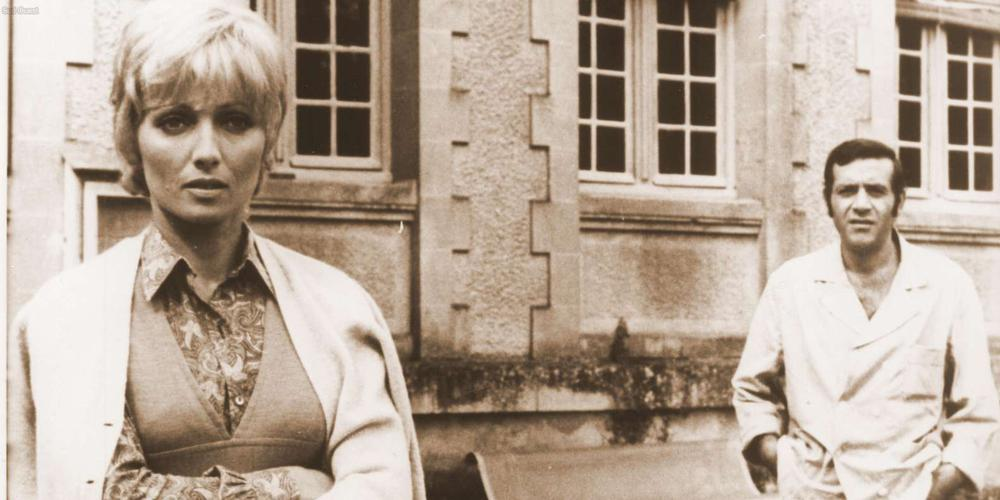

# 剪辑（2）
## 苏联蒙太奇与形式主义传统
* 格氏是个**重实际的导演**，其剪辑观念仍是以有效地传达意念和感情为主；但是他的联想、主题性剪辑方式，却启发了20世纪20年代苏联的创作者，发展出**蒙太奇**（montage，从法文monter而来）
  * **普多夫金**（V.I.Pudovkin）的第一篇论文讨论“**组成剪辑**”（constructive editing），重点即在解释格氏的剪辑概念

  * 但是，他认为格氏的特写镜头仍有限制，其功能仅在**解释远**景，未能开展出新意义；普多夫金坚持每个镜头应有**新的意义**，而剪辑两个镜头“**并列**”（juxtaposition）意义大于单个镜头的内容
    * 《**科洛弗档案**》中导演自始至终都运用普多夫金的剪接想法，运用**正反拍**的对剪技巧可以将实拍场景与虚构场景剪接在一起；此处纽约市民逃到地下铁站内躲避致命的怪物，将怪物与人物对剪，导演可以**加强悬疑**，很少——多半在高潮时——才会把两种生物（人与怪物）合在一个镜头内

    * **希区柯克**是普多夫金剪辑理论的主要实践者，他认为“**电影即形式**”，银幕应该以它自己的语言说话，因此，每一场戏中那些未加工的素材就必须被**分割**成一片一片，然后再组合成具意义的视觉图形，如此才是“**纯粹电影**”，就如同音符是一个一个被组合之后才发出旋律
      * 《**救生艇**》中，所有情节全集中发生在这艘于大海中漂泊的救生艇上的九个人身上，这张宣传照即包含了希区柯克所有未加工的素材，它被分割成的分镜，即组成了该部电影；形式主义者坚持艺术并不存在于素材本身，而在于他们**被分割及重组的方式**之中

* **巴甫洛夫**（Pavlov）的心理学理论对苏联导演的影响很大，他对意念联想的观念是**库里肖夫**（Lev Kuleshov）剪辑观念的基础
  * 库里肖夫认为电影的理念是**零碎片段的组合**，这些片段不完全和真实生活有关
  * 首先，他拍摄了一个面无表情的**演员特写镜头**，将其分别与一碗汤、一具棺材及一个小女孩玩耍的镜头**并列**；把这三组镜头放给三组观众看时，大家的反应**并不相同**，大家都以为演员**很有表达能力**，他的表情根据组别被解释成饥饿、忧伤和快乐

  * 由此可见，意义是由**并列**而非单独的镜头造成；这个实验也证明，有时演员不一定要会演戏，光是镜头的并列，**戏剧的效果**已经凸显
* 库里肖夫及普多夫金将电影当做**镜头与镜头间构筑并列**的艺术；**特写**用得比格里菲斯还多，以环境为影像的泉源，少用远景，而连接**大量的特写**，造成心理与情绪，甚至抽象意念的效果
  * 这一代苏联电影人的理论被当时许多评论者批评：太多的特写不但使**节奏缓慢**，而且破坏真正的时空，剥夺了场景的**真实感**
  * 普多夫金和其他苏联形式主义者却辩解说，用远景来捕捉真实，会使电影**过于接近现实**，是**剧场化**而非电影化；所以他也批判时空写实观念，指其只重表面的真实性，忽略了**真正的本质**
  * 也有些评论者认为这种操纵式的剪辑法**过度引导观众**——替观众选择过多，观众必须被动地坐在那里，接受银幕上的东西；尤其因为苏联电影多半与政治宣传密不可分，限制了观众**自由选择和评估**的机会
  * 有时跳跃式剪辑**完全适用于某些题材**，如《**谍影重重2**》主角得了失忆症，即使对武器娴熟，防卫技巧出色，却弄不清周遭是敌是；跳动的剪辑外塑了他片断的记忆，不时在下意识中晃过，强化了他的恐慌，因为他对种种片断统合不起来

* 和许多苏联形式主义者一样，**爱森斯坦**对研究可促进创作活动的不同形式的理论很有兴趣；他认为，这些艺术理论和所有**人类活动的基本本质**有关
  * 就如古希腊哲学家**赫拉克利特**（Heraclitus），爱氏认为，自然的本质是一个**不断变动**的过程，而且这个变动往往来自冲突和矛盾的**辩证性**（dialectical）；稳定、统一只是暂时的现象，只有能量是永恒的，却永远在变换形式状态

  * 爱森斯坦认为，在所有艺术里，**冲突**是具**宇宙性**的，所以艺术也当捕捉这种变动；电影作为“动”的艺术，不但该包括绘画的视觉冲突、舞蹈的动感冲突、音乐的音感冲突、对白的语言冲突，也该有小说和戏剧的角色、事物冲突
* 爱氏将这些冲突着重表现在**剪辑的艺术**上
  * 与库氏、普氏一样，他也相信电影艺术的根本在于**剪辑**，每个镜头的内容不应该是自足的，而应该与别个镜头**并列**产生新意义
  * 不过，普氏的剪辑观念对他而言还是太“机械化”和“幼稚”；他运用辩证的方法，认为剪辑应是两个镜头（正、反）**冲突**后制造出新的意念（合），镜头的转接不应**圆滑顺畅**（如普氏所言），反而该是尖锐、震撼，甚至**暴力**的
  * 普氏和爱氏的理论虽不尽相同，但**尖锐对比**的效果却完全一样；普多夫金的电影基本上是**古典形式**，他注重累积整体情感的效果，而爱森斯坦的电影则较知性地倾向**抽象的辩证**
  * 普多夫金要**表现情感**时，会运用**现场环境内物体的影像**连接成某种关系，比如它用泥泞中辗过的车子显示焦虑，他用特写拍下车轮、泥泞、推车的手、用力的脸、贲张的肌肉，累积成强烈的情绪效果；而爱氏则希望电影在连续性及文本上是**完全自由**的，他认为普多夫金**太受制于现实主义**
* 爱氏希望电影能**如文学般自由伸展**，尤其运用象征隐喻时，**从不顾及时空**；影像对他而言，不必拘泥于场景内，只要**主题有关联**即可
  * 这种观念，早在1925年他的首部电影《**罢工**》（Strike）中已经得见：被机关枪扫射的工人，接着是待宰公牛的镜头

  * 这种超出场景的隐喻法，在《**战舰波将金号**》（Potemkin）也重复用到，即战舰叛兵发炮反击沙皇部队时，爱氏连接睡狮、蹲狮、快跃而起的站狮石像三个特写，象征沉睡、觉醒及起而反抗

* 《**战舰波将金号**》的“**敖德萨阶梯**”片段是默片中最值得称颂的剪接片段
  * 这场戏是1905年沙皇时代**哥萨克军队屠杀老百姓**的场景，爱森斯坦将不同的人在混乱逃窜中的景象剪接，**延长**了该场戏：（1）母亲在石阶顶上带着婴儿车：（2）哥萨克军人向下面的老百姓随意开火：（3）石阶上群众逃窜的混乱：（4）母亲中弹时捂住腹部；（5）我们看到她焦虑的脸；（6）载着啼哭婴儿的婴儿车一跌，颠簸滚下石阶：（7）陌生的年轻人看着婴儿车一脸惊恐：（8）啼哭婴儿的快速特写：（9）戴眼镜妇人一脸惊恐；（10）剪回母亲，倒地而死；（11）哥萨克军人对着滚下的婴儿车挥舞着剑，年轻人喊叫；（12）快剪滚动的婴儿车；（13）哥萨克军人舞剑向着婴儿车；（14）他发狂的特写；（15）戴眼镜妇人眼睛中枪，她痛得大叫；（16）婴儿车和孩子剧烈翻倒

  * 这些不过是很长的段落中短短几个镜头，也许是爱森斯坦**撞击式蒙太奇**（collisionmontage，又译：冲击蒙太奇）实践最好的范例；导演将许多东西**对立排比**在一起，如特写与远景，垂直线条与水平线条，暗与明，向下动作与向上动作，移动的镜头与不动的镜头，长镜头与超短镜头等等
  * 其实爱氏电影中的表演都很**粗粝**，而且作品都折损于**拙糙的僵化教条主义**，含蓄的政治观从来就不是他的长项；不过《战舰波将金号》的“敖德萨阶梯”这一段却不像他的其他作品般过时，而且依然如当初般**充满力量**

## 巴赞与现实主义传统
* **巴赞**不是导演，而是理论家、评论家，曾任最具影响力的电影刊物《**电影手册**》(Cahiers du Cinema) 主编多年
  * 他的美学观以**现实主义**为主，与形式主义格格不入；他强调电影的**现实主义本质**，也不吝于称赞在剪辑上有杰出表现的作品
  * 他的著作里，都强调**蒙太奇**只是许多技巧的一种，许多时候他深信剪辑甚至会损坏戏的效果
* 巴赞的现实主义美学源自摄影、电视及电影影像自然制造“现实”的观念，其本身己带有**技术上的客观性**，与外在世界有密不可分的关系
  * 小说家和画家都得在另一种媒介上“**再现**”（re-present）现实（经由语言及颜料），而电影的影像本身即是外在世界的记录，比其他所有的艺术都真实
  * 巴赞认为**形式主义技巧**（尤其是主题性剪辑）会摧毁**现实的复杂性**，蒙太奇是将简单的结构强加于多种变化的真实世界，从而**扭曲了其意义**；形式主义的人**自我中心**太重，而且好操纵，视野短浅而窄小
  * 巴赞甚至认为古典剪辑具有**潜在的堕落性**，它将一个完整的景打碎成许多较近的镜头，而且使我们完全无视其**专制性**
* 巴赞喜欢的导演之一是美国的**威廉·惠勒**，他的电影尽量少用剪辑，而用**深焦摄影**（deep-focus）及长的镜次

  * 巴赞认为惠勒的剪辑风格”完全让观众恢复信心，让他们自己去观察，去选择，去塑造意义”
  * **沟口健二**的作品也受到巴费及其追随者的喜爱，他擅长用**长镜头**而较少用剪辑技巧，仅在有大的心理变化时才会在场景中插入镜头；如此，反而比一般常用剪辑来制造连续性的电影更具**戏剧震撼力**

* 不过、巴赞并不是**单纯盲目**地推崇**电影写实理论**
  * 巴赞认为，最好的电影应是艺术家个人的“**视野**”（vision）能与媒介及其材料的**客观本质**维持精巧的平衡
  * 电影既不是完全客观地记录外在的世界，也不是对其进行抽象化的象征反应；换言之，电影是介于**混乱的现实**与**传统艺术想象的人工化世界**之间
  * 在**纪录片**的世界里．剪辑风格可从**极写实**到**极形式化**；大部分真实电影的导演如**奥菲尔斯**，就将剪辑降至绝对最少

  * 虽然《**老无所依**》获取了一连串包括最佳影片、导演、改编剧本等奥斯卡大奖，但仍有一个结尾大漏洞，也就是高潮戏不见了
    * 法国文学评论家有一个名词“scene a fairn”，指的是“**必须有的场景**”，也就是主角与恶人之决战戏，结局必须有胜败
    * 许多观众看完此片对主角（由**乔希·布罗林**扮演）下落一头雾水。他不见了，我们假设他死了（应该是被恶人，也就是巴登演绎得天衣无缝的角色谋杀了），但我们没看到他怎么死的（或恶人怎么杀他的），我们就会因叙事结尾欠缺而**挫折不已**

* 如果场景的本质是根基于分离、零散、孤立等意念，蒙太奇会是**很好的技巧**；但若场景内有**两种以上的因素**同时在运作，则电影工作者应尽量维持**真实时空的连续性**
  * 可在同一个景框内用到**多种戏剧性的变化**，比如运用**远景、长镜头、深焦镜头**和**宽银幕**（widescreen），或者借由**摇镜**（panning）、**升降镜头**（craning）、**上下直摇**（tilting）或**推轨镜头**（tsacking）来维持时空之延续
  * 与普多夫金的理论截然不同，巴赞相信某场戏的本质是在于二或三个以上的元素必须**同时存在于同一画面**，由此剪辑就无用武之地了；经由**时空的统一**，这类场景得以在观众心底产生**情绪震撼**
    * 右图即是绝佳例子，因摄影机巧妙的取镜，写实地呈现了快要掉下去的主角与脚下的街道出现在同一画面，令人着实捏了一把冷汗

  * 不是所有**写实导演**都用**不干扰的风格**剪辑；大部分**吕美特**的纽约市电影如《**当铺老板**》，《**冲突**》、《**城市王子**》和《**热天午后**》都是改编自真人真事．也都在实景中拍摄，这些作品多被视为**现实主义杰作**，但他们也都以紧张、跳跃的风格剪辑，把多个不同的角色和爆炸性的事件连在一起

  * **剪辑点**越多，**节奏**就显得越快．看来富有活力令人兴奋，**艾米莉**宛如童话中的古怪精灵今人屏息地轻飘过我们面前．剪辑风格闪亮晶莹且生气勃勃；主角是住在巴黎如画（许多地方用特效加强）般的蒙马特区的害羞女侍，全片所焕发的精彩的基调来自**热内**嬉闹的**剪辑风格**，但其**特效**亦帮了大忙，比如说，她初见生命中的至爱时，透过衣服可看到她的心发亮；当她心碎时，竟用特效将她化为地上的一摊水，相当疯狂的隐喻

* 在巴赞的眼中，电影史上的**技术革新**，均使电影**更接近真实**：20世纪20年代末期，有了声音加入；30年代及40年代有了彩色和深焦摄影；50年代有了宽银幕；简言之，**工业技术**改变了**电影技巧**，而不是评论及理论
  * 有了**声音**以后，电影的剪辑必须**更接近真实**

    * 麦克风得放在现场，拍摄时一起录下声音，通常麦克风都得**藏起来**（藏在花瓶、烛台中等等）
    * 早期有声片的剪辑效果是个大灾难；**同步录音**（synchronized sound）使影像固定，所以整场戏几乎没有剪辑，又走回原来**段落镜头**（sequence shot）的做法
    * 这些问题后来由**隔音罩**（blimp）解决了；这是罩在摄影机上的罩子，使摄影机操作时不会有什么噪音，而且使用**事后配音**（dubbing）也使声音更完美
    * 但声音的出现也有很多优点，巴赞认为声音的出现使电影成为一种**完全写实**的媒介；对白及音效提高了**真实性**，表演风格则更**通俗**，不必再以夸张的动作来弥补缺乏声音的缺点
  * **深焦摄影**也影响了剪辑
    * 20世纪30年代早期，许多内景的摄影都是每次固定在一种**焦距平面**内，这种摄影使各种距离内的事物都清楚，除非使用特殊灯光，才会使不同距离的被摄物模糊、失焦；剪辑的一个理由是纯技巧的：**影像的清晰**
    * 深焦摄影的美学价值在于使**构图有深度**，不会牺牲掉这个场景内的任何细节。深焦摄影因为各种距离的景物都**清晰可见**，所以对维持**空间的延续**最为有效，其戏剧效果由**场面调度**而来，反而不用镜头并列的效果，所以似乎较“**舞台化**”
    * 巴赞喜欢深焦的**客观和圆融**；这是一种“民主”的态度，它不强迫你经过特写去接受什么观点
* 1945年，第二次世界大战后，意大利兴起**新现实主义**（neorealism）电影，也逐渐影响全世界，为首的**罗西里尼**（Roberto Rossellini）和**德西卡**均是巴赞最欣赏的导演；新现实主义也是**减少剪辑**，采用深焦、远景、长镜头，**不轻易用特写**

* **段落镜头**令观众产生**焦虑感**（通常是潜意识的）；观众会期望场景中有变化，如果不能如其所愿，他们会感到**不安**
  * 在**罗德里戈·加西亚**（Rodrigo Garcia）的《**九条命**》（Nine lives）中，导演探索不同女人在不同关系中的挣扎，每个故事均采用单镜头，没有剪辑
    * 加西亚用这种方法说明每个女人都被痛楚的情境困住而**动弹不得**；用单镜头把她们圈住，让我们下意识也经历她们的**挫折和无力挣脱感**，如果剪开就分散了这个张力

  * 美国片通常都剪成**快节奏**，容不下镜头与镜头间的间隙或死角，《**史崔特先生的故事**》显然是个例外，改编自真事，是部**公路电影**，但林奇没把它拍成轰然作响的跑车奔驰在路上再紧急刹车那一套，他选了1966年的**老牵引机**，让他年迈的主角从爱荷华州开到威斯康星州去见他那失去联络又病蜇的老弟；全片**非常非常慢**，使我们好像和他那部嘎嘎作响的老牵引机一样慢吞吞地往前走

* **宽银幕**的发明，使许多导演及评论不满，因为其形状会影响**特写**（尤其是人的脸），空间太多，不易摆镜位，而且他们担心观众看不了太多动作，找寻不到注意重点
  * 当时大家以为宽银幕只适合**水平构图**以及**史诗电影**，对室内电影和“小”题材的电影不恰；**形式主义**的人也相信宽银幕会使剪辑无所发挥，因为所有的东西都已囊括在大银幕里，没有必要再以剪辑来补充信息

  * 毫无疑问，**现实主义**评论家当然是赞美宽银幕的发明，巴赞喜欢宽银幕的权威和客观，因为它也减少了剪辑的扭曲，维持了**时空的延续**；而且它可以同时容纳**两三个特写**，不致有孰轻孰重之感，其视野宽大又符合人眼游动的范围，使观赏经验变得更写实
* 讽刺的是， 奉巴赞为**导师**的几个导演在其后几十年内却重新恢复了**更夸张的剪辑**
  * **戈达尔**（Jean-Luc Godard）、**特吕弗**及**夏布罗尔**（Claucle Chabrol）在20世纪50年代为《**电影手册**》写影评，到50年代末即开始拍电影；当时许多所谓**新浪潮**（New Wave或nouvelle vaque）导演都是影评人出身，他们在理论观念和实践上都极富**弹性**，对电影文化有若近于偏执的**热情**（尤其是对**美国电影文化**），崇拜的导演包括希区柯克、让·雷诺阿、爱森斯坦、霍克斯（Howard Hawkes）、伯格曼及约翰·福特等等

  * 他们避免陷入理论的**教条主义**，认为**技巧必得和题材有关**，电影的**题材**（what）与**表现方法**（how）是密不可分的
  * **新浪潮运动**留给影史一个很好的典范：剪辑方式不只是一种潮流，也不是技术的限制，更不是僵化的教条，而是取决于内容和题材
* 我们很难评断电影的剪辑风格，因为必须先知道在不剪前手上有什么素材，拍得好不好（好东西碰到无能的剪辑师仍会被毁掉），或者来了一堆垃圾，让剪辑师必须精挑细拣，最后雕塑出起码能入眼的电影
  * 《**安妮·霍尔**》的故事中，**伍迪·艾伦**原本的构想是叙述男主角**艾尔维·辛格**（Alvy Singer）和他诸多爱情、工作的关系．安妮·霍尔不过是儿个爱情中的一个；艾伦和**罗森布拉姆**都在剪拼时认定原来的构想行不通．剪辑师最后建议只留下男主角与霍尔的恋爱为故事重心，成为后来获得奥斯卡最佳影片、导演、剧本和女主角等大奖的浪漫喜剧，讽刺的是，唯一未获奖的就是剪辑
