# 剪辑（2）
## 苏联蒙太奇与形式主义传统
* 格氏是个**重实际的导演**，其剪辑观念仍是以有效地传达意念和感情为主；但是他的联想、主题性剪辑方式，却启发了20世纪20年代苏联的创作者，发展出**蒙太奇**（montage，从法文monter而来）
  * **普多夫金**（V.I.Pudovkin）的第一篇论文讨论“**组成剪辑**”（constructive editing），重点即在解释格氏的剪辑概念
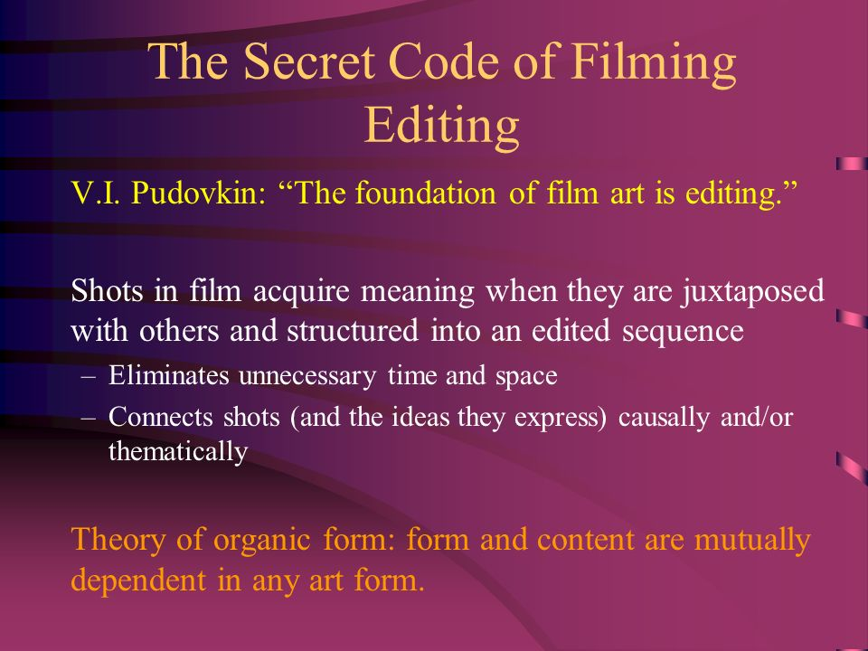
  * 但是，他认为格氏的特写镜头仍有限制，其功能仅在**解释远**景，未能开展出新意义；普多夫金坚持每个镜头应有**新的意义**，而剪辑两个镜头“**并列**”（juxtaposition）意义大于单个镜头的内容
    * 《**科洛弗档案**》中导演自始至终都运用普多夫金的剪接想法，运用**正反拍**的对剪技巧可以将实拍场景与虚构场景剪接在一起；此处纽约市民逃到地下铁站内躲避致命的怪物，将怪物与人物对剪，导演可以**加强悬疑**，很少——多半在高潮时——才会把两种生物（人与怪物）合在一个镜头内
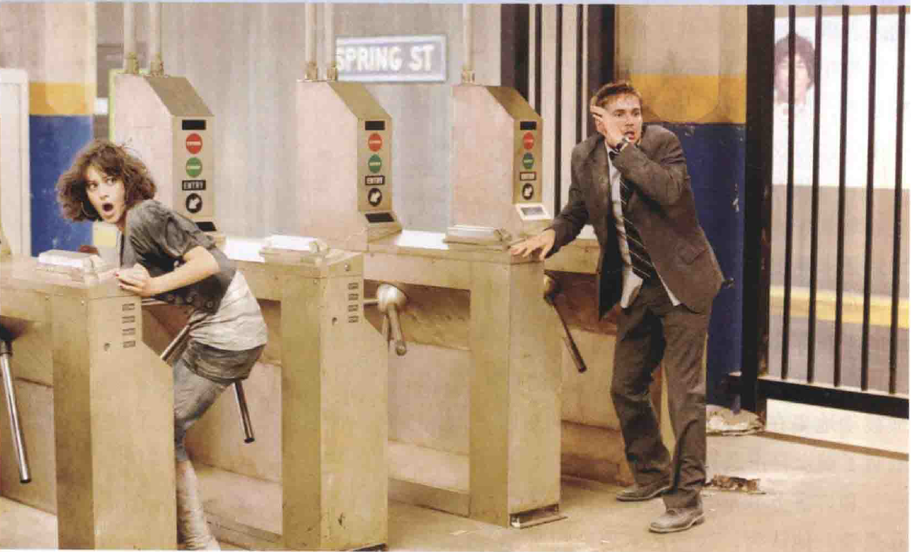
    * **希区柯克**是普多夫金剪辑理论的主要实践者，他认为“**电影即形式**”，银幕应该以它自己的语言说话，因此，每一场戏中那些未加工的素材就必须被**分割**成一片一片，然后再组合成具意义的视觉图形，如此才是“**纯粹电影**”，就如同音符是一个一个被组合之后才发出旋律
      * 《**救生艇**》中，所有情节全集中发生在这艘于大海中漂泊的救生艇上的九个人身上，这张宣传照即包含了希区柯克所有未加工的素材，它被分割成的分镜，即组成了该部电影；形式主义者坚持艺术并不存在于素材本身，而在于他们**被分割及重组的方式**之中
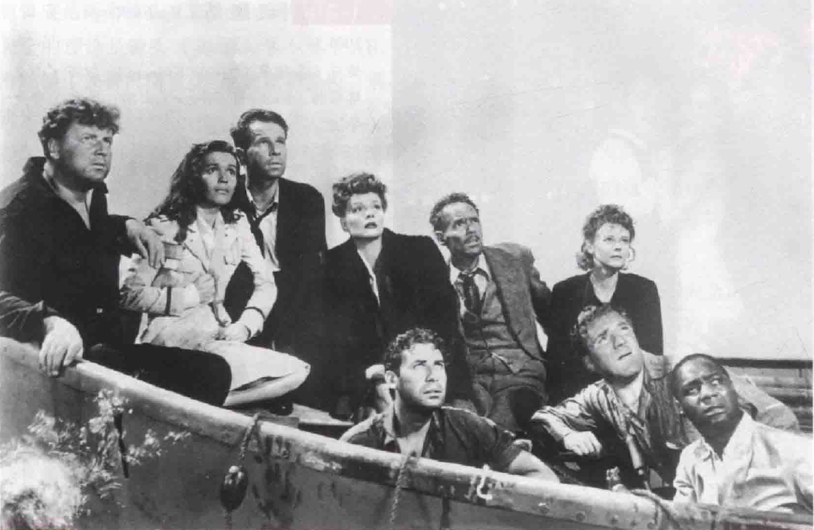
* **巴甫洛夫**（Pavlov）的心理学理论对苏联导演的影响很大，他对意念联想的观念是**库里肖夫**（Lev Kuleshov）剪辑观念的基础
  * 库里肖夫认为电影的理念是**零碎片段的组合**，这些片段不完全和真实生活有关
  * 首先，他拍摄了一个面无表情的**演员特写镜头**，将其分别与一碗汤、一具棺材及一个小女孩玩耍的镜头**并列**；把这三组镜头放给三组观众看时，大家的反应**并不相同**，大家都以为演员**很有表达能力**，他的表情根据组别被解释成饥饿、忧伤和快乐
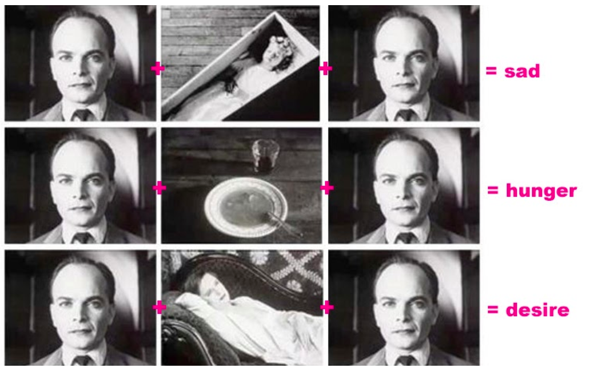
  * 由此可见，意义是由**并列**而非单独的镜头造成；这个实验也证明，有时演员不一定要会演戏，光是镜头的并列，**戏剧的效果**已经凸显
* 库里肖夫及普多夫金将电影当做**镜头与镜头间构筑并列**的艺术；**特写**用得比格里菲斯还多，以环境为影像的泉源，少用远景，而连接**大量的特写**，造成心理与情绪，甚至抽象意念的效果
  * 这一代苏联电影人的理论被当时许多评论者批评：太多的特写不但使**节奏缓慢**，而且破坏真正的时空，剥夺了场景的**真实感**
  * 普多夫金和其他苏联形式主义者却辩解说，用远景来捕捉真实，会使电影**过于接近现实**，是**剧场化**而非电影化；所以他也批判时空写实观念，指其只重表面的真实性，忽略了**真正的本质**
  * 也有些评论者认为这种操纵式的剪辑法**过度引导观众**——替观众选择过多，观众必须被动地坐在那里，接受银幕上的东西；尤其因为苏联电影多半与政治宣传密不可分，限制了观众**自由选择和评估**的机会
  * 有时跳跃式剪辑**完全适用于某些题材**，如《**谍影重重2**》主角得了失忆症，即使对武器娴熟，防卫技巧出色，却弄不清周遭是敌是；跳动的剪辑外塑了他片断的记忆，不时在下意识中晃过，强化了他的恐慌，因为他对种种片断统合不起来
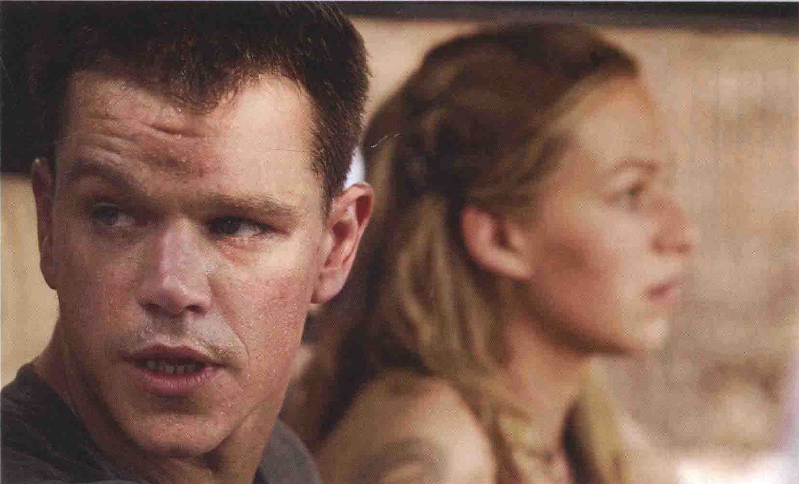
* 和许多苏联形式主义者一样，**爱森斯坦**对研究可促进创作活动的不同形式的理论很有兴趣；他认为，这些艺术理论和所有**人类活动的基本本质**有关
  * 就如古希腊哲学家**赫拉克利特**（Heraclitus），爱氏认为，自然的本质是一个**不断变动**的过程，而且这个变动往往来自冲突和矛盾的**辩证性**（dialectical）；稳定、统一只是暂时的现象，只有能量是永恒的，却永远在变换形式状态
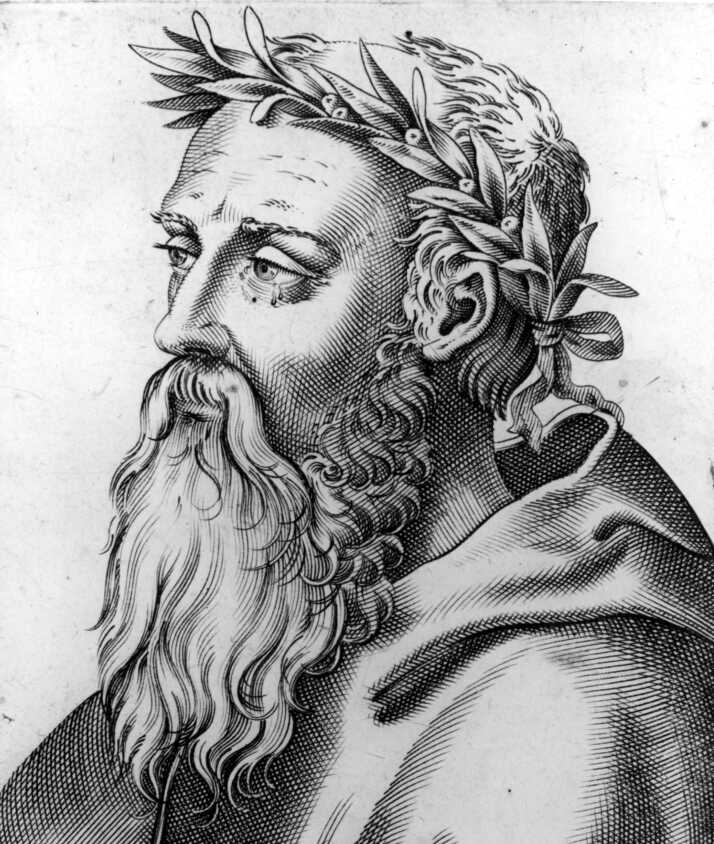
  * 爱森斯坦认为，在所有艺术里，**冲突**是具**宇宙性**的，所以艺术也当捕捉这种变动；电影作为“动”的艺术，不但该包括绘画的视觉冲突、舞蹈的动感冲突、音乐的音感冲突、对白的语言冲突，也该有小说和戏剧的角色、事物冲突
* 爱氏将这些冲突着重表现在**剪辑的艺术**上
  * 与库氏、普氏一样，他也相信电影艺术的根本在于**剪辑**，每个镜头的内容不应该是自足的，而应该与别个镜头**并列**产生新意义
  * 不过，普氏的剪辑观念对他而言还是太“机械化”和“幼稚”；他运用辩证的方法，认为剪辑应是两个镜头（正、反）**冲突**后制造出新的意念（合），镜头的转接不应**圆滑顺畅**（如普氏所言），反而该是尖锐、震撼，甚至**暴力**的
  * 普氏和爱氏的理论虽不尽相同，但**尖锐对比**的效果却完全一样；普多夫金的电影基本上是**古典形式**，他注重累积整体情感的效果，而爱森斯坦的电影则较知性地倾向**抽象的辩证**
  * 普多夫金要**表现情感**时，会运用**现场环境内物体的影像**连接成某种关系，比如它用泥泞中辗过的车子显示焦虑，他用特写拍下车轮、泥泞、推车的手、用力的脸、贲张的肌肉，累积成强烈的情绪效果；而爱氏则希望电影在连续性及文本上是**完全自由**的，他认为普多夫金**太受制于现实主义**
* 爱氏希望电影能**如文学般自由伸展**，尤其运用象征隐喻时，**从不顾及时空**；影像对他而言，不必拘泥于场景内，只要**主题有关联**即可
  * 这种观念，早在1925年他的首部电影《**罢工**》（Strike）中已经得见：被机关枪扫射的工人，接着是待宰公牛的镜头
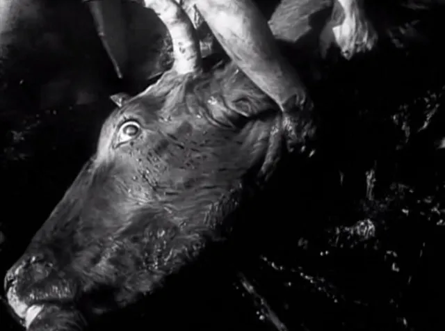
  * 这种超出场景的隐喻法，在《**战舰波将金号**》（Potemkin）也重复用到，即战舰叛兵发炮反击沙皇部队时，爱氏连接睡狮、蹲狮、快跃而起的站狮石像三个特写，象征沉睡、觉醒及起而反抗
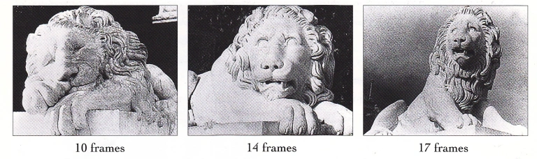
* 《**战舰波将金号**》的“**敖德萨阶梯**”片段是默片中最值得称颂的剪接片段
  * 这场戏是1905年沙皇时代**哥萨克军队屠杀老百姓**的场景，爱森斯坦将不同的人在混乱逃窜中的景象剪接，**延长**了该场戏：（1）母亲在石阶顶上带着婴儿车：（2）哥萨克军人向下面的老百姓随意开火：（3）石阶上群众逃窜的混乱：（4）母亲中弹时捂住腹部；（5）我们看到她焦虑的脸；（6）载着啼哭婴儿的婴儿车一跌，颠簸滚下石阶：（7）陌生的年轻人看着婴儿车一脸惊恐：（8）啼哭婴儿的快速特写：（9）戴眼镜妇人一脸惊恐；（10）剪回母亲，倒地而死；（11）哥萨克军人对着滚下的婴儿车挥舞着剑，年轻人喊叫；（12）快剪滚动的婴儿车；（13）哥萨克军人舞剑向着婴儿车；（14）他发狂的特写；（15）戴眼镜妇人眼睛中枪，她痛得大叫；（16）婴儿车和孩子剧烈翻倒
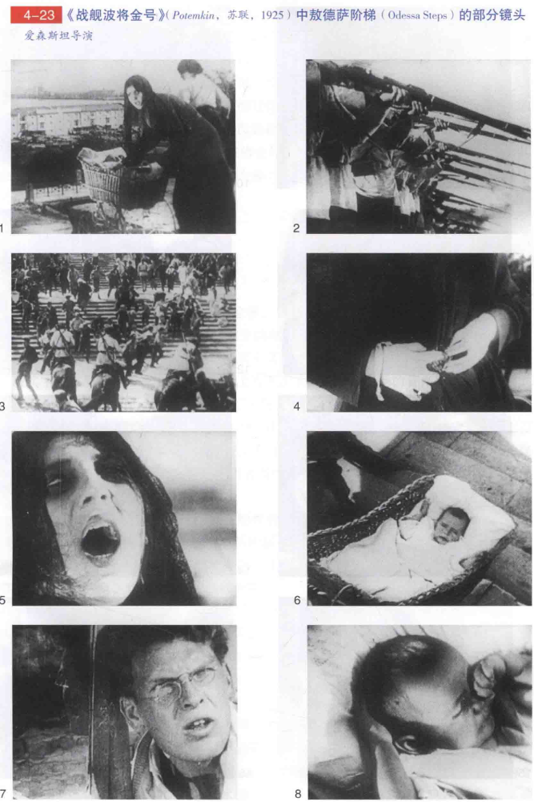
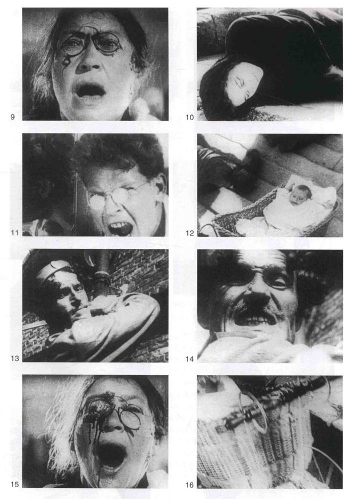
  * 这些不过是很长的段落中短短几个镜头，也许是爱森斯坦**撞击式蒙太奇**（collisionmontage，又译：冲击蒙太奇）实践最好的范例；导演将许多东西**对立排比**在一起，如特写与远景，垂直线条与水平线条，暗与明，向下动作与向上动作，移动的镜头与不动的镜头，长镜头与超短镜头等等
  * 其实爱氏电影中的表演都很**粗粝**，而且作品都折损于**拙糙的僵化教条主义**，含蓄的政治观从来就不是他的长项；不过《战舰波将金号》的“敖德萨阶梯”这一段却不像他的其他作品般过时，而且依然如当初般**充满力量**
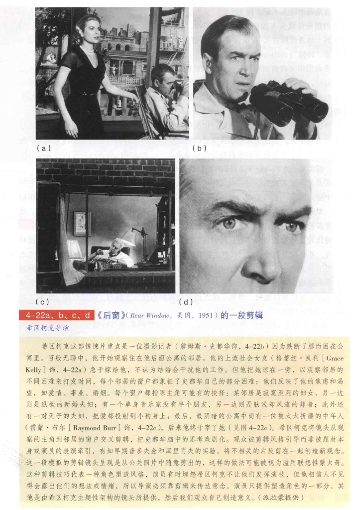